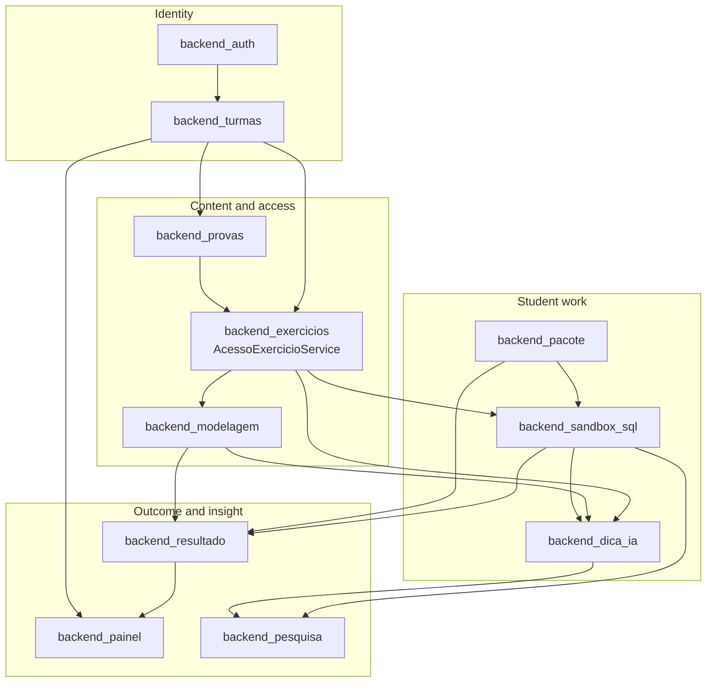
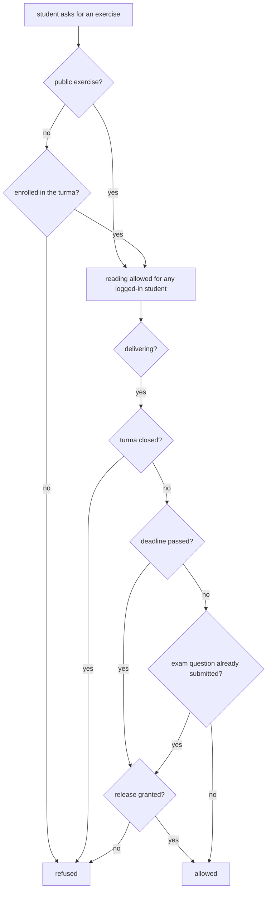

# Backend Application Services

**Location**: `ide-web-backend/src/{routes,controllers,services,repositories,dtos,utils}`  
**Purpose**: The domain layer of the IDE Web backend: everything a professor or a student can *do* in the system, on top of the platform layer described in [Backend Platform](Backend_Platform.md).

---

## Overview

`Backend_Application_Services` groups eleven feature modules. Each one is a vertical slice with the same MSC shape (`routes → controllers → services → repositories`, with Zod DTOs at the edge), and they cooperate through **repository interfaces and a few shared services**, never by reaching into each other's tables directly from a controller.

| Module | Responsibility | Document |
|---|---|---|
| Auth | Registration, login, stateful sessions (`SessaoAuth`), `requireAuth` | [backend_auth](backend_auth.md) |
| Turmas | Classes, enrollment by code (`MatriculaTurma`), closing and reopening | [backend_turmas](backend_turmas.md) |
| Exercicios | Exercise CRUD with up to three optional parts, and the single access point `AcessoExercicioService` | [backend_exercicios](backend_exercicios.md) |
| Modelagem | Conceptual (Chen) and logical modelling documents, validation, SQL generation | [backend_modelagem](backend_modelagem.md) |
| Sandbox SQL | Isolated per-student SQL execution, EXPLAIN plan, automatic grading | [backend_sandbox_sql](backend_sandbox_sql.md) |
| Provas | Exam variants, drawing, exam assistant | [backend_provas](backend_provas.md) |
| Resultado | Results, manual review, grade release | [backend_resultado](backend_resultado.md) |
| Painel | Professor and student dashboards | [backend_painel](backend_painel.md) |
| Dica IA | AI hints with quota and PII-free prompts | [backend_dica_ia](backend_dica_ia.md) |
| Pacote | PDF package and exercise finalisation | [backend_pacote](backend_pacote.md) |
| Pesquisa | Token and hit counts for the TCC research protocol (research-only) | [backend_pesquisa](backend_pesquisa.md) |

---

## Architecture

Arrows read "provides data or rules to". Identity and enrollment sit at the top; the dashboards and research counters only ever **read** what the modules above them write.

---

## How the modules fit together

### 1. Who you are and where you belong

[Backend Auth](backend_auth.md) authenticates every role with its own e-mail and password, including students. A session is stored on the server: the token carries a session id (`sid`), `requireAuth` checks that the session is not revoked and enforces a 6-hour ceiling and 1 hour of inactivity, and logout really revokes it. `POST /auth/registrar` only accepts `aluno` and `professor`; the `pesquisador` account is unique and created by a script.

[Backend Turmas](backend_turmas.md) turns the turma code into an **enrollment**, not a credential: a logged-in student uses the code once and stays in the turma until the professor closes it. One student may be in several turmas, and each `MatriculaTurma` stores the exam variant drawn for that student in that turma.

### 2. What you may open: one access point

Access to an exercise goes through a single service, `AcessoExercicioService`, in [Backend Exercicios](backend_exercicios.md), with `exigirLeitura`, `exigirEntrega` and `exigirTeste`.

Delivery checks, in this order: turma closed, then deadline (`Exercicio.prazo`), then single submission for exam questions (`prova_id` set and a submission already exists). `ResultadoExercicio.envio_liberado_em` is the escape valve: it grants exactly one submission, crosses both the deadline and the single-submission rule, and is consumed on submit. Testing in the sandbox (`exigirTeste`) is refused for exam questions. A public exercise does not freeze together with its origin turma.

### 3. Doing the work

- [Backend Sandbox SQL](backend_sandbox_sql.md) runs the student's SQL in a schema `sandbox_<exercicio_id>_<usuario_id>` of a **separate** database, under a per-student role. Submitting returns the EXPLAIN plan and, when the exercise has an SQL gabarito, records the hit in `ResultadoExercicio.sql_correto` without overwriting a manual review (`revisado = true` freezes the value). The free-study schema `sandbox_livre_<usuario_id>` is the only one where the student has `CREATE`.
- [Backend Modelagem](backend_modelagem.md) stores and validates the modelling document (v2: conceptual, logical and conversion data) with the same Zod schema as the frontend, and generates PostgreSQL DDL from the logical model.
- [Backend Dica IA](backend_dica_ia.md) sends `{ contexto, estadoMer?, estadoSql? }` to the LLM provider: a summary of the conceptual model, the logical model as generated SQL and the query, asking for coherence among them. There is a limit of 5 hints per context and the prompt carries no personal data.
- [Backend Pacote](backend_pacote.md) builds the PDF with up to two model images and the logical SQL. Downloading is repeatable and side-effect-free; **finalising** is a separate action that stamps `finalizado_em` and drops the schema.

### 4. Grading and insight

[Backend Resultado](backend_resultado.md) holds one `ResultadoExercicio` per student and exercise. SQL grading is automatic (result-set comparison, ignoring order); ER and essay parts are graded by hand on a **0.0 to 10.0** scale. [Backend Painel](backend_painel.md) reads everything above to draw the professor matrix and the student's own progress, and [Backend Pesquisa](backend_pesquisa.md) exposes attempt, hit and hint counts for the research CSV.

---

## Shared conventions

| Convention | Where it shows |
|---|---|
| Layers `routes → controllers → services → repositories` | Every module; wiring by hand in each `*.routes.ts` |
| Controllers only parse, delegate and answer | `BaseController.handleSuccess`, no business rules |
| Zod at the edge (`dtos/`) | Body and query validation; `ValidationError` with the issues |
| Domain errors in Portuguese | `NotFoundError('Turma')` builds "Turma não encontrado(a)" because the message reaches the user |
| Ownership checks in the service | "You are not the professor of this turma" is decided in the service, not the route |
| Batched reads for aggregates | `groupBy` and `findMany` over id lists, then joins in memory (see [Backend Painel](backend_painel.md)) |
| Role gates in the route | `requireAuth` then `requirePapel(...)` |

## Where to go next

- Platform and error classes: [Backend Platform](Backend_Platform.md), [backend_core](backend_core.md), [backend_errors](backend_errors.md)
- The screens that use these endpoints: [Frontend Application](Frontend_Application.md)
- The whole system at once: [overview](overview.md)
