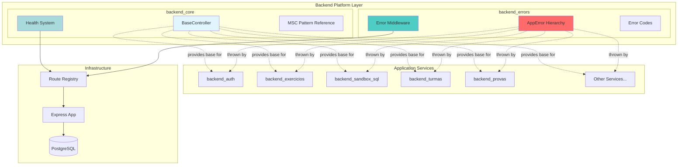
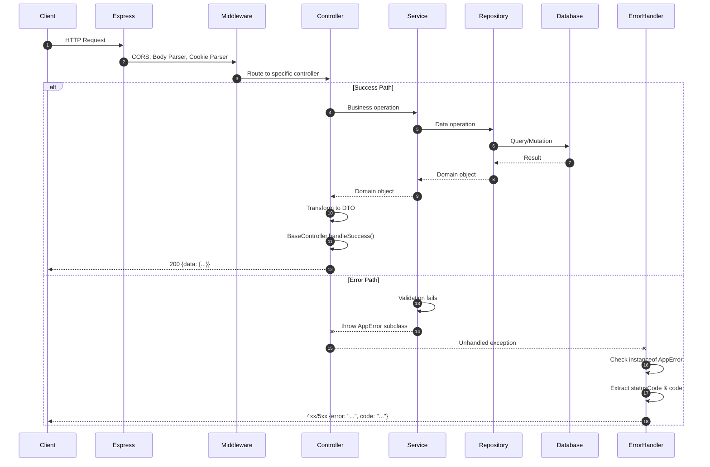
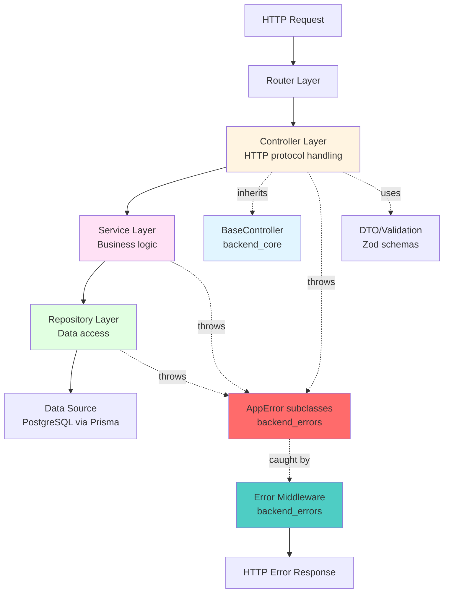
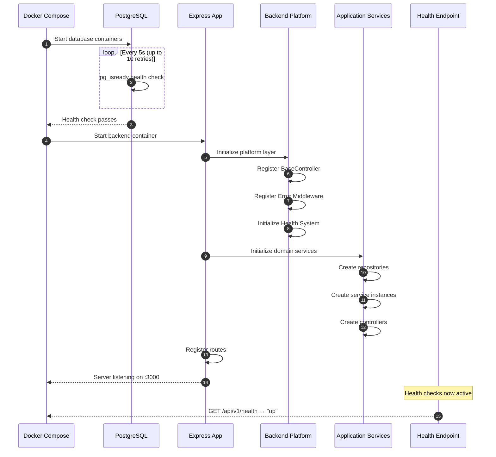
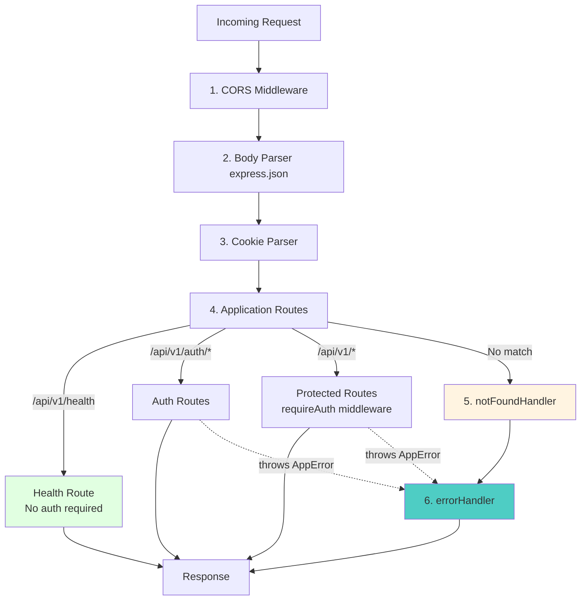
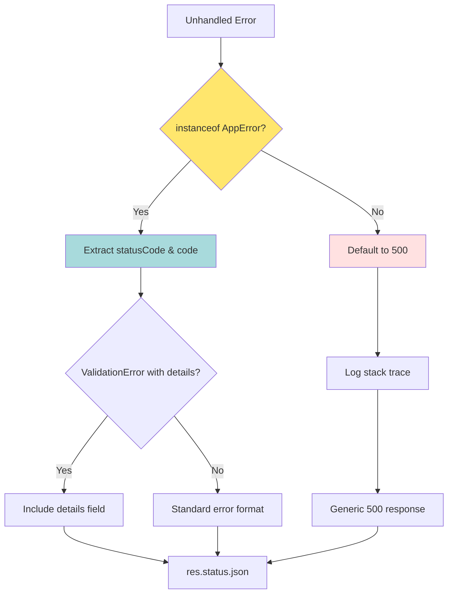

# Backend Platform Module

**Location**: `ide-web-backend/src`  
**Purpose**: Foundational platform layer providing architectural patterns, error handling, and operational monitoring for the IDE Web backend application.

---

## Table of Contents

- [Overview](#overview)
- [Module Architecture](#module-architecture)
- [Core Subsystems](#core-subsystems)
- [Design Patterns](#design-patterns)
- [Integration Patterns](#integration-patterns)
- [Component Reference](#component-reference)
- [Related Modules](#related-modules)

---

## Overview

### Purpose

The `Backend_Platform` module serves as the architectural foundation for the entire IDE Web backend. It establishes:

1. **Architectural Patterns**: MSC (Model-Service-Controller) layering pattern used across all backend services
2. **Error Management**: Type-safe, HTTP-compliant error handling with Portuguese user-facing messages
3. **Operational Monitoring**: Health check system for container orchestration and service reliability
4. **Consistency Layer**: Uniform response formatting and error propagation across all API endpoints

### Technology Stack

- **Runtime**: Node.js 20+ (Alpine Linux in Docker containers)
- **Framework**: Express 4.x
- **Language**: TypeScript with strict type checking
- **Architecture**: MSC (Model-Service-Controller) pattern
- **Database ORM**: Prisma with PostgreSQL adapter
- **Deployment**: Docker containers with health monitoring

### Key Characteristics

- **Layered Architecture**: Clear separation between HTTP, business logic, and data access
- **Type Safety**: Comprehensive TypeScript typing from DTOs to domain models
- **Portuguese-First**: All user-facing messages in Brazilian Portuguese
- **Fail-Fast**: Clear distinction between transient and permanent failures
- **Extensible**: Provides abstract base classes for consistent implementation patterns

---

## Module Architecture

### Platform Layer Structure



### Request-Response Flow



---

## Core Subsystems

The `Backend_Platform` module consists of two primary subsystems:

### 1. backend_core: Architectural Foundation

**Purpose**: Provides the structural patterns and health monitoring that all backend services build upon.

**Key Components**:
- **BaseController**: Abstract base class for uniform HTTP response handling
- **Health Check System**: Stateless process monitoring for container orchestration
- **MSC Pattern Reference**: Complete implementation demonstrating the layering pattern

**Integration**: Every domain controller in the system extends `BaseController`, inheriting standardized response formatting and establishing a consistent API contract.

**Documentation**: See [backend_core.md](backend_core.md) for detailed component specifications.

### 2. backend_errors: Error Management

**Purpose**: Centralized error hierarchy providing type-safe, HTTP-compliant error handling with Portuguese user messages.

**Key Components**:
- **AppError Hierarchy**: Base class with specialized subclasses for each error category
- **Error Codes**: Machine-readable identifiers for programmatic error handling
- **Error Middleware**: Global error handler that transforms exceptions into HTTP responses

**Integration**: All backend services throw `AppError` subclasses, which are automatically caught and transformed into properly formatted HTTP error responses.

**Documentation**: See [backend_errors.md](backend_errors.md) for complete error type reference.

---

## Design Patterns

### MSC (Model-Service-Controller) Pattern

The platform enforces a strict layering pattern across all backend services:



**Layer Responsibilities**:

| Layer | Responsibility | Error Handling | Example |
|-------|---------------|----------------|---------|
| **Controller** | HTTP protocol, request/response mapping | Propagates `AppError` | `ExercicioController.buscar()` |
| **Service** | Business logic, orchestration | Throws `ValidationError`, `ForbiddenError` | `ExercicioService.criar()` |
| **Repository** | Data access, query construction | Throws `NotFoundError`, `SandboxIndisponivelError` | `ExercicioRepository.findById()` |
| **Model** | Domain entities, value objects | No error logic | `Exercicio`, `HealthStatus` |
| **DTO** | API contracts, Zod validation | Validation errors → `ValidationError` | `CreateExercicioDto` |

### Dependency Injection Pattern

**Manual Constructor Injection**:

```typescript
// Route file pattern (applied across all domain routes)
const repository = new ConcreteRepository();
const service = new ConcreteService(repository);
const controller = new ConcreteController(service);

export const routes = Router();
routes.get('/resource', asyncHandler((req, res) => controller.method(req, res)));
```

**Benefits**:
- Explicit dependency graph (no magic DI container)
- Easy to test (mock interfaces at any layer)
- Clear initialization order
- Traceable through static analysis

### Error Propagation Strategy

```mermaid
graph TD
    A[Repository Layer] -->|throw NotFoundError| B[Service Layer]
    B -->|propagate unchanged| C[Controller Layer]
    
    D[Service Layer] -->|throw ValidationError| C
    E[Middleware requireAuth] -->|throw UnauthorizedError| C
    
    C -->|unhandled exception| F[Express Error Middleware]
    
    F -->|instanceof AppError?| G{Check Type}
    G -->|Yes| H[Extract statusCode, code, message]
    G -->|No| I[500 Internal Server Error]
    
    H --> J[Format JSON Response<br/>{error, code, details?}]
    I --> K[Log Stack + Generic Response]
    
    J --> L[HTTP Response to Client]
    K --> L
    
    style F fill:#4ecdc4
    style G fill:#ffe66d
    style H fill:#a8dadc
    style I fill:#ffe1e1
```

**Key Principles**:

1. **Never Catch Internally**: Services/repositories throw errors, don't catch them
2. **Type-Based Routing**: Error middleware routes by `instanceof AppError`
3. **Automatic Status Mapping**: Each error class defines its HTTP status
4. **Portuguese Messages**: All error messages reach end users in Portuguese
5. **Structured Codes**: Machine-readable codes for frontend programmatic handling

---

## Integration Patterns

### Application Bootstrap Sequence



### Middleware Stack Order

From `ide-web-backend/src/app.ts`:



**Rationale**:
- **Health first**: `/api/v1/health` registered before authentication to enable unauthenticated monitoring
- **Error handler last**: Catches all unhandled errors from upstream middleware and routes
- **Not found before errors**: Ensures unknown routes get 404, not 500

---

## Component Reference

### BaseController (backend_core)

**Purpose**: Abstract base class providing uniform response formatting.

**Contract**:
```typescript
abstract class BaseController {
  protected handleSuccess(res: Response, data: unknown, statusCode: number = 200): void;
}
```

**Usage**:
```typescript
export class ExercicioController extends BaseController {
  buscar = async (req: Request, res: Response): Promise<void> => {
    const exercicio = await this.exercicioService.buscar(req.params.id);
    this.handleSuccess(res, toExercicioDto(exercicio));
  };
}
```

**Response Format**: All successful responses follow `{ data: T }` envelope.

**Documentation**: [backend_core.md § BaseController](backend_core.md#basecontroller)

---

### Health Check System (backend_core)

**Purpose**: Zero-dependency health endpoint for container orchestration.

**Endpoint**: `GET /api/v1/health`

**Response**:
```json
{
  "data": {
    "status": "up" | "degraded" | "down",
    "uptimeSeconds": 127.483,
    "checkedAt": "2026-09-22T14:32:15.823Z"
  }
}
```

**State Logic**:
- `degraded`: Process uptime < 5 seconds (startup phase)
- `up`: Process uptime ≥ 5 seconds (operational)
- `down`: Reserved for future use (database connectivity checks)

**Dependencies**: None (uses only `process.uptime()`)

**Documentation**: [backend_core.md § Health Check System](backend_core.md#health-check-system)

---

### AppError Hierarchy (backend_errors)

**Purpose**: Type-safe error classes mapping domain failures to HTTP responses.

**Base Class**:
```typescript
abstract class AppError extends Error {
  abstract readonly statusCode: number;
  abstract readonly code: string;
}
```

**Subclasses**:

| Class | Status | Code | Use Case |
|-------|--------|------|----------|
| `ValidationError` | 400 | `VALIDATION_ERROR` | Input validation, Zod errors |
| `UnauthorizedError` | 401 | `UNAUTHORIZED` | Invalid/missing JWT, expired session |
| `ForbiddenError` | 403 | `FORBIDDEN` | Role/permission violations |
| `NotFoundError` | 404 | `NOT_FOUND` | Resource not found in database |
| `ConflictError` | 409 | `CONFLICT` | Duplicate resources, state conflicts |
| `TooManyRequestsError` | 429 | `TOO_MANY_REQUESTS` | Rate limiting, quota exhaustion |
| `SandboxIndisponivelError` | 503 | `SANDBOX_UNAVAILABLE` | SQL sandbox DB connection failure |
| `LlmIndisponivelError` | 503 | `LLM_UNAVAILABLE` | LLM provider transient failure |
| `LlmNaoConfiguradoError` | 503 | `LLM_NAO_CONFIGURADO` | Missing `LLM_API_KEY` (permanent) |

**Documentation**: [backend_errors.md § Error Class Hierarchy](backend_errors.md#error-class-hierarchy)

---

### Error Middleware (backend_errors)

**Purpose**: Global error handler transforming exceptions into HTTP responses.

**Location**: `ide-web-backend/src/middlewares/errorHandler.ts`

**Logic Flow**:



**Response Format**:
```typescript
// Success (from BaseController)
{ data: T }

// Error (from errorHandler)
{ error: string, code: string, details?: unknown }
```

**Documentation**: [backend_errors.md § Error Middleware](backend_errors.md#error-flow-through-the-application)

---

## Related Modules

### Dependent Application Services

All backend application services build on the platform layer:

- **[backend_auth](backend_auth.md)**: Session management, JWT validation
  - Uses: `BaseController`, `UnauthorizedError`, `ForbiddenError`
  
- **[backend_exercicios](backend_exercicios.md)**: Exercise CRUD, visibility rules
  - Uses: `BaseController`, `NotFoundError`, `ValidationError`, `ForbiddenError`
  
- **[backend_sandbox_sql](backend_sandbox_sql.md)**: SQL execution sandbox
  - Uses: `BaseController`, `SandboxIndisponivelError`, `ValidationError`
  
- **[backend_turmas](backend_turmas.md)**: Class management, enrollment
  - Uses: `BaseController`, `NotFoundError`, `ConflictError`
  
- **[backend_provas](backend_provas.md)**: Exam creation, student assignment
  - Uses: `BaseController`, `NotFoundError`, `ConflictError`
  
- **[backend_resultado](backend_resultado.md)**: Exercise grading, feedback
  - Uses: `BaseController`, `NotFoundError`, `ForbiddenError`
  
- **[backend_painel](backend_painel.md)**: Dashboard aggregation
  - Uses: `BaseController`, `NotFoundError`, `ForbiddenError`
  
- **[backend_dica_ia](backend_dica_ia.md)**: LLM-powered hints
  - Uses: `BaseController`, `LlmNaoConfiguradoError`, `LlmIndisponivelError`, `TooManyRequestsError`
  
- **[backend_pacote](backend_pacote.md)**: PDF report generation
  - Uses: `BaseController`, `NotFoundError`, `ForbiddenError`
  
- **[backend_modelagem](backend_modelagem.md)**: ER diagram persistence
  - Uses: `BaseController`, `NotFoundError`, `ValidationError`
  
- **[backend_pesquisa](backend_pesquisa.md)**: Research data collection
  - Uses: `BaseController`, `NotFoundError`, `ForbiddenError`

### Infrastructure Dependencies

- **[infrastructure](infrastructure.md)**: Docker Compose orchestration
  - Platform health checks integrate with `depends_on` conditions
  
- **[backend_build_config](backend_build_config.md)**: TypeScript configuration
  - Strict type checking enforces platform contracts

---

## Summary

The `Backend_Platform` module establishes the architectural foundation for the IDE Web backend:

✅ **Consistent Patterns**: MSC layering enforced through `BaseController` and dependency injection  
✅ **Type-Safe Errors**: Comprehensive error hierarchy with HTTP-compliant status codes  
✅ **Portuguese UX**: All user-facing messages in grammatically correct Brazilian Portuguese  
✅ **Operational Reliability**: Zero-dependency health checks for container orchestration  
✅ **Developer Experience**: Clear abstractions that prevent common mistakes and ensure API consistency  

Every backend service builds on this foundation, creating a maintainable, predictable codebase aligned with the project's architectural guidelines (see `CLAUDE.md` for complete architecture documentation).

---

**Document Version**: 1.0  
**Last Updated**: 2026-09-22  
**Module Coverage**: Complete through Fase 10 (platform fully implemented)