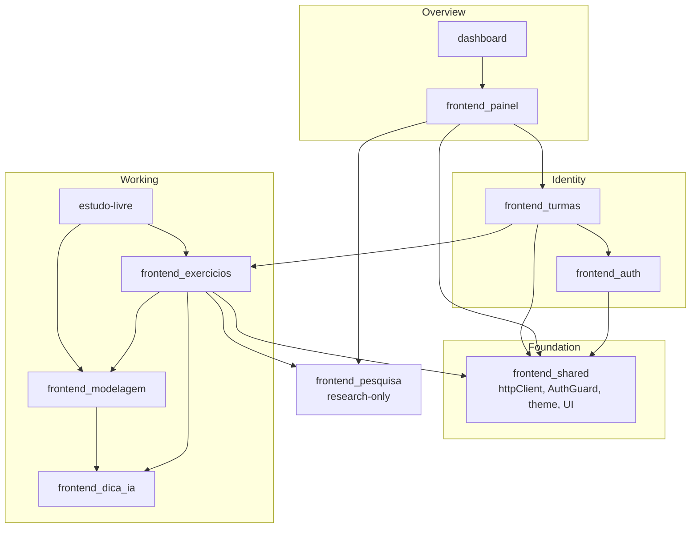
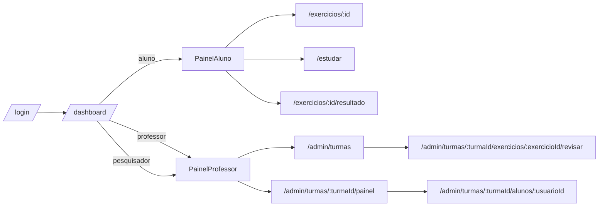

# Frontend Application

**Location**: `ide-web-front/src/features/`  
**Purpose**: The feature layer of the IDE Web frontend: everything a user sees and does, built on top of the shared foundation described in [Frontend Shared](frontend_shared.md).

---

## Overview

The frontend is a **React + TypeScript + Vite** single-page application, organised **by feature** (`features/<domain>/`), where each feature owns its `components/`, `hooks/`, `services/`, `types.ts` and an `index.ts` that is its only public door. Data comes from the Node API through TanStack Query, styled with Tailwind and light/dark themes.

| Module | Responsibility | Document |
|---|---|---|
| Auth | Landing, login, registration, `useAuth` | [frontend_auth](frontend_auth.md) |
| Turmas | Create, close and reopen classes; student enrollment by code | [frontend_turmas](frontend_turmas.md) |
| Exercicios | Exercise workspace (SQL, modelling, essay), exam tools, review, PDF | [frontend_exercicios](frontend_exercicios.md) |
| Modelagem | Conceptual and logical editors, conversion assistant, SQL generation | [frontend_modelagem](frontend_modelagem.md) |
| Painel | Professor and student dashboards, class matrix, by-student review | [frontend_painel](frontend_painel.md) |
| Dica IA | "Pedir dica" button and its error handling | [frontend_dica_ia](frontend_dica_ia.md) |
| Pesquisa | TCC participant flow and researcher tools (research-only) | [frontend_pesquisa](frontend_pesquisa.md) |
| Shared | `httpClient`, routes, guard, theme, UI primitives | [frontend_shared](frontend_shared.md) |

Three smaller features have no document of their own:

| Feature | What it is |
|---|---|
| `features/dashboard` | `DashboardPage`: a **role router** at `/dashboard`. It renders `TopNav` and then `PainelAluno` for students, `PainelProfessor` for professors, and both for the researcher plus a shortcut card to `/admin/pesquisa` |
| `features/estudo-livre` | `/estudar`, the student's IDE **without a class**, in three tabs: "Meu banco" (`BancoLivre`, SQL run in the personal `sandbox_livre_<usuario_id>` schema, where the student may `CREATE`, with a confirmed "Limpar meu banco"), "Modelagem" (`ModelagemLivre`, a draft that lives **only in the browser**, with "Usar no meu banco" carrying the generated DDL to the first tab) and "Exercícios públicos" |
| `features/legal` | `PoliticaPrivacidadePage`, the public privacy policy |

---

## Architecture

Arrows read "uses". Two of them are the only places where domain code leaks into another feature on purpose: the dashboard hosts the research banner, and the exercise page checks the research block.

---

## Routes and roles

The whole table is in `app/routes.tsx` (see [Frontend Shared](frontend_shared.md)); every page is lazy-loaded.

| Role | Reaches |
|---|---|
| `aluno` | dashboard, `/estudar`, exercises and results, and the research flow (`/tcle`, `/pesquisa/*`) |
| `professor` | dashboard, `/admin/turmas`, the class matrix, the by-student review |
| `pesquisador` | everything the professor has, plus `/admin/pesquisa` |

The frontend guard only steers navigation. **Real authorisation always happens in the backend**, which is also why the exam copy block and the research block for the control group are described as deterrence.

---

## Cross-cutting conventions

| Convention | Detail |
|---|---|
| **Import through the feature's `index.ts`** | The exception is a light service or hook when the feature also exports a heavy page. `ExercicioPage` loads Monaco, so consumers import `~features/exercicio/services/exercicioService` directly. This already bit once: a needless import broke a jsdom test through Monaco |
| **Server state in TanStack Query** | `staleTime` 60 s by default, 30 s for dashboards. Mutations invalidate the related key (`['painel', ...]`, `['turmas', ...]`) |
| **Validation with Zod, mirrored from the backend** | The modelling document, the exercise and the review schemas have the same shape as the backend DTOs |
| **Errors in Portuguese, from the server** | `HttpError.message` is already text for the user; components show it in a `role="alert"` element |
| **Accessibility** | Real `<table>` for the matrix, text labels beside colours, `aria-live` for waiting states, `aria-invalid` and `aria-describedby` on inputs |
| **Silent session renewal** | `httpClient` refreshes once on a 401 and retries |
| **No secrets in the browser** | The cookie is `httpOnly`; the research token is short-lived and carries no name or e-mail |

## Testing

- Unit and component tests sit beside the code (`*.test.ts(x)`), with jsdom.
- Browser tests: `npm run e2e` (Playwright and the system Chrome, with a mocked API, `tests/e2e/*.e2e.ts`).

## Removal note

`frontend_pesquisa`, `features/tcle`, the research parts of `features/admin`, the research banner in `PainelAluno` and the research block in `ExercicioPage` are **research-only** and are removed by the author after data collection. The rest of the application does not depend on them.

## Where to go next

- The backend these screens call: [Backend Application Services](Backend_Application_Services.md)
- The whole system at once: [overview](overview.md)
