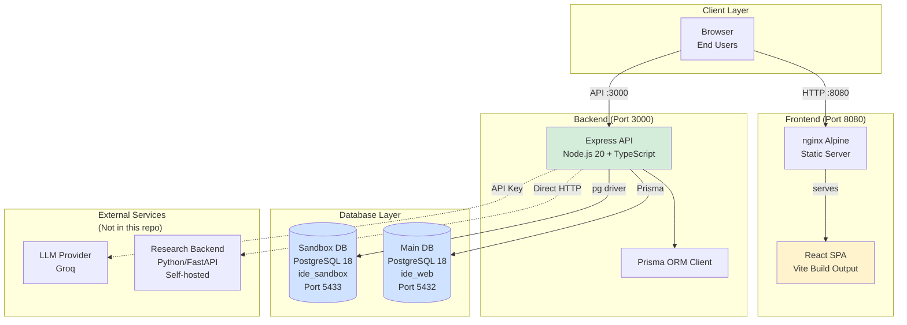
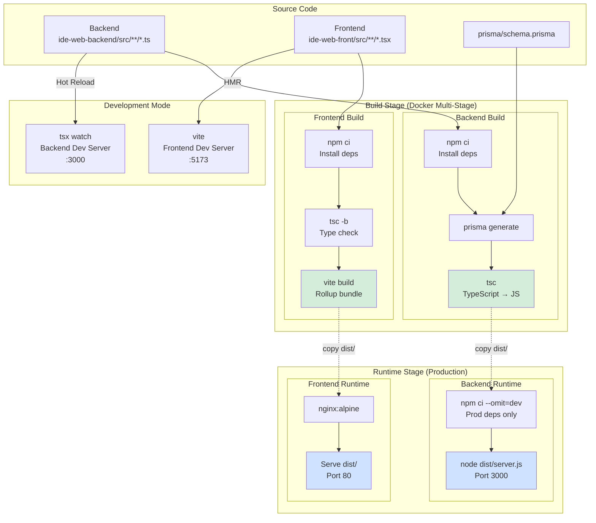
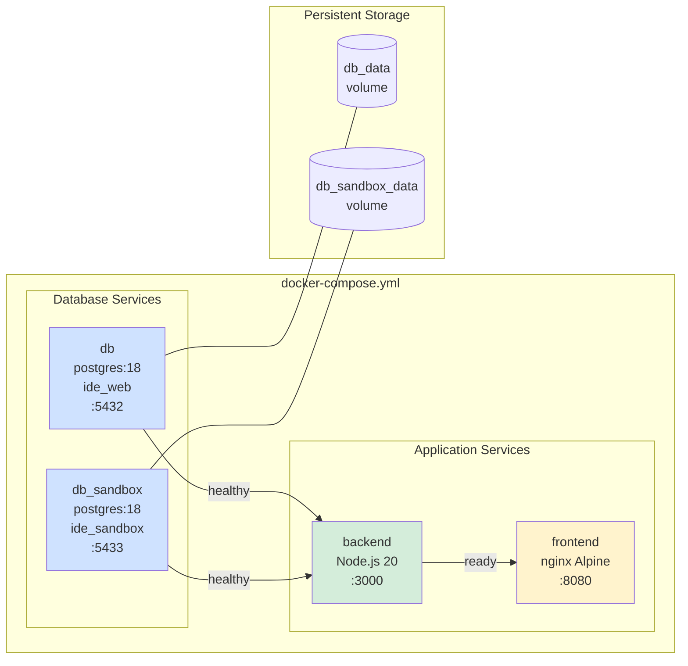
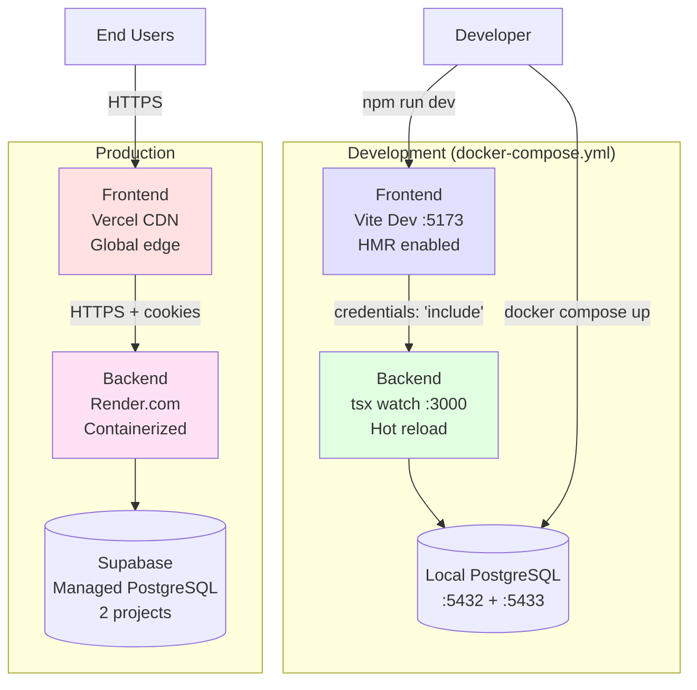
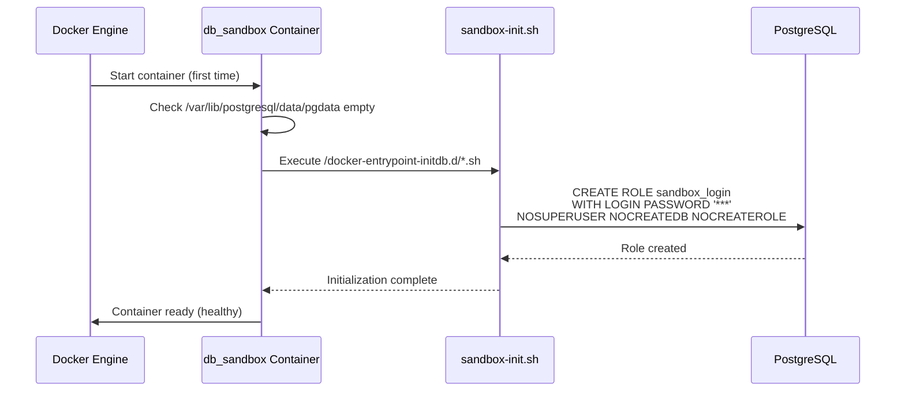
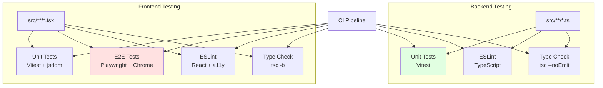

# Infrastructure & Build Pipeline

## Overview

The **Infrastructure & Build Pipeline** module provides the complete containerized development and deployment environment for IDE Web. It orchestrates Docker containers, manages multi-stage builds for both frontend and backend, provisions databases with security isolation, and configures web server delivery—all while maintaining clear separation between development and production environments.

### Purpose

This module serves as the foundation for the entire application stack, enabling:

1. **Containerized Development**: Consistent development environment across team members via Docker Compose
2. **Build Orchestration**: TypeScript compilation, bundling, and optimization for both Node.js backend and React frontend
3. **Database Provisioning**: Automated setup of main application database and isolated SQL sandbox for student exercises
4. **Production Deployment**: Multi-stage Docker builds that minimize image size and exclude development dependencies
5. **Development Workflow**: Hot-reload development servers, automated testing, and type checking

---

## Architecture Overview

The IDE Web infrastructure implements a containerized microservices architecture with strict separation of concerns:



### Key Architectural Decisions

1. **Database Separation**: Main application data (users, exercises, submissions) is isolated from student SQL sandbox execution to prevent privilege escalation and resource contention.

2. **Multi-Stage Builds**: Both backend and frontend use Docker multi-stage builds to minimize production image size (~60% reduction) and separate build-time from runtime dependencies.

3. **Health Checks**: Database containers implement health checks to ensure dependent services wait for database readiness before starting, preventing connection failures during startup.

4. **Build Tool Optimization**: 
   - **Backend**: TypeScript compilation with strict mode, CommonJS output for Node.js
   - **Frontend**: Vite for ESM-native development with HMR, Rollup for production bundling

---

## Build Pipeline Architecture

The build pipeline spans three distinct contexts: **development** (hot-reload), **Docker build** (containerization), and **production deployment**.



### Build Pipeline Stages

**Stage 1: Development**
- **Backend**: `tsx watch` for in-memory TypeScript execution with hot reload
- **Frontend**: Vite dev server with React Fast Refresh and instant HMR
- **Databases**: Docker Compose spins up PostgreSQL containers with health checks
- **No compilation artifacts**: Everything runs from source or in-memory

**Stage 2: Docker Build**
- **Backend**: TypeScript → CommonJS compilation to `dist/`, Prisma client generation
- **Frontend**: TypeScript type checking (`tsc -b`) + Vite production bundle (tree shaking, minification, code splitting)
- **Multi-stage optimization**: Build dependencies discarded, only runtime dependencies remain
- **Image size**: Backend ~150MB (vs ~500MB build stage), Frontend ~40MB (nginx + static files)

**Stage 3: Production Deployment**
- **Backend**: Deployed to Render.com as Docker container, connects to Supabase PostgreSQL
- **Frontend**: Deployed to Vercel CDN, static files served with aggressive caching
- **Environment injection**: `DATABASE_URL`, `JWT_SECRET`, `VITE_API_URL` set at runtime/build time

---

## Container Orchestration

Docker Compose orchestrates four services with dependency management:



### Service Definitions

| Service | Image | Purpose | Health Check | Dependencies |
|---------|-------|---------|--------------|--------------|
| **db** | `postgres:18` | Main application database via Prisma | `pg_isready -U ide_app -d ide_web` | None |
| **db_sandbox** | `postgres:18` | Isolated SQL sandbox for student exercises | `pg_isready -U ide_sandbox_admin -d ide_sandbox` | None |
| **backend** | Custom (Node.js 20) | REST API, business logic | N/A | `db`, `db_sandbox` (healthy) |
| **frontend** | Custom (nginx) | Serves React SPA | N/A | `backend` (ready) |

**Startup sequence**:
1. Databases start first, run health checks every 5 seconds
2. Once both databases report healthy, backend starts (waits via `depends_on`)
3. Frontend starts after backend is ready
4. Total startup time: ~15-20 seconds (database initialization + migrations)

---

## Core Components

The module consists of three child components, each handling a distinct aspect of infrastructure:

### 1. Infrastructure ([infrastructure](infrastructure.md))

**Purpose**: Container orchestration, database provisioning, and deployment architecture.

**Key responsibilities**:
- Docker Compose service definitions
- Database initialization scripts (`sandbox-init.sh` creates `sandbox_login` role)
- nginx configuration for SPA routing and asset caching
- Production deployment architecture (Vercel + Render + Supabase)

**Critical files**:
- `docker-compose.yml` - Service orchestration
- `ide-web-backend/scripts/sandbox-init.sh` - Sandbox database setup
- `ide-web-front/nginx.conf` - Web server configuration

### 2. Backend Build Configuration ([backend_build_config](backend_build_config.md))

**Purpose**: TypeScript compilation, dependency management, and build tooling for Node.js backend.

**Key responsibilities**:
- Three TypeScript configurations (`tsconfig.json`, `tsconfig.eslint.json`, `tsconfig.tests.json`)
- npm scripts for development (`tsx`), production build (`tsc`), testing (Vitest), and linting (ESLint)
- Prisma client generation and schema management
- Docker multi-stage build definition

**Critical files**:
- `ide-web-backend/package.json` - Dependencies and build scripts
- `ide-web-backend/tsconfig.json` - Compilation settings (strict mode, ES2022, CommonJS)
- `ide-web-backend/Dockerfile` - Multi-stage production build

**Tech stack**:
- **TypeScript 5.6.3** with strict mode enabled
- **tsx** for hot-reload development
- **Prisma 7.9.1** for ORM and migrations
- **Vitest** for unit testing

### 3. Frontend Build Configuration ([frontend_build_config](frontend_build_config.md))

**Purpose**: Vite bundling, TypeScript project references, and testing infrastructure for React frontend.

**Key responsibilities**:
- Vite configuration with React plugin and Tailwind CSS
- TypeScript project references (`tsconfig.app.json` for app, `tsconfig.node.json` for build tools)
- Path aliases (`@/*`, `~features/*`, `~components/*`)
- Unit testing with Vitest + jsdom
- E2E testing with Playwright (real Chrome browser)

**Critical files**:
- `ide-web-front/package.json` - Dependencies and build scripts
- `ide-web-front/vite.config.ts` - Build tool configuration
- `ide-web-front/tsconfig.json` - Root orchestrator for project references
- `ide-web-front/playwright.config.ts` - E2E test configuration

**Tech stack**:
- **Vite 8.2.0** for ESM-native builds and HMR
- **TypeScript 6.0.2** with project references
- **React 19.2.8** + React Router 7.18.2
- **Vitest 4.1.11** (unit tests) + **Playwright 1.63.0** (E2E tests)

---

## Development vs Production

The infrastructure supports two distinct deployment modes with different characteristics:



### Comparison

| Aspect | Development | Production |
|--------|-------------|------------|
| **Frontend** | Vite dev server (:5173), HMR | Vercel CDN, static files |
| **Backend** | tsx watch (:3000), hot reload | Render.com container, node compiled JS |
| **Main DB** | Local PostgreSQL (:5432) | Supabase (separate project) |
| **Sandbox DB** | Local PostgreSQL (:5433) | Supabase (separate project) |
| **Build** | In-memory (no `dist/`) | Multi-stage Docker builds |
| **SSL/TLS** | None (HTTP) | Managed by hosting providers |
| **Environment** | `.env` file | Hosting platform secrets |
| **CORS** | `http://localhost:8080` | Vercel domain allowlist |

**Development startup**:
```bash
# 1. Set environment variables in .env
# 2. Start all services
docker compose up -d

# 3. Access application
# Frontend: http://localhost:8080
# Backend: http://localhost:3000
```

**Production deployment**:
- **Frontend**: Vite build with `VITE_API_URL` injected → Vercel CDN
- **Backend**: Docker build → Render.com with `DATABASE_URL` pointing to Supabase
- **Databases**: Supabase projects require manual `sandbox_login` role setup (equivalent to `sandbox-init.sh`)

---

## Database Initialization

The sandbox database requires special initialization to support secure per-student SQL execution:



**Purpose of `sandbox_login` role**:
- **Provisioning role** (`ide_sandbox_admin`): Creates schemas and grants permissions
- **Execution role** (`sandbox_login`): Authenticates and assumes student identities via `SET ROLE exec_<usuario_id>`
- Each request performs `SET ROLE` to assume the student's identity
- Per-student execution roles (`exec_<usuario_id>`) are created on-demand by `SandboxProvisioningRepository`

**Security model**:
- `sandbox_login` has NO privileges by default (not even schema access)
- This separation enforces principle of least privilege for runtime execution
- Students cannot escalate privileges or access other students' schemas

See [backend_sandbox_sql](backend_sandbox_sql.md) for detailed sandbox security architecture.

---

## Testing Infrastructure

The module supports multiple testing strategies across development and CI/CD:



### Backend Testing

- **Framework**: Vitest (Vite-native test runner)
- **Environment**: Node.js (no browser simulation needed)
- **Type checking**: Three separate configs validate source, tests, and scripts
- **Run**: `npm test` or `docker compose exec backend npm test`

### Frontend Testing

**Unit Tests**:
- **Framework**: Vitest + jsdom (DOM simulation)
- **UI Testing**: React Testing Library
- **Limitation**: Cannot test Monaco Editor or React Flow → falls back to E2E

**End-to-End Tests**:
- **Framework**: Playwright
- **Browser**: Chrome (system installation, not bundled Chromium)
- **Strategy**: Mock backend API responses, test real UI interactions
- **Why needed**: Monaco Editor and React Flow require real browser APIs (Web Workers, ResizeObserver, IntersectionObserver)
- **Configuration**: Single worker (`workers: 1`) to prevent resource contention with heavy components
- **Run**: `npm run e2e`

---

## nginx Configuration

The frontend container uses a custom nginx configuration optimized for single-page application routing:

```nginx
server {
    listen 80;
    server_name _;
    root /usr/share/nginx/html;
    index index.html;

    # SPA routing: all routes fallback to index.html
    location / {
        try_files $uri $uri/ /index.html;
    }

    # Long-term caching for versioned assets
    location /assets/ {
        expires 1y;
        add_header Cache-Control "public, immutable";
    }
}
```

**Key features**:
1. **Fallback routing**: All non-asset requests serve `index.html`, enabling client-side routing via React Router
2. **Asset caching**: Assets built with content hashes (`index-[hash].js`) cached for 1 year as immutable
3. **Wildcard server name**: Accepts requests to any hostname (flexible for development and deployment)

**Caching strategy**:
- `index.html`: **No cache** (always fresh, references latest hashed assets)
- `/assets/*`: **1 year cache** (hashed filenames ensure safe long-term caching)

---

## Environment Configuration

### Required Environment Variables

Both development and production require these variables (see `.env.example`):

**Database Credentials**:
```bash
DB_PASSWORD=<main_db_password>
SANDBOX_DB_PASSWORD=<sandbox_provisioning_password>
SANDBOX_EXEC_DB_PASSWORD=<sandbox_login_password>
```

**JWT Secrets**:
```bash
JWT_SECRET=<access_and_refresh_token_secret>
RESEARCH_JWT_SECRET=<research_backend_token_secret>
```

**API Configuration**:
```bash
VITE_API_URL=<backend_api_base_url>          # Frontend build arg
VITE_RESEARCH_API_URL=<research_api_url>     # Frontend build arg
LLM_API_KEY=<groq_api_key>                   # Optional: for AI hints
```

**Security best practices**:
- Never commit `.env` files to version control
- Use different secrets for development and production
- Rotate `JWT_SECRET` and `RESEARCH_JWT_SECRET` independently
- Store production secrets in hosting platform (Vercel/Render environment variables)

---

## Key Design Decisions

### 1. Database Separation

**Decision**: Use two separate PostgreSQL instances (main + sandbox) instead of schema isolation within one database.

**Rationale**:
- **Security**: Prevent privilege escalation from student SQL to application data
- **Resource isolation**: Student queries cannot DOS the main application
- **Backup strategy**: Different retention policies (main data: long-term, sandbox: ephemeral)

**Trade-off**: Increased operational complexity (two database servers, two connection pools).

### 2. Multi-Stage Docker Builds

**Decision**: Use multi-stage Dockerfile pattern for both backend and frontend.

**Rationale**:
- **Image size**: ~60% reduction by excluding build tools from runtime
- **Security**: No TypeScript compiler or dev dependencies in production
- **Build caching**: Dependencies layer cached separately from source code

**Trade-off**: Slightly longer build time (two stages), but worth it for production optimization.

### 3. Vite over Webpack (Frontend)

**Decision**: Use Vite instead of Webpack for frontend builds.

**Rationale**:
- **Dev server speed**: ESM-native (no bundling in dev), instant HMR
- **Build speed**: Rollup-based, faster than Webpack for React apps
- **DX**: Zero config for TypeScript, CSS, assets

**Trade-off**: Less ecosystem maturity than Webpack (some plugins not available).

### 4. Project References (Frontend TypeScript)

**Decision**: Use TypeScript project references (`tsconfig.app.json` + `tsconfig.node.json`) instead of single config.

**Rationale**:
- **Incremental builds**: `tsc -b` only recompiles changed projects
- **Type safety**: Prevent DOM types from leaking into build scripts
- **IDE support**: VS Code honors references natively

**Trade-off**: More configuration files, but better build performance.

### 5. Playwright over Cypress (E2E)

**Decision**: Use Playwright for E2E tests instead of Cypress.

**Rationale**:
- **Real browser**: Uses system Chrome (not Electron/custom Chromium)
- **Multiple browsers**: Can test Firefox, Safari (Cypress is Chrome-only at the time)
- **Performance**: Parallel execution, video/trace on failure

**Trade-off**: Less "magic" (explicit waits required), steeper learning curve.

---

## Troubleshooting

### Common Issues

#### 1. Database Connection Failures

**Symptom**: Backend fails to start with "connection refused"

**Solutions**:
1. Check health status: `docker compose ps`
2. Wait for health checks: databases take 5-10 seconds to become ready
3. Verify environment variables: `docker compose config` shows resolved values
4. Check logs: `docker compose logs db` or `docker compose logs db_sandbox`

#### 2. Sandbox Initialization Failures

**Symptom**: `sandbox_login` role does not exist

**Solutions**:
1. Recreate volume to trigger re-initialization:
   ```bash
   docker compose down -v db_sandbox
   docker compose up -d db_sandbox
   ```
2. Manually create role if needed:
   ```sql
   CREATE ROLE sandbox_login WITH LOGIN PASSWORD '***' 
   NOSUPERUSER NOCREATEDB NOCREATEROLE;
   ```

#### 3. Frontend Cannot Reach Backend

**Symptom**: API calls fail with CORS or network errors

**Solutions**:
1. Verify `VITE_API_URL` is correct in `.env`
2. Check backend CORS configuration matches frontend origin
3. Ensure backend is healthy: `curl http://localhost:3000/api/v1/health`
4. Rebuild frontend after environment changes: `docker compose up --build frontend`

#### 4. TypeScript Build Failures

**Symptom**: `tsc` fails with module resolution errors

**Solutions**:
1. Clear build cache: `rm -rf node_modules/.tmp/*.tsbuildinfo`
2. Verify Node.js version: requires Node 20+
3. Check for package-lock.json drift: `npm install` locally and commit changes

---

## Related Modules

- **[backend_core](backend_core.md)** - Core application structure and base classes
- **[backend_auth](backend_auth.md)** - Authentication flow requiring both databases
- **[backend_sandbox_sql](backend_sandbox_sql.md)** - SQL sandbox execution and security model
- **[frontend_auth](frontend_auth.md)** - `AuthGuard`, `httpClient`, authentication flow
- **[frontend_exercicios](frontend_exercicios.md)** - Monaco Editor integration, exercise IDE
- **[frontend_modelagem](frontend_modelagem.md)** - React Flow integration, MER diagram editor

---

## References

**Decision Records**:
- [fase1-setup-tecnico.md](../docs/decisions/fase1-setup-tecnico.md) - Initial infrastructure choices
- [fase2-sandbox-sql-diagrama-mer.md](../docs/decisions/fase2-sandbox-sql-diagrama-mer.md) - Sandbox database architecture
- [fase4-pesquisa-python-sessao-aluno-login.md](../docs/decisions/fase4-pesquisa-python-sessao-aluno-login.md) - Research backend separation
- [fase12-sql-studio-bd2.md](../docs/decisions/fase12-sql-studio-bd2.md) - Execution role architecture

**Configuration Files**:
- `docker-compose.yml` - Service orchestration
- `ide-web-backend/Dockerfile` - Backend container definition
- `ide-web-backend/package.json` - Backend dependencies and build scripts
- `ide-web-backend/tsconfig.json` - Backend TypeScript configuration
- `ide-web-front/Dockerfile` - Frontend container definition
- `ide-web-front/package.json` - Frontend dependencies and build scripts
- `ide-web-front/vite.config.ts` - Frontend build configuration
- `ide-web-front/nginx.conf` - Web server configuration
- `ide-web-backend/scripts/sandbox-init.sh` - Database initialization script

**External Documentation**:
- [Docker Compose Reference](https://docs.docker.com/compose/)
- [PostgreSQL 18 Release Notes](https://www.postgresql.org/docs/18/release-18.html)
- [Nginx Configuration Guide](https://nginx.org/en/docs/)
- [Vite Build Documentation](https://vitejs.dev/guide/build.html)
- [TypeScript Project References](https://www.typescriptlang.org/docs/handbook/project-references.html)
- [Playwright Documentation](https://playwright.dev/)

---

**Module**: `Infrastructure_&_Build_Pipeline`  
**Last Updated**: 2026-09-22  
**Child Modules**: [infrastructure](infrastructure.md), [backend_build_config](backend_build_config.md), [frontend_build_config](frontend_build_config.md)