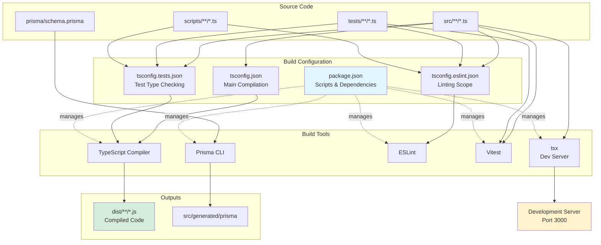
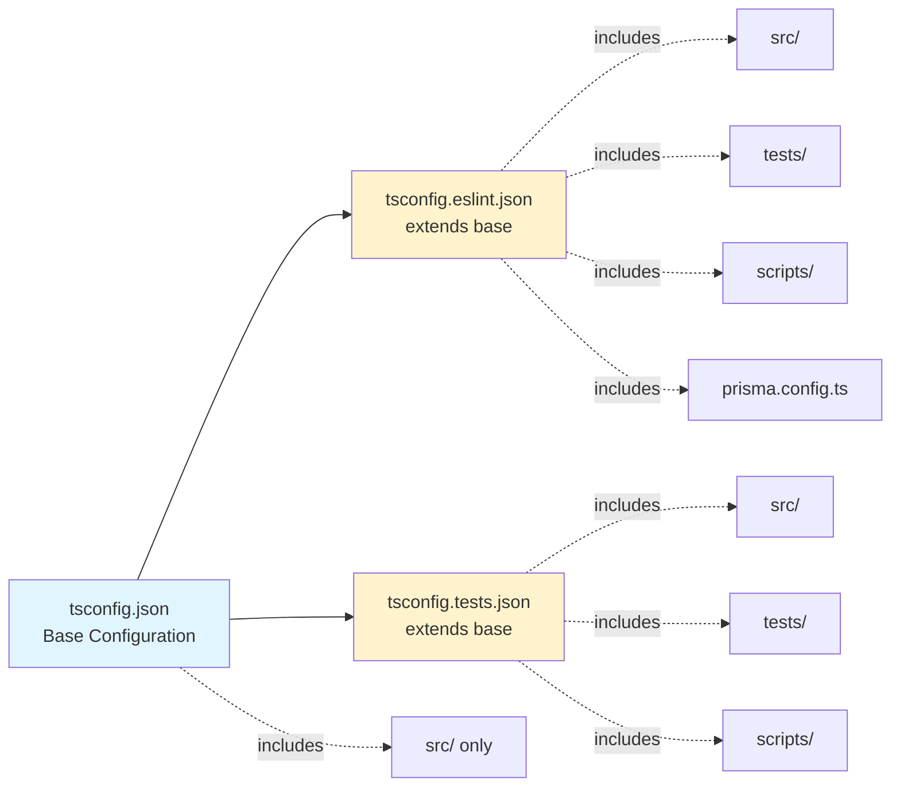
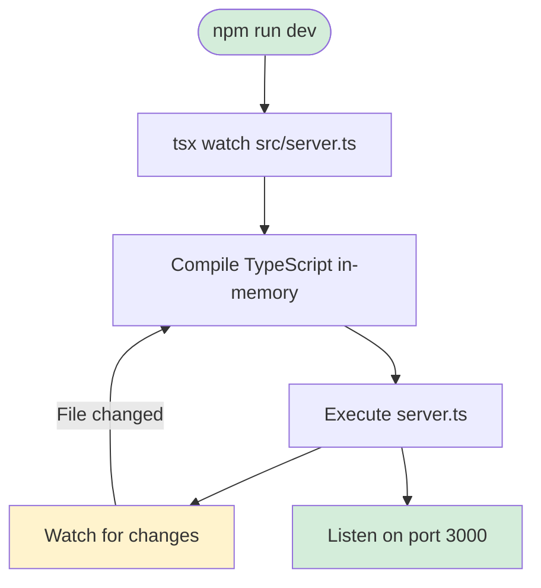
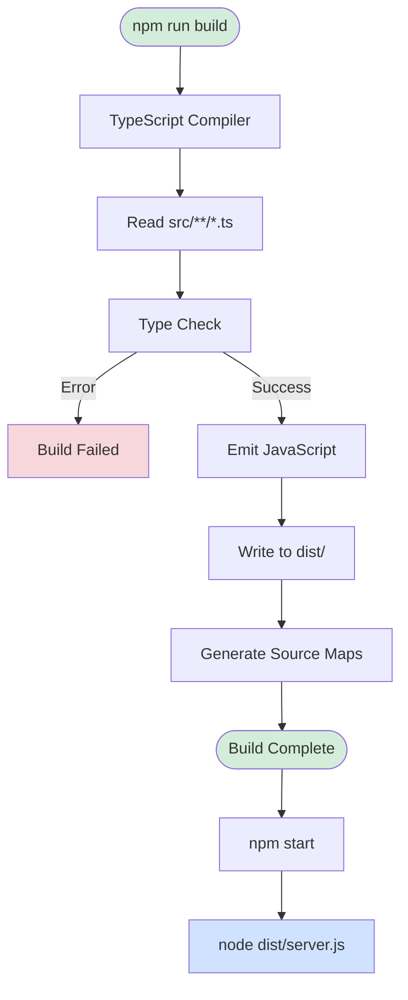
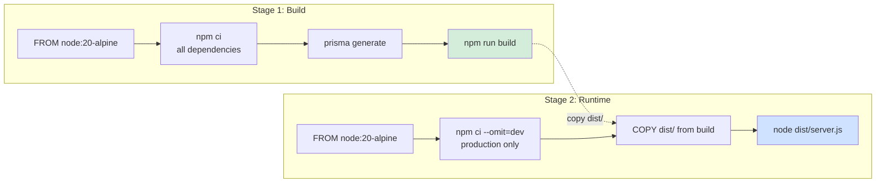
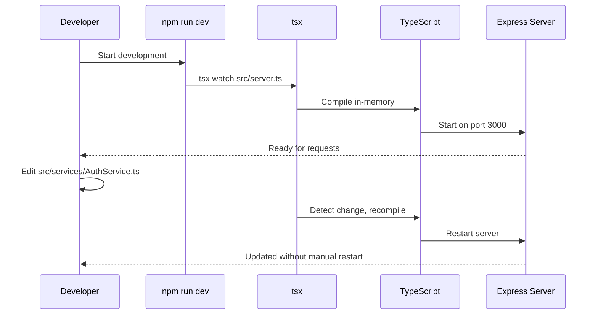
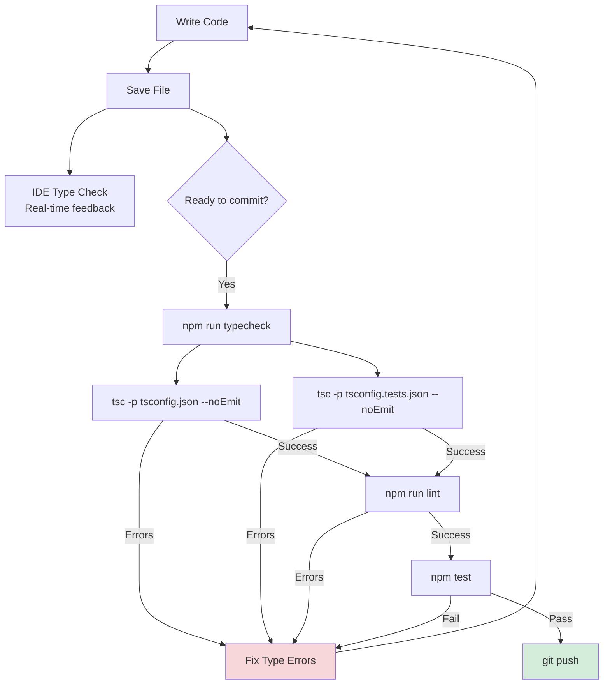
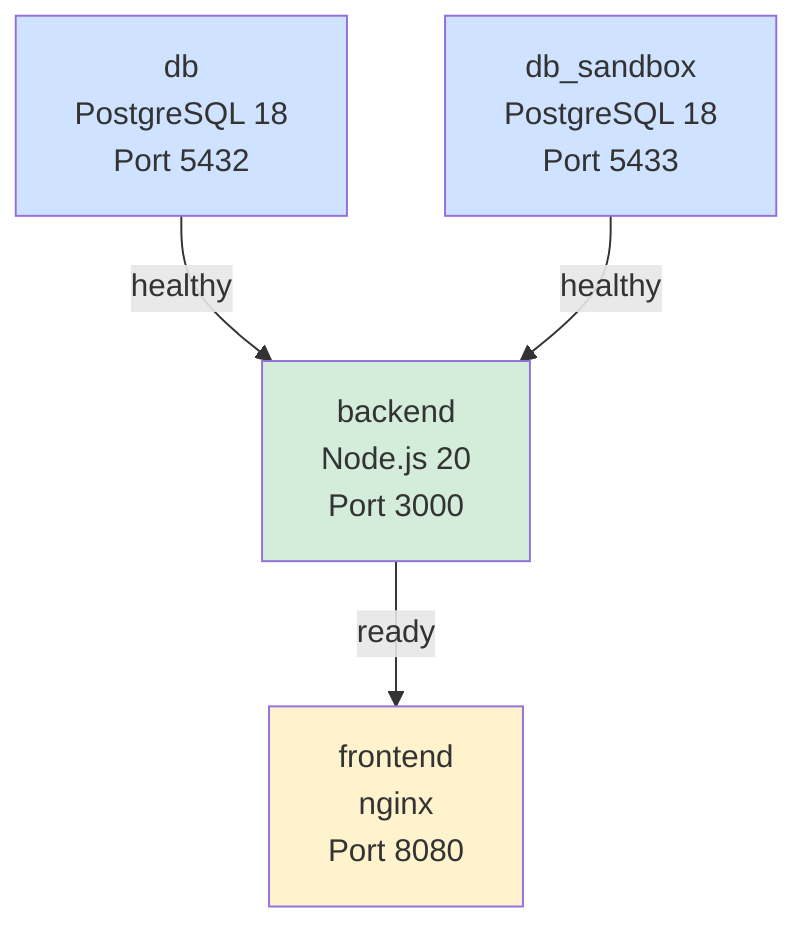
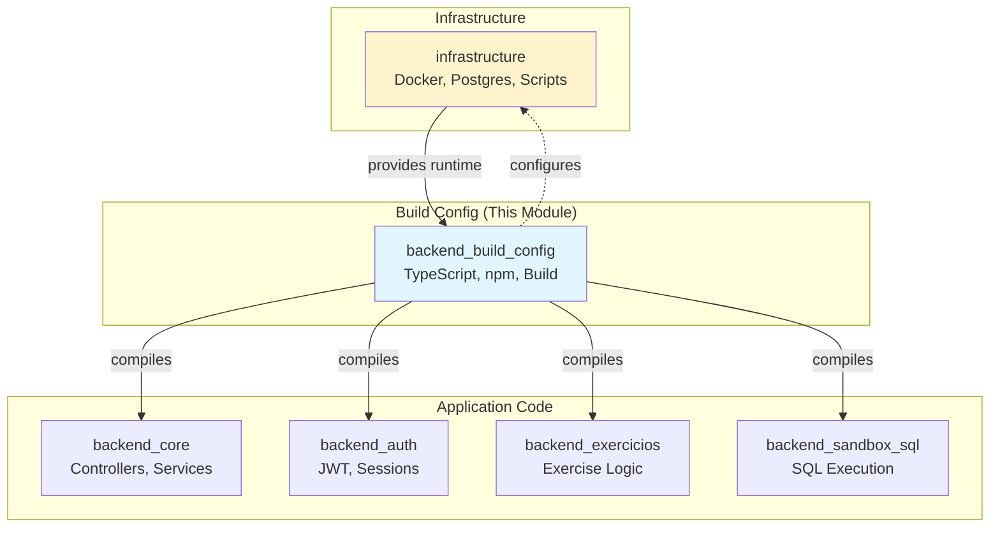
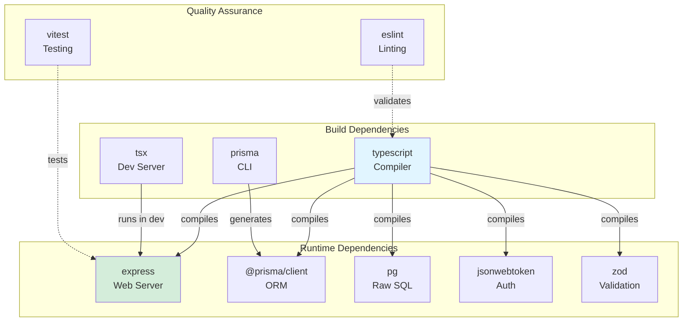

# Backend Build Configuration

The `backend_build_config` module defines the build, development, and testing infrastructure for the IDE Web backend. It encompasses TypeScript compilation settings, npm scripts, dependency management, and the build pipeline that transforms source code into production-ready artifacts.

---

## Table of Contents

1. [Purpose and Core Functionality](#purpose-and-core-functionality)
2. [Architecture Overview](#architecture-overview)
3. [Package.json Configuration](#packagejson-configuration)
4. [TypeScript Configurations](#typescript-configurations)
5. [Build Pipeline](#build-pipeline)
6. [Development Workflow](#development-workflow)
7. [Integration with System](#integration-with-system)
8. [Dependencies](#dependencies)

---

## Purpose and Core Functionality

The backend build configuration serves three primary functions:

1. **Development Environment**: Provides hot-reload development server with TypeScript support via `tsx`
2. **Production Build**: Compiles TypeScript to optimized CommonJS JavaScript for Node.js runtime
3. **Quality Assurance**: Enables type checking, linting, and testing across the codebase

### Key Characteristics

- **Module System**: CommonJS (`type: "commonjs"`) for Node.js compatibility
- **TypeScript Version**: 5.6.3 with strict mode enabled
- **Node.js Requirement**: >= 20 (using modern ECMAScript features)
- **Build Output**: Compiled JavaScript in `dist/` directory
- **Entry Point**: `dist/server.js` in production, `src/server.ts` in development

---

## Architecture Overview



### Configuration Hierarchy



---

## Package.json Configuration

**File**: `ide-web-backend/package.json`

### Scripts

| Script | Command | Purpose |
|--------|---------|---------|
| `dev` | `tsx watch src/server.ts` | Development server with hot reload |
| `build` | `tsc -p tsconfig.json` | Compile TypeScript to JavaScript |
| `start` | `node dist/server.js` | Run production build |
| `test` | `vitest run` | Execute test suite once |
| `lint` | `eslint .` | Check code style and patterns |
| `typecheck` | `tsc -p tsconfig.json --noEmit && tsc -p tsconfig.tests.json --noEmit` | Validate types without emitting files |

### Build Script Details

```bash
# Development: Hot reload with TypeScript execution
npm run dev
# → tsx watch src/server.ts
# Watches for file changes and restarts automatically

# Production Build: Compile to JavaScript
npm run build
# → tsc -p tsconfig.json
# Outputs to dist/ directory

# Type Checking: Validate types across all code
npm run typecheck
# → tsc --noEmit on main and test configs
# Checks src/, tests/, and scripts/
```

### Engine Requirements

```json
{
  "engines": {
    "node": ">=20"
  }
}
```

Requires Node.js 20 or higher for:
- Modern ECMAScript features (ES2022)
- Native fetch API
- Improved performance
- Current LTS support

---

## TypeScript Configurations

### 1. Main Configuration (`tsconfig.json`)

**Purpose**: Compiles production code from `src/` to `dist/`

**Key Settings**:

```json
{
  "compilerOptions": {
    "target": "ES2022",              // Modern JavaScript features
    "module": "node16",              // Node.js module resolution
    "moduleResolution": "node16",    // Matches Node.js 20 behavior
    "lib": ["ES2022"],               // ECMAScript 2022 standard library
    "outDir": "dist",                // Compiled output directory
    "rootDir": "src",                // Source code root
    "strict": true,                  // All strict type checks enabled
    "noUncheckedIndexedAccess": true, // Array/object indexing safety
    "noImplicitOverride": true,      // Explicit override keyword required
    "exactOptionalPropertyTypes": true, // Distinguish undefined from missing
    "esModuleInterop": true,         // CommonJS/ES module compatibility
    "skipLibCheck": true,            // Skip .d.ts file checking
    "forceConsistentCasingInFileNames": true, // Case-sensitive imports
    "resolveJsonModule": true,       // Import JSON files
    "declaration": false,            // No .d.ts files needed
    "sourceMap": true                // Generate source maps for debugging
  },
  "include": ["src"],
  "exclude": ["node_modules", "dist", "tests"]
}
```

**Strict Mode Features**:
- `strict`: Enables all strict type-checking options
- `noUncheckedIndexedAccess`: Prevents unchecked array/object access
- `exactOptionalPropertyTypes`: Ensures `{ foo?: string }` doesn't accept `undefined` explicitly
- `noImplicitOverride`: Requires `override` keyword when overriding base class methods

### 2. ESLint Configuration (`tsconfig.eslint.json`)

**Purpose**: Extends type checking to all files for linting

```json
{
  "extends": "./tsconfig.json",
  "compilerOptions": {
    "noEmit": true  // Only type check, don't compile
  },
  "include": ["src", "tests", "prisma.config.ts", "scripts"],
  "exclude": ["node_modules", "dist"]
}
```

**Scope Expansion**:
- Includes `tests/` for test type checking during linting
- Includes `scripts/` for build/migration script validation
- Includes `prisma.config.ts` for Prisma configuration type checking
- Still excludes compilation output and dependencies

### 3. Test Configuration (`tsconfig.tests.json`)

**Purpose**: Type checking for test files

```json
{
  "extends": "./tsconfig.json",
  "compilerOptions": {
    "noEmit": true,    // Type check only
    "rootDir": "."     // Allow imports from tests/
  },
  "include": ["src", "tests", "scripts"],
  "exclude": ["node_modules", "dist"]
}
```

**Test-Specific Settings**:
- `rootDir: "."` allows test files to import from both `src/` and `tests/`
- `noEmit: true` since tests run via Vitest, not compiled output
- Includes both source and test files for cross-validation

---

## Build Pipeline

### Development Build Flow



**Development Process**:
1. `tsx watch` starts the development server
2. TypeScript is compiled in-memory (no disk output)
3. Server starts on port 3000
4. File watcher monitors `src/` for changes
5. On change: recompile and restart automatically
6. No `dist/` directory created

### Production Build Flow



**Production Build Steps**:
1. `tsc -p tsconfig.json` reads configuration
2. Compiles all `src/**/*.ts` files
3. Validates types (fails on type errors)
4. Emits JavaScript to `dist/` (preserving directory structure)
5. Generates source maps (`.js.map` files)
6. Production server runs compiled code via `node dist/server.js`

### Docker Multi-Stage Build

**File**: `ide-web-backend/Dockerfile`



**Build Stage** (`ide-web-backend/Dockerfile:1-12`):
```dockerfile
FROM node:20-alpine AS build
WORKDIR /app

COPY package.json package-lock.json ./
RUN npm ci

COPY prisma ./prisma
RUN npx prisma generate

COPY tsconfig.json ./
COPY src ./src
RUN npm run build
```

**Runtime Stage** (`ide-web-backend/Dockerfile:14-24`):
```dockerfile
FROM node:20-alpine AS runtime
WORKDIR /app
ENV NODE_ENV=production

COPY package.json package-lock.json ./
RUN npm ci --omit=dev

COPY --from=build /app/dist ./dist

EXPOSE 3000
CMD ["node", "dist/server.js"]
```

**Optimization Benefits**:
- **Smaller Image**: Runtime stage excludes devDependencies (~40% reduction)
- **Security**: No TypeScript compiler or build tools in production
- **Layer Caching**: Dependencies cached separately from source code
- **Clean Output**: Only compiled JavaScript and production dependencies

---

## Development Workflow

### Local Development



**Workflow Steps**:
1. Run `npm run dev` to start development server
2. Server starts on `http://localhost:3000`
3. Edit any `.ts` file in `src/`
4. `tsx` detects change and recompiles automatically
5. Server restarts with new code
6. No manual restart needed

### Type Checking Workflow



### Testing Workflow

```bash
# Run all tests once
npm test
# → vitest run

# Watch mode for TDD
npm run test:watch  # (not in package.json, but vitest supports it)

# Type check tests without running them
npm run typecheck
# Validates test file types via tsconfig.tests.json
```

---

## Integration with System

### Docker Compose Integration

**File**: `docker-compose.yml:42-65`

```yaml
backend:
  build:
    context: ./ide-web-backend  # Uses Dockerfile in this directory
  environment:
    NODE_ENV: production
    PORT: 3000
    # ... environment variables
  ports:
    - "3000:3000"
  depends_on:
    db:
      condition: service_healthy  # Wait for main database
    db_sandbox:
      condition: service_healthy  # Wait for sandbox database
```

**Build Context**:
- `context: ./ide-web-backend` points to directory containing `Dockerfile` and `package.json`
- Docker build runs `npm run build` in build stage
- Runtime stage executes `node dist/server.js`

**Service Dependencies**:



### Relation to Other Modules



**Module Relationships**:

- **[infrastructure](infrastructure.md)**: Provides Docker containers and database services that the compiled backend runs in
- **[backend_core](backend_core.md)**: Application code compiled by this module
- **[backend_auth](backend_auth.md)**: Authentication services compiled by this module
- **[backend_exercicios](backend_exercicios.md)**: Exercise management compiled by this module
- **[backend_sandbox_sql](backend_sandbox_sql.md)**: SQL sandbox compiled by this module

---

## Dependencies

### Production Dependencies

**Core Framework**:
- **express** (^4.21.1): Web framework and REST API server
- **cors** (^2.8.5): Cross-Origin Resource Sharing middleware
- **cookie-parser** (^1.4.7): Parse HTTP cookies for JWT refresh tokens
- **dotenv** (^16.4.5): Environment variable management

**Database & ORM**:
- **@prisma/client** (^7.9.1): Prisma ORM client
- **@prisma/adapter-pg** (^7.9.1): PostgreSQL driver adapter for Prisma
- **pg** (^8.23.0): PostgreSQL client for raw SQL (sandbox execution)

**Security & Authentication**:
- **bcryptjs** (^3.0.3): Password hashing
- **jsonwebtoken** (^9.0.3): JWT token generation and validation

**Validation & Type Safety**:
- **zod** (^3.23.8): Runtime schema validation for DTOs

**Document Generation**:
- **pdfkit** (^0.20.1): Generate exercise PDF packages

### Development Dependencies

**TypeScript**:
- **typescript** (^5.6.3): TypeScript compiler
- **tsx** (^4.19.2): TypeScript execution for development
- **@types/\***: Type definitions for JavaScript libraries

**Linting**:
- **eslint** (^9.14.0): Code quality and style checking
- **@eslint/js** (^9.14.0): ESLint JavaScript config
- **typescript-eslint** (^8.13.0): TypeScript-specific ESLint rules

**Testing**:
- **vitest** (^2.1.4): Fast unit test runner
- **supertest** (^7.0.0): HTTP assertion library for integration tests

**Database Tools**:
- **prisma** (^7.9.1): Prisma CLI for migrations and schema management

### Dependency Graph



---

## Configuration Files Reference

| File | Purpose | Extends | Includes | Output |
|------|---------|---------|----------|--------|
| `tsconfig.json` | Main compilation | - | `src/` | `dist/` |
| `tsconfig.eslint.json` | Linting scope | `tsconfig.json` | `src/`, `tests/`, `scripts/`, `prisma.config.ts` | None (noEmit) |
| `tsconfig.tests.json` | Test type checking | `tsconfig.json` | `src/`, `tests/`, `scripts/` | None (noEmit) |
| `package.json` | Dependencies & scripts | - | All source | Dependency tree |

---

## Build Outputs

### Development Mode (`npm run dev`)

**Generated Files**: None (in-memory compilation)

**Runtime**:
- Port: 3000
- Process: `tsx watch src/server.ts`
- Source maps: In-memory
- Node modules: All dependencies (dev + prod)

### Production Build (`npm run build`)

**Generated Files**:

```
dist/
├── server.js              # Entry point
├── server.js.map          # Source map
├── app.js                 # Express app
├── app.js.map
├── config/
│   ├── env.js
│   └── env.js.map
├── controllers/
│   ├── AuthController.js
│   ├── ExercicioController.js
│   └── ...
├── services/
│   ├── AuthService.js
│   └── ...
├── repositories/
├── models/
├── dtos/
├── errors/
├── middlewares/
├── routes/
├── utils/
└── lib/
```

**Characteristics**:
- **Module format**: CommonJS (`.js` files with `require`/`module.exports`)
- **Source maps**: One `.js.map` per `.js` file
- **No TypeScript**: Only JavaScript and source maps
- **Directory structure**: Mirrors `src/` layout

### Docker Image Layers

**Build Stage** (~500 MB):
- Base: `node:20-alpine`
- Dependencies: All npm packages
- Source: TypeScript files
- Build artifacts: `dist/` directory

**Runtime Stage** (~150 MB):
- Base: `node:20-alpine`
- Dependencies: Production npm packages only
- Code: `dist/` JavaScript only
- **60% smaller** than build stage

---

## Best Practices

### TypeScript Configuration

✅ **Do**:
- Keep strict mode enabled for type safety
- Use `noUncheckedIndexedAccess` to prevent runtime errors
- Enable source maps for production debugging
- Separate test and main configurations

❌ **Don't**:
- Disable strict checks to bypass type errors
- Mix `rootDir` settings across configs
- Include `tests/` in main compilation
- Emit `.d.ts` files (not a library)

### Build Process

✅ **Do**:
- Run `npm run typecheck` before committing
- Use `npm ci` instead of `npm install` in CI/Docker
- Keep devDependencies separate from dependencies
- Generate Prisma client before building

❌ **Don't**:
- Commit `dist/` directory to git
- Mix development and production builds
- Skip type checking in CI pipeline
- Run `npm install` in production

### Script Usage

**Development**:
```bash
npm run dev          # Hot reload development
npm run typecheck    # Validate types
npm run lint         # Check code style
npm test             # Run tests
```

**CI/CD**:
```bash
npm ci               # Clean install dependencies
npm run typecheck    # Type validation
npm run lint         # Code quality
npm test             # Test suite
npm run build        # Production build
```

**Production**:
```bash
npm ci --omit=dev    # Install production deps only
npm start            # Run compiled code
```

---

## Troubleshooting

### Common Issues

**Issue**: `Cannot find module 'src/...'`
- **Cause**: Incorrect module resolution or missing compiled file
- **Fix**: Run `npm run build` to compile TypeScript

**Issue**: Type errors in tests but not in IDE
- **Cause**: Using different TypeScript version or config
- **Fix**: Run `npm run typecheck` to use project configs

**Issue**: Docker build fails at Prisma generate
- **Cause**: Missing Prisma schema or database URL
- **Fix**: Ensure `prisma/schema.prisma` is copied before generation

**Issue**: Hot reload not working
- **Cause**: `tsx` not watching file changes
- **Fix**: Check file is in `src/` directory, restart dev server

### Validation Commands

```bash
# Verify TypeScript setup
npx tsc --version          # Should be 5.6.3
npx tsc --showConfig       # Show resolved configuration

# Check dependency tree
npm list --depth=0         # Show installed packages

# Validate Docker build
docker build -t test-backend ./ide-web-backend
docker run --rm test-backend node --version  # Should be v20.x
```

---

## See Also

- **[infrastructure](infrastructure.md)**: Docker Compose and container orchestration
- **[backend_core](backend_core.md)**: Core application structure and base classes
- **[backend_errors](backend_errors.md)**: Error handling compiled by this module
- **[backend_auth](backend_auth.md)**: Authentication services using JWT from dependencies

---

**Module**: `backend_build_config`  
**Last Updated**: 2026-09-21  
**Related Decision**: [Fase 1 - Setup Técnico](../docs/decisions/fase1-setup-tecnico.md)
