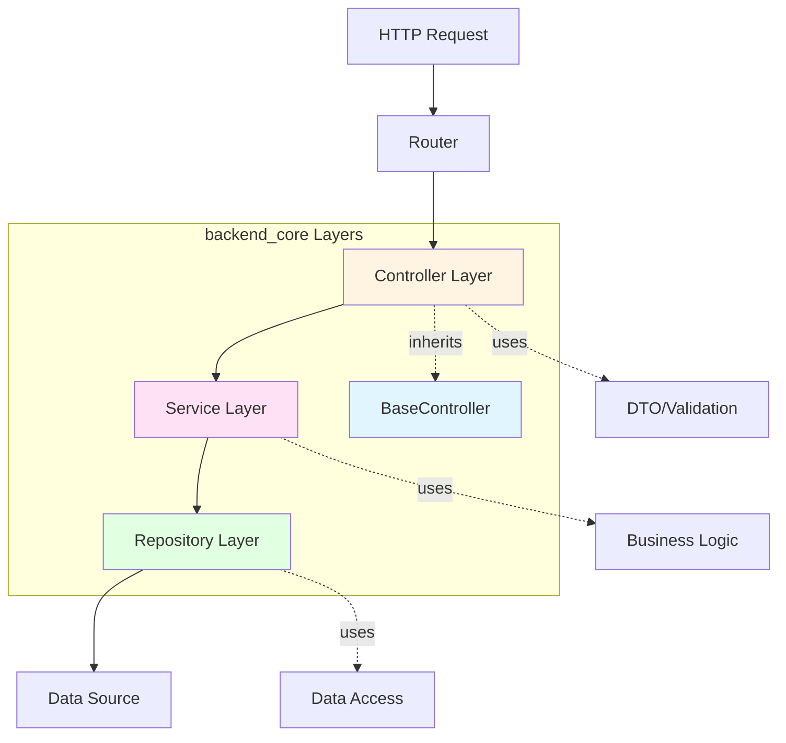
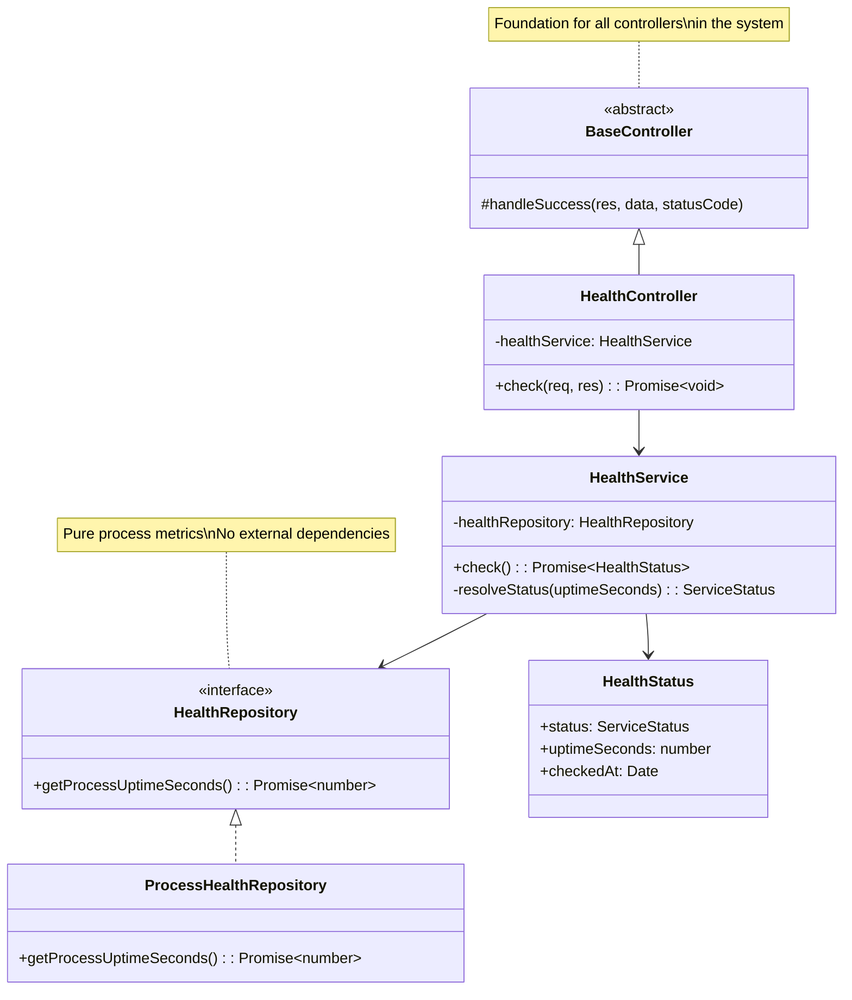
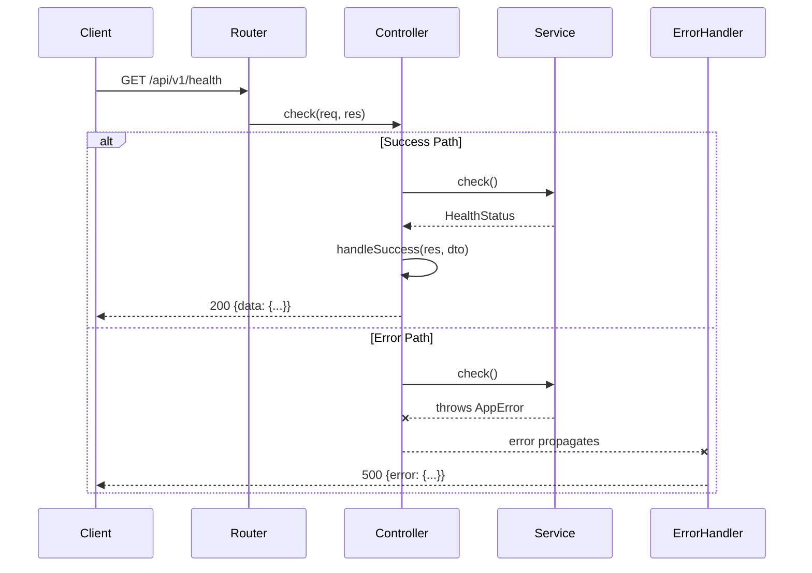
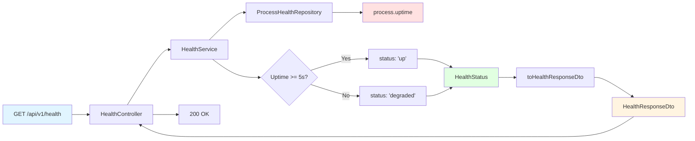
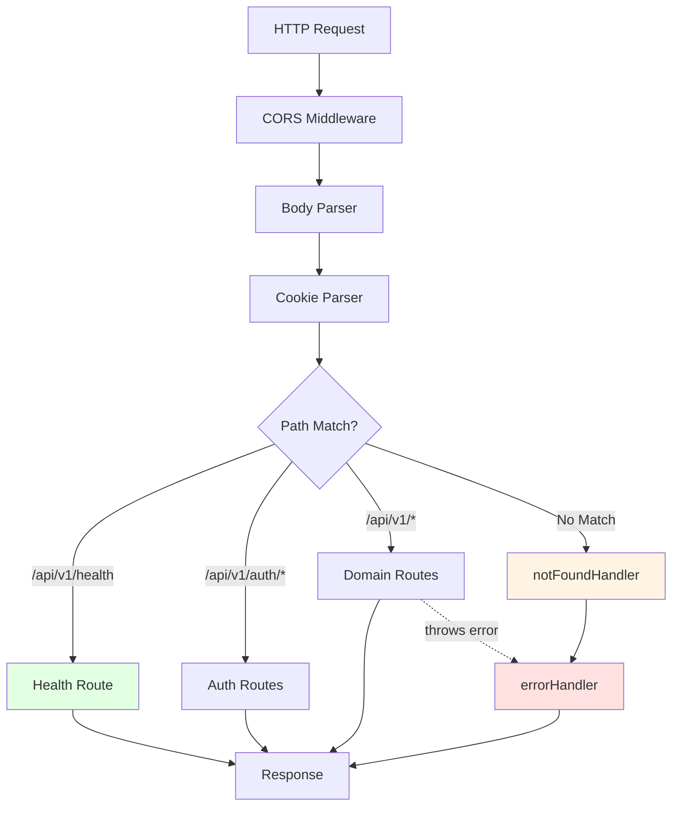
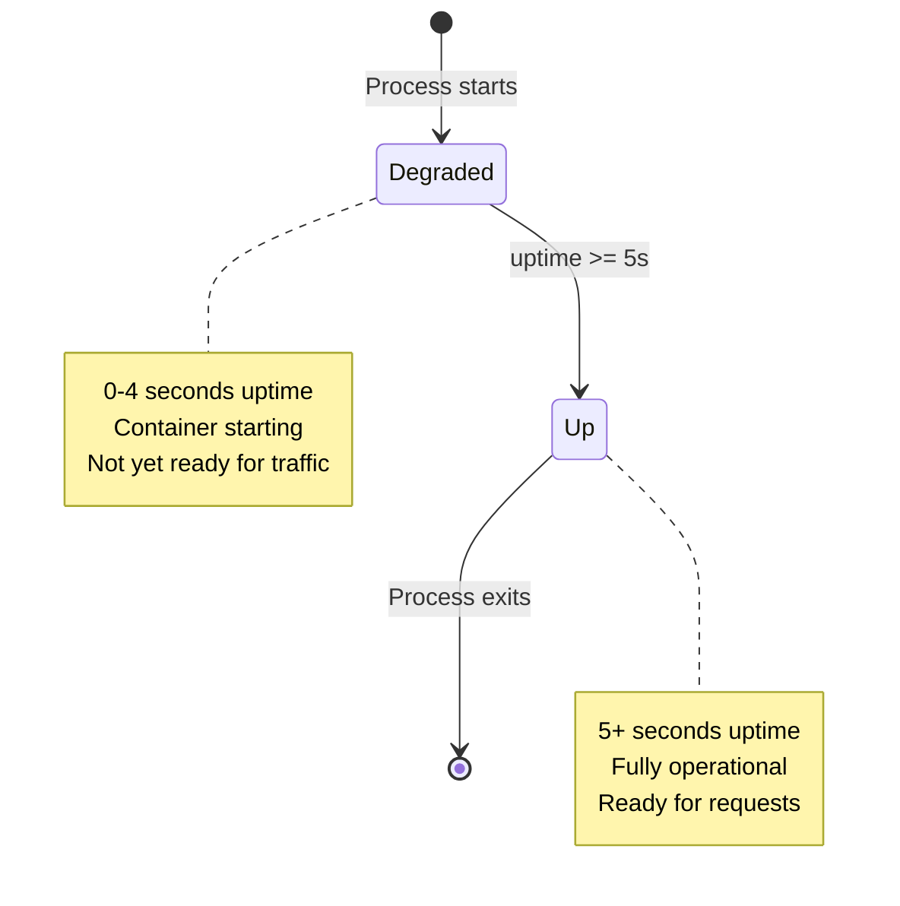
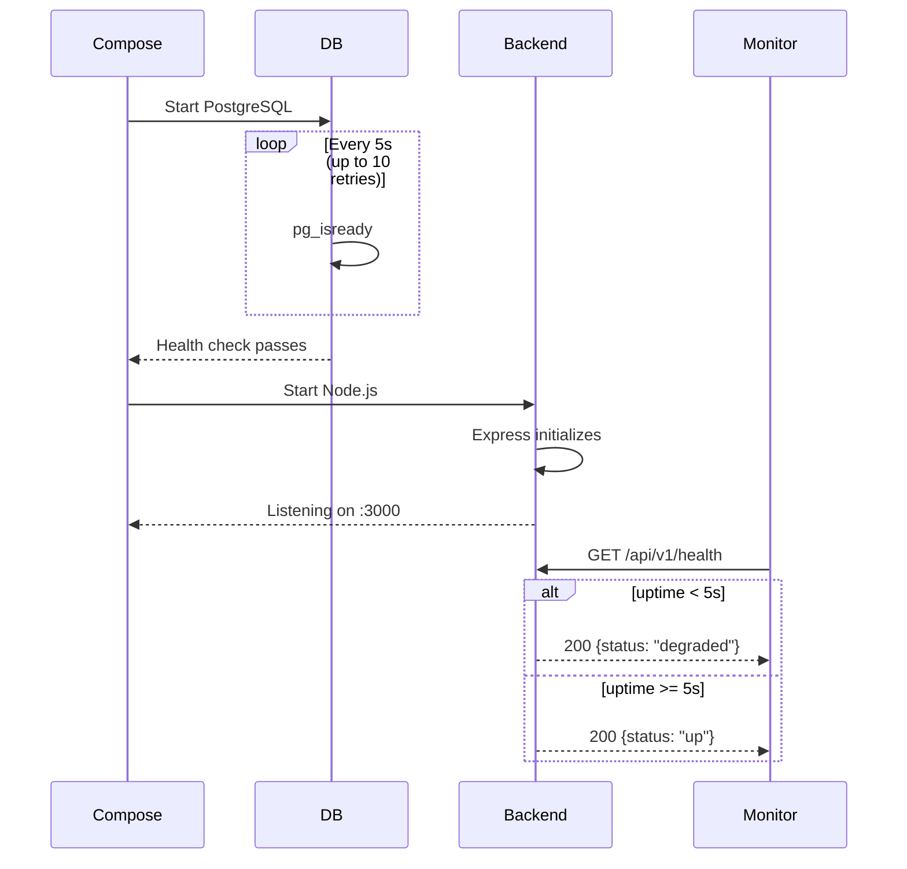
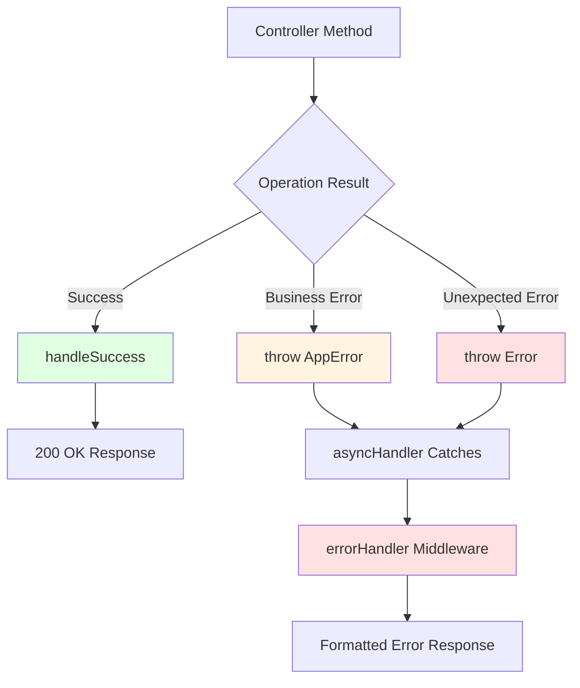
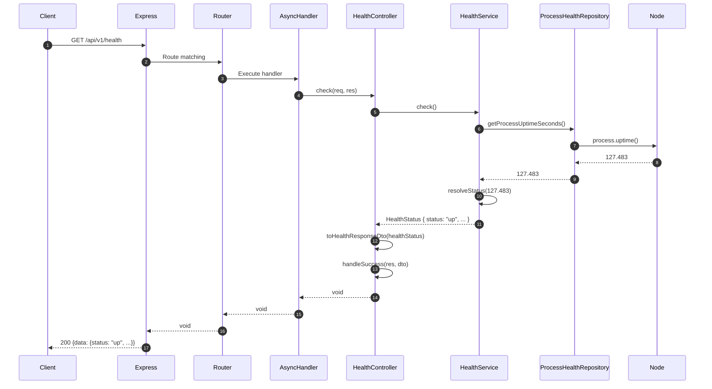
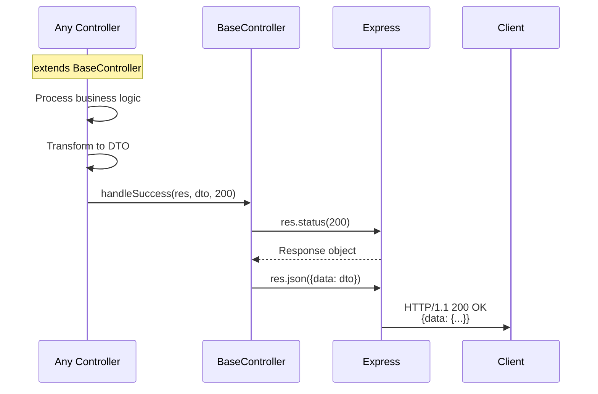

# Backend Core Module

**Platform Foundation & Health Monitoring**

The `backend_core` module is the architectural foundation of the IDE Web backend, establishing the base patterns and providing health monitoring capabilities for the entire Node.js/Express/TypeScript application. This module demonstrates the Model-Service-Controller (MSC) architecture that all other backend modules follow.

---

## Table of Contents

- [Overview](#overview)
- [Architecture](#architecture)
  - [MSC Pattern Implementation](#msc-pattern-implementation)
  - [Component Hierarchy](#component-hierarchy)
- [Core Components](#core-components)
  - [BaseController](#basecontroller)
  - [Health Check System](#health-check-system)
- [Integration Points](#integration-points)
- [Health Monitoring](#health-monitoring)
  - [Service States](#service-states)
  - [Container Orchestration](#container-orchestration)
- [API Reference](#api-reference)
- [Deployment](#deployment)
- [Related Modules](#related-modules)

---

## Overview

### Purpose

The `backend_core` module serves three critical functions:

1. **Architectural Blueprint**: Provides `BaseController` as the foundation for all HTTP controllers in the system
2. **Health Monitoring**: Implements standardized health checks for container orchestration and monitoring systems
3. **Pattern Reference**: Demonstrates the complete MSC (Model-Service-Controller) layering pattern used throughout the backend

### Technology Stack

- **Runtime**: Node.js 20+ (Alpine Linux in containers)
- **Framework**: Express 4.x
- **Language**: TypeScript with strict type checking
- **Architecture**: MSC (Model-Service-Controller) pattern
- **Deployment**: Docker containers with health checks

### Key Characteristics

- **Zero Dependencies**: Health check requires no external services (database, cache, etc.)
- **Stateless**: Operates purely on process-level metrics
- **Fail-Fast**: Distinguishes between startup (`degraded`) and operational states
- **Extensible**: `BaseController` provides a uniform interface for all domain controllers

---

## Architecture

### MSC Pattern Implementation

The module demonstrates the complete MSC layering pattern that governs the entire backend codebase:



**Layer Responsibilities:**

| Layer | Responsibility | Example in backend_core |
|-------|---------------|------------------------|
| **Controller** | HTTP protocol handling, request/response mapping | `HealthController` |
| **Service** | Business logic, orchestration, domain rules | `HealthService` |
| **Repository** | Data access abstraction, persistence logic | `ProcessHealthRepository` |
| **Model** | Domain entities, value objects | `HealthStatus` |
| **DTO** | API contract, validation schemas | `HealthResponseDto` |

### Component Hierarchy



---

## Core Components

### BaseController

**Location**: `ide-web-backend/src/controllers/BaseController.ts`

**Purpose**: Abstract base class providing standardized response handling for all HTTP controllers.

#### Implementation

```typescript
abstract class BaseController {
  protected handleSuccess(res: Response, data: unknown, statusCode: number = 200): void {
    res.status(statusCode).json({ data });
  }
}
```

#### Design Principles

1. **Uniform Response Shape**: All successful responses follow the `{ data: T }` envelope pattern (see [ApiEnvelope](frontend_shared.md#http-client))
2. **Protected Access**: `handleSuccess` is `protected`, ensuring it's only used by controller subclasses
3. **Default Status Code**: Returns HTTP 200 by default, overridable for 201 (Created), 202 (Accepted), etc.
4. **Type Safety**: Accepts `unknown` data type, letting TypeScript infer from DTOs

#### Usage Pattern

All controllers in the system extend `BaseController`:

```typescript
export class HealthController extends BaseController {
  check = async (_req: Request, res: Response): Promise<void> => {
    const healthStatus = await this.healthService.check();
    this.handleSuccess(res, toHealthResponseDto(healthStatus));
  };
}
```

#### Integration with Error Handling

Success responses use `BaseController.handleSuccess`, while errors are thrown and caught by the global error handler (see [backend_errors](backend_errors.md) module):



---

### Health Check System

The health check system provides container orchestration support and operational visibility through a stateless, zero-dependency endpoint.

#### Component Structure



#### HealthStatus Model

**Location**: `ide-web-backend/src/models/HealthStatus.ts`

```typescript
type ServiceStatus = 'up' | 'degraded' | 'down';

interface HealthStatus {
  status: ServiceStatus;
  uptimeSeconds: number;
  checkedAt: Date;
}
```

**State Semantics:**

- **`up`**: Service has been running for ≥5 seconds and is operational
- **`degraded`**: Service is in startup phase (<5 seconds uptime)
- **`down`**: Not currently returned by this implementation (reserved for future use)

#### HealthService Logic

**Location**: `ide-web-backend/src/services/HealthService.ts`

```typescript
const MINIMUM_STABLE_UPTIME_SECONDS = 5;

async check(): Promise<HealthStatus> {
  const uptimeSeconds = await this.healthRepository.getProcessUptimeSeconds();
  
  return {
    status: this.resolveStatus(uptimeSeconds),
    uptimeSeconds,
    checkedAt: new Date(),
  };
}

private resolveStatus(uptimeSeconds: number): ServiceStatus {
  if (uptimeSeconds < MINIMUM_STABLE_UPTIME_SECONDS) {
    return 'degraded';
  }
  return 'up';
}
```

**5-Second Threshold Rationale:**

- Distinguishes between startup phase and operational state
- Prevents premature "healthy" signals during initialization
- Aligns with typical Express app bootstrap time (database connections, middleware setup)
- See `docker-compose.yml:12-16` for coordination with database health checks

#### ProcessHealthRepository

**Location**: `ide-web-backend/src/repositories/HealthRepository.ts`

```typescript
interface HealthRepository {
  getProcessUptimeSeconds(): Promise<number>;
}

class ProcessHealthRepository implements HealthRepository {
  getProcessUptimeSeconds(): Promise<number> {
    return Promise.resolve(process.uptime());
  }
}
```

**Design Notes:**

- **Zero External Dependencies**: Uses Node.js `process.uptime()`, no database/cache queries
- **Interface Abstraction**: Allows future implementations (e.g., health checks with DB connectivity tests)
- **Async Return**: Promise-based to maintain uniform repository pattern across the codebase

#### HealthResponseDto

**Location**: `ide-web-backend/src/dtos/health.dto.ts`

```typescript
const healthResponseSchema = z.object({
  status: z.enum(['up', 'degraded', 'down']),
  uptimeSeconds: z.number().nonnegative(),
  checkedAt: z.string().datetime(),
});

type HealthResponseDto = z.infer<typeof healthResponseSchema>;

function toHealthResponseDto(healthStatus: HealthStatus): HealthResponseDto {
  return {
    status: healthStatus.status,
    uptimeSeconds: healthStatus.uptimeSeconds,
    checkedAt: healthStatus.checkedAt.toISOString(),
  };
}
```

**DTO Responsibilities:**

1. **Date Serialization**: Converts `Date` to ISO 8601 string for JSON transport
2. **Schema Validation**: Zod schema documents the API contract
3. **Type Safety**: Derived TypeScript type ensures compile-time correctness

---

## Integration Points

### With Application Bootstrap

**Location**: `ide-web-backend/src/routes/health.routes.ts`

```typescript
const healthRepository = new ProcessHealthRepository();
const healthService = new HealthService(healthRepository);
const healthController = new HealthController(healthService);

export const healthRoutes = Router();
healthRoutes.get('/health', asyncHandler((req, res) => healthController.check(req, res)));
```

**Dependency Injection:**

- Manual constructor injection (no DI container)
- Singleton instances created at module load
- Dependencies flow: Repository → Service → Controller

**Route Registration** (`ide-web-backend/src/routes/index.ts`):

```typescript
routes.use(healthRoutes);  // Registered FIRST, before auth
routes.use(authRoutes);
routes.use(turmaRoutes);
// ... other routes
```

**Rationale for First Position:**

- Health checks bypass authentication middleware
- Monitoring systems need unauthenticated access
- Fails fast if routing layer itself is broken

### With Middleware Stack

**Location**: `ide-web-backend/src/app.ts`



**Middleware Order** (`ide-web-backend/src/app.ts:14-21`):

1. `cors()` - CORS headers
2. `express.json()` - Body parsing
3. `cookieParser()` - Cookie parsing
4. `routes` - Application routes (health check included)
5. `notFoundHandler` - 404 responses
6. `errorHandler` - Error response formatting

**Health Check Position:**

- **Before** `notFoundHandler`: Ensures `/api/v1/health` matches a route
- **After** body/cookie parsers: Parsers are lightweight, no harm in including
- **No authentication**: Health checks don't require `requireAuth` middleware

---

## Health Monitoring

### Service States



**State Transitions:**

| From | To | Trigger | Duration |
|------|-----|---------|----------|
| `null` | `degraded` | Process start | Immediate |
| `degraded` | `up` | 5 seconds pass | ~5s |
| `up` | `null` | Process exits | N/A |

**No `down` State:**

The current implementation never returns `down`. This state is reserved for future enhancements where health checks might verify:

- Database connectivity
- External service availability
- Resource exhaustion (memory, file descriptors)

### Container Orchestration

**Docker Compose Integration** (`docker-compose.yml:42-65`):

```yaml
backend:
  build:
    context: ./ide-web-backend
  environment:
    NODE_ENV: production
    PORT: 3000
    # ... other env vars
  ports:
    - "3000:3000"
  depends_on:
    db:
      condition: service_healthy
    db_sandbox:
      condition: service_healthy
```

**Key Points:**

1. **`depends_on` with `condition: service_healthy`**: Backend waits for database health checks before starting
2. **No explicit health check on backend service**: Compose doesn't define a `healthcheck` for the backend service itself
3. **Manual health check via API**: Monitoring systems query `GET /api/v1/health` directly

**Database Health Checks** (`docker-compose.yml:12-16`, `36-40`):

```yaml
db:
  healthcheck:
    test: ["CMD-SHELL", "pg_isready -U ide_app -d ide_web"]
    interval: 5s
    timeout: 5s
    retries: 10
```

**Startup Sequence:**



**Production Deployment (Render):**

- Health checks configured in Render dashboard
- Endpoint: `GET /api/v1/health`
- Expected: HTTP 200 with `{"data": {"status": "up"}}`
- Failure threshold triggers container restart

---

## API Reference

### `GET /api/v1/health`

**Description**: Returns the current health status of the backend service.

**Authentication**: None (public endpoint)

**Request**:

```http
GET /api/v1/health HTTP/1.1
Host: localhost:3000
```

**Successful Response**:

```json
HTTP/1.1 200 OK
Content-Type: application/json

{
  "data": {
    "status": "up",
    "uptimeSeconds": 127.483,
    "checkedAt": "2026-09-22T14:32:15.823Z"
  }
}
```

**Response Schema**:

```typescript
{
  data: {
    status: "up" | "degraded" | "down",
    uptimeSeconds: number,  // Non-negative integer
    checkedAt: string       // ISO 8601 datetime
  }
}
```

**Status Codes**:

| Code | Meaning | Scenario |
|------|---------|----------|
| `200 OK` | Health check succeeded | Always (even when status is `degraded`) |
| `500 Internal Server Error` | Unexpected failure | Should never happen (no external dependencies) |

**Notes:**

- Always returns `200 OK`, even during startup (`degraded` state)
- Monitoring systems should check both HTTP status **and** `data.status` field
- `uptimeSeconds` reflects process lifetime, resets to 0 on container restart

---

## Deployment

### Container Configuration

**Dockerfile** (`ide-web-backend/Dockerfile`):

```dockerfile
FROM node:20-alpine AS build
WORKDIR /app

COPY package.json package-lock.json ./
RUN npm ci

COPY prisma ./prisma
RUN npx prisma generate

COPY tsconfig.json ./
COPY src ./src
RUN npm run build

FROM node:20-alpine AS runtime
WORKDIR /app
ENV NODE_ENV=production

COPY package.json package-lock.json ./
RUN npm ci --omit=dev

COPY --from=build /app/dist ./dist

EXPOSE 3000
CMD ["node", "dist/server.js"]
```

**Key Stages:**

1. **Build Stage**: TypeScript compilation, Prisma client generation
2. **Runtime Stage**: Production dependencies only, compiled JavaScript

**Health Check Implications:**

- Process starts immediately when container runs
- First 5 seconds: `status: "degraded"`
- After 5 seconds: `status: "up"`
- No separate health check command in Dockerfile (relies on HTTP endpoint)

### Environment Variables

**Health Check Configuration**: None required (uses process-level metrics)

**Related Environment Variables** (for full backend operation):

```bash
# Server
NODE_ENV=production
PORT=3000

# CORS
CORS_ORIGIN=http://localhost:8080

# Database (not used by health check, but required by app)
DATABASE_URL=postgresql://...
SANDBOX_DATABASE_URL=postgresql://...

# JWT (not used by health check)
JWT_SECRET=...
```

**Health Check Independence:**

The health check endpoint works even if:

- Database connections fail
- JWT secrets are missing
- External APIs are down

This is intentional: health checks verify **process liveness**, not **full functionality**.

### Monitoring Integration

**Prometheus/Grafana (example)**:

```yaml
# prometheus.yml
scrape_configs:
  - job_name: 'ide-web-backend'
    metrics_path: '/api/v1/health'
    scrape_interval: 10s
    static_configs:
      - targets: ['backend:3000']
```

**Alert Example**:

```yaml
groups:
  - name: backend_health
    rules:
      - alert: BackendDegraded
        expr: backend_health_status != "up"
        for: 30s
        annotations:
          summary: "Backend in degraded state for >30s"
```

---

## Related Modules

### Direct Dependencies

- **[backend_errors](backend_errors.md)**: Error classes thrown by controllers/services
  - All exceptions inherit from `AppError`
  - Caught by global `errorHandler` middleware
  
### Dependent Modules

All backend application services extend `BaseController`:

- **[backend_auth](backend_auth.md)**: `AuthController extends BaseController`
- **[backend_exercicios](backend_exercicios.md)**: `ExercicioController extends BaseController`
- **[backend_turmas](backend_turmas.md)**: `TurmaController extends BaseController`
- **[backend_provas](backend_provas.md)**: `ProvaController extends BaseController`
- **[backend_modelagem](backend_modelagem.md)**: `DiagramaMerController extends BaseController`
- **[backend_sandbox_sql](backend_sandbox_sql.md)**: `SandboxController extends BaseController`
- **[backend_resultado](backend_resultado.md)**: `ResultadoController extends BaseController`
- **[backend_painel](backend_painel.md)**: `PainelController extends BaseController`
- **[backend_dica_ia](backend_dica_ia.md)**: `DicaIaController extends BaseController`
- **[backend_pacote](backend_pacote.md)**: `PacoteController extends BaseController`
- **[backend_pesquisa](backend_pesquisa.md)**: `PesquisaController extends BaseController`

### Infrastructure Dependencies

- **[infrastructure](infrastructure.md)**: Docker Compose orchestration, container definitions
- **[backend_build_config](backend_build_config.md)**: TypeScript configuration, build pipeline

---

## Architecture Patterns

### Dependency Injection

**Manual Constructor Injection Pattern**:

```typescript
// 1. Create repository instance
const healthRepository = new ProcessHealthRepository();

// 2. Inject repository into service
const healthService = new HealthService(healthRepository);

// 3. Inject service into controller
const healthController = new HealthController(healthService);
```

**No DI Container Used:**

- Dependencies explicitly wired in route files
- Clear, traceable dependency graph
- Easy to test (mock interfaces in unit tests)

### Repository Pattern

**Interface-Based Abstraction**:

```typescript
interface HealthRepository {
  getProcessUptimeSeconds(): Promise<number>;
}
```

**Benefits:**

1. **Testability**: Mock implementations for unit tests
2. **Flexibility**: Swap implementations without changing service layer
3. **Future-Proof**: Add DB-based health checks without breaking existing code

**Current Implementation** (`ProcessHealthRepository`):

- Wraps Node.js `process.uptime()`
- Returns Promise for consistency with async repository pattern
- No I/O, no external dependencies

### Error Handling Strategy

**Thrown Exceptions vs. Error Returns**:



**Never Returns Errors in Response Body**:

```typescript
// ❌ WRONG: Don't return errors as success
return { success: false, error: "Something failed" };

// ✅ CORRECT: Throw typed exceptions
throw new NotFoundError("Exercício");
```

All error handling flows through the centralized `errorHandler` middleware.

---

## Data Flow Diagrams

### Health Check Request Flow



### BaseController Success Response Flow



---

## Testing Considerations

### Unit Testing BaseController

```typescript
// Example unit test structure
describe('BaseController', () => {
  let mockResponse: MockResponse;
  
  beforeEach(() => {
    mockResponse = {
      status: jest.fn().mockReturnThis(),
      json: jest.fn()
    };
  });
  
  it('should format success response with default status code', () => {
    const controller = new ConcreteController();
    const data = { foo: 'bar' };
    
    controller['handleSuccess'](mockResponse, data);
    
    expect(mockResponse.status).toHaveBeenCalledWith(200);
    expect(mockResponse.json).toHaveBeenCalledWith({ data });
  });
});
```

### Integration Testing Health Endpoint

```typescript
// Example integration test
describe('GET /api/v1/health', () => {
  it('should return degraded status during first 5 seconds', async () => {
    // Start fresh process
    const response = await request(app).get('/api/v1/health');
    
    expect(response.status).toBe(200);
    expect(response.body.data.status).toBe('degraded');
    expect(response.body.data.uptimeSeconds).toBeLessThan(5);
  });
  
  it('should return up status after 5 seconds', async () => {
    await sleep(5000);
    
    const response = await request(app).get('/api/v1/health');
    
    expect(response.status).toBe(200);
    expect(response.body.data.status).toBe('up');
    expect(response.body.data.uptimeSeconds).toBeGreaterThanOrEqual(5);
  });
});
```

---

## Future Enhancements

### Potential Extensions

1. **Deep Health Checks**:
   ```typescript
   interface HealthRepository {
     getProcessUptimeSeconds(): Promise<number>;
     checkDatabaseConnectivity(): Promise<boolean>;
     checkExternalServices(): Promise<ServiceHealthMap>;
   }
   ```

2. **`down` State Implementation**:
   - Return `down` when critical dependencies fail
   - HTTP 503 Service Unavailable instead of 200 OK

3. **Metrics Endpoint**:
   - Separate `/api/v1/metrics` for Prometheus-compatible metrics
   - Request counts, response times, error rates

4. **Readiness vs. Liveness**:
   - `/health/live`: Process is running (current behavior)
   - `/health/ready`: Process can handle traffic (includes DB checks)

---

## Summary

The `backend_core` module establishes the architectural foundation for the IDE Web backend:

- **BaseController** provides uniform response handling for all HTTP endpoints
- **Health check system** enables container orchestration and monitoring
- **MSC pattern** is demonstrated end-to-end (Model-Service-Controller-Repository)
- **Zero dependencies** for health checks ensures reliability even during failures

All backend domain modules inherit from this foundation, creating a consistent, maintainable codebase aligned with the project's architectural guidelines.

---

**Document Version**: 1.0  
**Last Updated**: 2026-09-22  
**Module Version**: Implemented through Fase 10 (backend platform complete)
