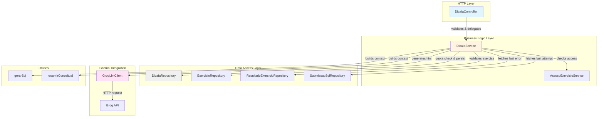
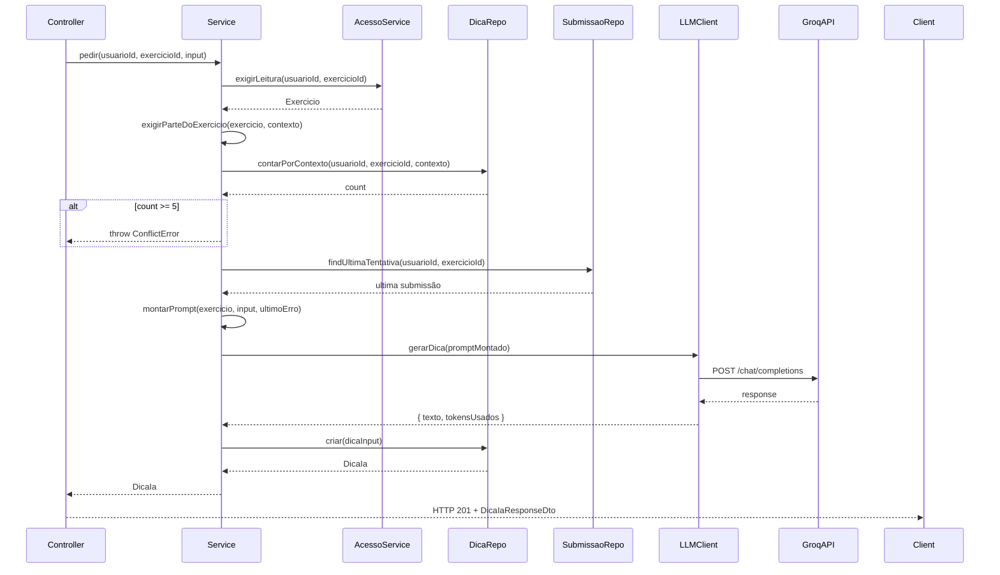
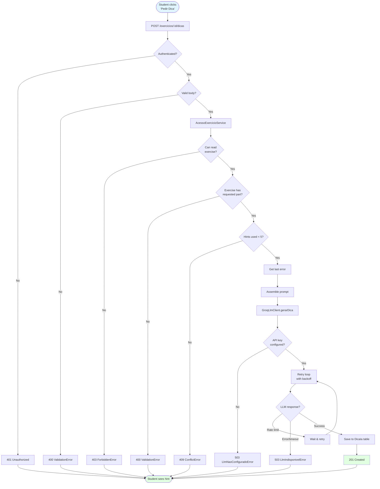
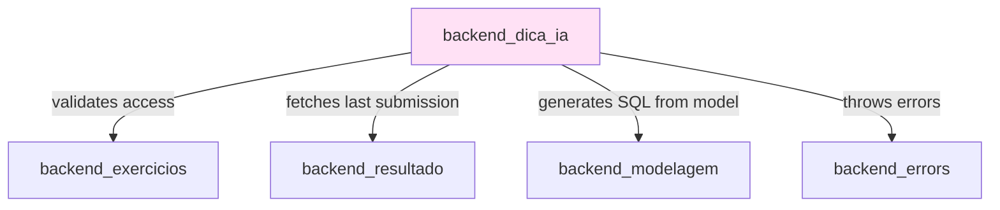

# Backend: AI-Powered Pedagogical Hints (backend_dica_ia)

The `backend_dica_ia` module provides AI-generated pedagogical hints to students working on database exercises. It integrates with Groq's LLM API to deliver context-aware guidance without revealing complete solutions, supporting both SQL query and data modeling (MER) exercises.

---

## Table of Contents

1. [Architecture Overview](#architecture-overview)
2. [Core Components](#core-components)
3. [Data Flow](#data-flow)
4. [LLM Integration](#llm-integration)
5. [Quota Management](#quota-management)
6. [Context Assembly](#context-assembly)
7. [Error Handling](#error-handling)
8. [Dependencies](#dependencies)
9. [Configuration](#configuration)
10. [Security Considerations](#security-considerations)

---

## Architecture Overview

The module follows the MSC (Model-Service-Controller) layered architecture pattern, with an additional LLM client layer for external API integration.



### Layer Responsibilities

- **Controller**: HTTP request validation, authentication check, DTO transformation
- **Service**: Business rules (quota limits, context assembly, prompt construction)
- **Repository**: Database operations for hints and related entities
- **LLM Client**: External API integration with retry/backoff logic

---

## Core Components

### DicaIaController

**Location**: `ide-web-backend/src/controllers/DicaIaController.ts`

HTTP endpoint handler for hint requests.

**Responsibilities**:
- Validate authentication (`req.usuario` must exist)
- Validate request body using Zod schema
- Delegate to service layer
- Return HTTP 201 on success

**Endpoint**:
```typescript
POST /exercicios/:id/dicas
Authorization: Required (JWT cookie)
Body: PedirDicaBodyDto
Response: DicaIaResponseDto (HTTP 201)
```

**Request Validation**:
```typescript
{
  contexto: 'sql' | 'mer',
  estadoMer?: DocumentoModelagem,  // Current MER editor state
  estadoSql?: string                // Current SQL editor content
}
```

The schema enforces:
- `estadoSql` must be non-empty when `contexto === 'sql'`
- `estadoMer` must have content when `contexto === 'mer'`

---

### DicaIaService

**Location**: `ide-web-backend/src/services/DicaIaService.ts`

Core business logic for hint generation.

**Key Methods**:

#### `pedir(usuarioId, exercicioId, input)`

Main orchestration method that:

1. **Validates access**: Calls `AcessoExercicioService.exigirLeitura()` to ensure student can read the exercise
2. **Validates exercise parts**: Ensures the requested context (SQL/MER) exists in the exercise
3. **Checks quota**: Enforces 5-hint limit per context per exercise
4. **Fetches last error**: Retrieves context from last submission/evaluation
5. **Assembles prompt**: Constructs pedagogical prompt from exercise + student state + error
6. **Calls LLM**: Generates hint via `GroqLlmClient`
7. **Persists hint**: Saves prompt, response, and metadata to database



#### Other Key Methods

- **`exigirParteDoExercicio`**: Validates exercise has requested part (SQL/MER)
- **`exigirQuotaDisponivel`**: Enforces 5-hint-per-context limit
- **`buscarUltimoErro`**: Fetches context from last submission/evaluation
- **`montarPrompt`**: Assembles pedagogical prompt with exercise context
- **`montarEstadoEnviado`**: Creates JSON snapshot of student's work

---

### DicaIaRepository

**Location**: `ide-web-backend/src/repositories/DicaIaRepository.ts`

Data access layer for `DicaIa` entity.

**Interface Methods**:

```typescript
interface DicaIaRepository {
  contarPorContexto(usuarioId: string, exercicioId: string, contexto: ContextoDica): Promise<number>;
  criar(input: CreateDicaIaInput): Promise<DicaIa>;
  contarPorExercicios(exercicioIds: string[]): Promise<ContagemDicas[]>;
}
```

**Implementation**: `PrismaDicaIaRepository`

- **`contarPorContexto`**: Counts hints for quota enforcement
- **`criar`**: Persists new hint with full metadata
- **`contarPorExercicios`**: Bulk count for research data export

---

### GroqLlmClient

**Location**: `ide-web-backend/src/repositories/llm/GroqLlmClient.ts`

Integration with Groq's OpenAI-compatible API.

**Key Features**:

1. **Fixed System Prompt**: Instructs LLM to provide guidance without revealing solutions
2. **Retry Logic**: Handles rate limiting (30 req/min on free tier)
3. **Exponential Backoff**: Progressive delays on 429 responses (1s, 2s, 4s, 8s)
4. **Error Categorization**: Distinguishes "not configured" from "temporarily unavailable"

**System Prompt**:
```
Você é um assistente pedagógico de banco de dados para alunos de graduação.
Dado o enunciado de um exercício, a tentativa atual do aluno e (se houver) o erro da
última submissão, dê uma dica curta que ajude o aluno a avançar sozinho.
NUNCA escreva a query SQL completa nem o diagrama MER completo da resposta certa —
aponte o próximo passo, o conceito envolvido ou o que revisar, sem entregar a solução pronta.
```

---

## Data Flow

### Complete Hint Request Flow



---

## LLM Integration

### Groq API Configuration

**Endpoint**: `https://api.groq.com/openai/v1/chat/completions`

**Model**: `llama-3.1-8b-instant` (configurable via `config.llm.model`)

**Rate Limits** (Groq free tier):
- **30 requests/minute** per organization
- **6,000 tokens/minute**
- **14,400 tokens/day**

**Why Groq + Llama 3.1 8B?**
- Free tier sufficient for TCC research
- Fast inference (optimized hardware)
- OpenAI-compatible API (easy provider swap)
- Portuguese support
- Good balance of capability and speed

---

## Quota Management

### Per-Context Limit

**Rule**: Students can request **up to 5 hints per context** (SQL or MER) per exercise.

```typescript
const MAX_DICAS_POR_CONTEXTO = 5;
```

**Granularity**:
- SQL and MER contexts have **independent quotas**
- An exercise with both parts allows **10 total hints** (5 + 5)
- Counter persists across sessions (stored in database)

**Rationale** (from `docs/decisions/fase3-dicas-ia.md`):
- Prevents "chatbot dependency" (spamming for complete solution)
- Encourages thinking between hints
- Reduces API costs and rate limit pressure

---

## Context Assembly

### Prompt Construction Strategy

The `montarPrompt()` method builds a rich pedagogical prompt including:

1. **Exercise statement** (always)
2. **Requested help context** (SQL or MER)
3. **Student's current work**:
   - For MER: Conceptual model summary + Logical model as SQL DDL
   - For SQL: Current query text
4. **Last error** (if available)
5. **Coherence check** (when both MER and SQL present)

### Example Assembled Prompt

```
Enunciado do exercício: Liste todos os clientes que fizeram pedidos acima de R$ 1000.

O aluno pediu ajuda na parte: consulta SQL

Modelo conceitual atual do aluno (notação de Chen, cardinalidade (mín,máx) junto da entidade):
- Entidade Cliente (0,N) -- faz -- (1,1) Pedido
  - Cliente: cpf (identificador), nome
  - Pedido: numero (identificador), valor, data

Modelo lógico atual do aluno, convertido em SQL (DDL):
CREATE TABLE cliente (
  cpf VARCHAR(11) PRIMARY KEY,
  nome VARCHAR(100)
);

CREATE TABLE pedido (
  numero INTEGER PRIMARY KEY,
  valor DECIMAL(10,2),
  data DATE
);

Problemas detectados automaticamente no modelo:
- Tabela 'pedido' não tem chave estrangeira para 'cliente'

Consulta SQL atual do aluno:
SELECT * FROM cliente WHERE valor > 1000;

Verifique também a coerência entre o modelo e a consulta: tabelas ou colunas usadas na consulta 
que não existem no modelo, ou chaves estrangeiras do modelo que a consulta deveria usar.

Erro da última submissão: Última submissão teve erro_sintaxe.
```

### MER Context Details

**Conceptual Model Summary** (via `resumirConceitual()`):
- Lists entities with attributes
- Shows cardinality as `(min,max)` per participation
- Indicates identifiers, composite/multivalued attributes
- Shows specializations

**Logical Model as SQL** (via `gerarSql()`):
- Generates PostgreSQL DDL from logical model
- Includes CREATE TABLE statements with constraints
- Lists automatically detected issues
- More concise than JSON canvas

**Why Both Levels?**: Conceptual shows design intent, logical shows implementation decisions, conversion issues become visible to LLM

---

## Error Handling

### Error Hierarchy

| Scenario | Error Class | HTTP Status | Message |
|----------|-------------|-------------|---------|
| No authentication | `UnauthorizedError` | 401 | "Autenticação necessária" |
| Invalid request body | `ValidationError` | 400 | Zod validation errors |
| Exercise not accessible | `ForbiddenError` | 403 | "Acesso negado" |
| Exercise missing part | `ValidationError` | 400 | "Este exercício não tem parte de SQL/MER" |
| Quota exceeded | `ConflictError` | 409 | "Limite de 5 dicas atingido..." |
| API key not configured | `LlmNaoConfiguradoError` | 503 | "LLM_NAO_CONFIGURADO" |
| LLM API error | `LlmIndisponivelError` | 503 | "Serviço de IA temporariamente indisponível" |

---

## Dependencies

### Module Dependencies



**From [backend_exercicios](backend_exercicios.md)**:
- `ExercicioRepository`: Fetch exercise metadata
- `AcessoExercicioService`: Validate student access

**From [backend_resultado](backend_resultado.md)**:
- `ResultadoExercicioRepository`: Get MER manual evaluation
- `SubmissaoSqlRepository`: Get last SQL attempt and error

**From [backend_modelagem](backend_modelagem.md)**:
- `utils/modelagem/gerarSql.ts`: Convert logical model to DDL
- `utils/modelagem/resumoConceitual.ts`: Summarize conceptual model

**From [backend_errors](backend_errors.md)**:
- `ValidationError`, `ConflictError`, `UnauthorizedError`
- Custom LLM errors

---

## Configuration

### Environment Variables

**Required in production**:
```bash
LLM_API_KEY=<Groq API key>
LLM_MODEL=llama-3.1-8b-instant  # Optional, defaults to this
```

**Development/Testing**:
- `LLM_API_KEY` can be omitted
- Requests fail with `LlmNaoConfiguradoError` (503)
- Allows testing without API access

---

## Security Considerations

### PII Protection

**Excluded from prompts** (from `docs/decisions/fase3-dicas-ia.md`):
- Student name, email, ID (UUID)
- Exercise ID (UUID)

**Included in prompts**:
- Exercise statement (public within class)
- Student's current work (SQL/MER state)
- Last error message (technical, no personal data)

**Rationale**:
- Exercise solutions to LLM are acceptable (academic content)
- Student identity must not be linked to struggles (GDPR/LGPD)
- Error messages sanitized by sandbox

### Stored Data

**In `DicaIa` table**:
- Full prompt and response for audit/improvement
- Links to internal UUIDs only
- Never shared externally
- Used for debugging and research

### API Key Management

**Production**: Set via environment variable, not committed, rotated if compromised

**Development**: Developers use own keys or leave unconfigured

---

## Database Schema

### DicaIa Table

```prisma
model DicaIa {
  id              String       @id @default(uuid())
  usuario_id      String
  exercicio_id    String
  contexto        ContextoDica
  estado_enviado  Json         // Student's state at request time
  prompt_montado  String       // Full prompt sent to LLM
  resposta_ia     String       // LLM response
  modelo_llm      String       // e.g., "llama-3.1-8b-instant"
  tokens_usados   Int?         // From API usage field
  criado_em       DateTime     @default(now())

  usuario    Usuario   @relation(fields: [usuario_id], references: [id], onDelete: Cascade)
  exercicio  Exercicio @relation(fields: [exercicio_id], references: [id], onDelete: Cascade)

  @@index([usuario_id, exercicio_id, contexto])
  @@map("dicas_ia")
}

enum ContextoDica {
  sql
  mer
}
```

---

## API Reference

### POST /exercicios/:id/dicas

Request AI-generated pedagogical hint.

**Authentication**: Required (JWT cookie)

**Request Body**:
```typescript
{
  contexto: 'sql' | 'mer',
  estadoMer?: DocumentoModelagem,
  estadoSql?: string
}
```

**Response** (HTTP 201):
```typescript
{
  "data": {
    "id": "uuid",
    "contexto": "sql",
    "respostaIa": "Hint text...",
    "criadoEm": "2026-09-22T14:30:00.000Z"
  }
}
```

**Error Responses**: 400, 401, 403, 409, 503 (see [Error Handling](#error-handling))

---

## Related Documentation

- **[backend_exercicios](backend_exercicios.md)**: Exercise CRUD and access control
- **[backend_modelagem](backend_modelagem.md)**: MER document structure and SQL generation
- **[backend_resultado](backend_resultado.md)**: Submission and evaluation data
- **[backend_errors](backend_errors.md)**: Error class hierarchy
- **[frontend_dica_ia](frontend_dica_ia.md)**: Frontend hint UI and integration

---

## References

- **Architecture Decision**: `docs/decisions/fase3-dicas-ia.md`
- **MER/SQL Integration**: `docs/decisions/fase6-alinhamento-tcc.md`
- **Groq Documentation**: https://console.groq.com/docs
- **Llama 3.1 Model**: https://huggingface.co/meta-llama/Meta-Llama-3.1-8B-Instruct

---

**Document Version**: 1.0  
**Last Updated**: 2026-09-22  
**Scope**: Backend AI hint generation system
