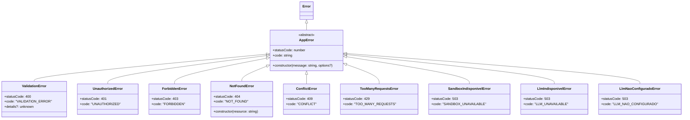
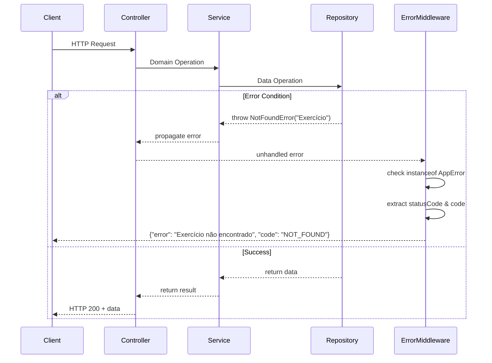
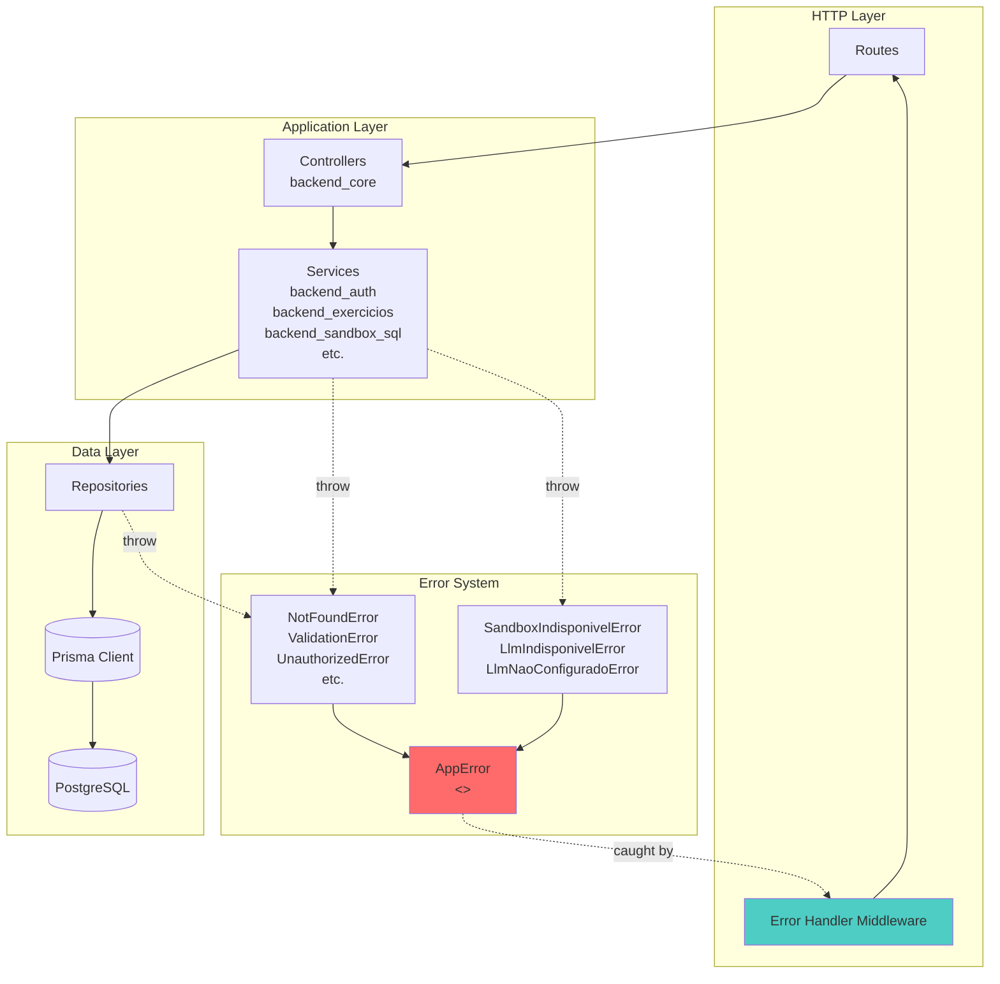
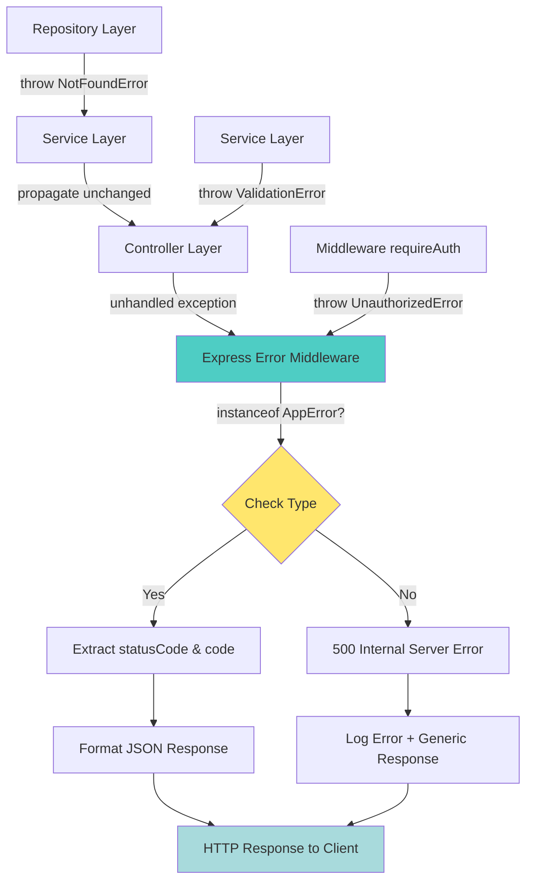

# Backend Error Handling System

**Module**: `backend_errors`  
**Location**: `ide-web-backend/src/errors/`  
**Purpose**: Centralized error hierarchy providing type-safe, HTTP-compliant error handling with Portuguese user-facing messages across the entire backend application.

---

## Overview

The `backend_errors` module implements a structured error handling system for the IDE Web backend. It provides a hierarchy of specialized error classes that map domain-specific failures to appropriate HTTP status codes and error codes, enabling consistent error responses throughout the API. All error messages are in Portuguese since they reach end users directly through the frontend interface.

This module serves as the foundation for error handling across all backend services, supporting the MSC (Model-Service-Controller) architecture by allowing services and repositories to throw semantically meaningful errors that are automatically transformed into proper HTTP responses by the error handling middleware.

---

## Architecture

### Error Class Hierarchy



### Error Flow Through the Application



### Integration with Backend Architecture



---

## Core Components

### 1. AppError (Base Class)

**File**: `ide-web-backend/src/errors/AppError.ts`

The abstract base class for all application errors. Enforces a consistent structure across all error types.

**Contract**:
- `statusCode: number` - HTTP status code (must be implemented by subclass)
- `code: string` - Machine-readable error identifier (must be implemented by subclass)
- `message: string` - Human-readable error message in Portuguese
- `name: string` - Automatically set to the constructor name
- `cause?: unknown` - Optional underlying error (ES2022 error cause)

**Design Principles**:
- Abstract class prevents direct instantiation
- Forces all errors to declare HTTP status and error code
- Preserves stack traces through proper `super()` call
- Supports error chaining via `cause` option

### 2. Client Error Classes (4xx)

#### ValidationError (400)
**Purpose**: Input validation failures, malformed requests, business rule violations.

**Usage**:
```typescript
throw new ValidationError('Email já cadastrado', { details: zodError.issues });
```

**Special Feature**: Includes optional `details` field for structured validation information (e.g., Zod validation errors).

#### UnauthorizedError (401)
**Purpose**: Authentication failures, missing or invalid credentials.

**Usage**:
```typescript
throw new UnauthorizedError('Token inválido ou expirado');
```

**Typical Scenarios**:
- Missing JWT token
- Expired session
- Invalid credentials
- Referenced in `backend_auth` module for session validation

#### ForbiddenError (403)
**Purpose**: Authorization failures where the user is authenticated but lacks permission.

**Usage**:
```typescript
throw new ForbiddenError('Apenas professores podem criar exercícios');
```

**Typical Scenarios**:
- Role-based access control violations
- Cross-tenant access attempts
- Student trying to access teacher-only endpoints

#### NotFoundError (404)
**Purpose**: Resource not found in the database.

**Special Feature**: Gender-aware Portuguese messages.

**Implementation**:
```typescript
const FEMININOS = new Set(['Turma', 'Prova', 'Pesquisa', 'Submissão']);
// "Turma não encontrada" vs "Exercício não encontrado"
```

**Usage**:
```typescript
throw new NotFoundError('Exercício');  // → "Exercício não encontrado"
throw new NotFoundError('Turma');      // → "Turma não encontrada"
```

**Design Rationale**: Since messages reach end users and the interface is entirely in Portuguese, grammatical correctness matters for user experience.

#### ConflictError (409)
**Purpose**: State conflicts, duplicate resources, concurrent modification failures.

**Usage**:
```typescript
throw new ConflictError('Código da turma já existe');
```

**Typical Scenarios**:
- Unique constraint violations
- Optimistic locking failures
- Business logic conflicts (e.g., reopening an active class)

#### TooManyRequestsError (429)
**Purpose**: Rate limiting, quota exhaustion.

**Usage**:
```typescript
throw new TooManyRequestsError('Limite de dicas de IA atingido');
```

**Typical Scenarios**:
- LLM API rate limits (referenced in `backend_dica_ia`)
- Per-user request throttling

### 3. Server Error Classes (5xx)

#### SandboxIndisponivelError (503)
**Purpose**: SQL sandbox database connection failures.

**Default Message**: `"Não foi possível conectar ao banco do sandbox. Tente novamente em instantes."`

**Context**: The system uses a separate Supabase project for the SQL sandbox (see [backend_sandbox_sql](backend_sandbox_sql.md)). This error indicates transient connectivity issues that should resolve on retry.

**Integration**: Thrown by `SandboxExecutionRepository` and `SandboxProvisioningRepository` when `SANDBOX_DATABASE_URL` or `SANDBOX_EXEC_DATABASE_URL` cannot be reached.

#### LlmIndisponivelError (503)
**Purpose**: Transient LLM service failures (provider downtime, network issues).

**Default Message**: `"Serviço de dicas de IA indisponível no momento, tente novamente em instantes"`

**Context**: Indicates temporary unavailability of the Groq LLM service. The frontend should allow retry.

**Integration**: Thrown by `GroqLlmClient` in `backend_dica_ia` module when the external API returns 503 or times out.

#### LlmNaoConfiguradoError (503)
**Purpose**: Missing `LLM_API_KEY` environment variable.

**Default Message**: `"Dicas de IA não configuradas neste ambiente"`

**Critical Distinction**: Unlike `LlmIndisponivelError`, this is **not transient**. Retrying won't help. The frontend must handle this differently (hide the feature or show a permanent notice).

**Design Rationale**: 
```typescript
/**
 * Ambiente sem `LLM_API_KEY`. Diferente de `LlmIndisponivelError` (falha passageira do
 * provedor): isto não se resolve tentando de novo, e a interface precisa saber disso
 * pra não mandar o aluno "tentar em instantes" pra sempre.
 */
```

**Integration**: Checked early in `DicaIaService` before attempting LLM calls.

---

## Error Code Reference

| Error Class | HTTP Status | Error Code | Retry-able | User Action |
|-------------|-------------|------------|------------|-------------|
| `ValidationError` | 400 | `VALIDATION_ERROR` | ❌ | Fix input and resubmit |
| `UnauthorizedError` | 401 | `UNAUTHORIZED` | ❌ | Re-authenticate |
| `ForbiddenError` | 403 | `FORBIDDEN` | ❌ | Request access or switch account |
| `NotFoundError` | 404 | `NOT_FOUND` | ❌ | Verify resource exists |
| `ConflictError` | 409 | `CONFLICT` | ❌ | Resolve conflict manually |
| `TooManyRequestsError` | 429 | `TOO_MANY_REQUESTS` | ✅ | Wait and retry with backoff |
| `SandboxIndisponivelError` | 503 | `SANDBOX_UNAVAILABLE` | ✅ | Retry shortly |
| `LlmIndisponivelError` | 503 | `LLM_UNAVAILABLE` | ✅ | Retry shortly |
| `LlmNaoConfiguradoError` | 503 | `LLM_NAO_CONFIGURADO` | ❌ | Feature unavailable |

---

## Usage Patterns

### In Services

```typescript
// backend_exercicios
export class ExercicioService {
  async buscarPorId(id: string): Promise<Exercicio> {
    const exercicio = await this.exercicioRepository.findById(id);
    if (!exercicio) {
      throw new NotFoundError('Exercício');
    }
    return exercicio;
  }
  
  async criar(professorId: string, data: CreateExercicioInput): Promise<Exercicio> {
    if (data.prazo && data.prazo < new Date()) {
      throw new ValidationError('Prazo não pode ser no passado');
    }
    // ...
  }
}
```

### In Repositories

```typescript
// backend_sandbox_sql
export class PgSandboxExecutionRepository implements SandboxExecutionRepository {
  async executar(schema: string, sql: string): Promise<SandboxExecucaoSucesso | SandboxExecucaoErro> {
    try {
      const pool = await this.getPool();
      // ...
    } catch (error) {
      if (error.code === 'ECONNREFUSED') {
        throw new SandboxIndisponivelError();
      }
      throw error;
    }
  }
}
```

### In Middleware (Error Handler)

```typescript
// ide-web-backend/src/middlewares/errorHandler.ts (referenced in CLAUDE.md)
export const errorHandler: ErrorRequestHandler = (err, req, res, next) => {
  if (err instanceof AppError) {
    return res.status(err.statusCode).json({
      error: err.message,
      code: err.code,
      ...(err instanceof ValidationError && err.details ? { details: err.details } : {}),
    });
  }
  
  // Unknown errors (500)
  console.error('Unexpected error:', err);
  return res.status(500).json({
    error: 'Erro interno do servidor',
    code: 'INTERNAL_SERVER_ERROR',
  });
};
```

### Frontend Error Handling

The frontend consumes these errors through the HTTP client (see `frontend_shared` module):

```typescript
// ide-web-front/src/lib/httpClient.ts pattern (referenced in module tree)
try {
  const response = await fetch(url, options);
  if (!response.ok) {
    const errorData = await response.json();
    // errorData.code can be used for specific handling
    if (errorData.code === 'LLM_NAO_CONFIGURADO') {
      // Hide AI hints feature permanently
    } else if (errorData.code === 'LLM_UNAVAILABLE') {
      // Show retry button
    }
    throw new HttpError(errorData.error, response.status, errorData.code);
  }
} catch (error) {
  // Handle network errors, timeouts, etc.
}
```

---

## Design Decisions

### 1. Portuguese Messages
**Decision**: All error messages are in Portuguese.

**Rationale**: From CLAUDE.md:
> Erros do domínio falam português (`NotFoundError` monta "X não encontrado(a)"), porque a mensagem chega ao usuário; IA sem chave no ambiente responde `LLM_NAO_CONFIGURADO`, separado do 503 passageiro do provedor.

The interface is entirely in Portuguese for Brazilian students and teachers, so errors must match the UI language.

### 2. Separate Service Unavailability Errors
**Decision**: Three distinct 503 errors: `SandboxIndisponivelError`, `LlmIndisponivelError`, `LlmNaoConfiguradoError`.

**Rationale**: 
- **Retry semantics differ**: The first two are transient, the third is permanent
- **User guidance differs**: "Try again shortly" vs "Feature unavailable"
- **Frontend behavior differs**: Show loading spinner vs hide feature entirely
- **Debugging clarity**: Logs immediately show which external dependency failed

### 3. Gender-Aware NotFoundError
**Decision**: `NotFoundError` constructor takes the resource name and applies Portuguese gender rules.

**Rationale**: 
- Grammatically correct messages improve UX
- Centralizes gender logic instead of forcing every call site to construct full messages
- Simple set-based lookup (`FEMININOS`) is maintainable as new resources are added

### 4. ValidationError Details Field
**Decision**: `ValidationError` includes optional structured `details`.

**Rationale**:
- Zod validation errors contain field-level information the frontend can use to highlight specific form fields
- Generic error message provides human summary, details enable programmatic handling
- Backward compatible (optional field)

---

## Integration Points

### With Backend Core
- **Error Middleware**: Catches all `AppError` instances and transforms them into HTTP responses
- **BaseController**: May provide helper methods for consistent error handling patterns (see [backend_core](backend_core.md))

### With Authentication System
- `UnauthorizedError`: Thrown by `SessaoAuthService` when session validation fails
- `ForbiddenError`: Thrown by role guards in `requireAuth` middleware
- See [backend_auth](backend_auth.md) for session management integration

### With Sandbox SQL
- `SandboxIndisponivelError`: Thrown when separate Supabase sandbox database is unreachable
- Connection pooling failures mapped to this error
- See [backend_sandbox_sql](backend_sandbox_sql.md) for database setup details

### With AI Hints System
- `LlmNaoConfiguradoError`: Checked before any Groq API call
- `LlmIndisponivelError`: Thrown on 503 responses or network timeouts from Groq
- `TooManyRequestsError`: Thrown when per-context hint limit (5) is exceeded
- See [backend_dica_ia](backend_dica_ia.md) for LLM integration architecture

### With Exercise Management
- `NotFoundError`: Primary error for missing exercises, turmas, provas, etc.
- `ForbiddenError`: Enforces exercise visibility rules (public vs turma-specific vs prova)
- `ConflictError`: Prevents duplicate turma codes, conflicting prova assignments
- See [backend_exercicios](backend_exercicios.md), [backend_turmas](backend_turmas.md), [backend_provas](backend_provas.md)

---

## Error Propagation Flow



---

## Testing Considerations

### Unit Testing Errors

```typescript
describe('NotFoundError', () => {
  it('should use feminine form for feminine resources', () => {
    const error = new NotFoundError('Turma');
    expect(error.message).toBe('Turma não encontrada');
    expect(error.statusCode).toBe(404);
    expect(error.code).toBe('NOT_FOUND');
  });
  
  it('should use masculine form for masculine resources', () => {
    const error = new NotFoundError('Exercício');
    expect(error.message).toBe('Exercício não encontrado');
  });
});
```

### Integration Testing with Services

```typescript
describe('ExercicioService', () => {
  it('should throw NotFoundError when exercise does not exist', async () => {
    const service = new ExercicioService(mockRepo);
    mockRepo.findById.mockResolvedValue(null);
    
    await expect(service.buscarPorId('invalid-id'))
      .rejects
      .toThrow(NotFoundError);
  });
  
  it('should throw ForbiddenError when student tries to delete exercise', async () => {
    const service = new ExercicioService(mockRepo);
    
    await expect(service.deletar('exercise-id', 'student-user-id'))
      .rejects
      .toThrow(ForbiddenError);
  });
});
```

### E2E Testing Error Responses

From `ide-web-front/playwright.config.ts` (see repository artifacts), the frontend uses Playwright for E2E tests. These can verify error handling:

```typescript
test('should show error message when exercise not found', async ({ page }) => {
  await page.goto('/exercicios/nonexistent-id');
  
  // Should see Portuguese error message
  await expect(page.locator('text=Exercício não encontrado')).toBeVisible();
});

test('should hide AI hints when LLM not configured', async ({ page }) => {
  // Mock API to return LLM_NAO_CONFIGURADO
  await page.route('**/api/v1/exercicios/*/dicas', route => 
    route.fulfill({
      status: 503,
      json: { error: 'Dicas de IA não configuradas neste ambiente', code: 'LLM_NAO_CONFIGURADO' }
    })
  );
  
  await page.goto('/exercicios/some-id');
  
  // AI hint button should be hidden, not just disabled
  await expect(page.locator('[data-testid="ai-hint-button"]')).not.toBeVisible();
});
```

---

## Environment Configuration

### LLM Error States

The distinction between `LlmNaoConfiguradoError` and `LlmIndisponivelError` depends on environment setup:

**Development** (`ide-web-backend/.env`):
```bash
# Missing key → LlmNaoConfiguradoError
# LLM_API_KEY=

# Present key → can throw LlmIndisponivelError on network issues
LLM_API_KEY=gsk_...
```

**Production** (Render environment variables):
- Must set `LLM_API_KEY` for AI hints to work
- Without it, all hint requests return `LLM_NAO_CONFIGURADO` (503)

See [backend_dica_ia](backend_dica_ia.md) for LLM provider configuration.

### Sandbox Error States

**Development** (`docker-compose.yml`):
```yaml
services:
  db_sandbox:
    image: postgres:16-alpine
    # If this service fails to start → SandboxIndisponivelError
```

**Production** (Supabase):
- Requires separate Supabase project for sandbox database
- `SANDBOX_DATABASE_URL` and `SANDBOX_EXEC_DATABASE_URL` must point to reachable instances
- Connection pool exhaustion → `SandboxIndisponivelError`

See [backend_sandbox_sql](backend_sandbox_sql.md) and `ide-web-backend/scripts/sandbox-init.sh` for setup details.

---

## Migration Guide

### Adding New Error Types

1. **Create the error class**:
```typescript
// ide-web-backend/src/errors/RateLimitExceededError.ts
import { AppError } from './AppError';

const HTTP_TOO_MANY_REQUESTS = 429;

export class RateLimitExceededError extends AppError {
  readonly statusCode = HTTP_TOO_MANY_REQUESTS;
  readonly code = 'RATE_LIMIT_EXCEEDED';
  
  constructor(
    public readonly retryAfterSeconds: number,
    message = `Muitas requisições. Tente novamente em ${retryAfterSeconds} segundos.`
  ) {
    super(message);
  }
}
```

2. **Export from errors/index.ts**:
```typescript
export * from './RateLimitExceededError';
```

3. **Use in services**:
```typescript
if (requestCount > limit) {
  throw new RateLimitExceededError(60);
}
```

4. **Handle in frontend** (if needed):
```typescript
if (error.code === 'RATE_LIMIT_EXCEEDED') {
  // Show countdown timer, disable button for retryAfterSeconds
}
```

### Converting Existing Errors

When refactoring code that throws generic errors:

**Before**:
```typescript
throw new Error('Usuário não encontrado');
```

**After**:
```typescript
throw new NotFoundError('Usuário');
```

**Benefits**:
- Automatic HTTP status mapping
- Machine-readable error code
- Consistent message format
- Gender-aware Portuguese

---

## Security Considerations

### 1. Information Disclosure
**Risk**: Error messages might leak sensitive information.

**Mitigation**:
- `AppError` subclasses use generic messages
- Detailed stack traces only logged server-side, never sent to client
- Validation error `details` should not include internal state (safe for Zod field errors)

### 2. Timing Attacks
**Risk**: Different error types for "user not found" vs "wrong password" enable enumeration.

**Mitigation**:
- Authentication endpoints return generic `UnauthorizedError` regardless of specific failure
- No distinction between "email not found" and "wrong password" in responses

### 3. Rate Limiting Bypass
**Risk**: Attackers ignore `TooManyRequestsError` and keep hammering endpoints.

**Mitigation**:
- Error indicates limit exceeded, but enforcement must happen in middleware/infrastructure
- Consider IP-based rate limiting at reverse proxy level (nginx, Cloudflare)

---

## Performance Considerations

### Error Construction Cost
- `NotFoundError` performs set lookup for gender on every construction
- **Impact**: Negligible (Set lookup is O(1), happens only on error path)
- **Alternative considered**: Pre-computed map with all messages - rejected for code duplication

### Stack Trace Collection
- All `AppError` instances capture full stack traces via `super()`
- **Impact**: Non-trivial CPU cost, but acceptable since errors are exceptional
- **Production logging**: Stack traces logged server-side for debugging, stripped from HTTP responses

---

## Future Enhancements

### Planned (Fase 12 - SQL Studio)
From CLAUDE.md decision docs, Fase 12 will introduce:
- Schema migration errors (version conflicts, incompatible changes)
- Privilege escalation errors (attempted role switching to `postgres`)
- Parser errors (malicious SQL, disallowed commands)

These will likely need new error classes:
```typescript
// Potential future errors
class SchemaVersionConflictError extends AppError { /* 409 */ }
class PrivilegeViolationError extends AppError { /* 403 */ }
class DisallowedSqlError extends ValidationError { /* 400 with SQL reason */ }
```

See `docs/decisions/fase12-sql-studio-bd2.md` for planned security enhancements.

### Considerations
1. **Error Aggregation**: For batch operations, consider collecting multiple errors:
```typescript
class BatchValidationError extends ValidationError {
  constructor(public readonly errors: ValidationError[]) {
    super(`${errors.length} validation errors occurred`, { details: errors });
  }
}
```

2. **Retry Metadata**: Add structured retry-after information to 503 errors:
```typescript
class SandboxIndisponivelError extends AppError {
  readonly retryable = true;
  readonly estimatedRecoverySeconds = 5;
}
```

3. **Correlation IDs**: Link errors across distributed traces (backend Node, backend Python, LLM provider):
```typescript
constructor(message: string, public readonly correlationId?: string)
```

---

## Related Documentation

- **[backend_core](backend_core.md)**: Error middleware implementation, `BaseController` patterns
- **[backend_auth](backend_auth.md)**: `UnauthorizedError` and `ForbiddenError` usage in session/role guards
- **[backend_sandbox_sql](backend_sandbox_sql.md)**: `SandboxIndisponivelError` connection handling
- **[backend_dica_ia](backend_dica_ia.md)**: LLM error distinction, rate limiting with `TooManyRequestsError`
- **[backend_exercicios](backend_exercicios.md)**: `NotFoundError`, `ValidationError`, `ForbiddenError` in exercise CRUD
- **[frontend_shared](frontend_shared.md)**: HTTP client error handling, retry logic

---

## Summary

The `backend_errors` module provides:
- ✅ **Type-safe error handling** through `AppError` hierarchy
- ✅ **HTTP-compliant** status codes and error codes
- ✅ **Portuguese user-facing messages** with grammatical correctness
- ✅ **Clear retry semantics** distinguishing transient from permanent failures
- ✅ **Integration-ready** for middleware, services, and repositories across the entire backend

By centralizing error definitions, the module ensures consistent API responses, improves debugging clarity, and enables the frontend to provide appropriate user guidance for each failure scenario.
