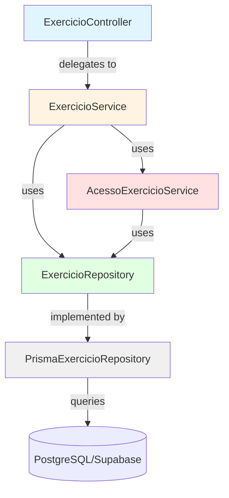
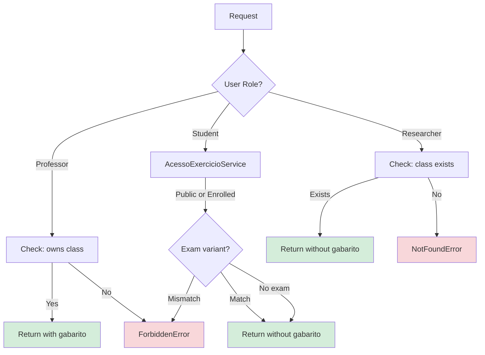
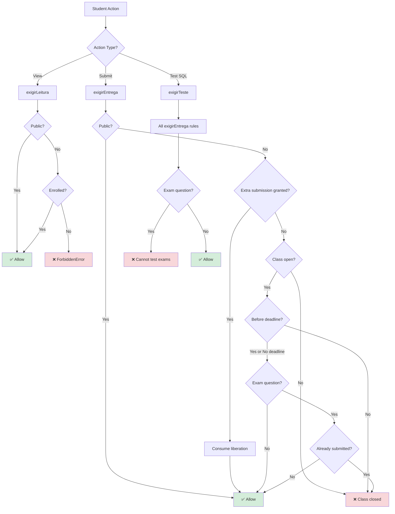
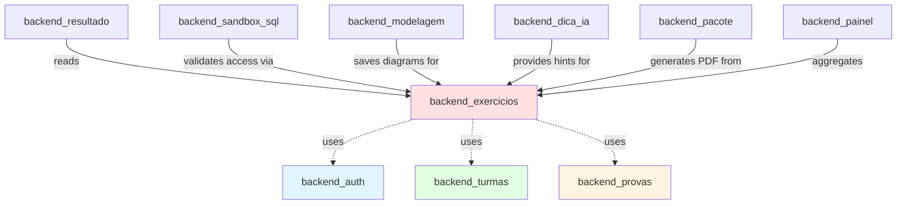

# Backend Exercícios Module

## Overview

The **backend_exercicios** module is the core domain module responsible for managing database exercises (Exercicios) in the IDE Web system. It handles the complete lifecycle of exercises from creation by professors to access control for students, supporting multiple exercise types (MER modeling, SQL queries, and essay questions) with sophisticated access rules for exam mode, deadlines, and public study materials.

This module implements fine-grained access control that distinguishes between reading an exercise (viewing the problem), testing solutions in the sandbox, and submitting final answers, with special rules for public exercises, exam questions, and deadline enforcement.

---

## Architecture

### Layer Structure (MSC Pattern)



**Layers**:
- **Controller** (`ExercicioController`): HTTP request handling, input validation (Zod), response formatting
- **Service** (`ExercicioService`): Business logic, authorization, orchestration
- **Access Control** (`AcessoExercicioService`): Centralized student access rules
- **Repository** (`ExercicioRepository`/`PrismaExercicioRepository`): Data persistence abstraction

---

## Component Breakdown

### ExercicioController

**Responsibility**: HTTP endpoint handler for exercise operations.

**Key Methods**:
- `criar`: `POST /exercicios` - Create new exercise (professor only)
- `atualizar`: `PUT /exercicios/:id` - Update exercise (professor only)
- `buscarPorId`: `GET /exercicios/:id` - Fetch single exercise (with access control)
- `listarPorTurma`: `GET /turmas/:turmaId/exercicios` - List exercises for a class
- `listarPublicos`: `GET /exercicios/publicos` - List public exercises (self-study)

**Access Differentiation**:
```typescript
// Professors/researchers see exercises WITH answer keys (gabarito)
toExercicioProfessorResponseDto(exercicio)

// Students see exercises WITHOUT answer keys
toExercicioAlunoResponseDto(exercicio)
```

**Dependencies**:
- `ExercicioService`: business logic
- `backend_auth`: user authentication via `req.usuario`
- `backend_errors`: `UnauthorizedError`, `ValidationError`

---

### ExercicioService

**Responsibility**: Core business logic for exercise management, authorization checks, and cross-module coordination.

**Key Operations**:

#### 1. Create Exercise
```typescript
async criar(professorId: string, input: CriarExercicioBodyDto): Promise<Exercicio>
```
- Validates professor owns the target class
- Validates proof (Prova) belongs to class if specified
- Auto-assigns next available order number
- Supports optional fields: deadline, proof assignment, public flag, answer keys

#### 2. Update Exercise
```typescript
async atualizar(professorId: string, exercicioId: string, input: AtualizarExercicioBodyDto)
```
- Verifies ownership before update
- All fields optional (partial update)

#### 3. List by Class
```typescript
async listarPorTurma(usuarioId: string, papel: Papel, turmaId: string): Promise<Exercicio[]>
```
- **Professor**: sees all exercises in class
- **Student**: filtered by assigned exam variant (prova_id match)
- **Researcher**: sees all (for research task assignment, no answer key)

#### 4. Fetch by ID
```typescript
async buscarPorId(usuarioId: string, papel: Papel, exercicioId: string): Promise<Exercicio>
```
- **Managers** (professor/researcher): direct fetch with class ownership check
- **Students**: delegates to `AcessoExercicioService.exigirLeitura` + exam variant validation

**Authorization Flow**:


**Dependencies**:
- `ExercicioRepository`: data access
- `TurmaRepository`: class ownership validation (see [backend_turmas](backend_turmas.md))
- `MatriculaRepository`: student enrollment checks (see [backend_turmas](backend_turmas.md))
- `ProvaRepository`: exam variant validation (see [backend_provas](backend_provas.md))
- `AcessoExercicioService`: student access control

---

### AcessoExercicioService

**Responsibility**: **Single source of truth** for student access rules to exercises. Introduced in Fase 8 to replace scattered checks when multi-enrollment and public exercises were added.

**Design Philosophy**:
> "Antes cada serviço comparava `usuario.turma_id === exercicio.turma_id`; com matrícula em várias turmas e exercício público, essa comparação passaria a liberar por coincidência de nulos em vez de por regra" — docs/decisions/fase8-conta-do-aluno-matricula-estudo-livre.md

**Three Access Levels**:

#### 1. Reading (`exigirLeitura`)
**Use**: Open exercise page, view problem statement
```typescript
async exigirLeitura(usuarioId: string, exercicioId: string): Promise<Exercicio>
```
**Rules**:
- ✅ Public exercise → anyone logged in
- ✅ Class exercise → enrolled in that class

#### 2. Submitting (`exigirEntrega`)
**Use**: Submit SQL answer, save MER diagram, finalize exercise
```typescript
async exigirEntrega(usuarioId: string, exercicioId: string): Promise<Exercicio>
```
**Rules** (evaluated in order):
1. ✅ Public exercise → always allowed
2. ✅ Has "extra submission" granted by teacher → bypass all checks below
3. ❌ Class closed (`Turma.encerrada_em != null`) → reject
4. ❌ Past deadline (`Exercicio.prazo < now`) → reject
5. ❌ Exam question already submitted → reject (single submission rule)

**Teacher Liberation Mechanism**:
```typescript
// Teacher can grant ONE extra submission via ResultadoExercicio.envio_liberado_em
// Consumed on next submission via consumirLiberacao()
```

#### 3. Testing (`exigirTeste`)
**Use**: Execute SQL query in sandbox without recording result
```typescript
async exigirTeste(usuarioId: string, exercicioId: string): Promise<Exercicio>
```
**Rules**:
- All `exigirEntrega` rules PLUS
- ❌ Exam question (`prova_id != null`) → always reject
  - Rationale: Testing would allow iteration until correct, defeating exam purpose

**Access Control Flow**:


**Special Rules**:

**Public Exercises** (`Exercicio.publico = true`):
- Available to any logged-in student
- Never freeze when origin class closes
- No enrollment required
- Self-study material (Fase 8)

**Exam Mode** (`Exercicio.prova_id != null`):
- Single submission only
- Testing disabled (prevents iteration)
- Teacher can grant extra submission if student makes mistake
- See [backend_provas](backend_provas.md) for exam variant assignment

**Dependencies**:
- `ExercicioRepository`: fetch exercise
- `MatriculaRepository`: enrollment check
- `TurmaRepository`: class open/closed status
- `SubmissaoSqlRepository`: check previous submissions
- `ResultadoExercicioRepository`: extra submission grants

---

### ExercicioRepository

**Responsibility**: Data access abstraction for Exercise entity.

**Interface Methods**:

```typescript
interface ExercicioRepository {
  // Basic CRUD
  findById(id: string): Promise<Exercicio | null>
  findByTurmaId(turmaId: string): Promise<Exercicio[]>
  findByIds(ids: string[]): Promise<Exercicio[]>
  create(input: CreateExercicioInput): Promise<Exercicio>
  update(id: string, input: UpdateExercicioInput): Promise<Exercicio>
  
  // Exam assembly
  findSemProva(turmaId: string, nivel?: NivelDificuldade): Promise<Exercicio[]>
  vincularAProva(exercicioIds: string[], provaId: string, prazo: Date | null): Promise<number>
  
  // Public exercises
  findPublicos(): Promise<Exercicio[]>
  
  // Utilities
  proximaOrdem(turmaId: string): Promise<number>
  definirGabaritoLiberado(id: string, liberadoEm: Date | null): Promise<Exercicio>
}
```

**Key Queries**:

**1. Exam Assembly** (`findSemProva`):
```typescript
// Exercises without assigned exam (prova_id = null) for exam builder
// One exercise can belong to only ONE exam (Fase 10)
WHERE turma_id = ? AND prova_id IS NULL AND nivel_dificuldade = ?
ORDER BY ordem ASC
```

**2. Public Exercise Listing**:
```typescript
WHERE publico = true
ORDER BY nivel_dificuldade ASC, ordem ASC
```

**3. Auto-ordering** (`proximaOrdem`):
```typescript
// Professor no longer manually assigns "ordem" — auto-incremented
SELECT MAX(ordem) FROM exercicio WHERE turma_id = ?
RETURN max + 1
```

**Implementation**: `PrismaExercicioRepository` uses Prisma Client (PostgreSQL via Supabase).

---

## Data Model

### Exercicio Table

**Schema** (from `prisma/schema.prisma`):

```prisma
model Exercicio {
  id                      String           @id @default(uuid())
  turma_id                String
  prova_id                String?          // null = visible to all; set = exam variant
  titulo                  String
  enunciado               String
  nivel_dificuldade       NivelDificuldade
  ordem                   Int              // Display order (auto-assigned)
  prazo                   DateTime?        // Optional deadline
  publico                 Boolean          @default(false)
  
  // Answer keys (optional, hidden from students)
  mer_gabarito            Json?            // Modeling diagram answer key
  modo_mer                ModoMer?         // conceptual/logical/both
  sql_gabarito            String?          // Expected SQL query
  sql_setup               String?          // Sandbox initial data (DDL + INSERT)
  gabarito_dissertativo   String?          // Essay question answer key
  gabarito_liberado       Boolean          @default(false)
  gabarito_liberado_em    DateTime?
  
  criado_em               DateTime         @default(now())
  atualizado_em           DateTime         @updatedAt
  
  // Relations
  turma                   Turma            @relation(fields: [turma_id])
  prova                   Prova?           @relation(fields: [prova_id])
  diagramas               DiagramaMer[]
  submissoes              SubmissaoSql[]
  resultados              ResultadoExercicio[]
  
  @@index([turma_id])
  @@index([prova_id])
}

enum NivelDificuldade {
  iniciante
  intermediario
  avancado
}

enum ModoMer {
  conceitual         // Only conceptual Chen diagram
  logico             // Only logical/relational model
  conceitual_logico  // Both levels + conversion assistant
}
```

**Multi-Component Design**:
An exercise can combine up to **3 components**:
1. **MER Modeling** (`mer_gabarito`, `modo_mer`) — See [backend_modelagem](backend_modelagem.md)
2. **SQL Query** (`sql_gabarito`, `sql_setup`) — See [backend_sandbox_sql](backend_sandbox_sql.md)
3. **Essay Question** (`gabarito_dissertativo`)

**Exam Mode Fields**:
- `prova_id`: Links exercise to exam variant (see [backend_provas](backend_provas.md))
- When set → single submission + no testing + only visible to students with matching variant

**Public Exercise**:
- `publico = true`: Available in self-study section (`/estudar`)
- No enrollment required, no class lifecycle coupling
- Answer key never shown (even to original professor when listing public exercises)

---

## Integration with Other Modules

### Dependencies Graph



**Module Interactions**:

1. **[backend_auth](backend_auth.md)**
   - Provides: `req.usuario` (authenticated user context)
   - Used in: All controller methods for authorization

2. **[backend_turmas](backend_turmas.md)**
   - Provides: `TurmaRepository`, `MatriculaRepository`
   - Used for: Professor ownership checks, student enrollment validation, class open/closed status

3. **[backend_provas](backend_provas.md)**
   - Provides: `ProvaRepository`
   - Used for: Exam variant assignment, exam assembly queries
   - Key constraint: One exercise → one exam maximum

4. **[backend_resultado](backend_resultado.md)**
   - Consumes: Exercise metadata, answer keys
   - Provides: `ResultadoExercicioRepository` (extra submission grants)
   - Used for: Grading, extra submission liberation

5. **[backend_sandbox_sql](backend_sandbox_sql.md)**
   - Consumes: `sql_setup` (initial schema), `sql_gabarito` (correct answer)
   - Calls: `AcessoExercicioService.exigirTeste/exigirEntrega` before execution
   - Auto-grades: Compares student result rows with `sql_gabarito` result rows

6. **[backend_modelagem](backend_modelagem.md)**
   - Consumes: `mer_gabarito`, `modo_mer` (modeling level)
   - Stores: Student MER diagrams (`DiagramaMer` table)
   - Grading: Manual comparison by professor

7. **[backend_dica_ia](backend_dica_ia.md)**
   - Consumes: Exercise context (MER state, SQL query, enunciado)
   - Provides: LLM-generated hints (Groq/Llama 3.1 8B)

8. **[backend_pacote](backend_pacote.md)**
   - Consumes: Exercise + student answers (MER diagrams, SQL, essay)
   - Generates: PDF submission package

9. **[backend_painel](backend_painel.md)**
   - Consumes: Exercise metadata, completion status
   - Aggregates: Student progress, difficult exercises, grading queue

---

## API Endpoints

**Base Path**: `/api/v1/exercicios`

**Authentication**: All endpoints require `requireAuth` middleware (see [backend_auth](backend_auth.md))

### Professor Endpoints

#### Create Exercise
```http
POST /api/v1/exercicios
Authorization: Bearer <token>
Content-Type: application/json

{
  "turmaId": "uuid",
  "titulo": "Consulta com JOIN",
  "enunciado": "Escreva uma consulta que retorne...",
  "nivelDificuldade": "intermediario",
  "prazo": "2026-10-01T23:59:59Z",  // optional
  "provaId": "uuid",                 // optional (exam mode)
  "publico": false,                  // optional (default: false)
  "modoMer": "conceitual_logico",    // optional
  "merGabarito": {...},              // optional JSON
  "sqlGabarito": "SELECT ...",       // optional
  "sqlSetup": "CREATE TABLE ...",    // optional
  "gabaritoDissertativo": "..."      // optional
}

Response 201 Created:
{
  "success": true,
  "data": {
    "id": "uuid",
    "titulo": "Consulta com JOIN",
    // ... all fields INCLUDING gabarito (professor view)
    "gabaritoLiberado": false,
    "criadoEm": "2026-09-22T10:00:00Z"
  }
}
```

**Validation** (Zod schema):
- `titulo`: 3-200 chars
- `enunciado`: 10+ chars
- `nivelDificuldade`: enum (iniciante/intermediario/avancado)
- `ordem`: Auto-assigned (no manual input since Fase 10)

#### Update Exercise
```http
PUT /api/v1/exercicios/:id
Authorization: Bearer <token>

{
  "titulo": "Updated title",
  "prazo": null  // Can remove deadline
  // Any field from create (partial update)
}

Response 200 OK:
{
  "success": true,
  "data": { /* updated exercise */ }
}
```

**Authorization**:
- ✅ Professor owns exercise's class
- ❌ Otherwise → `403 ForbiddenError`

---

### Student Endpoints

#### Fetch Exercise
```http
GET /api/v1/exercicios/:id
Authorization: Bearer <token>

Response 200 OK (Student):
{
  "success": true,
  "data": {
    "id": "uuid",
    "titulo": "...",
    "enunciado": "...",
    "nivelDificuldade": "intermediario",
    "prazo": "2026-10-01T23:59:59Z",
    "modoMer": "conceitual_logico",
    "sqlSetup": "CREATE TABLE ...",
    "gabaritoLiberado": false,
    // NO gabarito fields (answer keys hidden)
    "turma": { "id": "...", "nome": "..." }
  }
}

Response 200 OK (Professor):
{
  "success": true,
  "data": {
    // All fields INCLUDING gabarito
    "merGabarito": {...},
    "sqlGabarito": "SELECT ...",
    "gabaritoDissertativo": "..."
  }
}
```

**Access Control**:
- Student: `AcessoExercicioService.exigirLeitura` + exam variant check
- Professor/Researcher: Class ownership/existence check

#### List by Class
```http
GET /api/v1/turmas/:turmaId/exercicios
Authorization: Bearer <token>

Response 200 OK:
{
  "success": true,
  "data": [
    { /* exercise 1 */ },
    { /* exercise 2 */ }
  ]
}
```

**Filtering**:
- Student: Only exercises matching their exam variant (`prova_id`)
- Professor: All exercises in class
- Researcher: All exercises (for research task selection)

#### List Public Exercises
```http
GET /api/v1/exercicios/publicos

Response 200 OK:
{
  "success": true,
  "data": [
    {
      "id": "uuid",
      "titulo": "Self-study exercise",
      "nivelDificuldade": "iniciante",
      "publico": true
      // NO gabarito (even for professor who created it)
    }
  ]
}
```

**Ordering**: `nivel_dificuldade ASC, ordem ASC`

---

## Business Rules Summary

### Exercise Creation
1. ✅ Professor must own target class
2. ✅ If `provaId` specified → exam must belong to same class
3. ✅ `ordem` auto-assigned (next available number)
4. ✅ All answer key fields optional (can create exercises with manual grading only)

### Student Access
| Action | Public Exercise | Class Exercise | Exam Exercise | Deadline Passed | Extra Submission |
|--------|----------------|----------------|---------------|-----------------|------------------|
| **Read** | ✅ Any student | ✅ If enrolled | ✅ If variant matches | ✅ Allowed | ✅ Allowed |
| **Submit** | ✅ Always | ✅ If class open | ✅ Once only | ❌ Blocked | ✅ Bypass all |
| **Test SQL** | ✅ Always | ✅ If class open | ❌ Never | ❌ Blocked | ✅ Bypass deadline |

### Public Exercises
- ✅ Visible to any logged-in student (no enrollment)
- ✅ Independent of origin class lifecycle (doesn't freeze when class closes)
- ✅ Answer key never shown (even in `/publicos` listing)
- ✅ Automatic grading only (SQL comparison, no manual review)
- ✅ Used for self-study section (`/estudar`)

### Exam Mode
- ✅ One exercise can belong to only ONE exam (`Exercicio.prova_id` unique assignment)
- ✅ Only students with matching exam variant can see the exercise
- ✅ Single submission per student (enforced by `AcessoExercicioService`)
- ✅ Testing disabled (prevents iteration to correct answer)
- ✅ Teacher can grant extra submission if student makes syntax error

### Deadline Enforcement
- ✅ Optional (`prazo` nullable)
- ❌ Blocks submission after deadline passes
- ✅ Teacher liberation (`envio_liberado_em`) bypasses deadline
- ✅ Reading still allowed after deadline

### Class Closure
- ❌ Closed class (`Turma.encerrada_em != null`) blocks all submissions
- ✅ Reading still allowed
- ✅ **Exception**: Public exercises never freeze with origin class

---

## Error Handling

**Domain Errors** (Portuguese messages for user display):

```typescript
// Not found
throw new NotFoundError('Exercício')
// → 404: "Exercício não encontrado"

// Authorization
throw new ForbiddenError('Você não é o professor desta turma')
// → 403: "Você não é o professor desta turma"

throw new ForbiddenError('Este exercício pertence a outra prova')
// → 403: "Este exercício pertence a outra prova"

throw new ForbiddenError('Questão de prova não permite testar')
// → 403: "Questão de prova não permite testar: revise sua consulta e envie uma vez"

// Deadline
throw new ForbiddenError(`O prazo desta atividade encerrou em ${quando}`)
// → 403: "O prazo desta atividade encerrou em 01/10/2026 23:59:59"

// Single submission
throw new ForbiddenError('Questão de prova aceita um envio só, e o seu já foi registrado')
// → 403

// Class closed
throw new ForbiddenError('Esta turma foi encerrada e não aceita mais entregas')
// → 403
```

**Error Propagation**:
- Controller catches and formats via `errorHandler` middleware (see [backend_core](backend_core.md))
- Service throws domain errors (NotFoundError, ForbiddenError)
- Repository throws Prisma errors (converted to AppError by error handler)

---

## Testing Considerations

**Unit Test Coverage**:
1. **ExercicioService**
   - Professor ownership validation
   - Exam variant filtering for students
   - Auto-ordering logic
   - Public exercise listing

2. **AcessoExercicioService** (Critical path)
   - Public exercise bypass
   - Enrollment validation
   - Deadline enforcement
   - Exam single submission rule
   - Extra submission liberation and consumption
   - Testing blocked for exams

3. **ExercicioRepository**
   - Exam assembly query (`findSemProva`)
   - Auto-order calculation
   - Public exercise filtering

**Integration Test Scenarios**:
- Student attempts to access exercise from different exam variant → 403
- Student submits after deadline without liberation → 403
- Student tries to test exam question → 403
- Teacher grants extra submission → student can submit again
- Public exercise accessible without enrollment
- Class closure blocks submissions but allows reading

**E2E Test** (Playwright):
- See `ide-web-front/tests/e2e/exercicio.e2e.ts` (frontend test suite)
- Professor creates exercise with all components
- Student solves public exercise without class enrollment
- Exam mode enforces single submission

---

## Configuration

**Environment Variables**:
None specific to this module. Uses shared database connection:
- `DATABASE_URL`: Main Postgres connection (Supabase) — see [infrastructure](infrastructure.md)

**Prisma Configuration**:
```typescript
// ide-web-backend/src/lib/prisma.ts
import { PrismaClient } from '@prisma/client'

export const prisma = new PrismaClient({
  adapter: '@prisma/adapter-pg', // PostgreSQL driver
  log: process.env.NODE_ENV === 'development' ? ['query', 'error'] : ['error']
})
```

**Module Registration** (`ide-web-backend/src/app.ts`):
```typescript
const exercicioRepository = new PrismaExercicioRepository()
const acessoExercicio = new AcessoExercicioService(
  exercicioRepository,
  matriculaRepository,
  turmaRepository,
  submissaoRepository,
  resultadoRepository
)
const exercicioService = new ExercicioService(
  exercicioRepository,
  turmaRepository,
  matriculaRepository,
  provaRepository,
  acessoExercicio
)
const exercicioController = new ExercicioController(exercicioService)

app.use('/api/v1/exercicios', exercicioRoutes(exercicioController))
app.use('/api/v1/turmas', turmaRoutes(/* includes exercicio listing */))
```

---

## Evolution History

### Fase 2 (Initial Implementation)
- Basic CRUD for exercises
- Turma-based access control
- Three optional components (MER, SQL, essay)

### Fase 5 (Exam System)
- `prova_id` field for exam variant assignment
- Single submission rule

### Fase 7 (Modeling Levels)
- `modo_mer` field (conceitual/logico/conceitual_logico)
- Structured MER answer key (`mer_gabarito` as JSON v2)

### Fase 8 (Multi-enrollment + Public Exercises)
- **AcessoExercicioService introduced** (centralized access control)
- Public exercises (`publico` flag)
- Multi-class enrollment support
- Separated "finalize" from "download PDF"

### Fase 10 (Exam Mode + Deadlines)
- `prazo` field (optional deadline)
- Extra submission liberation mechanism
- Testing blocked for exam questions
- Auto-assigned `ordem` (professor no longer manually numbers)
- Exam assembly query (`findSemProva`)

---

## Related Documentation

- **[backend_auth](backend_auth.md)**: Authentication and authorization
- **[backend_turmas](backend_turmas.md)**: Class management, enrollment, closure
- **[backend_provas](backend_provas.md)**: Exam variants, exam assembly
- **[backend_resultado](backend_resultado.md)**: Grading, extra submission grants
- **[backend_sandbox_sql](backend_sandbox_sql.md)**: SQL execution, auto-grading
- **[backend_modelagem](backend_modelagem.md)**: MER diagram storage, conversion
- **[backend_dica_ia](backend_dica_ia.md)**: LLM hints for exercises
- **[backend_pacote](backend_pacote.md)**: PDF generation
- **[backend_painel](backend_painel.md)**: Progress tracking, dashboards
- **[infrastructure](infrastructure.md)**: Docker, database setup

---

## Quick Reference

**Key Files**:
- `ide-web-backend/src/controllers/ExercicioController.ts`
- `ide-web-backend/src/services/ExercicioService.ts`
- `ide-web-backend/src/services/AcessoExercicioService.ts` ⭐ (Access control logic)
- `ide-web-backend/src/repositories/ExercicioRepository.ts`

**Database Table**: `Exercicio` (PostgreSQL via Supabase)

**API Prefix**: `/api/v1/exercicios`

**Key Concepts**:
- **Public Exercise**: Self-study material, no enrollment required
- **Exam Mode**: `prova_id != null` → single submission, no testing
- **Access Levels**: Read < Submit < Test (progressively stricter)
- **Extra Submission**: Teacher-granted bypass for deadline + single submission rule
- **Multi-component**: One exercise can combine MER + SQL + essay

**Decision Documents**:
- `docs/decisions/fase2-turmas-exercicios-tcle.md`
- `docs/decisions/fase7-modelagem-conceitual-logica.md`
- `docs/decisions/fase8-conta-do-aluno-matricula-estudo-livre.md`
- `docs/decisions/fase10-professor-prova-sessao.md`
