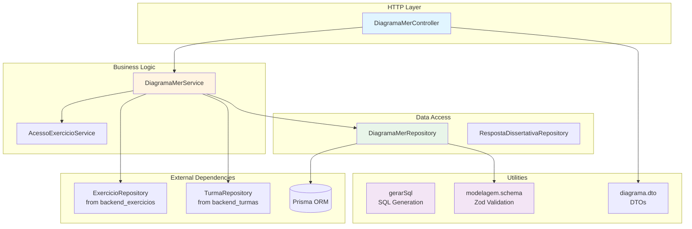
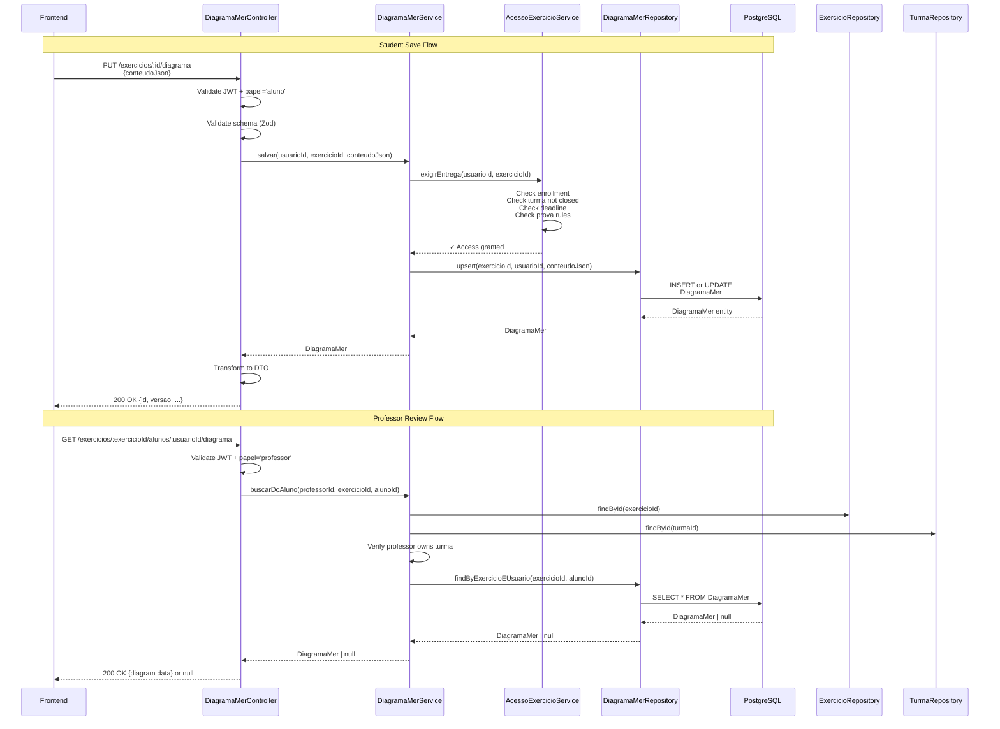
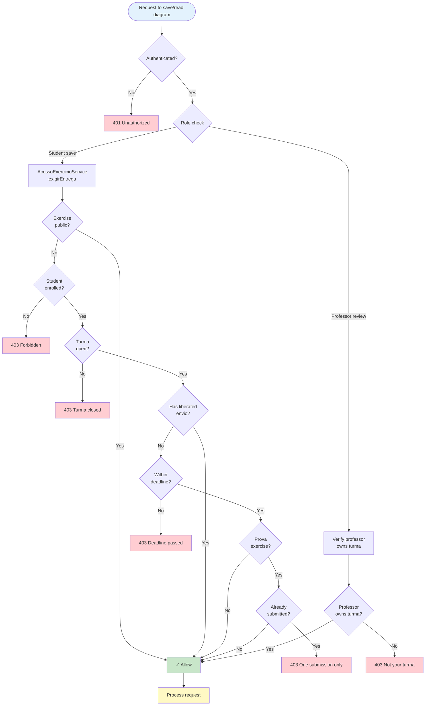
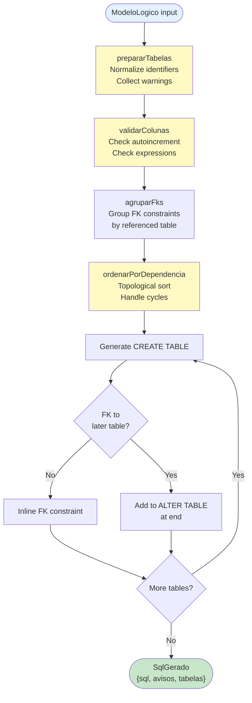
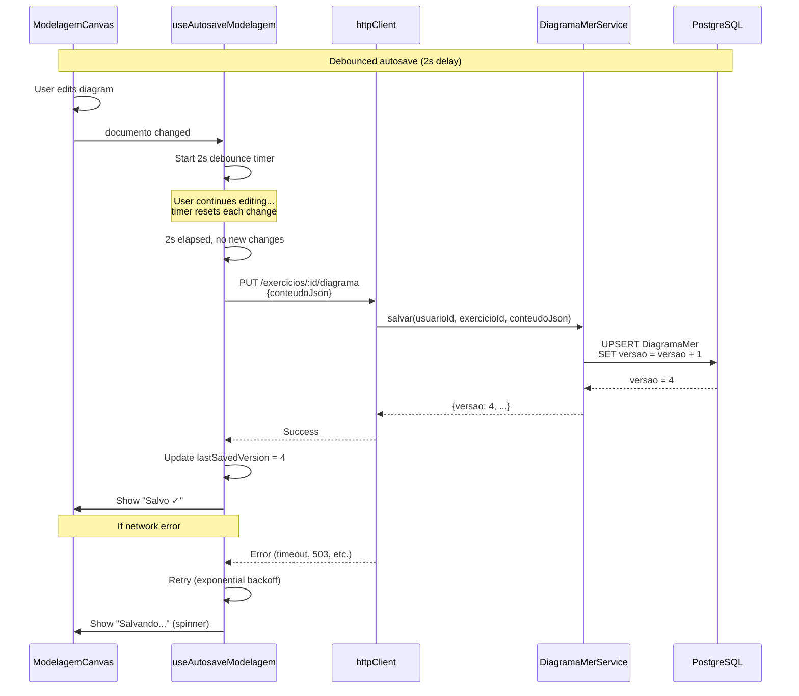
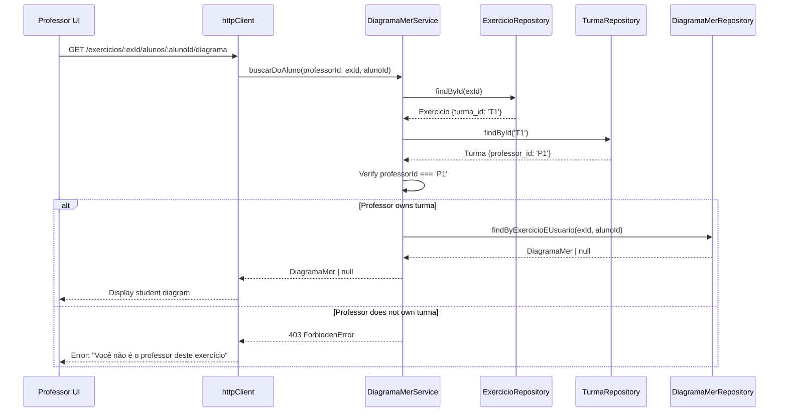
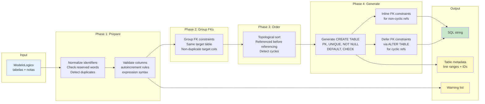

# Backend Modelagem Module

> **Module**: `backend_modelagem`  
> **Location**: `ide-web-backend/src/{controllers,services,repositories,utils/modelagem}`  
> **Purpose**: Backend persistence and business logic for database modeling (conceptual Chen notation and logical/relational model)

## Overview

The `backend_modelagem` module manages the persistence and validation of database modeling diagrams created by students. It supports a **dual-level modeling approach**:

- **Conceptual Model**: Entity-Relationship diagrams using Chen notation (entities, relationships, attributes, specializations)
- **Logical Model**: Relational tables with columns, constraints, and foreign keys
- **Conversion**: Assisted transformation from conceptual to logical models with user-driven decisions

This module is a core component of the IDE Web educational platform, enabling students to practice database design and professors to review submissions. It enforces strict access control, validates document structure, and generates PostgreSQL DDL from logical models.

### Key Capabilities

- **Autosave persistence** with versioning and optimistic concurrency control
- **Access control** integrated with exercise and enrollment management
- **Pure SQL generation** from logical models (mirrored between backend and frontend)
- **Professor review** of student submissions
- **Schema validation** using Zod with comprehensive integrity checks
- **Multi-mode support**: conceptual-only, logical-only, or combined conceptual→logical workflows

---

## Architecture

### Component Structure



### Data Flow



### Access Control Flow



---

## Core Components

### DiagramaMerController

**Responsibility**: HTTP request handling and validation

**Location**: `ide-web-backend/src/controllers/DiagramaMerController.ts`

**Methods**:
- `salvar(req, res)` - Save student's modeling diagram (PUT `/exercicios/:id/diagrama`)
- `buscar(req, res)` - Retrieve student's own diagram (GET `/exercicios/:id/diagrama`)
- `buscarDoAluno(req, res)` - Professor retrieves student diagram (GET `/exercicios/:exercicioId/alunos/:usuarioId/diagrama`)

**Validation**:
- JWT authentication via `requireAuth` middleware
- Role validation via `requirePapel` middleware ('aluno' for save/read, 'professor'/'pesquisador' for review)
- Schema validation using `salvarDiagramaBodySchema` (Zod)

**Error Handling**:
- `UnauthorizedError` - Missing authentication
- `ValidationError` - Invalid diagram structure
- Delegates domain errors to service layer

---

### DiagramaMerService

**Responsibility**: Business logic and access control orchestration

**Location**: `ide-web-backend/src/services/DiagramaMerService.ts`

**Dependencies**:
- `DiagramaMerRepository` - Data persistence
- `ExercicioRepository` - Exercise validation
- `AcessoExercicioService` - Access control enforcement
- `TurmaRepository` - Turma ownership validation

**Methods**:

#### `salvar(usuarioId, exercicioId, conteudoJson): Promise<DiagramaMer>`
Saves a student's modeling diagram with access control checks.

**Flow**:
1. Calls `acessoExercicio.exigirEntrega()` to validate:
   - Exercise is public OR student is enrolled
   - Turma is not closed
   - Deadline not passed (unless liberated)
   - Prova rules (single submission) not violated
2. Delegates to repository for upsert operation

**Returns**: Saved `DiagramaMer` entity with incremented version

---

#### `buscar(usuarioId, exercicioId): Promise<DiagramaMer | null>`
Retrieves a student's own diagram with read access validation.

**Flow**:
1. Calls `acessoExercicio.exigirLeitura()` to validate:
   - Exercise is public OR student is enrolled
2. Returns diagram or null if not found

---

#### `buscarDoAluno(professorId, exercicioId, alunoId): Promise<DiagramaMer | null>`
Allows professor to read a student's diagram (used in review interface).

**Access Control**:
- Verifies exercise exists
- Verifies professor owns the turma to which the exercise belongs
- Throws `ForbiddenError` if ownership check fails

**Security Note**: Professor never writes to student diagrams; this is read-only access.

---

### DiagramaMerRepository

**Responsibility**: Data persistence with Prisma ORM

**Location**: `ide-web-backend/src/repositories/DiagramaMerRepository.ts`

**Interface**: `DiagramaMerRepository`

**Implementation**: `PrismaDiagramaMerRepository`

**Methods**:

#### `findByExercicioEUsuario(exercicioId, usuarioId): Promise<DiagramaMer | null>`
Retrieves diagram by composite unique key `(exercicio_id, usuario_id)`.

**Database Constraint**: Uses Prisma's `@@unique([exercicio_id, usuario_id])` index for efficient lookup.

---

#### `upsert(exercicioId, usuarioId, conteudoJson): Promise<DiagramaMer>`
Creates or updates diagram with optimistic concurrency control.

**Behavior**:
- **Create**: Sets `versao = 1`, stores `conteudo_json`
- **Update**: Increments `versao`, updates `conteudo_json`, sets `atualizado_em = NOW()`

**Prisma Operation**:
```typescript
prisma.diagramaMer.upsert({
  where: { exercicio_id_usuario_id: { exercicio_id, usuario_id } },
  create: { exercicio_id, usuario_id, conteudo_json, versao: 1 },
  update: { conteudo_json, versao: { increment: 1 } },
})
```

**Versioning**: The `versao` field supports conflict detection in autosave scenarios (frontend tracks last known version).

---

### RespostaDissertativaRepository

**Responsibility**: Data access for dissertative (text) responses

**Location**: `ide-web-backend/src/repositories/RespostaDissertativaRepository.ts`

**Status**: **Read-only** (no write endpoint yet; planned for future phases)

**Interface**: `RespostaDissertativaRepository`

**Implementation**: `PrismaRespostaDissertativaRepository`

**Methods**:

#### `findByExercicioEUsuario(exercicioId, usuarioId): Promise<RespostaDissertativa | null>`
Retrieves the most recent dissertative response for a given exercise and user.

**Note**: Since `RespostaDissertativa` does not yet have a unique constraint, this method sorts by `versao DESC` and takes the first result.

**Usage**: Currently used by [backend_pacote](backend_pacote.md) to include dissertative responses in generated PDFs.

---

### gerarSql (Pure Function)

**Responsibility**: PostgreSQL DDL generation from logical model

**Location**: `ide-web-backend/src/utils/modelagem/gerarSql.ts`

**Function Signature**:
```typescript
function gerarSql(logico: ModeloLogico): SqlGerado
```

**Input**: `ModeloLogico` (validated by `modeloLogicoSchema`)

**Output**: `SqlGerado` object containing:
- `sql: string` - Formatted PostgreSQL DDL
- `avisos: string[]` - Warnings about potential issues (reserved words, missing PKs, type mismatches, etc.)
- `tabelas: TabelaGerada[]` - Metadata for synchronization (line ranges, column IDs)

**Design Principle**: **Pure function** — no side effects, deterministic output, mirrored between backend and frontend for consistency.

#### SQL Generation Process



#### Key Features

1. **Identifier Normalization**:
   - Converts names to lowercase, removes invalid characters
   - Detects PostgreSQL reserved words and quotes them
   - Warns about name collisions

2. **Type Rendering**:
   - `VARCHAR(n)` - defaults to 255 if unspecified
   - `CHAR(n)` - defaults to 1
   - `NUMERIC(p, s)` - defaults to (10, 2)
   - All other types rendered as-is (INTEGER, BIGINT, DATE, etc.)

3. **Constraint Generation**:
   - `PRIMARY KEY` - inline for single column, separate clause for composite
   - `NOT NULL` - omitted for PK and IDENTITY (implied in PostgreSQL)
   - `UNIQUE` - inline unless part of PK
   - `DEFAULT` - rendered as-is (no validation)
   - `CHECK` - rendered as-is, warns about unbalanced parentheses
   - `FOREIGN KEY` - grouped by referenced table, validates target is PK or UNIQUE

4. **Dependency Ordering**:
   - Tables sorted topologically to create referenced tables first
   - Circular dependencies detected and deferred to `ALTER TABLE` statements

5. **Validation Warnings**:
   - Tables without names or PKs
   - Columns without names or duplicate names
   - Autoincrement on non-integer types
   - FK type mismatches
   - FKs not pointing to PK or UNIQUE constraint
   - Reserved words in identifiers

**Mirror Implementation**: This function is **identical** in `ide-web-front/src/features/exercicio/modelagem/gerarSql.ts` to ensure consistent SQL output between backend (for AI hints) and frontend (for display).

---

## Data Model

### DiagramaMer (Prisma Entity)

**Table**: `DiagramaMer`

**Schema**:
```prisma
model DiagramaMer {
  id            String   @id @default(uuid())
  exercicio_id  String
  usuario_id    String
  conteudo_json Json     @db.JsonB
  versao        Int
  atualizado_em DateTime @default(now()) @updatedAt

  exercicio Exercicio @relation(fields: [exercicio_id], references: [id], onDelete: Cascade)
  usuario   Usuario   @relation(fields: [usuario_id], references: [id], onDelete: Cascade)

  @@unique([exercicio_id, usuario_id])
}
```

**Fields**:
- `id` - UUID primary key
- `exercicio_id` - Foreign key to `Exercicio`
- `usuario_id` - Foreign key to `Usuario`
- `conteudo_json` - JSONB column storing `DocumentoModelagem` (see below)
- `versao` - Integer version counter (incremented on each update)
- `atualizado_em` - Timestamp of last update

**Constraints**:
- Unique composite key on `(exercicio_id, usuario_id)` - one diagram per student per exercise
- Cascade delete when exercise or user is deleted

---

### DocumentoModelagem (JSON Schema)

**Location**: `ide-web-backend/src/dtos/modelagem.schema.ts`

**Version**: 2 (see `VERSAO_DOCUMENTO`)

**Structure**:
```typescript
{
  versao: 2,
  conceitual: ModeloConceitual | null,
  logico: ModeloLogico | null,
  conversao: Conversao | null
}
```

#### ModeloConceitual (Chen Notation)

**Elements**:
- `entidade` - Entity (rectangle)
- `relacionamento` - Relationship (diamond), with `associativa: boolean` flag
- `atributo` - Attribute (circle), with:
  - `paiId` - Parent element (entity, relationship, or another attribute for composite)
  - `chave` - Identifier/key attribute
  - `cardinalidade` - "(1,1)", "(0,1)", "(0,n)", "(1,n)"
  - `tipoSugerido` - Type hint for conversion (nullable)
- `especializacao` - Specialization (triangle), with:
  - `paiId` - Generic entity
  - `total` / `disjunta` - (t|p), (d|s) classification
- `nota` - Annotation/note (text box)

**Ligations** (Connections):
- `participacao` - Entity-Relationship link with `(min, max)` cardinality and optional `papel` (role)
- `filho_especializacao` - Specialization child link

**Validation**:
- No duplicate IDs across elements and ligations
- Attributes must have entity/relationship/attribute parent
- Specializations must have entity parent
- Participations must connect entity to relationship (or associative entity to relationship)
- No cycles in attribute hierarchy

**View Mode**: `visaoAtributos` - "circulos" (circles) or "lista" (list mode in editor)

---

#### ModeloLogico (Relational Model)

**Tables**:
- `id` - Unique identifier
- `posicao` - {x, y} position in canvas
- `nome` - Table name (max 63 chars per PostgreSQL limit)
- `colunas` - Array of columns (max 60 per table)

**Columns**:
- `id` - Unique identifier
- `nome` - Column name
- `tipo` - One of: INTEGER, BIGINT, SMALLINT, NUMERIC, REAL, VARCHAR, CHAR, TEXT, DATE, TIME, TIMESTAMP, BOOLEAN
- `tamanho` / `escala` - Precision/scale for NUMERIC, length for VARCHAR/CHAR
- `pk` - Primary key flag
- `notNull` - NOT NULL constraint
- `unique` - UNIQUE constraint
- `autoIncremento` - GENERATED BY DEFAULT AS IDENTITY (PostgreSQL)
- `padrao` - DEFAULT expression
- `check` - CHECK constraint expression
- `fk` - Foreign key: `{tabelaId, colunaId}` or null

**Validation**:
- No duplicate IDs across tables, columns, and notes
- FK must point to existing column
- Checks for structural integrity (no orphaned FKs)

**Notes**: Text annotations on the canvas (max 50)

---

#### Conversao (Conversion Metadata)

**Purpose**: Tracks conceptual→logical conversion state to detect when conceptual model changes after conversion.

**Fields**:
- `assinaturaConceitual` - Hash/signature of the conceptual model at conversion time
- `convertidoEm` - Timestamp of conversion
- `escolhas` - Map of `{elementId: estrategia}` recording user decisions for:
  - `fk_lado_total` - 1:1 relationship: FK on total participation side
  - `fundir` - 1:1 relationship: merge into one table
  - `tabela_propria` - N:N relationship: create junction table
  - `tabela_por_entidade` - Specialization: table per entity
  - `tabela_unica` - Specialization: single table with discriminator
  - `so_especializadas` - Specialization: tables only for specialized entities

**Frontend Usage**: `ConceitualLogicoEditor` compares current `assinaturaConceitual()` with stored value and displays warning if conceptual model was modified after conversion.

---

### RespostaDissertativa (Prisma Entity)

**Table**: `RespostaDissertativa`

**Schema**:
```prisma
model RespostaDissertativa {
  id            String   @id @default(uuid())
  exercicio_id  String
  usuario_id    String
  texto         String
  versao        Int
  criado_em     DateTime @default(now())

  exercicio Exercicio @relation(fields: [exercicio_id], references: [id], onDelete: Cascade)
  usuario   Usuario   @relation(fields: [usuario_id], references: [id], onDelete: Cascade)
}
```

**Current State**: No unique constraint yet (planned); repository fetches most recent by `versao DESC`.

**Usage**: Read-only access for PDF generation and professor review.

---

## API Endpoints

### Student Diagram Operations

#### Save Diagram
```
PUT /api/v1/exercicios/:id/diagrama
```

**Auth**: Required (JWT cookie)  
**Role**: `aluno`  
**Body**:
```json
{
  "conteudoJson": {
    "versao": 2,
    "conceitual": { ... } | null,
    "logico": { ... } | null,
    "conversao": { ... } | null
  }
}
```

**Response** (200 OK):
```json
{
  "id": "uuid",
  "exercicioId": "uuid",
  "usuarioId": "uuid",
  "conteudoJson": { ... },
  "versao": 3,
  "atualizadoEm": "2026-09-22T10:30:00.000Z"
}
```

**Errors**:
- 401 - Unauthorized (missing/invalid JWT)
- 403 - Forbidden (turma closed, deadline passed, not enrolled, prova single-submission violated)
- 422 - Validation error (invalid schema, integrity check failed)

---

#### Retrieve Own Diagram
```
GET /api/v1/exercicios/:id/diagrama
```

**Auth**: Required  
**Role**: `aluno`  

**Response** (200 OK):
```json
{
  "id": "uuid",
  "exercicioId": "uuid",
  "usuarioId": "uuid",
  "conteudoJson": { ... },
  "versao": 3,
  "atualizadoEm": "2026-09-22T10:30:00.000Z"
}
```

or `null` if no diagram saved yet.

**Errors**:
- 401 - Unauthorized
- 403 - Forbidden (not enrolled in turma for non-public exercise)

---

### Professor Review Operations

#### Retrieve Student Diagram
```
GET /api/v1/exercicios/:exercicioId/alunos/:usuarioId/diagrama
```

**Auth**: Required  
**Role**: `professor` or `pesquisador`  

**Response** (200 OK): Same structure as student retrieval, or `null`.

**Errors**:
- 401 - Unauthorized
- 403 - Forbidden (professor does not own the turma)
- 404 - Exercise not found

**Usage**: Called by professor review interface (`RevisaoModelagem` component in frontend) to display student's submitted diagram alongside gabarito.

---

## Integration with Other Modules

### Dependencies

| Module | Components Used | Purpose |
|--------|----------------|---------|
| [backend_exercicios](backend_exercicios.md) | `ExercicioRepository`, `AcessoExercicioService` | Exercise validation, access control |
| [backend_turmas](backend_turmas.md) | `TurmaRepository`, `MatriculaRepository` | Turma ownership verification, enrollment checks |
| [backend_resultado](backend_resultado.md) | `ResultadoExercicioRepository` | Check for liberated envio (extra submission allowance) |
| [backend_errors](backend_errors.md) | `NotFoundError`, `UnauthorizedError`, `ValidationError`, `ForbiddenError` | Domain error types |
| [backend_core](backend_core.md) | `BaseController` | Base class for HTTP controllers |

### Dependents

| Module | Usage |
|--------|-------|
| [backend_pacote](backend_pacote.md) | Reads `DiagramaMer` and `RespostaDissertativa` to generate PDF submissions |
| [backend_dica_ia](backend_dica_ia.md) | Uses `gerarSql()` to include logical model SQL in AI hint prompts |
| [frontend_modelagem](frontend_modelagem.md) | Calls save/retrieve endpoints, mirrors `gerarSql()` for display |

---

## Key Processes

### Autosave Flow (Frontend → Backend)



**Key Points**:
- Frontend debounces for 2 seconds to avoid excessive saves during active editing
- Backend upsert is idempotent (safe to retry)
- Versioning supports conflict detection (not currently enforced in UI)
- Validation happens on backend; frontend re-validates on retrieval

---

### Professor Review Flow



---

### SQL Generation Details



**Example Output**:

```sql
CREATE TABLE pessoa (
  id INTEGER GENERATED BY DEFAULT AS IDENTITY,
  nome VARCHAR(100) NOT NULL,
  nascimento DATE,
  PRIMARY KEY (id)
);

CREATE TABLE telefone (
  id INTEGER GENERATED BY DEFAULT AS IDENTITY,
  pessoa_id INTEGER NOT NULL,
  numero VARCHAR(20) NOT NULL,
  PRIMARY KEY (id),
  CONSTRAINT fk_telefone_pessoa_id FOREIGN KEY (pessoa_id) REFERENCES pessoa (id)
);
```

**Warnings**:
```
"nome" é palavra reservada do PostgreSQL; foi escrita entre aspas.
A tabela "endereco" não tem chave primária.
```

---

## Schema Validation

### Validation Layers

1. **Zod Schema Validation** (`modelagem.schema.ts`):
   - Type checking (correct unions, enums)
   - Length limits (table names ≤ 63 chars, max 150 tables, max 60 columns/table)
   - Field format (IDs, positions, expressions)

2. **Integrity Checks** (`problemasDoLogico`, `problemasDoConceitual`):
   - No duplicate IDs
   - FK points to existing column
   - Attribute has valid parent (entity/relationship/attribute)
   - Specialization has entity parent
   - No cycles in attribute hierarchy

3. **Semantic Warnings** (in `gerarSql`):
   - Table without PK
   - Column without name
   - Autoincrement on non-integer type
   - FK type mismatch
   - FK not pointing to PK or UNIQUE

**Fail-Fast**: Requests with schema validation errors (`problemasDoLogico` / `problemasDoConceitual` non-empty) are rejected with **422 Unprocessable Entity** before reaching the database.

---

## Security Considerations

### Access Control Enforcement

1. **Student Save**:
   - Exercise must be public OR student enrolled in turma
   - Turma must not be closed (`encerrada_em IS NULL`)
   - Deadline must not have passed (unless `envio_liberado_em` is set)
   - Prova exercises: only one submission allowed (checked via `SubmissaoSqlRepository`)

2. **Professor Review**:
   - Professor must own the turma to which the exercise belongs
   - Read-only access (professor cannot modify student diagrams)

3. **JWT Authentication**:
   - All endpoints require valid JWT in `access_token` cookie
   - JWT contains `usuario.id` and `papel` claims
   - Session validated via `SessaoAuth` (6h max lifetime, 1h inactivity timeout)

### Data Validation

- **Input sanitization**: Zod schemas reject malformed data before reaching business logic
- **No SQL injection**: All queries use Prisma ORM with parameterized statements
- **JSONB safety**: PostgreSQL JSONB column stores validated documents; no execution risk

---

## Performance Considerations

### Database Indexing

- **Unique index** on `(exercicio_id, usuario_id)` enables fast lookups and prevents duplicate diagrams
- **Foreign key indexes** on `exercicio_id` and `usuario_id` for JOIN performance

### Autosave Optimization

- **Debouncing** (2s) in frontend reduces save frequency during active editing
- **Versioning** allows for future optimistic locking (detect concurrent edits)

### JSONB Storage

- **Compact storage**: JSONB compressed automatically by PostgreSQL
- **No overhead**: Validation happens at API layer; DB stores pre-validated documents
- **Indexing**: JSONB columns support GIN indexes for future query needs (not currently used)

---

## Testing Strategy

### Unit Tests (Planned)

- **gerarSql()**: Test pure function with various logical models
  - Tables with all constraint types
  - Circular FK dependencies
  - Reserved word handling
  - Warning generation

- **Repository**: Mock Prisma client
  - Test upsert creates and updates correctly
  - Test version increment

### Integration Tests (Planned)

- **DiagramaMerService**: Test with real Prisma (test database)
  - Access control scenarios (enrolled vs. not enrolled)
  - Professor ownership validation
  - Deadline enforcement

### E2E Tests

- **Playwright** tests in `ide-web-front/tests/e2e/`:
  - Save diagram flow
  - Autosave debouncing
  - SQL generation display
  - Professor review interface

---

## Future Enhancements

### Planned Features

1. **Optimistic Locking**:
   - Frontend sends `lastKnownVersion` with save request
   - Backend rejects if `versao` has advanced (concurrent edit detected)
   - User prompted to merge changes

2. **RespostaDissertativa Write Endpoint**:
   - Add `POST /exercicios/:id/resposta-dissertativa`
   - Add unique constraint on `(exercicio_id, usuario_id)`
   - Enable autosave for dissertative responses

3. **Diagram History**:
   - Store snapshots of previous versions
   - Allow rollback to earlier version
   - Diff view for professor review

4. **Collaborative Editing**:
   - WebSocket-based real-time sync (professor-student pair programming mode)
   - Presence indicators (who's editing)

5. **Advanced SQL Generation**:
   - PARTITION BY for specialization single-table strategy
   - Index suggestions based on FK patterns
   - DDL for views (derived from relationships)

---

## Decision Records

**Related Decisions**:
- [Fase 6: Alinhamento com TCC](../docs/decisions/fase6-alinhamento-tcc.md) - Editor MER real, MER→SQL, documento v2
- [Fase 7: Modelagem Conceitual Chen + Lógica](../docs/decisions/fase7-modelagem-conceitual-logica.md) - Conceptual editor, conversion assistant, specialization, composite/multivalued attributes
- [Fase 8: Conta do Aluno + Matrícula](../docs/decisions/fase8-conta-do-aluno-matricula-estudo-livre.md) - Public exercises, enrollment model

---

## Quick Reference

### Key Types

```typescript
// Document structure (v2)
interface DocumentoModelagem {
  versao: 2;
  conceitual: ModeloConceitual | null;
  logico: ModeloLogico | null;
  conversao: Conversao | null;
}

// Logical model
interface ModeloLogico {
  tabelas: Tabela[];
  notas: Nota[];
}

interface Tabela {
  id: string;
  posicao: { x: number; y: number };
  nome: string;
  colunas: Coluna[];
}

interface Coluna {
  id: string;
  nome: string;
  tipo: TipoColuna;
  pk: boolean;
  notNull: boolean;
  unique: boolean;
  autoIncremento: boolean;
  fk: { tabelaId: string; colunaId: string } | null;
  // ... plus DEFAULT, CHECK, tamanho, escala
}

// SQL generation output
interface SqlGerado {
  sql: string;
  avisos: string[];
  tabelas: TabelaGerada[];
}
```

### Key Functions

```typescript
// Service layer
diagramaMerService.salvar(usuarioId, exercicioId, conteudoJson)
diagramaMerService.buscar(usuarioId, exercicioId)
diagramaMerService.buscarDoAluno(professorId, exercicioId, alunoId)

// Pure utility
gerarSql(logico: ModeloLogico): SqlGerado
```

### Environment Variables

None specific to this module (uses shared Prisma connection via `DATABASE_URL`).

---

## Related Documentation

- [backend_exercicios](backend_exercicios.md) - Exercise management and access control
- [backend_turmas](backend_turmas.md) - Turma and enrollment management
- [backend_pacote](backend_pacote.md) - PDF generation from diagrams
- [backend_dica_ia](backend_dica_ia.md) - AI hints using SQL generation
- [frontend_modelagem](frontend_modelagem.md) - Frontend modeling editors (conceptual + logical)
- [backend_core](backend_core.md) - Base controllers and error handling
