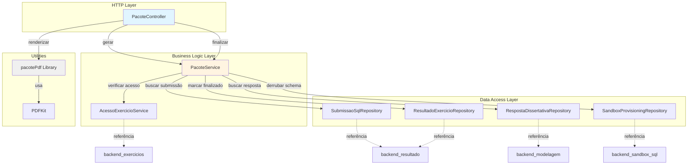
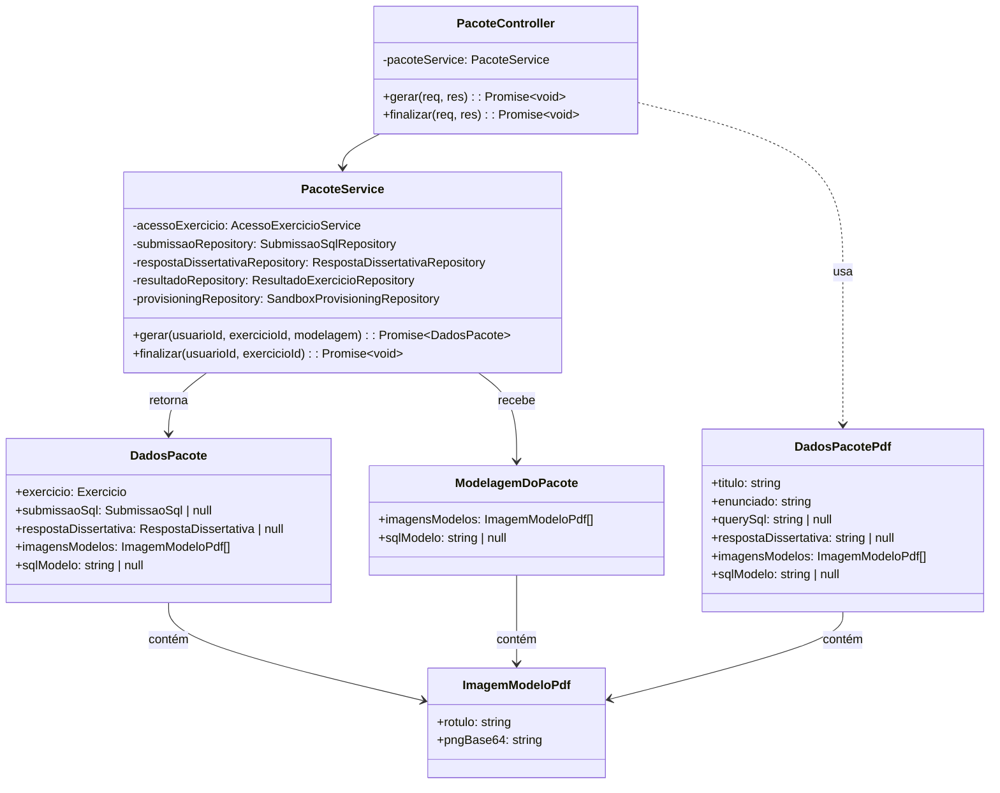
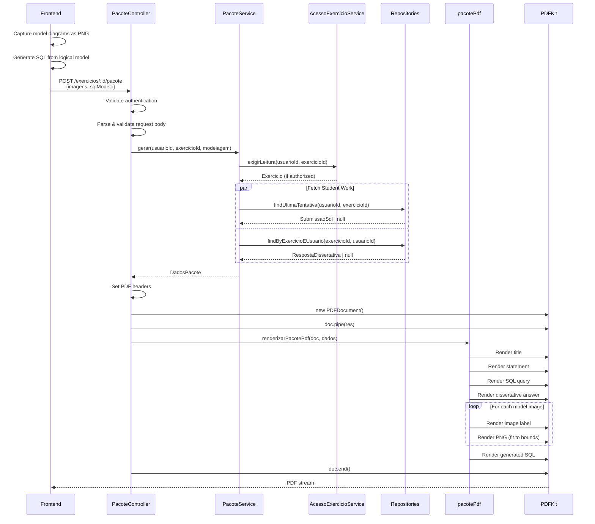
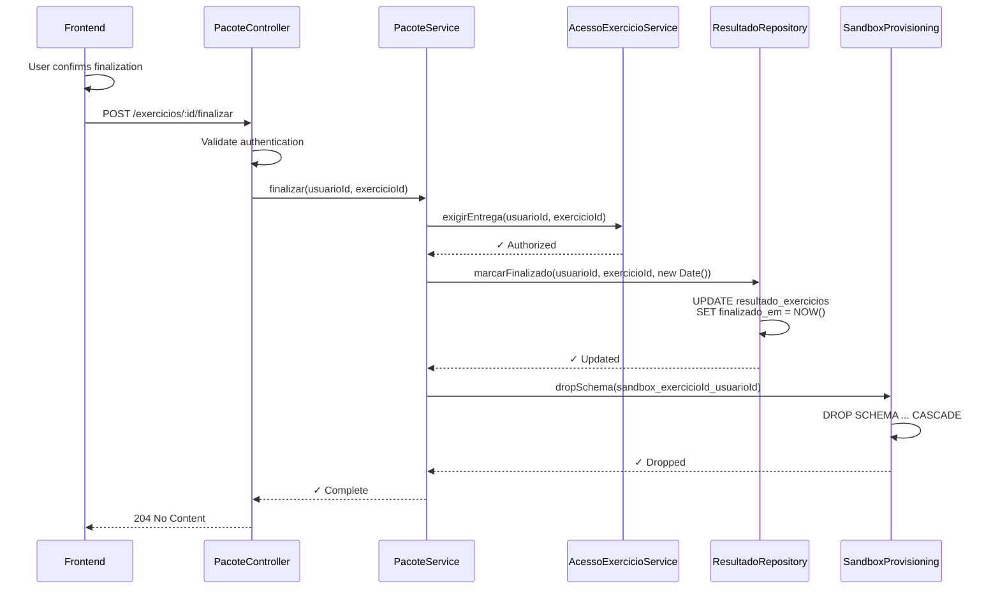
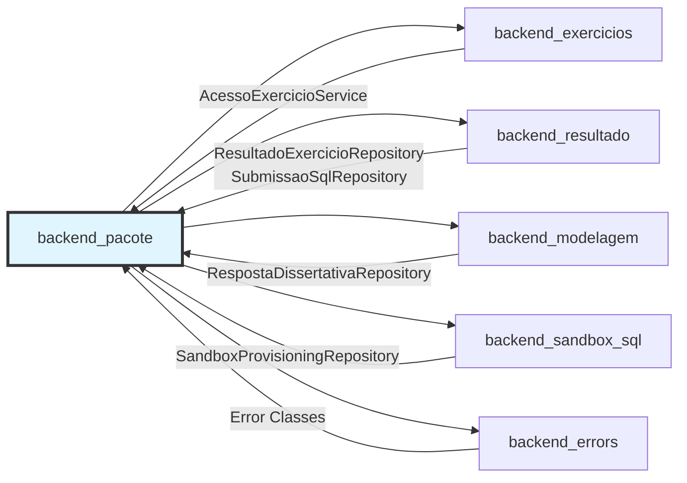
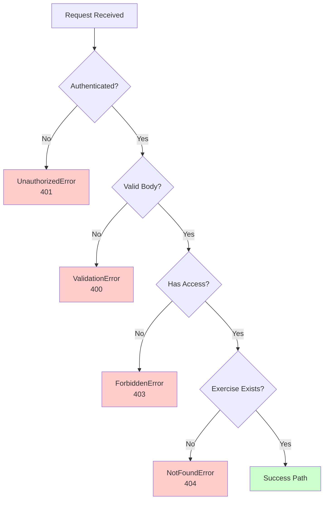

# Backend Pacote Module

## Overview

The `backend_pacote` module is responsible for generating PDF packages of completed exercises and managing the exercise finalization workflow. It allows students to download a comprehensive PDF document containing their exercise submission (SQL query, modeling diagrams, dissertative answers) and provides a separate endpoint to finalize the exercise, marking it as complete and cleaning up sandbox resources.

**Key Responsibilities:**
- Generate PDF packages combining exercise content with student submissions
- Handle model diagram images captured from the frontend
- Manage exercise finalization workflow
- Clean up sandbox database schemas after exercise completion

**Core Design Principle:** Since Phase 8, PDF download is **idempotent and side-effect-free**. Exercise finalization is a **separate, one-time action** that requires explicit confirmation from the student.

## Architecture



### Component Relationships



## API Endpoints

### POST /api/v1/exercicios/:id/pacote

**Purpose:** Generate a PDF package of the student's exercise submission.

**Authentication:** Required (JWT via `requireAuth` middleware)

**Request Body:**
```typescript
{
  imagens?: ImagemModeloPdf[];  // Up to 2: conceptual and logical models
  sqlModelo?: string | null;     // SQL generated from logical model
}
```

**Response:**
- **Content-Type:** `application/pdf`
- **Content-Disposition:** `attachment; filename="exercicio-{exercicioId}.pdf"`
- **Body:** PDF stream

**Access Control:** Validates read access via `AcessoExercicioService.exigirLeitura()`

**Side Effects:** None (idempotent since Phase 8)

---

### POST /api/v1/exercicios/:id/finalizar

**Purpose:** Finalize the exercise, marking completion timestamp and cleaning up sandbox resources.

**Authentication:** Required (JWT via `requireAuth` middleware)

**Request Body:** Empty

**Response:**
- **Status:** 204 No Content

**Access Control:** Validates delivery access via `AcessoExercicioService.exigirEntrega()`

**Side Effects:**
1. Records `ResultadoExercicio.finalizado_em` timestamp
2. Drops the sandbox schema `sandbox_<exercicioId>_<usuarioId>`

**Important:** This is a **one-time action**. The frontend shows a confirmation dialog before calling this endpoint.

## Data Flow

### PDF Generation Flow



### Exercise Finalization Flow



## Component Details

### PacoteController

**Location:** `ide-web-backend/src/controllers/PacoteController.ts`

**Responsibilities:**
- HTTP request/response handling for package operations
- Request validation using Zod schemas
- PDF streaming configuration
- Delegation to PacoteService for business logic

**Key Methods:**

#### `gerar(req: Request, res: Response): Promise<void>`
Generates and streams a PDF package of the student's exercise submission.

**Process:**
1. Validate user authentication
2. Parse request body with `gerarPacoteBodySchema`
3. Call `pacoteService.gerar()` to collect data
4. Configure PDF response headers
5. Create PDFKit document instance
6. Stream PDF to response using `renderizarPacotePdf()`
7. End document stream

**Error Handling:**
- `UnauthorizedError` - No authenticated user
- `ValidationError` - Invalid request body format

---

### PacoteService

**Location:** `ide-web-backend/src/services/PacoteService.ts`

**Dependencies:**
- `AcessoExercicioService` - Access control validation
- `SubmissaoSqlRepository` - SQL submission retrieval
- `RespostaDissertativaRepository` - Dissertative answer retrieval
- `ResultadoExercicioRepository` - Exercise result management
- `SandboxProvisioningRepository` - Sandbox schema lifecycle

**Key Methods:**

#### `gerar(usuarioId: string, exercicioId: string, modelagem: ModelagemDoPacote): Promise<DadosPacote>`

Collects all data needed for PDF generation.

**Process:**
1. Verify read access via `acessoExercicio.exigirLeitura()`
2. Fetch last SQL submission (parallel)
3. Fetch dissertative answer (parallel)
4. Combine with modeling data from request
5. Return complete package data

**Access Rules:**
- Public exercises: any authenticated student
- Class exercises: requires enrollment in the exercise's class
- Closed classes: read-only access

**Returns:** `DadosPacote` containing:
- Exercise metadata (title, statement)
- Latest SQL submission (if any)
- Dissertative answer (if any)
- Model images from frontend
- Generated SQL from logical model

---

#### `finalizar(usuarioId: string, exercicioId: string): Promise<void>`

Marks exercise as finished and cleans up resources.

**Process:**
1. Verify delivery access via `acessoExercicio.exigirEntrega()`
2. Mark current timestamp in `ResultadoExercicio.finalizado_em`
3. Drop sandbox schema `sandbox_<exercicioId>_<usuarioId>`

**Access Rules:**
- Requires enrollment (public exercises with automatic grading only)
- Blocked if class is closed
- Blocked if exam deadline passed (without explicit permission)
- Blocked if exam already submitted (one submission only)

**Side Effects:**
- Permanent timestamp recording
- Sandbox schema deletion (irreversible)
- Student cannot modify submission after finalization

**Important:** PDF can still be downloaded after finalization because it's built from persisted submissions, not the live sandbox schema.

---

### pacotePdf Library

**Location:** `ide-web-backend/src/lib/pacotePdf.ts`

**Purpose:** Pure rendering logic for PDF package generation.

**Key Function:**

#### `renderizarPacotePdf(doc: PDFKit.PDFDocument, dados: DadosPacotePdf): void`

**Design:** Pure function with no side effects. Caller controls document lifecycle (creation, piping, ending).

**Rendering Sections** (in order):
1. **Title** - 18pt, underlined
2. **Statement** - 12pt, exercise description
3. **SQL Query** - 10pt Courier font, submitted query
4. **Dissertative Answer** - 12pt, text response
5. **Model Diagrams** - Up to 2 images (conceptual + logical)
   - Label: 14pt bold
   - Image: Fitted to 480×320px max
   - Format: Base64 PNG from frontend
6. **Generated SQL** - 10pt Courier font, logical model DDL

**Constants:**
```typescript
DIAGRAMA_LARGURA_MAX = 480    // Max diagram width
DIAGRAMA_ALTURA_MAX = 320     // Max diagram height
TAMANHO_FONTE_TITULO = 18     // Title font size
TAMANHO_FONTE_SECAO = 14      // Section heading size
TAMANHO_FONTE_TEXTO = 12      // Body text size
TAMANHO_FONTE_CODIGO = 10     // Code block size
```

**Image Handling:**
- Receives Base64-encoded PNG strings
- Converts to Buffer for PDFKit
- Maintains aspect ratio with `fit` parameter
- Maximum 2 images supported (one per model type)

---

## Data Types

### DadosPacote
Complete package data assembled by PacoteService.

```typescript
interface DadosPacote {
  exercicio: Exercicio;                          // Exercise metadata
  submissaoSql: SubmissaoSql | null;             // Latest SQL submission
  respostaDissertativa: RespostaDissertativa | null;  // Dissertative answer
  imagensModelos: ImagemModeloPdf[];             // Model diagrams (0-2)
  sqlModelo: string | null;                      // Generated DDL
}
```

---

### ModelagemDoPacote
Modeling data sent from frontend during PDF generation.

```typescript
interface ModelagemDoPacote {
  imagensModelos: ImagemModeloPdf[];  // Captured diagram images
  sqlModelo: string | null;            // Generated PostgreSQL DDL
}
```

**Frontend Responsibility:**
- Capture React Flow diagrams as PNG using `captura.ts`
- Generate SQL from logical model using `gerarSql.ts`
- Encode images as Base64 strings

---

### ImagemModeloPdf
Single model diagram image with label.

```typescript
interface ImagemModeloPdf {
  rotulo: string;      // Display label (e.g., "Modelo Conceitual")
  pngBase64: string;   // Base64-encoded PNG image data
}
```

**Usage:**
- Conceptual model: Chen notation diagram
- Logical model: Relational schema diagram
- Maximum 2 images per exercise

---

### DadosPacotePdf
Flattened data structure for PDF rendering.

```typescript
interface DadosPacotePdf {
  titulo: string;                        // Exercise title
  enunciado: string;                     // Exercise statement
  querySql: string | null;               // Submitted SQL query
  respostaDissertativa: string | null;   // Dissertative answer text
  imagensModelos: ImagemModeloPdf[];     // Model diagrams
  sqlModelo: string | null;              // Generated DDL from logical model
}
```

---

## Integration Points

### Dependencies on Other Modules



**Access Control** ([backend_exercicios](backend_exercicios.md)):
- `AcessoExercicioService.exigirLeitura()` - Validates read access for PDF generation
- `AcessoExercicioService.exigirEntrega()` - Validates delivery access for finalization
- Handles public exercises, class enrollment, closed classes, and exam constraints

**Result Management** ([backend_resultado](backend_resultado.md)):
- `ResultadoExercicioRepository.marcarFinalizado()` - Records completion timestamp
- `SubmissaoSqlRepository.findUltimaTentativa()` - Retrieves latest SQL submission

**Modeling Data** ([backend_modelagem](backend_modelagem.md)):
- `RespostaDissertativaRepository.findByExercicioEUsuario()` - Retrieves dissertative answers
- Complemented by diagram images and generated SQL from frontend

**Sandbox Management** ([backend_sandbox_sql](backend_sandbox_sql.md)):
- `SandboxProvisioningRepository.dropSchema()` - Cleans up per-student sandbox schemas
- Schema naming: `sandbox_<exercicioId>_<usuarioId>`

**Error Handling** ([backend_errors](backend_errors.md)):
- `UnauthorizedError` - Missing authentication
- `ValidationError` - Invalid request format
- Access errors propagated from `AcessoExercicioService`

---

### Frontend Integration

**Module:** [frontend_exercicios](frontend_exercicios.md)

**Component:** `FinalizarPacoteButton`

**Workflow:**
1. Student works on exercise parts (SQL, modeling, dissertative)
2. Student clicks **"Baixar PDF"** button:
   - Captures diagram screenshots using React Flow export
   - Generates SQL from logical model
   - Calls `POST /exercicios/:id/pacote` with images and SQL
   - Downloads returned PDF file
   - **Can be repeated multiple times** (no side effects)

3. Student clicks **"Finalizar"** button:
   - Shows confirmation dialog warning about finality
   - Warns if PDF hasn't been downloaded yet
   - Calls `POST /exercicios/:id/finalizar`
   - **One-time action** - cannot be undone

**Service Method:**
```typescript
// frontend: features/exercicio/services/exercicioService.ts
async baixarPacote(exercicioId: string, pedido: PacotePedido): Promise<Blob>
async finalizar(exercicioId: string): Promise<void>
```

**Data Preparation:**
```typescript
// frontend: features/exercicio/modelagem/captura.ts
function capturarImagensModelos(): ImagemModelo[]

// frontend: features/exercicio/modelagem/gerarSql.ts
function gerarSql(modelo: ModeloLogico): string
```

---

## Business Rules

### PDF Generation Rules

1. **Access Control:**
   - Authenticated student required
   - Read access verified via `AcessoExercicioService`
   - Public exercises: any authenticated student
   - Class exercises: must be enrolled

2. **Content Inclusion:**
   - Always includes: title, statement
   - Conditionally includes (if present):
     - Latest SQL submission
     - Dissertative answer
     - Model diagrams (0-2 images)
     - Generated SQL from logical model

3. **Idempotency:**
   - No database modifications
   - No sandbox changes
   - Can be called repeatedly
   - Always returns current state of submissions

4. **Image Handling:**
   - Maximum 2 diagrams (conceptual + logical)
   - Images captured and encoded by frontend
   - Base64 PNG format
   - Fitted to maximum dimensions while preserving aspect ratio

---

### Exercise Finalization Rules

1. **Access Control:**
   - Authenticated student required
   - Delivery access verified via `AcessoExercicioService`
   - Additional checks:
     - Class enrollment required (except public exercises)
     - Blocked if class is closed
     - Blocked if exam deadline passed (without explicit extension)
     - Blocked if exam already submitted (one submission only)

2. **State Changes:**
   - Records `finalizado_em` timestamp in `ResultadoExercicio`
   - Drops sandbox schema permanently
   - Cannot be reversed

3. **Resource Cleanup:**
   - Sandbox schema: `sandbox_<exercicioId>_<usuarioId>`
   - Schema dropped with CASCADE
   - Frees database resources
   - All sandbox tables and data permanently deleted

4. **Post-Finalization:**
   - PDF can still be generated (uses persisted submissions)
   - Student cannot modify submissions
   - Automatic grading scores are preserved
   - Manual review remains possible for teachers

---

## Historical Context

### Phase 8 Changes (September 2026)

**Decision:** [fase8-conta-do-aluno-matricula-estudo-livre.md](../decisions/fase8-conta-do-aluno-matricula-estudo-livre.md)

**Key Changes:**
1. **Separation of Download and Finalization:**
   - Previously: `POST /exercicios/:id/pacote` would reset sandbox
   - Now: PDF download is **side-effect-free and repeatable**
   - Finalization is **separate explicit action** via `/finalizar`

2. **Rationale:**
   - Students need to download PDF multiple times (review, backup)
   - Accidental sandbox reset was frustrating
   - Finalization should be deliberate and confirmed
   - Aligns with exam mode requirements (cannot test after submission)

3. **User Experience:**
   - Two separate buttons in UI
   - "Baixar PDF" - can be clicked anytime, any number of times
   - "Finalizar" - requires confirmation dialog
   - Warning shown if finalizing without downloading first

**Before Phase 8:**
```typescript
// Old behavior (removed)
async baixarPacote() {
  // Generated PDF
  await resetarSandbox();  // ❌ Side effect removed
}
```

**After Phase 8:**
```typescript
// New behavior (current)
async gerar() {
  // Generate PDF only - no side effects ✓
}

async finalizar() {
  await marcarFinalizado();
  await dropSchema();     // Explicit finalization ✓
}
```

---

## Error Handling

### Common Error Scenarios



**Error Types:**

| Error | HTTP Status | Scenario | Portuguese Message |
|-------|-------------|----------|-------------------|
| `UnauthorizedError` | 401 | Missing or invalid JWT | "Autenticação necessária" |
| `ValidationError` | 400 | Invalid request body | "Dados de pacote inválidos" |
| `ForbiddenError` | 403 | No enrollment / closed class | "Acesso não autorizado" |
| `NotFoundError` | 404 | Exercise doesn't exist | "Exercício não encontrado" |
| `ConflictError` | 409 | Already finalized (exam) | "Exercício já finalizado" |

**Access Control Errors:**

From `AcessoExercicioService`:
- No enrollment in class → `ForbiddenError`
- Class closed and delivering → `ForbiddenError`
- Exam deadline passed → `ForbiddenError`
- Exam already submitted → `ForbiddenError`

**Database Errors:**

From repositories:
- Connection failure → `SandboxIndisponivelError` (503)
- Query timeout → Propagated as internal server error (500)

---

## Testing Considerations

### Unit Test Coverage

**PacoteController:**
- [ ] Authentication validation
- [ ] Request body parsing and validation
- [ ] PDF header configuration
- [ ] Error handling and status codes
- [ ] Service delegation

**PacoteService:**
- [ ] Access control integration
- [ ] Data fetching from multiple repositories
- [ ] Parallel query execution
- [ ] Sandbox schema cleanup
- [ ] Finalization timestamp recording

**pacotePdf:**
- [ ] Document structure rendering
- [ ] Font and style application
- [ ] Image inclusion and sizing
- [ ] Base64 decoding
- [ ] Section ordering

### Integration Test Scenarios

1. **PDF Generation:**
   ```
   GIVEN authenticated student enrolled in class
   AND exercise has all parts completed
   WHEN student requests PDF package
   THEN PDF contains all submission parts
   AND sandbox remains unchanged
   ```

2. **Repeated Downloads:**
   ```
   GIVEN student has downloaded PDF once
   WHEN student requests PDF again
   THEN second PDF matches first PDF
   AND no state changes occur
   ```

3. **Exercise Finalization:**
   ```
   GIVEN student has active sandbox schema
   WHEN student finalizes exercise
   THEN finalizado_em timestamp is recorded
   AND sandbox schema is dropped
   AND subsequent PDF generation still works
   ```

4. **Access Control:**
   ```
   GIVEN student not enrolled in class
   WHEN student attempts to download PDF
   THEN request is rejected with 403
   ```

5. **Exam Constraints:**
   ```
   GIVEN exercise is exam mode
   AND student has already submitted once
   WHEN student attempts to finalize again
   THEN request is rejected with 409
   ```

### End-to-End Test Scenarios

Located in: `ide-web-front/tests/e2e/`

**Playwright Test Cases:**
1. Complete exercise workflow (SQL + modeling + dissertative)
2. Download PDF multiple times
3. Verify PDF contents
4. Finalize exercise with confirmation
5. Verify finalization prevents further submission
6. Verify PDF still downloadable after finalization

---

## Performance Considerations

### PDF Generation Performance

**Bottlenecks:**
- Image decoding: Base64 → Buffer conversion
- PDFKit rendering: Synchronous document generation
- Network: Streaming large PDFs

**Optimizations:**
1. **Parallel Data Fetching:**
   ```typescript
   await Promise.all([
     this.submissaoRepository.findUltimaTentativa(...),
     this.respostaDissertativaRepository.findByExercicioEUsuario(...)
   ]);
   ```

2. **Streaming Response:**
   - `doc.pipe(res)` - Streams PDF as it's generated
   - Avoids buffering entire PDF in memory
   - Reduces latency for large documents

3. **Image Size Limits:**
   - Frontend captures diagrams at reasonable resolution
   - Maximum dimensions enforced (480×320px)
   - Maintains balance between quality and size

**Expected Performance:**
- Simple exercise (SQL only): ~100ms
- Full exercise (SQL + 2 diagrams + dissertative): ~300-500ms
- Network transfer time depends on PDF size (typically 100KB-2MB)

---

### Sandbox Cleanup Performance

**Schema Deletion:**
```sql
DROP SCHEMA IF EXISTS sandbox_exercicio_usuario CASCADE;
```

**Impact:**
- Synchronous operation during finalization
- Can be slow for large schemas (many tables/rows)
- Runs in database context, not application

**Considerations:**
- Finalization is one-time action (not frequent)
- User expects some delay when finalizing
- Cleanup prevents database bloat over time

**Future Optimization:**
- Consider async cleanup job (return 204 immediately)
- Track cleanup status for monitoring
- Batch cleanup for closed exercises

---

## Security Considerations

### Authentication & Authorization

1. **JWT Validation:**
   - All endpoints require valid JWT
   - Token verified by `requireAuth` middleware
   - User ID extracted from token payload

2. **Access Control:**
   - Exercise-level permissions via `AcessoExercicioService`
   - Public exercises: authenticated students only
   - Class exercises: enrollment required
   - Prevents cross-student data access

3. **Resource Isolation:**
   - Each student has isolated sandbox schema
   - Schema names include both exerciseId and userId
   - Prevents data leakage between students

### Data Privacy

1. **PDF Contents:**
   - Only includes authenticated user's own submissions
   - No teacher comments or grades included
   - Exercise statement is public (no privacy concern)

2. **Sandbox Cleanup:**
   - Drops schema with CASCADE
   - Ensures complete data removal
   - No orphaned student data remains

### Input Validation

1. **Request Body Validation:**
   - Zod schema: `gerarPacoteBodySchema`
   - Validates image array structure
   - Prevents malformed data injection

2. **Base64 Validation:**
   - PDFKit handles decoding errors gracefully
   - Malformed images fail silently (not included)
   - No server crash from invalid image data

3. **SQL Injection:**
   - Not applicable - no user SQL in PDF generation
   - Sandbox cleanup uses parameterized schema names
   - See [backend_sandbox_sql](backend_sandbox_sql.md) for SQL execution security

---

## Configuration

### Environment Variables

No specific environment variables required for this module.

**Indirect Dependencies:**
- `DATABASE_URL` - Main database connection (Prisma)
- `SANDBOX_DATABASE_URL` - Sandbox database for schema cleanup
- `JWT_SECRET` - Token validation (authentication)

### Dependencies

**NPM Packages:**
```json
{
  "pdfkit": "^0.x.x"  // PDF generation library
}
```

**Related Build Configuration:**

From `ide-web-backend/package.json`:
```json
{
  "scripts": {
    "build": "tsc",
    "start": "node dist/server.js"
  }
}
```

**TypeScript Configuration:**

From `ide-web-backend/tsconfig.json`:
- Target: ES2020
- Module: CommonJS
- Strict mode enabled
- Prisma client included in paths

---

## Future Enhancements

### Potential Improvements

1. **Async Sandbox Cleanup:**
   - Queue finalization for background processing
   - Return 204 immediately, clean up asynchronously
   - Monitor cleanup status

2. **PDF Customization:**
   - Teacher-defined PDF templates
   - Include/exclude specific sections
   - Custom branding per institution

3. **Version History:**
   - Track multiple PDF generations
   - Allow student to download previous versions
   - Audit trail of downloads

4. **Compression:**
   - Optimize image compression before Base64 encoding
   - Reduce PDF file size
   - Faster network transfer

5. **Batch Operations:**
   - Teacher downloads all student PDFs for a class
   - Bulk finalization for closed exercises
   - Automated cleanup of old sandboxes

### Research Module Context

**Note:** This module is part of the core IDE platform and will remain after the TCC research period. The package generation and finalization features are permanent functionality for regular class usage.

See [backend_pesquisa](backend_pesquisa.md) for research-specific components that will be removed after data collection.

---

## Related Documentation

- [backend_exercicios](backend_exercicios.md) - Exercise management and access control
- [backend_resultado](backend_resultado.md) - Exercise results and submission tracking
- [backend_modelagem](backend_modelagem.md) - Modeling diagram persistence
- [backend_sandbox_sql](backend_sandbox_sql.md) - SQL sandbox lifecycle
- [backend_errors](backend_errors.md) - Error handling patterns
- [frontend_exercicios](frontend_exercicios.md) - Frontend exercise components
- [frontend_modelagem](frontend_modelagem.md) - Diagram capture and SQL generation

**Decision Documents:**
- `docs/decisions/fase8-conta-do-aluno-matricula-estudo-livre.md` - Separation of download and finalization
- `docs/decisions/fase7-modelagem-conceitual-logica.md` - Modeling diagram support in PDF
- `docs/decisions/fase2-sandbox-sql-diagrama-mer.md` - Original sandbox design

---

## Summary

The `backend_pacote` module provides a clean separation between **retrieving exercise state** (PDF generation) and **finalizing exercise submission** (cleanup and timestamp). This design emerged from Phase 8 improvements to support repeatable PDF downloads without side effects, while maintaining explicit control over resource cleanup and exercise completion.

**Key Design Principles:**
- **Idempotent Reads:** PDF generation has no side effects
- **Explicit Finalization:** Separate endpoint with confirmation
- **Access Control:** Centralized via AcessoExercicioService
- **Pure Rendering:** PDF library has no business logic
- **Resource Cleanup:** Sandbox schemas dropped on finalization

**Integration:** This module coordinates data from exercises, submissions, modeling diagrams, and sandbox resources to create comprehensive PDF packages while managing the exercise lifecycle.
