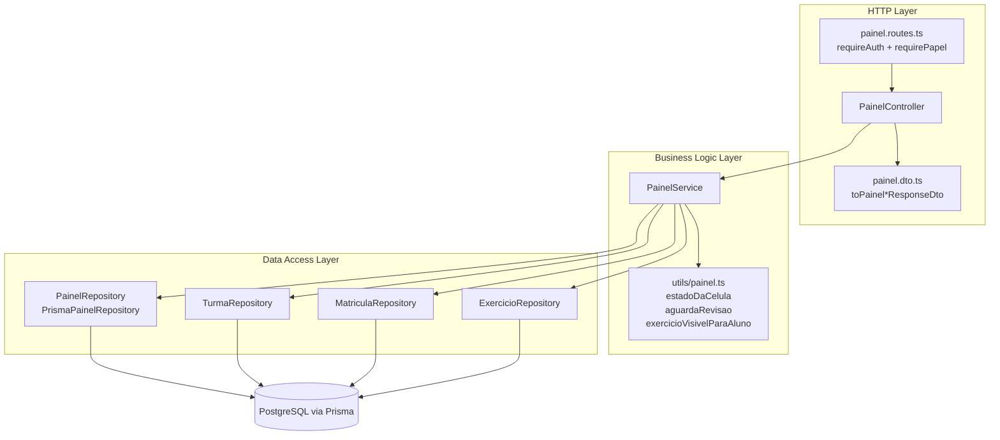
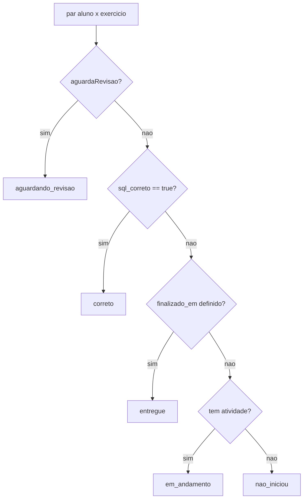
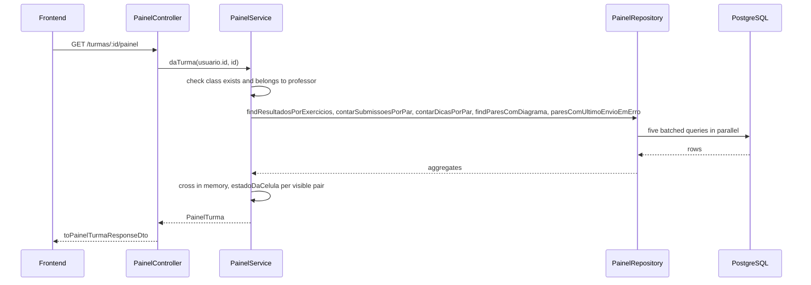

# Backend Painel Module

## Overview

The `backend_painel` module builds the **dashboards** of the IDE Web system: one for the professor (all of their classes at a glance, plus a student × exercise matrix per class) and one for the student (their own progress across every class they are enrolled in). It does not own any table. It only **reads and aggregates** data that other modules write: `Turma`, `MatriculaTurma`, `Exercicio`, `ResultadoExercicio`, `SubmissaoSql`, `DicaIa` and `DiagramaMer`.

**Key responsibilities:**
- Summarise every class of a professor (students, exercises, deliveries, pending reviews, last activity)
- Build the per-class matrix of `aluno × exercício` cells, each with a derived state
- Rank exercises by difficulty (accuracy rate, average attempts, hints per student)
- Give the professor every activity of one student in one class (the by-student review screen)
- Give the student a personal dashboard that never compares them with classmates

**Related documentation:**
- [Backend Turmas](backend_turmas.md) - classes, enrollment and `MatriculaTurma`
- [Backend Exercicios](backend_exercicios.md) - exercises the matrix is built from
- [Backend Resultado](backend_resultado.md) - `ResultadoExercicio`, the source of "delivered" and "correct"
- [Backend Provas](backend_provas.md) - exam variants that decide which exercises a student sees
- [Backend Sandbox SQL](backend_sandbox_sql.md) - writes `SubmissaoSql`, counted here as attempts
- [Backend Dica IA](backend_dica_ia.md) - writes `DicaIa`, counted here as hints
- [Frontend Painel](frontend_painel.md) - the screens that consume these endpoints

---

## Architecture



The module follows the MSC layering used across the backend: `routes → controllers → services → repositories`. Dependencies are wired by hand in `painel.routes.ts`, which builds the four Prisma repositories, injects them into `PainelService`, and hands the service to `PainelController`.

---

## Endpoints

All routes sit under `/api/v1` and require an authenticated session (`requireAuth`) plus a role check (`requirePapel`).

| Method and path | Roles | Controller method | Service method | Purpose |
|---|---|---|---|---|
| `GET /painel/professor` | professor, pesquisador | `doProfessor` | `doProfessor` | Summary cards and one card per class |
| `GET /painel/aluno` | aluno | `doAluno` | `doAluno` | Personal dashboard of the logged-in student |
| `GET /turmas/:id/painel` | professor, pesquisador | `daTurma` | `daTurma` | Student × exercise matrix of one class |
| `GET /turmas/:turmaId/alunos/:usuarioId/atividades` | professor, pesquisador | `atividadesDoAluno` | `atividadesDoAluno` | Every activity of one student in one class |

`PainelController` extends `BaseController`. Each handler checks `req.usuario` (throwing `UnauthorizedError` if absent), calls the service, maps the result through a `toPainel*ResponseDto` function and answers with `handleSuccess`. The controller holds no business rules.

---

## Cell state: the core rule

Everything on both dashboards is coloured by one derived value, the `EstadoCelula`, computed in [`utils/painel.ts`](../ide-web-backend/src/utils/painel.ts) and shared by the two dashboards.



| Function | Rule |
|---|---|
| `estadoDaCelula(exercicio, resultado, temAtividade)` | The order of the questions **is** the precedence. `aguardando_revisao` beats `correto` because an exercise can have the SQL right and the modelling still unmarked: what matters is that somebody still has to act. |
| `aguardaRevisao(exercicio, resultado)` | True when the student finalised, the professor has not reviewed (`revisado = false`) and the exercise has a manual part. |
| `temCorrecaoManual(exercicio)` | True when the exercise is **not** public and has an ER gabarito or an essay gabarito. Public exercises are excluded: their correction is automatic by definition, and including them would flood the professor's queue with work nobody should do. |
| `exercicioVisivelParaAluno(exercicioProvaId, matriculaProvaId)` | An exercise tied to an exam (`prova_id`) only exists for the student drawn with that exam. Without this rule half the matrix would show a false "not started". |

`temAtividade` is true when the student has at least one SQL submission **or** a saved ER diagram, so modelling counts as "started" even with no query sent.

---

## Component reference

### PainelService

`PainelService` receives four repositories through its constructor: `PainelRepository`, `TurmaRepository`, `ExercicioRepository` and `MatriculaRepository`.

```typescript
class PainelService {
  doProfessor(professorId: string): Promise<PainelProfessor>;
  daTurma(professorId: string, turmaId: string): Promise<PainelTurma>;
  atividadesDoAluno(professorId: string, turmaId: string, usuarioId: string): Promise<AtividadesDoAluno>;
  doAluno(usuarioId: string): Promise<PainelAluno>;
}
```

**`doProfessor`** loads the professor's classes, then all their exercises, and runs the aggregate queries in a single `Promise.all`. It then folds the results in memory:
- `entregas` counts results with `finalizado_em` set
- `aguardandoRevisao` counts results for which `aguardaRevisao` is true
- `ultimaAtividadeEm` is the newest `SubmissaoSql.criado_em` among the class's exercises
- `resumo.alunos` is the number of **distinct people**, not the sum of per-class counts, because a student may be enrolled in two classes of the same professor

**`daTurma`** verifies the class exists (`NotFoundError('Turma')`) and belongs to the caller (`ForbiddenError`). It builds one `CelulaMatriz` per visible `aluno × exercício` pair with `estado`, `tentativas`, `dicas`, `finalizadoEm`, `pontuacao` and `ultimoEnvioComErro`, then a `DificuldadeExercicio` per exercise.

**`atividadesDoAluno`** applies the same ownership check and additionally requires that the student is enrolled in that class (`NotFoundError('Aluno nesta turma')`). It returns each visible exercise with the full grading fields (`sqlCorreto`, `merAvaliacao`, `dissertativaAvaliacao`, `pontuacao`, `revisado`, `envioLiberadoEm`). This feeds the by-student review screen.

**`doAluno`** collects the student's enrollments, the classes and their visible exercises, and returns:
- `resumo`: classes, pending, delivered and correct counts
- `disciplinas`: classes grouped by subject and sorted alphabetically
- `pendencias`: exercises that are `nao_iniciou` or `em_andamento`, across all classes
- `historico`: finalised exercises, newest first
- `progresso`: deliveries per class and the attempt on which each exercise was first solved

> **Design choice: no social comparison.** The student dashboard contains only the student's own data: no class average, no ranking, no classmate names. Social comparison is described in the learning-analytics literature as a main source of demotivation.

**Difficulty metrics** (`dificuldadeDe`, private) are computed only among students who actually tried the exercise. Dividing by every student in the class would make a freshly published exercise look extremely hard.

| Field | Meaning |
|---|---|
| `taxaAcerto` | correct ÷ evaluated among students with attempts; `null` when nobody was evaluated |
| `mediaTentativas` | average attempts among students with at least one attempt; `null` when none |
| `dicasPorAluno` | hints divided by all visible cells of the exercise |

### PainelRepository

`PainelRepository` is the data-access interface and `PrismaPainelRepository` its implementation. Every method takes a **list of ids** and answers with one query (`groupBy` or `findMany`). Nothing is queried per cell: the matrix of a full class would otherwise cost hundreds of round trips. Each method returns early with an empty result when given an empty list.

| Method | Query | Used for |
|---|---|---|
| `contarAlunosPorTurma` | `matriculaTurma.groupBy(turma_id)` | students per class card |
| `contarAlunosDistintos` | `matriculaTurma.findMany(distinct aluno_id)` | distinct people in the summary |
| `contarExerciciosPorTurma` | `exercicio.groupBy(turma_id)` | exercises per class card |
| `findResultadosPorExercicios` / `findResultadosDoAluno` | `resultadoExercicio.findMany` | delivery and review state |
| `contarSubmissoesPorPar` | `submissaoSql.groupBy(usuario_id, exercicio_id)` | attempts |
| `contarDicasPorPar` | `dicaIa.groupBy(usuario_id, exercicio_id)` | hints |
| `findParesComDiagrama` | `diagramaMer.findMany` | modelling counts as "started" |
| `ultimaAtividadePorExercicio` | `submissaoSql.groupBy(exercicio_id)` with `_max(criado_em)` | last activity |
| `tentativasAteAcertar` | `submissaoSql.groupBy` with `_min(tentativa_numero)` where `correta` | first correct attempt |
| `exerciciosComUltimoEnvioEmErro` / `paresComUltimoEnvioEmErro` | `submissaoSql.findMany` ordered by attempt descending | the last submission did not execute |

The "last submission ended in error" queries matter for exams. In an exam question a syntax-error submission burns the single allowed submission, so the matrix and the review screen flag it and the professor decides whether to release another attempt (see [Backend Resultado](backend_resultado.md)).

---

## Data flow example: professor opens a class matrix



The pattern is the same for every endpoint: a handful of batched queries, then a join **in memory** with `Map` and `Set` keyed by `usuarioId:exercicioId`.

---

## Dependencies

| Depends on | For |
|---|---|
| `TurmaRepository` | classes of a professor, class by id, ownership check |
| `MatriculaRepository` | enrollments, students of a class, the drawn `prova_id` |
| `ExercicioRepository` | exercises of a class |
| `errors` (`NotFoundError`, `ForbiddenError`, `UnauthorizedError`) | domain errors, in Portuguese because they reach the user |
| `lib/prisma` | shared Prisma client singleton |

## Notes for maintainers

- Adding a new cell state means editing `ESTADOS_CELULA` and `estadoDaCelula` in one place; both dashboards and the frontend legend need the new label.
- Keep repository methods list-based. A per-student or per-cell query reintroduces the N+1 problem this module was designed to avoid.
- Grades on `ResultadoExercicio` run from **0.0 to 10.0**; `pontuacao` and the two `*_avaliacao` fields are converted with `toNumber()` because Prisma returns `Decimal`.
