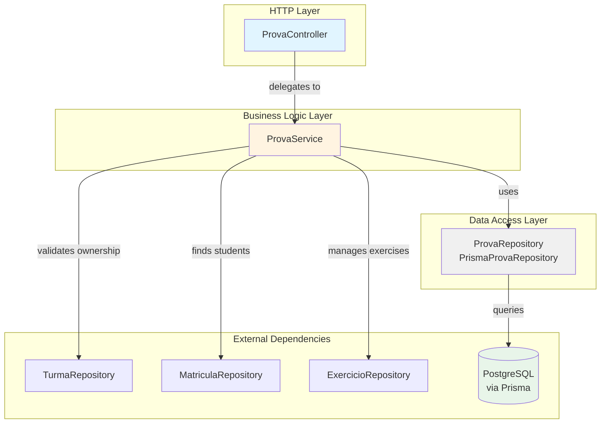
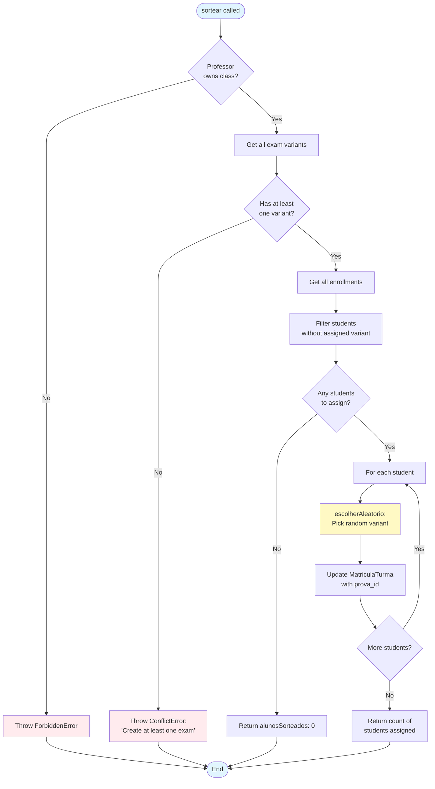
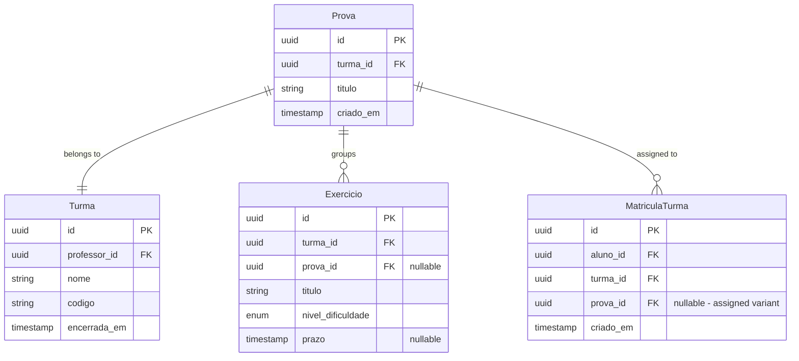
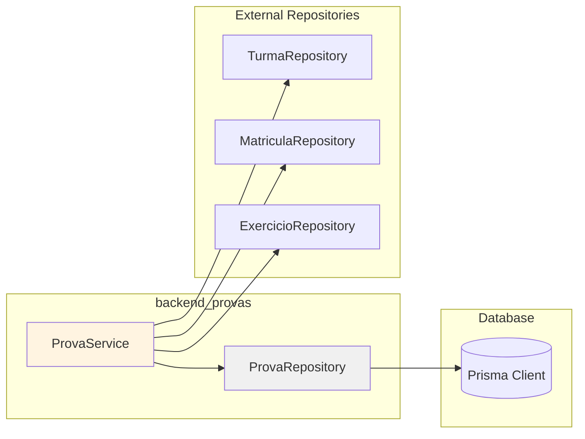
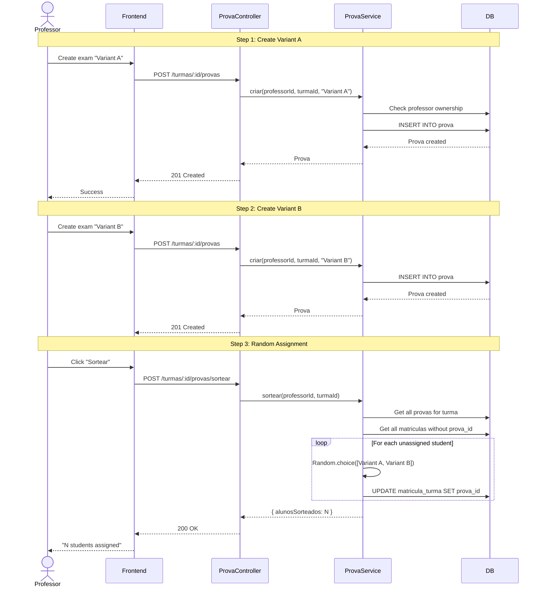
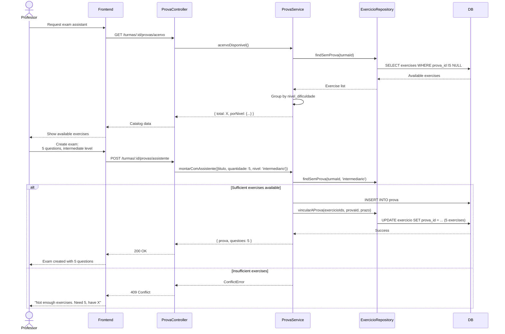

# Backend Provas Module

## Overview

The `backend_provas` module manages exam/test creation, distribution, and random variant assignment in the IDE Web system. It enables professors to create multiple exam variants (Prova) for a class and randomly assign them to students, supporting academic assessment scenarios where different students receive different question sets.

**Key Responsibilities:**
- Create and manage exam variants (Prova) within a class
- Random assignment of exam variants to enrolled students
- Exam assistant for automatic exercise selection
- Exam catalog management

**Related Documentation:**
- [Backend Turmas](backend_turmas.md) - Class management and enrollment
- [Backend Exercicios](backend_exercicios.md) - Exercise management
- [Backend Auth](backend_auth.md) - Authentication and authorization

---

## Architecture

### Module Structure

The module follows the MSC (Model-Service-Controller) architecture pattern:



### Component Responsibilities

| Component | Type | Responsibility |
|-----------|------|----------------|
| **ProvaController** | Controller | HTTP request handling, input validation (Zod), response formatting |
| **ProvaService** | Service | Business logic, authorization checks, random assignment algorithm |
| **PrismaProvaRepository** | Repository | Database operations via Prisma ORM |

---

## Core Components

### ProvaController

**Location:** `ide-web-backend/src/controllers/ProvaController.ts`

HTTP controller extending `BaseController` that handles exam-related endpoints.

#### Endpoints

| Method | Route | Description | Auth Required |
|--------|-------|-------------|---------------|
| POST | `/api/v1/turmas/:turmaId/provas` | Create new exam variant | Professor (owner) |
| GET | `/api/v1/turmas/:turmaId/provas` | List all exams for a class | Professor (owner) |
| POST | `/api/v1/turmas/:turmaId/provas/sortear` | Randomly assign variants to students | Professor (owner) |
| GET | `/api/v1/turmas/:turmaId/provas/acervo` | Get available exercise catalog | Professor (owner) |
| POST | `/api/v1/turmas/:turmaId/provas/assistente` | Create exam with exercise assistant | Professor (owner) |

#### Key Methods

```typescript
// Create a new exam variant
criar(req: Request, res: Response): Promise<void>

// List all exam variants for a class
listarPorTurma(req: Request, res: Response): Promise<void>

// Randomly assign exam variants to students
sortear(req: Request, res: Response): Promise<void>

// Get catalog of exercises not yet assigned to any exam
acervo(req: Request, res: Response): Promise<void>

// Create exam using exercise selection assistant
montarComAssistente(req: Request, res: Response): Promise<void>
```

**Validation:** Uses Zod schemas (`criarProvaBodySchema`, `assistenteProvaBodySchema`) for request body validation.

---

### ProvaService

**Location:** `ide-web-backend/src/services/ProvaService.ts`

Contains core business logic for exam management, including the random assignment algorithm.

#### Key Operations

##### 1. Create Exam (`criar`)

```typescript
async criar(professorId: string, turmaId: string, titulo: string): Promise<Prova>
```

- Validates professor owns the class
- Creates new exam variant
- Returns created exam

##### 2. Random Assignment (`sortear`)

```typescript
async sortear(professorId: string, turmaId: string): Promise<SortearResultado>
```

**Algorithm:**
1. Validates professor ownership
2. Retrieves all exam variants for the class
3. Finds students without assigned variant (via `MatriculaTurma`)
4. Randomly assigns one variant to each unassigned student
5. **Idempotent:** Re-running only assigns to new students, never reassigns

**Flow Diagram:**



**Key Design Decision:** The variant is stored in `MatriculaTurma.prova_id`, not `Usuario.prova_id`, because a student can be enrolled in multiple classes simultaneously and may need different variants in each (Fase 8). See [Backend Turmas](backend_turmas.md#2-student-enrollment-matricular) for details.

##### 3. Exercise Catalog (`acervoDisponivel`)

```typescript
async acervoDisponivel(professorId: string, turmaId: string): Promise<{
  total: number;
  porNivel: Record<NivelDificuldade, number>;
}>
```

Returns count of exercises in the class that haven't been assigned to any exam variant, grouped by difficulty level (iniciante/intermediario).

##### 4. Exam Assistant (`montarComAssistente`)

```typescript
async montarComAssistente(
  professorId: string,
  turmaId: string,
  input: { 
    titulo: string; 
    quantidade: number; 
    nivel?: NivelDificuldade; 
    prazo?: Date;
  }
): Promise<{ prova: Prova; questoes: number }>
```

Automatically creates an exam by selecting exercises from the available catalog:
- Validates sufficient exercises exist (fails with clear error rather than partial exam)
- Optionally filters by difficulty level
- Links selected exercises to the new exam variant
- Optionally sets deadline for all selected exercises

---

### ProvaRepository

**Location:** `ide-web-backend/src/repositories/ProvaRepository.ts`

Data access layer using Prisma ORM.

#### Interface

```typescript
interface ProvaRepository {
  findById(id: string): Promise<Prova | null>
  findByTurmaId(turmaId: string): Promise<Prova[]>
  create(input: CreateProvaInput): Promise<Prova>
}
```

#### Implementation Details

- **`PrismaProvaRepository`**: Concrete implementation using `prisma.prova` model
- **Ordering:** `findByTurmaId` returns exams ordered by `criado_em` ascending
- **No Update/Delete:** Repository only supports create and read operations (exams are immutable once created)

---

## Data Model

### Database Schema



### Key Relationships

1. **Prova → Turma**: Each exam belongs to exactly one class
2. **Prova → Exercicio**: One exam can group multiple exercises (questions)
3. **Prova → MatriculaTurma**: Assigned variant stored per enrollment, not per student
4. **Exercise Assignment**: `Exercicio.prova_id` nullable - `null` means visible to entire class, non-null means visible only to students assigned that variant

---

## Integration & Dependencies

### Dependency Graph



**Dependencies:**

| Repository | Purpose |
|------------|---------|
| **TurmaRepository** | Validate professor ownership of class |
| **MatriculaRepository** | Find enrolled students, assign exam variants |
| **ExercicioRepository** | Find available exercises, link exercises to exam |

See:
- [Backend Turmas](backend_turmas.md) for enrollment details
- [Backend Exercicios](backend_exercicios.md) for exercise visibility rules

---

## Key Workflows

### 1. Creating and Assigning Exam Variants



### 2. Exam Assistant Workflow



---

## Error Handling

The module uses custom error classes from [Backend Errors](backend_errors.md):

| Error Class | HTTP Status | Usage |
|-------------|-------------|-------|
| **UnauthorizedError** | 401 | Missing authentication |
| **ForbiddenError** | 403 | Professor doesn't own the class |
| **NotFoundError** | 404 | Class not found |
| **ConflictError** | 409 | No exam variants exist for assignment<br/>Insufficient exercises for exam assistant |
| **ValidationError** | 400 | Invalid request body (Zod validation) |

---

## Business Rules

### Exam Variant Assignment

1. **Idempotency**: Running `sortear` multiple times only assigns to students who joined after the last run
2. **Storage Location**: Variant assignment stored in `MatriculaTurma.prova_id`, not `Usuario.prova_id`
3. **Multi-class Support**: Same student can have different variants in different classes
4. **Random Selection**: Uses `Math.random()` for variant selection (cryptographically secure randomness not required for this use case)

### Exercise Visibility (Integration with backend_exercicios)

- **Exercicio.prova_id = null**: Exercise visible to all students in the class
- **Exercicio.prova_id = UUID**: Exercise visible only to students assigned that specific variant
- **One Exam Per Exercise**: Each exercise can belong to at most one exam variant (enforced by `findSemProva`)

See [Backend Exercicios - Access Control](backend_exercicios.md#acessoexercicioservice) for full visibility rules.

### Exam Assistant

1. **All-or-Nothing**: Refuses to create exam if insufficient exercises exist (no partial exams)
2. **Exercise Consumption**: Once assigned to an exam, exercise leaves the available catalog
3. **Deadline Propagation**: Optional deadline applies to all selected exercises uniformly

---

## Testing Considerations

### Unit Testing

Key areas to test:

1. **Random Assignment Algorithm**
   - Idempotency: Re-running doesn't reassign
   - New students get assigned
   - All students get a variant (none left null)
   - Distribution is roughly uniform with sufficient runs

2. **Exercise Selection**
   - Respects difficulty level filter
   - Doesn't select already-assigned exercises
   - Selects exactly requested quantity
   - Fails cleanly when insufficient exercises

3. **Authorization**
   - Only class owner can manage exams
   - Cross-class access denied

### Integration Testing

1. **Multi-step workflows**
   - Create class → Create exams → Assign variants → Student sees correct variant
   - Exercise visibility after exam assignment
   - Deadline propagation to exercises

2. **Edge cases**
   - Single student, single variant (deterministic assignment)
   - More variants than students
   - Re-running assignment after new enrollments

---

## Related Decisions

- **Fase 5**: Initial exam sorter implementation - [docs/decisions/fase5-sorteador-provas.md](../docs/decisions/fase5-sorteador-provas.md)
- **Fase 8**: Moved variant assignment from Usuario to MatriculaTurma - [docs/decisions/fase8-conta-do-aluno-matricula-estudo-livre.md](../docs/decisions/fase8-conta-do-aluno-matricula-estudo-livre.md)
- **Fase 10**: Added exam assistant and deadline support - [docs/decisions/fase10-professor-prova-sessao.md](../docs/decisions/fase10-professor-prova-sessao.md)

---

## Future Enhancements

Potential improvements not yet implemented:

1. **Manual Variant Assignment**: Allow professor to override random assignment for specific students
2. **Variant Statistics**: Track difficulty and performance metrics per variant
3. **Exercise Distribution**: Ensure variants have similar difficulty balance
4. **Soft Delete**: Archive exams instead of permanent deletion
5. **Variant Swapping**: Allow reassignment in case of errors (currently immutable)

---

## API Reference

### DTOs

**Request Body - Create Exam** (`criarProvaBodySchema`)
```typescript
{
  titulo: string  // required
}
```

**Request Body - Exam Assistant** (`assistenteProvaBodySchema`)
```typescript
{
  titulo: string                           // required
  quantidade: number                       // required, > 0
  nivel?: 'iniciante' | 'intermediario'   // optional filter
  prazo?: Date                            // optional deadline
}
```

**Response - Exam** (`toProvaResponseDto`)
```typescript
{
  id: string
  turma_id: string
  titulo: string
  criado_em: Date
}
```

**Response - Random Assignment**
```typescript
{
  alunosSorteados: number  // count of students assigned
}
```

**Response - Exercise Catalog**
```typescript
{
  total: number
  porNivel: {
    iniciante: number
    intermediario: number
  }
}
```

**Response - Exam Assistant**
```typescript
{
  ...Prova,
  questoes: number  // count of exercises linked
}
```

---

## Glossary

| Term | Definition |
|------|------------|
| **Prova** | Exam variant - a collection of exercises that can be assigned to students |
| **Sortear** | Random assignment process that distributes exam variants to students |
| **Acervo** | Catalog of exercises not yet assigned to any exam variant |
| **Assistente** | Exam assistant feature that automatically selects exercises for a new exam |
| **Questão** | Question/exercise that belongs to an exam variant |
| **Variante** | Exam variant - different versions of an exam with different questions |
