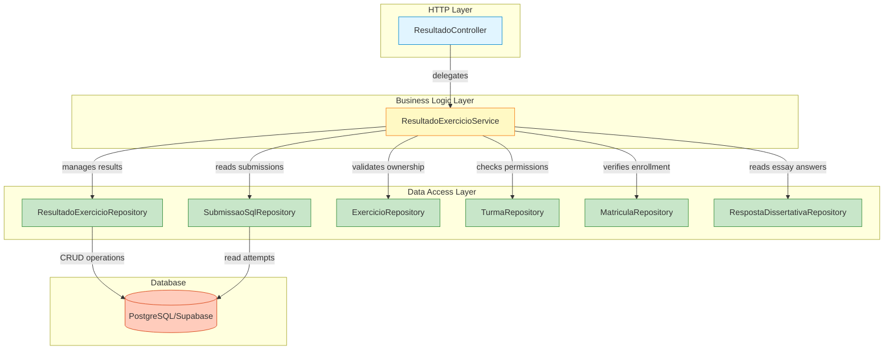
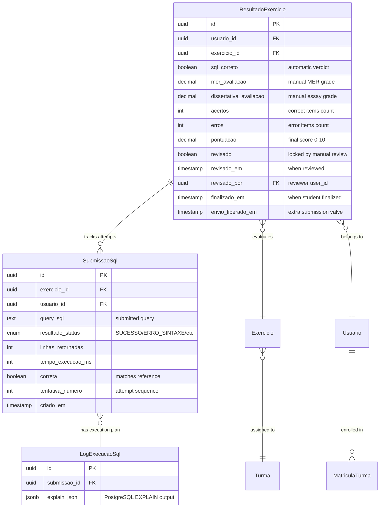
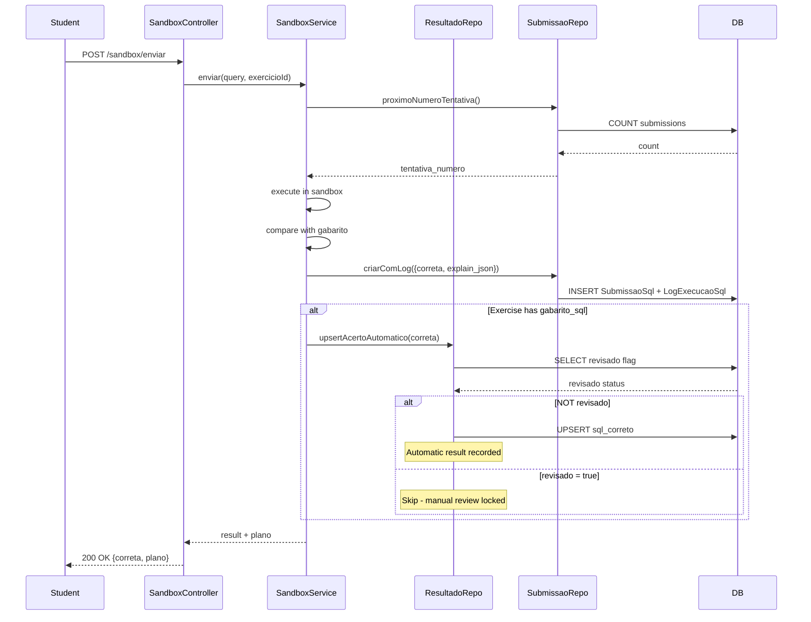
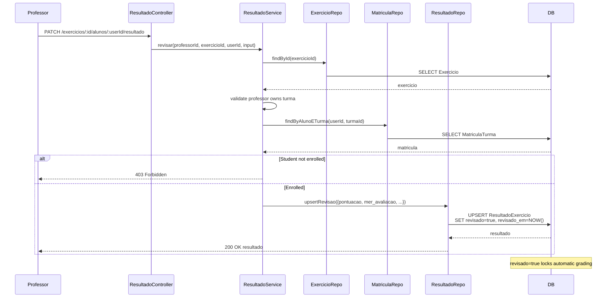
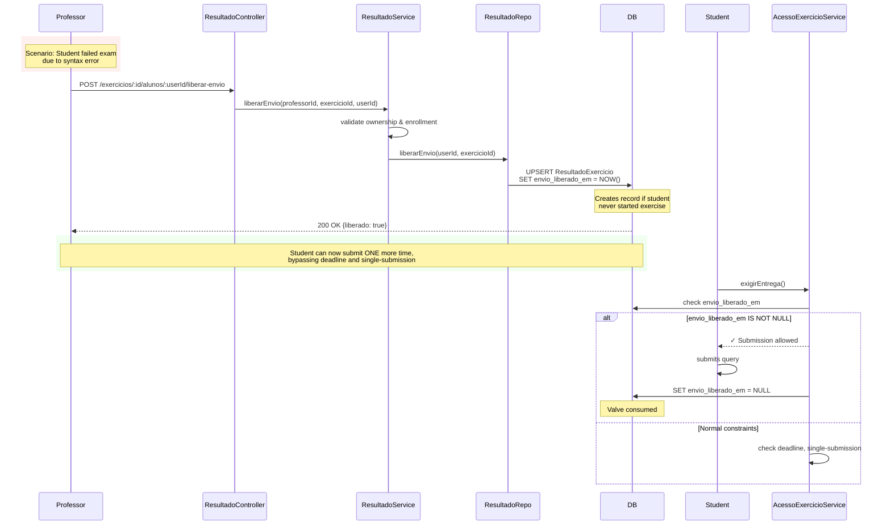
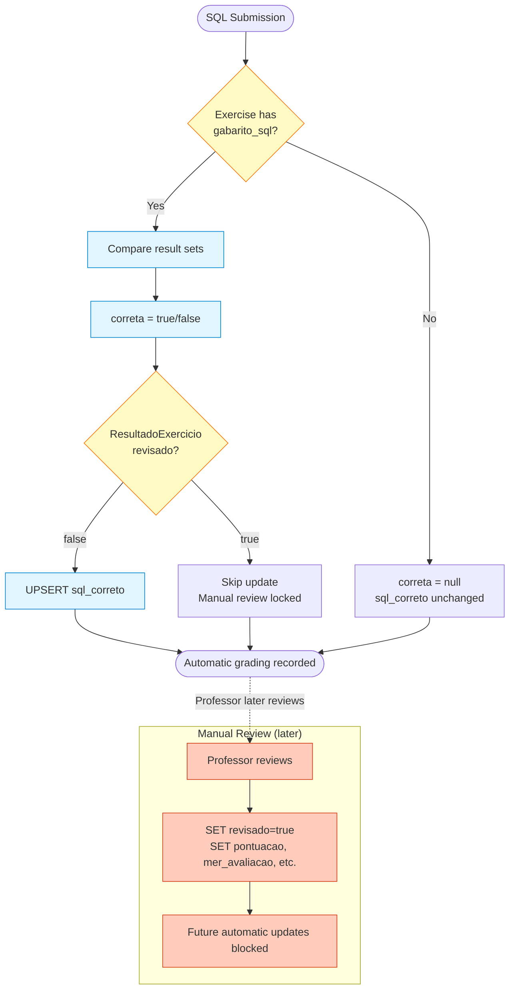
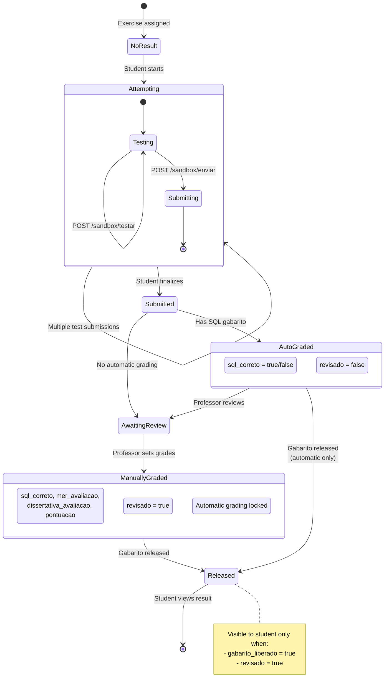
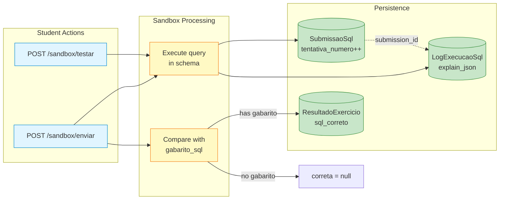

# Backend Resultado Module

## Overview

The **backend_resultado** module manages exercise results, grading, and feedback in the IDE Web system. It handles both **automatic grading** (SQL queries compared against reference solutions) and **manual review** (conceptual/logical data modeling and essay questions). The module implements a sophisticated grading workflow that supports exam mode constraints, grade liberation mechanisms, and hybrid automatic-manual evaluation.

This module serves as the bridge between student submissions ([backend_sandbox_sql](backend_sandbox_sql.md), [backend_modelagem](backend_modelagem.md)) and performance visualization ([backend_painel](backend_painel.md)), ensuring that all exercise attempts are properly evaluated, stored, and made available to both students and professors according to visibility rules.

---

## Core Responsibilities

### 1. **Result Management**
- Store and retrieve exercise results (`ResultadoExercicio`)
- Track submission attempts and their outcomes
- Maintain grading history with timestamps and reviewer information
- Support result visibility based on `gabarito_liberado` flag

### 2. **Automatic Grading**
- Receive SQL correctness verdicts from sandbox execution
- Record automatic grading in `sql_correto` field
- Preserve automatic results unless overridden by manual review
- Update results without triggering unnecessary re-evaluations

### 3. **Manual Review**
- Enable professors to grade data modeling diagrams (`mer_avaliacao`)
- Support essay question evaluation (`dissertativa_avaliacao`)
- Allow comprehensive scoring with `acertos`, `erros`, `pontuacao` (0.0-10.0)
- Lock automatic results when manual review is performed (`revisado` flag)

### 4. **Exam Mode Support**
- Enforce single-submission constraint for exam questions
- Track exercise finalization (`finalizado_em`)
- Provide grade liberation mechanism (`envio_liberado_em`)
- Allow professors to grant extra submission attempts after errors

### 5. **Answer Template Management**
- Professors can release answer keys (`gabarito_liberado`)
- Students view their graded results only when answers are released
- Answer key release is reversible (can be hidden again)

---

## Architecture

### Component Structure



### Layer Responsibilities

**ResultadoController** (HTTP Layer)
- Exposes REST endpoints for result operations
- Validates request parameters and authentication
- Transforms service responses to DTOs
- Handles HTTP status codes and error responses

**ResultadoExercicioService** (Business Logic Layer)
- Enforces authorization rules (professor owns exercise, student is enrolled)
- Coordinates between multiple repositories
- Implements grading business logic (automatic vs. manual precedence)
- Manages grade liberation workflow

**ResultadoExercicioRepository** (Data Access Layer)
- Performs CRUD operations on `ResultadoExercicio` table
- Implements upsert logic for automatic and manual grading
- Handles envio_liberado_em valve mechanism
- Enforces `revisado` flag protection

**SubmissaoSqlRepository** (Data Access Layer)
- Tracks all SQL submission attempts
- Maintains attempt numbering (`tentativa_numero`)
- Stores execution metadata (EXPLAIN plans, execution time)
- Provides summary views for reporting

---

## Data Model



### Key Fields

**sql_correto** - Automatic SQL grading result set by sandbox comparison. Frozen when `revisado = true`.

**revisado** - Flag indicating manual review has occurred. Once set, automatic grading no longer updates `sql_correto`.

**envio_liberado_em** - Valve timestamp allowing ONE extra submission, bypassing deadline and single-submission constraints. Consumed on use.

**finalizado_em** - Timestamp when student clicked "Finalize" (separate from "Download PDF" since Fase 8). Triggers sandbox cleanup.

**tentativa_numero** - Sequential attempt counter per student-exercise pair, starting at 1.

---

## Component Interactions

### Grading Workflow



### Manual Review Workflow



### Grade Liberation Mechanism



---

## API Endpoints

### Professor Operations

#### Review Student Work
```http
PATCH /api/v1/exercicios/:exercicioId/alunos/:usuarioId/resultado
Authorization: Bearer <token>
Content-Type: application/json

{
  "sqlCorreto": true,           // optional, override automatic
  "merAvaliacao": 8.5,          // optional, 0.0-10.0
  "dissertativaAvaliacao": 7.0, // optional, 0.0-10.0
  "acertos": 12,                // optional, item count
  "erros": 3,                   // optional, item count
  "pontuacao": 8.0              // optional, final grade 0.0-10.0
}
```

**Response:** `ResultadoResponseDto`
- Sets `revisado = true`, locking automatic grading
- Records `revisado_em` timestamp and `revisado_por` (professor ID)
- Creates `ResultadoExercicio` if student never submitted

**Authorization:** Professor must own the turma; student must be enrolled.

---

#### Release Answer Key
```http
POST /api/v1/exercicios/:id/liberar-gabarito
Authorization: Bearer <token>
```

**Response:** `ExercicioProfessorResponseDto` with `gabarito_liberado = true`

Reversible with:
```http
POST /api/v1/exercicios/:id/ocultar-gabarito
```

---

#### Grant Extra Submission
```http
POST /api/v1/exercicios/:id/alunos/:usuarioId/liberar-envio
Authorization: Bearer <token>
```

**Response:** `{liberado: true}`

**Effect:** Sets `envio_liberado_em`, allowing ONE more submission regardless of:
- Deadline (exercicio.prazo)
- Single-submission constraint (prova_id)
- Turma closure status

See [backend_exercicios](backend_exercicios.md) `AcessoExercicioService.exigirEntrega()` for consumption logic.

---

#### Get Student's Answers
```http
GET /api/v1/exercicios/:exercicioId/alunos/:usuarioId/respostas
Authorization: Bearer <token>
```

**Response:**
```json
{
  "ultimaSubmissaoSql": {
    "query": "SELECT * FROM ...",
    "correta": true,
    "criadoEm": "2026-09-15T10:30:00Z"
  },
  "dissertativa": {
    "texto": "A normalização consiste em...",
    "atualizadoEm": "2026-09-15T10:25:00Z"
  }
}
```

**Purpose:** Shows what the student submitted before professor grades it (added in Fase 9 after usability testing revealed "grading in the dark").

**Note:** Data modeling answers are retrieved via separate endpoint in [backend_modelagem](backend_modelagem.md).

---

#### Get Student's Result
```http
GET /api/v1/exercicios/:exercicioId/alunos/:usuarioId/resultado
Authorization: Bearer <token>
```

**Response:** `ResultadoResponseDto | null`

Returns full result regardless of `gabarito_liberado` status.

---

### Student Operations

#### Get My Result
```http
GET /api/v1/exercicios/:id/meu-resultado
Authorization: Bearer <token>
```

**Response:** `ResultadoResponseDto | null`

**Visibility Rules:**
- Returns `null` if `gabarito_liberado = false`
- Returns `null` if `revisado = false` (not yet graded)
- Returns result only when **both** answer key is released AND work has been reviewed

**Rationale:** Students should only see finalized feedback, not partial automatic results.

---

## Business Logic

### Automatic vs. Manual Grading Precedence



**Key Principle:** Manual review always wins. Once `revisado = true`, automatic grading stops updating `sql_correto`.

**Rationale:** Professor may disagree with automatic verdict (e.g., query is semantically correct but uses different approach than reference solution).

---

### Exam Mode Constraints

The `backend_resultado` module participates in exam mode enforcement through the `envio_liberado_em` valve, but constraint checking happens in [backend_exercicios](backend_exercicios.md) `AcessoExercicioService.exigirEntrega()`:

**Check Order:**
1. Turma encerrada? → Block
2. Deadline passed (exercicio.prazo)? → Block
3. Single-submission consumed (prova_id + existing submission)? → Block
4. **envio_liberado_em set?** → Allow ONE submission, then clear valve

**Grade Liberation Use Case:**
```
Student in exam → Makes syntax error → Loses their one submission → Query never executed
Professor reviews → Sees error → Clicks "Liberar novo envio" → Student gets second chance
Student resubmits → envio_liberado_em cleared → Back to normal constraints
```

See `docs/decisions/fase10-professor-prova-sessao.md` for design rationale.

---

### Enrollment Validation

All operations involving student results verify **matricula** (enrollment):

```typescript
// From ResultadoExercicioService.exigirAlunoMatriculado()
const matricula = await this.matriculaRepository.findByAlunoETurma(usuarioId, turmaId);
if (!matricula) {
  throw new ForbiddenError('Este aluno não está matriculado na turma do exercício');
}
```

**Why this matters:**
- Before Fase 9, `revisar()` would create results for any UUID without checking enrollment
- Professor could grade students who weren't in the class
- Fixed by requiring `MatriculaTurma` record before allowing review

See [backend_turmas](backend_turmas.md) for enrollment management.

---

## Integration Points

### Dependencies

**[backend_exercicios](backend_exercicios.md)**
- Validates exercise ownership
- Provides gabarito_liberado toggle
- AcessoExercicioService consumes envio_liberado_em valve

**[backend_sandbox_sql](backend_sandbox_sql.md)**
- Executes SQL queries
- Compares results with gabarito_sql
- Calls `upsertAcertoAutomatico()` with verdict

**[backend_turmas](backend_turmas.md)**
- Validates professor ownership of turma
- Provides matricula records for enrollment checking
- Supplies turma closure status (affects result visibility)

**[backend_auth](backend_auth.md)**
- Provides `req.usuario` authentication context
- Enforces role-based access (professor vs. student endpoints)

**[backend_modelagem](backend_modelagem.md)**
- Provides diagrama MER for manual review
- Separate from SQL/essay grading flow

**[backend_painel](backend_painel.md)**
- Reads ResultadoExercicio for dashboard metrics
- Aggregates sql_correto, pontuacao for performance views
- Uses revisado flag to determine completion status

---

### Consumers

**[backend_painel](backend_painel.md)**
```typescript
// From PainelRepository.findAtividadesPorExercicio()
const resultados = await prisma.resultadoExercicio.findMany({
  where: { exercicio_id: { in: exercicioIds } },
  select: { 
    usuario_id: true, 
    exercicio_id: true, 
    sql_correto: true,
    pontuacao: true,
    finalizado_em: true,
    revisado: true
  }
});
```

**[backend_pesquisa](backend_pesquisa.md)** (TCC research module)
```typescript
// From PesquisaService.acertos()
// Reads SubmissaoSql for attempt counts and accuracy metrics
const submissoes = await submissaoRepository.findResumoPorExercicios(exercicioIds);
```

**Frontend** ([frontend_exercicios](frontend_exercicios.md), [frontend_painel](frontend_painel.md))
- Displays graded results to students
- Shows grading interface to professors
- Renders performance matrices and progress tracking

---

## Error Handling

### Custom Errors

**NotFoundError**
```typescript
throw new NotFoundError('Exercício');
// → 404 "Exercício não encontrado"
```

**ForbiddenError**
```typescript
throw new ForbiddenError('Você não é o professor deste exercício');
// → 403 with Portuguese message
```

**UnauthorizedError**
```typescript
throw new UnauthorizedError('Autenticação necessária');
// → 401
```

**ValidationError**
```typescript
throw new ValidationError('Dados de revisão inválidos', zodIssues);
// → 400 with Zod validation details
```

All errors inherit from `AppError` and are handled by global error middleware. See [backend_core](backend_core.md) for error handling architecture.

---

## Data Flow Diagrams

### Complete Result Lifecycle



### Submission Recording Flow



---

## Performance Considerations

### Database Queries

**Optimized Lookups**
```typescript
// Uses composite unique index
where: { 
  usuario_id_exercicio_id: { 
    usuario_id: usuarioId, 
    exercicio_id: exercicioId 
  } 
}
```

**Batch Reads** (from PainelRepository)
```typescript
// Single query for all exercises in turma
findMany({ 
  where: { exercicio_id: { in: exercicioIds } } 
})
```

**N+1 Prevention**
```typescript
// Service layer coordinates multiple repos
await Promise.all([
  submissaoRepository.findUltimaTentativa(...),
  respostaDissertativaRepository.findByExercicioEUsuario(...)
]);
```

### Upsert Strategy

**Why UPSERT instead of separate INSERT/UPDATE:**
- Student may not have started exercise when professor liberates submission
- Automatic grading may run before manual review record exists
- Simplifies client code (no need to check existence)

**Protection from Race Conditions:**
```typescript
// Fase 9 fix: Read-check-write in transaction
const existente = await prisma.resultadoExercicio.findUnique({ where: chave });
if (existente?.revisado) {
  return; // Skip automatic update if manually reviewed
}
await prisma.resultadoExercicio.upsert({ ... });
```

---

## Testing Considerations

### Unit Test Coverage

**Service Layer**
- Authorization enforcement (professor ownership, student enrollment)
- Grading precedence (automatic vs. manual)
- Valve consumption logic (envio_liberado_em)
- Answer key visibility rules

**Repository Layer**
- Upsert behavior with/without existing records
- Revisado flag protection
- Tentativa_numero sequencing
- Composite key lookups

### Integration Test Scenarios

**Happy Path**
1. Student submits → Automatic grading → Professor reviews → Answer key released → Student views result

**Exam Mode Recovery**
1. Student in exam → Syntax error → Professor liberates submission → Student resubmits successfully

**Manual Override**
1. Automatic grading marks wrong → Professor reviews, finds correct → Manual grade locks automatic

**Concurrent Grading**
1. Multiple submissions while professor reviews → Ensure no race conditions on revisado flag

### Test Data Setup

Requires:
- Professor with Turma
- Student with MatriculaTurma
- Exercicio with gabarito_sql
- Sandbox schema with reference data

See `ide-web-backend/src/__tests__/` for test patterns.

---

## Configuration

### Environment Variables

None specific to this module. Uses shared database connection:
- `DATABASE_URL` - Main Supabase connection (via Prisma)

See [Infrastructure_&_Build_Pipeline](Infrastructure_&_Build_Pipeline.md) for setup.

### Database Schema

Managed by Prisma migrations in `ide-web-backend/prisma/`:
- `schema.prisma` - Model definitions
- `migrations/` - SQL migration files

**Relevant Models:**
- `ResultadoExercicio` (table: `resultados_exercicio`)
- `SubmissaoSql` (table: `submissoes_sql`)
- `LogExecucaoSql` (table: `logs_execucao_sql`)

---

## Development Guidelines

### Adding New Grade Fields

**Example: Adding `tempo_total_gasto` field**

1. **Update Prisma schema:**
```prisma
model ResultadoExercicio {
  // existing fields...
  tempo_total_gasto Int? @map("tempo_total_gasto")
}
```

2. **Create migration:**
```bash
cd ide-web-backend
npx prisma migrate dev --name adiciona_tempo_total_gasto
```

3. **Update DTOs:**
```typescript
// dtos/resultado.dto.ts
export interface RevisarResultadoBodyDto {
  // existing fields...
  tempoTotalGasto?: number;
}

export const revisarResultadoBodySchema = z.object({
  // existing validations...
  tempoTotalGasto: z.number().int().positive().optional(),
});
```

4. **Update repository:**
```typescript
// repositories/ResultadoExercicioRepository.ts
export interface RevisarResultadoInput {
  // existing fields...
  tempo_total_gasto?: number;
}
```

5. **Update service:**
```typescript
// services/ResultadoExercicioService.ts
await this.resultadoRepository.upsertRevisao(usuarioId, exercicioId, professorId, {
  ...(input.tempoTotalGasto !== undefined ? { tempo_total_gasto: input.tempoTotalGasto } : {}),
  // existing fields...
});
```

### Following MSC Architecture

**Always flow through layers:**
```
Route → Controller → Service → Repository → Database
```

**Never skip layers:**
- ❌ Controller calling Repository directly
- ❌ Service accessing Prisma client directly
- ✅ Service coordinates multiple repositories

**See Also:** `backend-dev-guidelines` skill in project.

---

## Migration History

### Fase 2 (2026-08-23)
- Initial implementation
- Basic revisar/liberar-gabarito endpoints
- SQL submission tracking

### Fase 8 (2026-09-16)
- Split "Download PDF" from "Finalize exercise"
- `finalizado_em` no longer set by PDF generation
- PDF download is repeatable, finalization triggers cleanup

### Fase 9 (2026-09-17)
- **D14:** Automatic grading writes to `ResultadoExercicio.sql_correto` (previously only in `SubmissaoSql.correta`)
- **D14:** Manual review locks automatic updates via `revisado` flag
- **D16:** Enrollment validation in `revisar()` - fixes grading students not in class
- **D17:** `respostasDoAluno()` endpoint - fixes "grading in the dark" usability issue

### Fase 10 (2026-09-17)
- **D8:** `envio_liberado_em` valve for exam mode recovery
- **D10:** `liberarEnvio()` endpoint for professors
- Grades changed from integers to decimals (0.0-10.0)

See `docs/decisions/fase9-dashboards-professor-aluno.md` and `fase10-professor-prova-sessao.md` for full design rationale.

---

## Future Enhancements

### Planned (Fase 12+)

**Rubric-Based Grading**
- Define scoring rubrics per exercise
- Auto-populate acertos/erros from checklist
- Structured feedback instead of free-form

**Peer Review**
- Students review anonymized peer submissions
- Professor reviews student-reviewer performance
- Collaborative learning mode

**Grade Appeals**
- Student requests re-review with justification
- Professor sees original grade + appeal
- Audit trail of grade changes

**Batch Grading**
- Grade multiple students at once for same exercise
- Apply same feedback to similar errors
- Progress tracking in UI

### Technical Debt

**Extract Answer Key Logic**
- Currently in ResultadoExercicioService
- Should be in ExercicioService (closer to domain)
- Refactor after validating stability

**Normalize Grade Fields**
- Current: sql_correto (boolean) + mer_avaliacao (decimal) + dissertativa_avaliacao (decimal) + pontuacao (decimal)
- Future: Structured grading components with weights
- Requires schema redesign

---

## Related Documentation

- [backend_exercicios](backend_exercicios.md) - Exercise management and access control
- [backend_sandbox_sql](backend_sandbox_sql.md) - SQL execution and automatic comparison
- [backend_modelagem](backend_modelagem.md) - Data modeling diagram storage
- [backend_painel](backend_painel.md) - Dashboard aggregations using results
- [backend_turmas](backend_turmas.md) - Class enrollment and ownership
- [backend_auth](backend_auth.md) - Authentication and authorization
- [backend_core](backend_core.md) - Error handling and base controllers

---

## References

**Decision Records**
- `docs/decisions/fase2-turmas-exercicios-tcle.md` - Initial grading design
- `docs/decisions/fase8-conta-do-aluno-matricula-estudo-livre.md` - Finalization split
- `docs/decisions/fase9-dashboards-professor-aluno.md` - Automatic grading improvements
- `docs/decisions/fase10-professor-prova-sessao.md` - Exam mode and grade liberation

**Codebase**
- `ide-web-backend/src/controllers/ResultadoController.ts` - HTTP endpoints
- `ide-web-backend/src/services/ResultadoExercicioService.ts` - Business logic
- `ide-web-backend/src/repositories/ResultadoExercicioRepository.ts` - Data access
- `ide-web-backend/src/repositories/SubmissaoSqlRepository.ts` - Submission tracking
- `ide-web-backend/prisma/schema.prisma` - Database models

**Project Guidelines**
- `CLAUDE.md` - Project architecture overview
- `/backend-dev-guidelines` skill - Backend coding standards
- `/database-design` skill - Schema design patterns
