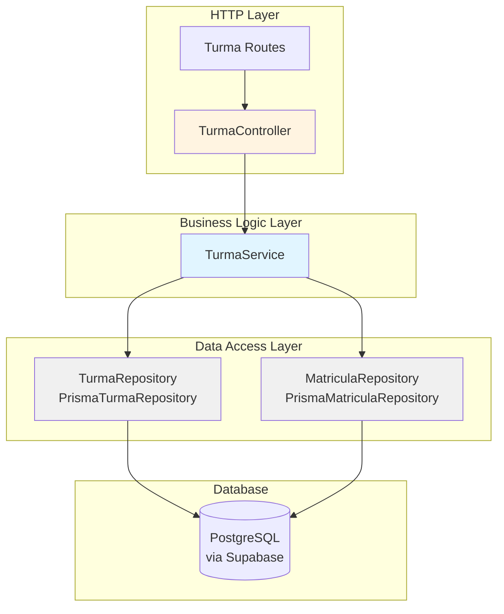
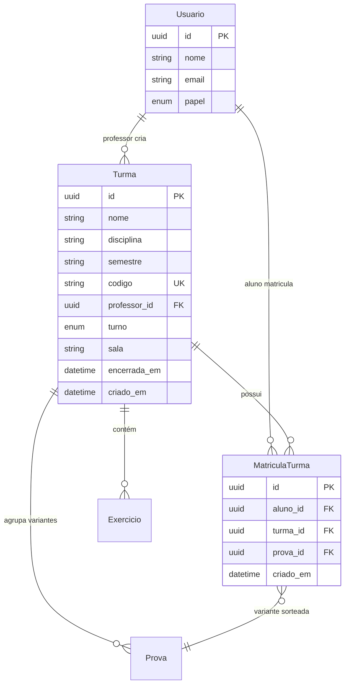

# Backend Turmas Module

## Overview

The **backend_turmas** module manages the lifecycle of turmas (class groups) in the IDE Web system. It handles turma creation with unique codes, student enrollment, turma closure/reopening, and provides different views of turmas based on user roles (professor, aluno, pesquisador).

This module implements the core organizational unit of the system: turmas group students and professors together for completing exercises and assessments. The module underwent significant evolution in Fase 8, where the turma code transitioned from being a credential for access to a one-time enrollment token, enabling students to maintain persistent accounts across multiple turmas.

---

## Architecture

### Layer Structure

The module follows the MSC (Model-Service-Controller) pattern as defined in `backend-dev-guidelines`:

### Component Responsibilities

| Component | Responsibility |
|-----------|----------------|
| **TurmaController** | HTTP request/response handling, input validation via Zod schemas, authentication checks |
| **TurmaService** | Business logic: code generation, ownership validation, enrollment rules, closure constraints |
| **TurmaRepository** | CRUD operations for `Turma` entity via Prisma |
| **MatriculaRepository** | CRUD operations for `MatriculaTurma` entity via Prisma |

---

## Data Model

### Entity Relationships

### Key Constraints

- **Unique constraint**: `MatriculaTurma(aluno_id, turma_id)` — one enrollment record per student per turma
- **Turma code**: 6 characters from a 32-character alphabet, globally unique across all turmas
- **Encerramento**: `encerrada_em IS NOT NULL` freezes the turma (read-only, no new enrollments)
- **Optional `turno` and `sala`**: only feed the professor dashboard filter; a turma without them is still valid

---

## Endpoints

All routes sit under `/api/v1`, are wired by hand in `turma.routes.ts` and require `requireAuth`. Ownership ("you are the professor of this turma") is checked in `TurmaService`, not in the route.

| Method and path | Roles | Controller method | Purpose |
|---|---|---|---|
| `POST /turmas` | professor, pesquisador | `criar` | Create a turma; body validated by `criarTurmaBodySchema` (`nome`, `semestre` required; `disciplina`, `turno`, `sala` optional). Answers `201` |
| `GET /turmas/minhas` | any authenticated | `minhas` | Turmas visible to the caller (see below) |
| `GET /turmas/:id/alunos` | professor, pesquisador | `listarAlunos` | Students enrolled, sorted by name |
| `POST /turmas/:codigo/matricular` | aluno | `matricular` | Enroll the logged-in student using the turma code. Answers `201` |
| `POST /turmas/:id/encerrar` | professor, pesquisador | `encerrar` | Freeze the turma (idempotent) |
| `POST /turmas/:id/reabrir` | professor, pesquisador | `reabrir` | Undo a closure made by mistake |

`GET /turmas/minhas` depends on the role:

| Role | Result |
|---|---|
| `professor` | turmas they created, newest first |
| `pesquisador` | **all** turmas, because the researcher must choose in which one to start the research |
| `aluno` | turmas they are enrolled in, resolved through `MatriculaTurma` |

`matricular` fails with `NotFoundError('Turma')` for an unknown code, and with `ConflictError` when the turma is closed or the student is already enrolled.

---

## Core Functionality

### 1. Turma Creation

**Endpoint**: `POST /api/v1/turmas`  
**Roles**: `professor`, `pesquisador`

**Code Generation Algorithm**:
- Uses `gerarCodigoTurma()` from `utils/codigoTurma.ts`
- 6 characters from `ABCDEFGHJKLMNPQRSTUVWXYZ23456789`: the letters `I` and `O` and the digits `0` and `1` are left out because they are easy to confuse when typed from a board or a printout
- Maximum 5 collision retry attempts (`TurmaService.gerarCodigoUnico`), checking `findByCodigo` each time
- Throws a plain error if all attempts fail, which is extremely unlikely with 32^6 ≈ 1.07 billion combinations
- The code is an enrollment token and no longer a credential (Fase 8), so it is generated with `Math.random` and not with a cryptographic source

### 2. Student Enrollment (Matricular)

**Endpoint**: `POST /api/v1/turmas/:codigo/matricular`  
**Role**: `aluno` (authenticated)

**Key Changes (Fase 8)**:

Prior to Fase 8, the turma code functioned as a session credential. This was replaced with persistent enrollment:

| Aspect | Before Fase 8 | After Fase 8 |
|--------|---------------|--------------|
| Authentication | Turma code = credential | Student has own email/password account |
| Enrollment | Temporary session | Persistent via matricular |
| Multiple turmas | One at a time | Multiple simultaneous enrollments |
| Prova assignment | Usuario.prova_id | MatriculaTurma.prova_id |

---

## Integration Points

### Upstream Dependencies

- **BaseController**: Provides `handleSuccess()` for consistent response formatting
- **Error classes**: `NotFoundError`, `ConflictError`, `ForbiddenError`, `UnauthorizedError`, `ValidationError`
- **requireAuth middleware**: Populates `req.usuario` with authenticated user context
- **Prisma client**: Singleton instance from `lib/prisma.ts` using `@prisma/adapter-pg`

### Downstream Consumers

| Consumer Module | Usage |
|----------------|-------|
| **backend_exercicios** | Exercises created in a turma context; AcessoExercicioService checks enrollment |
| **backend_provas** | Prova sorteio distributes variants among students; writes to MatriculaTurma.prova_id |
| **backend_painel** | Dashboard aggregates results across all students in turma |
| **backend_resultado** | Revisão per aluno requires turma context to validate professor ownership |
| **backend_pesquisa** | Research protocol targets one turma at a time |

---

## Related Modules

- **backend_auth**: User authentication, session management, role-based access
- **backend_exercicios**: Exercises belong to turmas
- **backend_provas**: Prova variants distributed among students in a turma
- **backend_painel**: Dashboards aggregate data by turma
- **backend_resultado**: Results scoped to turma context
- **backend_pesquisa**: Research protocols per turma
- **backend_core**: Base controller, health checks
- **backend_errors**: Domain error classes

---

## Decision History

| Decision | Document | Summary |
|----------|----------|---------|
| **Initial turmas backend** | docs/decisions/fase2-turmas-exercicios-tcle.md | Original CRUD operations, code-based access |
| **Enrollment refactor** | docs/decisions/fase8-conta-do-aluno-matricula-estudo-livre.md | Code changed from credential to enrollment token; multi-turma support |
| **Dashboard filters** | docs/decisions/fase10-professor-prova-sessao.md | Added optional turno/sala fields |
