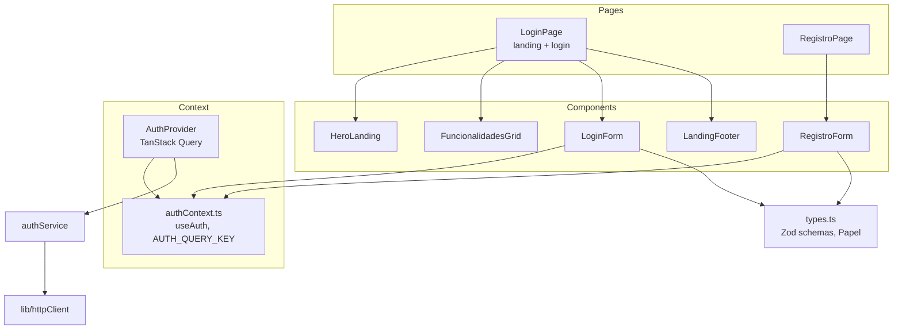
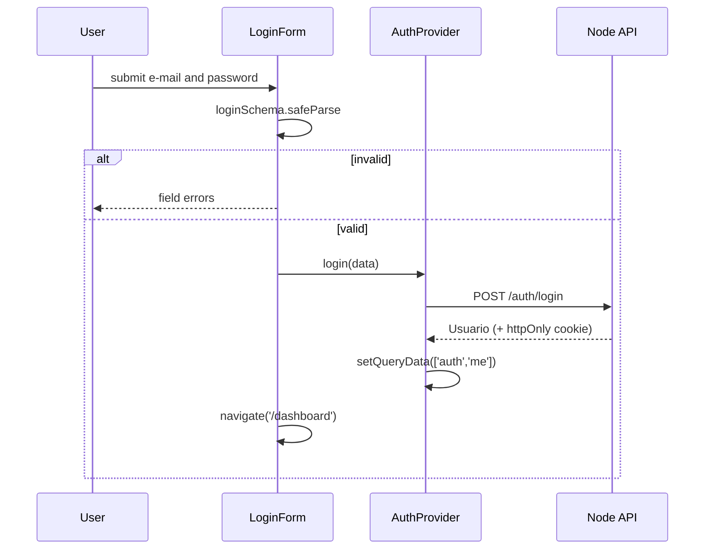

# Frontend Auth Module

## Overview

The `frontend_auth` module (`ide-web-front/src/features/auth/`) owns **who the user is** on the client: the login and registration screens, the public landing page, and the React context that exposes the current user to the rest of the app. It keeps no token itself. The session lives in an `httpOnly` cookie set by the backend, and this module only asks the API "who am I?" and reacts to the answer.

Since Phase 8 **every role has its own account** (e-mail and password), students included. The old "light session by class code" no longer exists: the class code is used *after* login, to enroll.

**Related documentation:**
- [Frontend Shared](frontend_shared.md) - `AuthGuard`, `TopNav` and `httpClient` all read from this module
- [Frontend Turmas](frontend_turmas.md) - `turmasService.matricular` is called from the registration form
- [Backend Auth](backend_auth.md) - the `/auth/*` endpoints and the server-side session

---

## Architecture



`index.ts` exports `AuthProvider`, `useAuth`, `LoginPage`, `RegistroPage` and the types `Papel` and `Usuario`. Other features import only from there.

---

## Types and validation (`types.ts`)

```typescript
export const PAPEIS = ['aluno', 'professor', 'pesquisador'] as const;
export const PAPEIS_REGISTRAVEIS = ['aluno', 'professor'] as const;

export interface Usuario {
  id: string;
  nome: string;
  email: string | null;
  papel: Papel;
}
```

| Schema | Rules |
|---|---|
| `loginSchema` | `email` trimmed and a valid e-mail; `senha` non-empty |
| `registroSchema` | `nome` non-empty; valid `email`; `senha` at least 8 characters; `papel` one of `PAPEIS_REGISTRAVEIS` |

`pesquisador` is deliberately **absent from the public registration**. It is a single account owned by the author, created by `ide-web-backend/scripts/seed-pesquisador.ts`, never by self-signup. The backend enforces the same rule; the frontend just does not offer the option.

---

## Auth context

`AuthProvider` wraps TanStack Query and publishes an `AuthContextValue`:

```typescript
interface AuthContextValue {
  usuario: Usuario | null;
  isLoading: boolean;
  login(input: LoginInput): Promise<Usuario>;
  registrar(input: RegistroInput): Promise<Usuario>;
  logout(): Promise<void>;
  isLoginPending: boolean;   isRegistroPending: boolean;
  loginError: Error | null;  registroError: Error | null;
}
```

- The current user is the query `['auth','me']` (`AUTH_QUERY_KEY`), with `retry: false` and `staleTime: Infinity`. It is fetched once at startup and then only changed by mutations.
- `fetchUsuarioAtual` turns a `401` from `GET /auth/me` into `null`: "not logged in" is a normal state, not an error. Any other error is rethrown.
- `login` and `registrar` write the returned user into the cache with `setQueryData`. `logout` writes `null`.
- `useAuth()` throws when used outside the provider.

`authService` is a thin wrapper: `POST /auth/registrar`, `POST /auth/login`, `POST /auth/logout`, `GET /auth/me`.



Session expiry is not handled here: `httpClient` refreshes silently on a 401, and if the refresh fails the next `/auth/me` returns 401 and the guard sends the user to `/login`.

---

## Components and pages

| Component | Behaviour |
|---|---|
| `LoginPage` | Landing page: `HeroLanding`, `FuncionalidadesGrid`, `LoginForm`, links to `/registro` (professor) and `/registro?papel=aluno`, then `LandingFooter` |
| `LoginForm` | Validates with `loginSchema`, maps Zod issues to per-field messages, shows the API error reactively through `loginError`, redirects to `/dashboard` |
| `RegistroPage` / `RegistroForm` | Choose the role (`Aluno` or `Professor`), name, e-mail, password. Accepts `papelInicial` and `codigoInicial` (from the query string) |
| `HeroLanding`, `LandingFooter` | Static presentation |
| `FuncionalidadesGrid` | Static list of six feature cards |

**Registration and class code.** When the role is `aluno`, the form shows an optional "class code" field. After the account is created, the form calls `turmasService.matricular(code)` as a **best-effort** step: if the code is wrong or the class is closed, the account already exists and the student simply retries from the dashboard instead of losing the registration.

> **Known stale text.** The first card of `FuncionalidadesGrid` still reads "Turmas por código: … alunos entram sem precisar de conta". That was true until Phase 7. Since Phase 8 a student needs an account and uses the code only to enroll. The card should be reworded.

---

## Notes for maintainers

- Never store the user or a token in `localStorage`. The cookie is `httpOnly` and the user object is rebuilt from `/auth/me`.
- Adding a role to the public registration needs both `PAPEIS_REGISTRAVEIS` here and the DTO in the backend.
- Form errors follow one pattern: Zod `safeParse`, map `issue.path[0]` to a field message, keep server errors in `loginError` / `registroError`.
