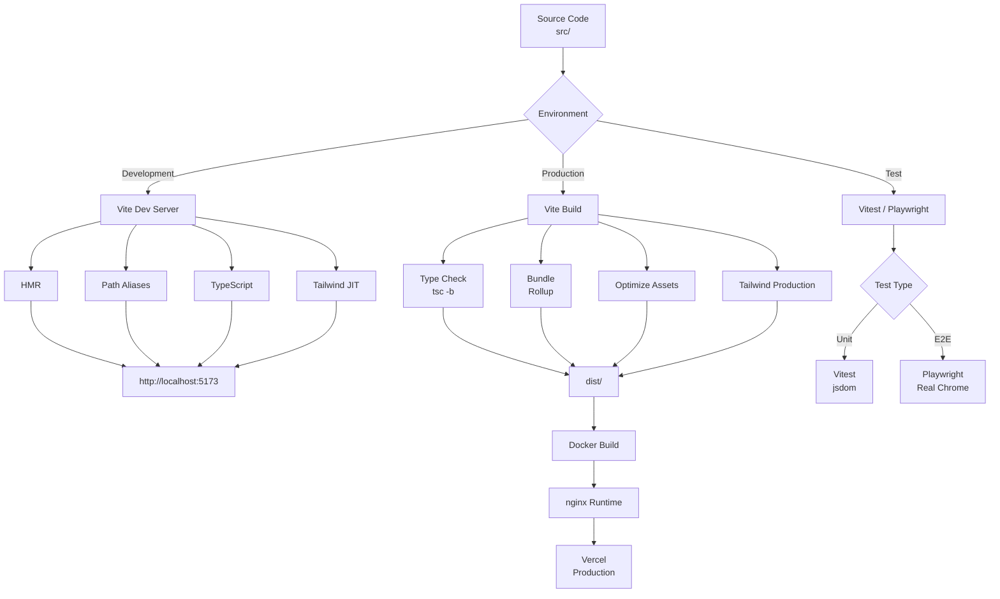
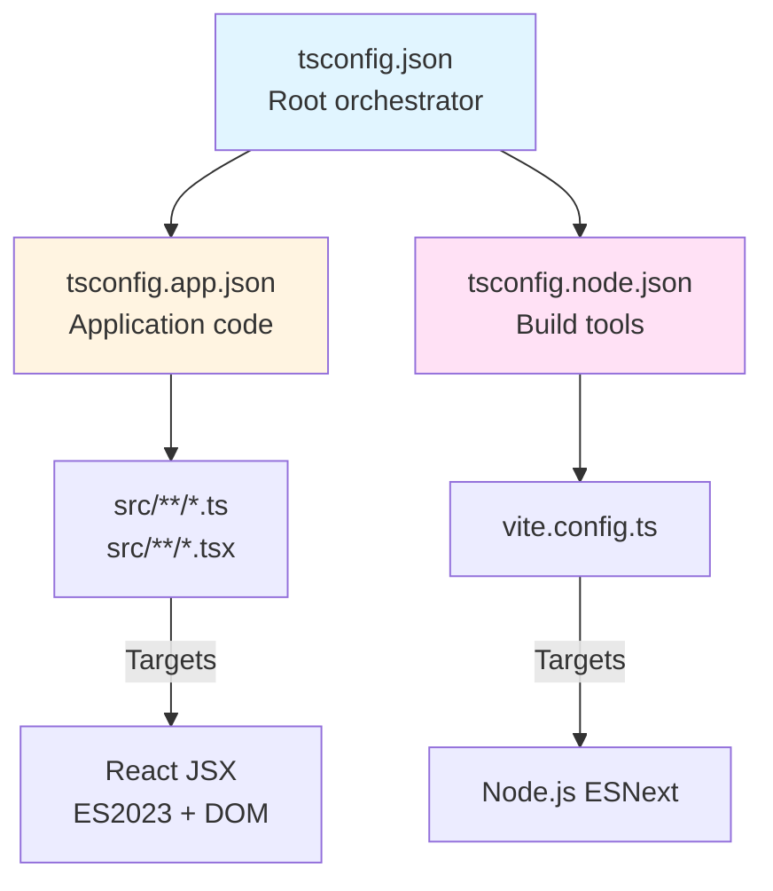
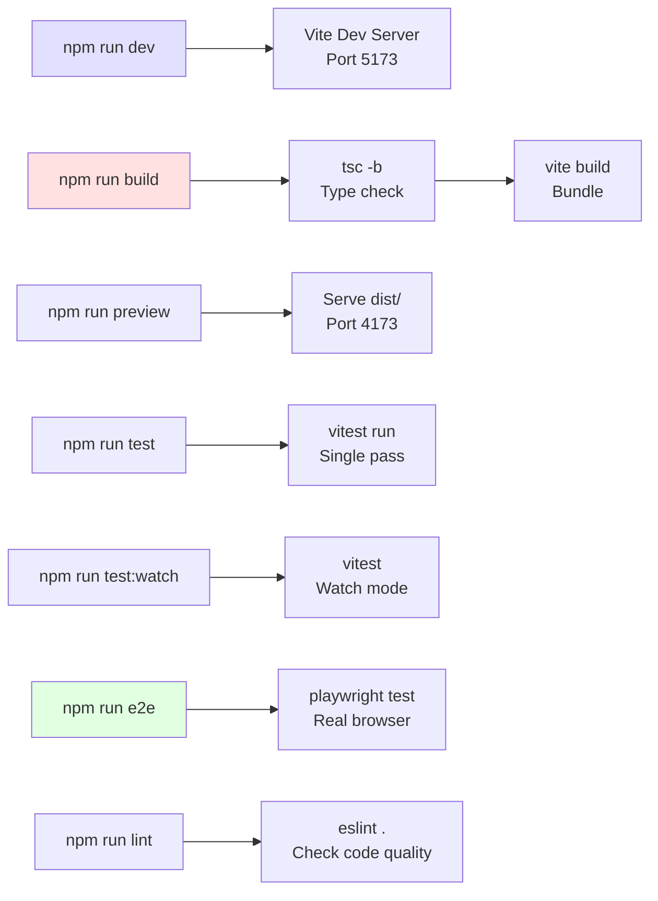
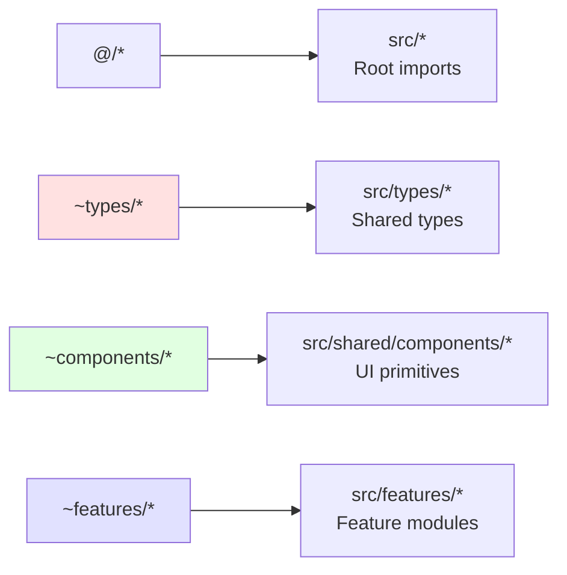
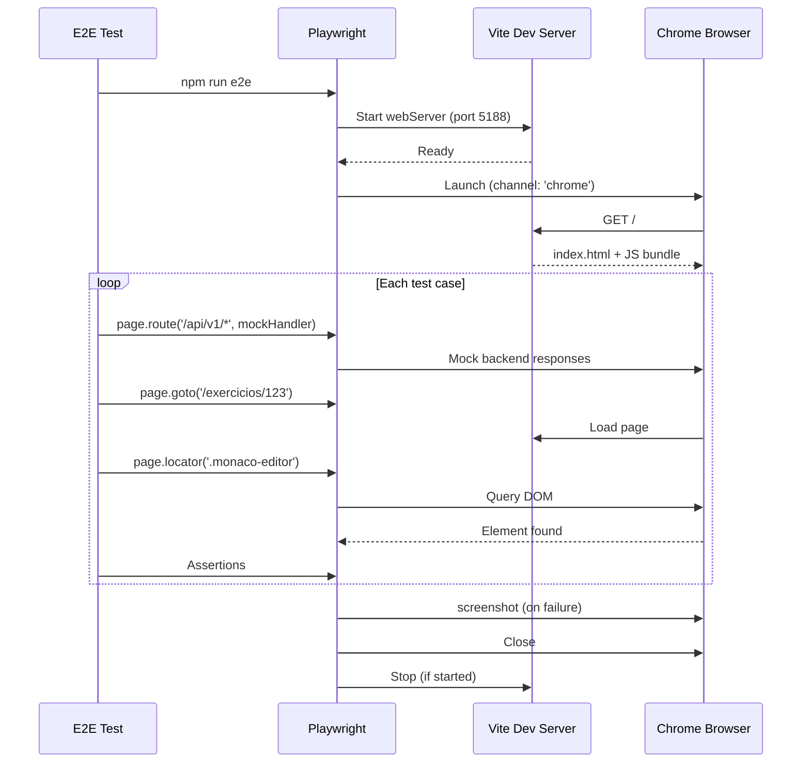
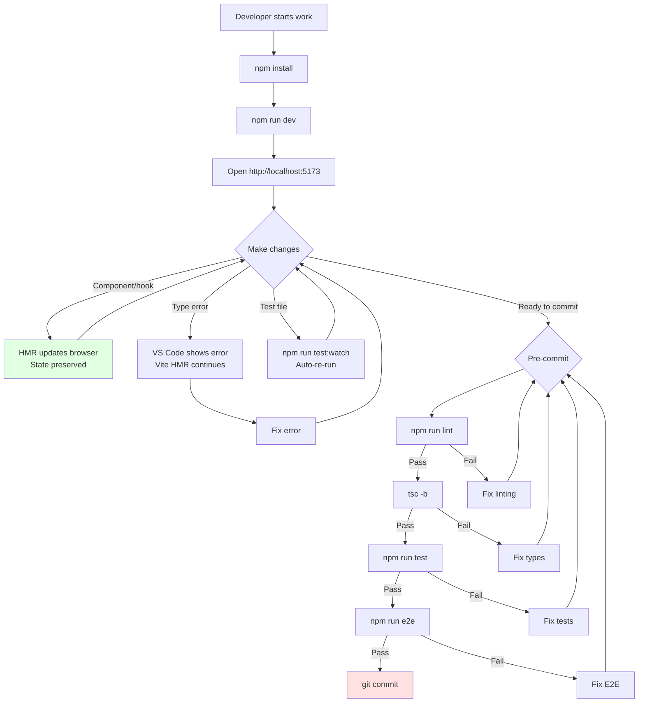
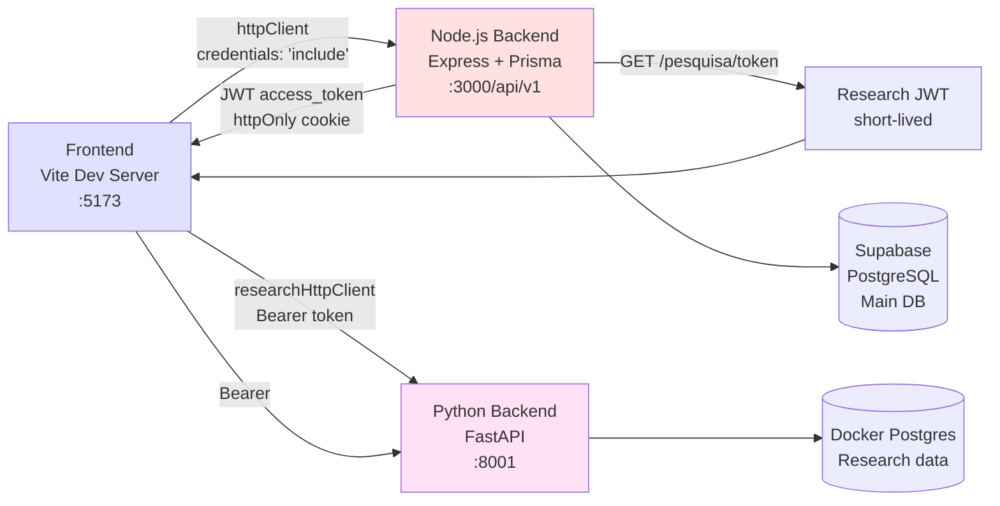

# Frontend Build Configuration

**Module**: `frontend_build_config`  
**Location**: `ide-web-front/`  
**Purpose**: Build toolchain, TypeScript configuration, and testing infrastructure for the React frontend application

---

## Overview

The frontend build configuration module orchestrates the entire development, build, and testing workflow for the IDE Web frontend. It uses **Vite** as the build tool with **React** and **TypeScript**, configured for both rapid development iteration and optimized production builds. The module implements a split TypeScript configuration strategy using project references, integrates unit testing via Vitest, and provides end-to-end browser testing through Playwright.

### Key Technologies

- **Build Tool**: Vite 8.2.0 (ESM-native, HMR, optimized bundling)
- **Type System**: TypeScript 6.0.2 with strict mode
- **Unit Testing**: Vitest 4.1.11 (Vite-native test runner)
- **E2E Testing**: Playwright 1.63.0 (real Chrome browser)
- **CSS Framework**: Tailwind CSS 4.3.3
- **UI Libraries**: React 19.2.8, React Flow (MER diagrams), Monaco Editor (SQL editing)
- **Production Server**: nginx (Alpine-based Docker image)

---

## Architecture

### Build Pipeline



### TypeScript Configuration Strategy

The frontend uses **TypeScript project references** to separate concerns:



**Why project references?**
- **Incremental builds**: Each project compiles independently with cached `.tsbuildinfo`
- **Strict boundaries**: Tooling code (Vite config) uses Node.js types; app code uses DOM/browser types
- **Parallel type-checking**: Multiple projects can be checked simultaneously

---

## Component Details

### 1. Package Configuration (`package.json`)

#### Core Dependencies

| Package | Version | Purpose |
|---------|---------|---------|
| `react` | 19.2.8 | UI framework |
| `react-router-dom` | 7.18.2 | Client-side routing |
| `@tanstack/react-query` | 5.101.4 | Server state management, caching |
| `@monaco-editor/react` | 4.7.0 | SQL code editor (VS Code engine) |
| `@xyflow/react` | 12.11.3 | MER diagram canvas (conceptual + logical modeling) |
| `html-to-image` | 1.11.13 | Capture MER diagrams as PNG for PDF export |
| `zod` | 4.4.3 | Runtime schema validation (mirrors backend DTOs) |

#### Development Dependencies

| Package | Version | Purpose |
|---------|---------|---------|
| `vite` | 8.2.0 | Build tool and dev server |
| `@vitejs/plugin-react` | 6.1.0 | React Fast Refresh, JSX transform |
| `@tailwindcss/vite` | 4.3.3 | Tailwind CSS integration |
| `typescript` | 6.0.2 | Type system |
| `vitest` | 4.1.11 | Unit test runner (Vite-native) |
| `@playwright/test` | 1.63.0 | E2E browser testing |
| `@testing-library/react` | 16.3.2 | Component testing utilities |
| `eslint` | 9.39.5 | Linting (with React/JSX/a11y plugins) |

#### NPM Scripts



**Key points**:
- **`build`**: Runs TypeScript compiler first (`tsc -b`) to validate types across all referenced projects, then bundles with Vite
- **`test:watch`**: Development mode with HMR for tests (uses jsdom environment)
- **`e2e`**: Runs Playwright against real Chrome (see E2E Testing Strategy section below)

### 2. Vite Configuration (`vite.config.ts`)

**Configuration source**: `ide-web-front/vite.config.ts`

```typescript
import { fileURLToPath, URL } from 'node:url'
import { defineConfig } from 'vitest/config'
import react from '@vitejs/plugin-react'
import tailwindcss from '@tailwindcss/vite'

export default defineConfig({
  plugins: [react(), tailwindcss()],
  resolve: {
    alias: {
      '@': './src',
      '~types': './src/types',
      '~components': './src/shared/components',
      '~features': './src/features',
    },
  },
  test: {
    environment: 'jsdom',
    globals: true,
    setupFiles: './tests/setup.ts',
  },
})
```

#### Path Aliases

**Purpose**: Avoid deep relative imports (`../../../shared/components`) and enforce architectural boundaries.



**Import rules** (from `CLAUDE.md`):
- Import from feature's `index.ts` by default
- **Exception**: Import service/hook directly when the feature exports heavy pages (Monaco/React Flow) to avoid loading unused code in tests

Example:
```typescript
// ✅ Normal case
import { ExercicioPage } from '~features/exercicio'

// ✅ Light import (avoids Monaco bundle in test)
import { exercicioService } from '~features/exercicio/services/exercicioService'
```

#### Vitest Integration

- **Environment**: `jsdom` (DOM simulation for React components)
- **Globals**: `true` (no need to import `describe`, `it`, `expect`)
- **Setup**: `tests/setup.ts` (configures `@testing-library/jest-dom` matchers)

**Limitation**: jsdom cannot run React Flow or Monaco Editor → E2E tests use real browser (see `playwright.config.ts`).

### 3. TypeScript Configuration

#### `tsconfig.json` (Root Orchestrator)

**Configuration source**: `ide-web-front/tsconfig.json`

```json
{
  "files": [],
  "references": [
    { "path": "./tsconfig.app.json" },
    { "path": "./tsconfig.node.json" }
  ]
}
```

**Solution pattern**: Uses TypeScript's **composite projects** feature. The root config has no files of its own; it delegates to sub-projects via `references`.

**Build command**: `tsc -b` (build mode) honors references and compiles incrementally.

#### `tsconfig.app.json` (Application Code)

**Configuration source**: `ide-web-front/tsconfig.app.json`

**Target**: `ES2023` with `DOM` libs (browser runtime)  
**Module system**: `esnext` with `bundler` resolution (Vite handles final bundling)  
**Strictness**:
```json
{
  "strict": true,
  "noImplicitAny": true,
  "noUncheckedIndexedAccess": true,  // ← Array access returns T | undefined
  "exactOptionalPropertyTypes": true  // ← {x?: string} !== {x?: string | undefined}
}
```

**Path aliases**: Mirrored from `vite.config.ts` (both configs must stay in sync).

**Output**: `noEmit: true` (Vite handles transpilation; TypeScript only type-checks).

**Build cache**: `node_modules/.tmp/tsconfig.app.tsbuildinfo` (gitignored).

#### `tsconfig.node.json` (Build Tooling)

**Configuration source**: `ide-web-front/tsconfig.node.json`

**Target**: `ES2023` with Node.js types (for `vite.config.ts`)  
**Module system**: `nodenext` (supports both CJS and ESM in Node.js 20+)  
**Includes**: Only `vite.config.ts`  
**Build cache**: `node_modules/.tmp/tsconfig.node.tsbuildinfo`

**Why separate?** Prevents DOM types from leaking into build scripts and vice versa.

---

## Testing Infrastructure

### Unit Testing (Vitest)

```mermaid
flowchart TD
    A[Component Test] --> B[Vitest Runner]
    B --> C[jsdom Environment]
    C --> D[@testing-library/react]
    D --> E[Render Component]
    E --> F{Assertions}
    F -->|Pass| G[✓ Green]
    F -->|Fail| H[✗ Red]
    
    I[tests/setup.ts] --> C
    I --> J[@testing-library/jest-dom<br/>Custom matchers]
    
    style C fill:#ffe1e1
    style D fill:#e1ffe1
```

**Configuration** (from `vite.config.ts`):
- **Environment**: jsdom (lightweight DOM simulation)
- **Globals**: `describe`, `it`, `expect` available without imports
- **Setup file**: `tests/setup.ts` (configures Testing Library matchers like `toBeInTheDocument()`)

**Limitations**:
- **Cannot test Monaco Editor** (requires real browser APIs)
- **Cannot test React Flow** (uses ResizeObserver, IntersectionObserver not in jsdom)
- → These features require E2E tests

### E2E Testing (Playwright)

**Configuration source**: `ide-web-front/playwright.config.ts`

```typescript
export default defineConfig({
  testDir: './tests/e2e',
  testMatch: '**/*.e2e.ts',
  timeout: 60_000,
  fullyParallel: false,  // One worker (Monaco + React Flow = heavy)
  workers: 1,
  use: {
    baseURL: 'http://localhost:5188',
    channel: 'chrome',  // Uses system Chrome, not bundled Chromium
    viewport: { width: 1366, height: 768 },
    screenshot: 'only-on-failure',
    trace: 'retain-on-failure',
  },
  webServer: {
    command: 'npx vite --port 5188 --strictPort',
    url: 'http://localhost:5188',
    reuseExistingServer: true,
  },
})
```

#### Why Real Browser Testing?

From `CLAUDE.md`:
> Teste de navegador real: `npm run e2e` (Playwright + Chrome do sistema, API simulada, `tests/e2e/*.e2e.ts`).

**Problem**: jsdom doesn't support:
- **Monaco Editor**: Uses Web Workers, advanced TextMate grammars
- **React Flow**: Requires `ResizeObserver`, `IntersectionObserver`, advanced SVG rendering

**Solution**: Playwright launches real Chrome, renders full React app with Vite dev server.

#### Test Execution Flow



**Key configuration choices**:

| Setting | Value | Rationale |
|---------|-------|-----------|
| `workers: 1` | Single worker | Three Monaco+React Flow instances freeze the browser |
| `fullyParallel: false` | Sequential | Tests share same Vite server |
| `channel: 'chrome'` | System Chrome | Stable, user's actual browser |
| `screenshot: 'only-on-failure'` | Conditional capture | Debug failures visually |
| `reuseExistingServer: true` | Reuse dev server | Faster local dev iteration |

**API mocking**: Tests use `page.route()` to simulate backend responses (no real API server needed).

---

## Build Process

### Development Build

```bash
npm run dev
```

**Flow**:
1. Vite starts dev server on port `5173` (default)
2. Loads `vite.config.ts` (Node.js context via `tsconfig.node.json`)
3. Applies plugins: `@vitejs/plugin-react` (Fast Refresh), `@tailwindcss/vite` (JIT compiler)
4. Resolves path aliases (`@/*`, `~features/*`, etc.)
5. Serves `index.html` with injected script tag
6. Watches `src/` for changes → HMR updates without full reload

**Hot Module Replacement**:
- **React components**: Preserves state between edits (Fast Refresh)
- **CSS**: Injects updated styles without reload
- **Monaco/React Flow**: Some changes require full reload (editor workers, canvas state)

### Production Build

```bash
npm run build
```

**Two-phase process**:

#### Phase 1: Type Checking
```bash
tsc -b
```
- Compiles all projects in `references` (app + node)
- Validates types across project boundaries
- Writes `.tsbuildinfo` for incremental rebuilds
- **Does not emit JS** (`noEmit: true`)

#### Phase 2: Bundling
```bash
vite build
```

**Output** (`dist/`):
```
dist/
├── index.html                 # Entry point with hashed asset links
├── assets/
│   ├── index-[hash].js       # Main bundle (React, React Router, etc.)
│   ├── chunk-[hash].js       # Code-split chunks (per route/feature)
│   ├── monaco-[hash].js      # Monaco Editor bundle (lazy loaded)
│   ├── reactflow-[hash].js   # React Flow bundle (lazy loaded)
│   └── index-[hash].css      # Compiled Tailwind + component styles
└── vite.svg                  # Favicon
```

**Optimizations**:
- **Code splitting**: Each route/feature in separate chunk
- **Tree shaking**: Removes unused exports (ES modules only)
- **Minification**: Terser for JS, cssnano for CSS
- **Asset hashing**: Cache busting (e.g., `index-a1b2c3d4.js`)
- **Tailwind purging**: Removes unused utility classes (production only)

**Environment variables** (build-time):
- `VITE_API_URL`: Backend API base URL (default: `http://localhost:3000/api/v1`)
- `VITE_RESEARCH_API_URL`: Python research backend (default: `http://localhost:8001`)

Set via Docker build args (see Docker Build section below).

### Docker Build

**Configuration source**: `ide-web-front/Dockerfile`

```dockerfile
# Stage 1: Build
FROM node:20-alpine AS build
WORKDIR /app

COPY package.json package-lock.json ./
RUN npm ci

COPY . .

ARG VITE_API_URL=http://localhost:3000/api/v1
ARG VITE_RESEARCH_API_URL=http://localhost:8001
ENV VITE_API_URL=$VITE_API_URL
ENV VITE_RESEARCH_API_URL=$VITE_RESEARCH_API_URL
RUN npm run build

# Stage 2: Runtime
FROM nginx:alpine AS runtime
COPY --from=build /app/dist /usr/share/nginx/html
COPY nginx.conf /etc/nginx/conf.d/default.conf

EXPOSE 80
```

**Multi-stage build benefits**:
- **Small final image**: nginx runtime (~40MB) vs node build (~800MB)
- **No dev dependencies**: `node_modules/` stays in build stage
- **Security**: No Node.js runtime in production image

#### nginx Configuration

**Configuration source**: `ide-web-front/nginx.conf`

```nginx
server {
    listen 80;
    root /usr/share/nginx/html;
    index index.html;

    # SPA fallback: all routes → index.html (client-side routing)
    location / {
        try_files $uri $uri/ /index.html;
    }

    # Aggressive caching for hashed assets
    location /assets/ {
        expires 1y;
        add_header Cache-Control "public, immutable";
    }
}
```

**Key features**:
- **SPA routing**: `/exercicios/123` → serves `index.html`, React Router handles client-side route
- **Cache headers**: Hashed assets (`index-[hash].js`) cached for 1 year (safe due to hash invalidation)
- **No cache**: `index.html` always fetched fresh (no hash, references latest assets)

---

## Development Workflow

### Local Development



### Integration with Backend

The frontend connects to two backends:



**Authentication flow**:
1. User logs in → `POST /api/v1/auth/login`
2. Backend sets `httpOnly` cookie (`access_token`)
3. All `httpClient` requests include cookie automatically (`credentials: 'include'`)
4. For research endpoints, frontend fetches short-lived JWT: `GET /api/v1/pesquisa/token`
5. `researchHttpClient` uses this token as `Authorization: Bearer <token>`

See [frontend_auth](frontend_auth.md) and [backend_pesquisa](backend_pesquisa.md) for details.

---

## Linting and Code Quality

### ESLint Configuration

From `package.json` devDependencies:

```json
{
  "eslint": "^9.39.5",
  "eslint-plugin-jsx-a11y": "^6.10.2",      // Accessibility checks
  "eslint-plugin-react": "^7.37.5",         // React best practices
  "eslint-plugin-react-hooks": "^7.1.1",    // Hooks rules
  "eslint-plugin-react-refresh": "^0.5.4"   // HMR-safe components
}
```

**Key rules enforced**:
- **Accessibility**: `jsx-a11y` (e.g., `alt` text on images, ARIA labels)
- **Hooks dependencies**: `react-hooks/exhaustive-deps` (prevent stale closures)
- **HMR compatibility**: `react-refresh/only-export-components` (avoid exports that break Fast Refresh)
- **TypeScript**: `@typescript-eslint` strict rules (via `typescript-eslint` plugin)

**Run**:
```bash
npm run lint  # Check all src/ files
```

---

## Dependency Management

### Heavy Dependencies

**Problem**: Monaco Editor and React Flow are large bundles (~3MB combined).

**Strategy**:
1. **Lazy loading**: Import dynamically when needed
   ```typescript
   const MonacoEditor = React.lazy(() => import('@monaco-editor/react'))
   ```
2. **Code splitting**: Vite automatically splits into separate chunks
3. **Isolated imports**: Services/hooks import directly (bypass heavy `index.ts`)

**Example** (from `CLAUDE.md`):
```typescript
// ❌ Pulls Monaco into test bundle
import { exercicioService } from '~features/exercicio'

// ✅ Light import (only service code)
import { exercicioService } from '~features/exercicio/services/exercicioService'
```

### Zod Schema Validation

**Purpose**: Runtime validation of API responses (mirrors backend DTOs).

**Pattern**:
```typescript
// Backend: src/dtos/exercicio.dto.ts
export const createExercicioSchema = z.object({
  titulo: z.string().min(3),
  nivel: z.enum(['iniciante', 'intermediario']),
  // ...
})

// Frontend: src/features/exercicio/types.ts
import { z } from 'zod'

export const exercicioProfessorSchema = z.object({
  id: z.string().uuid(),
  titulo: z.string(),
  nivel: z.enum(['iniciante', 'intermediario']),
  // ...
})

export type ExercicioProfessor = z.infer<typeof exercicioProfessorSchema>
```

**Usage**:
```typescript
const response = await httpClient.get('/exercicios/123')
const exercicio = exercicioProfessorSchema.parse(response.data)
```

**Benefits**:
- **Type safety**: `parse()` throws on invalid data → catches API contract drift
- **Single source of truth**: Schema defines both runtime validation and TypeScript types
- **DX**: Errors show exact field path (e.g., `"nivel: Expected 'iniciante' | 'intermediario', received 'advanced'"`)

---

## Production Deployment

### Vercel Deployment

From `CLAUDE.md`:
> Frontend: Vercel

**Build command** (Vercel config):
```bash
npm run build
```

**Environment variables** (set in Vercel dashboard):
```env
VITE_API_URL=https://ide-web-backend.onrender.com/api/v1
VITE_RESEARCH_API_URL=https://pesquisa.example.com
```

**Output directory**: `dist/`

**Framework preset**: Vite (auto-detected from `vite.config.ts`)

**Deployment flow**:
1. Push to `main` branch
2. Vercel detects change (GitHub integration)
3. Runs `npm install`
4. Runs `npm run build` with env vars injected
5. Uploads `dist/` to CDN
6. Updates DNS to new deployment
7. Previous deployment kept as rollback target

**Caching**:
- `index.html`: No cache (always fresh)
- `assets/*`: 1-year cache via nginx config (hashed filenames)
- Edge CDN: Serves assets from nearest location

---

## Troubleshooting

### Common Issues

#### 1. Monaco Editor Not Loading in Tests

**Symptom**: `TypeError: Cannot read property 'editor' of undefined`

**Cause**: jsdom doesn't support Monaco's Web Workers.

**Solution**: Mock Monaco in unit tests, use E2E for editor features.

```typescript
// tests/setup.ts
vi.mock('@monaco-editor/react', () => ({
  default: () => <div data-testid="monaco-mock" />,
}))
```

#### 2. Type Errors After Dependency Update

**Symptom**: `tsc -b` fails with module resolution errors.

**Solution**: Rebuild TypeScript project references:
```bash
rm -rf node_modules/.tmp/*.tsbuildinfo
npm run build
```

#### 3. Tailwind Classes Not Purged

**Symptom**: Production bundle includes unused Tailwind classes.

**Cause**: Dynamic class names (e.g., `className={'text-' + color}`) aren't detected.

**Solution**: Use safelisting in Tailwind config, or avoid dynamic class construction:
```typescript
// ❌ Not purge-safe
<div className={`text-${color}`} />

// ✅ Purge-safe
<div className={color === 'red' ? 'text-red-500' : 'text-blue-500'} />
```

#### 4. E2E Tests Timeout

**Symptom**: Playwright hangs at "Starting webServer".

**Cause**: Port 5188 already in use.

**Solution**:
```bash
lsof -ti:5188 | xargs kill -9
npm run e2e
```

---

## Related Modules

- **[infrastructure](infrastructure.md)**: Docker Compose orchestration, nginx runtime
- **[backend_build_config](backend_build_config.md)**: Backend TypeScript configuration (mirrors some settings)
- **[frontend_auth](frontend_auth.md)**: `AuthGuard`, `httpClient`, authentication flow
- **[frontend_exercicios](frontend_exercicios.md)**: Monaco Editor integration, exercise IDE
- **[frontend_modelagem](frontend_modelagem.md)**: React Flow integration, MER diagram editor
- **[frontend_shared](frontend_shared.md)**: Shared components (`Button`, `Modal`, `PageStub`)

---

## Key Decisions and Trade-offs

### 1. Vite over Webpack

**Rationale**:
- **Dev server speed**: ESM-native (no bundling in dev), instant HMR
- **Build speed**: Rollup-based, faster than Webpack for React apps
- **DX**: Zero config for TypeScript, CSS, assets

**Trade-off**: Less ecosystem maturity than Webpack (some plugins not available).

### 2. Project References over Monorepo

**Rationale**:
- **Simpler setup**: No Lerna/Turborepo complexity
- **IDE support**: VS Code honors `tsconfig.json` references natively
- **Incremental builds**: `tsc -b` only recompiles changed projects

**Trade-off**: Doesn't scale to 10+ packages (this app has 2: app + node).

### 3. Playwright over Cypress

**Rationale**:
- **Real browser**: Uses system Chrome (not Electron/custom Chromium)
- **Multiple browsers**: Can test Firefox, Safari (Cypress is Chrome-only)
- **Performance**: Parallel execution, video/trace on failure

**Trade-off**: Less "magic" (explicit waits required), steeper learning curve.

### 4. Single Worker for E2E

**Rationale** (from `playwright.config.ts`):
> Um worker só: os testes dividem o mesmo Vite, e três páginas pesadas (React Flow + Monaco) subindo juntas travavam o carregamento do exercício.

**Trade-off**: Sequential execution (slower), but stable (no race conditions).

---

## Future Improvements

### Potential Enhancements

1. **Module Federation**: Share React/React Router between micro-frontends
2. **Service Worker**: Offline support for student environment (exercises cached)
3. **Web Workers**: Offload Zod validation to background thread
4. **Bundle analysis**: `rollup-plugin-visualizer` to track bundle size over time
5. **Vitest UI**: `vitest --ui` for interactive test debugging
6. **Playwright trace viewer**: `npx playwright show-trace trace.zip` for visual debugging

### Performance Monitoring

Add production build size tracking:
```json
{
  "scripts": {
    "build": "tsc -b && vite build && npm run analyze",
    "analyze": "vite-bundle-visualizer"
  }
}
```

---

## Summary

The **frontend_build_config** module provides a modern, type-safe build pipeline for the IDE Web frontend. It leverages Vite's speed, TypeScript's strictness, and Playwright's real-browser testing to deliver a robust developer experience. The configuration balances rapid iteration (HMR, instant type checking) with production optimizations (code splitting, tree shaking, aggressive caching), while maintaining clear architectural boundaries through project references and path aliases.

**Key achievements**:
- ✅ **Sub-second HMR**: Changes reflect instantly in browser
- ✅ **Type-safe imports**: All aliases resolved by both TypeScript and Vite
- ✅ **E2E confidence**: Real Chrome tests catch Monaco/React Flow issues
- ✅ **Small bundles**: 40MB nginx image (vs 800MB node image)
- ✅ **Vercel-ready**: Zero-config deployment with edge CDN
