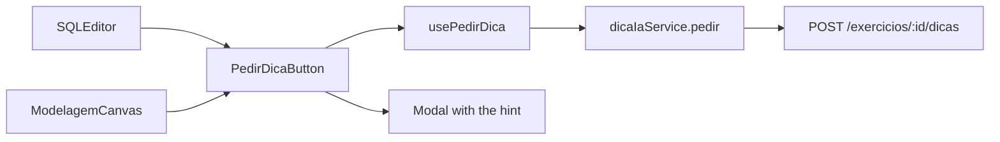
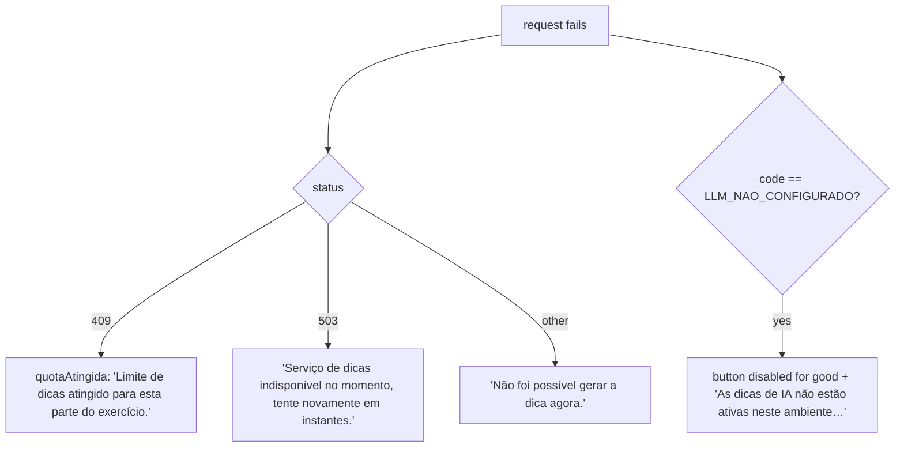
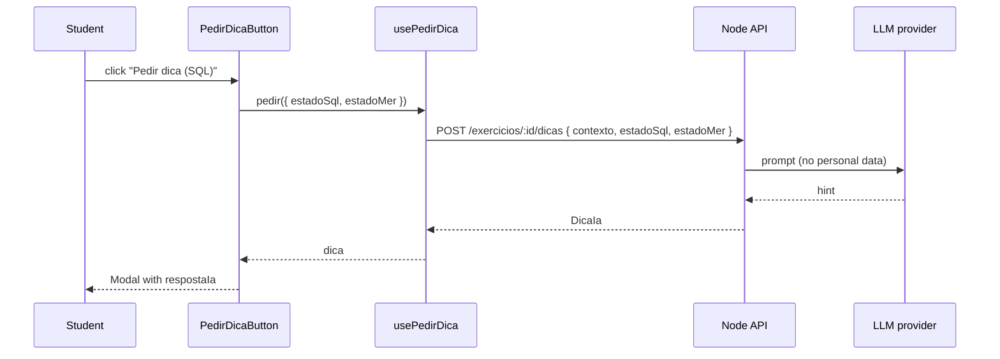

# Frontend Dica IA Module

## Overview

The `frontend_dica_ia` module (`ide-web-front/src/features/dica-ia/`) adds the **"Pedir dica"** button to the exercise editors. The student clicks it on demand, the backend asks an LLM for a pedagogical hint (never the finished answer), and the text appears in a modal.

The module is deliberately small: one button, one hook, one service, three types. It knows nothing about prompts, quotas or the LLM provider; those live in [Backend Dica IA](backend_dica_ia.md). Its job is to send the live state of the editors and translate the backend's error codes into clear messages.

**Related documentation:**
- [Backend Dica IA](backend_dica_ia.md) - limit of 5 hints per context, prompt without personal data
- [Frontend Exercicios](frontend_exercicios.md) - `SQLEditor` renders the SQL button
- [Frontend Modelagem](frontend_modelagem.md) - the modelling canvas renders the MER button
- [Frontend Shared](frontend_shared.md) - `Button` and `Modal`

---

## Architecture



`index.ts` exports only `PedirDicaButton` and the type `EstadoDica`.

---

## Types

```typescript
export const CONTEXTOS_DICA = ['sql', 'mer'] as const;

export interface DicaIa { id: string; contexto: ContextoDica; respostaIa: string; criadoEm: string }

// Live state of the editors. Since Phase 6 both go together when the exercise
// has both parts, so the AI can point out inconsistency between model and query.
export interface EstadoDica { estadoMer?: unknown; estadoSql?: string }

export interface PedirDicaInput extends EstadoDica { contexto: ContextoDica }
```

`estadoMer` is the whole modelling document. The backend turns it into a summary of the conceptual model plus the logical model as generated SQL before prompting the LLM.

## Hook: `usePedirDica(exercicioId, contexto)`

Wraps a TanStack Query mutation and returns:

| Field | Meaning |
|---|---|
| `pedir(estado)` | fires the request |
| `isPending` | request in flight |
| `dica` / `fecharDica()` | the received hint, and a way to clear it |
| `quotaAtingida` | set to `true` once the backend answers **409** |
| `erro` | the `HttpError`, when there is one |

`quotaAtingida` sticks after the first 409, so the button stays disabled without another click being needed to learn that the limit was reached.

## Component: `PedirDicaButton`

```typescript
interface PedirDicaButtonProps {
  exercicioId: string;
  contexto: ContextoDica;      // 'sql' | 'mer'
  estado: EstadoDica;
  semConteudo: boolean;        // the caller knows if the part is empty
}
```

Labels are "Pedir dica (SQL)" and "Pedir dica (MER)". The button is disabled when a request is pending, the quota is reached, the part is empty (`semConteudo`) or the AI is not configured.

### How errors are shown



The distinction between `LLM_NAO_CONFIGURADO` and a plain 503 is intentional. A missing API key in the environment does not fix itself by retrying, so the button is disabled with an explanatory `title`. A transient 503 from the provider is worth retrying, so the button stays usable.

While waiting, the button area shows "Processando dica, aguarde..." in an `aria-live="polite"` region, and errors use `role="alert"`.

The hint itself is rendered inside `Modal` titled "Dica".

## Data flow


