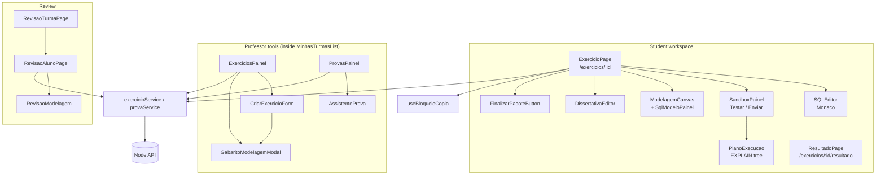
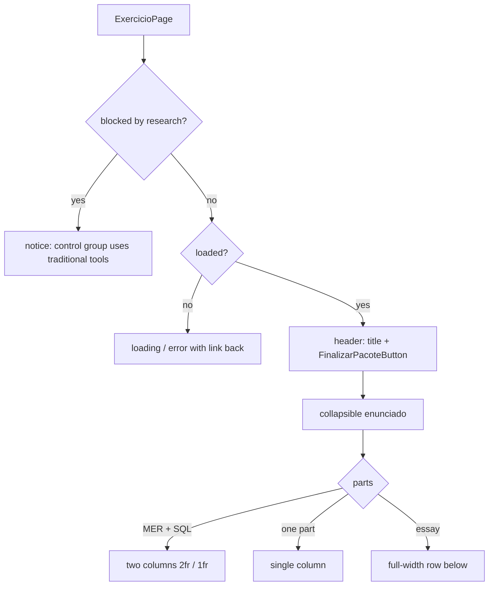
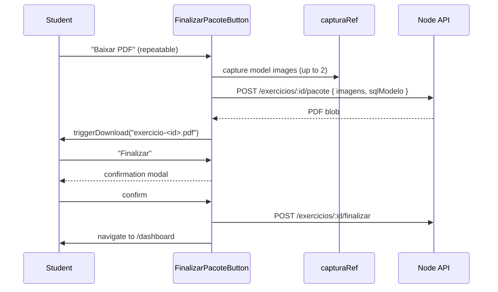

# Frontend Exercicios Module

## Overview

The `frontend_exercicios` module (`ide-web-front/src/features/exercicio/`, excluding the `modelagem/` subtree documented in [Frontend Modelagem](frontend_modelagem.md)) is the **exercise workspace**. It has two audiences:

- **The student** solves an exercise in `ExercicioPage`: an SQL editor with a sandbox, a modelling canvas, and an essay box, side by side. They can test, submit, download a PDF and finish the exercise.
- **The professor** creates exercises, sets the answer keys (gabaritos), builds and draws exams, releases or hides the gabarito, and reviews student answers.

An exercise combines **up to three optional parts**: SQL (`temSql`), modelling (`temMer`) and essay (`temDissertativa`). The page adapts to whichever parts exist.

**Related documentation:**
- [Backend Exercicios](backend_exercicios.md) - CRUD and the single access-control point `AcessoExercicioService`
- [Backend Sandbox SQL](backend_sandbox_sql.md) - what "Testar" and "Enviar resposta" run
- [Backend Resultado](backend_resultado.md) - review and grade endpoints
- [Backend Provas](backend_provas.md) - exam variants and the drawing
- [Backend Pacote](backend_pacote.md) - the PDF and the finalisation
- [Frontend Modelagem](frontend_modelagem.md) - the canvas embedded in the page
- [Frontend Dica IA](frontend_dica_ia.md) - the hint button in the SQL editor

---

## Architecture



`index.ts` exports `ExercicioPage`, `ResultadoPage`, `ExerciciosPainel`, `ExerciciosAlunoList`, `ProvasPainel`, `RevisaoTurmaPage`, `RevisaoAlunoPage`, `exercicioService` and `provaService`.

> `ExercicioPage` loads Monaco, which is heavy. Other features that only need a service import the concrete file (`~features/exercicio/services/exercicioService`) instead of the barrel, so Monaco is not pulled in and jsdom tests do not break.

---

## Types and validation (`types.ts`)

```typescript
interface ExercicioAluno {
  id; turmaId; provaId: string | null; titulo; enunciado;
  nivelDificuldade: 'iniciante' | 'intermediario';
  prazo: string | null;
  publico: boolean;            // any logged-in student may solve it, no enrollment needed
  gabaritoLiberado: boolean;
  temSql; temMer; temDissertativa: boolean;
  modoMer: ModoModelagem;      // level of modelling, always chosen by the professor
  sqlSetup: string | null;     // sample-data script (not an answer)
}
interface ExercicioProfessor extends ExercicioAluno {
  merGabarito: unknown; sqlGabarito: string | null; gabaritoDissertativo: string | null;
}
```

The student DTO never carries a gabarito; the three answer keys exist only on `ExercicioProfessor`.

| Schema | Rules |
|---|---|
| `criarExercicioSchema` | `turmaId` uuid; `titulo` and `enunciado` required; `nivelDificuldade`; optional `prazo`, `publico`, `provaId`, `sqlGabarito`, `sqlSetup`, `gabaritoDissertativo`, `merGabarito` (validated by `documentoModelagemSchema`), `modoMer`. The order is assigned by the backend |
| `atualizarExercicioSchema` | only `merGabarito` and `modoMer` |
| `criarProvaSchema` | `turmaId` uuid, `titulo` required |
| `revisarResultadoSchema` | `sqlCorreto` boolean; `merAvaliacao`, `dissertativaAvaliacao`, `pontuacao` each coerced to a number between **0 and `NOTA_MAXIMA` = 10** |

Sandbox result types: `SandboxResultado { status: 'sucesso' | 'erro_sintaxe' | 'erro_execucao', rows?, message? }` and `SandboxEnvioResultado`, which adds `correta: boolean | null`, `submissaoId`, `tentativaNumero` and the EXPLAIN `plano`.

## Services

`exercicioService` (all through `httpClient`, except the PDF):

| Area | Methods |
|---|---|
| Exercise | `buscarPorId`, `listarPorTurma`, `criar`, `atualizar`, `listarPublicos` |
| Gabarito | `liberarGabarito`, `ocultarGabarito` |
| Sandbox | `testarSql` (`POST /exercicios/:id/sandbox/testar`), `enviarSql` (`/sandbox/enviar`) |
| Modelling | `getDiagrama`, `salvarDiagrama` (`PUT /exercicios/:id/diagrama`), `diagramaDoAluno` (professor reads a student's model) |
| Result | `meuResultado`, `resultadoDoAluno`, `revisarResultado` (`PATCH .../alunos/:usuarioId/resultado`), `respostasDoAluno` |
| Closing | `baixarPacote` (raw `postForBlob`), `finalizar` |

`provaService`: `criar`, `listarPorTurma`, `acervo`, `montarComAssistente` and `sortear`, mapped to `/turmas/:turmaId/provas...` and `/turmas/:turmaId/sortear-provas`.

---

## Student workspace: `ExercicioPage`

The page fetches the exercise (`['exercicios', id]`) and lays out only the parts that exist:



**State lifted into the page.** `sql`, the modelling `documento` and the current `selecao` live here, so the two editors can talk to each other:

- `sqlDoModelo = gerarSql(documento.logico)` feeds `SqlModeloPainel` and the PDF.
- **Two-way highlight (MER ↔ SQL).** Placing the cursor on an identifier in the query resolves it against the tables and aliases of the logical model and selects it on the canvas. Selecting on the canvas highlights every occurrence in the query through Monaco decorations. It only runs when the exercise has both parts **and** a logical model (`sincronizar`); a purely conceptual exercise has no logical model, so neither the SQL panel nor the sync exists.
- The hint button receives the live editor state, including the modelling document when both parts exist.

**Exam mode.** When the exercise belongs to an exam (`provaId != null`), `useBloqueioCopia(true)` blocks `copy`, `cut`, `paste` and `contextmenu` on the document, and `SandboxPainel` changes behaviour. This is **deterrence, not control**: it stops the careless student, not someone with a phone or a second monitor, and the TCC text must not claim the platform prevents outside consultation.

**Research block.** `useBloqueioPesquisa()` replaces the whole page with an explanation for control-group students while a research is active (see [Frontend Pesquisa](frontend_pesquisa.md)). Blocking is frontend-only.

The header reserves `pr-14` for the floating theme button and stacks on narrow screens, because a one-line header squeezed the title to "S..." at 390 px.

### `SQLEditor`

Monaco, bundled locally (`loader.config({ monaco })`) so the editor works 100% self-hosted with no CDN. It exposes `onCursorChange(offset)` and accepts `destaques` (ranges to highlight, styled with the class `mer-sync-destaque`). Its toolbar renders `PedirDicaButton` with `contexto="sql"`; "no content" is decided after masking strings and comments, so a query that is only comments counts as empty. The editor sits inside a `.nokey` container, otherwise in Chrome the React Flow beside it swallows the Space key (its pan shortcut).

### `SandboxPainel`

| Action | Behaviour |
|---|---|
| **Testar** | Runs the query in the student's sandbox schema and shows the rows. Hidden in exam mode |
| **Enviar resposta** | Submits the query. Shows a verdict, the rows and the execution plan |
| Exam confirmation | In exam mode a modal warns that there is **a single submission** and that a typo cannot be fixed afterwards; buttons "Enviar definitivamente" and "Revisar mais" |

The verdict distinguishes three cases: `correta === true` ("Resposta correta."), `false` ("Resposta incorreta.") and `null`, which means the exercise has no SQL gabarito, so it shows **"Resposta enviada. Este exercício será corrigido pelo professor."** Before that fix a student read "ran without error" as "I got it right". `ResultadoSandbox` is exported because free study renders results the same way.

### `PlanoExecucao` and `utils/planoExecucao.ts`

`extrairPlano` converts PostgreSQL's `EXPLAIN (FORMAT JSON)` into a simple tree (`NoPlano`: type, table, alias, index, estimated rows, total cost, children). `TRADUCOES` maps node names such as `Seq Scan`, `Index Scan`, `Hash Join`, `Nested Loop`, `Sort` and `HashAggregate` to plain Portuguese. The component shows it inside a `<details>` "Ver como o PostgreSQL executa esta consulta", as an optional didactic view of the internal level of the ANSI/SPARC architecture.

### `DissertativaEditor`

A plain `textarea`. It has **no persistence yet**: the `RespostaDissertativa` write endpoint does not exist, so the text lives only in page state.

### `FinalizarPacoteButton`: two separate actions



**Baixar PDF** has no side effect and can be repeated. **Finalizar** stamps the completion date and drops the sandbox schema, so it asks for confirmation, warning more strongly when the student has not downloaded the PDF yet ("Finalizar sem baixar o PDF?", with a "Baixar antes" shortcut).

### `ResultadoPage`

`/exercicios/:id/resultado` shows the student's own result: SQL correct or not, modelling grade, essay grade, hits, errors and the final score, each row only when it has a value. Before the professor releases the gabarito it says so instead.

---

## Professor tools

These panels are rendered inside each class card by `MinhasTurmasList` (see [Frontend Turmas](frontend_turmas.md)).

**`ExerciciosPainel`** lists the class's exercises with the gabarito state and actions: "Editar/Adicionar modelagem" (opens `GabaritoModelagemModal`), "Revisar" (goes to `RevisaoTurmaPage`), and **Liberar gabarito / Ocultar gabarito**. Releasing shows a confirmation modal because it exposes the answers to the whole class; the reverse action exists so releasing by mistake is recoverable.

**`CriarExercicioForm`** builds an exercise with title, statement, level, an optional **deadline** (`prazo`; without a date the activity never expires), a **public** checkbox, an optional **exam** (`provaId`), and the optional parts: SQL gabarito, sample-data script (`sqlSetup`), essay gabarito and the modelling gabarito, drawn in `GabaritoModelagemModal` with the same editors the student uses. The modelling level (`modoMer`) is always chosen here.

**`ProvasPainel`** creates exams (`criarProvaSchema`) and triggers the draw (`sortear`), which assigns a variant to each enrolled student and is idempotent. **`AssistenteProva`** builds an exam from the exercises the class already has without an exam: it shows how many are available (total and per level) **before** the professor confirms, because an exercise belongs to one exam only. It warns when the request exceeds the stock, invalidates the stock query after success so the warning does not reappear against the old count, and accepts an optional level and deadline.

**`ExerciciosAlunoList`** is a simple list of a class's exercises with a "ver resultado" link. It is exported but no longer rendered by any screen, since the student dashboard replaced it.

## Review screens

| Screen | Route | Purpose |
|---|---|---|
| `RevisaoTurmaPage` | `/admin/turmas/:turmaId/exercicios/:exercicioId/revisar` | Lists the class's students for one exercise with a "Revisar" link each |
| `RevisaoAlunoPage` | `.../revisar/:usuarioId` | One student on one exercise: latest SQL query, essay text, the student's model (`RevisaoModelagem`) and the grade form |

`RevisaoAlunoPage` shows SQL and essay only; the modelling has its own component. The main review path since Phase 10 is the by-student screen in [Frontend Painel](frontend_painel.md), which reuses `exercicioService.revisarResultado` and `revisarResultadoSchema`.

---

## Notes for maintainers

- Grades run from 0.0 to 10.0 everywhere (`NOTA_MAXIMA`). Change it in one place.
- Modelling autosave, undo/redo and the conversion assistant are in [Frontend Modelagem](frontend_modelagem.md), not in this page.
- The gabarito must never reach the student DTO. New fields with answers belong on `ExercicioProfessor`.
