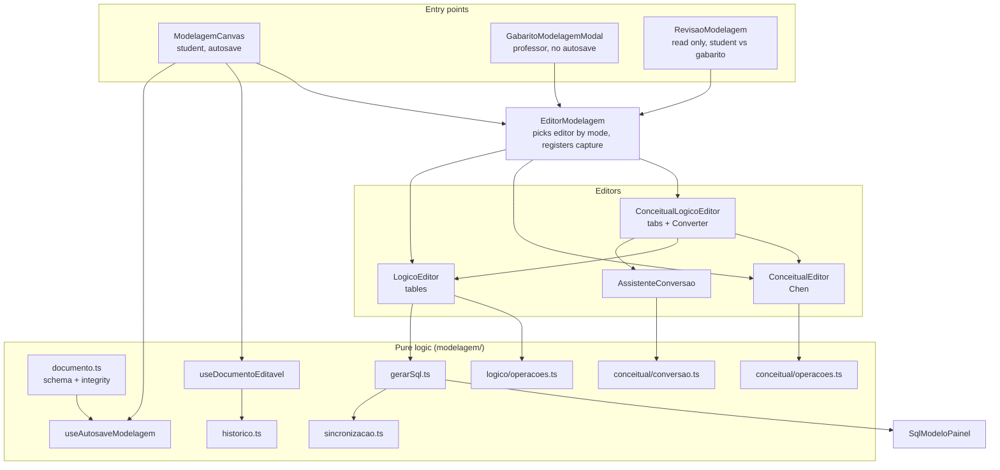
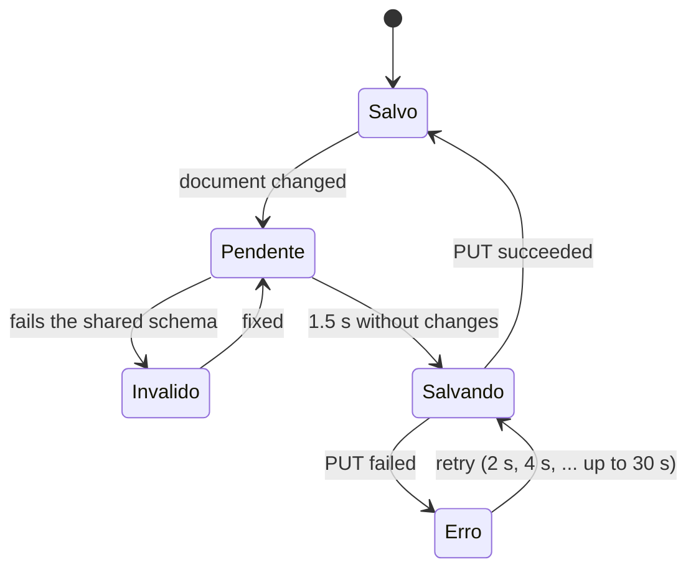

# Frontend Modelagem Module

## Overview

The modelling module is the **diagram editor** of the IDE Web. Students draw a **conceptual model** (Chen notation), convert it with an assistant into a **logical model** (relational tables), and adjust the tables. Professors use the same editors to draw the answer key and to review what a student delivered.

It lives inside the exercise feature, in two folders:

| Path | Contents |
|---|---|
| `src/features/exercicio/modelagem/` | Pure logic with no React components: the document format and validation, per-model operations, the conversion, SQL generation, undo history, autosave, MER ↔ SQL synchronisation, image capture |
| `src/features/exercicio/components/modelagem/` | The React components: editors, nodes, edges, property panels, toolbar, palette, review and gabarito screens |

The design rule is that **everything that decides something is a pure function** (`operacoes.ts`, `conversao.ts`, `gerarSql.ts`, `sincronizacao.ts`), tested without a browser, and the components only draw and dispatch.

**Related documentation:**
- [Backend Modelagem](backend_modelagem.md) - validates the same document with a mirrored Zod schema and generates the same SQL
- [Frontend Exercicios](frontend_exercicios.md) - the page that embeds the canvas and the SQL editor
- [Frontend Dica IA](frontend_dica_ia.md) - the MER hint button lives in the canvas toolbar
- [Backend Pacote](backend_pacote.md) - receives the captured images for the PDF

---

## Architecture



---

## The document (`documento.ts`)

Everything the student draws is one JSON **document, version 2**, stored in `DiagramaMer.conteudo_json` (student) or `Exercicio.mer_gabarito` (professor). It is validated by `documentoModelagemSchema`, a **mirror of `ide-web-backend/src/dtos/modelagem.schema.ts`**: both must stay equal. Optional fields are `null`, never absent, so the JSON always has the same shape.

```typescript
interface DocumentoModelagem {
  versao: 2;
  conceitual: ModeloConceitual | null;
  logico: ModeloLogico | null;
  conversao: Conversao | null;   // { assinaturaConceitual, convertidoEm, escolhas }
}
```

**Modes** (`modos.ts`), chosen per exercise **always by the professor**: `conceitual`, `logico`, `conceitual_logico`. `modoDoExercicio` falls back to `conceitual_logico` for any unknown value, because the database once had a "student chooses" mode that was later removed.

### Logical model

| Piece | Fields |
|---|---|
| `Tabela` | `id`, `posicao`, `nome`, `colunas` (at most 60) |
| `Coluna` | `nome`, `tipo` (INTEGER, BIGINT, SMALLINT, NUMERIC, REAL, VARCHAR, CHAR, TEXT, DATE, TIME, TIMESTAMP, BOOLEAN), `tamanho`, `escala`, `pk`, `notNull`, `unique`, `autoIncremento`, `padrao`, `check`, `fk: { tabelaId, colunaId } \| null` |
| `Nota` | free-text annotation with a position |

### Conceptual model

Elements are a discriminated union on `tipo`:

| `tipo` | Meaning |
|---|---|
| `entidade` | entity |
| `relacionamento` | relationship (diamond); `associativa: true` turns it into an **associative entity** that may take part in other relationships |
| `atributo` | attribute with `paiId` (entity, relationship or another attribute), `chave` (identifier), `cardinalidade` (`(1,1)`, `(0,1)`, `(0,n)`, `(1,n)`) and an optional `tipoSugerido`. An attribute with children is **composite**; `(0,n)` or `(1,n)` makes it **multivalued** |
| `especializacao` | specialisation triangle: `paiId` (the generic entity), `total`, `disjunta` |
| `nota` | annotation |

Links (`ligacoes`): `participacao` (relationship ↔ entity, with `min` 0 or 1, `max` `'1'` or `'n'`, and a `papel`) and `filho_especializacao` (specialisation → specialised entity). `visaoAtributos` is `circulos` or `lista`.

### Integrity beyond the format

`problemasDoLogico` and `problemasDoConceitual` report what the shape alone cannot guarantee: duplicate ids, a foreign key pointing to a missing column, an attribute without a valid parent, a specialisation without a generic entity, a participation without an entity or relationship, and **attribute cycles**. `documentoModelagemSchema` runs them in `superRefine`, so a document that is well-formed but inconsistent is rejected.

`LIMITES` caps sizes (63 characters per identifier, the PostgreSQL limit; 400 conceptual elements; 150 tables; 60 columns per table; 10 MB) just to reject abusive payloads.

`parseDocumento` **never breaks the screen**: null, pre-Phase-7 or malformed content loads as an empty document, with a `console.warn`. `erroDeValidacao` returns the first problem in a form ready for the user.

---

## Undo/redo and autosave

**`historico.ts`** is a generic reducer with `passado`, `presente` and `futuro`, limited to 100 steps. States are stored whole (the model is small and immutable, so copies share structure). Changes with the **same `chave`** merge into one step, so dragging a node or typing in a field is a single undo. `encerrarGesto` closes such a run.

**`useDocumentoEditavel`** wraps it for the document: `aplicarLogico`, `aplicarConceitual` and `aplicarConversao`, which replaces the whole logical model and records the conceptual signature as **one** history step. One history covers both models.

**`useAutosaveModelagem(documento, salvar)`** is what lets a student close the laptop without losing work:



- It waits for the student to stop (`ATRASO_AUTOSAVE_MS` = 1500), **validates with the same schema as the backend** (it never sends what would be refused), never fires two PUTs in parallel, and retries with growing waits (`esperaDaTentativa`).
- With unsaved changes it registers `beforeunload`, and when the component unmounts (for example "Voltar à turma") it sends one last save without waiting.
- `IndicadorSalvamento` shows the state: "Salvo às HH:MM", "Alterações não salvas…", "Salvando…", "Não salvo — tentando de novo", or the validation message.

---

## The conceptual editor

`ConceitualEditor` (React Flow, `@xyflow/react`) draws the Chen notation:

| Element | Shape |
|---|---|
| Entity | rectangle (`EntidadeNode`) |
| Relationship | diamond drawn in **SVG with `stroke`**; never `clip-path` on an element with a border, which only clips the original box and draws no new outline |
| Associative entity | diamond inside a rectangle |
| Attribute | circle (`AtributoNode`); double outline = multivalued, children = composite; invisible handles only so `LinhaEdge` has endpoints |
| Specialisation | triangle labelled `(t\|p, d\|s)`, linked to the generic entity and to the specialised ones |
| Participation | `(mín,máx)` label on `ParticipacaoEdge`, with growing curvature so a **self-relationship** separates its two lines |

The attribute view can be toggled on the toolbar between **circles** and a **list** (`visaoAtributos`). `PainelPropriedadesConceitual` (an overlaid panel) edits the selected element.

Shared behaviour of both editors (`estilos.ts` centralises shapes, outlines, handles and line strokes so the two levels look like one tool):

| Feature | Detail |
|---|---|
| Palette | click or drag to add (`Paleta`); attributes and specialisations need a parent and must be dropped on top of another element |
| Shortcuts | `Delete`/`Backspace` remove, `Ctrl+Z` undo, `Ctrl+Shift+Z` or `Ctrl+Y` redo, `Ctrl+D` duplicate, `Esc` clear selection. They only work with focus **inside the editor** and never inside a text field, so they do not fight Monaco's own `Ctrl+Z` |
| Canvas | 16 px snap grid, minimap, `fitView` until the user interacts |
| Read-only | drag and connect are off, handles become invisible |
| Full screen | `TelaCheia` expands the canvas; `Esc` returns. The normal size stays the default |

Pure operations live in `conceitual/operacoes.ts` (`adicionarEntidade`, `adicionarAtributo`, `criarParticipacao`, `definirAssociativa`, `removerElemento`, `duplicarEntidade`, ...). Operations that can be refused return `{ ok: true, conceitual } | { ok: false, erro }`.

## The logical editor

`LogicoEditor` shows `TabelaNode` boxes and `FkEdge` lines. Nodes are **derived from the document** with their `measured` size kept separately. A foreign key is created by **dragging from one table to another** (`ligarTabelas`): it adds a column per part of the referenced primary key, named `<table>_<pk>`, with the same type, and it refuses when the referenced table has no primary key. A self-relationship gets an optional column, because the root has no parent. Line ends are placed on table borders: the sides when two tables sit side by side, top and bottom when stacked (`geometria.ts`), so a line never crosses a table. `PainelPropriedadesLogico` edits columns and constraints.

---

## Conceptual → logical conversion (`conceitual/conversao.ts`)

`converter(conceitual, escolhas)` is a **pure function that never throws**: what cannot be converted becomes a warning (`avisos`). It returns `{ logico, avisos, pendencias, origem }`.

**Cardinality convention (Heuser).** The `(mín,máx)` of a participation says how many occurrences *of that entity* associate with one occurrence of the other end. So the participation of X is total (mandatory) when the `mín` of the **other** end is 1.

| Construct | Result |
|---|---|
| Entity | one table, reusing the element's id |
| 1:N | foreign key on the N side |
| N:N and n-ary | own table with a key per participant |
| Associative entity | its own table, created before other relationships so they can reference it |
| Composite attribute | flattened into columns `parent_child` |
| Multivalued attribute | table `<owner>_<attribute>` with the owner's key plus the value |
| 1:1 and specialisation | **asked to the student** |

**The two open decisions** are what `identificarPendencias` returns as `PendenciaConversao` (with the options and a plain explanation of each):

| Case | Options |
|---|---|
| 1:1 | `fk_lado_total` (FK on the mandatory side, the default), `fundir` (merge into one table, only when both participations are total), `tabela_propria` |
| Specialisation | `tabela_por_entidade` (default), `tabela_unica` (with a `tipo` column and optional columns), `so_especializadas` (only when the specialisation is total) |

An invalid choice falls back to the default and adds a warning.

**Order of the passes** matters: entities → specialisations (they define the children's primary key) → associatives (they become referenceable tables) → merges → other relationships → multivalued (they need the owner's final key) → notes.

`MapaOrigem` (`tabelaPorElemento`, `colunaPorAtributo`) records where each conceptual element ended up, used for synchronisation.

**`assinaturaConceitual`** is a hash of the conceptual model **without positions or notes**. It changes only when something that affects the conversion changes.

### `AssistenteConversao` and `ConceitualLogicoEditor`

The assistant is a modal that shows one radio group per pending decision (with the explanation of each option), a **live preview** ("N tabelas") computed with `converter`, and the warnings, before anything is written. If a logical model already exists it warns that it will be replaced.

`ConceitualLogicoEditor` gives the student two tabs, **1. Conceitual** and **2. Lógico**. The second opens only after converting or when tables already exist ("Converta o modelo conceitual primeiro"), and a student who already has tables opens on the logical tab, otherwise the first screen would be an empty conceptual model and the work would look lost. The button reads "Converter para lógico →" and later "Converter de novo →".

> **After converting, the two models are independent.** If the conceptual model changes, the tab bar shows "⚠ O modelo conceitual mudou depois da última conversão", by comparing the stored signature with the current one. "Converter de novo" redoes everything.

---

## SQL generation (`gerarSql.ts`)

`gerarSql(logico)` returns `{ sql, avisos, tabelas }`, a **pure function mirrored in the backend** (same test cases). The SQL is only **displayed and sent to the AI**; it is never executed.

- Tables are ordered by dependency; a reference to a table not yet created (a cycle) becomes an `ALTER TABLE ... ADD CONSTRAINT` at the end.
- Foreign key columns are grouped, and the constraint is named `fk_<table>_<column>`, cut to PostgreSQL's 63 characters.
- Warnings: a foreign key whose types differ from the referenced column, and a key that does not reference a whole primary key or a `UNIQUE` column.
- `identificadores.ts` normalises names as PostgreSQL sees them (lower case, no accents, `_` for spaces, a leading `_` before a digit) and quotes reserved words.
- Each generated table records `linhaInicio` and `linhaFim`, which the panel uses to highlight a block.

`SqlModeloPainel` ("SQL do modelo — gerado automaticamente, não é executado") shows it live with a copy button, a warning count and the highlighted block of the selected table. It is hidden in the purely conceptual mode, which has no logical model.

## MER ↔ SQL synchronisation (`sincronizacao.ts`)

A selection on one side is highlighted on the other, always expressed in **normalised names**, the same ones as the generated SQL.

- `identificadorNaPosicao` finds the identifier under the SQL cursor. `mascararStringsEComentarios` first blanks strings and comments **keeping the length**, so offsets stay valid and a name inside a string is never taken for a table.
- `extrairAliases` reads `FROM cliente c` and `JOIN pedido AS p`.
- `resolverSelecao` turns the identifier into a selection that exists in the model: a table, a column, a column unique to one table, or an ambiguous column shared by several.
- `ocorrenciasNoSql` returns the ranges to decorate when a table or column is selected on the canvas, including its aliases.

---

## PDF capture (`captura.ts`)

`EditorModelagem` registers a `capturar()` function in the `capturaRef` given by the exercise page. `FinalizarPacoteButton` calls it, and it uses `html-to-image` to produce PNGs (`ImagemModelo { rotulo, pngBase64 }`). In `conceitual_logico` mode it **forces each tab in turn** (`abaForcada`), waits 250 ms so React Flow remounts and draws its lines, captures, and finally restores the tab. This produces up to two images, "Modelo conceitual" and "Modelo lógico".

---

## Professor screens

| Component | Behaviour |
|---|---|
| `GabaritoModelagemModal` | The professor chooses the level and draws the gabarito in the **same editor** as the student. There is no autosave: it only counts when they click "Usar gabarito" |
| `RevisaoModelagem` | Read-only viewer with two tabs, "Modelo do aluno" and "Gabarito". In reading, the level comes from **what the document has**, since a gabarito may carry both models in a one-level exercise. It says explicitly when the student delivered nothing, so a blank canvas is never ambiguous, and it warns when the load failed so the professor does not grade without seeing the model. Nothing here writes to the student's diagram |

---

## Notes for maintainers

- Keep `documento.ts`, `gerarSql.ts` and `identificadores.ts` **identical to their backend counterparts**, with the same test cases.
- Add new behaviour as a pure function first, then wire it into the component.
- Browser end-to-end tests run with `npm run e2e` (Playwright and the system Chrome, with a mocked API, `tests/e2e/*.e2e.ts`).
- Monaco sits inside `.nokey`, otherwise React Flow swallows the Space key in Chrome.
