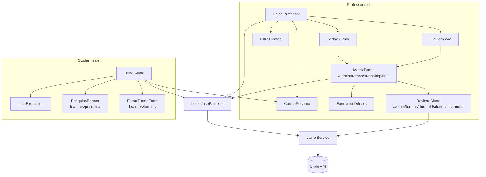
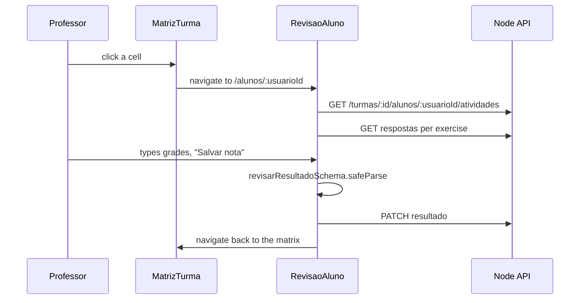

# Frontend Painel Module

## Overview

The `frontend_painel` module (`ide-web-front/src/features/painel/`) draws the two **dashboards** and the professor's **by-student review** screen. It is the client for [Backend Painel](backend_painel.md): the backend derives one state per `aluno × exercício` cell, and this module turns that data into cards, a matrix, a difficulty table and a grading form.

The `/dashboard` route is only a **role router**: a student sees `PainelAluno`, a professor or researcher sees `PainelProfessor`. Each role then reaches its own area through shortcut cards.

**Related documentation:**
- [Backend Painel](backend_painel.md) - the four endpoints and the cell-state rule
- [Backend Resultado](backend_resultado.md) - the grading endpoint used by the review form
- [Frontend Turmas](frontend_turmas.md) - `EntrarTurmaForm` is embedded in the student dashboard
- [Frontend Exercicios](frontend_exercicios.md) - `exercicioService` and the grade schema
- [Frontend Pesquisa](frontend_pesquisa.md) - the research banner shown first on the student dashboard

---

## Architecture

`index.ts` exports `PainelProfessor`, `PainelAluno`, `MatrizTurma`, `RevisaoAluno`, `painelService`, all types and the filter helpers.

---

## Data layer

`painelService` maps one method to one endpoint.

| Method | Request |
|---|---|
| `doProfessor()` | `GET /painel/professor` |
| `doAluno()` | `GET /painel/aluno` |
| `daTurma(turmaId)` | `GET /turmas/:turmaId/painel` |
| `atividadesDoAluno(turmaId, usuarioId)` | `GET /turmas/:turmaId/alunos/:usuarioId/atividades` |
| `liberarEnvio(exercicioId, usuarioId)` | `POST /exercicios/:id/alunos/:usuarioId/liberar-envio` |

`hooks/usePainel.ts` wraps the first three in TanStack Query with `staleTime` of 30 s, because dashboard data ages slowly and refetching on every window focus would be wasteful. The keys are `PAINEL_PROFESSOR_QUERY_KEY = ['painel','professor']`, `PAINEL_ALUNO_QUERY_KEY = ['painel','aluno']` and `['painel','turma', turmaId]`. `usePainelTurma` is `enabled` only when the route has a `turmaId`.

`types.ts` mirrors the backend contract: `PainelProfessor`, `PainelAluno`, `PainelTurma`, `CelulaMatriz`, `DificuldadeExercicio`, `AtividadeDoAluno` and the `EstadoCelula` union with its Portuguese labels:

| State | Label (`ROTULO_ESTADO`) |
|---|---|
| `nao_iniciou` | Não iniciou |
| `em_andamento` | Em andamento |
| `entregue` | Entregue |
| `correto` | Correto |
| `aguardando_revisao` | Aguardando revisão |

---

## Professor dashboard: `PainelProfessor`

Layout, top to bottom:

1. **Empty state.** With no classes it offers "Criar minha primeira turma", a link to `/admin/turmas`.
2. **Summary.** Four `CartaoResumo` cards: active classes, enrolled students, published exercises, and "Aguardando sua correção", which is highlighted (`destaque`).
3. **"Esperando correção"** (`FilaCorrecao`): one row per class that has `aguardandoRevisao > 0`, with a "Corrigir" link to the class matrix. Only work a human must do appears here (modelling and essay). Automatic SQL grading and public exercises never enter the queue.
4. **"Minhas turmas"**: a filter (`FiltroTurmas`) and one `CartaoTurma` per class, with a progress bar (`role="progressbar"` with `aria-valuenow` and the label "Entregas em <turma>"), a "closed" badge and a link to the matrix. A "Gerenciar turmas" link goes to `/admin/turmas`: the list is where you *act* (create, close), the dashboard is where you *see*.

**Filtering.** `filtroTurmas.ts` defines `FiltroTurmasValor { turmaId, turno, sala }` and `aplicarFiltro`. An empty field restricts nothing and the three filters combine. `FiltroTurmas` builds its options **from the classes that exist**, so it never offers a room nobody uses, and hides the shift or room selector entirely when no class has one.

## Class matrix: `MatrizTurma`

`/admin/turmas/:turmaId/painel` shows a real `<table>` with students as rows and exercises as columns.

| Detail | Why |
|---|---|
| Every state has a **symbol and a text label**, not only a colour | Colour alone excludes colour-blind users. Symbols: `–` not started, `◐` in progress, `✉` delivered, `✓` correct, `⚑` awaiting review |
| Each cell is a link to the student's review screen | One click from the overview to the correction |
| The cell shows the final grade when there is one (`8,5` format) | Grade visible without opening the student |
| `⚠` marks a last submission that did not execute | In an exam this burned the single submission; the professor decides whether to release another |
| A missing cell renders `·` with "Não faz parte da prova deste aluno" | The exercise belongs to another exam variant, so the student never saw it |
| `<caption class="sr-only">`, `scope` on headers, an `sr-only` sentence per cell | Screen-reader support: "<student> em <exercise>: <state>, nota X" |

Below the grid, **`ExerciciosDificeis`** ("Onde a turma trava") sorts exercises from hardest to easiest by hit rate. An exercise nobody attempted goes to the end, because "sem dados" is not the same as "0% de acerto". Numbers are computed only among students who tried, and averages of integer counts avoid a misleading `1.0`.

## By-student review: `RevisaoAluno`

`/admin/turmas/:turmaId/alunos/:usuarioId` is **one screen with every activity of one student**, so the professor corrects the person, not an isolated question. It replaced the per-exercise flow as the main path (the old `RevisaoTurmaPage` and `RevisaoAlunoPage` remain reachable under `/admin/turmas/:turmaId/exercicios/...`).

For each activity a `CartaoAtividade` shows:

- the title, the state, the attempt count and the hint count
- an alert **"Liberar novo envio"** when the last submission did not execute: in an exam it consumed the single submission, and the button calls `painelService.liberarEnvio`
- the student's latest SQL submission with a "correta / incorreta pelo gabarito" tag, and the essay answer, both loaded through `exercicioService.respostasDoAluno`
- a link to the student's model when the exercise has a modelling part
- a form limited to the parts the exercise really has: a "SQL correto" checkbox, `Modelagem`, `Dissertativa` and `Nota final`, each **0,0 to 10,0** (`NOTA_MAXIMA`)

Validation uses `revisarResultadoSchema`, imported with a concrete path from `~features/exercicio/...` so the heavy exercise page (Monaco) is not pulled in. Saving calls `exercicioService.revisarResultado`, invalidates the student's query and returns to the class matrix.

---

## Student dashboard: `PainelAluno`

Sections, in order:

1. **`PesquisaBanner`** is the **first element** and its behaviour is untouched. It is the trigger that leads a participant to the consent form, so redesigning the screen must not disturb that path. It is imported by concrete path, which also keeps its removal after the data collection to a single line.
2. **Summary** cards: classes, "Falta fazer" (highlighted), delivered, automatic hits.
3. **"O que falta fazer"**: pending exercises across all classes in one list, with the class name shown.
4. **Classes grouped by subject**, each with its semester, a "Encerrada" badge and, when closed, the note that the student still sees everything delivered but can no longer submit.
5. **"O que você já entregou"**: the history.
6. **"Seu progresso"**: for each solved exercise, the attempt on which it was first solved.
7. A shortcut to **"Estudar sozinho"** (`/estudar`) and the **"Entrar em uma turma"** form.

> **No social comparison.** The student dashboard shows the student against themselves only: no class average, no ranking, no classmate names. The backend does not even send that data.

`ListaExercicios` renders each exercise as a link to `/exercicios/:id` with its level (Iniciante or Intermediário) and a state pill, plus a "Ver resultado" link to `/exercicios/:id/resultado` once the professor released the gabarito.

---

## Notes for maintainers

- After a mutation that changes dashboard data (enrolling, grading, releasing a submission) invalidate the matching `['painel', ...]` key, as `EntrarTurmaForm` and `RevisaoAluno` do.
- A new cell state needs a label in `ROTULO_ESTADO`, a symbol and a style in `MatrizTurma`, and the backend `ESTADOS_CELULA`.
- Keep imports from other features concrete when they would otherwise drag in Monaco (`~features/exercicio/...`, `~features/pesquisa/components/...`).
