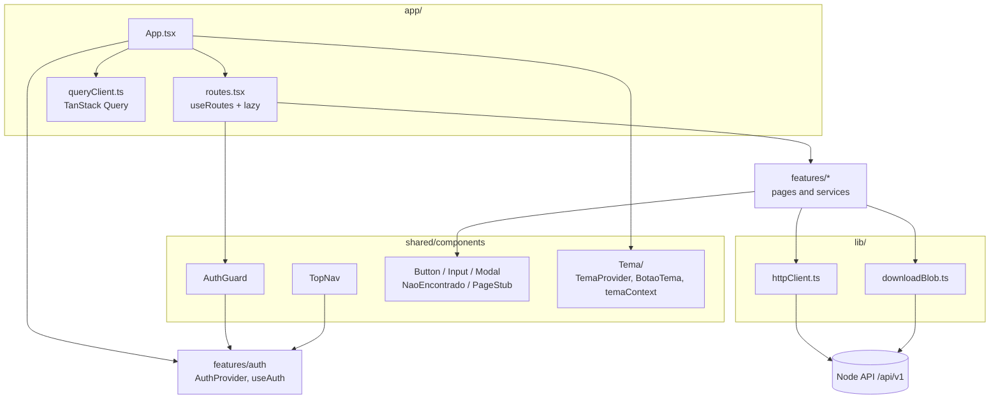
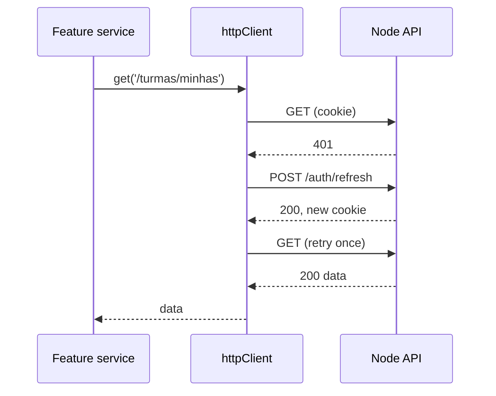
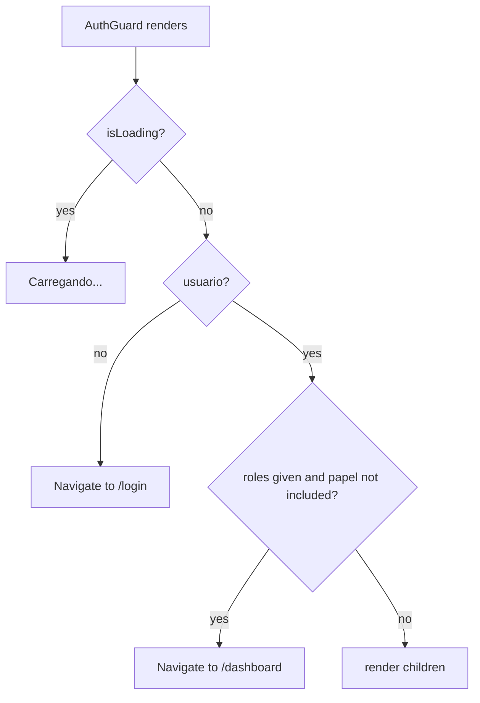

# Frontend Shared Module

## Overview

The `frontend_shared` module is the **foundation of the React frontend** (`ide-web-front/`). It holds everything that is not owned by a single feature: the HTTP client that talks to the Node API, the route table and role guard, the theme system, and a small set of accessible UI primitives (`Button`, `Input`, `Modal`, `TopNav`, `NaoEncontrado`, `PageStub`).

Feature folders (`features/<domain>/`) depend on this module, and this module depends on features only where it must, for example the guard reads the logged-in user from `features/auth`.

**Locations**

| Path | Contents |
|---|---|
| `src/lib/` | `httpClient.ts`, `downloadBlob.ts` |
| `src/shared/components/` | `AuthGuard`, `Button`, `Input`, `Modal`, `NaoEncontrado`, `PageStub`, `Tema/`, `TopNav` |
| `src/shared/hooks/` | `useDebouncedValue` |
| `src/app/` | `App.tsx`, `routes.tsx`, `queryClient.ts` |
| `src/types/` | `PaginatedResult`, `Nullable` |
| `src/vite-env.d.ts` | typed `import.meta.env` (`VITE_API_URL`, `VITE_RESEARCH_API_URL`) |

**Related documentation:**
- [Frontend Auth](frontend_auth.md) - supplies `useAuth` and the `Papel` type used by the guard and the navigation
- [Frontend Application](Frontend_Application.md) - the feature modules that consume these primitives
- [Backend Auth](backend_auth.md) - the `/auth/refresh` endpoint that `httpClient` calls on a 401

---

## Architecture



`App.tsx` nests the providers in this order: `QueryClientProvider` → `BrowserRouter` → `AuthProvider` → `TemaProvider`, then renders the floating `BotaoTema` and `AppRoutes`.

---

## HTTP client (`lib/httpClient.ts`)

`httpClient` wraps `fetch` for every call to the Node backend. The base URL is `VITE_API_URL`, defaulting to `http://localhost:3000/api/v1`, and every request sends `credentials: 'include'` so the `httpOnly` cookie travels.

```typescript
export class HttpError extends Error {
  readonly status: number;
  readonly code: string;
}

export const httpClient = {
  get:    <T>(path: string) => Promise<T>,
  post:   <T>(path: string, body?: unknown) => Promise<T>,
  put:    <T>(path: string, body: unknown) => Promise<T>,
  patch:  <T>(path: string, body: unknown) => Promise<T>,
  delete: <T>(path: string) => Promise<T>,
};
```

**Response envelope.** The API answers `{ data?, error?: { code, message } }`. On success the client returns `body.data`; on failure it throws an `HttpError` carrying the status, the error `code` and the (Portuguese) message that the backend wrote for the user. A `204` returns `undefined`.

**Silent session renewal.** Since the server-side session (Phase 10) the access token lives 15 minutes, so a 401 must trigger a refresh:



- `renovacaoEmCurso` is a single shared promise: if several requests hit 401 together, all wait for the same refresh instead of firing many.
- `ROTAS_SEM_RENOVACAO` (`/auth/login`, `/auth/registrar`, `/auth/refresh`, `/auth/logout`) never triggers a refresh. A 401 there is a legitimate answer (wrong password, already logged out), and refreshing would loop.
- The request is retried **once**.

**`lib/downloadBlob.ts`** exists because `httpClient` always expects the JSON envelope. `postForBlob(path, body)` does a raw `fetch` for binary answers such as the exercise PDF package and still converts failures into `HttpError`. `triggerDownload(blob, filename)` creates a temporary object URL, clicks an `<a download>` and revokes the URL.

> The research service is **not** reached through this client. `features/pesquisa` has its own `researchHttpClient` (see [Frontend Pesquisa](frontend_pesquisa.md)).

---

## Routing and access control

`app/routes.tsx` declares the whole route table with `useRoutes`. Every page is loaded with `React.lazy` inside one `Suspense` boundary, importing from each feature's `index.ts` so the heavy ones (the Monaco editor in `ExercicioPage`) are only downloaded when visited.

`AuthGuard` covers authentication **and** role:



| Route | Guard | Page |
|---|---|---|
| `/`, `/login`, `/registro`, `/politica-de-privacidade` | none | redirect, login, registration, privacy policy |
| `/dashboard` | any logged-in user | role router with the dashboards |
| `/estudar` | `aluno` | free study |
| `/exercicios/:id`, `/exercicios/:id/resultado` | any logged-in user | exercise IDE and result |
| `/tcle`, `/pesquisa/sessao`, `/pesquisa/sus`, `/pesquisa/rtlx` | `aluno` | research flow |
| `/admin/turmas` | `professor`, `pesquisador` | class management |
| `/admin/pesquisa` | `pesquisador` | research control panel |
| `/admin/turmas/:turmaId/painel` | `professor`, `pesquisador` | student × exercise matrix |
| `/admin/turmas/:turmaId/alunos/:usuarioId` | `professor`, `pesquisador` | review by student |
| `/admin/turmas/:turmaId/exercicios/:exercicioId/revisar[/:usuarioId]` | `professor`, `pesquisador` | review by exercise |
| `*` | none | `NaoEncontrado` |

The catch-all route matters: without it an unknown URL rendered a blank screen. The frontend guard is a convenience for navigation. **The real authorisation is always enforced by the backend.**

`TopNav` shows one link per root-level screen the current role can open (`aluno`: Painel, Estudar sozinho; `professor`: Painel, Turmas; `pesquisador`: Painel, Turmas, Pesquisa), the user's initial and name, and a logout button. It reserves right padding (`pr-14`) for the fixed theme button.

---

## Theme system (`shared/components/Tema/`)

| Piece | Role |
|---|---|
| `temaContext.ts` | `Tema = 'claro' \| 'escuro'`, `TemaContext`, and the `useTema()` hook, which throws outside a provider |
| `TemaProvider.tsx` | Picks the initial theme from `localStorage['tema']`, falling back to `prefers-color-scheme`. Toggles the `dark` class on `<html>` and persists the choice |
| `BotaoTema.tsx` | Floating toggle button, mounted once in `App.tsx` |

The storage key is the same one used by an inline script in `index.html`, which sets the class before first paint and avoids a flash of the wrong theme.

---

## UI primitives

| Component | Notes |
|---|---|
| `Button` | Variants `primary`, `danger`, `ghost`. With `isLoading` it becomes disabled, sets `aria-busy` and shows `loadingLabel` (default "Carregando…"). `loadingLabel` exists for cases where a generic text does not say what is happening |
| `Input` | Text input with a **required** `label` (linked through `useId`), `aria-invalid` and `aria-describedby` wired to an `errorMessage` rendered with `role="alert"`. For `type="password"` it adds a show/hide toggle button |
| `Modal` | `role="dialog"`, `aria-modal`, `aria-labelledby`. Sizes `md` and `xl` (95vw). Closes with the backdrop, the ✕ button and Esc. Pass `fecharComEsc={false}` when the content uses Esc itself (the modelling editor), so no work is lost |
| `NaoEncontrado` | 404 page. Its button goes to `/dashboard` when logged in and to `/login` otherwise |
| `PageStub` | Placeholder (`title`, `description`, optional children) for routes whose domain did not exist in the backend yet; a leftover of Phase 1 |
| `useDebouncedValue(value, delayMs = 400)` | Debounce hook, used to delay dependent work while typing |

Styling uses Tailwind utility classes with semantic tokens (`primary`, `danger`, `neutral`, `surface`) so light and dark themes share the same markup.

## Data fetching defaults

`queryClient.ts` creates the TanStack Query client with `staleTime` of 60 seconds and `retry: 1`. Features declare their own query keys (for example `features/turmas/hooks/queryKeys.ts`).

## Shared types

```typescript
interface PaginatedResult<TItem> { items: TItem[]; total: number; page: number; pageSize: number }
type Nullable<TValue> = TValue | null
```

## Guidelines for contributors

- Import from another feature **only through its `index.ts`**. The exception is a light service or hook when the feature also exports a heavy page: import the concrete file (`~features/exercicio/services/exercicioService`) so the heavy page (Monaco) is not pulled in for free. This broke jsdom tests before.
- Keep UI primitives free of domain logic: a shared component must not know what an exercise is.
- Do not use `httpClient` for binary answers or for the research service.
