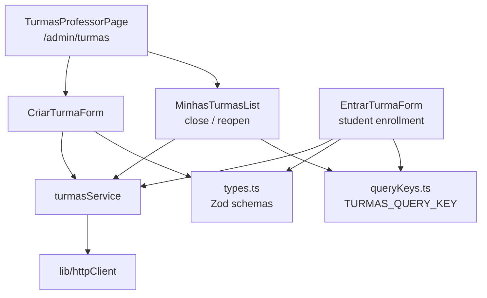
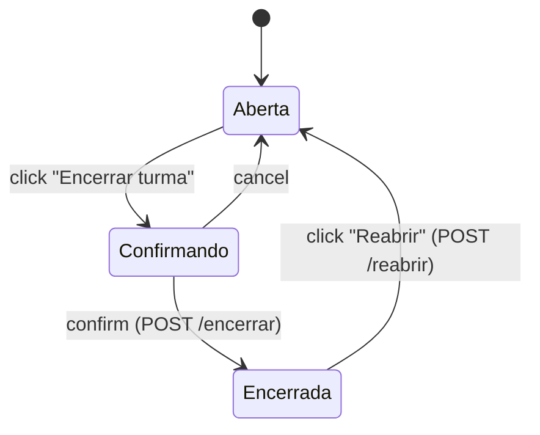

# Frontend Turmas Module

## Overview

The `frontend_turmas` module (`ide-web-front/src/features/turmas/`) is the client side of class management. A **professor** creates classes, shares the class code, and closes or reopens a class. A **student** enrolls by typing that code once.

The screens are small; the value of the module is the contract it keeps with the backend: the class code is an *enrollment token*, not a credential, and a closed class is frozen in read-only mode.

**Related documentation:**
- [Backend Turmas](backend_turmas.md) - the endpoints this module calls
- [Frontend Auth](frontend_auth.md) - the registration form enrolls through `turmasService`
- [Frontend Painel](frontend_painel.md) - the student dashboard reloads after an enrollment
- [Frontend Shared](frontend_shared.md) - `Button`, `Input`, `Modal`

---

## Architecture



`index.ts` exports `TurmasProfessorPage`, `EntrarTurmaForm`, `turmasService` and the type `Turma`.

---

## Types and validation (`types.ts`)

```typescript
export const TURNOS = ['manha', 'tarde', 'noite'] as const;

export interface Turma {
  id: string; nome: string; disciplina: string; semestre: string;
  turno: Turno | null; sala: string | null;
  professorId: string; codigo: string;
  encerradaEm: string | null; criadoEm: string;
}
export interface Aluno { id: string; nome: string; email: string | null; matricula: string | null }
```

| Schema | Rules |
|---|---|
| `criarTurmaSchema` | `nome` and `semestre` required; `disciplina` optional; `turno` and `sala` optional and only feed the dashboard filter (Phase 10) |
| `matricularSchema` | `codigo` trimmed, required, **converted to upper case** so "abc123" works |

`ROTULO_TURNO` maps the enum values to the labels `Manhã`, `Tarde` and `Noite`.

## Service (`turmasService`)

| Method | Request |
|---|---|
| `criar(input)` | `POST /turmas` |
| `minhas()` | `GET /turmas/minhas` |
| `listarAlunos(turmaId)` | `GET /turmas/:id/alunos` |
| `matricular(codigo)` | `POST /turmas/:codigo/matricular` |
| `encerrar(turmaId)` / `reabrir(turmaId)` | `POST /turmas/:id/encerrar` and `/reabrir` |

`TURMAS_QUERY_KEY = ['turmas', 'minhas']` is the shared cache key. Mutations invalidate it so lists refresh by themselves.

---

## Components

**`TurmasProfessorPage`** stacks two sections, "Nova turma" (`CriarTurmaForm`) and "Minhas turmas" (`MinhasTurmasList`), with a link back to the dashboard.

**`CriarTurmaForm`** validates with `criarTurmaSchema` and creates the class. The backend generates the code.

**`MinhasTurmasList`** lists the classes with their code, and inside each class card it embeds `ProvasPainel` and `ExerciciosPainel` from [Frontend Exercicios](frontend_exercicios.md), so the professor manages exams and exercises right where the class is. It also drives the closing flow:



Closing always asks for confirmation in a `Modal` explaining the effect: students keep seeing the class and what they delivered, stop submitting, and the code stops enrolling new people. A closed class shows that same explanation inline and offers **Reabrir**, because closing by mistake is reversible.

**`EntrarTurmaForm`** validates the code with `matricularSchema`, calls `turmasService.matricular` and, on success, invalidates both `TURMAS_QUERY_KEY` and the student dashboard query (`PAINEL_ALUNO_QUERY_KEY`) so the new class appears immediately. A student stays in the class until the professor closes it, and may be in several classes at once.

---

## Behavioural rules worth knowing

- The code is used **once**, after login. Nothing here stores it or treats it as a password.
- The frontend never decides whether a class accepts submissions. It shows the state (`encerradaEm`), and the backend enforces it.
- The `pesquisador` sees every class in `/admin/turmas` because the researcher must pick the class in which to start the research.
