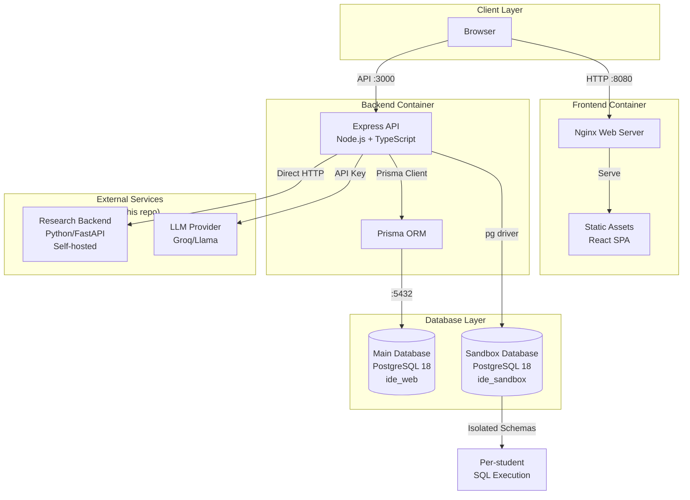
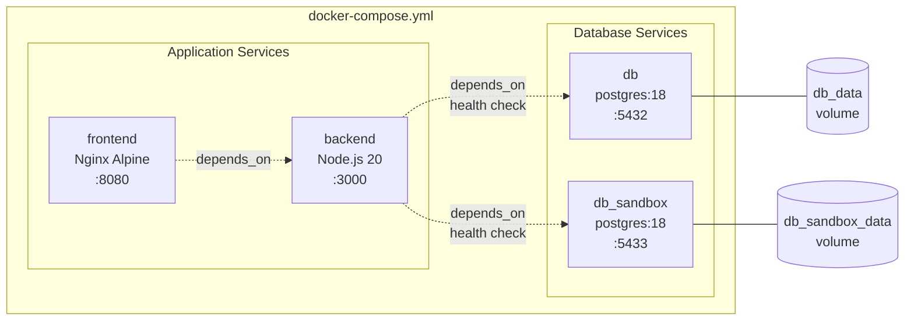
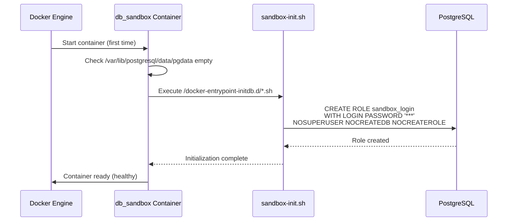
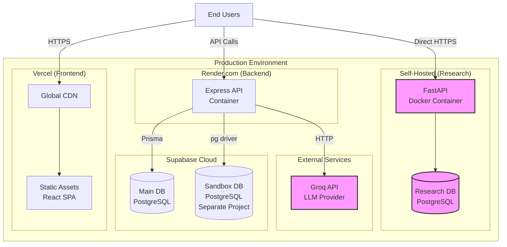
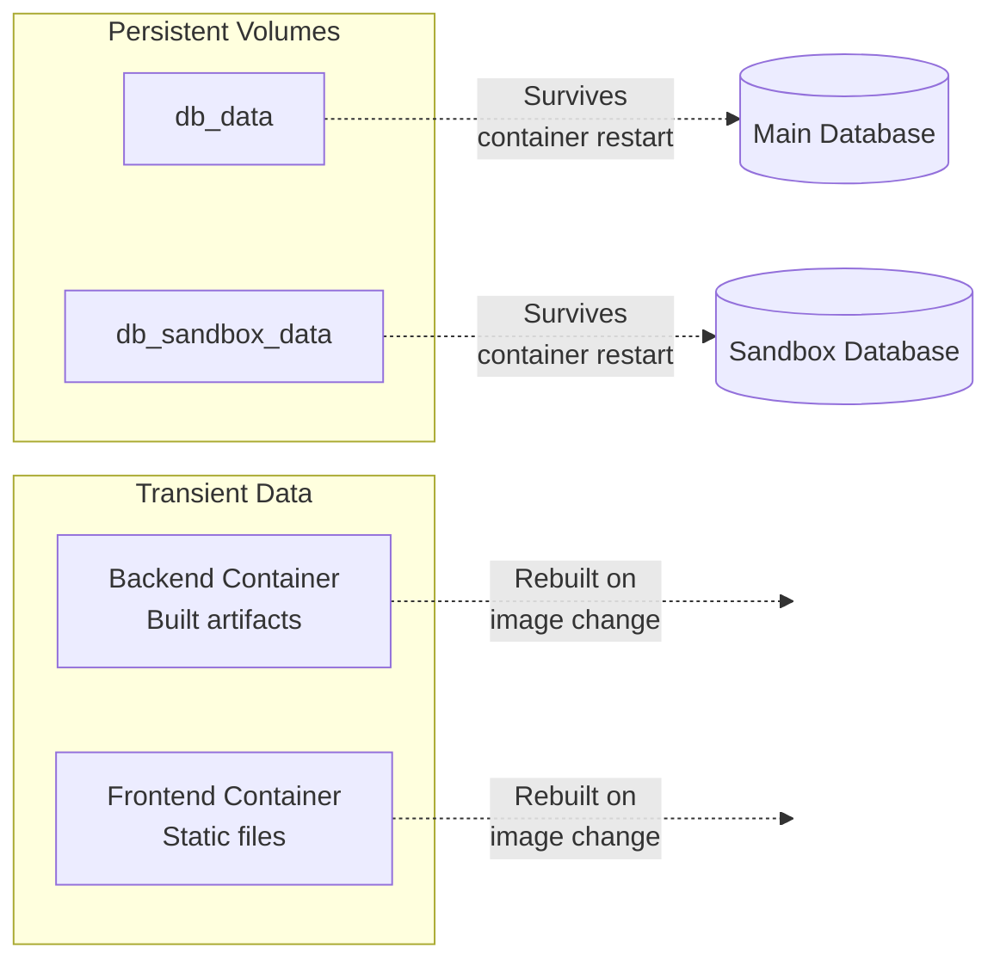

# Infrastructure & Build Pipeline

The infrastructure module provides the complete containerized development and deployment environment for IDE Web, including Docker orchestration, multi-stage builds, database provisioning, and web server configuration.

---

## Architecture Overview

The IDE Web project uses a containerized microservices architecture with separate concerns for application data, SQL sandbox execution, frontend delivery, and backend services.



### Key Architectural Decisions

1. **Database Separation**: Main application data (users, exercises, submissions) is isolated from student SQL sandbox execution to prevent privilege escalation and resource contention.

2. **Multi-stage Builds**: Both backend and frontend use Docker multi-stage builds to minimize production image size and separate build-time from runtime dependencies.

3. **Health Checks**: Database containers implement health checks to ensure dependent services wait for database readiness before starting.

4. **External Research Backend**: The Python/FastAPI research backend for TCC data collection is self-hosted separately and not included in this repository (see [backend_pesquisa](backend_pesquisa.md) for details).

---

## Container Architecture



### Service Definitions

#### db (Main Database)
- **Image**: `postgres:18`
- **Database**: `ide_web`
- **User**: `ide_app`
- **Port**: `5432:5432`
- **Volume**: `db_data:/var/lib/postgresql/data`
- **Purpose**: Stores all application data through Prisma ORM

**Health Check**:
```bash
pg_isready -U ide_app -d ide_web
# Interval: 5s, Timeout: 5s, Retries: 10
```

#### db_sandbox (SQL Sandbox Database)
- **Image**: `postgres:18`
- **Database**: `ide_sandbox`
- **User**: `ide_sandbox_admin`
- **Port**: `5433:5432`
- **Volume**: `db_sandbox_data:/var/lib/postgresql/data`
- **Init Script**: `sandbox-init.sh` (creates `sandbox_login` role)
- **Purpose**: Isolated execution environment for student SQL exercises

**Special Configuration**:
- `PGDATA=/var/lib/postgresql/data/pgdata` - Avoids false initialization failures in Podman rootless environments where volumes may contain `lost+found`
- Initialization script mounted read-only with SELinux `:z` flag

**Health Check**:
```bash
pg_isready -U ide_sandbox_admin -d ide_sandbox
# Interval: 5s, Timeout: 5s, Retries: 10
```

#### backend (API Server)
- **Build Context**: `./ide-web-backend`
- **Runtime**: Node.js 20 Alpine
- **Port**: `3000:3000`
- **Dependencies**: Waits for both databases to be healthy
- **Purpose**: REST API serving all application logic

See [backend_build_config](backend_build_config.md) for TypeScript configuration details.

#### frontend (Web Server)
- **Build Context**: `./ide-web-front`
- **Runtime**: Nginx Alpine
- **Port**: `8080:80`
- **Dependencies**: Waits for backend service
- **Purpose**: Serves React SPA and static assets

See [frontend_build_config](frontend_build_config.md) for Vite configuration and build details.

---

## Build Pipeline

```mermaid
graph TB
    subgraph "Backend Build (ide-web-backend/Dockerfile)"
        B1[Stage: build<br/>node:20-alpine]
        B2[npm ci<br/>Install all deps]
        B3[prisma generate<br/>Generate client]
        B4[tsc<br/>Compile TypeScript]
        B5[Stage: runtime<br/>node:20-alpine]
        B6[npm ci --omit=dev<br/>Production deps only]
        B7[Copy dist/<br/>from build stage]
        
        B1 --> B2 --> B3 --> B4 --> B5 --> B6 --> B7
    end
    
    subgraph "Frontend Build (ide-web-front/Dockerfile)"
        F1[Stage: build<br/>node:20-alpine]
        F2[npm ci<br/>Install all deps]
        F3[vite build<br/>Build React app]
        F4[Stage: runtime<br/>nginx:alpine]
        F5[Copy dist/<br/>from build stage]
        F6[Copy nginx.conf]
        
        F1 --> F2 --> F3 --> F4 --> F5 --> F6
    end
```



### Backend Build Process

**Build Stage** (`node:20-alpine`):
1. Copy `package.json` and `package-lock.json`
2. Run `npm ci` (clean install from lockfile)
3. Copy Prisma schema and run `npx prisma generate`
4. Copy TypeScript configuration and source code
5. Run `npm run build` → `tsc -p tsconfig.json`

**Runtime Stage** (`node:20-alpine`):
1. Set `NODE_ENV=production`
2. Install only production dependencies via `npm ci --omit=dev`
3. Copy compiled `dist/` directory from build stage
4. Expose port 3000
5. Start with `node dist/server.js`

**Key Dependencies**:
- `@prisma/client` + `@prisma/adapter-pg` - Database ORM with PostgreSQL adapter
- `express` - Web framework
- `jsonwebtoken` + `bcryptjs` - Authentication
- `pdfkit` - PDF generation for exercise packages
- `pg` - Direct PostgreSQL driver for sandbox execution
- `zod` - Schema validation

### Frontend Build Process

**Build Stage** (`node:20-alpine`):
1. Copy `package.json` and `package-lock.json`
2. Run `npm ci` (clean install from lockfile)
3. Copy all source files
4. Inject build-time environment variables:
   - `VITE_API_URL` (default: `http://localhost:3000/api/v1`)
   - `VITE_RESEARCH_API_URL` (default: `http://localhost:8001`)
5. Run `npm run build` → `tsc -b && vite build`

**Runtime Stage** (`nginx:alpine`):
1. Copy built static files from `dist/` to `/usr/share/nginx/html`
2. Copy custom `nginx.conf` to `/etc/nginx/conf.d/default.conf`
3. Expose port 80

**Key Dependencies**:
- `react` + `react-dom` - UI framework
- `vite` - Build tool and dev server
- `@monaco-editor/react` - SQL editor component
- `@xyflow/react` - Entity-relationship diagram editor
- `@tanstack/react-query` - Server state management
- `tailwindcss` - Utility-first CSS framework

---

## Database Initialization

### Sandbox Database Setup

The sandbox database requires special initialization to support secure per-student SQL execution. This is handled by `ide-web-backend/scripts/sandbox-init.sh`, which runs once during the first container startup.



**sandbox-init.sh Purpose**:
- Creates the `sandbox_login` role used by the execution connection
- This role has NO privileges by default (not even schema access)
- Each request performs `SET ROLE exec_<usuario_id>` to assume the student's identity
- Per-student execution roles (`exec_<usuario_id>`) are created on-demand by `SandboxProvisioningRepository`
- The provisioning role (`POSTGRES_USER` of this container) must have `CREATEROLE` privilege in production

**Why Separate Provisioning and Execution Roles?**
- Provisioning role (`ide_sandbox_admin`) creates schemas and grants permissions
- Execution role (`sandbox_login`) only authenticates and assumes student identities via `SET ROLE`
- This separation enforces principle of least privilege for runtime execution

See [backend_sandbox_sql](backend_sandbox_sql.md) for detailed sandbox security architecture.

---

## Nginx Configuration

The frontend container uses a custom Nginx configuration optimized for single-page application routing:

```nginx
server {
    listen 80;
    server_name _;
    root /usr/share/nginx/html;
    index index.html;

    location / {
        # SPA routing: all routes fallback to index.html
        try_files $uri $uri/ /index.html;
    }

    location /assets/ {
        # Long-term caching for versioned assets
        expires 1y;
        add_header Cache-Control "public, immutable";
    }
}
```

**Key Features**:
1. **Fallback Routing**: All non-asset requests serve `index.html`, enabling client-side routing via React Router
2. **Asset Caching**: Assets built with content hashes can be cached for 1 year as immutable
3. **Wildcard Server Name**: Accepts requests to any hostname (useful for development and deployment flexibility)

---

## Environment Configuration

### Required Environment Variables

Both development and production require these variables (see `.env.example` at repository root):

**Database Credentials**:
```bash
DB_PASSWORD=<main_db_password>
SANDBOX_DB_PASSWORD=<sandbox_provisioning_password>
SANDBOX_EXEC_DB_PASSWORD=<sandbox_login_password>
```

**JWT Secrets**:
```bash
JWT_SECRET=<access_and_refresh_token_secret>
RESEARCH_JWT_SECRET=<research_backend_token_secret>
```

**API Configuration**:
```bash
VITE_API_URL=<backend_api_base_url>          # Frontend build arg
VITE_RESEARCH_API_URL=<research_api_url>     # Frontend build arg
LLM_API_KEY=<groq_api_key>                   # Optional: for AI hints
```

### Development vs Production

| Aspect | Development (docker-compose.yml) | Production |
|--------|----------------------------------|------------|
| Frontend | Nginx on :8080 | Vercel CDN |
| Backend | Express on :3000 | Render.com |
| Main DB | Local PostgreSQL :5432 | Supabase (separate project) |
| Sandbox DB | Local PostgreSQL :5433 | Supabase (separate project) |
| Research Backend | External (not in compose) | Self-hosted Docker + PostgreSQL |
| CORS | `http://localhost:8080` | Vercel domain |
| SSL/TLS | None (HTTP) | Managed by hosting providers |

**Local Development Startup**:
```bash
# 1. Set environment variables in .env
# 2. Start all services
docker compose up -d

# 3. Wait for health checks to pass
docker compose ps

# 4. Access application
# Frontend: http://localhost:8080
# Backend: http://localhost:3000
```

**Production Deployment**:
- Frontend built with production API URLs and deployed to Vercel
- Backend deployed to Render with DATABASE_URL pointing to Supabase
- Sandbox database uses second Supabase project with manual `sandbox_login` role setup
- Research backend deployed separately (see research-specific documentation)

---

## Deployment Architecture



### Deployment Characteristics

**Frontend (Vercel)**:
- Automatic builds from Git repository
- Global CDN distribution
- Built with production `VITE_API_URL` and `VITE_RESEARCH_API_URL`
- Serves static HTML, JS, CSS generated by Vite

**Backend (Render.com)**:
- Containerized deployment using `ide-web-backend/Dockerfile`
- Auto-scaling based on traffic
- Environment variables injected at runtime
- Connects to both Supabase projects

**Main Database (Supabase)**:
- Managed PostgreSQL with automatic backups
- Used via Prisma ORM
- Schema migrations managed by Prisma CLI
- See [backend_auth](backend_auth.md), [backend_exercicios](backend_exercicios.md), etc. for schema details

**Sandbox Database (Supabase - Separate Project)**:
- Isolated to prevent interference with main database
- Requires manual setup of `sandbox_login` role (equivalent to `sandbox-init.sh`)
- Dynamic schema creation per student-exercise pair
- Direct `pg` driver usage (outside Prisma)

**Research Backend (Self-Hosted)**:
- **Not included in this repository** (TCC data collection only)
- Python/FastAPI + Docker Compose
- Separate PostgreSQL instance
- Self-hosted for compliance with human subjects research requirements (TCLE data)
- See `docs/decisions/fase4-pesquisa-python-sessao-aluno-login.md` for rationale

---

## Build Scripts Reference

### Backend Scripts (`ide-web-backend/package.json`)

```json
{
  "scripts": {
    "dev": "tsx watch src/server.ts",        // Hot-reload development server
    "build": "tsc -p tsconfig.json",         // Compile TypeScript to dist/
    "start": "node dist/server.js",          // Production server
    "test": "vitest run",                    // Run unit tests
    "lint": "eslint .",                      // Lint TypeScript code
    "typecheck": "tsc -p tsconfig.json --noEmit && tsc -p tsconfig.tests.json --noEmit"
  }
}
```

### Frontend Scripts (`ide-web-front/package.json`)

```json
{
  "scripts": {
    "dev": "vite",                           // Development server with HMR
    "build": "tsc -b && vite build",         // Type check + production build
    "lint": "eslint .",                      // Lint React/TypeScript code
    "preview": "vite preview",               // Preview production build locally
    "test": "vitest run",                    // Run unit tests
    "test:watch": "vitest",                  // Run tests in watch mode
    "e2e": "playwright test"                 // Run end-to-end tests
  }
}
```

---

## Data Persistence

The system uses Docker named volumes for persistent data storage:



**Volume Lifecycle**:
- Volumes persist across `docker compose down` and container restarts
- To reset databases: `docker compose down -v` (destroys all data)
- To preserve data but rebuild services: `docker compose up --build`

**Important Notes**:
1. **Sandbox Volume Initialization**: If `db_sandbox_data` volume exists before Fase 12 changes, it must be recreated to run `sandbox-init.sh` and create the `sandbox_login` role:
   ```bash
   docker compose down -v db_sandbox
   docker compose up -d db_sandbox
   ```

2. **Production Persistence**: In production, Supabase manages backups and persistence; Docker volumes are only for local development.

---

## Testing Infrastructure

### Backend Testing
- **Framework**: Vitest
- **Environment**: Node.js (no browser simulation needed)
- **Configuration**: `tsconfig.tests.json` includes test files
- **Run**: `npm test` or `docker compose exec backend npm test`

### Frontend Testing

**Unit Tests**:
- **Framework**: Vitest + jsdom
- **UI Testing**: React Testing Library
- **Configuration**: `vite.config.ts` sets up jsdom environment
- **Run**: `npm test` or `npm run test:watch`

**End-to-End Tests**:
- **Framework**: Playwright
- **Browser**: Chrome (system installation)
- **Configuration**: `playwright.config.ts`
- **Run**: `npm run e2e`
- **Scope**: Simulated API responses, no live backend required

See [frontend_build_config](frontend_build_config.md) for detailed test configuration.

---

## Security Considerations

1. **Credential Management**:
   - Never commit `.env` files
   - Use different secrets for development and production
   - Rotate `JWT_SECRET` and `RESEARCH_JWT_SECRET` independently

2. **Database Isolation**:
   - Sandbox database is physically separate to prevent cross-contamination
   - Each student gets isolated schema: `sandbox_<exercicio_id>_<usuario_id>`
   - Execution role (`sandbox_login`) has minimal privileges

3. **Container Security**:
   - Multi-stage builds exclude development dependencies from production images
   - Read-only mounts for initialization scripts (`:ro` flag)
   - Non-root user in Alpine images (default Node.js image behavior)

4. **Network Isolation**:
   - Services communicate via Docker internal network
   - Only frontend and backend expose host ports
   - Database ports exposed only for development convenience

---

## Troubleshooting

### Database Connection Issues

**Symptom**: Backend fails to start with "connection refused"

**Solutions**:
1. Check health status: `docker compose ps`
2. Wait for health checks: databases take 5-10 seconds to become ready
3. Verify environment variables: `docker compose config` shows resolved values
4. Check logs: `docker compose logs db` or `docker compose logs db_sandbox`

### Sandbox Initialization Failures

**Symptom**: `sandbox_login` role does not exist

**Solutions**:
1. Ensure initialization script is mounted correctly:
   ```bash
   docker compose exec db_sandbox ls -la /docker-entrypoint-initdb.d/
   ```
2. Recreate volume to trigger re-initialization:
   ```bash
   docker compose down -v db_sandbox
   docker compose up -d db_sandbox
   ```
3. Manually create role if needed:
   ```sql
   CREATE ROLE sandbox_login WITH LOGIN PASSWORD '***' 
   NOSUPERUSER NOCREATEDB NOCREATEROLE;
   ```

### Build Failures

**Symptom**: `npm ci` fails or TypeScript compilation errors

**Solutions**:
1. Clear build cache: `docker compose build --no-cache backend`
2. Verify Node.js version compatibility: requires Node 20+
3. Check for package-lock.json drift: `npm install` locally and commit changes
4. Review build logs: `docker compose build backend 2>&1 | tee build.log`

### Frontend Cannot Reach Backend

**Symptom**: API calls fail with CORS or network errors

**Solutions**:
1. Verify `VITE_API_URL` is correct in `.env`
2. Check backend CORS configuration matches frontend origin
3. Ensure backend is healthy: `curl http://localhost:3000/api/v1/health`
4. Rebuild frontend after environment changes: `docker compose up --build frontend`

---

## Related Modules

- **[backend_build_config](backend_build_config.md)** - TypeScript configuration and build setup for backend
- **[frontend_build_config](frontend_build_config.md)** - Vite, TypeScript, and Playwright configuration for frontend
- **[backend_core](backend_core.md)** - Health checks and base infrastructure services
- **[backend_sandbox_sql](backend_sandbox_sql.md)** - SQL sandbox execution and security model
- **[backend_auth](backend_auth.md)** - Authentication flow requiring both databases

---

## References

- **Decision Records**:
  - [fase1-setup-tecnico.md](../docs/decisions/fase1-setup-tecnico.md) - Initial infrastructure choices
  - [fase2-sandbox-sql-diagrama-mer.md](../docs/decisions/fase2-sandbox-sql-diagrama-mer.md) - Sandbox database architecture
  - [fase4-pesquisa-python-sessao-aluno-login.md](../docs/decisions/fase4-pesquisa-python-sessao-aluno-login.md) - Research backend separation
  - [fase12-sql-studio-bd2.md](../docs/decisions/fase12-sql-studio-bd2.md) - Execution role architecture

- **Configuration Files**:
  - `docker-compose.yml` - Service orchestration
  - `ide-web-backend/Dockerfile` - Backend container definition
  - `ide-web-front/Dockerfile` - Frontend container definition
  - `ide-web-front/nginx.conf` - Web server configuration
  - `ide-web-backend/scripts/sandbox-init.sh` - Database initialization

- **External Documentation**:
  - [Docker Compose Reference](https://docs.docker.com/compose/)
  - [PostgreSQL 18 Release Notes](https://www.postgresql.org/docs/18/release-18.html)
  - [Nginx Configuration Guide](https://nginx.org/en/docs/)
  - [Vite Build Documentation](https://vitejs.dev/guide/build.html)
