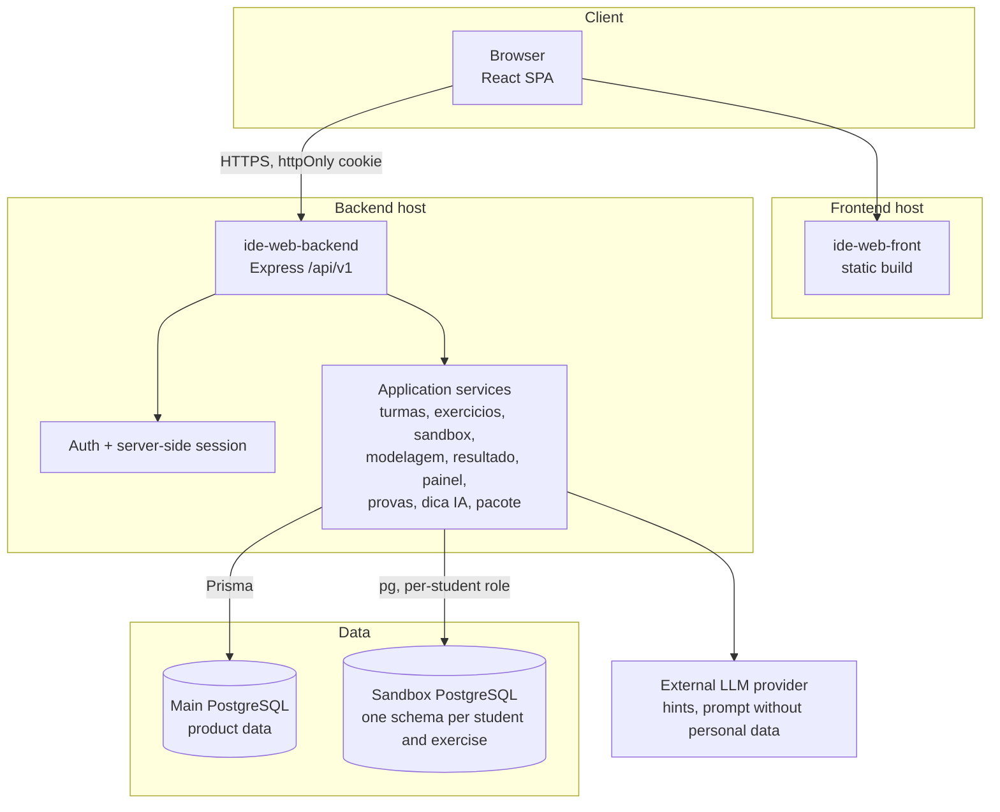
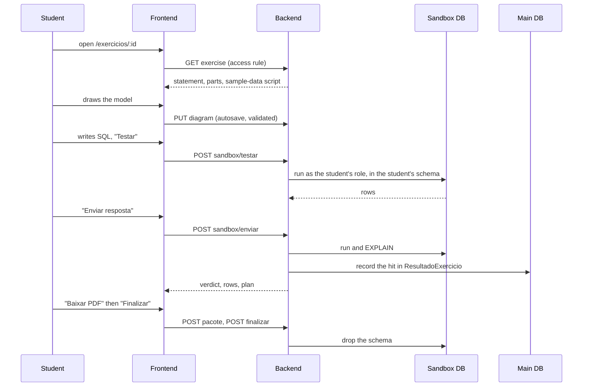

# IDE Web: Repository Overview

IDE Web is a teaching platform for **databases**, built as a TCC (final course project) at IFPI. A professor creates classes and exercises; students solve them in the browser: they **model** the data (conceptual and logical), **write SQL** against their own isolated sandbox, and get automatic grading, an explanation of the execution plan and pedagogical AI hints. Professors get dashboards, an exam mode and a by-student review screen.

The repository is a monorepo with two applications and a Docker Compose environment. The whole API sits under the prefix `/api/v1`.

| Part | Stack | Where |
|---|---|---|
| Backend | Node.js, Express, TypeScript, Prisma with `@prisma/adapter-pg` | `ide-web-backend/` |
| Frontend | React, TypeScript, Vite, TanStack Query, Tailwind | `ide-web-front/` |
| Main database | PostgreSQL (Supabase in production) | schema in `ide-web-backend/prisma/schema.prisma` |
| SQL sandbox database | A **separate** PostgreSQL, with dynamic DDL through `pg`, outside Prisma | `sandbox_<exercicio>_<usuario>` schemas |
| Local environment | Docker Compose: main database, sandbox database, backend, frontend behind nginx | `docker-compose.yml` |

---

## System architecture

`ide-web-backend` follows **MSC layering**: `routes → controllers → services → repositories`. `ide-web-front` is **feature-based**. Both are documented module by module below.

---

## Documentation map

### Infrastructure and platform

| Document | Covers |
|---|---|
| [Infrastructure & Build Pipeline](Infrastructure_&_Build_Pipeline.md) | Docker Compose, multi-stage builds, database provisioning, build configuration |
| [infrastructure](infrastructure.md), [backend_build_config](backend_build_config.md), [frontend_build_config](frontend_build_config.md) | The three parts of the above |
| [Backend Platform](Backend_Platform.md) | Architectural pattern, error classes and operational health checks |
| [backend_core](backend_core.md), [backend_errors](backend_errors.md) | Base controller and typed domain errors |

### Backend application services

Overview in [Backend Application Services](Backend_Application_Services.md).

| Module | Responsibility |
|---|---|
| [backend_auth](backend_auth.md) | Registration, login, stateful sessions |
| [backend_turmas](backend_turmas.md) | Classes, enrollment, closing |
| [backend_exercicios](backend_exercicios.md) | Exercises and the single access point for students |
| [backend_modelagem](backend_modelagem.md) | Modelling documents and SQL generation |
| [backend_sandbox_sql](backend_sandbox_sql.md) | Isolated SQL execution and automatic grading |
| [backend_provas](backend_provas.md) | Exam variants and their drawing |
| [backend_resultado](backend_resultado.md) | Results, review and grade release |
| [backend_painel](backend_painel.md) | Dashboards |
| [backend_dica_ia](backend_dica_ia.md) | AI hints |
| [backend_pacote](backend_pacote.md) | PDF package and finalisation |

### Frontend application

Overview in [Frontend Application](Frontend_Application.md).

| Module | Responsibility |
|---|---|
| [frontend_shared](frontend_shared.md) | HTTP client, routes, guard, theme, UI primitives |
| [frontend_auth](frontend_auth.md) | Landing, login, registration |
| [frontend_turmas](frontend_turmas.md) | Class management and enrollment |
| [frontend_exercicios](frontend_exercicios.md) | Exercise workspace, exam tools, review |
| [frontend_modelagem](frontend_modelagem.md) | Conceptual and logical editors, conversion |
| [frontend_painel](frontend_painel.md) | Dashboards and review by student |
| [frontend_dica_ia](frontend_dica_ia.md) | Hint button |

---

## A student's exercise, end to end

## Who can do what

| Role | Account | Main areas |
|---|---|---|
| `aluno` | own e-mail and password | dashboard, exercises, free study (`/estudar`), enrollment by class code |
| `professor` | own e-mail and password | classes, exercises and gabaritos, exams, matrix, review by student |
| `pesquisador` | single account created by a script, no self-signup | everything a professor does, plus the research tools |

The class code is an **enrollment token**, not a credential: a student signs in first and uses the code once, staying in the class until the professor closes it.

## Key design decisions

- **Server-side session.** The cookie carries a session id; a session ends after 6 hours, or 1 hour of inactivity, or on logout, which really revokes it. The frontend renews the short access token silently.
- **One access point for exercises.** `AcessoExercicioService` decides read, delivery and test permissions: public exercises, enrollment, closed classes, deadlines and exam single-submission. See [Backend Application Services](Backend_Application_Services.md).
- **Sandbox isolation per student.** Each student runs SQL under a role of their own in their own schema, in a database separate from the product data. Only the free-study schema allows `CREATE`.
- **Pure logic, mirrored across the wire.** The modelling document schema, the SQL generator and identifier normalisation exist in the same form on both sides, with the same test cases.
- **Two modelling levels.** Conceptual (Chen) and logical, with an assisted conversion that asks the student only what the model cannot decide (1:1 relationships and specialisations).
- **Grades run from 0.0 to 10.0.** SQL is graded automatically by comparing result sets, ignoring order; modelling and essay are graded by the professor.
- **Deterrence, not control.** The copy block during an exam stops the careless, not someone with a second device, and the project text does not claim otherwise.
- **The student sees only themselves.** The student dashboard has no class average, ranking or classmate names.
- **AI hints without personal data.** The prompt carries the model summary, the generated SQL and the query, and no identification of the participant.

## Conventions

- Backend: domain errors in Portuguese (they reach the user), Zod at the edge, ownership checks in the service, batched reads for aggregates.
- Frontend: import another feature only through its `index.ts` (with one documented exception for heavy pages), server state in TanStack Query, real tables and text labels for accessibility.
- The API answers `{ data?, error?: { code, message } }`.

## Research-only code

Part of the repository exists only for the data-collection period of the TCC and is removed by the author afterwards, before the project serves as the real tool of IFPI: the research flow (consent, group draw, usability and workload questionnaires), its screens and its Node endpoints. It is kept easy to remove and is not part of the product described above.
