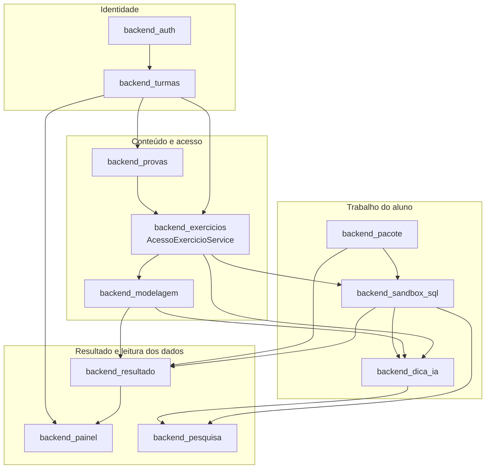
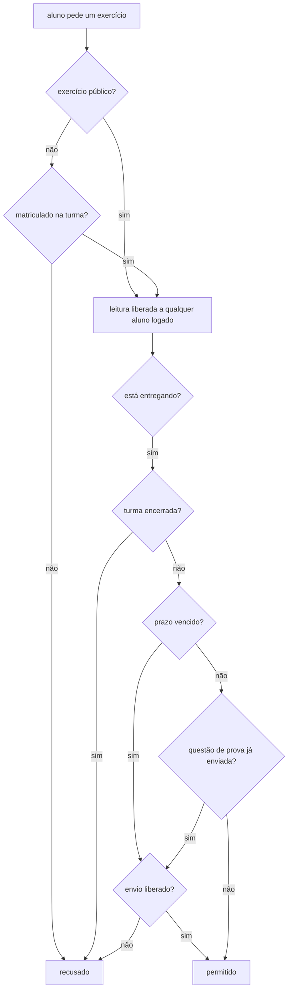

# Backend Application Services

**Localização**: `ide-web-backend/src/{routes,controllers,services,repositories,dtos,utils}`  
**Finalidade**: A camada de domínio do backend da IDE Web: tudo o que um professor ou um aluno pode *fazer* no sistema, sobre a camada de plataforma descrita em [Backend Platform](Backend_Platform.md).

---

## Visão geral

O `Backend_Application_Services` reúne onze módulos de funcionalidade. Cada um é uma fatia vertical com o mesmo formato MSC (`routes → controllers → services → repositories`, com DTOs em Zod na borda), e eles cooperam por meio de **interfaces de repositório e de alguns serviços compartilhados**, nunca acessando as tabelas uns dos outros diretamente a partir de um controller.

| Módulo | Responsabilidade | Documento |
|---|---|---|
| Auth | Cadastro, login, sessões com estado (`SessaoAuth`), `requireAuth` | [backend_auth](backend_auth.md) |
| Turmas | Turmas, matrícula pelo código (`MatriculaTurma`), encerramento e reabertura | [backend_turmas](backend_turmas.md) |
| Exercicios | CRUD de exercícios com até três partes opcionais, e o ponto único de acesso `AcessoExercicioService` | [backend_exercicios](backend_exercicios.md) |
| Modelagem | Documentos de modelagem conceitual (Chen) e lógica, validação, geração de SQL | [backend_modelagem](backend_modelagem.md) |
| Sandbox SQL | Execução de SQL isolada por aluno, plano EXPLAIN, correção automática | [backend_sandbox_sql](backend_sandbox_sql.md) |
| Provas | Variantes de prova, sorteio, assistente de prova | [backend_provas](backend_provas.md) |
| Resultado | Resultados, revisão manual, liberação de nota | [backend_resultado](backend_resultado.md) |
| Painel | Painéis do professor e do aluno | [backend_painel](backend_painel.md) |
| Dica IA | Dicas de IA com cota e prompts sem dados pessoais | [backend_dica_ia](backend_dica_ia.md) |
| Pacote | Pacote em PDF e finalização do exercício | [backend_pacote](backend_pacote.md) |
| Pesquisa | Token e contagem de acertos do protocolo de pesquisa do TCC (exclusivo da pesquisa) | [backend_pesquisa](backend_pesquisa.md) |

---

## Arquitetura

As setas significam "fornece dados ou regras para". Identidade e matrícula ficam no topo; os painéis e os contadores da pesquisa apenas **leem** o que os módulos acima escrevem.

---

## Como os módulos se encaixam

### 1. Quem você é e a que turma pertence

O [Backend Auth](backend_auth.md) autentica todos os papéis com e-mail e senha próprios, alunos inclusive. A sessão é guardada no servidor: o token carrega um id de sessão (`sid`), o `requireAuth` confere que a sessão não foi revogada e aplica o teto de 6 horas e 1 hora de inatividade, e o logout de fato a revoga. O `POST /auth/registrar` só aceita `aluno` e `professor`; a conta `pesquisador` é única e criada por um script.

O [Backend Turmas](backend_turmas.md) transforma o código da turma em uma **matrícula**, não numa credencial: o aluno logado usa o código uma vez e permanece na turma até o professor encerrá-la. Um aluno pode estar em várias turmas, e cada `MatriculaTurma` guarda a variante de prova sorteada para ele naquela turma.

### 2. O que você pode abrir: um único ponto de acesso

O acesso a um exercício passa por um único serviço, o `AcessoExercicioService`, no [Backend Exercicios](backend_exercicios.md), com `exigirLeitura`, `exigirEntrega` e `exigirTeste`.

A entrega verifica, nesta ordem: turma encerrada, depois o prazo (`Exercicio.prazo`), depois o envio único das questões de prova (`prova_id` preenchido e já existe uma submissão). O `ResultadoExercicio.envio_liberado_em` é a válvula de escape: concede exatamente um envio, atravessa o prazo e a regra de envio único, e é consumido ao enviar. O teste no sandbox (`exigirTeste`) é recusado nas questões de prova. Um exercício público não congela junto com a turma de origem.

### 3. Fazendo o trabalho

- O [Backend Sandbox SQL](backend_sandbox_sql.md) executa o SQL do aluno num schema `sandbox_<exercicio_id>_<usuario_id>` de um banco **separado**, sob uma role por aluno. Ao enviar, devolve o plano EXPLAIN e, quando o exercício tem gabarito SQL, grava o acerto em `ResultadoExercicio.sql_correto` sem sobrescrever uma revisão manual (`revisado = true` congela o valor). O schema de estudo livre `sandbox_livre_<usuario_id>` é o único em que o aluno tem `CREATE`.
- O [Backend Modelagem](backend_modelagem.md) guarda e valida o documento de modelagem (v2: conceitual, lógico e dados da conversão) com o mesmo schema Zod do frontend, e gera o DDL PostgreSQL a partir do modelo lógico.
- O [Backend Dica IA](backend_dica_ia.md) envia `{ contexto, estadoMer?, estadoSql? }` ao provedor de LLM: um resumo do modelo conceitual, o modelo lógico como SQL gerado e a consulta, pedindo coerência entre eles. O limite é de 5 dicas por contexto e o prompt não leva dados pessoais.
- O [Backend Pacote](backend_pacote.md) monta o PDF com até duas imagens de modelo e o SQL lógico. Baixar é repetível e sem efeito colateral; **finalizar** é uma ação separada, que grava `finalizado_em` e derruba o schema.

### 4. Correção e leitura dos dados

O [Backend Resultado](backend_resultado.md) guarda um `ResultadoExercicio` por aluno e exercício. A correção do SQL é automática (comparação do conjunto de resultado, ignorando a ordem); as partes de MER e dissertativa são corrigidas à mão numa escala de **0,0 a 10,0**. O [Backend Painel](backend_painel.md) lê tudo isso para montar a matriz do professor e o progresso do próprio aluno, e o [Backend Pesquisa](backend_pesquisa.md) expõe as contagens de tentativas, acertos e dicas para o CSV da pesquisa.

---

## Convenções compartilhadas

| Convenção | Onde aparece |
|---|---|
| Camadas `routes → controllers → services → repositories` | Todos os módulos; a ligação é feita à mão em cada `*.routes.ts` |
| Controllers só interpretam, delegam e respondem | `BaseController.handleSuccess`, sem regras de negócio |
| Zod na borda (`dtos/`) | Validação de corpo e de query; `ValidationError` com os problemas |
| Erros de domínio em português | `NotFoundError('Turma')` monta "Turma não encontrado(a)", porque a mensagem chega ao usuário |
| Verificação de posse no serviço | "Você não é o professor desta turma" é decidido no serviço, não na rota |
| Leituras em lote para agregados | `groupBy` e `findMany` sobre listas de ids, depois cruzamento em memória (veja [Backend Painel](backend_painel.md)) |
| Restrição de papel na rota | `requireAuth` e depois `requirePapel(...)` |

## Para onde ir a seguir

- Plataforma e classes de erro: [Backend Platform](Backend_Platform.md), [backend_core](backend_core.md), [backend_errors](backend_errors.md)
- As telas que usam estes endpoints: [Frontend Application](Frontend_Application.md)
- O sistema inteiro de uma vez: [overview](overview.md)
