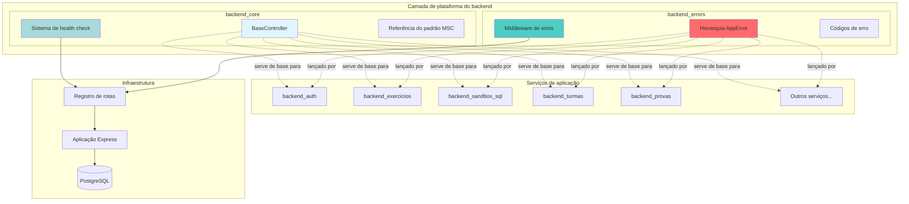
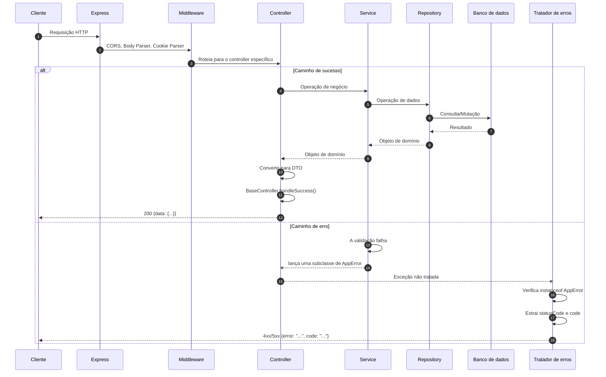
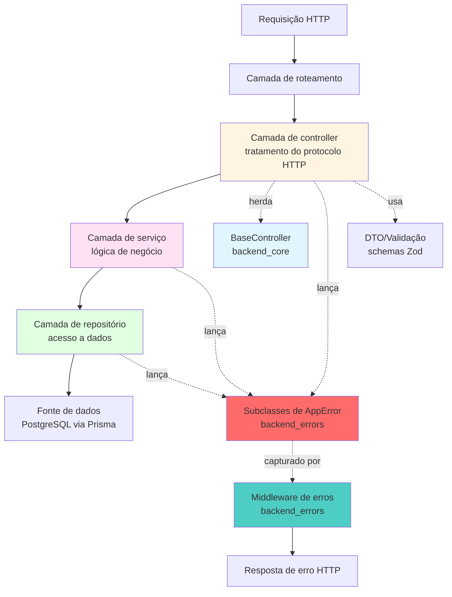
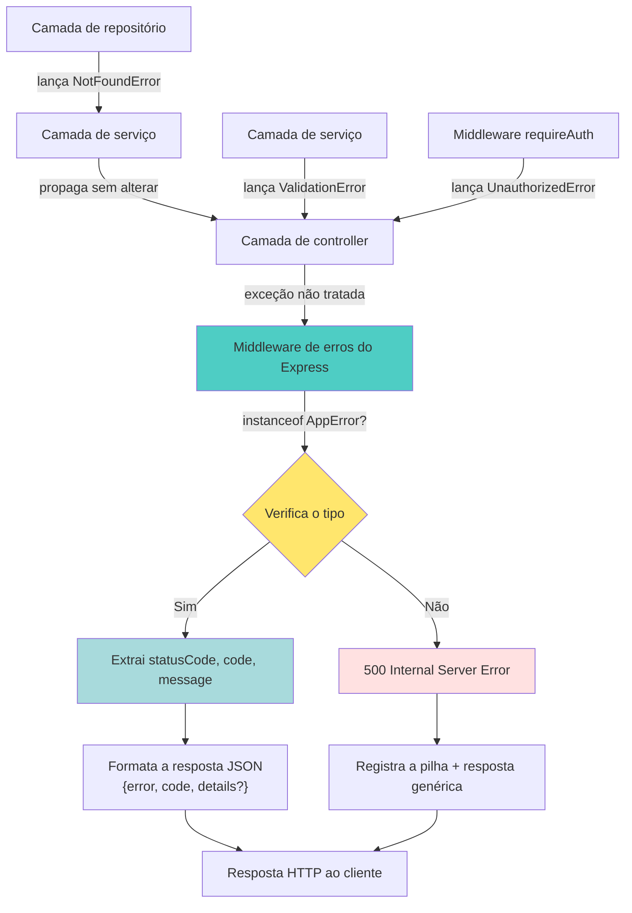
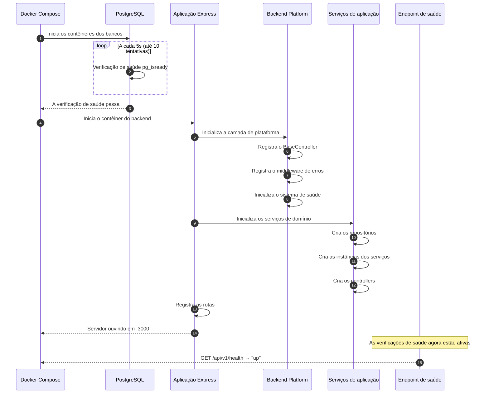
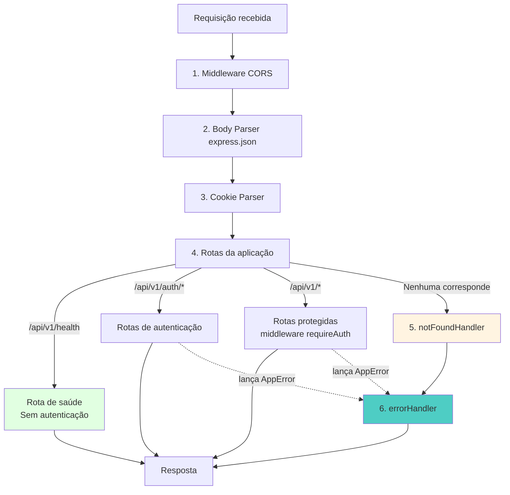
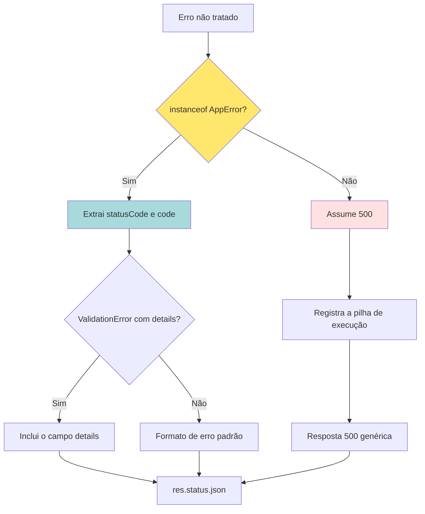

# Módulo Backend Platform

**Localização**: `ide-web-backend/src`  
**Finalidade**: Camada de plataforma que fornece os padrões arquiteturais, o tratamento de erros e o monitoramento operacional da aplicação backend da IDE Web.

---

## Sumário

- [Visão geral](#visão-geral)
- [Arquitetura do módulo](#arquitetura-do-módulo)
- [Subsistemas principais](#subsistemas-principais)
- [Padrões de projeto](#padrões-de-projeto)
- [Padrões de integração](#padrões-de-integração)
- [Referência dos componentes](#referência-dos-componentes)
- [Módulos relacionados](#módulos-relacionados)

---

## Visão geral

### Finalidade

O módulo `Backend_Platform` é a base arquitetural de todo o backend da IDE Web. Ele estabelece:

1. **Padrões arquiteturais**: a organização em camadas MSC (Model-Service-Controller), usada em todos os serviços do backend
2. **Gestão de erros**: tratamento de erros tipado e compatível com HTTP, com mensagens ao usuário em português
3. **Monitoramento operacional**: sistema de verificação de saúde (health check) para a orquestração de contêineres e a confiabilidade do serviço
4. **Camada de consistência**: formato de resposta e propagação de erros uniformes em todos os endpoints da API

### Stack tecnológica

- **Runtime**: Node.js 20+ (Alpine Linux nos contêineres Docker)
- **Framework**: Express 4.x
- **Linguagem**: TypeScript com verificação estrita de tipos
- **Arquitetura**: padrão MSC (Model-Service-Controller)
- **ORM**: Prisma com adaptador PostgreSQL
- **Implantação**: contêineres Docker com monitoramento de saúde

### Características principais

- **Arquitetura em camadas**: separação clara entre HTTP, lógica de negócio e acesso a dados
- **Segurança de tipos**: tipagem TypeScript abrangente, dos DTOs aos modelos de domínio
- **Português em primeiro lugar**: todas as mensagens voltadas ao usuário em português do Brasil
- **Falhar rápido (fail-fast)**: distinção clara entre falhas transitórias e permanentes
- **Extensível**: oferece classes base abstratas para padrões de implementação consistentes

---

## Arquitetura do módulo

### Estrutura da camada de plataforma



### Fluxo de requisição e resposta



---

## Subsistemas principais

O módulo `Backend_Platform` é composto por dois subsistemas principais:

### 1. backend_core: a base arquitetural

**Finalidade**: fornece os padrões estruturais e o monitoramento de saúde sobre os quais todos os serviços do backend são construídos.

**Componentes principais**:
- **BaseController**: classe base abstrata para um tratamento uniforme das respostas HTTP
- **Sistema de health check**: monitoramento de processo sem estado, para a orquestração de contêineres
- **Referência do padrão MSC**: implementação completa que demonstra a organização em camadas

**Integração**: todo controller de domínio do sistema estende o `BaseController`, herdando a formatação padronizada das respostas e estabelecendo um contrato de API consistente.

**Documentação**: veja [backend_core.md](backend_core.md) para as especificações detalhadas dos componentes.

### 2. backend_errors: a gestão de erros

**Finalidade**: hierarquia de erros centralizada, que oferece um tratamento de erros tipado e compatível com HTTP, com mensagens ao usuário em português.

**Componentes principais**:
- **Hierarquia AppError**: classe base com subclasses especializadas para cada categoria de erro
- **Códigos de erro**: identificadores legíveis por máquina, para o tratamento programático de erros
- **Middleware de erros**: tratador global que transforma exceções em respostas HTTP

**Integração**: todos os serviços do backend lançam subclasses de `AppError`, que são capturadas automaticamente e transformadas em respostas de erro HTTP bem formatadas.

**Documentação**: veja [backend_errors.md](backend_errors.md) para a referência completa dos tipos de erro.

---

## Padrões de projeto

### Padrão MSC (Model-Service-Controller)

A plataforma impõe uma organização em camadas estrita em todos os serviços do backend:



**Responsabilidades das camadas**:

| Camada | Responsabilidade | Tratamento de erros | Exemplo |
|-------|---------------|----------------|---------|
| **Controller** | Protocolo HTTP, mapeamento de requisição e resposta | Propaga `AppError` | `ExercicioController.buscar()` |
| **Service** | Lógica de negócio, orquestração | Lança `ValidationError`, `ForbiddenError` | `ExercicioService.criar()` |
| **Repository** | Acesso a dados, construção de consultas | Lança `NotFoundError`, `SandboxIndisponivelError` | `ExercicioRepository.findById()` |
| **Model** | Entidades de domínio, objetos de valor | Sem lógica de erro | `Exercicio`, `HealthStatus` |
| **DTO** | Contratos da API, validação com Zod | Erros de validação → `ValidationError` | `CreateExercicioDto` |

### Padrão de injeção de dependências

**Injeção manual por construtor**:

```typescript
// Padrão dos arquivos de rota (aplicado em todas as rotas de domínio)
const repository = new ConcreteRepository();
const service = new ConcreteService(repository);
const controller = new ConcreteController(service);

export const routes = Router();
routes.get('/resource', asyncHandler((req, res) => controller.method(req, res)));
```

**Benefícios**:
- Grafo de dependências explícito (sem contêiner de DI "mágico")
- Fácil de testar (mocks das interfaces em qualquer camada)
- Ordem de inicialização clara
- Rastreável por análise estática

### Estratégia de propagação de erros



**Princípios principais**:

1. **Nunca capturar internamente**: serviços e repositórios lançam os erros, não os capturam
2. **Roteamento por tipo**: o middleware de erros roteia por `instanceof AppError`
3. **Mapeamento automático de status**: cada classe de erro define o seu status HTTP
4. **Mensagens em português**: todas as mensagens de erro chegam ao usuário final em português
5. **Códigos estruturados**: códigos legíveis por máquina para o tratamento programático no frontend

---

## Padrões de integração

### Sequência de inicialização da aplicação



### Ordem da pilha de middlewares

Em `ide-web-backend/src/app.ts`:



**Justificativa**:
- **Saúde primeiro**: o `/api/v1/health` é registrado antes da autenticação para permitir o monitoramento sem autenticação
- **Tratador de erros por último**: captura todos os erros não tratados dos middlewares e rotas anteriores
- **Not found antes dos erros**: garante que rotas desconhecidas recebam 404, e não 500

---

## Referência dos componentes

### BaseController (backend_core)

**Finalidade**: classe base abstrata que oferece uma formatação de resposta uniforme.

**Contrato**:
```typescript
abstract class BaseController {
  protected handleSuccess(res: Response, data: unknown, statusCode: number = 200): void;
}
```

**Uso**:
```typescript
export class ExercicioController extends BaseController {
  buscar = async (req: Request, res: Response): Promise<void> => {
    const exercicio = await this.exercicioService.buscar(req.params.id);
    this.handleSuccess(res, toExercicioDto(exercicio));
  };
}
```

**Formato da resposta**: todas as respostas de sucesso seguem o envelope `{ data: T }`.

**Documentação**: [backend_core.md § BaseController](backend_core.md#basecontroller)

---

### Sistema de health check (backend_core)

**Finalidade**: endpoint de saúde sem dependências, para a orquestração de contêineres.

**Endpoint**: `GET /api/v1/health`

**Resposta**:
```json
{
  "data": {
    "status": "up" | "degraded" | "down",
    "uptimeSeconds": 127.483,
    "checkedAt": "2026-09-22T14:32:15.823Z"
  }
}
```

**Lógica de estados**:
- `degraded`: tempo de atividade do processo < 5 segundos (fase de inicialização)
- `up`: tempo de atividade do processo ≥ 5 segundos (operacional)
- `down`: reservado para uso futuro (verificações de conectividade com o banco)

**Dependências**: nenhuma (usa apenas `process.uptime()`)

**Documentação**: [backend_core.md § Sistema de health check](backend_core.md#sistema-de-health-check)

---

### Hierarquia AppError (backend_errors)

**Finalidade**: classes de erro tipadas que mapeiam falhas de domínio para respostas HTTP.

**Classe base**:
```typescript
abstract class AppError extends Error {
  abstract readonly statusCode: number;
  abstract readonly code: string;
}
```

**Subclasses**:

| Classe | Status | Código | Caso de uso |
|-------|--------|------|----------|
| `ValidationError` | 400 | `VALIDATION_ERROR` | Validação de entrada, erros do Zod |
| `UnauthorizedError` | 401 | `UNAUTHORIZED` | JWT inválido ou ausente, sessão expirada |
| `ForbiddenError` | 403 | `FORBIDDEN` | Violações de papel ou de permissão |
| `NotFoundError` | 404 | `NOT_FOUND` | Recurso não encontrado no banco |
| `ConflictError` | 409 | `CONFLICT` | Recursos duplicados, conflitos de estado |
| `TooManyRequestsError` | 429 | `TOO_MANY_REQUESTS` | Limitação de taxa, cota esgotada |
| `SandboxIndisponivelError` | 503 | `SANDBOX_UNAVAILABLE` | Falha de conexão com o banco do sandbox SQL |
| `LlmIndisponivelError` | 503 | `LLM_UNAVAILABLE` | Falha transitória do provedor de LLM |
| `LlmNaoConfiguradoError` | 503 | `LLM_NAO_CONFIGURADO` | `LLM_API_KEY` ausente (permanente) |

**Documentação**: [backend_errors.md § Hierarquia de classes de erro](backend_errors.md#hierarquia-de-classes-de-erro)

---

### Middleware de erros (backend_errors)

**Finalidade**: tratador global de erros que transforma exceções em respostas HTTP.

**Localização**: `ide-web-backend/src/middlewares/errorHandler.ts`

**Fluxo lógico**:



**Formato da resposta**:
```typescript
// Sucesso (vindo do BaseController)
{ data: T }

// Erro (vindo do errorHandler)
{ error: string, code: string, details?: unknown }
```

**Documentação**: [backend_errors.md § Middleware de erros](backend_errors.md#fluxo-do-erro-pela-aplicação)

---

## Módulos relacionados

### Serviços de aplicação dependentes

Todos os serviços de aplicação do backend são construídos sobre a camada de plataforma:

- **[backend_auth](backend_auth.md)**: gestão de sessão, validação de JWT
  - Usa: `BaseController`, `UnauthorizedError`, `ForbiddenError`
  
- **[backend_exercicios](backend_exercicios.md)**: CRUD de exercícios, regras de visibilidade
  - Usa: `BaseController`, `NotFoundError`, `ValidationError`, `ForbiddenError`
  
- **[backend_sandbox_sql](backend_sandbox_sql.md)**: sandbox de execução de SQL
  - Usa: `BaseController`, `SandboxIndisponivelError`, `ValidationError`
  
- **[backend_turmas](backend_turmas.md)**: gestão de turmas, matrícula
  - Usa: `BaseController`, `NotFoundError`, `ConflictError`
  
- **[backend_provas](backend_provas.md)**: criação de provas, atribuição a alunos
  - Usa: `BaseController`, `NotFoundError`, `ConflictError`
  
- **[backend_resultado](backend_resultado.md)**: correção de exercícios, devolutiva
  - Usa: `BaseController`, `NotFoundError`, `ForbiddenError`
  
- **[backend_painel](backend_painel.md)**: agregação dos painéis
  - Usa: `BaseController`, `NotFoundError`, `ForbiddenError`
  
- **[backend_dica_ia](backend_dica_ia.md)**: dicas geradas por LLM
  - Usa: `BaseController`, `LlmNaoConfiguradoError`, `LlmIndisponivelError`, `TooManyRequestsError`
  
- **[backend_pacote](backend_pacote.md)**: geração de relatório em PDF
  - Usa: `BaseController`, `NotFoundError`, `ForbiddenError`
  
- **[backend_modelagem](backend_modelagem.md)**: persistência de diagramas ER
  - Usa: `BaseController`, `NotFoundError`, `ValidationError`
  
- **[backend_pesquisa](backend_pesquisa.md)**: coleta de dados da pesquisa
  - Usa: `BaseController`, `NotFoundError`, `ForbiddenError`

### Dependências de infraestrutura

- **[infrastructure](infrastructure.md)**: orquestração com Docker Compose
  - As verificações de saúde da plataforma se integram às condições `depends_on`
  
- **[backend_build_config](backend_build_config.md)**: configuração do TypeScript
  - A verificação estrita de tipos faz valer os contratos da plataforma

---

## Resumo

O módulo `Backend_Platform` estabelece a base arquitetural do backend da IDE Web:

✅ **Padrões consistentes**: organização em camadas MSC imposta pelo `BaseController` e pela injeção de dependências  
✅ **Erros tipados**: hierarquia de erros abrangente, com códigos de status compatíveis com HTTP  
✅ **Experiência em português**: todas as mensagens voltadas ao usuário em português do Brasil gramaticalmente correto  
✅ **Confiabilidade operacional**: verificações de saúde sem dependências para a orquestração de contêineres  
✅ **Experiência do desenvolvedor**: abstrações claras que evitam erros comuns e garantem a consistência da API  

Todo serviço do backend é construído sobre esta base, resultando numa base de código sustentável e previsível, alinhada às diretrizes arquiteturais do projeto (veja o `CLAUDE.md` para a documentação completa da arquitetura).

---

**Versão do documento**: 1.0  
**Última atualização**: 2026-09-22  
**Cobertura do módulo**: completa até a Fase 10 (plataforma totalmente implementada)
