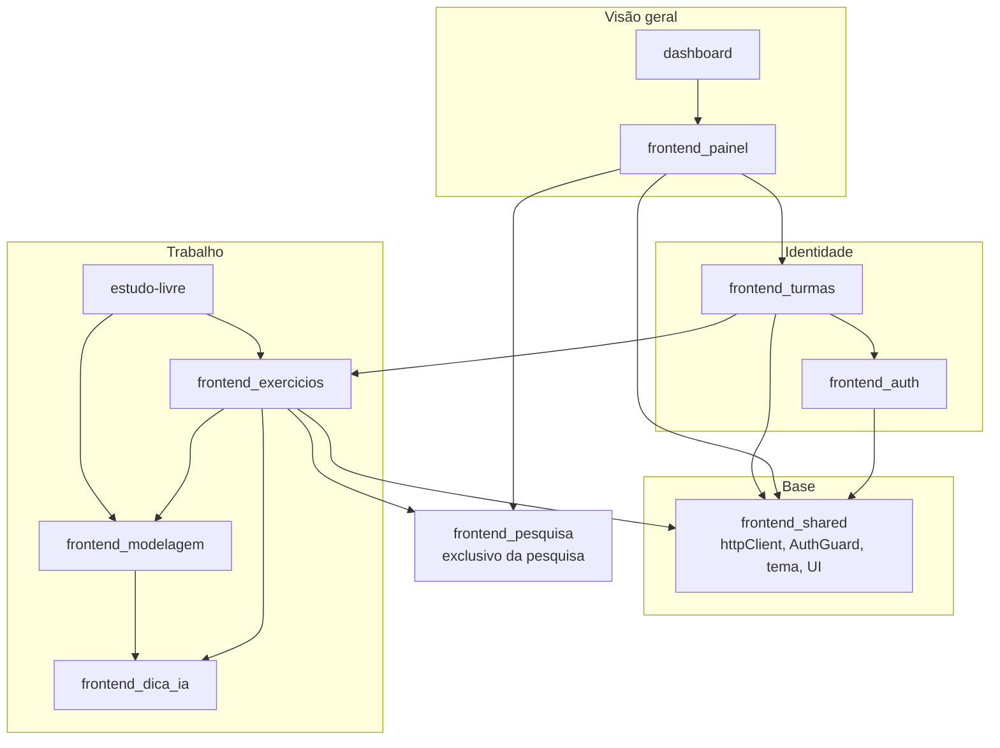
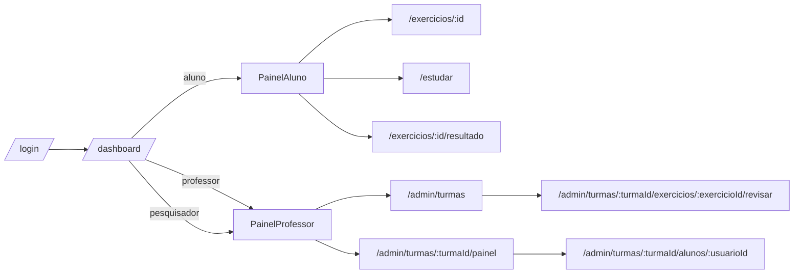

# Frontend Application

**Localização**: `ide-web-front/src/features/`  
**Finalidade**: A camada de funcionalidades do frontend da IDE Web: tudo o que o usuário vê e faz, construída sobre a base compartilhada descrita em [Frontend Shared](frontend_shared.md).

---

## Visão geral

O frontend é uma aplicação de página única em **React + TypeScript + Vite**, organizada **por funcionalidade** (`features/<domínio>/`). Cada feature é dona de seus `components/`, `hooks/`, `services/`, `types.ts` e de um `index.ts` que é a sua única porta pública. Os dados vêm da API Node por meio do TanStack Query, e o estilo é feito com Tailwind, com temas claro e escuro.

| Módulo | Responsabilidade | Documento |
|---|---|---|
| Auth | Página inicial, login, cadastro, `useAuth` | [frontend_auth](frontend_auth.md) |
| Turmas | Criar, encerrar e reabrir turmas; matrícula do aluno pelo código | [frontend_turmas](frontend_turmas.md) |
| Exercicios | Área de trabalho do exercício (SQL, modelagem, dissertativa), ferramentas de prova, revisão, PDF | [frontend_exercicios](frontend_exercicios.md) |
| Modelagem | Editores conceitual e lógico, assistente de conversão, geração de SQL | [frontend_modelagem](frontend_modelagem.md) |
| Painel | Painéis do professor e do aluno, matriz da turma, revisão por aluno | [frontend_painel](frontend_painel.md) |
| Dica IA | Botão "Pedir dica" e seu tratamento de erros | [frontend_dica_ia](frontend_dica_ia.md) |
| Pesquisa | Fluxo do participante do TCC e ferramentas do pesquisador (exclusivo da pesquisa) | [frontend_pesquisa](frontend_pesquisa.md) |
| Shared | `httpClient`, rotas, guarda de acesso, tema, componentes de interface | [frontend_shared](frontend_shared.md) |

Três funcionalidades menores não têm documento próprio:

| Feature | O que é |
|---|---|
| `features/dashboard` | `DashboardPage`: um **roteador por papel** em `/dashboard`. Renderiza a `TopNav` e depois o `PainelAluno` para alunos, o `PainelProfessor` para professores, e os dois para o pesquisador, mais um cartão de atalho para `/admin/pesquisa` |
| `features/estudo-livre` | `/estudar`, a IDE do aluno **sem turma**, em três abas: "Meu banco" (`BancoLivre`, SQL executado no schema pessoal `sandbox_livre_<usuario_id>`, onde o aluno pode usar `CREATE`, com um "Limpar meu banco" que pede confirmação), "Modelagem" (`ModelagemLivre`, um rascunho que vive **só no navegador**, com "Usar no meu banco" levando o DDL gerado para a primeira aba) e "Exercícios públicos" |
| `features/legal` | `PoliticaPrivacidadePage`, a política de privacidade pública |

---

## Arquitetura

As setas significam "usa". Duas delas são os únicos pontos em que código de domínio vaza para outra feature de propósito: o painel hospeda o banner da pesquisa, e a página do exercício verifica o bloqueio da pesquisa.

---

## Rotas e papéis

A tabela completa está em `app/routes.tsx` (veja [Frontend Shared](frontend_shared.md)); toda página é carregada sob demanda (lazy).

| Papel | Alcança |
|---|---|
| `aluno` | painel, `/estudar`, exercícios e resultados, e o fluxo da pesquisa (`/tcle`, `/pesquisa/*`) |
| `professor` | painel, `/admin/turmas`, a matriz da turma, a revisão por aluno |
| `pesquisador` | tudo o que o professor tem, mais `/admin/pesquisa` |

A guarda do frontend apenas conduz a navegação. **A autorização de verdade acontece sempre no backend**, e é também por isso que o bloqueio de cópia na prova e o bloqueio da pesquisa para o grupo controle são descritos como dissuasão.

---

## Convenções transversais

| Convenção | Detalhe |
|---|---|
| **Importar pelo `index.ts` da feature** | A exceção é um serviço ou hook leve quando a feature também exporta uma página pesada. A `ExercicioPage` carrega o Monaco, então quem só precisa do serviço importa `~features/exercicio/services/exercicioService` diretamente. Isso já causou problema: um import desnecessário quebrou um teste em jsdom por causa do Monaco |
| **Estado de servidor no TanStack Query** | `staleTime` de 60 s por padrão, 30 s nos painéis. As mutações invalidam a chave relacionada (`['painel', ...]`, `['turmas', ...]`) |
| **Validação com Zod, espelhada do backend** | O documento de modelagem, o exercício e os schemas de revisão têm o mesmo formato dos DTOs do backend |
| **Erros em português, vindos do servidor** | `HttpError.message` já é um texto para o usuário; os componentes o mostram num elemento com `role="alert"` |
| **Acessibilidade** | `<table>` de verdade na matriz, rótulos de texto ao lado das cores, `aria-live` nos estados de espera, `aria-invalid` e `aria-describedby` nos campos |
| **Renovação silenciosa da sessão** | O `httpClient` renova uma vez ao receber 401 e refaz a requisição |
| **Nenhum segredo no navegador** | O cookie é `httpOnly`; o token da pesquisa é de vida curta e não leva nome nem e-mail |

## Testes

- Testes unitários e de componente ficam ao lado do código (`*.test.ts(x)`), com jsdom.
- Testes de navegador: `npm run e2e` (Playwright e o Chrome do sistema, com API simulada, `tests/e2e/*.e2e.ts`).

## Nota sobre remoção

O `frontend_pesquisa`, o `features/tcle`, as partes de pesquisa do `features/admin`, o banner da pesquisa no `PainelAluno` e o bloqueio da pesquisa na `ExercicioPage` são **exclusivos da pesquisa** e são removidos pelo autor depois da coleta de dados. O restante da aplicação não depende deles.

## Para onde ir a seguir

- O backend que estas telas chamam: [Backend Application Services](Backend_Application_Services.md)
- O sistema inteiro de uma vez: [overview](overview.md)
