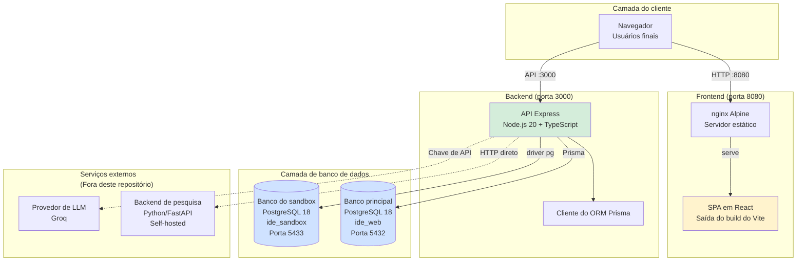
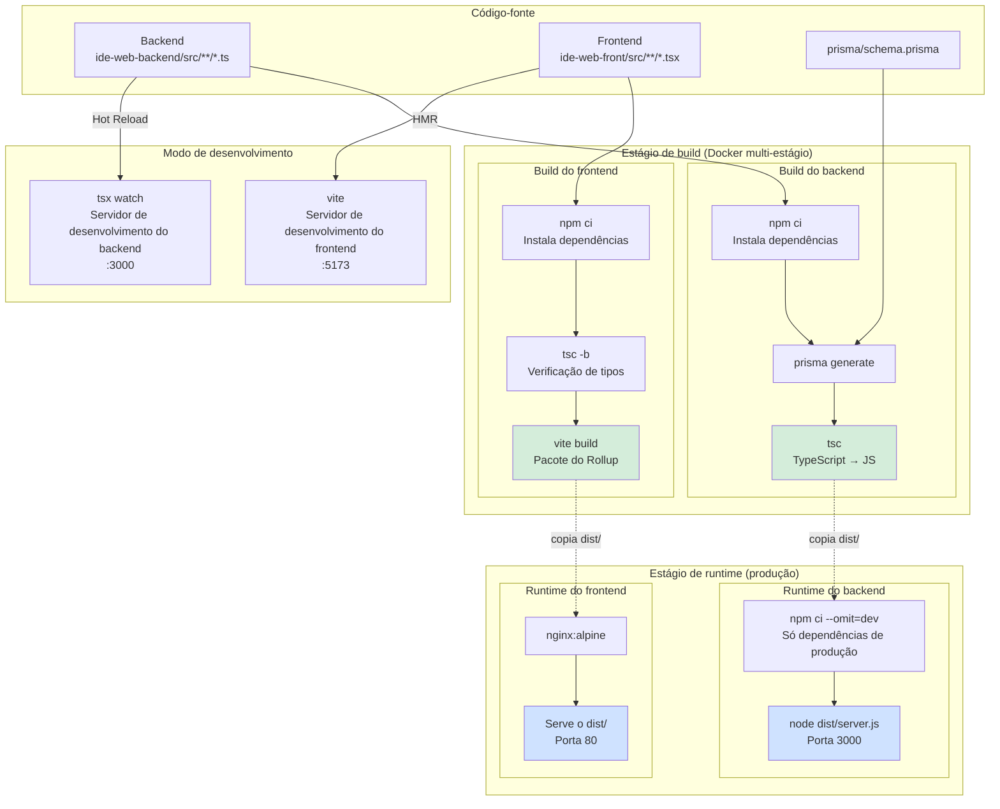
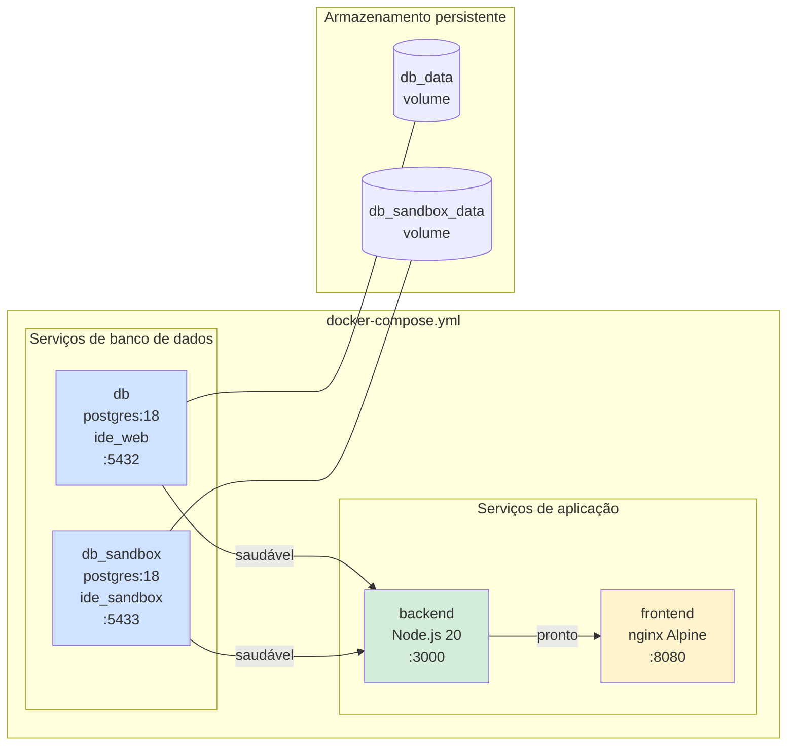
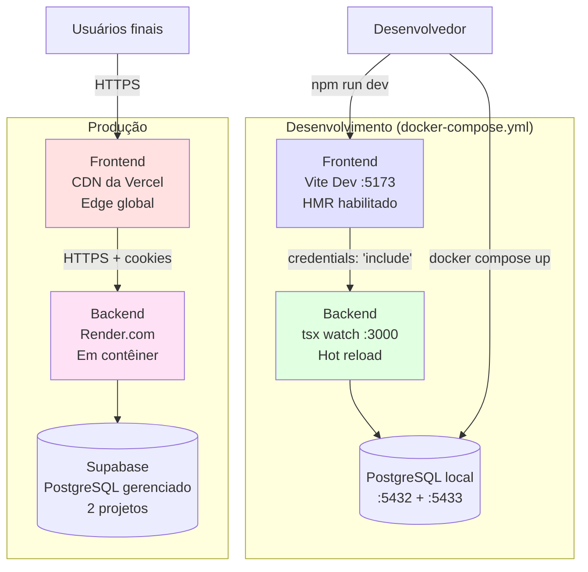
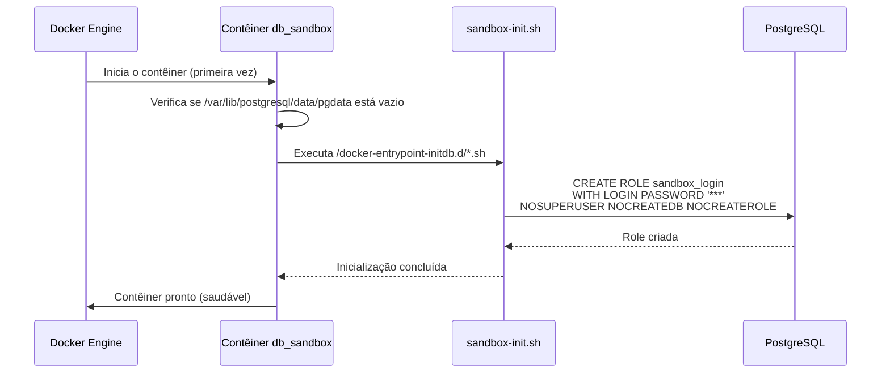
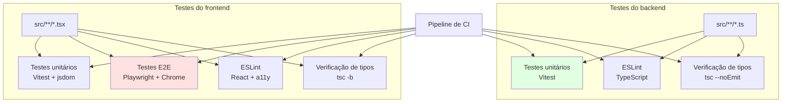

# Infraestrutura e pipeline de build

## Visão geral

O módulo **Infraestrutura e pipeline de build** oferece o ambiente completo de desenvolvimento e implantação em contêineres da IDE Web. Ele orquestra os contêineres Docker, gerencia os builds multi-estágio do frontend e do backend, provisiona os bancos de dados com isolamento de segurança e configura a entrega pelo servidor web, sempre mantendo uma separação clara entre os ambientes de desenvolvimento e de produção.

### Finalidade

Este módulo é a base de toda a stack da aplicação e viabiliza:

1. **Desenvolvimento em contêineres**: ambiente de desenvolvimento consistente entre os membros da equipe, por meio do Docker Compose
2. **Orquestração de builds**: compilação do TypeScript, empacotamento e otimização tanto do backend em Node.js quanto do frontend em React
3. **Provisionamento de bancos de dados**: instalação automatizada do banco principal da aplicação e do sandbox SQL isolado para os exercícios dos alunos
4. **Implantação em produção**: builds Docker multi-estágio que reduzem o tamanho da imagem e excluem as dependências de desenvolvimento
5. **Fluxo de desenvolvimento**: servidores de desenvolvimento com hot-reload, testes automatizados e verificação de tipos

---

## Visão geral da arquitetura

A infraestrutura da IDE Web implementa uma arquitetura de microsserviços em contêineres, com uma separação estrita de responsabilidades:



### Principais decisões de arquitetura

1. **Separação de bancos de dados**: os dados principais da aplicação (usuários, exercícios, submissões) ficam isolados da execução do sandbox SQL dos alunos, para evitar escalonamento de privilégios e disputa por recursos.

2. **Builds multi-estágio**: tanto o backend quanto o frontend usam builds multi-estágio do Docker, para reduzir o tamanho da imagem de produção (~60% de redução) e separar as dependências de build das de execução.

3. **Verificações de saúde**: os contêineres de banco de dados implementam verificações de saúde, para garantir que os serviços dependentes esperem o banco ficar pronto antes de iniciar, evitando falhas de conexão durante a inicialização.

4. **Otimização das ferramentas de build**: 
   - **Backend**: compilação do TypeScript em modo estrito, saída CommonJS para o Node.js
   - **Frontend**: Vite para desenvolvimento nativo em ESM com HMR, Rollup para o empacotamento de produção

---

## Arquitetura do pipeline de build

O pipeline de build abrange três contextos distintos: **desenvolvimento** (hot-reload), **build do Docker** (conteinerização) e **implantação em produção**.



### Estágios do pipeline de build

**Estágio 1: desenvolvimento**
- **Backend**: `tsx watch` para a execução do TypeScript em memória, com hot reload
- **Frontend**: servidor de desenvolvimento do Vite, com React Fast Refresh e HMR instantâneo
- **Bancos de dados**: o Docker Compose sobe os contêineres do PostgreSQL com verificações de saúde
- **Sem artefatos de compilação**: tudo roda a partir do código-fonte ou em memória

**Estágio 2: build do Docker**
- **Backend**: compilação de TypeScript → CommonJS para `dist/`, geração do cliente Prisma
- **Frontend**: verificação de tipos do TypeScript (`tsc -b`) + pacote de produção do Vite (tree shaking, minificação, divisão de código)
- **Otimização multi-estágio**: as dependências de build são descartadas, só as de execução permanecem
- **Tamanho da imagem**: backend ~150MB (contra ~500MB do estágio de build), frontend ~40MB (nginx + arquivos estáticos)

**Estágio 3: implantação em produção**
- **Backend**: implantado no Render.com como contêiner Docker, conectado ao PostgreSQL do Supabase
- **Frontend**: implantado na CDN da Vercel, arquivos estáticos servidos com cache agressivo
- **Injeção de ambiente**: `DATABASE_URL`, `JWT_SECRET`, `VITE_API_URL` definidos em tempo de execução/build

---

## Orquestração de contêineres

O Docker Compose orquestra quatro serviços, com gestão de dependências:



### Definições dos serviços

| Serviço | Imagem | Finalidade | Verificação de saúde | Dependências |
|---------|-------|---------|--------------|--------------|
| **db** | `postgres:18` | Banco principal da aplicação, via Prisma | `pg_isready -U ide_app -d ide_web` | Nenhuma |
| **db_sandbox** | `postgres:18` | Sandbox SQL isolado para os exercícios dos alunos | `pg_isready -U ide_sandbox_admin -d ide_sandbox` | Nenhuma |
| **backend** | Personalizada (Node.js 20) | API REST, lógica de negócio | N/A | `db`, `db_sandbox` (saudáveis) |
| **frontend** | Personalizada (nginx) | Serve a SPA em React | N/A | `backend` (pronto) |

**Sequência de inicialização**:
1. Os bancos de dados iniciam primeiro e executam verificações de saúde a cada 5 segundos
2. Quando os dois bancos ficam saudáveis, o backend inicia (espera pelo `depends_on`)
3. O frontend inicia depois que o backend fica pronto
4. Tempo total de inicialização: ~15-20 segundos (inicialização do banco + migrações)

---

## Componentes principais

O módulo é composto por três componentes filhos, cada um cuidando de um aspecto distinto da infraestrutura:

### 1. Infraestrutura ([infrastructure](infrastructure.md))

**Finalidade**: orquestração de contêineres, provisionamento de bancos de dados e arquitetura de implantação.

**Responsabilidades principais**:
- Definições dos serviços do Docker Compose
- Scripts de inicialização dos bancos (o `sandbox-init.sh` cria a role `sandbox_login`)
- Configuração do nginx para o roteamento da SPA e o cache dos arquivos estáticos
- Arquitetura de implantação em produção (Vercel + Render + Supabase)

**Arquivos críticos**:
- `docker-compose.yml` - orquestração dos serviços
- `ide-web-backend/scripts/sandbox-init.sh` - instalação do banco do sandbox
- `ide-web-front/nginx.conf` - configuração do servidor web

### 2. Configuração de build do backend ([backend_build_config](backend_build_config.md))

**Finalidade**: compilação do TypeScript, gestão de dependências e ferramentas de build do backend em Node.js.

**Responsabilidades principais**:
- Três configurações do TypeScript (`tsconfig.json`, `tsconfig.eslint.json`, `tsconfig.tests.json`)
- Scripts npm para desenvolvimento (`tsx`), build de produção (`tsc`), testes (Vitest) e lint (ESLint)
- Geração do cliente Prisma e gestão do schema
- Definição do build multi-estágio do Docker

**Arquivos críticos**:
- `ide-web-backend/package.json` - dependências e scripts de build
- `ide-web-backend/tsconfig.json` - configurações de compilação (modo estrito, ES2022, CommonJS)
- `ide-web-backend/Dockerfile` - build de produção multi-estágio

**Stack tecnológica**:
- **TypeScript 5.6.3**, com modo estrito habilitado
- **tsx** para o desenvolvimento com hot-reload
- **Prisma 7.9.1** para o ORM e as migrações
- **Vitest** para os testes unitários

### 3. Configuração de build do frontend ([frontend_build_config](frontend_build_config.md))

**Finalidade**: empacotamento com o Vite, referências de projeto do TypeScript e infraestrutura de testes do frontend em React.

**Responsabilidades principais**:
- Configuração do Vite com o plugin do React e o Tailwind CSS
- Referências de projeto do TypeScript (`tsconfig.app.json` para o app, `tsconfig.node.json` para as ferramentas de build)
- Aliases de caminho (`@/*`, `~features/*`, `~components/*`)
- Testes unitários com Vitest + jsdom
- Testes E2E com Playwright (navegador Chrome real)

**Arquivos críticos**:
- `ide-web-front/package.json` - dependências e scripts de build
- `ide-web-front/vite.config.ts` - configuração da ferramenta de build
- `ide-web-front/tsconfig.json` - orquestrador raiz das referências de projeto
- `ide-web-front/playwright.config.ts` - configuração dos testes E2E

**Stack tecnológica**:
- **Vite 8.2.0** para builds nativos em ESM e HMR
- **TypeScript 6.0.2**, com referências de projeto
- **React 19.2.8** + React Router 7.18.2
- **Vitest 4.1.11** (testes unitários) + **Playwright 1.63.0** (testes E2E)

---

## Desenvolvimento versus produção

A infraestrutura dá suporte a dois modos de implantação distintos, com características diferentes:



### Comparação

| Aspecto | Desenvolvimento | Produção |
|--------|-------------|------------|
| **Frontend** | Servidor de desenvolvimento do Vite (:5173), HMR | CDN da Vercel, arquivos estáticos |
| **Backend** | tsx watch (:3000), hot reload | Contêiner no Render.com, JS compilado em node |
| **Banco principal** | PostgreSQL local (:5432) | Supabase (projeto separado) |
| **Banco do sandbox** | PostgreSQL local (:5433) | Supabase (projeto separado) |
| **Build** | Em memória (sem `dist/`) | Builds Docker multi-estágio |
| **SSL/TLS** | Nenhum (HTTP) | Gerenciado pelos provedores de hospedagem |
| **Ambiente** | Arquivo `.env` | Segredos da plataforma de hospedagem |
| **CORS** | `http://localhost:8080` | Lista de domínios permitidos da Vercel |

**Inicialização do desenvolvimento**:
```bash
# 1. Defina as variáveis de ambiente no .env
# 2. Inicie todos os serviços
docker compose up -d

# 3. Acesse a aplicação
# Frontend: http://localhost:8080
# Backend: http://localhost:3000
```

**Implantação em produção**:
- **Frontend**: build do Vite com o `VITE_API_URL` injetado → CDN da Vercel
- **Backend**: build do Docker → Render.com, com o `DATABASE_URL` apontando para o Supabase
- **Bancos de dados**: os projetos do Supabase exigem a criação manual da role `sandbox_login` (equivalente ao `sandbox-init.sh`)

---

## Inicialização dos bancos de dados

O banco do sandbox exige uma inicialização especial para dar suporte à execução segura de SQL por aluno:



**Finalidade da role `sandbox_login`**:
- **Role de provisionamento** (`ide_sandbox_admin`): cria schemas e concede permissões
- **Role de execução** (`sandbox_login`): se autentica e assume as identidades dos alunos por meio do `SET ROLE exec_<usuario_id>`
- Cada requisição faz um `SET ROLE` para assumir a identidade do aluno
- As roles de execução por aluno (`exec_<usuario_id>`) são criadas sob demanda pelo `SandboxProvisioningRepository`

**Modelo de segurança**:
- O `sandbox_login` NÃO tem privilégios por padrão (nem mesmo acesso a schemas)
- Essa separação aplica o princípio do menor privilégio na execução em tempo de operação
- Os alunos não conseguem escalar privilégios nem acessar os schemas de outros alunos

Veja [backend_sandbox_sql](backend_sandbox_sql.md) para a arquitetura de segurança detalhada do sandbox.

---

## Infraestrutura de testes

O módulo dá suporte a várias estratégias de teste, no desenvolvimento e em CI/CD:



### Testes do backend

- **Framework**: Vitest (executor de testes nativo do Vite)
- **Ambiente**: Node.js (sem necessidade de simulação de navegador)
- **Verificação de tipos**: três configurações separadas validam o código-fonte, os testes e os scripts
- **Execução**: `npm test` ou `docker compose exec backend npm test`

### Testes do frontend

**Testes unitários**:
- **Framework**: Vitest + jsdom (simulação do DOM)
- **Testes de interface**: React Testing Library
- **Limitação**: não consegue testar o Monaco Editor nem o React Flow → recorre aos testes E2E

**Testes ponta a ponta**:
- **Framework**: Playwright
- **Navegador**: Chrome (instalação do sistema, e não o Chromium empacotado)
- **Estratégia**: simular as respostas da API do backend e testar interações reais da interface
- **Por que é necessário**: o Monaco Editor e o React Flow exigem APIs reais do navegador (Web Workers, ResizeObserver, IntersectionObserver)
- **Configuração**: um único worker (`workers: 1`), para evitar disputa por recursos com componentes pesados
- **Execução**: `npm run e2e`

---

## Configuração do nginx

O contêiner do frontend usa uma configuração personalizada do nginx, otimizada para o roteamento de aplicações de página única:

```nginx
server {
    listen 80;
    server_name _;
    root /usr/share/nginx/html;
    index index.html;

    # Roteamento da SPA: todas as rotas recaem no index.html
    location / {
        try_files $uri $uri/ /index.html;
    }

    # Cache de longo prazo para arquivos com versão
    location /assets/ {
        expires 1y;
        add_header Cache-Control "public, immutable";
    }
}
```

**Recursos principais**:
1. **Roteamento de reserva**: todas as requisições que não são de arquivos estáticos devolvem o `index.html`, permitindo o roteamento no cliente pelo React Router
2. **Cache dos arquivos estáticos**: os arquivos gerados com hash de conteúdo (`index-[hash].js`) ficam em cache por 1 ano, como imutáveis
3. **Nome de servidor curinga**: aceita requisições para qualquer nome de host (flexível para o desenvolvimento e a implantação)

**Estratégia de cache**:
- `index.html`: **sem cache** (sempre atualizado, referencia os arquivos mais recentes com hash)
- `/assets/*`: **cache de 1 ano** (os nomes de arquivo com hash garantem um cache de longo prazo seguro)

---

## Configuração de ambiente

### Variáveis de ambiente obrigatórias

Tanto o desenvolvimento quanto a produção exigem estas variáveis (veja o `.env.example`):

**Credenciais dos bancos de dados**:
```bash
DB_PASSWORD=<main_db_password>
SANDBOX_DB_PASSWORD=<sandbox_provisioning_password>
SANDBOX_EXEC_DB_PASSWORD=<sandbox_login_password>
```

**Segredos JWT**:
```bash
JWT_SECRET=<access_and_refresh_token_secret>
RESEARCH_JWT_SECRET=<research_backend_token_secret>
```

**Configuração da API**:
```bash
VITE_API_URL=<backend_api_base_url>          # Argumento de build do frontend
VITE_RESEARCH_API_URL=<research_api_url>     # Argumento de build do frontend
LLM_API_KEY=<groq_api_key>                   # Opcional: para as dicas de IA
```

**Boas práticas de segurança**:
- Nunca versione arquivos `.env` no controle de versão
- Use segredos diferentes no desenvolvimento e na produção
- Troque o `JWT_SECRET` e o `RESEARCH_JWT_SECRET` de forma independente
- Guarde os segredos de produção na plataforma de hospedagem (variáveis de ambiente da Vercel/Render)

---

## Principais decisões de projeto

### 1. Separação de bancos de dados

**Decisão**: usar duas instâncias separadas do PostgreSQL (principal + sandbox) em vez de isolamento por schema dentro de um único banco.

**Justificativa**:
- **Segurança**: evita o escalonamento de privilégios do SQL do aluno para os dados da aplicação
- **Isolamento de recursos**: as consultas dos alunos não conseguem derrubar a aplicação principal (DoS)
- **Estratégia de backup**: políticas de retenção diferentes (dados principais: longo prazo, sandbox: efêmero)

**Contrapartida**: maior complexidade operacional (dois servidores de banco, dois pools de conexões).

### 2. Builds Docker multi-estágio

**Decisão**: usar o padrão de Dockerfile multi-estágio no backend e no frontend.

**Justificativa**:
- **Tamanho da imagem**: ~60% de redução ao excluir as ferramentas de build do runtime
- **Segurança**: sem compilador do TypeScript nem dependências de desenvolvimento em produção
- **Cache de build**: a camada de dependências é guardada em cache separadamente do código-fonte

**Contrapartida**: tempo de build um pouco maior (dois estágios), mas vale a pena pela otimização da produção.

### 3. Vite em vez de Webpack (frontend)

**Decisão**: usar o Vite em vez do Webpack nos builds do frontend.

**Justificativa**:
- **Velocidade do servidor de desenvolvimento**: nativo em ESM (sem empacotamento no desenvolvimento), HMR instantâneo
- **Velocidade do build**: baseado em Rollup, mais rápido que o Webpack em apps React
- **Experiência do desenvolvedor**: zero configuração para TypeScript, CSS e arquivos estáticos

**Contrapartida**: ecossistema menos maduro que o do Webpack (alguns plugins não existem).

### 4. Referências de projeto (TypeScript do frontend)

**Decisão**: usar as referências de projeto do TypeScript (`tsconfig.app.json` + `tsconfig.node.json`) em vez de uma única configuração.

**Justificativa**:
- **Builds incrementais**: o `tsc -b` só recompila os projetos alterados
- **Segurança de tipos**: impede que os tipos do DOM vazem para os scripts de build
- **Suporte da IDE**: o VS Code respeita as referências nativamente

**Contrapartida**: mais arquivos de configuração, mas melhor desempenho de build.

### 5. Playwright em vez de Cypress (E2E)

**Decisão**: usar o Playwright nos testes E2E em vez do Cypress.

**Justificativa**:
- **Navegador real**: usa o Chrome do sistema (não o Electron nem um Chromium personalizado)
- **Vários navegadores**: pode testar Firefox e Safari (o Cypress era só Chrome na época)
- **Desempenho**: execução em paralelo, vídeo/trace em caso de falha

**Contrapartida**: menos "mágica" (exige esperas explícitas), curva de aprendizado mais íngreme.

---

## Solução de problemas

### Problemas comuns

#### 1. Falhas de conexão com o banco de dados

**Sintoma**: o backend não inicia, com "connection refused"

**Soluções**:
1. Verifique o estado de saúde: `docker compose ps`
2. Espere as verificações de saúde: os bancos levam de 5 a 10 segundos para ficar prontos
3. Confira as variáveis de ambiente: `docker compose config` mostra os valores resolvidos
4. Veja os logs: `docker compose logs db` ou `docker compose logs db_sandbox`

#### 2. Falhas na inicialização do sandbox

**Sintoma**: a role `sandbox_login` não existe

**Soluções**:
1. Recrie o volume para disparar a reinicialização:
   ```bash
   docker compose down -v db_sandbox
   docker compose up -d db_sandbox
   ```
2. Crie a role manualmente, se necessário:
   ```sql
   CREATE ROLE sandbox_login WITH LOGIN PASSWORD '***' 
   NOSUPERUSER NOCREATEDB NOCREATEROLE;
   ```

#### 3. O frontend não alcança o backend

**Sintoma**: as chamadas de API falham com erros de CORS ou de rede

**Soluções**:
1. Verifique se o `VITE_API_URL` está correto no `.env`
2. Confira se a configuração de CORS do backend corresponde à origem do frontend
3. Garanta que o backend esteja saudável: `curl http://localhost:3000/api/v1/health`
4. Reconstrua o frontend depois de mudanças de ambiente: `docker compose up --build frontend`

#### 4. Falhas de build do TypeScript

**Sintoma**: o `tsc` falha com erros de resolução de módulos

**Soluções**:
1. Limpe o cache de build: `rm -rf node_modules/.tmp/*.tsbuildinfo`
2. Verifique a versão do Node.js: exige Node 20+
3. Confira a divergência do package-lock.json: rode `npm install` localmente e versione as mudanças

---

## Módulos relacionados

- **[backend_core](backend_core.md)** - estrutura central da aplicação e classes base
- **[backend_auth](backend_auth.md)** - fluxo de autenticação que exige os dois bancos
- **[backend_sandbox_sql](backend_sandbox_sql.md)** - execução do sandbox SQL e modelo de segurança
- **[frontend_auth](frontend_auth.md)** - `AuthGuard`, `httpClient`, fluxo de autenticação
- **[frontend_exercicios](frontend_exercicios.md)** - integração com o Monaco Editor, IDE do exercício
- **[frontend_modelagem](frontend_modelagem.md)** - integração com o React Flow, editor de diagramas MER

---

## Referências

**Registros de decisão**:
- [fase1-setup-tecnico.md](../../docs/decisions/fase1-setup-tecnico.md) - escolhas iniciais de infraestrutura
- [fase2-sandbox-sql-diagrama-mer.md](../../docs/decisions/fase2-sandbox-sql-diagrama-mer.md) - arquitetura do banco do sandbox
- [fase4-pesquisa-python-sessao-aluno-login.md](../../docs/decisions/fase4-pesquisa-python-sessao-aluno-login.md) - separação do backend de pesquisa
- [fase12-sql-studio-bd2.md](../../docs/decisions/fase12-sql-studio-bd2.md) - arquitetura das roles de execução

**Arquivos de configuração**:
- `docker-compose.yml` - orquestração dos serviços
- `ide-web-backend/Dockerfile` - definição do contêiner do backend
- `ide-web-backend/package.json` - dependências e scripts de build do backend
- `ide-web-backend/tsconfig.json` - configuração do TypeScript do backend
- `ide-web-front/Dockerfile` - definição do contêiner do frontend
- `ide-web-front/package.json` - dependências e scripts de build do frontend
- `ide-web-front/vite.config.ts` - configuração de build do frontend
- `ide-web-front/nginx.conf` - configuração do servidor web
- `ide-web-backend/scripts/sandbox-init.sh` - script de inicialização do banco de dados

**Documentação externa**:
- [Referência do Docker Compose](https://docs.docker.com/compose/)
- [Notas de versão do PostgreSQL 18](https://www.postgresql.org/docs/18/release-18.html)
- [Guia de configuração do Nginx](https://nginx.org/en/docs/)
- [Documentação de build do Vite](https://vitejs.dev/guide/build.html)
- [Referências de projeto do TypeScript](https://www.typescriptlang.org/docs/handbook/project-references.html)
- [Documentação do Playwright](https://playwright.dev/)

---

**Módulo**: `Infrastructure_&_Build_Pipeline`  
**Última atualização**: 2026-09-22  
**Módulos filhos**: [infrastructure](infrastructure.md), [backend_build_config](backend_build_config.md), [frontend_build_config](frontend_build_config.md)
