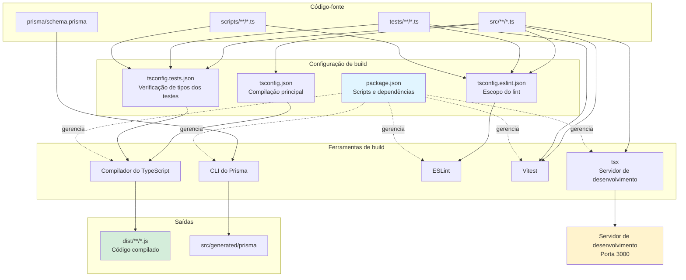
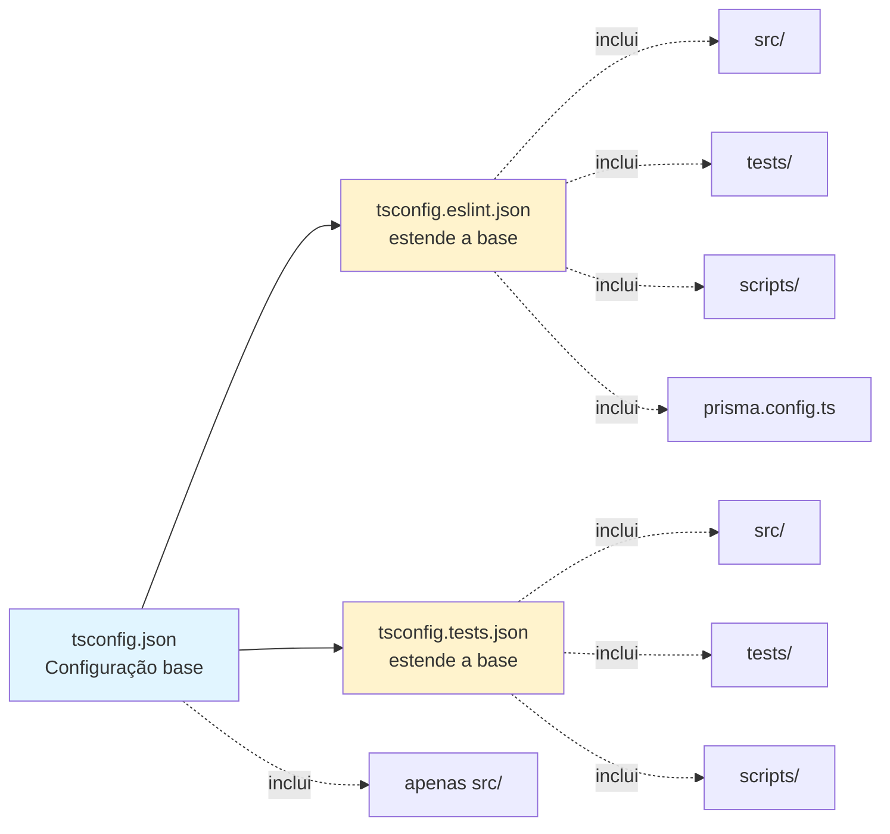
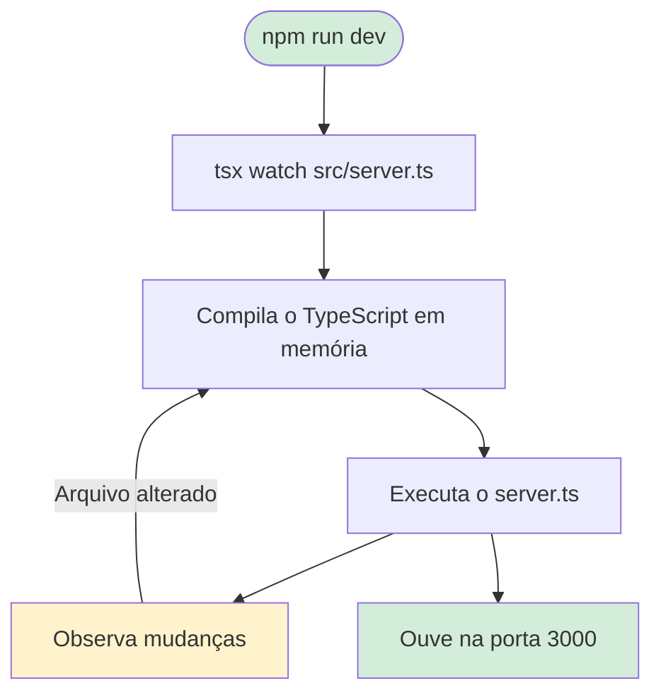
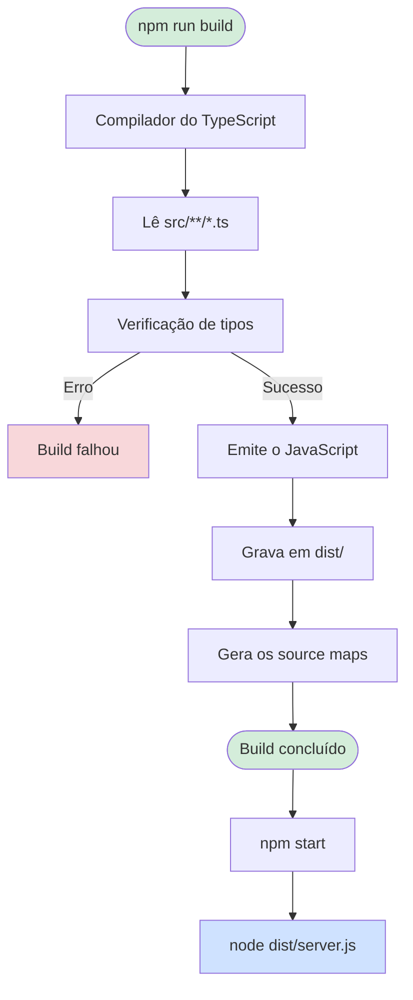
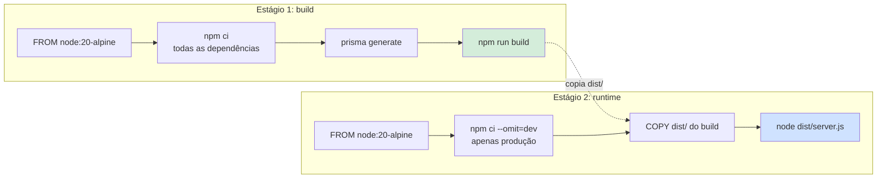
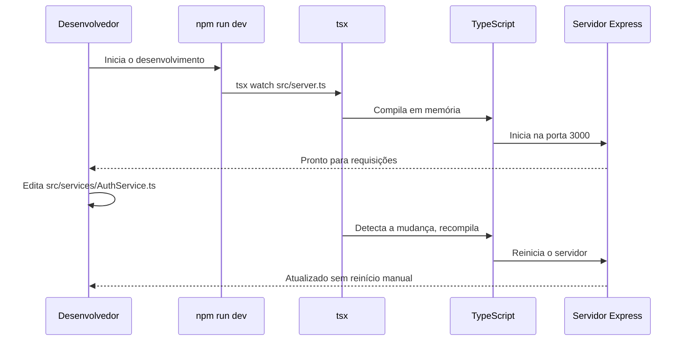
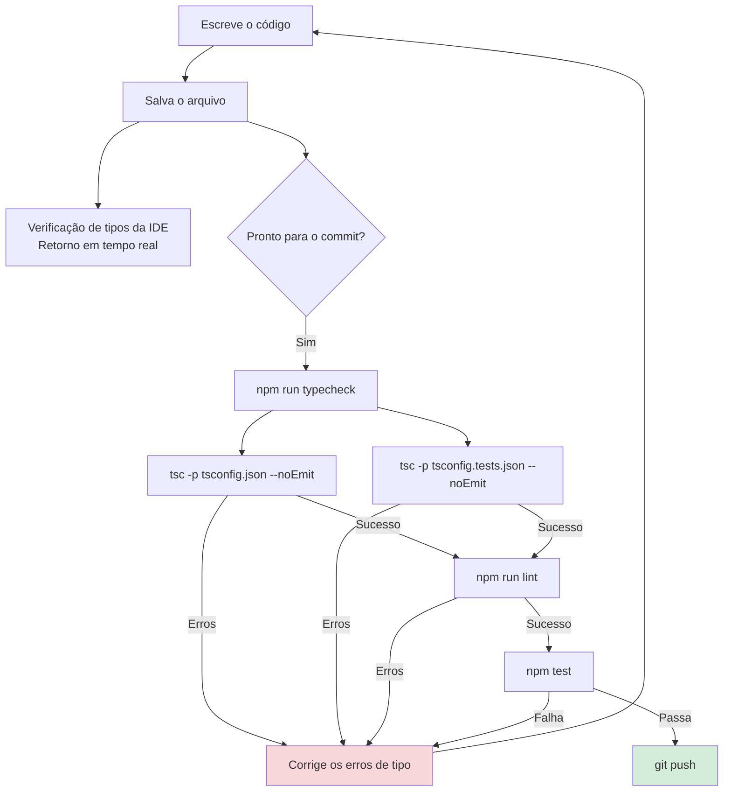
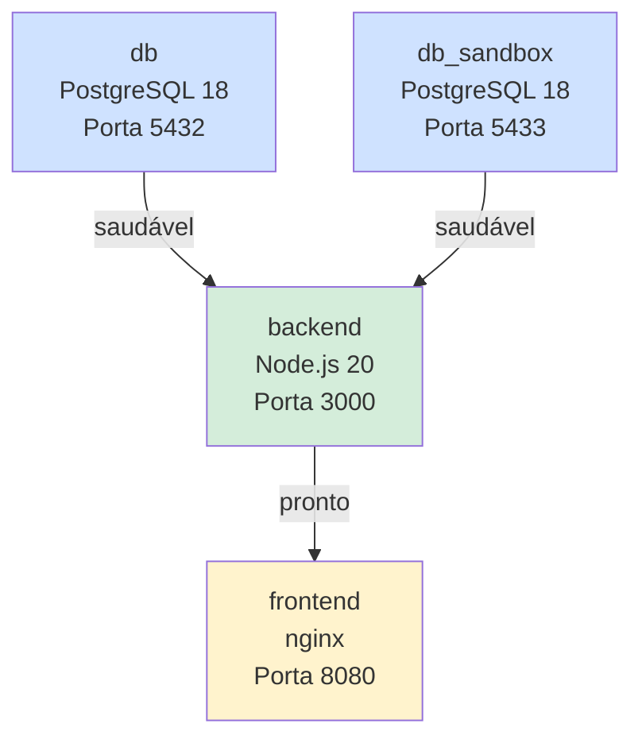
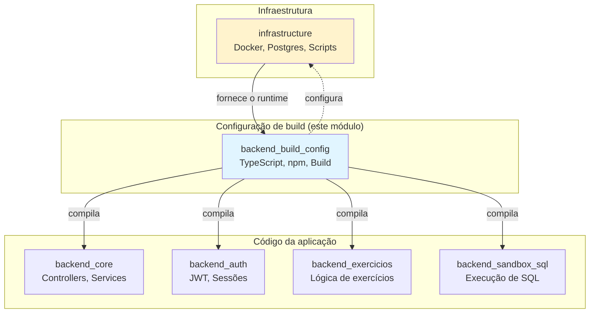
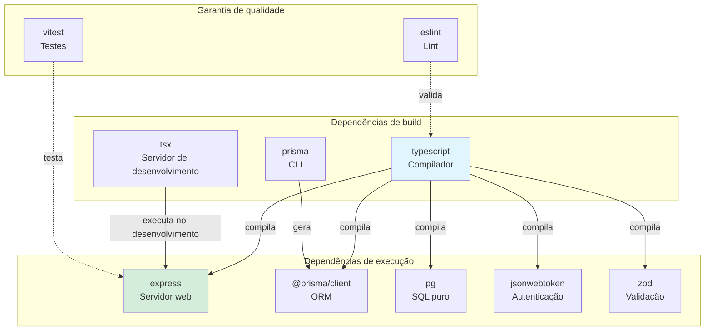

# Configuração de build do backend

O módulo `backend_build_config` define a infraestrutura de build, de desenvolvimento e de testes do backend da IDE Web. Ele abrange as configurações de compilação do TypeScript, os scripts npm, a gestão de dependências e o pipeline de build que transforma o código-fonte em artefatos prontos para produção.

---

## Sumário

1. [Finalidade e funcionalidade principal](#finalidade-e-funcionalidade-principal)
2. [Visão geral da arquitetura](#visão-geral-da-arquitetura)
3. [Configuração do package.json](#configuração-do-packagejson)
4. [Configurações do TypeScript](#configurações-do-typescript)
5. [Pipeline de build](#pipeline-de-build)
6. [Fluxo de desenvolvimento](#fluxo-de-desenvolvimento)
7. [Integração com o sistema](#integração-com-o-sistema)
8. [Dependências](#dependências)

---

## Finalidade e funcionalidade principal

A configuração de build do backend cumpre três funções principais:

1. **Ambiente de desenvolvimento**: oferece um servidor de desenvolvimento com hot-reload e suporte a TypeScript por meio do `tsx`
2. **Build de produção**: compila o TypeScript para JavaScript CommonJS otimizado, para o runtime do Node.js
3. **Garantia de qualidade**: viabiliza a verificação de tipos, o lint e os testes em toda a base de código

### Características principais

- **Sistema de módulos**: CommonJS (`type: "commonjs"`), por compatibilidade com o Node.js
- **Versão do TypeScript**: 5.6.3, com modo estrito habilitado
- **Requisito do Node.js**: >= 20 (usando recursos modernos do ECMAScript)
- **Saída do build**: JavaScript compilado no diretório `dist/`
- **Ponto de entrada**: `dist/server.js` em produção, `src/server.ts` no desenvolvimento

---

## Visão geral da arquitetura



### Hierarquia de configuração



---

## Configuração do package.json

**Arquivo**: `ide-web-backend/package.json`

### Scripts

| Script | Comando | Finalidade |
|--------|---------|---------|
| `dev` | `tsx watch src/server.ts` | Servidor de desenvolvimento com hot reload |
| `build` | `tsc -p tsconfig.json` | Compila o TypeScript para JavaScript |
| `start` | `node dist/server.js` | Executa o build de produção |
| `test` | `vitest run` | Executa a suíte de testes uma vez |
| `lint` | `eslint .` | Verifica o estilo e os padrões do código |
| `typecheck` | `tsc -p tsconfig.json --noEmit && tsc -p tsconfig.tests.json --noEmit` | Valida os tipos sem emitir arquivos |

### Detalhes dos scripts de build

```bash
# Desenvolvimento: hot reload com execução do TypeScript
npm run dev
# → tsx watch src/server.ts
# Observa mudanças de arquivo e reinicia automaticamente

# Build de produção: compila para JavaScript
npm run build
# → tsc -p tsconfig.json
# Gera a saída no diretório dist/

# Verificação de tipos: valida os tipos em todo o código
npm run typecheck
# → tsc --noEmit nas configurações principal e de testes
# Verifica src/, tests/ e scripts/
```

### Requisitos do motor

```json
{
  "engines": {
    "node": ">=20"
  }
}
```

Exige o Node.js 20 ou superior, por causa de:
- Recursos modernos do ECMAScript (ES2022)
- API fetch nativa
- Desempenho melhorado
- Suporte LTS atual

---

## Configurações do TypeScript

### 1. Configuração principal (`tsconfig.json`)

**Finalidade**: compila o código de produção de `src/` para `dist/`

**Configurações principais**:

```json
{
  "compilerOptions": {
    "target": "ES2022",              // Recursos modernos do JavaScript
    "module": "node16",              // Resolução de módulos do Node.js
    "moduleResolution": "node16",    // Coincide com o comportamento do Node.js 20
    "lib": ["ES2022"],               // Biblioteca padrão do ECMAScript 2022
    "outDir": "dist",                // Diretório de saída compilada
    "rootDir": "src",                // Raiz do código-fonte
    "strict": true,                  // Todas as verificações estritas de tipo habilitadas
    "noUncheckedIndexedAccess": true, // Segurança na indexação de arrays/objetos
    "noImplicitOverride": true,      // Exige a palavra-chave override explícita
    "exactOptionalPropertyTypes": true, // Distingue undefined de ausente
    "esModuleInterop": true,         // Compatibilidade entre CommonJS e módulos ES
    "skipLibCheck": true,            // Ignora a verificação de arquivos .d.ts
    "forceConsistentCasingInFileNames": true, // Imports sensíveis a maiúsculas e minúsculas
    "resolveJsonModule": true,       // Permite importar arquivos JSON
    "declaration": false,            // Não precisa de arquivos .d.ts
    "sourceMap": true                // Gera source maps para depuração
  },
  "include": ["src"],
  "exclude": ["node_modules", "dist", "tests"]
}
```

**Recursos do modo estrito**:
- `strict`: habilita todas as opções estritas de verificação de tipos
- `noUncheckedIndexedAccess`: impede o acesso não verificado a arrays/objetos
- `exactOptionalPropertyTypes`: garante que `{ foo?: string }` não aceite `undefined` explicitamente
- `noImplicitOverride`: exige a palavra-chave `override` ao sobrescrever métodos da classe base

### 2. Configuração do ESLint (`tsconfig.eslint.json`)

**Finalidade**: estende a verificação de tipos a todos os arquivos, para o lint

```json
{
  "extends": "./tsconfig.json",
  "compilerOptions": {
    "noEmit": true  // Só verifica os tipos, não compila
  },
  "include": ["src", "tests", "prisma.config.ts", "scripts"],
  "exclude": ["node_modules", "dist"]
}
```

**Ampliação do escopo**:
- Inclui `tests/` para a verificação de tipos dos testes durante o lint
- Inclui `scripts/` para a validação dos scripts de build/migração
- Inclui `prisma.config.ts` para a verificação de tipos da configuração do Prisma
- Continua excluindo a saída da compilação e as dependências

### 3. Configuração dos testes (`tsconfig.tests.json`)

**Finalidade**: verificação de tipos dos arquivos de teste

```json
{
  "extends": "./tsconfig.json",
  "compilerOptions": {
    "noEmit": true,    // Só verifica os tipos
    "rootDir": "."     // Permite imports a partir de tests/
  },
  "include": ["src", "tests", "scripts"],
  "exclude": ["node_modules", "dist"]
}
```

**Configurações específicas dos testes**:
- `rootDir: "."` permite que os arquivos de teste importem tanto de `src/` quanto de `tests/`
- `noEmit: true`, já que os testes rodam pelo Vitest, e não pela saída compilada
- Inclui os arquivos de código-fonte e de teste, para validação cruzada

---

## Pipeline de build

### Fluxo do build de desenvolvimento



**Processo de desenvolvimento**:
1. O `tsx watch` inicia o servidor de desenvolvimento
2. O TypeScript é compilado em memória (sem saída em disco)
3. O servidor inicia na porta 3000
4. O observador de arquivos monitora o `src/` em busca de mudanças
5. Ao mudar: recompila e reinicia automaticamente
6. Nenhum diretório `dist/` é criado

### Fluxo do build de produção



**Etapas do build de produção**:
1. O `tsc -p tsconfig.json` lê a configuração
2. Compila todos os arquivos `src/**/*.ts`
3. Valida os tipos (falha em erros de tipo)
4. Emite o JavaScript em `dist/` (preservando a estrutura de diretórios)
5. Gera os source maps (arquivos `.js.map`)
6. O servidor de produção executa o código compilado por `node dist/server.js`

### Build Docker multi-estágio

**Arquivo**: `ide-web-backend/Dockerfile`



**Estágio de build** (`ide-web-backend/Dockerfile:1-12`):
```dockerfile
FROM node:20-alpine AS build
WORKDIR /app

COPY package.json package-lock.json ./
RUN npm ci

COPY prisma ./prisma
RUN npx prisma generate

COPY tsconfig.json ./
COPY src ./src
RUN npm run build
```

**Estágio de runtime** (`ide-web-backend/Dockerfile:14-24`):
```dockerfile
FROM node:20-alpine AS runtime
WORKDIR /app
ENV NODE_ENV=production

COPY package.json package-lock.json ./
RUN npm ci --omit=dev

COPY --from=build /app/dist ./dist

EXPOSE 3000
CMD ["node", "dist/server.js"]
```

**Benefícios da otimização**:
- **Imagem menor**: o estágio de runtime exclui as devDependencies (~40% de redução)
- **Segurança**: sem compilador do TypeScript nem ferramentas de build em produção
- **Cache de camadas**: as dependências ficam em cache separadas do código-fonte
- **Saída limpa**: apenas o JavaScript compilado e as dependências de produção

---

## Fluxo de desenvolvimento

### Desenvolvimento local



**Etapas do fluxo**:
1. Execute `npm run dev` para iniciar o servidor de desenvolvimento
2. O servidor inicia em `http://localhost:3000`
3. Edite qualquer arquivo `.ts` em `src/`
4. O `tsx` detecta a mudança e recompila automaticamente
5. O servidor reinicia com o código novo
6. Nenhum reinício manual é necessário

### Fluxo de verificação de tipos



### Fluxo de testes

```bash
# Executa todos os testes uma vez
npm test
# → vitest run

# Modo de observação para TDD
npm run test:watch  # (não está no package.json, mas o vitest aceita)

# Verifica os tipos dos testes sem executá-los
npm run typecheck
# Valida os tipos dos arquivos de teste pelo tsconfig.tests.json
```

---

## Integração com o sistema

### Integração com o Docker Compose

**Arquivo**: `docker-compose.yml:42-65`

```yaml
backend:
  build:
    context: ./ide-web-backend  # Usa o Dockerfile deste diretório
  environment:
    NODE_ENV: production
    PORT: 3000
    # ... variáveis de ambiente
  ports:
    - "3000:3000"
  depends_on:
    db:
      condition: service_healthy  # Espera o banco principal
    db_sandbox:
      condition: service_healthy  # Espera o banco do sandbox
```

**Contexto de build**:
- `context: ./ide-web-backend` aponta para o diretório que contém o `Dockerfile` e o `package.json`
- O build do Docker executa `npm run build` no estágio de build
- O estágio de runtime executa `node dist/server.js`

**Dependências entre serviços**:



### Relação com outros módulos



**Relações entre módulos**:

- **[infrastructure](infrastructure.md)**: fornece os contêineres Docker e os serviços de banco de dados em que o backend compilado executa
- **[backend_core](backend_core.md)**: código da aplicação compilado por este módulo
- **[backend_auth](backend_auth.md)**: serviços de autenticação compilados por este módulo
- **[backend_exercicios](backend_exercicios.md)**: gestão de exercícios compilada por este módulo
- **[backend_sandbox_sql](backend_sandbox_sql.md)**: sandbox SQL compilado por este módulo

---

## Dependências

### Dependências de produção

**Framework principal**:
- **express** (^4.21.1): framework web e servidor da API REST
- **cors** (^2.8.5): middleware de Cross-Origin Resource Sharing
- **cookie-parser** (^1.4.7): interpreta os cookies HTTP dos tokens de renovação JWT
- **dotenv** (^16.4.5): gestão de variáveis de ambiente

**Banco de dados e ORM**:
- **@prisma/client** (^7.9.1): cliente do ORM Prisma
- **@prisma/adapter-pg** (^7.9.1): adaptador de driver PostgreSQL para o Prisma
- **pg** (^8.23.0): cliente PostgreSQL para SQL puro (execução no sandbox)

**Segurança e autenticação**:
- **bcryptjs** (^3.0.3): hash de senhas
- **jsonwebtoken** (^9.0.3): geração e validação de tokens JWT

**Validação e segurança de tipos**:
- **zod** (^3.23.8): validação de schemas em tempo de execução para os DTOs

**Geração de documentos**:
- **pdfkit** (^0.20.1): gera os pacotes em PDF dos exercícios

### Dependências de desenvolvimento

**TypeScript**:
- **typescript** (^5.6.3): compilador do TypeScript
- **tsx** (^4.19.2): execução do TypeScript no desenvolvimento
- **@types/\***: definições de tipos para bibliotecas JavaScript

**Lint**:
- **eslint** (^9.14.0): verificação de qualidade e de estilo do código
- **@eslint/js** (^9.14.0): configuração JavaScript do ESLint
- **typescript-eslint** (^8.13.0): regras do ESLint específicas para TypeScript

**Testes**:
- **vitest** (^2.1.4): executor rápido de testes unitários
- **supertest** (^7.0.0): biblioteca de asserções HTTP para testes de integração

**Ferramentas de banco de dados**:
- **prisma** (^7.9.1): CLI do Prisma para migrações e gestão de schema

### Grafo de dependências



---

## Referência dos arquivos de configuração

| Arquivo | Finalidade | Estende | Inclui | Saída |
|------|---------|---------|----------|--------|
| `tsconfig.json` | Compilação principal | - | `src/` | `dist/` |
| `tsconfig.eslint.json` | Escopo do lint | `tsconfig.json` | `src/`, `tests/`, `scripts/`, `prisma.config.ts` | Nenhuma (noEmit) |
| `tsconfig.tests.json` | Verificação de tipos dos testes | `tsconfig.json` | `src/`, `tests/`, `scripts/` | Nenhuma (noEmit) |
| `package.json` | Dependências e scripts | - | Todo o código-fonte | Árvore de dependências |

---

## Saídas do build

### Modo de desenvolvimento (`npm run dev`)

**Arquivos gerados**: nenhum (compilação em memória)

**Runtime**:
- Porta: 3000
- Processo: `tsx watch src/server.ts`
- Source maps: em memória
- Node modules: todas as dependências (dev + prod)

### Build de produção (`npm run build`)

**Arquivos gerados**:

```
dist/
├── server.js              # Ponto de entrada
├── server.js.map          # Source map
├── app.js                 # Aplicação Express
├── app.js.map
├── config/
│   ├── env.js
│   └── env.js.map
├── controllers/
│   ├── AuthController.js
│   ├── ExercicioController.js
│   └── ...
├── services/
│   ├── AuthService.js
│   └── ...
├── repositories/
├── models/
├── dtos/
├── errors/
├── middlewares/
├── routes/
├── utils/
└── lib/
```

**Características**:
- **Formato de módulo**: CommonJS (arquivos `.js` com `require`/`module.exports`)
- **Source maps**: um `.js.map` para cada `.js`
- **Sem TypeScript**: apenas JavaScript e source maps
- **Estrutura de diretórios**: espelha o layout de `src/`

### Camadas da imagem Docker

**Estágio de build** (~500 MB):
- Base: `node:20-alpine`
- Dependências: todos os pacotes npm
- Código-fonte: arquivos TypeScript
- Artefatos de build: diretório `dist/`

**Estágio de runtime** (~150 MB):
- Base: `node:20-alpine`
- Dependências: apenas os pacotes npm de produção
- Código: apenas o JavaScript de `dist/`
- **60% menor** que o estágio de build

---

## Boas práticas

### Configuração do TypeScript

✅ **Faça**:
- Mantenha o modo estrito habilitado, por segurança de tipos
- Use o `noUncheckedIndexedAccess` para evitar erros em tempo de execução
- Habilite os source maps para depuração em produção
- Separe as configurações de testes e principal

❌ **Não faça**:
- Desabilitar as verificações estritas para contornar erros de tipo
- Misturar configurações de `rootDir` entre as configs
- Incluir `tests/` na compilação principal
- Emitir arquivos `.d.ts` (não é uma biblioteca)

### Processo de build

✅ **Faça**:
- Execute `npm run typecheck` antes de fazer commit
- Use `npm ci` em vez de `npm install` no CI/Docker
- Mantenha as devDependencies separadas das dependencies
- Gere o cliente Prisma antes de compilar

❌ **Não faça**:
- Versionar o diretório `dist/` no git
- Misturar builds de desenvolvimento e de produção
- Pular a verificação de tipos no pipeline de CI
- Executar `npm install` em produção

### Uso dos scripts

**Desenvolvimento**:
```bash
npm run dev          # Desenvolvimento com hot reload
npm run typecheck    # Valida os tipos
npm run lint         # Verifica o estilo do código
npm test             # Executa os testes
```

**CI/CD**:
```bash
npm ci               # Instalação limpa das dependências
npm run typecheck    # Validação de tipos
npm run lint         # Qualidade do código
npm test             # Suíte de testes
npm run build        # Build de produção
```

**Produção**:
```bash
npm ci --omit=dev    # Instala apenas as dependências de produção
npm start            # Executa o código compilado
```

---

## Solução de problemas

### Problemas comuns

**Problema**: `Cannot find module 'src/...'`
- **Causa**: resolução de módulo incorreta ou arquivo compilado ausente
- **Correção**: execute `npm run build` para compilar o TypeScript

**Problema**: erros de tipo nos testes, mas não na IDE
- **Causa**: uso de versão ou configuração diferente do TypeScript
- **Correção**: execute `npm run typecheck` para usar as configurações do projeto

**Problema**: o build do Docker falha no prisma generate
- **Causa**: schema do Prisma ausente ou URL do banco ausente
- **Correção**: garanta que o `prisma/schema.prisma` seja copiado antes da geração

**Problema**: o hot reload não funciona
- **Causa**: o `tsx` não está observando as mudanças nos arquivos
- **Correção**: confira se o arquivo está no diretório `src/` e reinicie o servidor de desenvolvimento

### Comandos de validação

```bash
# Verifica a configuração do TypeScript
npx tsc --version          # Deve ser 5.6.3
npx tsc --showConfig       # Mostra a configuração resolvida

# Verifica a árvore de dependências
npm list --depth=0         # Mostra os pacotes instalados

# Valida o build do Docker
docker build -t test-backend ./ide-web-backend
docker run --rm test-backend node --version  # Deve ser v20.x
```

---

## Veja também

- **[infrastructure](infrastructure.md)**: Docker Compose e orquestração de contêineres
- **[backend_core](backend_core.md)**: estrutura central da aplicação e classes base
- **[backend_errors](backend_errors.md)**: tratamento de erros compilado por este módulo
- **[backend_auth](backend_auth.md)**: serviços de autenticação que usam o JWT das dependências

---

**Módulo**: `backend_build_config`  
**Última atualização**: 2026-09-21  
**Decisão relacionada**: [Fase 1 - Setup Técnico](../../docs/decisions/fase1-setup-tecnico.md)
