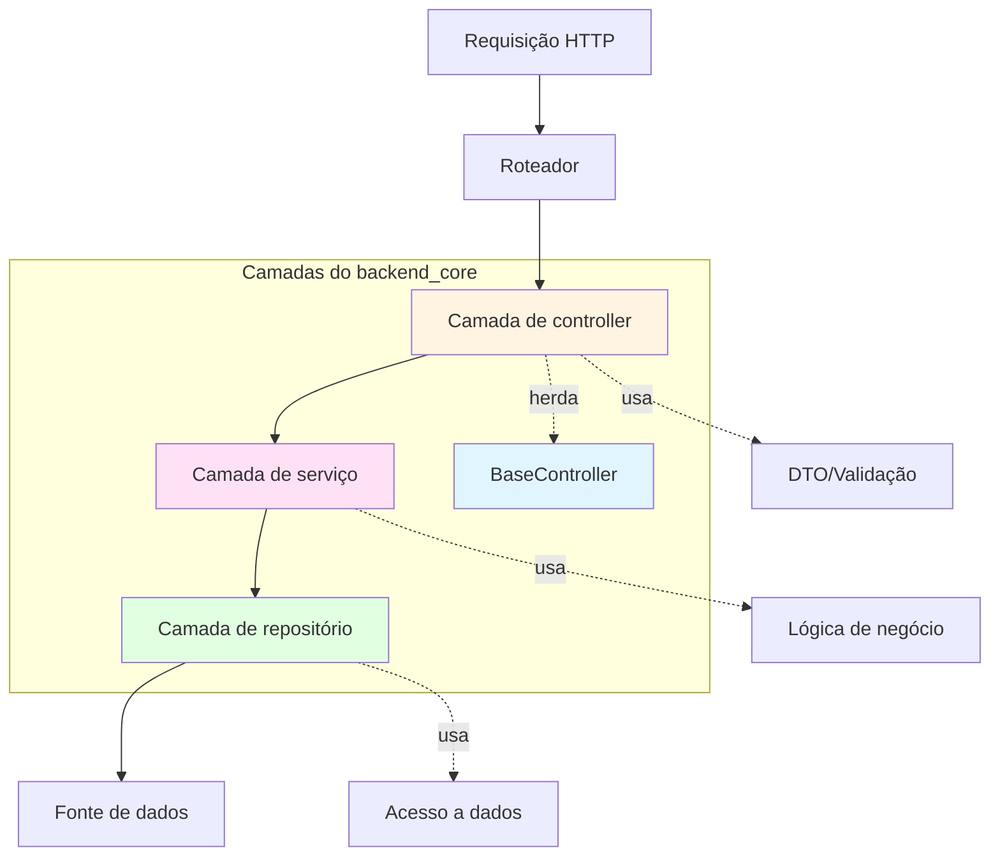
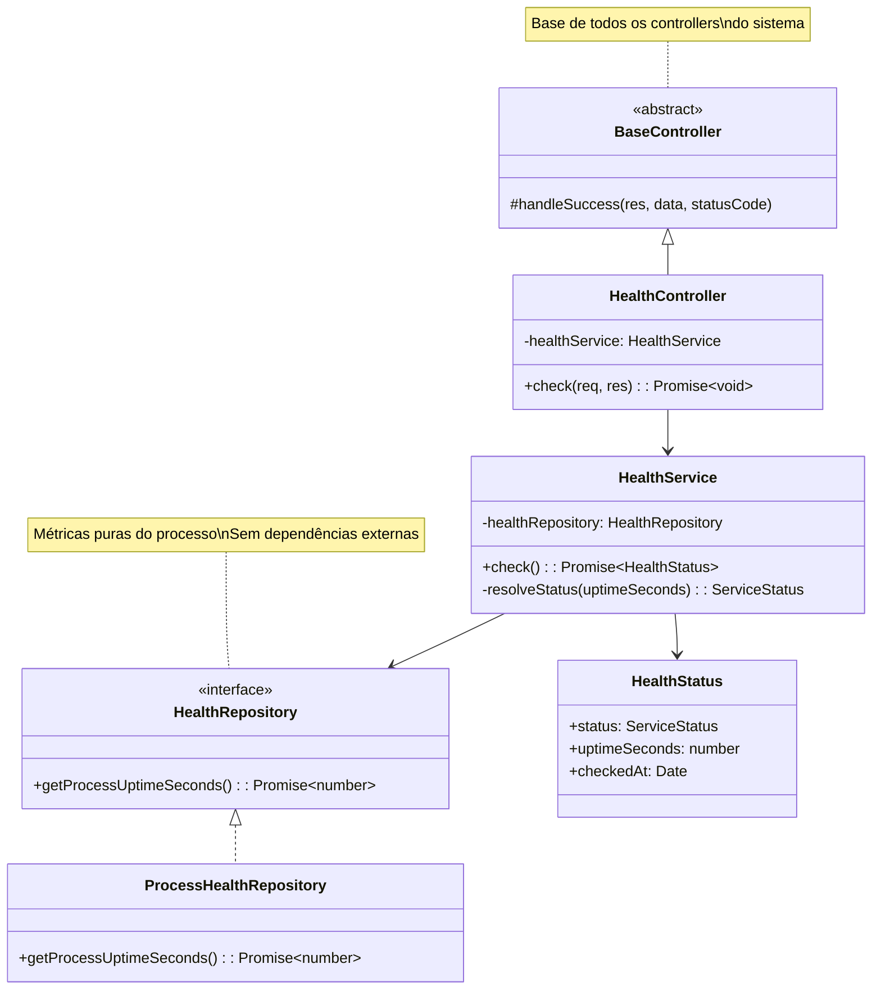
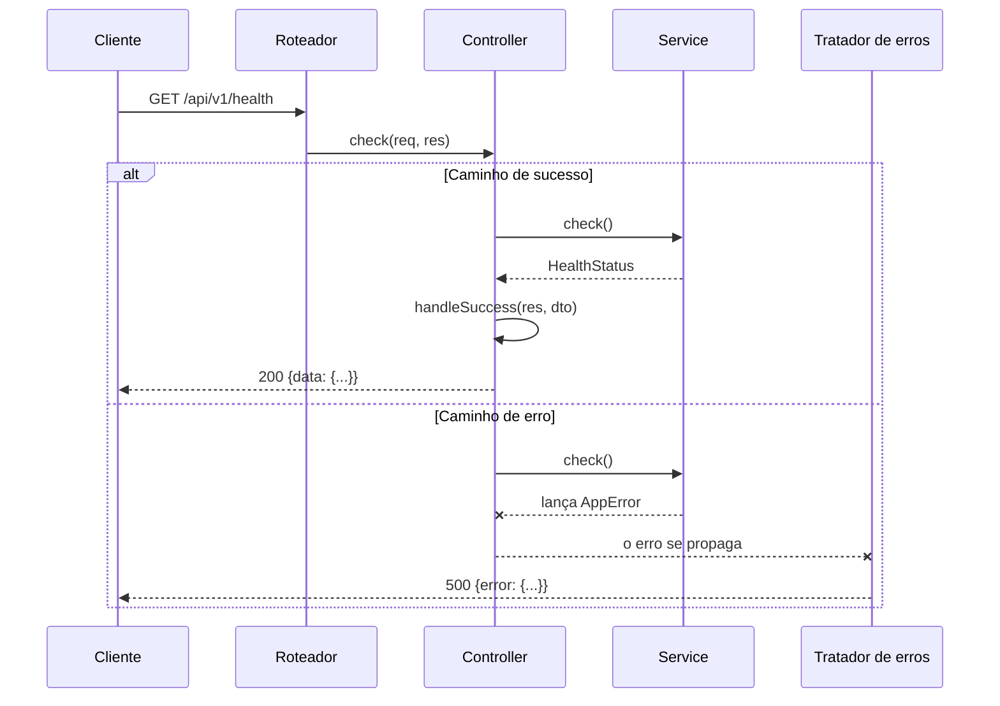
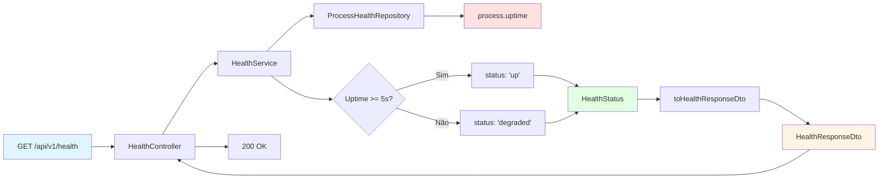
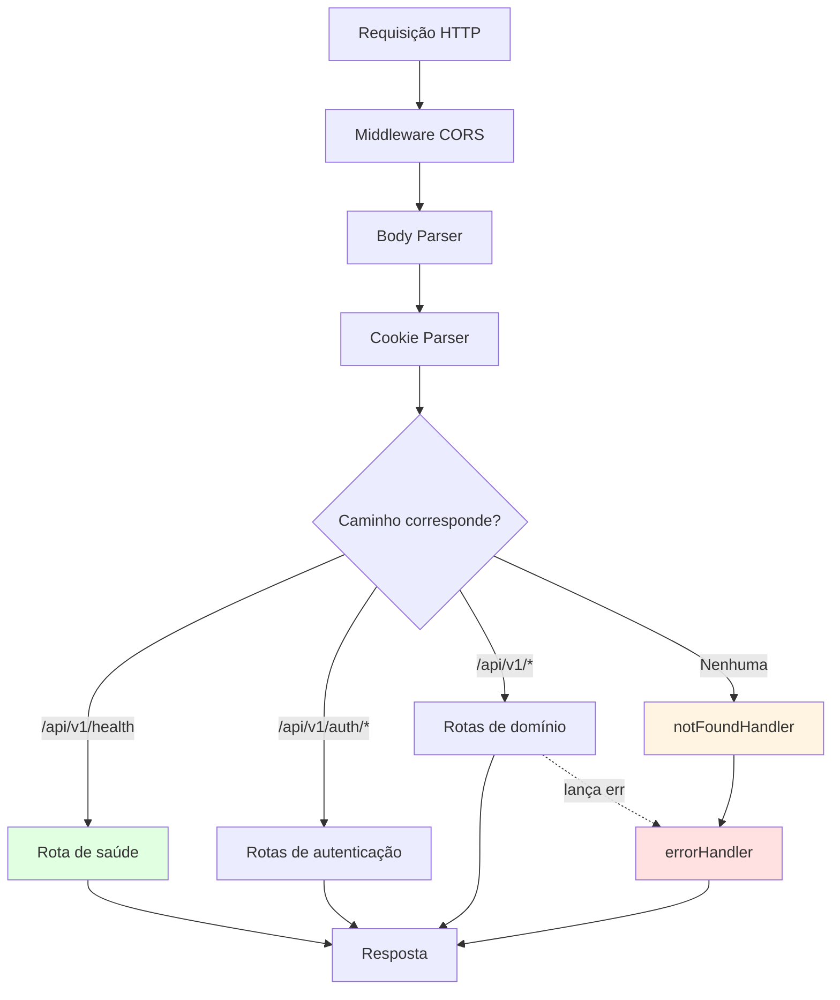
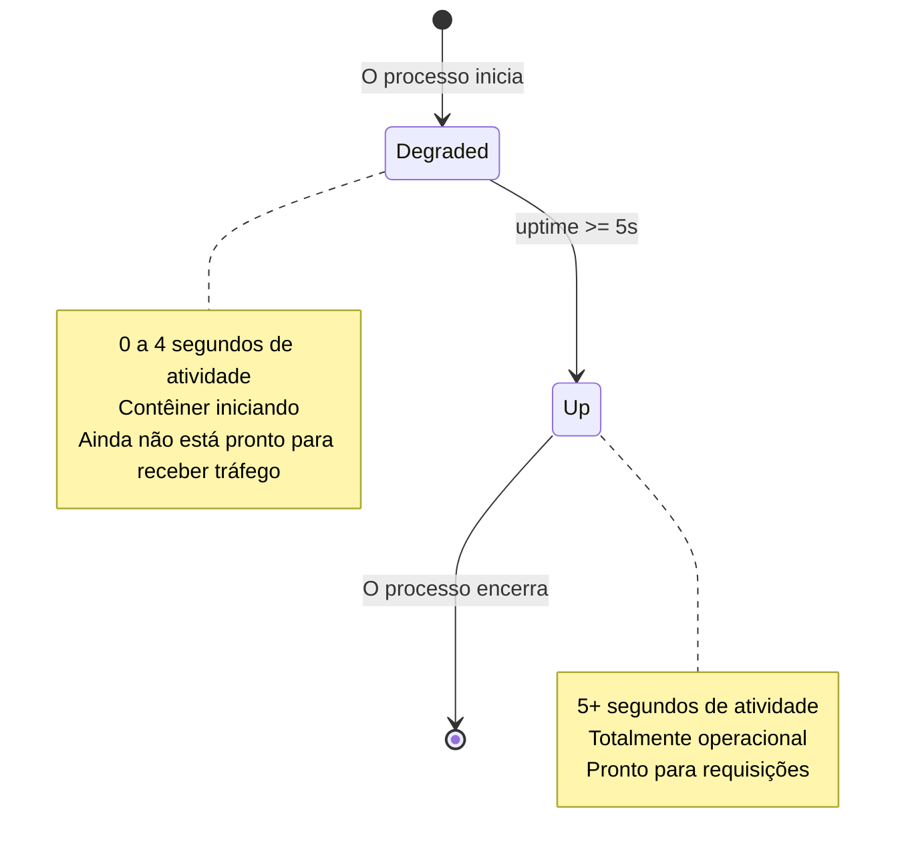
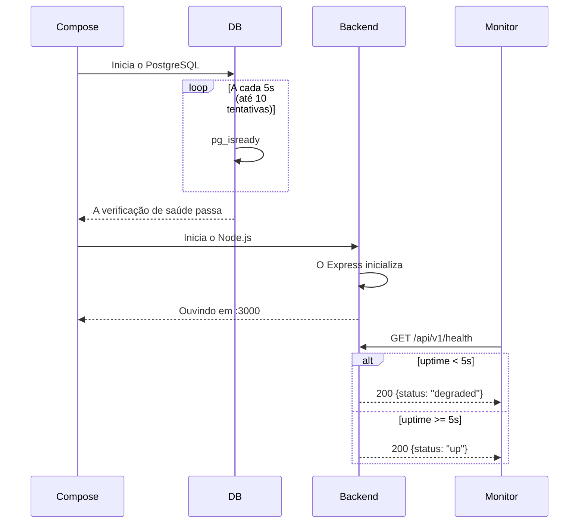
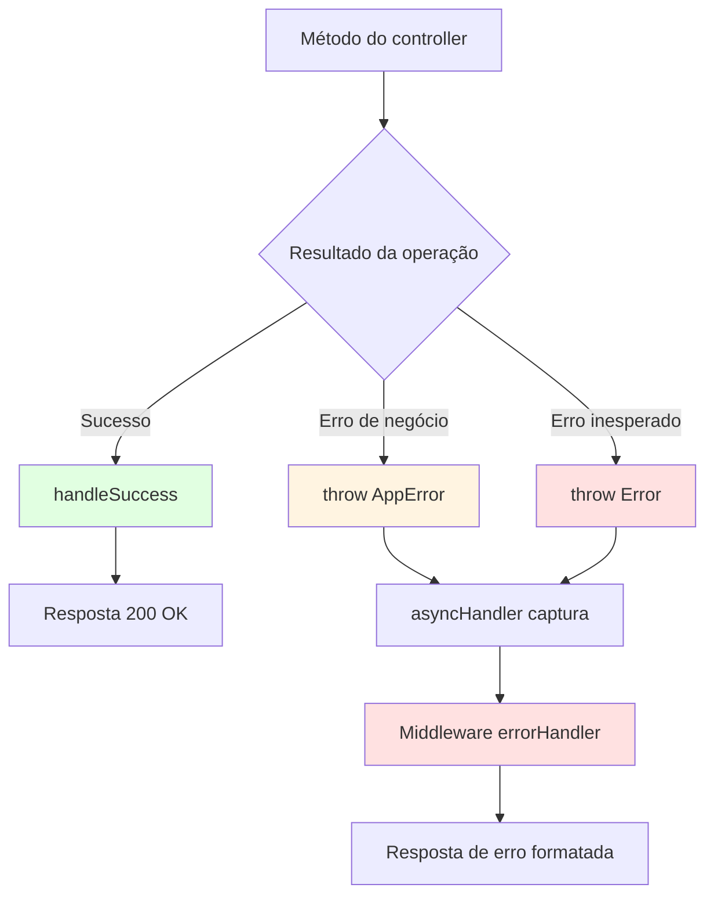
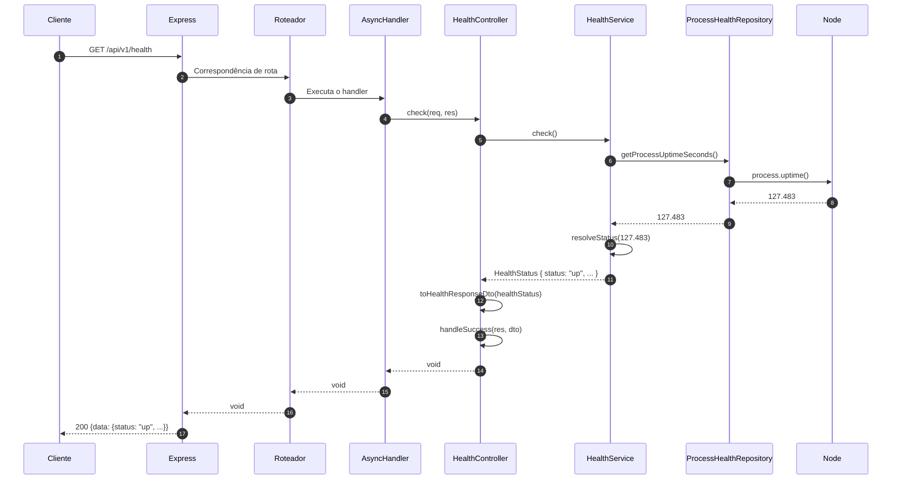
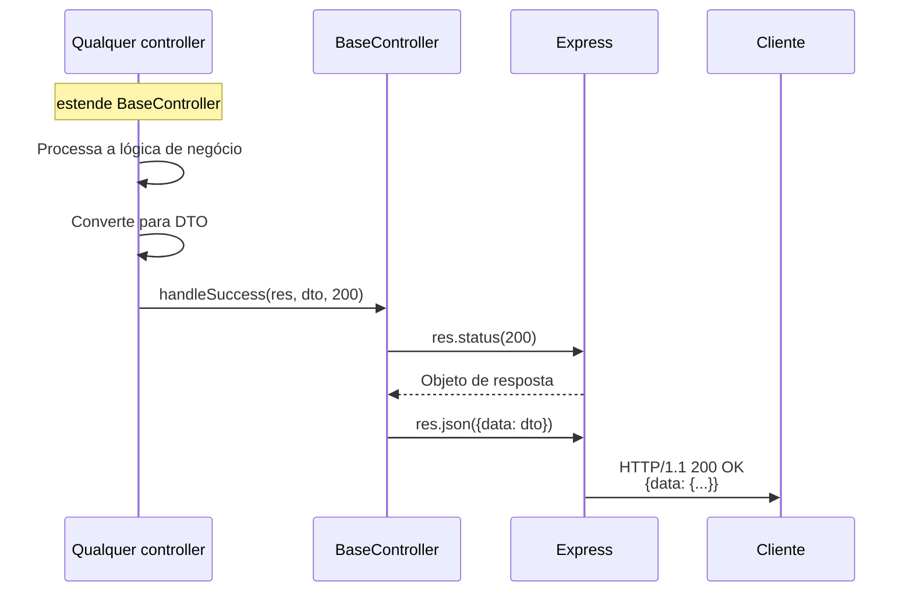

# Módulo Backend Core

**Base da plataforma e monitoramento de saúde**

O módulo `backend_core` é a base arquitetural do backend da IDE Web: estabelece os padrões fundamentais e oferece o monitoramento de saúde de toda a aplicação Node.js/Express/TypeScript. Este módulo demonstra a arquitetura Model-Service-Controller (MSC) que todos os outros módulos do backend seguem.

---

## Sumário

- [Visão geral](#visão-geral)
- [Arquitetura](#arquitetura)
  - [Implementação do padrão MSC](#implementação-do-padrão-msc)
  - [Hierarquia de componentes](#hierarquia-de-componentes)
- [Componentes principais](#componentes-principais)
  - [BaseController](#basecontroller)
  - [Sistema de health check](#sistema-de-health-check)
- [Pontos de integração](#pontos-de-integração)
- [Monitoramento de saúde](#monitoramento-de-saúde)
  - [Estados do serviço](#estados-do-serviço)
  - [Orquestração de contêineres](#orquestração-de-contêineres)
- [Referência da API](#referência-da-api)
- [Implantação](#implantação)
- [Módulos relacionados](#módulos-relacionados)

---

## Visão geral

### Finalidade

O módulo `backend_core` cumpre três funções críticas:

1. **Modelo arquitetural**: oferece o `BaseController` como base de todos os controllers HTTP do sistema
2. **Monitoramento de saúde**: implementa verificações de saúde padronizadas para a orquestração de contêineres e para os sistemas de monitoramento
3. **Referência de padrão**: demonstra o padrão completo de camadas MSC (Model-Service-Controller) usado em todo o backend

### Stack tecnológica

- **Runtime**: Node.js 20+ (Alpine Linux nos contêineres)
- **Framework**: Express 4.x
- **Linguagem**: TypeScript com verificação estrita de tipos
- **Arquitetura**: padrão MSC (Model-Service-Controller)
- **Implantação**: contêineres Docker com verificações de saúde

### Características principais

- **Zero dependências**: a verificação de saúde não exige serviços externos (banco, cache etc.)
- **Sem estado**: opera apenas sobre métricas do próprio processo
- **Falhar rápido (fail-fast)**: distingue o estado de inicialização (`degraded`) do estado operacional
- **Extensível**: o `BaseController` oferece uma interface uniforme para todos os controllers de domínio

---

## Arquitetura

### Implementação do padrão MSC

O módulo demonstra o padrão completo de camadas MSC que rege toda a base de código do backend:



**Responsabilidades das camadas:**

| Camada | Responsabilidade | Exemplo no backend_core |
|-------|---------------|------------------------|
| **Controller** | Tratamento do protocolo HTTP, mapeamento de requisição e resposta | `HealthController` |
| **Service** | Lógica de negócio, orquestração, regras de domínio | `HealthService` |
| **Repository** | Abstração do acesso a dados, lógica de persistência | `ProcessHealthRepository` |
| **Model** | Entidades de domínio, objetos de valor | `HealthStatus` |
| **DTO** | Contrato da API, schemas de validação | `HealthResponseDto` |

### Hierarquia de componentes



---

## Componentes principais

### BaseController

**Localização**: `ide-web-backend/src/controllers/BaseController.ts`

**Finalidade**: classe base abstrata que oferece um tratamento padronizado das respostas a todos os controllers HTTP.

#### Implementação

```typescript
abstract class BaseController {
  protected handleSuccess(res: Response, data: unknown, statusCode: number = 200): void {
    res.status(statusCode).json({ data });
  }
}
```

#### Princípios de projeto

1. **Formato de resposta uniforme**: todas as respostas de sucesso seguem o padrão de envelope `{ data: T }` (veja o [ApiEnvelope](frontend_shared.md#cliente-http-libhttpclientts))
2. **Acesso protegido**: o `handleSuccess` é `protected`, o que garante que só as subclasses de controller o usem
3. **Código de status padrão**: devolve HTTP 200 por padrão, podendo ser substituído por 201 (Created), 202 (Accepted) etc.
4. **Segurança de tipos**: aceita dados do tipo `unknown`, deixando o TypeScript inferir a partir dos DTOs

#### Padrão de uso

Todos os controllers do sistema estendem o `BaseController`:

```typescript
export class HealthController extends BaseController {
  check = async (_req: Request, res: Response): Promise<void> => {
    const healthStatus = await this.healthService.check();
    this.handleSuccess(res, toHealthResponseDto(healthStatus));
  };
}
```

#### Integração com o tratamento de erros

As respostas de sucesso usam o `BaseController.handleSuccess`, enquanto os erros são lançados e capturados pelo tratador global de erros (veja o módulo [backend_errors](backend_errors.md)):



---

### Sistema de health check

O sistema de health check dá suporte à orquestração de contêineres e à visibilidade operacional por meio de um endpoint sem estado e sem dependências.

#### Estrutura dos componentes



#### Modelo HealthStatus

**Localização**: `ide-web-backend/src/models/HealthStatus.ts`

```typescript
type ServiceStatus = 'up' | 'degraded' | 'down';

interface HealthStatus {
  status: ServiceStatus;
  uptimeSeconds: number;
  checkedAt: Date;
}
```

**Semântica dos estados:**

- **`up`**: o serviço está em execução há pelo menos 5 segundos e está operacional
- **`degraded`**: o serviço está na fase de inicialização (menos de 5 segundos de atividade)
- **`down`**: não é devolvido por esta implementação no momento (reservado para uso futuro)

#### Lógica do HealthService

**Localização**: `ide-web-backend/src/services/HealthService.ts`

```typescript
const MINIMUM_STABLE_UPTIME_SECONDS = 5;

async check(): Promise<HealthStatus> {
  const uptimeSeconds = await this.healthRepository.getProcessUptimeSeconds();
  
  return {
    status: this.resolveStatus(uptimeSeconds),
    uptimeSeconds,
    checkedAt: new Date(),
  };
}

private resolveStatus(uptimeSeconds: number): ServiceStatus {
  if (uptimeSeconds < MINIMUM_STABLE_UPTIME_SECONDS) {
    return 'degraded';
  }
  return 'up';
}
```

**Justificativa do limiar de 5 segundos:**

- Distingue a fase de inicialização do estado operacional
- Evita sinais prematuros de "saudável" durante a inicialização
- Coincide com o tempo típico de inicialização de uma aplicação Express (conexões com o banco, configuração dos middlewares)
- Veja `docker-compose.yml:12-16` para a coordenação com as verificações de saúde do banco

#### ProcessHealthRepository

**Localização**: `ide-web-backend/src/repositories/HealthRepository.ts`

```typescript
interface HealthRepository {
  getProcessUptimeSeconds(): Promise<number>;
}

class ProcessHealthRepository implements HealthRepository {
  getProcessUptimeSeconds(): Promise<number> {
    return Promise.resolve(process.uptime());
  }
}
```

**Notas de projeto:**

- **Zero dependências externas**: usa o `process.uptime()` do Node.js, sem consultas a banco ou cache
- **Abstração por interface**: permite implementações futuras (por exemplo, verificações de saúde com testes de conectividade ao banco)
- **Retorno assíncrono**: baseado em Promise para manter o padrão de repositório uniforme em toda a base de código

#### HealthResponseDto

**Localização**: `ide-web-backend/src/dtos/health.dto.ts`

```typescript
const healthResponseSchema = z.object({
  status: z.enum(['up', 'degraded', 'down']),
  uptimeSeconds: z.number().nonnegative(),
  checkedAt: z.string().datetime(),
});

type HealthResponseDto = z.infer<typeof healthResponseSchema>;

function toHealthResponseDto(healthStatus: HealthStatus): HealthResponseDto {
  return {
    status: healthStatus.status,
    uptimeSeconds: healthStatus.uptimeSeconds,
    checkedAt: healthStatus.checkedAt.toISOString(),
  };
}
```

**Responsabilidades do DTO:**

1. **Serialização de datas**: converte `Date` em uma string ISO 8601 para o transporte em JSON
2. **Validação de schema**: o schema Zod documenta o contrato da API
3. **Segurança de tipos**: o tipo TypeScript derivado garante a correção em tempo de compilação

---

## Pontos de integração

### Com a inicialização da aplicação

**Localização**: `ide-web-backend/src/routes/health.routes.ts`

```typescript
const healthRepository = new ProcessHealthRepository();
const healthService = new HealthService(healthRepository);
const healthController = new HealthController(healthService);

export const healthRoutes = Router();
healthRoutes.get('/health', asyncHandler((req, res) => healthController.check(req, res)));
```

**Injeção de dependências:**

- Injeção manual por construtor (sem contêiner de DI)
- Instâncias únicas (singletons) criadas ao carregar o módulo
- O fluxo de dependências: Repository → Service → Controller

**Registro das rotas** (`ide-web-backend/src/routes/index.ts`):

```typescript
routes.use(healthRoutes);  // Registrada PRIMEIRO, antes da autenticação
routes.use(authRoutes);
routes.use(turmaRoutes);
// ... demais rotas
```

**Justificativa da primeira posição:**

- As verificações de saúde ignoram o middleware de autenticação
- Os sistemas de monitoramento precisam de acesso sem autenticação
- Falha cedo se a própria camada de roteamento estiver quebrada

### Com a pilha de middlewares

**Localização**: `ide-web-backend/src/app.ts`



**Ordem dos middlewares** (`ide-web-backend/src/app.ts:14-21`):

1. `cors()` - cabeçalhos CORS
2. `express.json()` - interpretação do corpo
3. `cookieParser()` - interpretação dos cookies
4. `routes` - rotas da aplicação (a verificação de saúde incluída)
5. `notFoundHandler` - respostas 404
6. `errorHandler` - formatação das respostas de erro

**Posição da verificação de saúde:**

- **Antes** do `notFoundHandler`: garante que o `/api/v1/health` corresponda a uma rota
- **Depois** dos parsers de corpo e de cookie: os parsers são leves, sem problema em incluí-los
- **Sem autenticação**: a verificação de saúde não exige o middleware `requireAuth`

---

## Monitoramento de saúde

### Estados do serviço



**Transições de estado:**

| De | Para | Gatilho | Duração |
|------|-----|---------|----------|
| `null` | `degraded` | Início do processo | Imediata |
| `degraded` | `up` | Passam 5 segundos | ~5s |
| `up` | `null` | O processo encerra | N/A |

**Sem o estado `down`:**

A implementação atual nunca devolve `down`. Esse estado está reservado para melhorias futuras, em que as verificações de saúde poderiam conferir:

- Conectividade com o banco de dados
- Disponibilidade de serviços externos
- Esgotamento de recursos (memória, descritores de arquivo)

### Orquestração de contêineres

**Integração com o Docker Compose** (`docker-compose.yml:42-65`):

```yaml
backend:
  build:
    context: ./ide-web-backend
  environment:
    NODE_ENV: production
    PORT: 3000
    # ... demais variáveis de ambiente
  ports:
    - "3000:3000"
  depends_on:
    db:
      condition: service_healthy
    db_sandbox:
      condition: service_healthy
```

**Pontos-chave:**

1. **`depends_on` com `condition: service_healthy`**: o backend espera as verificações de saúde do banco antes de iniciar
2. **Sem verificação de saúde explícita no serviço de backend**: o Compose não define um `healthcheck` para o próprio serviço de backend
3. **Verificação de saúde manual pela API**: os sistemas de monitoramento consultam o `GET /api/v1/health` diretamente

**Verificações de saúde do banco** (`docker-compose.yml:12-16`, `36-40`):

```yaml
db:
  healthcheck:
    test: ["CMD-SHELL", "pg_isready -U ide_app -d ide_web"]
    interval: 5s
    timeout: 5s
    retries: 10
```

**Sequência de inicialização:**



**Implantação em produção (Render):**

- Verificações de saúde configuradas no painel do Render
- Endpoint: `GET /api/v1/health`
- Esperado: HTTP 200 com `{"data": {"status": "up"}}`
- Ao atingir o limite de falhas, o contêiner é reiniciado

---

## Referência da API

### `GET /api/v1/health`

**Descrição**: devolve o estado de saúde atual do serviço de backend.

**Autenticação**: nenhuma (endpoint público)

**Requisição**:

```http
GET /api/v1/health HTTP/1.1
Host: localhost:3000
```

**Resposta de sucesso**:

```json
HTTP/1.1 200 OK
Content-Type: application/json

{
  "data": {
    "status": "up",
    "uptimeSeconds": 127.483,
    "checkedAt": "2026-09-22T14:32:15.823Z"
  }
}
```

**Schema da resposta**:

```typescript
{
  data: {
    status: "up" | "degraded" | "down",
    uptimeSeconds: number,  // Inteiro não negativo
    checkedAt: string       // Data e hora ISO 8601
  }
}
```

**Códigos de status**:

| Código | Significado | Cenário |
|------|---------|----------|
| `200 OK` | A verificação de saúde teve sucesso | Sempre (mesmo quando o status é `degraded`) |
| `500 Internal Server Error` | Falha inesperada | Nunca deveria acontecer (sem dependências externas) |

**Notas:**

- Sempre devolve `200 OK`, mesmo durante a inicialização (estado `degraded`)
- Os sistemas de monitoramento devem conferir o status HTTP **e** o campo `data.status`
- O `uptimeSeconds` reflete a vida do processo e volta a 0 quando o contêiner é reiniciado

---

## Implantação

### Configuração do contêiner

**Dockerfile** (`ide-web-backend/Dockerfile`):

```dockerfile
FROM node:20-alpine AS build
WORKDIR /app

COPY package.json package-lock.json ./
RUN npm ci

COPY prisma ./prisma
RUN npx prisma generate

COPY tsconfig.json ./
COPY src ./src
RUN npm run build

FROM node:20-alpine AS runtime
WORKDIR /app
ENV NODE_ENV=production

COPY package.json package-lock.json ./
RUN npm ci --omit=dev

COPY --from=build /app/dist ./dist

EXPOSE 3000
CMD ["node", "dist/server.js"]
```

**Estágios principais:**

1. **Estágio de build**: compilação do TypeScript, geração do cliente Prisma
2. **Estágio de runtime**: apenas dependências de produção, JavaScript compilado

**Implicações para a verificação de saúde:**

- O processo inicia imediatamente quando o contêiner executa
- Primeiros 5 segundos: `status: "degraded"`
- Depois de 5 segundos: `status: "up"`
- Não há comando de health check separado no Dockerfile (depende do endpoint HTTP)

### Variáveis de ambiente

**Configuração da verificação de saúde**: nenhuma necessária (usa métricas do próprio processo)

**Variáveis de ambiente relacionadas** (para o funcionamento completo do backend):

```bash
# Servidor
NODE_ENV=production
PORT=3000

# CORS
CORS_ORIGIN=http://localhost:8080

# Banco de dados (não usado pela verificação de saúde, mas exigido pela aplicação)
DATABASE_URL=postgresql://...
SANDBOX_DATABASE_URL=postgresql://...

# JWT (não usado pela verificação de saúde)
JWT_SECRET=...
```

**Independência da verificação de saúde:**

O endpoint de saúde funciona mesmo se:

- As conexões com o banco falharem
- Os segredos do JWT estiverem ausentes
- As APIs externas estiverem fora do ar

Isso é intencional: as verificações de saúde conferem a **atividade do processo**, não a **funcionalidade completa**.

### Integração com monitoramento

**Prometheus/Grafana (exemplo)**:

```yaml
# prometheus.yml
scrape_configs:
  - job_name: 'ide-web-backend'
    metrics_path: '/api/v1/health'
    scrape_interval: 10s
    static_configs:
      - targets: ['backend:3000']
```

**Exemplo de alerta**:

```yaml
groups:
  - name: backend_health
    rules:
      - alert: BackendDegraded
        expr: backend_health_status != "up"
        for: 30s
        annotations:
          summary: "Backend em estado degradado por mais de 30s"
```

---

## Módulos relacionados

### Dependências diretas

- **[backend_errors](backend_errors.md)**: classes de erro lançadas por controllers e serviços
  - Todas as exceções herdam de `AppError`
  - Capturadas pelo middleware global `errorHandler`
  
### Módulos dependentes

Todos os serviços de aplicação do backend estendem o `BaseController`:

- **[backend_auth](backend_auth.md)**: `AuthController extends BaseController`
- **[backend_exercicios](backend_exercicios.md)**: `ExercicioController extends BaseController`
- **[backend_turmas](backend_turmas.md)**: `TurmaController extends BaseController`
- **[backend_provas](backend_provas.md)**: `ProvaController extends BaseController`
- **[backend_modelagem](backend_modelagem.md)**: `DiagramaMerController extends BaseController`
- **[backend_sandbox_sql](backend_sandbox_sql.md)**: `SandboxController extends BaseController`
- **[backend_resultado](backend_resultado.md)**: `ResultadoController extends BaseController`
- **[backend_painel](backend_painel.md)**: `PainelController extends BaseController`
- **[backend_dica_ia](backend_dica_ia.md)**: `DicaIaController extends BaseController`
- **[backend_pacote](backend_pacote.md)**: `PacoteController extends BaseController`
- **[backend_pesquisa](backend_pesquisa.md)**: `PesquisaController extends BaseController`

### Dependências de infraestrutura

- **[infrastructure](infrastructure.md)**: orquestração com Docker Compose, definições de contêineres
- **[backend_build_config](backend_build_config.md)**: configuração do TypeScript, pipeline de build

---

## Padrões de arquitetura

### Injeção de dependências

**Padrão de injeção manual por construtor**:

```typescript
// 1. Cria a instância do repositório
const healthRepository = new ProcessHealthRepository();

// 2. Injeta o repositório no serviço
const healthService = new HealthService(healthRepository);

// 3. Injeta o serviço no controller
const healthController = new HealthController(healthService);
```

**Nenhum contêiner de DI é usado:**

- Dependências ligadas explicitamente nos arquivos de rota
- Grafo de dependências claro e rastreável
- Fácil de testar (mocks das interfaces nos testes unitários)

### Padrão de repositório

**Abstração baseada em interface**:

```typescript
interface HealthRepository {
  getProcessUptimeSeconds(): Promise<number>;
}
```

**Benefícios:**

1. **Testabilidade**: implementações simuladas (mocks) para testes unitários
2. **Flexibilidade**: trocar implementações sem alterar a camada de serviço
3. **Preparado para o futuro**: acrescentar verificações de saúde baseadas em banco sem quebrar o código existente

**Implementação atual** (`ProcessHealthRepository`):

- Envolve o `process.uptime()` do Node.js
- Devolve uma Promise, por consistência com o padrão de repositório assíncrono
- Sem I/O, sem dependências externas

### Estratégia de tratamento de erros

**Exceções lançadas versus erros devolvidos**:



**Nunca devolva erros no corpo da resposta**:

```typescript
// ❌ ERRADO: não devolva erros como se fossem sucesso
return { success: false, error: "Something failed" };

// ✅ CERTO: lance exceções tipadas
throw new NotFoundError("Exercício");
```

Todo o tratamento de erros passa pelo middleware centralizado `errorHandler`.

---

## Diagramas de fluxo de dados

### Fluxo de uma requisição de health check



### Fluxo da resposta de sucesso do BaseController



---

## Considerações sobre testes

### Testes unitários do BaseController

```typescript
// Exemplo de estrutura de teste unitário
describe('BaseController', () => {
  let mockResponse: MockResponse;
  
  beforeEach(() => {
    mockResponse = {
      status: jest.fn().mockReturnThis(),
      json: jest.fn()
    };
  });
  
  it('should format success response with default status code', () => {
    const controller = new ConcreteController();
    const data = { foo: 'bar' };
    
    controller['handleSuccess'](mockResponse, data);
    
    expect(mockResponse.status).toHaveBeenCalledWith(200);
    expect(mockResponse.json).toHaveBeenCalledWith({ data });
  });
});
```

### Teste de integração do endpoint de saúde

```typescript
// Exemplo de teste de integração
describe('GET /api/v1/health', () => {
  it('should return degraded status during first 5 seconds', async () => {
    // Inicia um processo novo
    const response = await request(app).get('/api/v1/health');
    
    expect(response.status).toBe(200);
    expect(response.body.data.status).toBe('degraded');
    expect(response.body.data.uptimeSeconds).toBeLessThan(5);
  });
  
  it('should return up status after 5 seconds', async () => {
    await sleep(5000);
    
    const response = await request(app).get('/api/v1/health');
    
    expect(response.status).toBe(200);
    expect(response.body.data.status).toBe('up');
    expect(response.body.data.uptimeSeconds).toBeGreaterThanOrEqual(5);
  });
});
```

---

## Melhorias futuras

### Extensões possíveis

1. **Verificações de saúde profundas**:
   ```typescript
   interface HealthRepository {
     getProcessUptimeSeconds(): Promise<number>;
     checkDatabaseConnectivity(): Promise<boolean>;
     checkExternalServices(): Promise<ServiceHealthMap>;
   }
   ```

2. **Implementação do estado `down`**:
   - Devolver `down` quando dependências críticas falharem
   - HTTP 503 Service Unavailable em vez de 200 OK

3. **Endpoint de métricas**:
   - Um `/api/v1/metrics` separado, com métricas compatíveis com o Prometheus
   - Contagem de requisições, tempos de resposta, taxas de erro

4. **Readiness versus liveness**:
   - `/health/live`: o processo está em execução (comportamento atual)
   - `/health/ready`: o processo pode receber tráfego (inclui verificações do banco)

---

## Resumo

O módulo `backend_core` estabelece a base arquitetural do backend da IDE Web:

- O **BaseController** oferece um tratamento uniforme das respostas em todos os endpoints HTTP
- O **sistema de health check** viabiliza a orquestração de contêineres e o monitoramento
- O **padrão MSC** é demonstrado de ponta a ponta (Model-Service-Controller-Repository)
- **Zero dependências** nas verificações de saúde garante confiabilidade mesmo durante falhas

Todos os módulos de domínio do backend herdam desta base, formando uma base de código consistente e sustentável, alinhada às diretrizes arquiteturais do projeto.

---

**Versão do documento**: 1.0  
**Última atualização**: 2026-09-22  
**Versão do módulo**: implementado até a Fase 10 (plataforma do backend completa)
