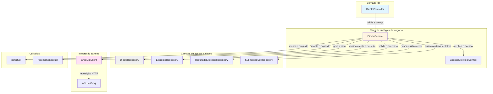
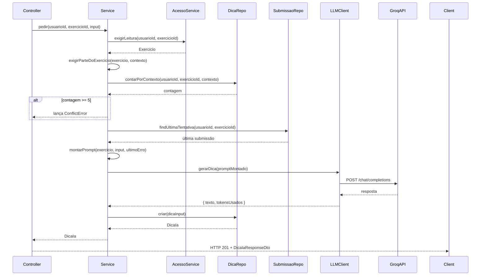
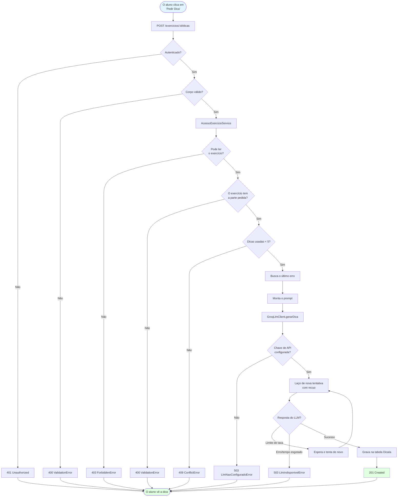
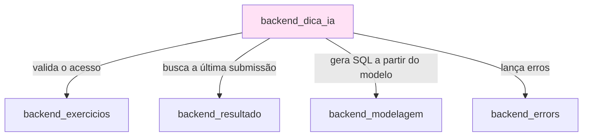

# Backend: dicas pedagógicas com IA (backend_dica_ia)

O módulo `backend_dica_ia` oferece dicas pedagógicas geradas por IA aos alunos que trabalham em exercícios de banco de dados. Ele se integra à API de LLM da Groq para dar orientação contextual sem revelar soluções completas, e dá suporte tanto a exercícios de consulta SQL quanto de modelagem de dados (MER).

---

## Sumário

1. [Visão geral da arquitetura](#visão-geral-da-arquitetura)
2. [Componentes principais](#componentes-principais)
3. [Fluxo de dados](#fluxo-de-dados)
4. [Integração com o LLM](#integração-com-o-llm)
5. [Gestão de cota](#gestão-de-cota)
6. [Montagem do contexto](#montagem-do-contexto)
7. [Tratamento de erros](#tratamento-de-erros)
8. [Dependências](#dependências)
9. [Configuração](#configuração)
10. [Considerações de segurança](#considerações-de-segurança)

---

## Visão geral da arquitetura

O módulo segue o padrão de arquitetura em camadas MSC (Model-Service-Controller), com uma camada adicional de cliente de LLM para a integração com a API externa.



### Responsabilidades das camadas

- **Controller**: validação da requisição HTTP, verificação de autenticação, transformação para DTO
- **Service**: regras de negócio (limites de cota, montagem do contexto, construção do prompt)
- **Repository**: operações de banco de dados para as dicas e as entidades relacionadas
- **Cliente de LLM**: integração com a API externa, com lógica de nova tentativa e recuo (retry/backoff)

---

## Componentes principais

### DicaIaController

**Localização**: `ide-web-backend/src/controllers/DicaIaController.ts`

Tratador do endpoint de pedidos de dica.

**Responsabilidades**:
- Validar a autenticação (`req.usuario` precisa existir)
- Validar o corpo da requisição com um schema Zod
- Delegar à camada de serviço
- Devolver HTTP 201 em caso de sucesso

**Endpoint**:
```typescript
POST /exercicios/:id/dicas
Authorization: Obrigatória (cookie JWT)
Body: PedirDicaBodyDto
Response: DicaIaResponseDto (HTTP 201)
```

**Validação da requisição**:
```typescript
{
  contexto: 'sql' | 'mer',
  estadoMer?: DocumentoModelagem,  // Estado atual do editor de MER
  estadoSql?: string                // Conteúdo atual do editor de SQL
}
```

O schema impõe que:
- `estadoSql` não seja vazio quando `contexto === 'sql'`
- `estadoMer` tenha conteúdo quando `contexto === 'mer'`

---

### DicaIaService

**Localização**: `ide-web-backend/src/services/DicaIaService.ts`

Lógica de negócio central da geração de dicas.

**Métodos principais**:

#### `pedir(usuarioId, exercicioId, input)`

Método principal de orquestração, que:

1. **Valida o acesso**: chama o `AcessoExercicioService.exigirLeitura()` para garantir que o aluno pode ler o exercício
2. **Valida as partes do exercício**: garante que o contexto pedido (SQL/MER) existe no exercício
3. **Verifica a cota**: impõe o limite de 5 dicas por contexto por exercício
4. **Busca o último erro**: recupera o contexto da última submissão ou avaliação
5. **Monta o prompt**: constrói o prompt pedagógico a partir do exercício, do estado do aluno e do erro
6. **Chama o LLM**: gera a dica por meio do `GroqLlmClient`
7. **Persiste a dica**: grava o prompt, a resposta e os metadados no banco



#### Outros métodos importantes

- **`exigirParteDoExercicio`**: valida que o exercício tem a parte pedida (SQL/MER)
- **`exigirQuotaDisponivel`**: impõe o limite de 5 dicas por contexto
- **`buscarUltimoErro`**: busca o contexto da última submissão ou avaliação
- **`montarPrompt`**: monta o prompt pedagógico com o contexto do exercício
- **`montarEstadoEnviado`**: cria um instantâneo em JSON do trabalho do aluno

---

### DicaIaRepository

**Localização**: `ide-web-backend/src/repositories/DicaIaRepository.ts`

Camada de acesso a dados da entidade `DicaIa`.

**Métodos da interface**:

```typescript
interface DicaIaRepository {
  contarPorContexto(usuarioId: string, exercicioId: string, contexto: ContextoDica): Promise<number>;
  criar(input: CreateDicaIaInput): Promise<DicaIa>;
  contarPorExercicios(exercicioIds: string[]): Promise<ContagemDicas[]>;
}
```

**Implementação**: `PrismaDicaIaRepository`

- **`contarPorContexto`**: conta as dicas para a aplicação da cota
- **`criar`**: persiste uma nova dica com todos os metadados
- **`contarPorExercicios`**: contagem em lote para a exportação de dados da pesquisa

---

### GroqLlmClient

**Localização**: `ide-web-backend/src/repositories/llm/GroqLlmClient.ts`

Integração com a API da Groq, compatível com a da OpenAI.

**Recursos principais**:

1. **Prompt de sistema fixo**: instrui o LLM a orientar sem revelar soluções
2. **Lógica de nova tentativa**: trata a limitação de taxa (30 req/min no plano gratuito)
3. **Recuo exponencial**: atrasos progressivos em respostas 429 (1s, 2s, 4s, 8s)
4. **Categorização de erros**: distingue "não configurado" de "temporariamente indisponível"

**Prompt de sistema**:
```
Você é um assistente pedagógico de banco de dados para alunos de graduação.
Dado o enunciado de um exercício, a tentativa atual do aluno e (se houver) o erro da
última submissão, dê uma dica curta que ajude o aluno a avançar sozinho.
NUNCA escreva a query SQL completa nem o diagrama MER completo da resposta certa —
aponte o próximo passo, o conceito envolvido ou o que revisar, sem entregar a solução pronta.
```

---

## Fluxo de dados

### Fluxo completo de um pedido de dica



---

## Integração com o LLM

### Configuração da API da Groq

**Endpoint**: `https://api.groq.com/openai/v1/chat/completions`

**Modelo**: `llama-3.1-8b-instant` (configurável em `config.llm.model`)

**Limites de taxa** (plano gratuito da Groq):
- **30 requisições/minuto** por organização
- **6.000 tokens/minuto**
- **14.400 tokens/dia**

**Por que Groq + Llama 3.1 8B?**
- O plano gratuito basta para a pesquisa do TCC
- Inferência rápida (hardware otimizado)
- API compatível com a da OpenAI (fácil trocar de provedor)
- Suporte ao português
- Bom equilíbrio entre capacidade e velocidade

---

## Gestão de cota

### Limite por contexto

**Regra**: os alunos podem pedir **até 5 dicas por contexto** (SQL ou MER) por exercício.

```typescript
const MAX_DICAS_POR_CONTEXTO = 5;
```

**Granularidade**:
- Os contextos SQL e MER têm **cotas independentes**
- Um exercício com as duas partes permite **10 dicas no total** (5 + 5)
- O contador persiste entre sessões (guardado no banco)

**Justificativa** (de `docs/decisions/fase3-dicas-ia.md`):
- Evita a "dependência de chatbot" (insistir até obter a solução completa)
- Incentiva o aluno a pensar entre uma dica e outra
- Reduz os custos de API e a pressão sobre os limites de taxa

---

## Montagem do contexto

### Estratégia de construção do prompt

O método `montarPrompt()` monta um prompt pedagógico rico, que inclui:

1. **Enunciado do exercício** (sempre)
2. **Contexto de ajuda pedido** (SQL ou MER)
3. **Trabalho atual do aluno**:
   - Para MER: resumo do modelo conceitual + modelo lógico como DDL em SQL
   - Para SQL: o texto da consulta atual
4. **Último erro** (se disponível)
5. **Verificação de coerência** (quando MER e SQL estão presentes)

### Exemplo de prompt montado

```
Enunciado do exercício: Liste todos os clientes que fizeram pedidos acima de R$ 1000.

O aluno pediu ajuda na parte: consulta SQL

Modelo conceitual atual do aluno (notação de Chen, cardinalidade (mín,máx) junto da entidade):
- Entidade Cliente (0,N) -- faz -- (1,1) Pedido
  - Cliente: cpf (identificador), nome
  - Pedido: numero (identificador), valor, data

Modelo lógico atual do aluno, convertido em SQL (DDL):
CREATE TABLE cliente (
  cpf VARCHAR(11) PRIMARY KEY,
  nome VARCHAR(100)
);

CREATE TABLE pedido (
  numero INTEGER PRIMARY KEY,
  valor DECIMAL(10,2),
  data DATE
);

Problemas detectados automaticamente no modelo:
- Tabela 'pedido' não tem chave estrangeira para 'cliente'

Consulta SQL atual do aluno:
SELECT * FROM cliente WHERE valor > 1000;

Verifique também a coerência entre o modelo e a consulta: tabelas ou colunas usadas na consulta 
que não existem no modelo, ou chaves estrangeiras do modelo que a consulta deveria usar.

Erro da última submissão: Última submissão teve erro_sintaxe.
```

### Detalhes do contexto de MER

**Resumo do modelo conceitual** (via `resumirConceitual()`):
- Lista as entidades com seus atributos
- Mostra a cardinalidade como `(mín,máx)` por participação
- Indica identificadores e atributos compostos ou multivalorados
- Mostra as especializações

**Modelo lógico como SQL** (via `gerarSql()`):
- Gera o DDL PostgreSQL a partir do modelo lógico
- Inclui os comandos CREATE TABLE com as restrições
- Lista os problemas detectados automaticamente
- Mais conciso do que o JSON do canvas

**Por que os dois níveis?** O conceitual mostra a intenção do projeto, o lógico mostra as decisões de implementação, e os problemas de conversão ficam visíveis para o LLM

---

## Tratamento de erros

### Hierarquia de erros

| Cenário | Classe de erro | Status HTTP | Mensagem |
|----------|-------------|-------------|---------|
| Sem autenticação | `UnauthorizedError` | 401 | "Autenticação necessária" |
| Corpo da requisição inválido | `ValidationError` | 400 | Erros de validação do Zod |
| Exercício inacessível | `ForbiddenError` | 403 | "Acesso negado" |
| O exercício não tem a parte | `ValidationError` | 400 | "Este exercício não tem parte de SQL/MER" |
| Cota excedida | `ConflictError` | 409 | "Limite de 5 dicas atingido..." |
| Chave de API não configurada | `LlmNaoConfiguradoError` | 503 | "LLM_NAO_CONFIGURADO" |
| Erro da API do LLM | `LlmIndisponivelError` | 503 | "Serviço de IA temporariamente indisponível" |

---

## Dependências

### Dependências entre módulos



**Do [backend_exercicios](backend_exercicios.md)**:
- `ExercicioRepository`: buscar os metadados do exercício
- `AcessoExercicioService`: validar o acesso do aluno

**Do [backend_resultado](backend_resultado.md)**:
- `ResultadoExercicioRepository`: obter a avaliação manual do MER
- `SubmissaoSqlRepository`: obter a última tentativa de SQL e o erro

**Do [backend_modelagem](backend_modelagem.md)**:
- `utils/modelagem/gerarSql.ts`: converter o modelo lógico em DDL
- `utils/modelagem/resumoConceitual.ts`: resumir o modelo conceitual

**Do [backend_errors](backend_errors.md)**:
- `ValidationError`, `ConflictError`, `UnauthorizedError`
- Erros de LLM personalizados

---

## Configuração

### Variáveis de ambiente

**Obrigatórias em produção**:
```bash
LLM_API_KEY=<chave de API da Groq>
LLM_MODEL=llama-3.1-8b-instant  # Opcional, este é o padrão
```

**Desenvolvimento/testes**:
- A `LLM_API_KEY` pode ser omitida
- As requisições falham com `LlmNaoConfiguradoError` (503)
- Permite testar sem acesso à API

---

## Considerações de segurança

### Proteção de dados pessoais

**Excluídos dos prompts** (de `docs/decisions/fase3-dicas-ia.md`):
- Nome, e-mail e ID (UUID) do aluno
- ID do exercício (UUID)

**Incluídos nos prompts**:
- Enunciado do exercício (público dentro da turma)
- Trabalho atual do aluno (estado do SQL/MER)
- Mensagem do último erro (técnica, sem dados pessoais)

**Justificativa**:
- Enviar soluções de exercício ao LLM é aceitável (conteúdo acadêmico)
- A identidade do aluno não pode ser ligada às suas dificuldades (LGPD)
- As mensagens de erro são saneadas pelo sandbox

### Dados armazenados

**Na tabela `DicaIa`**:
- Prompt e resposta completos, para auditoria e melhoria
- Ligações apenas com UUIDs internos
- Nunca compartilhados externamente
- Usados para depuração e pesquisa

### Gestão da chave de API

**Produção**: definida por variável de ambiente, nunca versionada, e trocada se for comprometida

**Desenvolvimento**: os desenvolvedores usam chaves próprias ou deixam sem configurar

---

## Schema do banco de dados

### Tabela DicaIa

```prisma
model DicaIa {
  id              String       @id @default(uuid())
  usuario_id      String
  exercicio_id    String
  contexto        ContextoDica
  estado_enviado  Json         // Estado do aluno no momento do pedido
  prompt_montado  String       // Prompt completo enviado ao LLM
  resposta_ia     String       // Resposta do LLM
  modelo_llm      String       // p. ex., "llama-3.1-8b-instant"
  tokens_usados   Int?         // Do campo de uso da API
  criado_em       DateTime     @default(now())

  usuario    Usuario   @relation(fields: [usuario_id], references: [id], onDelete: Cascade)
  exercicio  Exercicio @relation(fields: [exercicio_id], references: [id], onDelete: Cascade)

  @@index([usuario_id, exercicio_id, contexto])
  @@map("dicas_ia")
}

enum ContextoDica {
  sql
  mer
}
```

---

## Referência da API

### POST /exercicios/:id/dicas

Pede uma dica pedagógica gerada por IA.

**Autenticação**: obrigatória (cookie JWT)

**Corpo da requisição**:
```typescript
{
  contexto: 'sql' | 'mer',
  estadoMer?: DocumentoModelagem,
  estadoSql?: string
}
```

**Resposta** (HTTP 201):
```typescript
{
  "data": {
    "id": "uuid",
    "contexto": "sql",
    "respostaIa": "Texto da dica...",
    "criadoEm": "2026-09-22T14:30:00.000Z"
  }
}
```

**Respostas de erro**: 400, 401, 403, 409, 503 (veja [Tratamento de erros](#tratamento-de-erros))

---

## Documentação relacionada

- **[backend_exercicios](backend_exercicios.md)**: CRUD de exercícios e controle de acesso
- **[backend_modelagem](backend_modelagem.md)**: estrutura do documento de MER e geração de SQL
- **[backend_resultado](backend_resultado.md)**: dados de submissão e de avaliação
- **[backend_errors](backend_errors.md)**: hierarquia de classes de erro
- **[frontend_dica_ia](frontend_dica_ia.md)**: interface de dicas e integração no frontend

---

## Referências

- **Decisão de arquitetura**: `docs/decisions/fase3-dicas-ia.md`
- **Integração MER/SQL**: `docs/decisions/fase6-alinhamento-tcc.md`
- **Documentação da Groq**: https://console.groq.com/docs
- **Modelo Llama 3.1**: https://huggingface.co/meta-llama/Meta-Llama-3.1-8B-Instruct

---

**Versão do documento**: 1.0  
**Última atualização**: 2026-09-22  
**Escopo**: sistema de geração de dicas por IA do backend
