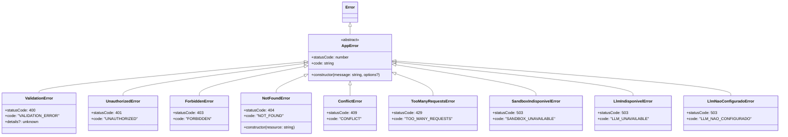
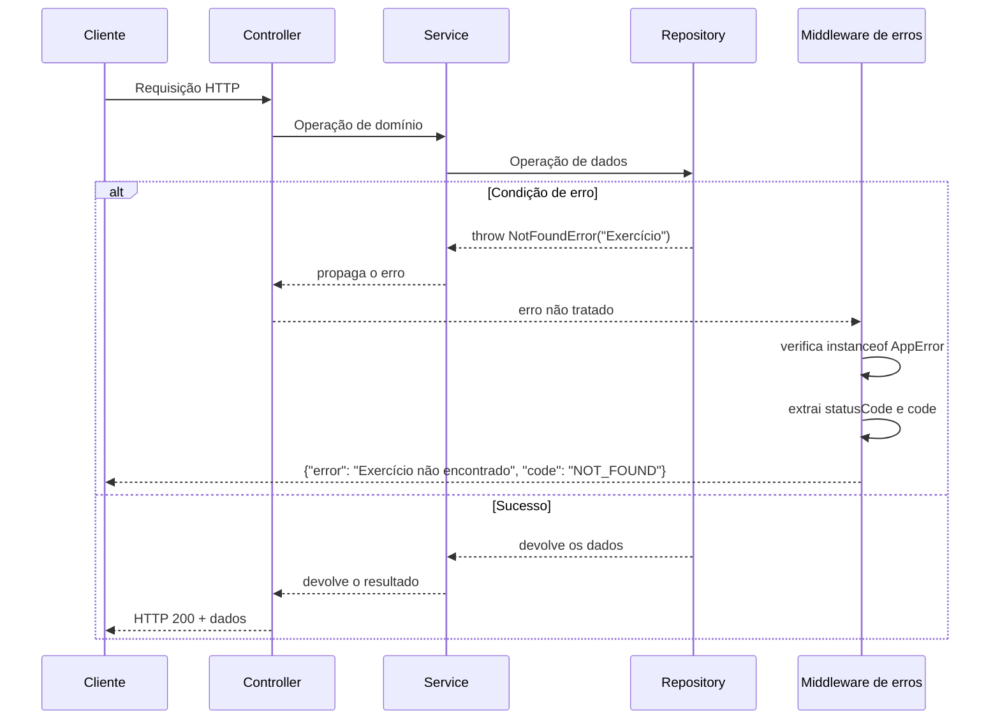
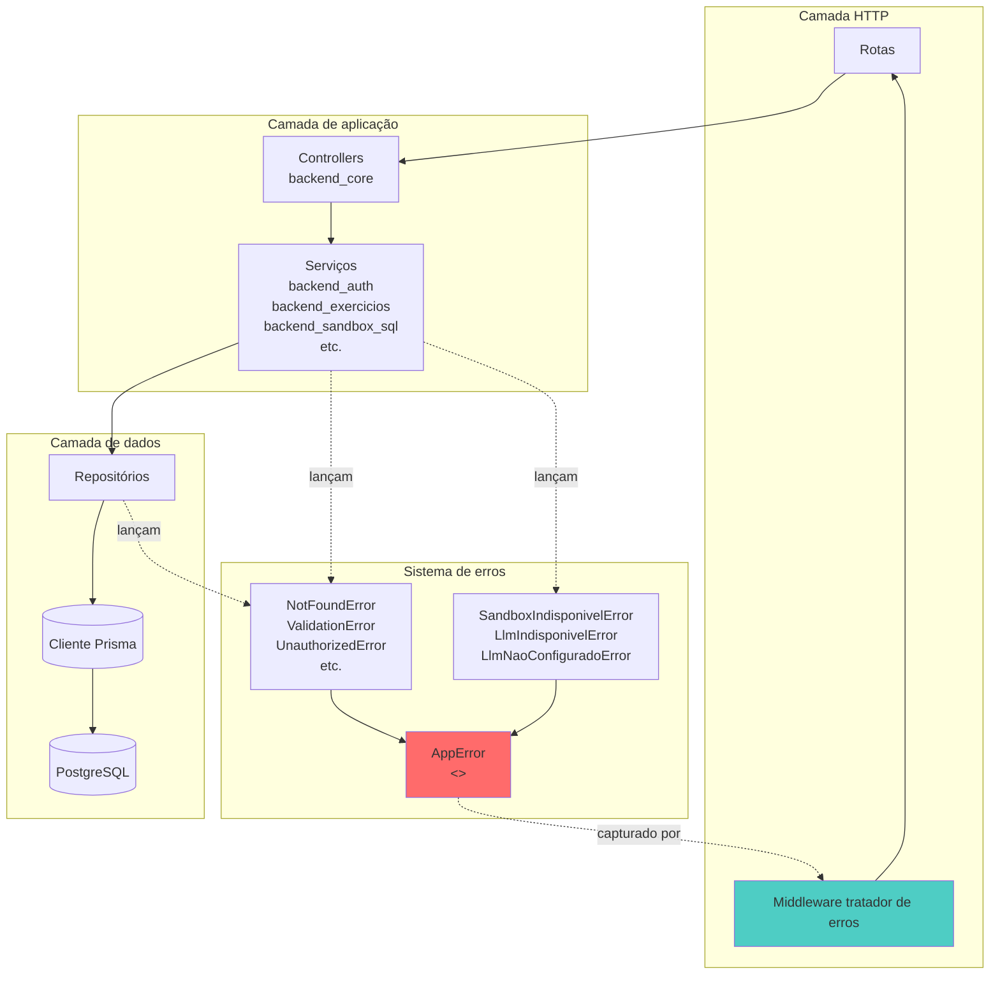
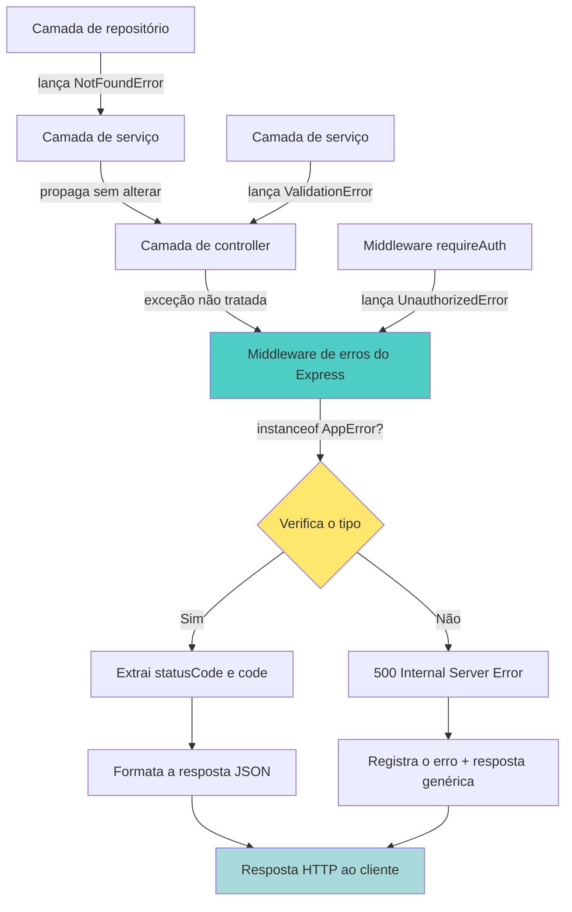

# Sistema de tratamento de erros do backend

**Módulo**: `backend_errors`  
**Localização**: `ide-web-backend/src/errors/`  
**Finalidade**: hierarquia de erros centralizada, que oferece um tratamento de erros tipado e compatível com HTTP, com mensagens ao usuário em português, em toda a aplicação backend.

---

## Visão geral

O módulo `backend_errors` implementa um sistema estruturado de tratamento de erros para o backend da IDE Web. Ele oferece uma hierarquia de classes de erro especializadas que mapeiam falhas específicas do domínio para códigos de status HTTP e códigos de erro adequados, permitindo respostas de erro consistentes em toda a API. Todas as mensagens de erro estão em português, porque chegam diretamente ao usuário final pela interface do frontend.

Este módulo é a base do tratamento de erros de todos os serviços do backend e dá suporte à arquitetura MSC (Model-Service-Controller): serviços e repositórios lançam erros semanticamente significativos, que o middleware de tratamento de erros transforma automaticamente em respostas HTTP corretas.

---

## Arquitetura

### Hierarquia de classes de erro



### Fluxo do erro pela aplicação



### Integração com a arquitetura do backend



---

## Componentes principais

### 1. AppError (classe base)

**Arquivo**: `ide-web-backend/src/errors/AppError.ts`

A classe base abstrata de todos os erros da aplicação. Impõe uma estrutura consistente a todos os tipos de erro.

**Contrato**:
- `statusCode: number` - código de status HTTP (deve ser implementado pela subclasse)
- `code: string` - identificador de erro legível por máquina (deve ser implementado pela subclasse)
- `message: string` - mensagem de erro legível por pessoas, em português
- `name: string` - definido automaticamente com o nome do construtor
- `cause?: unknown` - erro subjacente opcional (causa de erro do ES2022)

**Princípios de projeto**:
- Uma classe abstrata impede a instanciação direta
- Obriga todos os erros a declarar o status HTTP e o código de erro
- Preserva os rastros de pilha (stack traces) por meio da chamada correta a `super()`
- Permite o encadeamento de erros pela opção `cause`

### 2. Classes de erro do cliente (4xx)

#### ValidationError (400)
**Finalidade**: falhas de validação de entrada, requisições malformadas, violações de regra de negócio.

**Uso**:
```typescript
throw new ValidationError('Email já cadastrado', { details: zodError.issues });
```

**Recurso especial**: inclui o campo opcional `details` para informações estruturadas de validação (por exemplo, erros de validação do Zod).

#### UnauthorizedError (401)
**Finalidade**: falhas de autenticação, credenciais ausentes ou inválidas.

**Uso**:
```typescript
throw new UnauthorizedError('Token inválido ou expirado');
```

**Cenários típicos**:
- Token JWT ausente
- Sessão expirada
- Credenciais inválidas
- Referenciado no módulo `backend_auth` para validação de sessão

#### ForbiddenError (403)
**Finalidade**: falhas de autorização em que o usuário está autenticado, mas não tem permissão.

**Uso**:
```typescript
throw new ForbiddenError('Apenas professores podem criar exercícios');
```

**Cenários típicos**:
- Violações do controle de acesso por papel
- Tentativas de acesso entre inquilinos (tenants) diferentes
- Aluno tentando acessar endpoints exclusivos do professor

#### NotFoundError (404)
**Finalidade**: recurso não encontrado no banco de dados.

**Recurso especial**: mensagens em português com concordância de gênero.

**Implementação**:
```typescript
const FEMININOS = new Set(['Turma', 'Prova', 'Pesquisa', 'Submissão']);
// "Turma não encontrada" versus "Exercício não encontrado"
```

**Uso**:
```typescript
throw new NotFoundError('Exercício');  // → "Exercício não encontrado"
throw new NotFoundError('Turma');      // → "Turma não encontrada"
```

**Justificativa de projeto**: como as mensagens chegam ao usuário final e a interface é inteiramente em português, a correção gramatical importa para a experiência do usuário.

#### ConflictError (409)
**Finalidade**: conflitos de estado, recursos duplicados, falhas de modificação concorrente.

**Uso**:
```typescript
throw new ConflictError('Código da turma já existe');
```

**Cenários típicos**:
- Violações de restrição de unicidade
- Falhas de bloqueio otimista
- Conflitos de lógica de negócio (por exemplo, reabrir uma turma ativa)

#### TooManyRequestsError (429)
**Finalidade**: limitação de taxa, esgotamento de cota.

**Uso**:
```typescript
throw new TooManyRequestsError('Limite de dicas de IA atingido');
```

**Cenários típicos**:
- Limites de taxa da API do LLM (referenciado no `backend_dica_ia`)
- Limitação de requisições por usuário

### 3. Classes de erro do servidor (5xx)

#### SandboxIndisponivelError (503)
**Finalidade**: falhas de conexão com o banco do sandbox SQL.

**Mensagem padrão**: `"Não foi possível conectar ao banco do sandbox. Tente novamente em instantes."`

**Contexto**: o sistema usa um projeto Supabase separado para o sandbox SQL (veja [backend_sandbox_sql](backend_sandbox_sql.md)). Este erro indica problemas transitórios de conectividade, que devem se resolver ao tentar de novo.

**Integração**: lançado pelo `SandboxExecutionRepository` e pelo `SandboxProvisioningRepository` quando o `SANDBOX_DATABASE_URL` ou o `SANDBOX_EXEC_DATABASE_URL` não pode ser alcançado.

#### LlmIndisponivelError (503)
**Finalidade**: falhas transitórias do serviço de LLM (indisponibilidade do provedor, problemas de rede).

**Mensagem padrão**: `"Serviço de dicas de IA indisponível no momento, tente novamente em instantes"`

**Contexto**: indica indisponibilidade temporária do serviço de LLM da Groq. O frontend deve permitir tentar de novo.

**Integração**: lançado pelo `GroqLlmClient`, no módulo `backend_dica_ia`, quando a API externa devolve 503 ou expira o tempo.

#### LlmNaoConfiguradoError (503)
**Finalidade**: variável de ambiente `LLM_API_KEY` ausente.

**Mensagem padrão**: `"Dicas de IA não configuradas neste ambiente"`

**Distinção crítica**: ao contrário do `LlmIndisponivelError`, este erro **não é transitório**. Tentar de novo não ajuda. O frontend precisa tratá-lo de forma diferente (esconder o recurso ou mostrar um aviso permanente).

**Justificativa de projeto**: 
```typescript
/**
 * Ambiente sem `LLM_API_KEY`. Diferente de `LlmIndisponivelError` (falha passageira do
 * provedor): isto não se resolve tentando de novo, e a interface precisa saber disso
 * pra não mandar o aluno "tentar em instantes" pra sempre.
 */
```

**Integração**: verificado logo no início do `DicaIaService`, antes de tentar as chamadas ao LLM.

---

## Referência dos códigos de erro

| Classe de erro | Status HTTP | Código de erro | Pode tentar de novo | Ação do usuário |
|-------------|-------------|------------|------------|-------------|
| `ValidationError` | 400 | `VALIDATION_ERROR` | ❌ | Corrigir a entrada e reenviar |
| `UnauthorizedError` | 401 | `UNAUTHORIZED` | ❌ | Autenticar-se de novo |
| `ForbiddenError` | 403 | `FORBIDDEN` | ❌ | Pedir acesso ou trocar de conta |
| `NotFoundError` | 404 | `NOT_FOUND` | ❌ | Verificar se o recurso existe |
| `ConflictError` | 409 | `CONFLICT` | ❌ | Resolver o conflito manualmente |
| `TooManyRequestsError` | 429 | `TOO_MANY_REQUESTS` | ✅ | Esperar e tentar de novo com recuo (backoff) |
| `SandboxIndisponivelError` | 503 | `SANDBOX_UNAVAILABLE` | ✅ | Tentar de novo em instantes |
| `LlmIndisponivelError` | 503 | `LLM_UNAVAILABLE` | ✅ | Tentar de novo em instantes |
| `LlmNaoConfiguradoError` | 503 | `LLM_NAO_CONFIGURADO` | ❌ | Recurso indisponível |

---

## Padrões de uso

### Nos serviços

```typescript
// backend_exercicios
export class ExercicioService {
  async buscarPorId(id: string): Promise<Exercicio> {
    const exercicio = await this.exercicioRepository.findById(id);
    if (!exercicio) {
      throw new NotFoundError('Exercício');
    }
    return exercicio;
  }
  
  async criar(professorId: string, data: CreateExercicioInput): Promise<Exercicio> {
    if (data.prazo && data.prazo < new Date()) {
      throw new ValidationError('Prazo não pode ser no passado');
    }
    // ...
  }
}
```

### Nos repositórios

```typescript
// backend_sandbox_sql
export class PgSandboxExecutionRepository implements SandboxExecutionRepository {
  async executar(schema: string, sql: string): Promise<SandboxExecucaoSucesso | SandboxExecucaoErro> {
    try {
      const pool = await this.getPool();
      // ...
    } catch (error) {
      if (error.code === 'ECONNREFUSED') {
        throw new SandboxIndisponivelError();
      }
      throw error;
    }
  }
}
```

### No middleware (tratador de erros)

```typescript
// ide-web-backend/src/middlewares/errorHandler.ts (referenciado no CLAUDE.md)
export const errorHandler: ErrorRequestHandler = (err, req, res, next) => {
  if (err instanceof AppError) {
    return res.status(err.statusCode).json({
      error: err.message,
      code: err.code,
      ...(err instanceof ValidationError && err.details ? { details: err.details } : {}),
    });
  }
  
  // Erros desconhecidos (500)
  console.error('Unexpected error:', err);
  return res.status(500).json({
    error: 'Erro interno do servidor',
    code: 'INTERNAL_SERVER_ERROR',
  });
};
```

### Tratamento de erros no frontend

O frontend consome esses erros pelo cliente HTTP (veja o módulo `frontend_shared`):

```typescript
// padrão de ide-web-front/src/lib/httpClient.ts (referenciado na árvore de módulos)
try {
  const response = await fetch(url, options);
  if (!response.ok) {
    const errorData = await response.json();
    // errorData.code pode ser usado para um tratamento específico
    if (errorData.code === 'LLM_NAO_CONFIGURADO') {
      // Esconde o recurso de dicas de IA de forma permanente
    } else if (errorData.code === 'LLM_UNAVAILABLE') {
      // Mostra um botão de tentar de novo
    }
    throw new HttpError(errorData.error, response.status, errorData.code);
  }
} catch (error) {
  // Trata erros de rede, tempos esgotados etc.
}
```

---

## Decisões de projeto

### 1. Mensagens em português
**Decisão**: todas as mensagens de erro estão em português.

**Justificativa**: do CLAUDE.md:
> Erros do domínio falam português (`NotFoundError` monta "X não encontrado(a)"), porque a mensagem chega ao usuário; IA sem chave no ambiente responde `LLM_NAO_CONFIGURADO`, separado do 503 passageiro do provedor.

A interface é inteiramente em português para alunos e professores brasileiros, então os erros precisam combinar com o idioma da interface.

### 2. Erros de indisponibilidade de serviço separados
**Decisão**: três erros 503 distintos: `SandboxIndisponivelError`, `LlmIndisponivelError`, `LlmNaoConfiguradoError`.

**Justificativa**: 
- **A semântica de nova tentativa é diferente**: os dois primeiros são transitórios, o terceiro é permanente
- **A orientação ao usuário é diferente**: "Tente de novo em instantes" versus "Recurso indisponível"
- **O comportamento do frontend é diferente**: mostrar um indicador de carregamento versus esconder o recurso por completo
- **Clareza na depuração**: os logs mostram de imediato qual dependência externa falhou

### 3. NotFoundError com concordância de gênero
**Decisão**: o construtor do `NotFoundError` recebe o nome do recurso e aplica as regras de gênero do português.

**Justificativa**: 
- Mensagens gramaticalmente corretas melhoram a experiência do usuário
- Centraliza a lógica de gênero em vez de obrigar cada ponto de chamada a montar a mensagem completa
- Uma busca simples num conjunto (`FEMININOS`) é fácil de manter conforme novos recursos são acrescentados

### 4. Campo details do ValidationError
**Decisão**: o `ValidationError` inclui um `details` estruturado e opcional.

**Justificativa**:
- Os erros de validação do Zod trazem informações por campo que o frontend pode usar para destacar campos específicos do formulário
- A mensagem de erro genérica dá o resumo para pessoas, e o `details` permite o tratamento programático
- Retrocompatível (campo opcional)

---

## Pontos de integração

### Com o Backend Core
- **Middleware de erros**: captura todas as instâncias de `AppError` e as transforma em respostas HTTP
- **BaseController**: pode oferecer métodos auxiliares para padrões consistentes de tratamento de erros (veja [backend_core](backend_core.md))

### Com o sistema de autenticação
- `UnauthorizedError`: lançado pelo `SessaoAuthService` quando a validação da sessão falha
- `ForbiddenError`: lançado pelas guardas de papel no middleware `requireAuth`
- Veja [backend_auth](backend_auth.md) para a integração com a gestão de sessão

### Com o Sandbox SQL
- `SandboxIndisponivelError`: lançado quando o banco de sandbox separado, no Supabase, está inalcançável
- Falhas do pool de conexões são mapeadas para este erro
- Veja [backend_sandbox_sql](backend_sandbox_sql.md) para os detalhes de configuração do banco

### Com o sistema de dicas de IA
- `LlmNaoConfiguradoError`: verificado antes de qualquer chamada à API da Groq
- `LlmIndisponivelError`: lançado em respostas 503 ou tempos esgotados de rede da Groq
- `TooManyRequestsError`: lançado quando o limite de dicas por contexto (5) é excedido
- Veja [backend_dica_ia](backend_dica_ia.md) para a arquitetura da integração com o LLM

### Com a gestão de exercícios
- `NotFoundError`: erro principal para exercícios, turmas, provas etc. ausentes
- `ForbiddenError`: aplica as regras de visibilidade dos exercícios (público, específico da turma ou de prova)
- `ConflictError`: impede códigos de turma duplicados e atribuições de prova conflitantes
- Veja [backend_exercicios](backend_exercicios.md), [backend_turmas](backend_turmas.md), [backend_provas](backend_provas.md)

---

## Fluxo de propagação de erros



---

## Considerações sobre testes

### Testes unitários dos erros

```typescript
describe('NotFoundError', () => {
  it('should use feminine form for feminine resources', () => {
    const error = new NotFoundError('Turma');
    expect(error.message).toBe('Turma não encontrada');
    expect(error.statusCode).toBe(404);
    expect(error.code).toBe('NOT_FOUND');
  });
  
  it('should use masculine form for masculine resources', () => {
    const error = new NotFoundError('Exercício');
    expect(error.message).toBe('Exercício não encontrado');
  });
});
```

### Testes de integração com serviços

```typescript
describe('ExercicioService', () => {
  it('should throw NotFoundError when exercise does not exist', async () => {
    const service = new ExercicioService(mockRepo);
    mockRepo.findById.mockResolvedValue(null);
    
    await expect(service.buscarPorId('invalid-id'))
      .rejects
      .toThrow(NotFoundError);
  });
  
  it('should throw ForbiddenError when student tries to delete exercise', async () => {
    const service = new ExercicioService(mockRepo);
    
    await expect(service.deletar('exercise-id', 'student-user-id'))
      .rejects
      .toThrow(ForbiddenError);
  });
});
```

### Testes E2E das respostas de erro

Pelo `ide-web-front/playwright.config.ts` (veja os artefatos do repositório), o frontend usa o Playwright para testes E2E. Eles podem verificar o tratamento de erros:

```typescript
test('should show error message when exercise not found', async ({ page }) => {
  await page.goto('/exercicios/nonexistent-id');
  
  // Deve mostrar a mensagem de erro em português
  await expect(page.locator('text=Exercício não encontrado')).toBeVisible();
});

test('should hide AI hints when LLM not configured', async ({ page }) => {
  // Simula a API devolvendo LLM_NAO_CONFIGURADO
  await page.route('**/api/v1/exercicios/*/dicas', route => 
    route.fulfill({
      status: 503,
      json: { error: 'Dicas de IA não configuradas neste ambiente', code: 'LLM_NAO_CONFIGURADO' }
    })
  );
  
  await page.goto('/exercicios/some-id');
  
  // O botão de dica de IA deve ficar oculto, e não apenas desabilitado
  await expect(page.locator('[data-testid="ai-hint-button"]')).not.toBeVisible();
});
```

---

## Configuração de ambiente

### Estados de erro do LLM

A distinção entre `LlmNaoConfiguradoError` e `LlmIndisponivelError` depende da configuração do ambiente:

**Desenvolvimento** (`ide-web-backend/.env`):
```bash
# Chave ausente → LlmNaoConfiguradoError
# LLM_API_KEY=

# Chave presente → pode lançar LlmIndisponivelError em problemas de rede
LLM_API_KEY=gsk_...
```

**Produção** (variáveis de ambiente do Render):
- É preciso definir `LLM_API_KEY` para as dicas de IA funcionarem
- Sem ela, todos os pedidos de dica devolvem `LLM_NAO_CONFIGURADO` (503)

Veja [backend_dica_ia](backend_dica_ia.md) para a configuração do provedor de LLM.

### Estados de erro do sandbox

**Desenvolvimento** (`docker-compose.yml`):
```yaml
services:
  db_sandbox:
    image: postgres:16-alpine
    # Se este serviço falhar ao iniciar → SandboxIndisponivelError
```

**Produção** (Supabase):
- Exige um projeto Supabase separado para o banco do sandbox
- `SANDBOX_DATABASE_URL` e `SANDBOX_EXEC_DATABASE_URL` precisam apontar para instâncias alcançáveis
- Esgotamento do pool de conexões → `SandboxIndisponivelError`

Veja [backend_sandbox_sql](backend_sandbox_sql.md) e `ide-web-backend/scripts/sandbox-init.sh` para os detalhes de configuração.

---

## Guia de migração

### Acrescentando novos tipos de erro

1. **Crie a classe de erro**:
```typescript
// ide-web-backend/src/errors/RateLimitExceededError.ts
import { AppError } from './AppError';

const HTTP_TOO_MANY_REQUESTS = 429;

export class RateLimitExceededError extends AppError {
  readonly statusCode = HTTP_TOO_MANY_REQUESTS;
  readonly code = 'RATE_LIMIT_EXCEEDED';
  
  constructor(
    public readonly retryAfterSeconds: number,
    message = `Muitas requisições. Tente novamente em ${retryAfterSeconds} segundos.`
  ) {
    super(message);
  }
}
```

2. **Exporte em errors/index.ts**:
```typescript
export * from './RateLimitExceededError';
```

3. **Use nos serviços**:
```typescript
if (requestCount > limit) {
  throw new RateLimitExceededError(60);
}
```

4. **Trate no frontend** (se necessário):
```typescript
if (error.code === 'RATE_LIMIT_EXCEEDED') {
  // Mostra um contador regressivo, desabilita o botão por retryAfterSeconds
}
```

### Convertendo erros existentes

Ao refatorar código que lança erros genéricos:

**Antes**:
```typescript
throw new Error('Usuário não encontrado');
```

**Depois**:
```typescript
throw new NotFoundError('Usuário');
```

**Benefícios**:
- Mapeamento automático do status HTTP
- Código de erro legível por máquina
- Formato de mensagem consistente
- Português com concordância de gênero

---

## Considerações de segurança

### 1. Divulgação de informações
**Risco**: as mensagens de erro podem vazar informações sensíveis.

**Mitigação**:
- As subclasses de `AppError` usam mensagens genéricas
- Os rastros de pilha detalhados são registrados apenas no servidor, nunca enviados ao cliente
- O `details` do erro de validação não deve incluir estado interno (seguro para erros de campo do Zod)

### 2. Ataques de temporização
**Risco**: tipos de erro diferentes para "usuário não encontrado" e "senha errada" permitem enumerar usuários.

**Mitigação**:
- Os endpoints de autenticação devolvem um `UnauthorizedError` genérico, qualquer que seja a falha específica
- Nenhuma distinção entre "e-mail não encontrado" e "senha errada" nas respostas

### 3. Contorno da limitação de taxa
**Risco**: atacantes ignoram o `TooManyRequestsError` e continuam martelando os endpoints.

**Mitigação**:
- O erro indica que o limite foi excedido, mas a aplicação do limite precisa acontecer no middleware ou na infraestrutura
- Considere uma limitação por IP no nível do proxy reverso (nginx, Cloudflare)

---

## Considerações de desempenho

### Custo de construção do erro
- O `NotFoundError` faz uma busca no conjunto para definir o gênero em toda construção
- **Impacto**: desprezível (a busca no Set é O(1) e só acontece no caminho de erro)
- **Alternativa considerada**: mapa pré-calculado com todas as mensagens, rejeitada por duplicar código

### Coleta do rastro de pilha
- Todas as instâncias de `AppError` capturam o rastro de pilha completo por meio de `super()`
- **Impacto**: custo de CPU não trivial, mas aceitável porque os erros são excepcionais
- **Log em produção**: os rastros de pilha são registrados no servidor para depuração e removidos das respostas HTTP

---

## Melhorias futuras

### Planejado (Fase 12 - SQL Studio)
Pelos documentos de decisão do CLAUDE.md, a Fase 12 vai introduzir:
- Erros de migração de schema (conflitos de versão, mudanças incompatíveis)
- Erros de escalonamento de privilégio (tentativa de trocar a role para `postgres`)
- Erros do parser (SQL malicioso, comandos não permitidos)

Provavelmente serão necessárias novas classes de erro:
```typescript
// Possíveis erros futuros
class SchemaVersionConflictError extends AppError { /* 409 */ }
class PrivilegeViolationError extends AppError { /* 403 */ }
class DisallowedSqlError extends ValidationError { /* 400 com o motivo do SQL */ }
```

Veja `docs/decisions/fase12-sql-studio-bd2.md` para as melhorias de segurança planejadas.

### Considerações
1. **Agregação de erros**: em operações em lote, considere coletar vários erros:
```typescript
class BatchValidationError extends ValidationError {
  constructor(public readonly errors: ValidationError[]) {
    super(`${errors.length} validation errors occurred`, { details: errors });
  }
}
```

2. **Metadados de nova tentativa**: acrescentar informações estruturadas de retry-after aos erros 503:
```typescript
class SandboxIndisponivelError extends AppError {
  readonly retryable = true;
  readonly estimatedRecoverySeconds = 5;
}
```

3. **IDs de correlação**: ligar erros entre rastreamentos distribuídos (backend Node, backend Python, provedor de LLM):
```typescript
constructor(message: string, public readonly correlationId?: string)
```

---

## Documentação relacionada

- **[backend_core](backend_core.md)**: implementação do middleware de erros, padrões do `BaseController`
- **[backend_auth](backend_auth.md)**: uso de `UnauthorizedError` e `ForbiddenError` nas guardas de sessão e de papel
- **[backend_sandbox_sql](backend_sandbox_sql.md)**: tratamento de conexão do `SandboxIndisponivelError`
- **[backend_dica_ia](backend_dica_ia.md)**: distinção dos erros de LLM, limitação de taxa com `TooManyRequestsError`
- **[backend_exercicios](backend_exercicios.md)**: `NotFoundError`, `ValidationError`, `ForbiddenError` no CRUD de exercícios
- **[frontend_shared](frontend_shared.md)**: tratamento de erros do cliente HTTP, lógica de nova tentativa

---

## Resumo

O módulo `backend_errors` oferece:
- ✅ **Tratamento de erros tipado**, por meio da hierarquia `AppError`
- ✅ **Compatível com HTTP**: códigos de status e códigos de erro
- ✅ **Mensagens ao usuário em português**, com correção gramatical
- ✅ **Semântica clara de nova tentativa**, que distingue falhas transitórias de permanentes
- ✅ **Pronto para integração** com middlewares, serviços e repositórios de todo o backend

Ao centralizar as definições de erro, o módulo garante respostas de API consistentes, melhora a clareza da depuração e permite que o frontend dê a orientação adequada ao usuário em cada cenário de falha.
