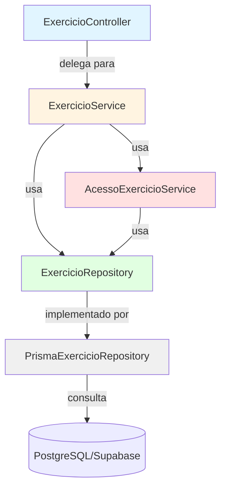
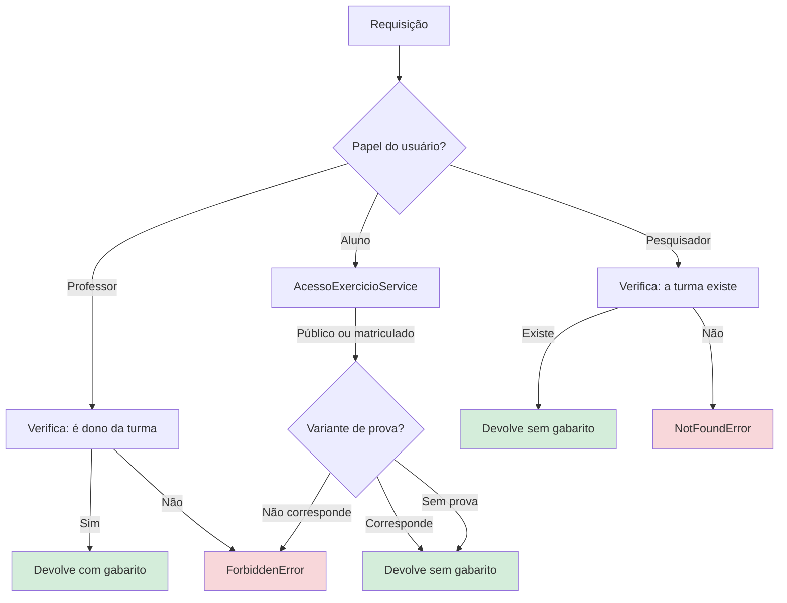
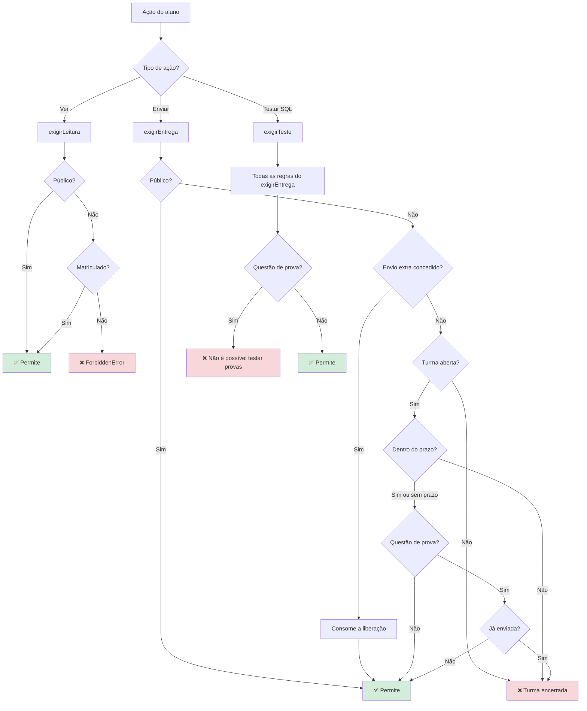
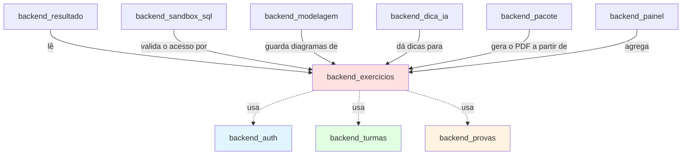

# Módulo Backend Exercícios

## Visão geral

O módulo **backend_exercicios** é o módulo de domínio central, responsável por gerenciar os exercícios de banco de dados (Exercicios) do sistema IDE Web. Ele cuida de todo o ciclo de vida dos exercícios, da criação pelos professores ao controle de acesso dos alunos, dando suporte a vários tipos de exercício (modelagem MER, consultas SQL e questões dissertativas), com regras de acesso sofisticadas para o modo prova, os prazos e o material de estudo público.

Este módulo implementa um controle de acesso de granularidade fina, que distingue entre ler um exercício (ver o problema), testar soluções no sandbox e enviar respostas finais, com regras especiais para exercícios públicos, questões de prova e o cumprimento de prazos.

---

## Arquitetura

### Estrutura de camadas (padrão MSC)



**Camadas**:
- **Controller** (`ExercicioController`): tratamento das requisições HTTP, validação de entrada (Zod), formatação da resposta
- **Service** (`ExercicioService`): lógica de negócio, autorização, orquestração
- **Controle de acesso** (`AcessoExercicioService`): regras de acesso do aluno, centralizadas
- **Repository** (`ExercicioRepository`/`PrismaExercicioRepository`): abstração de persistência de dados

---

## Detalhamento dos componentes

### ExercicioController

**Responsabilidade**: tratador dos endpoints HTTP das operações de exercício.

**Métodos principais**:
- `criar`: `POST /exercicios` - cria um novo exercício (apenas professor)
- `atualizar`: `PUT /exercicios/:id` - atualiza um exercício (apenas professor)
- `buscarPorId`: `GET /exercicios/:id` - busca um único exercício (com controle de acesso)
- `listarPorTurma`: `GET /turmas/:turmaId/exercicios` - lista os exercícios de uma turma
- `listarPublicos`: `GET /exercicios/publicos` - lista os exercícios públicos (estudo livre)

**Diferenciação de acesso**:
```typescript
// Professores/pesquisadores veem os exercícios COM os gabaritos
toExercicioProfessorResponseDto(exercicio)

// Alunos veem os exercícios SEM os gabaritos
toExercicioAlunoResponseDto(exercicio)
```

**Dependências**:
- `ExercicioService`: lógica de negócio
- `backend_auth`: autenticação do usuário por meio do `req.usuario`
- `backend_errors`: `UnauthorizedError`, `ValidationError`

---

### ExercicioService

**Responsabilidade**: lógica de negócio central da gestão de exercícios, verificações de autorização e coordenação entre módulos.

**Operações principais**:

#### 1. Criar exercício
```typescript
async criar(professorId: string, input: CriarExercicioBodyDto): Promise<Exercicio>
```
- Valida que o professor é dono da turma de destino
- Valida que a prova (Prova) pertence à turma, se informada
- Atribui automaticamente o próximo número de ordem disponível
- Aceita campos opcionais: prazo, atribuição a uma prova, marca de público, gabaritos

#### 2. Atualizar exercício
```typescript
async atualizar(professorId: string, exercicioId: string, input: AtualizarExercicioBodyDto)
```
- Verifica a posse antes de atualizar
- Todos os campos são opcionais (atualização parcial)

#### 3. Listar por turma
```typescript
async listarPorTurma(usuarioId: string, papel: Papel, turmaId: string): Promise<Exercicio[]>
```
- **Professor**: vê todos os exercícios da turma
- **Aluno**: filtrado pela variante de prova atribuída (correspondência de `prova_id`)
- **Pesquisador**: vê todos (para a atribuição da tarefa da pesquisa, sem gabarito)

#### 4. Buscar por ID
```typescript
async buscarPorId(usuarioId: string, papel: Papel, exercicioId: string): Promise<Exercicio>
```
- **Gestores** (professor/pesquisador): busca direta com verificação de posse da turma
- **Alunos**: delega ao `AcessoExercicioService.exigirLeitura` e valida a variante da prova

**Fluxo de autorização**:


**Dependências**:
- `ExercicioRepository`: acesso a dados
- `TurmaRepository`: validação da posse da turma (veja [backend_turmas](backend_turmas.md))
- `MatriculaRepository`: verificações de matrícula do aluno (veja [backend_turmas](backend_turmas.md))
- `ProvaRepository`: validação da variante de prova (veja [backend_provas](backend_provas.md))
- `AcessoExercicioService`: controle de acesso do aluno

---

### AcessoExercicioService

**Responsabilidade**: **fonte única da verdade** das regras de acesso do aluno aos exercícios. Introduzido na Fase 8 para substituir verificações espalhadas quando foram acrescentados a matrícula em várias turmas e os exercícios públicos.

**Filosofia de projeto**:
> "Antes cada serviço comparava `usuario.turma_id === exercicio.turma_id`; com matrícula em várias turmas e exercício público, essa comparação passaria a liberar por coincidência de nulos em vez de por regra" — docs/decisions/fase8-conta-do-aluno-matricula-estudo-livre.md

**Três níveis de acesso**:

#### 1. Leitura (`exigirLeitura`)
**Uso**: abrir a página do exercício, ver o enunciado
```typescript
async exigirLeitura(usuarioId: string, exercicioId: string): Promise<Exercicio>
```
**Regras**:
- ✅ Exercício público → qualquer aluno logado
- ✅ Exercício de turma → matriculado naquela turma

#### 2. Entrega (`exigirEntrega`)
**Uso**: enviar a resposta em SQL, salvar o diagrama de MER, finalizar o exercício
```typescript
async exigirEntrega(usuarioId: string, exercicioId: string): Promise<Exercicio>
```
**Regras** (avaliadas em ordem):
1. ✅ Exercício público → sempre permitido
2. ✅ Tem um "envio extra" concedido pelo professor → ignora todas as verificações abaixo
3. ❌ Turma encerrada (`Turma.encerrada_em != null`) → rejeita
4. ❌ Prazo vencido (`Exercicio.prazo < now`) → rejeita
5. ❌ Questão de prova já enviada → rejeita (regra do envio único)

**Mecanismo de liberação pelo professor**:
```typescript
// O professor pode conceder UM envio extra por meio de ResultadoExercicio.envio_liberado_em
// Consumido no próximo envio por meio de consumirLiberacao()
```

#### 3. Teste (`exigirTeste`)
**Uso**: executar uma consulta SQL no sandbox sem registrar o resultado
```typescript
async exigirTeste(usuarioId: string, exercicioId: string): Promise<Exercicio>
```
**Regras**:
- Todas as regras do `exigirEntrega` MAIS
- ❌ Questão de prova (`prova_id != null`) → sempre rejeita
  - Justificativa: testar permitiria iterar até acertar, o que anula o propósito da prova

**Fluxo do controle de acesso**:


**Regras especiais**:

**Exercícios públicos** (`Exercicio.publico = true`):
- Disponíveis a qualquer aluno logado
- Nunca congelam quando a turma de origem é encerrada
- Sem exigência de matrícula
- Material de estudo livre (Fase 8)

**Modo prova** (`Exercicio.prova_id != null`):
- Apenas um envio
- Teste desabilitado (evita a iteração)
- O professor pode conceder um envio extra se o aluno errar
- Veja [backend_provas](backend_provas.md) para a atribuição das variantes de prova

**Dependências**:
- `ExercicioRepository`: buscar o exercício
- `MatriculaRepository`: verificação de matrícula
- `TurmaRepository`: estado aberta/encerrada da turma
- `SubmissaoSqlRepository`: conferir submissões anteriores
- `ResultadoExercicioRepository`: concessões de envio extra

---

### ExercicioRepository

**Responsabilidade**: abstração de acesso a dados da entidade Exercício.

**Métodos da interface**:

```typescript
interface ExercicioRepository {
  // CRUD básico
  findById(id: string): Promise<Exercicio | null>
  findByTurmaId(turmaId: string): Promise<Exercicio[]>
  findByIds(ids: string[]): Promise<Exercicio[]>
  create(input: CreateExercicioInput): Promise<Exercicio>
  update(id: string, input: UpdateExercicioInput): Promise<Exercicio>
  
  // Montagem de prova
  findSemProva(turmaId: string, nivel?: NivelDificuldade): Promise<Exercicio[]>
  vincularAProva(exercicioIds: string[], provaId: string, prazo: Date | null): Promise<number>
  
  // Exercícios públicos
  findPublicos(): Promise<Exercicio[]>
  
  // Utilitários
  proximaOrdem(turmaId: string): Promise<number>
  definirGabaritoLiberado(id: string, liberadoEm: Date | null): Promise<Exercicio>
}
```

**Consultas principais**:

**1. Montagem de prova** (`findSemProva`):
```typescript
// Exercícios sem prova atribuída (prova_id = null), para o montador de provas
// Um exercício pode pertencer a apenas UMA prova (Fase 10)
WHERE turma_id = ? AND prova_id IS NULL AND nivel_dificuldade = ?
ORDER BY ordem ASC
```

**2. Listagem de exercícios públicos**:
```typescript
WHERE publico = true
ORDER BY nivel_dificuldade ASC, ordem ASC
```

**3. Ordenação automática** (`proximaOrdem`):
```typescript
// O professor não atribui mais a "ordem" manualmente — ela é incrementada automaticamente
SELECT MAX(ordem) FROM exercicio WHERE turma_id = ?
RETURN max + 1
```

**Implementação**: o `PrismaExercicioRepository` usa o cliente Prisma (PostgreSQL via Supabase).

---

## Modelo de dados

### Tabela Exercicio

**Schema** (de `prisma/schema.prisma`):

```prisma
model Exercicio {
  id                      String           @id @default(uuid())
  turma_id                String
  prova_id                String?          // null = visível a todos; preenchido = variante de prova
  titulo                  String
  enunciado               String
  nivel_dificuldade       NivelDificuldade
  ordem                   Int              // Ordem de exibição (atribuída automaticamente)
  prazo                   DateTime?        // Prazo opcional
  publico                 Boolean          @default(false)
  
  // Gabaritos (opcionais, ocultos dos alunos)
  mer_gabarito            Json?            // Gabarito do diagrama de modelagem
  modo_mer                ModoMer?         // conceitual/lógico/ambos
  sql_gabarito            String?          // Consulta SQL esperada
  sql_setup               String?          // Dados iniciais do sandbox (DDL + INSERT)
  gabarito_dissertativo   String?          // Gabarito da questão dissertativa
  gabarito_liberado       Boolean          @default(false)
  gabarito_liberado_em    DateTime?
  
  criado_em               DateTime         @default(now())
  atualizado_em           DateTime         @updatedAt
  
  // Relações
  turma                   Turma            @relation(fields: [turma_id])
  prova                   Prova?           @relation(fields: [prova_id])
  diagramas               DiagramaMer[]
  submissoes              SubmissaoSql[]
  resultados              ResultadoExercicio[]
  
  @@index([turma_id])
  @@index([prova_id])
}

enum NivelDificuldade {
  iniciante
  intermediario
  avancado
}

enum ModoMer {
  conceitual         // Apenas o diagrama conceitual de Chen
  logico             // Apenas o modelo lógico/relacional
  conceitual_logico  // Os dois níveis + assistente de conversão
}
```

**Projeto de múltiplos componentes**:
Um exercício pode combinar até **3 componentes**:
1. **Modelagem MER** (`mer_gabarito`, `modo_mer`) — veja [backend_modelagem](backend_modelagem.md)
2. **Consulta SQL** (`sql_gabarito`, `sql_setup`) — veja [backend_sandbox_sql](backend_sandbox_sql.md)
3. **Questão dissertativa** (`gabarito_dissertativo`)

**Campos do modo prova**:
- `prova_id`: liga o exercício a uma variante de prova (veja [backend_provas](backend_provas.md))
- Quando preenchido → envio único + sem teste + visível apenas aos alunos com a variante correspondente

**Exercício público**:
- `publico = true`: disponível na seção de estudo livre (`/estudar`)
- Sem exigência de matrícula, sem acoplamento ao ciclo de vida da turma
- O gabarito nunca é mostrado (nem ao professor original, ao listar exercícios públicos)

---

## Integração com outros módulos

### Grafo de dependências



**Interações entre módulos**:

1. **[backend_auth](backend_auth.md)**
   - Fornece: `req.usuario` (contexto do usuário autenticado)
   - Usado em: todos os métodos de controller, para a autorização

2. **[backend_turmas](backend_turmas.md)**
   - Fornece: `TurmaRepository`, `MatriculaRepository`
   - Usado para: verificações de posse do professor, validação da matrícula do aluno, estado aberta/encerrada da turma

3. **[backend_provas](backend_provas.md)**
   - Fornece: `ProvaRepository`
   - Usado para: atribuição de variantes de prova, consultas de montagem de prova
   - Restrição principal: um exercício → no máximo uma prova

4. **[backend_resultado](backend_resultado.md)**
   - Consome: metadados do exercício, gabaritos
   - Fornece: `ResultadoExercicioRepository` (concessões de envio extra)
   - Usado para: correção, liberação de envio extra

5. **[backend_sandbox_sql](backend_sandbox_sql.md)**
   - Consome: `sql_setup` (schema inicial), `sql_gabarito` (resposta correta)
   - Chama: `AcessoExercicioService.exigirTeste/exigirEntrega` antes da execução
   - Correção automática: compara as linhas de resultado do aluno com as do `sql_gabarito`

6. **[backend_modelagem](backend_modelagem.md)**
   - Consome: `mer_gabarito`, `modo_mer` (nível da modelagem)
   - Guarda: os diagramas de MER dos alunos (tabela `DiagramaMer`)
   - Correção: comparação manual pelo professor

7. **[backend_dica_ia](backend_dica_ia.md)**
   - Consome: o contexto do exercício (estado do MER, consulta SQL, enunciado)
   - Fornece: dicas geradas por LLM (Groq/Llama 3.1 8B)

8. **[backend_pacote](backend_pacote.md)**
   - Consome: o exercício + as respostas do aluno (diagramas de MER, SQL, dissertativa)
   - Gera: o pacote de entrega em PDF

9. **[backend_painel](backend_painel.md)**
   - Consome: metadados do exercício, estado de conclusão
   - Agrega: progresso do aluno, exercícios difíceis, fila de correção

---

## Endpoints da API

**Caminho base**: `/api/v1/exercicios`

**Autenticação**: todos os endpoints exigem o middleware `requireAuth` (veja [backend_auth](backend_auth.md))

### Endpoints do professor

#### Criar exercício
```http
POST /api/v1/exercicios
Authorization: Bearer <token>
Content-Type: application/json

{
  "turmaId": "uuid",
  "titulo": "Consulta com JOIN",
  "enunciado": "Escreva uma consulta que retorne...",
  "nivelDificuldade": "intermediario",
  "prazo": "2026-10-01T23:59:59Z",  // opcional
  "provaId": "uuid",                 // opcional (modo prova)
  "publico": false,                  // opcional (padrão: false)
  "modoMer": "conceitual_logico",    // opcional
  "merGabarito": {...},              // JSON opcional
  "sqlGabarito": "SELECT ...",       // opcional
  "sqlSetup": "CREATE TABLE ...",    // opcional
  "gabaritoDissertativo": "..."      // opcional
}

Resposta 201 Created:
{
  "success": true,
  "data": {
    "id": "uuid",
    "titulo": "Consulta com JOIN",
    // ... todos os campos INCLUINDO o gabarito (visão do professor)
    "gabaritoLiberado": false,
    "criadoEm": "2026-09-22T10:00:00Z"
  }
}
```

**Validação** (schema Zod):
- `titulo`: 3 a 200 caracteres
- `enunciado`: 10+ caracteres
- `nivelDificuldade`: enum (iniciante/intermediario/avancado)
- `ordem`: atribuída automaticamente (sem entrada manual desde a Fase 10)

#### Atualizar exercício
```http
PUT /api/v1/exercicios/:id
Authorization: Bearer <token>

{
  "titulo": "Título atualizado",
  "prazo": null  // Pode remover o prazo
  // Qualquer campo da criação (atualização parcial)
}

Resposta 200 OK:
{
  "success": true,
  "data": { /* exercício atualizado */ }
}
```

**Autorização**:
- ✅ O professor é dono da turma do exercício
- ❌ Caso contrário → `403 ForbiddenError`

---

### Endpoints do aluno

#### Buscar exercício
```http
GET /api/v1/exercicios/:id
Authorization: Bearer <token>

Resposta 200 OK (aluno):
{
  "success": true,
  "data": {
    "id": "uuid",
    "titulo": "...",
    "enunciado": "...",
    "nivelDificuldade": "intermediario",
    "prazo": "2026-10-01T23:59:59Z",
    "modoMer": "conceitual_logico",
    "sqlSetup": "CREATE TABLE ...",
    "gabaritoLiberado": false,
    // SEM campos de gabarito (gabaritos ocultos)
    "turma": { "id": "...", "nome": "..." }
  }
}

Resposta 200 OK (professor):
{
  "success": true,
  "data": {
    // Todos os campos INCLUINDO o gabarito
    "merGabarito": {...},
    "sqlGabarito": "SELECT ...",
    "gabaritoDissertativo": "..."
  }
}
```

**Controle de acesso**:
- Aluno: `AcessoExercicioService.exigirLeitura` + verificação da variante de prova
- Professor/Pesquisador: verificação de posse/existência da turma

#### Listar por turma
```http
GET /api/v1/turmas/:turmaId/exercicios
Authorization: Bearer <token>

Resposta 200 OK:
{
  "success": true,
  "data": [
    { /* exercício 1 */ },
    { /* exercício 2 */ }
  ]
}
```

**Filtragem**:
- Aluno: apenas os exercícios que correspondem à sua variante de prova (`prova_id`)
- Professor: todos os exercícios da turma
- Pesquisador: todos os exercícios (para a escolha da tarefa da pesquisa)

#### Listar exercícios públicos
```http
GET /api/v1/exercicios/publicos

Resposta 200 OK:
{
  "success": true,
  "data": [
    {
      "id": "uuid",
      "titulo": "Exercício de estudo livre",
      "nivelDificuldade": "iniciante",
      "publico": true
      // SEM gabarito (nem para o professor que o criou)
    }
  ]
}
```

**Ordenação**: `nivel_dificuldade ASC, ordem ASC`

---

## Resumo das regras de negócio

### Criação de exercícios
1. ✅ O professor precisa ser dono da turma de destino
2. ✅ Se `provaId` for informado → a prova precisa pertencer à mesma turma
3. ✅ `ordem` atribuída automaticamente (próximo número disponível)
4. ✅ Todos os campos de gabarito são opcionais (dá para criar exercícios só com correção manual)

### Acesso do aluno
| Ação | Exercício público | Exercício de turma | Exercício de prova | Prazo vencido | Envio extra |
|--------|----------------|----------------|---------------|-----------------|------------------|
| **Ler** | ✅ Qualquer aluno | ✅ Se matriculado | ✅ Se a variante corresponder | ✅ Permitido | ✅ Permitido |
| **Enviar** | ✅ Sempre | ✅ Se a turma estiver aberta | ✅ Uma única vez | ❌ Bloqueado | ✅ Ignora tudo |
| **Testar SQL** | ✅ Sempre | ✅ Se a turma estiver aberta | ❌ Nunca | ❌ Bloqueado | ✅ Ignora o prazo |

### Exercícios públicos
- ✅ Visíveis a qualquer aluno logado (sem matrícula)
- ✅ Independentes do ciclo de vida da turma de origem (não congelam quando a turma é encerrada)
- ✅ O gabarito nunca é mostrado (nem na listagem `/publicos`)
- ✅ Apenas correção automática (comparação de SQL, sem revisão manual)
- ✅ Usados na seção de estudo livre (`/estudar`)

### Modo prova
- ✅ Um exercício pode pertencer a apenas UMA prova (atribuição única de `Exercicio.prova_id`)
- ✅ Só os alunos com a variante de prova correspondente podem ver o exercício
- ✅ Envio único por aluno (imposto pelo `AcessoExercicioService`)
- ✅ Teste desabilitado (evita a iteração até a resposta certa)
- ✅ O professor pode conceder um envio extra se o aluno cometer um erro de sintaxe

### Cumprimento de prazos
- ✅ Opcional (`prazo` anulável)
- ❌ Bloqueia o envio depois que o prazo passa
- ✅ A liberação pelo professor (`envio_liberado_em`) ignora o prazo
- ✅ A leitura continua permitida depois do prazo

### Encerramento da turma
- ❌ Uma turma encerrada (`Turma.encerrada_em != null`) bloqueia todos os envios
- ✅ A leitura continua permitida
- ✅ **Exceção**: exercícios públicos nunca congelam com a turma de origem

---

## Tratamento de erros

**Erros de domínio** (mensagens em português, para exibição ao usuário):

```typescript
// Não encontrado
throw new NotFoundError('Exercício')
// → 404: "Exercício não encontrado"

// Autorização
throw new ForbiddenError('Você não é o professor desta turma')
// → 403: "Você não é o professor desta turma"

throw new ForbiddenError('Este exercício pertence a outra prova')
// → 403: "Este exercício pertence a outra prova"

throw new ForbiddenError('Questão de prova não permite testar')
// → 403: "Questão de prova não permite testar: revise sua consulta e envie uma vez"

// Prazo
throw new ForbiddenError(`O prazo desta atividade encerrou em ${quando}`)
// → 403: "O prazo desta atividade encerrou em 01/10/2026 23:59:59"

// Envio único
throw new ForbiddenError('Questão de prova aceita um envio só, e o seu já foi registrado')
// → 403

// Turma encerrada
throw new ForbiddenError('Esta turma foi encerrada e não aceita mais entregas')
// → 403
```

**Propagação de erros**:
- O controller captura e formata por meio do middleware `errorHandler` (veja [backend_core](backend_core.md))
- O serviço lança erros de domínio (NotFoundError, ForbiddenError)
- O repositório lança erros do Prisma (convertidos em AppError pelo tratador de erros)

---

## Considerações sobre testes

**Cobertura de testes unitários**:
1. **ExercicioService**
   - Validação da posse do professor
   - Filtragem por variante de prova para os alunos
   - Lógica de ordenação automática
   - Listagem de exercícios públicos

2. **AcessoExercicioService** (caminho crítico)
   - Passagem livre dos exercícios públicos
   - Validação da matrícula
   - Cumprimento do prazo
   - Regra do envio único da prova
   - Liberação e consumo do envio extra
   - Teste bloqueado nas provas

3. **ExercicioRepository**
   - Consulta de montagem de prova (`findSemProva`)
   - Cálculo da ordem automática
   - Filtragem dos exercícios públicos

**Cenários de testes de integração**:
- O aluno tenta acessar um exercício de outra variante de prova → 403
- O aluno envia depois do prazo sem liberação → 403
- O aluno tenta testar uma questão de prova → 403
- O professor concede um envio extra → o aluno pode enviar de novo
- Exercício público acessível sem matrícula
- O encerramento da turma bloqueia os envios, mas permite a leitura

**Teste E2E** (Playwright):
- Veja `ide-web-front/tests/e2e/exercicio.e2e.ts` (suíte de testes do frontend)
- O professor cria um exercício com todos os componentes
- O aluno resolve um exercício público sem matrícula na turma
- O modo prova impõe o envio único

---

## Configuração

**Variáveis de ambiente**:
Nenhuma específica deste módulo. Usa a conexão de banco compartilhada:
- `DATABASE_URL`: conexão principal com o Postgres (Supabase) — veja [infrastructure](infrastructure.md)

**Configuração do Prisma**:
```typescript
// ide-web-backend/src/lib/prisma.ts
import { PrismaClient } from '@prisma/client'

export const prisma = new PrismaClient({
  adapter: '@prisma/adapter-pg', // Driver do PostgreSQL
  log: process.env.NODE_ENV === 'development' ? ['query', 'error'] : ['error']
})
```

**Registro do módulo** (`ide-web-backend/src/app.ts`):
```typescript
const exercicioRepository = new PrismaExercicioRepository()
const acessoExercicio = new AcessoExercicioService(
  exercicioRepository,
  matriculaRepository,
  turmaRepository,
  submissaoRepository,
  resultadoRepository
)
const exercicioService = new ExercicioService(
  exercicioRepository,
  turmaRepository,
  matriculaRepository,
  provaRepository,
  acessoExercicio
)
const exercicioController = new ExercicioController(exercicioService)

app.use('/api/v1/exercicios', exercicioRoutes(exercicioController))
app.use('/api/v1/turmas', turmaRoutes(/* inclui a listagem de exercícios */))
```

---

## Histórico de evolução

### Fase 2 (implementação inicial)
- CRUD básico de exercícios
- Controle de acesso baseado na turma
- Três componentes opcionais (MER, SQL, dissertativa)

### Fase 5 (sistema de provas)
- Campo `prova_id` para a atribuição de variantes de prova
- Regra do envio único

### Fase 7 (níveis de modelagem)
- Campo `modo_mer` (conceitual/logico/conceitual_logico)
- Gabarito de MER estruturado (`mer_gabarito` como JSON v2)

### Fase 8 (várias matrículas + exercícios públicos)
- **Introdução do AcessoExercicioService** (controle de acesso centralizado)
- Exercícios públicos (marca `publico`)
- Suporte à matrícula em várias turmas
- "Finalizar" separado de "baixar PDF"

### Fase 10 (modo prova + prazos)
- Campo `prazo` (prazo opcional)
- Mecanismo de liberação de envio extra
- Teste bloqueado para questões de prova
- `ordem` atribuída automaticamente (o professor não numera mais à mão)
- Consulta de montagem de prova (`findSemProva`)

---

## Documentação relacionada

- **[backend_auth](backend_auth.md)**: autenticação e autorização
- **[backend_turmas](backend_turmas.md)**: gestão de turmas, matrícula, encerramento
- **[backend_provas](backend_provas.md)**: variantes de prova, montagem de provas
- **[backend_resultado](backend_resultado.md)**: correção, concessões de envio extra
- **[backend_sandbox_sql](backend_sandbox_sql.md)**: execução de SQL, correção automática
- **[backend_modelagem](backend_modelagem.md)**: armazenamento de diagramas de MER, conversão
- **[backend_dica_ia](backend_dica_ia.md)**: dicas de LLM para os exercícios
- **[backend_pacote](backend_pacote.md)**: geração de PDF
- **[backend_painel](backend_painel.md)**: acompanhamento de progresso, painéis
- **[infrastructure](infrastructure.md)**: Docker, configuração do banco

---

## Referência rápida

**Arquivos principais**:
- `ide-web-backend/src/controllers/ExercicioController.ts`
- `ide-web-backend/src/services/ExercicioService.ts`
- `ide-web-backend/src/services/AcessoExercicioService.ts` ⭐ (lógica de controle de acesso)
- `ide-web-backend/src/repositories/ExercicioRepository.ts`

**Tabela do banco**: `Exercicio` (PostgreSQL via Supabase)

**Prefixo da API**: `/api/v1/exercicios`

**Conceitos principais**:
- **Exercício público**: material de estudo livre, sem exigência de matrícula
- **Modo prova**: `prova_id != null` → envio único, sem teste
- **Níveis de acesso**: Leitura < Entrega < Teste (progressivamente mais restritivos)
- **Envio extra**: exceção concedida pelo professor ao prazo e à regra do envio único
- **Multicomponente**: um exercício pode combinar MER + SQL + dissertativa

**Documentos de decisão**:
- `docs/decisions/fase2-turmas-exercicios-tcle.md`
- `docs/decisions/fase7-modelagem-conceitual-logica.md`
- `docs/decisions/fase8-conta-do-aluno-matricula-estudo-livre.md`
- `docs/decisions/fase10-professor-prova-sessao.md`
