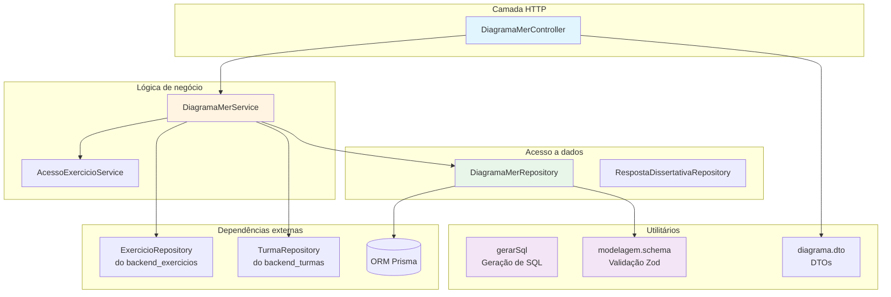
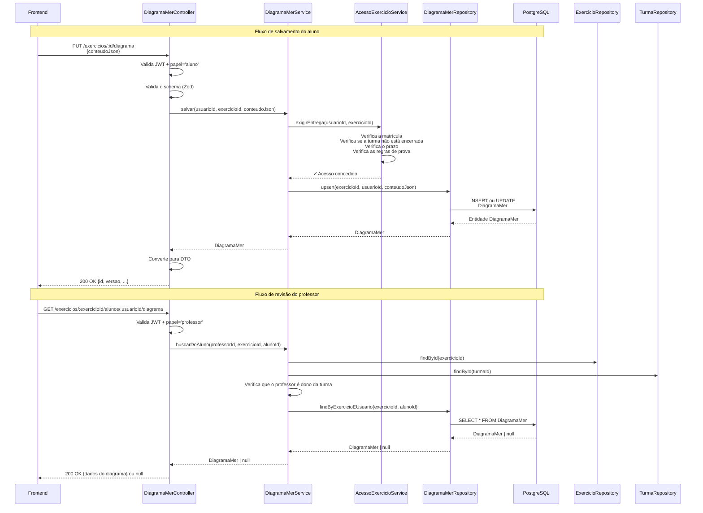
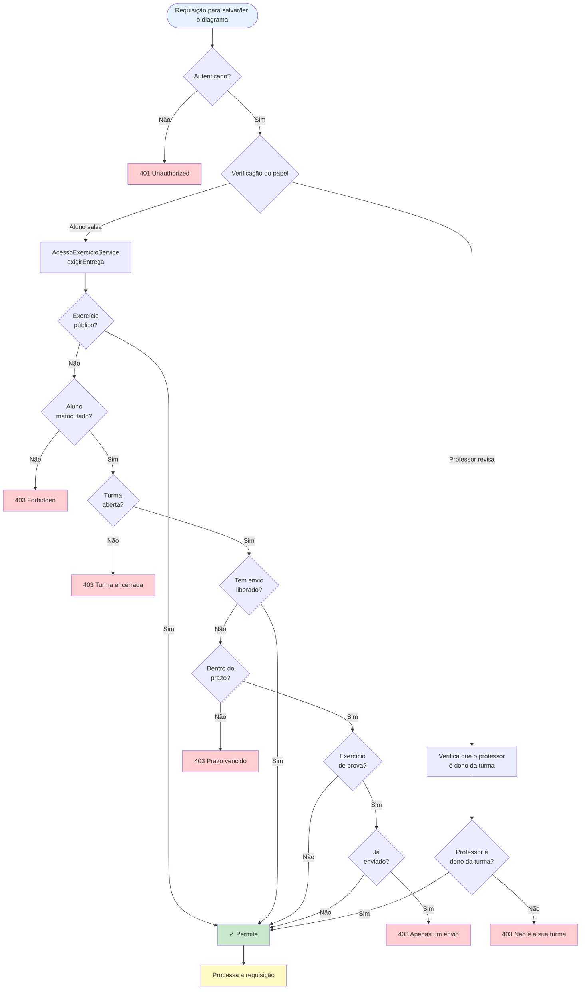
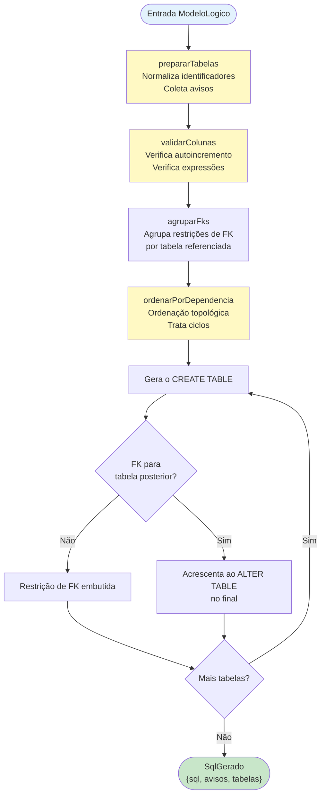
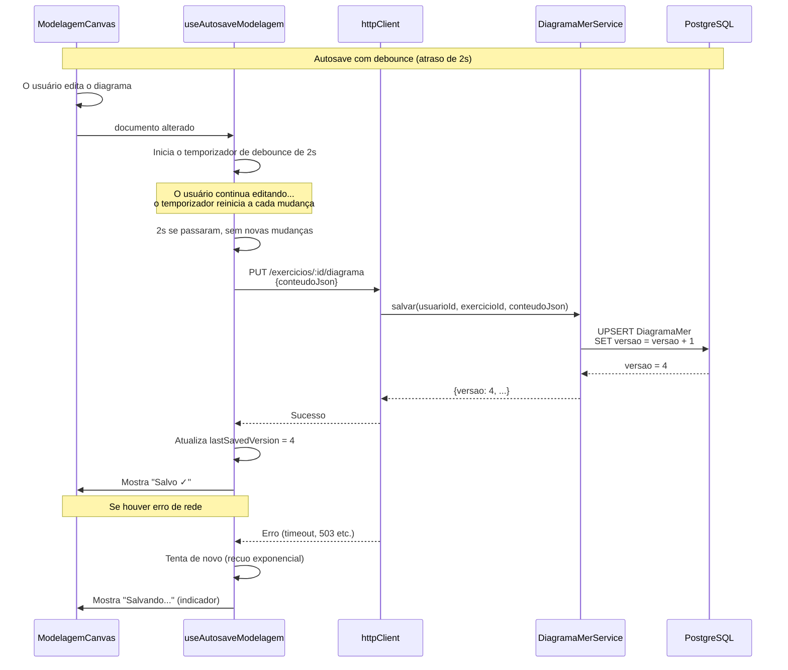
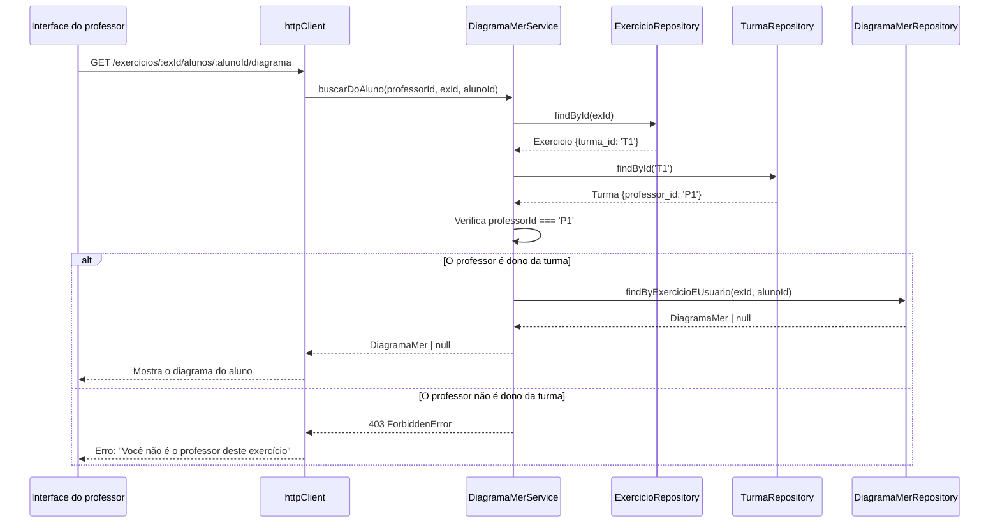
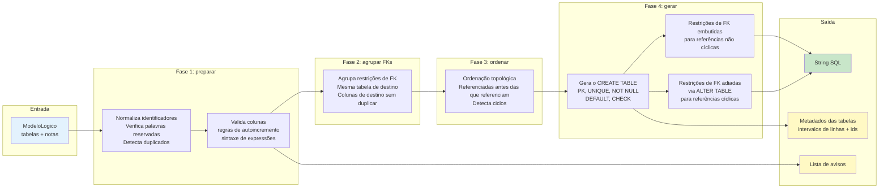

# Módulo Backend Modelagem

> **Módulo**: `backend_modelagem`  
> **Localização**: `ide-web-backend/src/{controllers,services,repositories,utils/modelagem}`  
> **Finalidade**: persistência e lógica de negócio do backend para a modelagem de banco de dados (notação conceitual de Chen e modelo lógico/relacional)

## Visão geral

O módulo `backend_modelagem` gerencia a persistência e a validação dos diagramas de modelagem de banco de dados criados pelos alunos. Ele dá suporte a uma **abordagem de modelagem em dois níveis**:

- **Modelo conceitual**: diagramas Entidade-Relacionamento na notação de Chen (entidades, relacionamentos, atributos, especializações)
- **Modelo lógico**: tabelas relacionais com colunas, restrições e chaves estrangeiras
- **Conversão**: transformação assistida do modelo conceitual em lógico, com decisões conduzidas pelo usuário

Este módulo é um componente central da plataforma educacional IDE Web: permite que os alunos pratiquem o projeto de bancos de dados e que os professores revisem as entregas. Ele impõe um controle de acesso estrito, valida a estrutura do documento e gera DDL PostgreSQL a partir dos modelos lógicos.

### Capacidades principais

- **Persistência com autosave**, com versionamento e controle de concorrência otimista
- **Controle de acesso** integrado à gestão de exercícios e de matrículas
- **Geração de SQL pura** a partir dos modelos lógicos (espelhada entre backend e frontend)
- **Revisão do professor** das entregas dos alunos
- **Validação de schema** com Zod, com verificações de integridade abrangentes
- **Suporte a vários modos**: apenas conceitual, apenas lógico, ou fluxos combinados conceitual→lógico

---

## Arquitetura

### Estrutura dos componentes



### Fluxo de dados



### Fluxo do controle de acesso



---

## Componentes principais

### DiagramaMerController

**Responsabilidade**: tratamento e validação das requisições HTTP

**Localização**: `ide-web-backend/src/controllers/DiagramaMerController.ts`

**Métodos**:
- `salvar(req, res)` - salva o diagrama de modelagem do aluno (PUT `/exercicios/:id/diagrama`)
- `buscar(req, res)` - recupera o diagrama do próprio aluno (GET `/exercicios/:id/diagrama`)
- `buscarDoAluno(req, res)` - o professor recupera o diagrama de um aluno (GET `/exercicios/:exercicioId/alunos/:usuarioId/diagrama`)

**Validação**:
- Autenticação JWT pelo middleware `requireAuth`
- Validação de papel pelo middleware `requirePapel` ('aluno' para salvar/ler, 'professor'/'pesquisador' para revisar)
- Validação de schema com o `salvarDiagramaBodySchema` (Zod)

**Tratamento de erros**:
- `UnauthorizedError` - autenticação ausente
- `ValidationError` - estrutura do diagrama inválida
- Delega os erros de domínio à camada de serviço

---

### DiagramaMerService

**Responsabilidade**: lógica de negócio e orquestração do controle de acesso

**Localização**: `ide-web-backend/src/services/DiagramaMerService.ts`

**Dependências**:
- `DiagramaMerRepository` - persistência de dados
- `ExercicioRepository` - validação do exercício
- `AcessoExercicioService` - aplicação do controle de acesso
- `TurmaRepository` - validação da posse da turma

**Métodos**:

#### `salvar(usuarioId, exercicioId, conteudoJson): Promise<DiagramaMer>`
Salva o diagrama de modelagem de um aluno, com as verificações de controle de acesso.

**Fluxo**:
1. Chama o `acessoExercicio.exigirEntrega()` para validar:
   - O exercício é público OU o aluno está matriculado
   - A turma não está encerrada
   - O prazo não passou (a menos que liberado)
   - As regras de prova (envio único) não foram violadas
2. Delega ao repositório a operação de upsert

**Devolve**: a entidade `DiagramaMer` salva, com a versão incrementada

---

#### `buscar(usuarioId, exercicioId): Promise<DiagramaMer | null>`
Recupera o diagrama do próprio aluno, com validação do acesso de leitura.

**Fluxo**:
1. Chama o `acessoExercicio.exigirLeitura()` para validar:
   - O exercício é público OU o aluno está matriculado
2. Devolve o diagrama, ou null se não for encontrado

---

#### `buscarDoAluno(professorId, exercicioId, alunoId): Promise<DiagramaMer | null>`
Permite que o professor leia o diagrama de um aluno (usado na interface de revisão).

**Controle de acesso**:
- Verifica que o exercício existe
- Verifica que o professor é dono da turma à qual o exercício pertence
- Lança `ForbiddenError` se a verificação de posse falhar

**Nota de segurança**: o professor nunca escreve nos diagramas dos alunos; o acesso é somente leitura.

---

### DiagramaMerRepository

**Responsabilidade**: persistência de dados com o ORM Prisma

**Localização**: `ide-web-backend/src/repositories/DiagramaMerRepository.ts`

**Interface**: `DiagramaMerRepository`

**Implementação**: `PrismaDiagramaMerRepository`

**Métodos**:

#### `findByExercicioEUsuario(exercicioId, usuarioId): Promise<DiagramaMer | null>`
Recupera o diagrama pela chave única composta `(exercicio_id, usuario_id)`.

**Restrição do banco de dados**: usa o índice `@@unique([exercicio_id, usuario_id])` do Prisma para uma busca eficiente.

---

#### `upsert(exercicioId, usuarioId, conteudoJson): Promise<DiagramaMer>`
Cria ou atualiza o diagrama com controle de concorrência otimista.

**Comportamento**:
- **Criar**: define `versao = 1` e guarda o `conteudo_json`
- **Atualizar**: incrementa a `versao`, atualiza o `conteudo_json` e define `atualizado_em = NOW()`

**Operação do Prisma**:
```typescript
prisma.diagramaMer.upsert({
  where: { exercicio_id_usuario_id: { exercicio_id, usuario_id } },
  create: { exercicio_id, usuario_id, conteudo_json, versao: 1 },
  update: { conteudo_json, versao: { increment: 1 } },
})
```

**Versionamento**: o campo `versao` dá suporte à detecção de conflitos em cenários de autosave (o frontend acompanha a última versão conhecida).

---

### RespostaDissertativaRepository

**Responsabilidade**: acesso a dados das respostas dissertativas (texto)

**Localização**: `ide-web-backend/src/repositories/RespostaDissertativaRepository.ts`

**Estado**: **somente leitura** (ainda não há endpoint de escrita; planejado para fases futuras)

**Interface**: `RespostaDissertativaRepository`

**Implementação**: `PrismaRespostaDissertativaRepository`

**Métodos**:

#### `findByExercicioEUsuario(exercicioId, usuarioId): Promise<RespostaDissertativa | null>`
Recupera a resposta dissertativa mais recente de um exercício e de um usuário.

**Nota**: como a `RespostaDissertativa` ainda não tem restrição de unicidade, este método ordena por `versao DESC` e pega o primeiro resultado.

**Uso**: hoje é usado pelo [backend_pacote](backend_pacote.md) para incluir as respostas dissertativas nos PDFs gerados.

---

### gerarSql (função pura)

**Responsabilidade**: geração de DDL PostgreSQL a partir do modelo lógico

**Localização**: `ide-web-backend/src/utils/modelagem/gerarSql.ts`

**Assinatura da função**:
```typescript
function gerarSql(logico: ModeloLogico): SqlGerado
```

**Entrada**: `ModeloLogico` (validado pelo `modeloLogicoSchema`)

**Saída**: objeto `SqlGerado`, contendo:
- `sql: string` - DDL PostgreSQL formatado
- `avisos: string[]` - avisos sobre possíveis problemas (palavras reservadas, PKs ausentes, tipos incompatíveis etc.)
- `tabelas: TabelaGerada[]` - metadados para a sincronização (intervalos de linhas, ids de colunas)

**Princípio de projeto**: **função pura** — sem efeitos colaterais, saída determinística, espelhada entre backend e frontend por consistência.

#### Processo de geração de SQL



#### Recursos principais

1. **Normalização de identificadores**:
   - Converte os nomes para minúsculas e remove caracteres inválidos
   - Detecta palavras reservadas do PostgreSQL e as coloca entre aspas
   - Avisa sobre colisões de nomes

2. **Renderização de tipos**:
   - `VARCHAR(n)` - assume 255 se não especificado
   - `CHAR(n)` - assume 1
   - `NUMERIC(p, s)` - assume (10, 2)
   - Todos os outros tipos são renderizados como estão (INTEGER, BIGINT, DATE etc.)

3. **Geração de restrições**:
   - `PRIMARY KEY` - embutida para uma única coluna, cláusula separada para chave composta
   - `NOT NULL` - omitido para PK e IDENTITY (implícito no PostgreSQL)
   - `UNIQUE` - embutido, a menos que faça parte da PK
   - `DEFAULT` - renderizado como está (sem validação)
   - `CHECK` - renderizado como está, avisa sobre parênteses desbalanceados
   - `FOREIGN KEY` - agrupada por tabela referenciada, valida que o destino é PK ou UNIQUE

4. **Ordenação por dependência**:
   - As tabelas são ordenadas topologicamente para criar primeiro as referenciadas
   - Dependências circulares são detectadas e adiadas para comandos `ALTER TABLE`

5. **Avisos de validação**:
   - Tabelas sem nome ou sem PK
   - Colunas sem nome ou com nomes duplicados
   - Autoincremento em tipos não inteiros
   - Incompatibilidade de tipos em FKs
   - FKs que não apontam para PK ou restrição UNIQUE
   - Palavras reservadas em identificadores

**Implementação espelhada**: esta função é **idêntica** em `ide-web-front/src/features/exercicio/modelagem/gerarSql.ts`, para garantir uma saída de SQL consistente entre o backend (para as dicas de IA) e o frontend (para exibição).

---

## Modelo de dados

### DiagramaMer (entidade Prisma)

**Tabela**: `DiagramaMer`

**Schema**:
```prisma
model DiagramaMer {
  id            String   @id @default(uuid())
  exercicio_id  String
  usuario_id    String
  conteudo_json Json     @db.JsonB
  versao        Int
  atualizado_em DateTime @default(now()) @updatedAt

  exercicio Exercicio @relation(fields: [exercicio_id], references: [id], onDelete: Cascade)
  usuario   Usuario   @relation(fields: [usuario_id], references: [id], onDelete: Cascade)

  @@unique([exercicio_id, usuario_id])
}
```

**Campos**:
- `id` - chave primária UUID
- `exercicio_id` - chave estrangeira para `Exercicio`
- `usuario_id` - chave estrangeira para `Usuario`
- `conteudo_json` - coluna JSONB que guarda o `DocumentoModelagem` (veja abaixo)
- `versao` - contador de versão inteiro (incrementado a cada atualização)
- `atualizado_em` - horário da última atualização

**Restrições**:
- Chave única composta em `(exercicio_id, usuario_id)` - um diagrama por aluno por exercício
- Exclusão em cascata quando o exercício ou o usuário é excluído

---

### DocumentoModelagem (schema JSON)

**Localização**: `ide-web-backend/src/dtos/modelagem.schema.ts`

**Versão**: 2 (veja `VERSAO_DOCUMENTO`)

**Estrutura**:
```typescript
{
  versao: 2,
  conceitual: ModeloConceitual | null,
  logico: ModeloLogico | null,
  conversao: Conversao | null
}
```

#### ModeloConceitual (notação de Chen)

**Elementos**:
- `entidade` - entidade (retângulo)
- `relacionamento` - relacionamento (losango), com a marca `associativa: boolean`
- `atributo` - atributo (círculo), com:
  - `paiId` - elemento pai (entidade, relacionamento ou outro atributo, no caso de composto)
  - `chave` - atributo identificador/chave
  - `cardinalidade` - "(1,1)", "(0,1)", "(0,n)", "(1,n)"
  - `tipoSugerido` - dica de tipo para a conversão (anulável)
- `especializacao` - especialização (triângulo), com:
  - `paiId` - entidade genérica
  - `total` / `disjunta` - classificação (t|p), (d|s)
- `nota` - anotação (caixa de texto)

**Ligações** (conexões):
- `participacao` - ligação entidade-relacionamento, com cardinalidade `(mín, máx)` e `papel` opcional
- `filho_especializacao` - ligação de filho de especialização

**Validação**:
- Sem ids duplicados entre elementos e ligações
- Os atributos precisam ter um pai que seja entidade, relacionamento ou atributo
- As especializações precisam ter uma entidade como pai
- As participações precisam ligar uma entidade a um relacionamento (ou uma entidade associativa a um relacionamento)
- Sem ciclos na hierarquia de atributos

**Modo de visualização**: `visaoAtributos` - "circulos" (círculos) ou "lista" (modo lista no editor)

---

#### ModeloLogico (modelo relacional)

**Tabelas**:
- `id` - identificador único
- `posicao` - posição {x, y} no canvas
- `nome` - nome da tabela (máx. 63 caracteres, pelo limite do PostgreSQL)
- `colunas` - array de colunas (máx. 60 por tabela)

**Colunas**:
- `id` - identificador único
- `nome` - nome da coluna
- `tipo` - um entre: INTEGER, BIGINT, SMALLINT, NUMERIC, REAL, VARCHAR, CHAR, TEXT, DATE, TIME, TIMESTAMP, BOOLEAN
- `tamanho` / `escala` - precisão/escala para NUMERIC, comprimento para VARCHAR/CHAR
- `pk` - marca de chave primária
- `notNull` - restrição NOT NULL
- `unique` - restrição UNIQUE
- `autoIncremento` - GENERATED BY DEFAULT AS IDENTITY (PostgreSQL)
- `padrao` - expressão DEFAULT
- `check` - expressão da restrição CHECK
- `fk` - chave estrangeira: `{tabelaId, colunaId}` ou null

**Validação**:
- Sem ids duplicados entre tabelas, colunas e notas
- A FK precisa apontar para uma coluna existente
- Verificações de integridade estrutural (sem FKs órfãs)

**Notas**: anotações de texto no canvas (máx. 50)

---

#### Conversao (metadados da conversão)

**Finalidade**: acompanha o estado da conversão conceitual→lógico, para detectar quando o modelo conceitual mudou depois da conversão.

**Campos**:
- `assinaturaConceitual` - hash/assinatura do modelo conceitual no momento da conversão
- `convertidoEm` - horário da conversão
- `escolhas` - mapa de `{elementId: estrategia}` que registra as decisões do usuário para:
  - `fk_lado_total` - relacionamento 1:1: FK no lado da participação total
  - `fundir` - relacionamento 1:1: fundir numa tabela só
  - `tabela_propria` - relacionamento N:N: criar uma tabela de junção
  - `tabela_por_entidade` - especialização: uma tabela por entidade
  - `tabela_unica` - especialização: tabela única com discriminador
  - `so_especializadas` - especialização: tabelas apenas para as entidades especializadas

**Uso no frontend**: o `ConceitualLogicoEditor` compara o `assinaturaConceitual()` atual com o valor guardado e mostra um aviso se o modelo conceitual foi modificado depois da conversão.

---

### RespostaDissertativa (entidade Prisma)

**Tabela**: `RespostaDissertativa`

**Schema**:
```prisma
model RespostaDissertativa {
  id            String   @id @default(uuid())
  exercicio_id  String
  usuario_id    String
  texto         String
  versao        Int
  criado_em     DateTime @default(now())

  exercicio Exercicio @relation(fields: [exercicio_id], references: [id], onDelete: Cascade)
  usuario   Usuario   @relation(fields: [usuario_id], references: [id], onDelete: Cascade)
}
```

**Estado atual**: ainda sem restrição de unicidade (planejada); o repositório busca a mais recente por `versao DESC`.

**Uso**: acesso somente leitura, para a geração do PDF e a revisão do professor.

---

## Endpoints da API

### Operações de diagrama do aluno

#### Salvar diagrama
```
PUT /api/v1/exercicios/:id/diagrama
```

**Autenticação**: obrigatória (cookie JWT)  
**Papel**: `aluno`  
**Corpo**:
```json
{
  "conteudoJson": {
    "versao": 2,
    "conceitual": { ... } | null,
    "logico": { ... } | null,
    "conversao": { ... } | null
  }
}
```

**Resposta** (200 OK):
```json
{
  "id": "uuid",
  "exercicioId": "uuid",
  "usuarioId": "uuid",
  "conteudoJson": { ... },
  "versao": 3,
  "atualizadoEm": "2026-09-22T10:30:00.000Z"
}
```

**Erros**:
- 401 - Unauthorized (JWT ausente/inválido)
- 403 - Forbidden (turma encerrada, prazo vencido, não matriculado, envio único da prova violado)
- 422 - Erro de validação (schema inválido, falha na verificação de integridade)

---

#### Recuperar o próprio diagrama
```
GET /api/v1/exercicios/:id/diagrama
```

**Autenticação**: obrigatória  
**Papel**: `aluno`  

**Resposta** (200 OK):
```json
{
  "id": "uuid",
  "exercicioId": "uuid",
  "usuarioId": "uuid",
  "conteudoJson": { ... },
  "versao": 3,
  "atualizadoEm": "2026-09-22T10:30:00.000Z"
}
```

ou `null` se ainda não há diagrama salvo.

**Erros**:
- 401 - Unauthorized
- 403 - Forbidden (não matriculado na turma, em exercício não público)

---

### Operações de revisão do professor

#### Recuperar o diagrama de um aluno
```
GET /api/v1/exercicios/:exercicioId/alunos/:usuarioId/diagrama
```

**Autenticação**: obrigatória  
**Papel**: `professor` ou `pesquisador`  

**Resposta** (200 OK): mesma estrutura da recuperação pelo aluno, ou `null`.

**Erros**:
- 401 - Unauthorized
- 403 - Forbidden (o professor não é dono da turma)
- 404 - Exercício não encontrado

**Uso**: chamado pela interface de revisão do professor (componente `RevisaoModelagem` do frontend) para mostrar o diagrama enviado pelo aluno ao lado do gabarito.

---

## Integração com outros módulos

### Dependências

| Módulo | Componentes usados | Finalidade |
|--------|----------------|---------|
| [backend_exercicios](backend_exercicios.md) | `ExercicioRepository`, `AcessoExercicioService` | Validação do exercício, controle de acesso |
| [backend_turmas](backend_turmas.md) | `TurmaRepository`, `MatriculaRepository` | Verificação da posse da turma, verificações de matrícula |
| [backend_resultado](backend_resultado.md) | `ResultadoExercicioRepository` | Verificar o envio liberado (permissão de envio extra) |
| [backend_errors](backend_errors.md) | `NotFoundError`, `UnauthorizedError`, `ValidationError`, `ForbiddenError` | Tipos de erro de domínio |
| [backend_core](backend_core.md) | `BaseController` | Classe base dos controllers HTTP |

### Dependentes

| Módulo | Uso |
|--------|-------|
| [backend_pacote](backend_pacote.md) | Lê `DiagramaMer` e `RespostaDissertativa` para gerar os PDFs das entregas |
| [backend_dica_ia](backend_dica_ia.md) | Usa o `gerarSql()` para incluir o SQL do modelo lógico nos prompts das dicas de IA |
| [frontend_modelagem](frontend_modelagem.md) | Chama os endpoints de salvar/recuperar, espelha o `gerarSql()` para exibição |

---

## Processos principais

### Fluxo de autosave (frontend → backend)



**Pontos-chave**:
- O frontend faz debounce de 2 segundos para evitar salvamentos excessivos durante a edição ativa
- O upsert do backend é idempotente (seguro para repetir)
- O versionamento dá suporte à detecção de conflitos (hoje não é imposto na interface)
- A validação acontece no backend; o frontend valida de novo na recuperação

---

### Fluxo de revisão do professor



---

### Detalhes da geração de SQL



**Exemplo de saída**:

```sql
CREATE TABLE pessoa (
  id INTEGER GENERATED BY DEFAULT AS IDENTITY,
  nome VARCHAR(100) NOT NULL,
  nascimento DATE,
  PRIMARY KEY (id)
);

CREATE TABLE telefone (
  id INTEGER GENERATED BY DEFAULT AS IDENTITY,
  pessoa_id INTEGER NOT NULL,
  numero VARCHAR(20) NOT NULL,
  PRIMARY KEY (id),
  CONSTRAINT fk_telefone_pessoa_id FOREIGN KEY (pessoa_id) REFERENCES pessoa (id)
);
```

**Avisos**:
```
"nome" é palavra reservada do PostgreSQL; foi escrita entre aspas.
A tabela "endereco" não tem chave primária.
```

---

## Validação de schema

### Camadas de validação

1. **Validação de schema com Zod** (`modelagem.schema.ts`):
   - Verificação de tipos (uniões e enums corretos)
   - Limites de tamanho (nomes de tabela ≤ 63 caracteres, no máximo 150 tabelas, no máximo 60 colunas por tabela)
   - Formato dos campos (ids, posições, expressões)

2. **Verificações de integridade** (`problemasDoLogico`, `problemasDoConceitual`):
   - Sem ids duplicados
   - A FK aponta para uma coluna existente
   - O atributo tem um pai válido (entidade/relacionamento/atributo)
   - A especialização tem uma entidade como pai
   - Sem ciclos na hierarquia de atributos

3. **Avisos semânticos** (no `gerarSql`):
   - Tabela sem PK
   - Coluna sem nome
   - Autoincremento em tipo não inteiro
   - Incompatibilidade de tipo em FK
   - FK que não aponta para PK ou UNIQUE

**Falhar rápido**: as requisições com erros de validação de schema (`problemasDoLogico` / `problemasDoConceitual` não vazios) são rejeitadas com **422 Unprocessable Entity** antes de chegar ao banco de dados.

---

## Considerações de segurança

### Aplicação do controle de acesso

1. **Salvamento pelo aluno**:
   - O exercício precisa ser público OU o aluno estar matriculado na turma
   - A turma não pode estar encerrada (`encerrada_em IS NULL`)
   - O prazo não pode ter passado (a menos que `envio_liberado_em` esteja definido)
   - Exercícios de prova: apenas um envio permitido (verificado pelo `SubmissaoSqlRepository`)

2. **Revisão do professor**:
   - O professor precisa ser dono da turma à qual o exercício pertence
   - Acesso somente leitura (o professor não pode modificar diagramas de alunos)

3. **Autenticação JWT**:
   - Todos os endpoints exigem um JWT válido no cookie `access_token`
   - O JWT contém os claims `usuario.id` e `papel`
   - Sessão validada pela `SessaoAuth` (vida máxima de 6h, tempo de inatividade de 1h)

### Validação de dados

- **Saneamento de entrada**: os schemas Zod rejeitam dados malformados antes de chegarem à lógica de negócio
- **Sem injeção de SQL**: todas as consultas usam o ORM Prisma com comandos parametrizados
- **Segurança do JSONB**: a coluna JSONB do PostgreSQL guarda documentos validados; sem risco de execução

---

## Considerações de desempenho

### Indexação do banco de dados

- **Índice único** em `(exercicio_id, usuario_id)` permite buscas rápidas e impede diagramas duplicados
- **Índices de chave estrangeira** em `exercicio_id` e `usuario_id` para o desempenho dos JOINs

### Otimização do autosave

- O **debounce** (2s) no frontend reduz a frequência de salvamentos durante a edição ativa
- O **versionamento** permite um futuro bloqueio otimista (detectar edições concorrentes)

### Armazenamento em JSONB

- **Armazenamento compacto**: o JSONB é comprimido automaticamente pelo PostgreSQL
- **Sem sobrecarga**: a validação acontece na camada da API; o banco guarda documentos já validados
- **Indexação**: colunas JSONB aceitam índices GIN para necessidades futuras de consulta (hoje não usados)

---

## Estratégia de testes

### Testes unitários (planejados)

- **gerarSql()**: testar a função pura com vários modelos lógicos
  - Tabelas com todos os tipos de restrição
  - Dependências circulares de FK
  - Tratamento de palavras reservadas
  - Geração de avisos

- **Repositório**: simular (mock) o cliente Prisma
  - Testar que o upsert cria e atualiza corretamente
  - Testar o incremento da versão

### Testes de integração (planejados)

- **DiagramaMerService**: testar com Prisma real (banco de teste)
  - Cenários de controle de acesso (matriculado versus não matriculado)
  - Validação da posse do professor
  - Cumprimento do prazo

### Testes E2E

- Testes **Playwright** em `ide-web-front/tests/e2e/`:
  - Fluxo de salvar o diagrama
  - Debounce do autosave
  - Exibição do SQL gerado
  - Interface de revisão do professor

---

## Melhorias futuras

### Recursos planejados

1. **Bloqueio otimista**:
   - O frontend envia o `lastKnownVersion` na requisição de salvar
   - O backend rejeita se a `versao` avançou (edição concorrente detectada)
   - O usuário é convidado a mesclar as mudanças

2. **Endpoint de escrita da RespostaDissertativa**:
   - Acrescentar `POST /exercicios/:id/resposta-dissertativa`
   - Acrescentar restrição de unicidade em `(exercicio_id, usuario_id)`
   - Habilitar o autosave das respostas dissertativas

3. **Histórico de diagramas**:
   - Guardar instantâneos das versões anteriores
   - Permitir voltar a uma versão anterior
   - Visão de diferenças para a revisão do professor

4. **Edição colaborativa**:
   - Sincronização em tempo real por WebSocket (modo de programação em par professor-aluno)
   - Indicadores de presença (quem está editando)

5. **Geração de SQL avançada**:
   - PARTITION BY para a estratégia de tabela única de especialização
   - Sugestões de índices com base nos padrões de FK
   - DDL para views (derivadas dos relacionamentos)

---

## Registros de decisão

**Decisões relacionadas**:
- [Fase 6: Alinhamento com TCC](../../docs/decisions/fase6-alinhamento-tcc.md) - Editor MER real, MER→SQL, documento v2
- [Fase 7: Modelagem Conceitual Chen + Lógica](../../docs/decisions/fase7-modelagem-conceitual-logica.md) - Editor conceitual, assistente de conversão, especialização, atributos compostos/multivalorados
- [Fase 8: Conta do Aluno + Matrícula](../../docs/decisions/fase8-conta-do-aluno-matricula-estudo-livre.md) - Exercícios públicos, modelo de matrícula

---

## Referência rápida

### Tipos principais

```typescript
// Estrutura do documento (v2)
interface DocumentoModelagem {
  versao: 2;
  conceitual: ModeloConceitual | null;
  logico: ModeloLogico | null;
  conversao: Conversao | null;
}

// Modelo lógico
interface ModeloLogico {
  tabelas: Tabela[];
  notas: Nota[];
}

interface Tabela {
  id: string;
  posicao: { x: number; y: number };
  nome: string;
  colunas: Coluna[];
}

interface Coluna {
  id: string;
  nome: string;
  tipo: TipoColuna;
  pk: boolean;
  notNull: boolean;
  unique: boolean;
  autoIncremento: boolean;
  fk: { tabelaId: string; colunaId: string } | null;
  // ... mais DEFAULT, CHECK, tamanho, escala
}

// Saída da geração de SQL
interface SqlGerado {
  sql: string;
  avisos: string[];
  tabelas: TabelaGerada[];
}
```

### Funções principais

```typescript
// Camada de serviço
diagramaMerService.salvar(usuarioId, exercicioId, conteudoJson)
diagramaMerService.buscar(usuarioId, exercicioId)
diagramaMerService.buscarDoAluno(professorId, exercicioId, alunoId)

// Utilitário puro
gerarSql(logico: ModeloLogico): SqlGerado
```

### Variáveis de ambiente

Nenhuma específica deste módulo (usa a conexão compartilhada do Prisma, via `DATABASE_URL`).

---

## Documentação relacionada

- [backend_exercicios](backend_exercicios.md) - gestão de exercícios e controle de acesso
- [backend_turmas](backend_turmas.md) - gestão de turmas e matrículas
- [backend_pacote](backend_pacote.md) - geração de PDF a partir dos diagramas
- [backend_dica_ia](backend_dica_ia.md) - dicas de IA que usam a geração de SQL
- [frontend_modelagem](frontend_modelagem.md) - editores de modelagem do frontend (conceitual + lógico)
- [backend_core](backend_core.md) - controllers base e tratamento de erros
