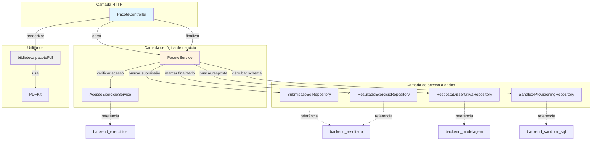
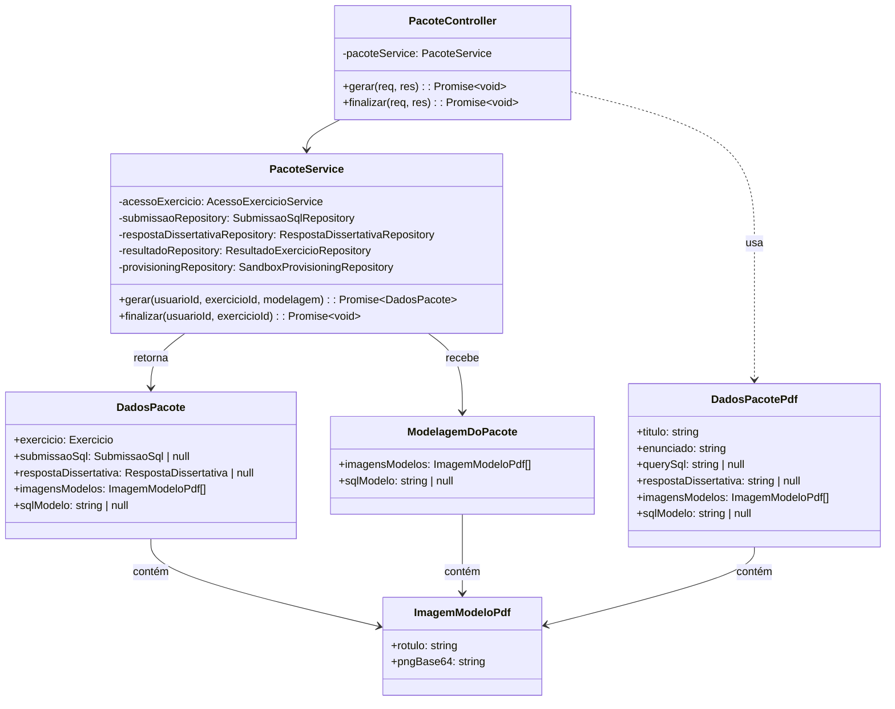
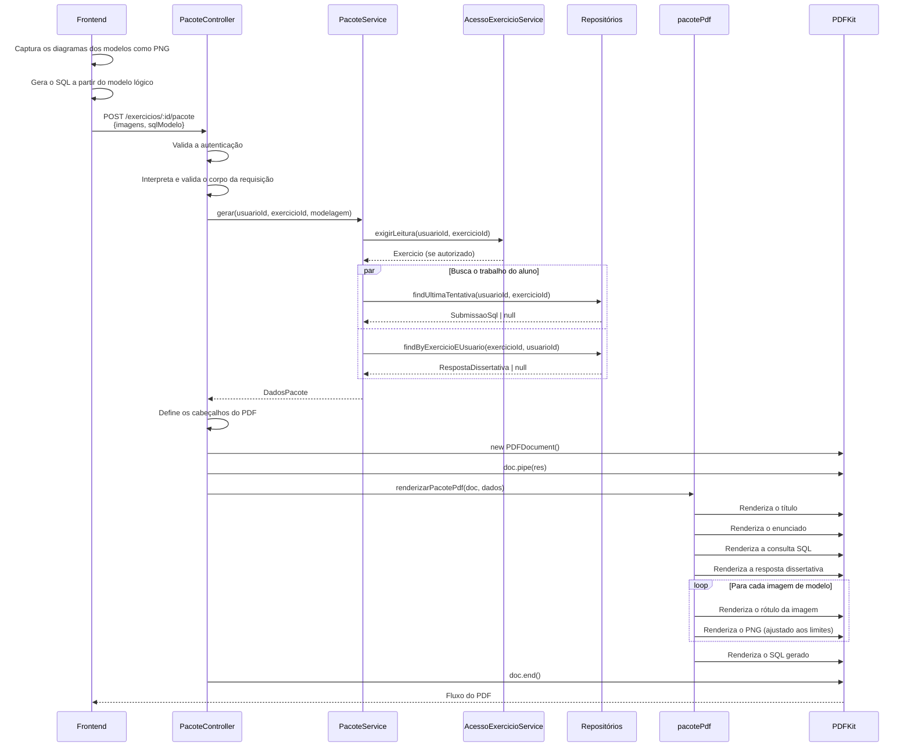
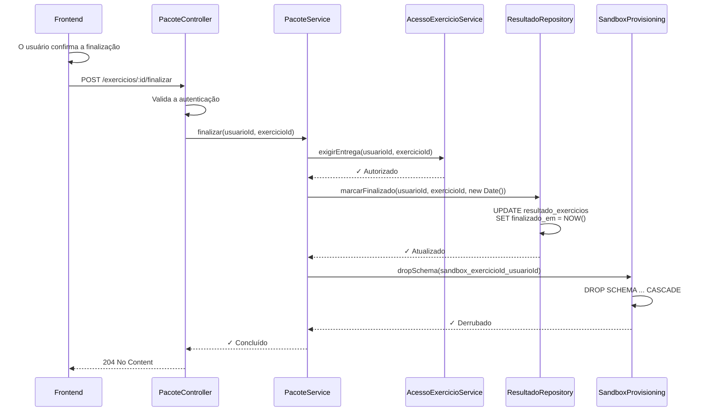
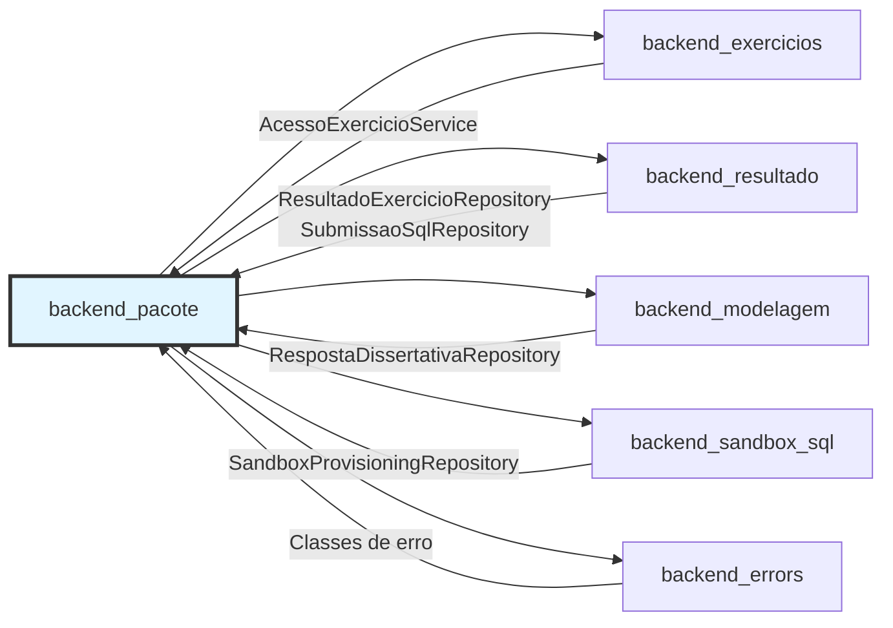
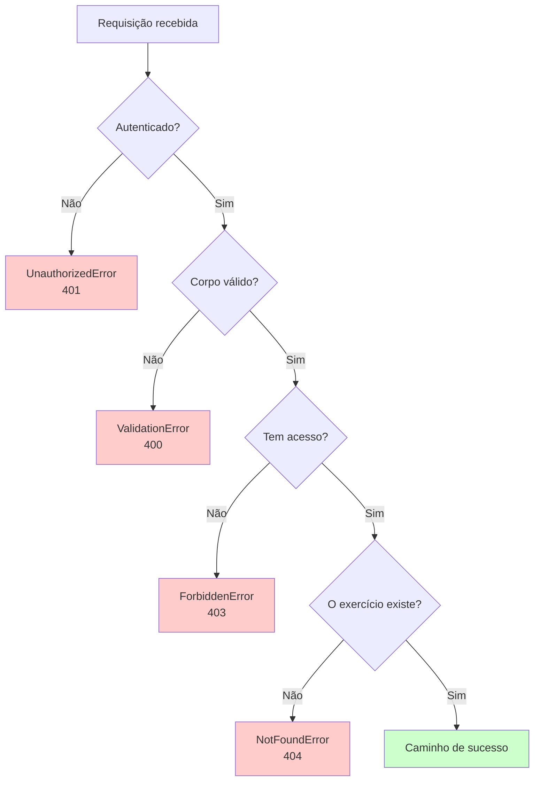

# Módulo Backend Pacote

## Visão geral

O módulo `backend_pacote` é responsável por gerar os pacotes em PDF dos exercícios concluídos e por gerenciar o fluxo de finalização do exercício. Ele permite que os alunos baixem um documento PDF completo com a sua entrega (consulta SQL, diagramas de modelagem, respostas dissertativas) e oferece um endpoint separado para finalizar o exercício, marcando-o como concluído e limpando os recursos do sandbox.

**Responsabilidades principais:**
- Gerar pacotes em PDF que combinam o conteúdo do exercício com as entregas do aluno
- Tratar as imagens dos diagramas de modelo capturadas no frontend
- Gerenciar o fluxo de finalização do exercício
- Limpar os schemas do banco do sandbox depois da conclusão do exercício

**Princípio de projeto central:** desde a Fase 8, o download do PDF é **idempotente e sem efeitos colaterais**. A finalização do exercício é uma **ação separada, de uma única vez**, que exige confirmação explícita do aluno.

## Arquitetura



### Relações entre componentes



## Endpoints da API

### POST /api/v1/exercicios/:id/pacote

**Finalidade:** gerar um pacote em PDF com a entrega do exercício do aluno.

**Autenticação:** obrigatória (JWT pelo middleware `requireAuth`)

**Corpo da requisição:**
```typescript
{
  imagens?: ImagemModeloPdf[];  // Até 2: modelos conceitual e lógico
  sqlModelo?: string | null;     // SQL gerado a partir do modelo lógico
}
```

**Resposta:**
- **Content-Type:** `application/pdf`
- **Content-Disposition:** `attachment; filename="exercicio-{exercicioId}.pdf"`
- **Corpo:** fluxo (stream) do PDF

**Controle de acesso:** valida o acesso de leitura por meio do `AcessoExercicioService.exigirLeitura()`

**Efeitos colaterais:** nenhum (idempotente desde a Fase 8)

---

### POST /api/v1/exercicios/:id/finalizar

**Finalidade:** finalizar o exercício, registrando o horário de conclusão e limpando os recursos do sandbox.

**Autenticação:** obrigatória (JWT pelo middleware `requireAuth`)

**Corpo da requisição:** vazio

**Resposta:**
- **Status:** 204 No Content

**Controle de acesso:** valida o acesso de entrega por meio do `AcessoExercicioService.exigirEntrega()`

**Efeitos colaterais:**
1. Registra o horário em `ResultadoExercicio.finalizado_em`
2. Derruba o schema do sandbox `sandbox_<exercicioId>_<usuarioId>`

**Importante:** esta é uma **ação de uma única vez**. O frontend mostra uma janela de confirmação antes de chamar este endpoint.

## Fluxo de dados

### Fluxo de geração do PDF



### Fluxo de finalização do exercício



## Detalhamento dos componentes

### PacoteController

**Localização:** `ide-web-backend/src/controllers/PacoteController.ts`

**Responsabilidades:**
- Tratamento de requisição e resposta HTTP das operações do pacote
- Validação da requisição com schemas Zod
- Configuração do streaming do PDF
- Delegação da lógica de negócio ao PacoteService

**Métodos principais:**

#### `gerar(req: Request, res: Response): Promise<void>`
Gera e transmite (stream) um pacote em PDF com a entrega do exercício do aluno.

**Processo:**
1. Valida a autenticação do usuário
2. Interpreta o corpo da requisição com o `gerarPacoteBodySchema`
3. Chama o `pacoteService.gerar()` para coletar os dados
4. Configura os cabeçalhos de resposta do PDF
5. Cria a instância do documento PDFKit
6. Transmite o PDF na resposta usando o `renderizarPacotePdf()`
7. Encerra o fluxo do documento

**Tratamento de erros:**
- `UnauthorizedError` - nenhum usuário autenticado
- `ValidationError` - formato do corpo da requisição inválido

---

### PacoteService

**Localização:** `ide-web-backend/src/services/PacoteService.ts`

**Dependências:**
- `AcessoExercicioService` - validação do controle de acesso
- `SubmissaoSqlRepository` - obtenção da submissão SQL
- `RespostaDissertativaRepository` - obtenção da resposta dissertativa
- `ResultadoExercicioRepository` - gestão do resultado do exercício
- `SandboxProvisioningRepository` - ciclo de vida dos schemas do sandbox

**Métodos principais:**

#### `gerar(usuarioId: string, exercicioId: string, modelagem: ModelagemDoPacote): Promise<DadosPacote>`

Coleta todos os dados necessários para a geração do PDF.

**Processo:**
1. Verifica o acesso de leitura por meio do `acessoExercicio.exigirLeitura()`
2. Busca a última submissão SQL (em paralelo)
3. Busca a resposta dissertativa (em paralelo)
4. Combina com os dados de modelagem vindos da requisição
5. Devolve os dados completos do pacote

**Regras de acesso:**
- Exercícios públicos: qualquer aluno autenticado
- Exercícios de turma: exige matrícula na turma do exercício
- Turmas encerradas: acesso somente leitura

**Devolve:** `DadosPacote`, contendo:
- Metadados do exercício (título, enunciado)
- Última submissão SQL (se houver)
- Resposta dissertativa (se houver)
- Imagens dos modelos, vindas do frontend
- SQL gerado a partir do modelo lógico

---

#### `finalizar(usuarioId: string, exercicioId: string): Promise<void>`

Marca o exercício como concluído e limpa os recursos.

**Processo:**
1. Verifica o acesso de entrega por meio do `acessoExercicio.exigirEntrega()`
2. Grava o horário atual em `ResultadoExercicio.finalizado_em`
3. Derruba o schema do sandbox `sandbox_<exercicioId>_<usuarioId>`

**Regras de acesso:**
- Exige matrícula (exercícios públicos apenas com correção automática)
- Bloqueado se a turma estiver encerrada
- Bloqueado se o prazo da prova tiver passado (sem permissão explícita)
- Bloqueado se a prova já foi enviada (apenas um envio)

**Efeitos colaterais:**
- Registro permanente do horário
- Exclusão do schema do sandbox (irreversível)
- O aluno não pode modificar a entrega depois da finalização

**Importante:** o PDF ainda pode ser baixado depois da finalização, porque é montado a partir das submissões persistidas, e não do schema vivo do sandbox.

---

### Biblioteca pacotePdf

**Localização:** `ide-web-backend/src/lib/pacotePdf.ts`

**Finalidade:** lógica pura de renderização da geração do pacote em PDF.

**Função principal:**

#### `renderizarPacotePdf(doc: PDFKit.PDFDocument, dados: DadosPacotePdf): void`

**Projeto:** função pura, sem efeitos colaterais. Quem chama controla o ciclo de vida do documento (criação, encadeamento, encerramento).

**Seções renderizadas** (em ordem):
1. **Título** - 18pt, sublinhado
2. **Enunciado** - 12pt, descrição do exercício
3. **Consulta SQL** - fonte Courier 10pt, a consulta enviada
4. **Resposta dissertativa** - 12pt, resposta em texto
5. **Diagramas dos modelos** - até 2 imagens (conceitual + lógico)
   - Rótulo: 14pt em negrito
   - Imagem: ajustada a no máximo 480×320px
   - Formato: PNG em Base64, vindo do frontend
6. **SQL gerado** - fonte Courier 10pt, DDL do modelo lógico

**Constantes:**
```typescript
DIAGRAMA_LARGURA_MAX = 480    // Largura máxima do diagrama
DIAGRAMA_ALTURA_MAX = 320     // Altura máxima do diagrama
TAMANHO_FONTE_TITULO = 18     // Tamanho da fonte do título
TAMANHO_FONTE_SECAO = 14      // Tamanho do cabeçalho de seção
TAMANHO_FONTE_TEXTO = 12      // Tamanho do texto do corpo
TAMANHO_FONTE_CODIGO = 10     // Tamanho do bloco de código
```

**Tratamento de imagens:**
- Recebe strings PNG codificadas em Base64
- Converte para Buffer para o PDFKit
- Mantém a proporção com o parâmetro `fit`
- No máximo 2 imagens (uma por tipo de modelo)

---

## Tipos de dados

### DadosPacote
Dados completos do pacote, montados pelo PacoteService.

```typescript
interface DadosPacote {
  exercicio: Exercicio;                          // Metadados do exercício
  submissaoSql: SubmissaoSql | null;             // Última submissão SQL
  respostaDissertativa: RespostaDissertativa | null;  // Resposta dissertativa
  imagensModelos: ImagemModeloPdf[];             // Diagramas dos modelos (0-2)
  sqlModelo: string | null;                      // DDL gerado
}
```

---

### ModelagemDoPacote
Dados de modelagem enviados pelo frontend durante a geração do PDF.

```typescript
interface ModelagemDoPacote {
  imagensModelos: ImagemModeloPdf[];  // Imagens dos diagramas capturados
  sqlModelo: string | null;            // DDL PostgreSQL gerado
}
```

**Responsabilidade do frontend:**
- Capturar os diagramas do React Flow como PNG usando o `captura.ts`
- Gerar o SQL a partir do modelo lógico usando o `gerarSql.ts`
- Codificar as imagens como strings Base64

---

### ImagemModeloPdf
Imagem de um único diagrama de modelo, com rótulo.

```typescript
interface ImagemModeloPdf {
  rotulo: string;      // Rótulo exibido (p. ex., "Modelo Conceitual")
  pngBase64: string;   // Dados da imagem PNG codificados em Base64
}
```

**Uso:**
- Modelo conceitual: diagrama na notação de Chen
- Modelo lógico: diagrama do esquema relacional
- No máximo 2 imagens por exercício

---

### DadosPacotePdf
Estrutura de dados achatada para a renderização do PDF.

```typescript
interface DadosPacotePdf {
  titulo: string;                        // Título do exercício
  enunciado: string;                     // Enunciado do exercício
  querySql: string | null;               // Consulta SQL enviada
  respostaDissertativa: string | null;   // Texto da resposta dissertativa
  imagensModelos: ImagemModeloPdf[];     // Diagramas dos modelos
  sqlModelo: string | null;              // DDL gerado a partir do modelo lógico
}
```

---

## Pontos de integração

### Dependências de outros módulos



**Controle de acesso** ([backend_exercicios](backend_exercicios.md)):
- `AcessoExercicioService.exigirLeitura()` - valida o acesso de leitura para a geração do PDF
- `AcessoExercicioService.exigirEntrega()` - valida o acesso de entrega para a finalização
- Trata exercícios públicos, matrícula, turmas encerradas e restrições de prova

**Gestão de resultados** ([backend_resultado](backend_resultado.md)):
- `ResultadoExercicioRepository.marcarFinalizado()` - registra o horário de conclusão
- `SubmissaoSqlRepository.findUltimaTentativa()` - obtém a última submissão SQL

**Dados de modelagem** ([backend_modelagem](backend_modelagem.md)):
- `RespostaDissertativaRepository.findByExercicioEUsuario()` - obtém as respostas dissertativas
- Complementado por imagens dos diagramas e pelo SQL gerado, vindos do frontend

**Gestão do sandbox** ([backend_sandbox_sql](backend_sandbox_sql.md)):
- `SandboxProvisioningRepository.dropSchema()` - limpa os schemas de sandbox por aluno
- Nome do schema: `sandbox_<exercicioId>_<usuarioId>`

**Tratamento de erros** ([backend_errors](backend_errors.md)):
- `UnauthorizedError` - autenticação ausente
- `ValidationError` - formato de requisição inválido
- Erros de acesso propagados do `AcessoExercicioService`

---

### Integração com o frontend

**Módulo:** [frontend_exercicios](frontend_exercicios.md)

**Componente:** `FinalizarPacoteButton`

**Fluxo:**
1. O aluno trabalha nas partes do exercício (SQL, modelagem, dissertativa)
2. O aluno clica no botão **"Baixar PDF"**:
   - Captura imagens dos diagramas usando a exportação do React Flow
   - Gera o SQL a partir do modelo lógico
   - Chama `POST /exercicios/:id/pacote` com as imagens e o SQL
   - Baixa o arquivo PDF devolvido
   - **Pode ser repetido várias vezes** (sem efeitos colaterais)

3. O aluno clica no botão **"Finalizar"**:
   - Mostra uma janela de confirmação avisando do caráter definitivo
   - Avisa se o PDF ainda não foi baixado
   - Chama `POST /exercicios/:id/finalizar`
   - **Ação de uma única vez** - não pode ser desfeita

**Método de serviço:**
```typescript
// frontend: features/exercicio/services/exercicioService.ts
async baixarPacote(exercicioId: string, pedido: PacotePedido): Promise<Blob>
async finalizar(exercicioId: string): Promise<void>
```

**Preparação dos dados:**
```typescript
// frontend: features/exercicio/modelagem/captura.ts
function capturarImagensModelos(): ImagemModelo[]

// frontend: features/exercicio/modelagem/gerarSql.ts
function gerarSql(modelo: ModeloLogico): string
```

---

## Regras de negócio

### Regras de geração do PDF

1. **Controle de acesso:**
   - Aluno autenticado exigido
   - Acesso de leitura verificado pelo `AcessoExercicioService`
   - Exercícios públicos: qualquer aluno autenticado
   - Exercícios de turma: precisa estar matriculado

2. **Conteúdo incluído:**
   - Sempre inclui: título, enunciado
   - Inclui condicionalmente (se presentes):
     - Última submissão SQL
     - Resposta dissertativa
     - Diagramas dos modelos (0-2 imagens)
     - SQL gerado a partir do modelo lógico

3. **Idempotência:**
   - Nenhuma modificação no banco de dados
   - Nenhuma alteração no sandbox
   - Pode ser chamado repetidamente
   - Sempre devolve o estado atual das submissões

4. **Tratamento de imagens:**
   - No máximo 2 diagramas (conceitual + lógico)
   - Imagens capturadas e codificadas pelo frontend
   - Formato PNG em Base64
   - Ajustadas às dimensões máximas, preservando a proporção

---

### Regras de finalização do exercício

1. **Controle de acesso:**
   - Aluno autenticado exigido
   - Acesso de entrega verificado pelo `AcessoExercicioService`
   - Verificações adicionais:
     - Matrícula na turma exigida (exceto exercícios públicos)
     - Bloqueado se a turma estiver encerrada
     - Bloqueado se o prazo da prova tiver passado (sem prorrogação explícita)
     - Bloqueado se a prova já foi enviada (apenas um envio)

2. **Mudanças de estado:**
   - Registra o horário `finalizado_em` no `ResultadoExercicio`
   - Derruba o schema do sandbox de forma permanente
   - Não pode ser revertido

3. **Limpeza de recursos:**
   - Schema do sandbox: `sandbox_<exercicioId>_<usuarioId>`
   - Schema derrubado com CASCADE
   - Libera recursos do banco de dados
   - Todas as tabelas e dados do sandbox são excluídos de forma permanente

4. **Depois da finalização:**
   - O PDF ainda pode ser gerado (usa as submissões persistidas)
   - O aluno não pode modificar as submissões
   - As notas da correção automática são preservadas
   - A revisão manual continua possível para os professores

---

## Contexto histórico

### Mudanças da Fase 8 (setembro de 2026)

**Decisão:** [fase8-conta-do-aluno-matricula-estudo-livre.md](../../docs/decisions/fase8-conta-do-aluno-matricula-estudo-livre.md)

**Principais mudanças:**
1. **Separação entre download e finalização:**
   - Antes: `POST /exercicios/:id/pacote` reiniciava o sandbox
   - Agora: o download do PDF é **sem efeitos colaterais e repetível**
   - A finalização é uma **ação explícita separada**, pelo `/finalizar`

2. **Justificativa:**
   - Os alunos precisam baixar o PDF várias vezes (revisão, backup)
   - O reinício acidental do sandbox era frustrante
   - A finalização deve ser deliberada e confirmada
   - Alinha-se aos requisitos do modo prova (não se pode testar depois do envio)

3. **Experiência do usuário:**
   - Dois botões separados na interface
   - "Baixar PDF" - pode ser clicado a qualquer momento, quantas vezes quiser
   - "Finalizar" - exige uma janela de confirmação
   - Aviso mostrado ao finalizar sem ter baixado antes

**Antes da Fase 8:**
```typescript
// Comportamento antigo (removido)
async baixarPacote() {
  // Gerava o PDF
  await resetarSandbox();  // ❌ Efeito colateral removido
}
```

**Depois da Fase 8:**
```typescript
// Comportamento novo (atual)
async gerar() {
  // Só gera o PDF - sem efeitos colaterais ✓
}

async finalizar() {
  await marcarFinalizado();
  await dropSchema();     // Finalização explícita ✓
}
```

---

## Tratamento de erros

### Cenários de erro comuns



**Tipos de erro:**

| Erro | Status HTTP | Cenário | Mensagem em português |
|-------|-------------|----------|-------------------|
| `UnauthorizedError` | 401 | JWT ausente ou inválido | "Autenticação necessária" |
| `ValidationError` | 400 | Corpo da requisição inválido | "Dados de pacote inválidos" |
| `ForbiddenError` | 403 | Sem matrícula / turma encerrada | "Acesso não autorizado" |
| `NotFoundError` | 404 | O exercício não existe | "Exercício não encontrado" |
| `ConflictError` | 409 | Já finalizado (prova) | "Exercício já finalizado" |

**Erros de controle de acesso:**

Do `AcessoExercicioService`:
- Sem matrícula na turma → `ForbiddenError`
- Turma encerrada e o aluno está entregando → `ForbiddenError`
- Prazo da prova vencido → `ForbiddenError`
- Prova já enviada → `ForbiddenError`

**Erros de banco de dados:**

Dos repositórios:
- Falha de conexão → `SandboxIndisponivelError` (503)
- Tempo esgotado da consulta → propagado como erro interno do servidor (500)

---

## Considerações sobre testes

### Cobertura de testes unitários

**PacoteController:**
- [ ] Validação da autenticação
- [ ] Interpretação e validação do corpo da requisição
- [ ] Configuração dos cabeçalhos do PDF
- [ ] Tratamento de erros e códigos de status
- [ ] Delegação ao serviço

**PacoteService:**
- [ ] Integração do controle de acesso
- [ ] Busca de dados em vários repositórios
- [ ] Execução paralela de consultas
- [ ] Limpeza do schema do sandbox
- [ ] Registro do horário de finalização

**pacotePdf:**
- [ ] Renderização da estrutura do documento
- [ ] Aplicação de fontes e estilos
- [ ] Inclusão e dimensionamento de imagens
- [ ] Decodificação do Base64
- [ ] Ordem das seções

### Cenários de testes de integração

1. **Geração do PDF:**
   ```
   DADO um aluno autenticado e matriculado na turma
   E um exercício com todas as partes concluídas
   QUANDO o aluno pede o pacote em PDF
   ENTÃO o PDF contém todas as partes da entrega
   E o sandbox permanece inalterado
   ```

2. **Downloads repetidos:**
   ```
   DADO um aluno que já baixou o PDF uma vez
   QUANDO o aluno pede o PDF de novo
   ENTÃO o segundo PDF é igual ao primeiro
   E nenhuma mudança de estado ocorre
   ```

3. **Finalização do exercício:**
   ```
   DADO um aluno com um schema de sandbox ativo
   QUANDO o aluno finaliza o exercício
   ENTÃO o horário finalizado_em é registrado
   E o schema do sandbox é derrubado
   E a geração posterior do PDF continua funcionando
   ```

4. **Controle de acesso:**
   ```
   DADO um aluno não matriculado na turma
   QUANDO o aluno tenta baixar o PDF
   ENTÃO a requisição é rejeitada com 403
   ```

5. **Restrições de prova:**
   ```
   DADO um exercício em modo prova
   E um aluno que já enviou uma vez
   QUANDO o aluno tenta finalizar de novo
   ENTÃO a requisição é rejeitada com 409
   ```

### Cenários de testes ponta a ponta (E2E)

Localizados em: `ide-web-front/tests/e2e/`

**Casos de teste do Playwright:**
1. Fluxo completo do exercício (SQL + modelagem + dissertativa)
2. Baixar o PDF várias vezes
3. Verificar o conteúdo do PDF
4. Finalizar o exercício com confirmação
5. Verificar que a finalização impede novos envios
6. Verificar que o PDF continua disponível para download depois da finalização

---

## Considerações de desempenho

### Desempenho da geração do PDF

**Gargalos:**
- Decodificação de imagens: conversão de Base64 para Buffer
- Renderização do PDFKit: geração síncrona do documento
- Rede: transmissão de PDFs grandes

**Otimizações:**
1. **Busca de dados em paralelo:**
   ```typescript
   await Promise.all([
     this.submissaoRepository.findUltimaTentativa(...),
     this.respostaDissertativaRepository.findByExercicioEUsuario(...)
   ]);
   ```

2. **Resposta em streaming:**
   - `doc.pipe(res)` - transmite o PDF conforme ele é gerado
   - Evita manter o PDF inteiro em memória
   - Reduz a latência em documentos grandes

3. **Limites de tamanho das imagens:**
   - O frontend captura os diagramas numa resolução razoável
   - Dimensões máximas impostas (480×320px)
   - Mantém o equilíbrio entre qualidade e tamanho

**Desempenho esperado:**
- Exercício simples (só SQL): ~100ms
- Exercício completo (SQL + 2 diagramas + dissertativa): ~300-500ms
- O tempo de transferência pela rede depende do tamanho do PDF (tipicamente 100KB-2MB)

---

### Desempenho da limpeza do sandbox

**Exclusão do schema:**
```sql
DROP SCHEMA IF EXISTS sandbox_exercicio_usuario CASCADE;
```

**Impacto:**
- Operação síncrona durante a finalização
- Pode ser lenta em schemas grandes (muitas tabelas/linhas)
- Executa no contexto do banco de dados, não da aplicação

**Considerações:**
- A finalização é uma ação de uma única vez (não frequente)
- O usuário espera algum atraso ao finalizar
- A limpeza evita o inchaço do banco de dados ao longo do tempo

**Otimização futura:**
- Considerar um job de limpeza assíncrono (devolver 204 imediatamente)
- Acompanhar o estado da limpeza para monitoramento
- Limpeza em lote para exercícios encerrados

---

## Considerações de segurança

### Autenticação e autorização

1. **Validação do JWT:**
   - Todos os endpoints exigem um JWT válido
   - Token verificado pelo middleware `requireAuth`
   - ID do usuário extraído do payload do token

2. **Controle de acesso:**
   - Permissões por exercício por meio do `AcessoExercicioService`
   - Exercícios públicos: apenas alunos autenticados
   - Exercícios de turma: matrícula exigida
   - Impede o acesso a dados entre alunos

3. **Isolamento de recursos:**
   - Cada aluno tem um schema de sandbox isolado
   - Os nomes dos schemas incluem o exerciseId e o userId
   - Impede o vazamento de dados entre alunos

### Privacidade de dados

1. **Conteúdo do PDF:**
   - Inclui apenas as submissões do próprio usuário autenticado
   - Não inclui comentários nem notas do professor
   - O enunciado do exercício é público (sem preocupação de privacidade)

2. **Limpeza do sandbox:**
   - Derruba o schema com CASCADE
   - Garante a remoção completa dos dados
   - Nenhum dado de aluno órfão permanece

### Validação de entrada

1. **Validação do corpo da requisição:**
   - Schema Zod: `gerarPacoteBodySchema`
   - Valida a estrutura do array de imagens
   - Impede a injeção de dados malformados

2. **Validação do Base64:**
   - O PDFKit trata erros de decodificação com tolerância
   - Imagens malformadas falham em silêncio (não são incluídas)
   - Nenhuma queda do servidor por dados de imagem inválidos

3. **Injeção de SQL:**
   - Não se aplica: não há SQL de usuário na geração do PDF
   - A limpeza do sandbox usa nomes de schema parametrizados
   - Veja [backend_sandbox_sql](backend_sandbox_sql.md) para a segurança da execução de SQL

---

## Configuração

### Variáveis de ambiente

Nenhuma variável de ambiente específica é exigida por este módulo.

**Dependências indiretas:**
- `DATABASE_URL` - conexão do banco principal (Prisma)
- `SANDBOX_DATABASE_URL` - banco do sandbox, para a limpeza dos schemas
- `JWT_SECRET` - validação do token (autenticação)

### Dependências

**Pacotes NPM:**
```json
{
  "pdfkit": "^0.x.x"  // Biblioteca de geração de PDF
}
```

**Configuração de build relacionada:**

De `ide-web-backend/package.json`:
```json
{
  "scripts": {
    "build": "tsc",
    "start": "node dist/server.js"
  }
}
```

**Configuração do TypeScript:**

De `ide-web-backend/tsconfig.json`:
- Target: ES2020
- Module: CommonJS
- Modo estrito habilitado
- Cliente Prisma incluído nos paths

---

## Melhorias futuras

### Melhorias possíveis

1. **Limpeza assíncrona do sandbox:**
   - Enfileirar a finalização para processamento em segundo plano
   - Devolver 204 imediatamente e limpar de forma assíncrona
   - Monitorar o estado da limpeza

2. **Personalização do PDF:**
   - Modelos de PDF definidos pelo professor
   - Incluir ou excluir seções específicas
   - Identidade visual própria por instituição

3. **Histórico de versões:**
   - Acompanhar várias gerações de PDF
   - Permitir que o aluno baixe versões anteriores
   - Trilha de auditoria dos downloads

4. **Compressão:**
   - Otimizar a compressão das imagens antes da codificação em Base64
   - Reduzir o tamanho do arquivo PDF
   - Transferência de rede mais rápida

5. **Operações em lote:**
   - O professor baixa todos os PDFs dos alunos de uma turma
   - Finalização em lote para exercícios encerrados
   - Limpeza automática de sandboxes antigos

### Contexto do módulo de pesquisa

**Nota:** este módulo faz parte da plataforma principal da IDE e permanecerá depois do período de pesquisa do TCC. Os recursos de geração do pacote e de finalização são funcionalidades permanentes para o uso normal em sala de aula.

Veja [backend_pesquisa](backend_pesquisa.md) para os componentes específicos da pesquisa, que serão removidos depois da coleta de dados.

---

## Documentação relacionada

- [backend_exercicios](backend_exercicios.md) - gestão de exercícios e controle de acesso
- [backend_resultado](backend_resultado.md) - resultados dos exercícios e acompanhamento de submissões
- [backend_modelagem](backend_modelagem.md) - persistência dos diagramas de modelagem
- [backend_sandbox_sql](backend_sandbox_sql.md) - ciclo de vida do sandbox SQL
- [backend_errors](backend_errors.md) - padrões de tratamento de erros
- [frontend_exercicios](frontend_exercicios.md) - componentes de exercício do frontend
- [frontend_modelagem](frontend_modelagem.md) - captura de diagramas e geração de SQL

**Documentos de decisão:**
- `docs/decisions/fase8-conta-do-aluno-matricula-estudo-livre.md` - separação entre download e finalização
- `docs/decisions/fase7-modelagem-conceitual-logica.md` - suporte a diagramas de modelagem no PDF
- `docs/decisions/fase2-sandbox-sql-diagrama-mer.md` - projeto original do sandbox

---

## Resumo

O módulo `backend_pacote` oferece uma separação clara entre **recuperar o estado do exercício** (geração do PDF) e **finalizar a entrega do exercício** (limpeza e horário). Esse projeto surgiu das melhorias da Fase 8, para permitir downloads repetíveis do PDF sem efeitos colaterais, mantendo o controle explícito da limpeza de recursos e da conclusão do exercício.

**Princípios de projeto principais:**
- **Leituras idempotentes:** a geração do PDF não tem efeitos colaterais
- **Finalização explícita:** endpoint separado, com confirmação
- **Controle de acesso:** centralizado no AcessoExercicioService
- **Renderização pura:** a biblioteca de PDF não tem lógica de negócio
- **Limpeza de recursos:** schemas do sandbox derrubados na finalização

**Integração:** este módulo coordena dados de exercícios, submissões, diagramas de modelagem e recursos do sandbox para criar pacotes em PDF completos, ao mesmo tempo que gerencia o ciclo de vida do exercício.
