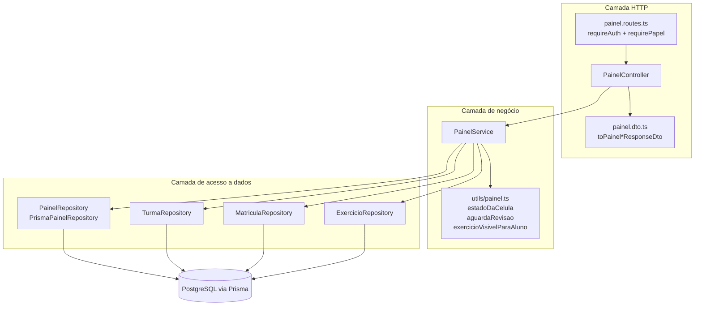
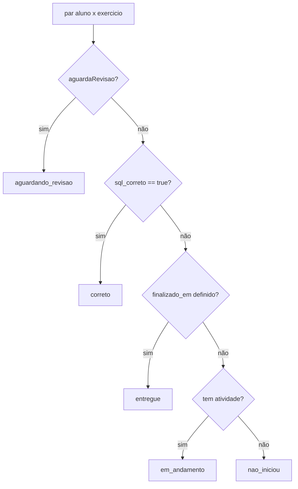
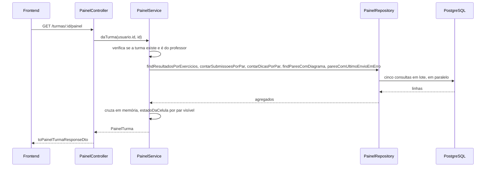

# Módulo Backend Painel

## Visão geral

O módulo `backend_painel` monta os **painéis** do sistema IDE Web: um para o professor (todas as turmas dele de relance, mais uma matriz aluno × exercício por turma) e um para o aluno (o progresso dele mesmo em todas as turmas em que está matriculado). Ele não é dono de nenhuma tabela. Apenas **lê e agrega** dados que outros módulos escrevem: `Turma`, `MatriculaTurma`, `Exercicio`, `ResultadoExercicio`, `SubmissaoSql`, `DicaIa` e `DiagramaMer`.

**Responsabilidades principais:**
- Resumir todas as turmas de um professor (alunos, exercícios, entregas, revisões pendentes, última atividade)
- Montar a matriz por turma de células `aluno × exercício`, cada uma com um estado derivado
- Ordenar os exercícios por dificuldade (taxa de acerto, média de tentativas, dicas por aluno)
- Dar ao professor todas as atividades de um aluno numa turma (a tela de revisão por aluno)
- Dar ao aluno um painel pessoal que nunca o compara com os colegas

**Documentação relacionada:**
- [Backend Turmas](backend_turmas.md) - turmas, matrícula e `MatriculaTurma`
- [Backend Exercicios](backend_exercicios.md) - os exercícios a partir dos quais a matriz é montada
- [Backend Resultado](backend_resultado.md) - `ResultadoExercicio`, a fonte de "entregue" e "correto"
- [Backend Provas](backend_provas.md) - variantes de prova que decidem quais exercícios o aluno vê
- [Backend Sandbox SQL](backend_sandbox_sql.md) - grava `SubmissaoSql`, contada aqui como tentativas
- [Backend Dica IA](backend_dica_ia.md) - grava `DicaIa`, contada aqui como dicas
- [Frontend Painel](frontend_painel.md) - as telas que consomem estes endpoints

---

## Arquitetura



O módulo segue as camadas MSC usadas em todo o backend: `routes → controllers → services → repositories`. As dependências são ligadas à mão em `painel.routes.ts`, que instancia os quatro repositórios Prisma, injeta-os no `PainelService` e entrega o serviço ao `PainelController`.

---

## Endpoints

Todas as rotas ficam sob `/api/v1` e exigem uma sessão autenticada (`requireAuth`) mais uma verificação de papel (`requirePapel`).

| Método e caminho | Papéis | Método do controller | Método do serviço | Finalidade |
|---|---|---|---|---|
| `GET /painel/professor` | professor, pesquisador | `doProfessor` | `doProfessor` | Cartões de resumo e um cartão por turma |
| `GET /painel/aluno` | aluno | `doAluno` | `doAluno` | Painel pessoal do aluno logado |
| `GET /turmas/:id/painel` | professor, pesquisador | `daTurma` | `daTurma` | Matriz aluno × exercício de uma turma |
| `GET /turmas/:turmaId/alunos/:usuarioId/atividades` | professor, pesquisador | `atividadesDoAluno` | `atividadesDoAluno` | Todas as atividades de um aluno numa turma |

O `PainelController` estende `BaseController`. Cada handler verifica `req.usuario` (lançando `UnauthorizedError` se ausente), chama o serviço, converte o resultado com uma função `toPainel*ResponseDto` e responde com `handleSuccess`. O controller não contém regra de negócio.

---

## Estado da célula: a regra central

Tudo o que é colorido nos dois painéis vem de um único valor derivado, o `EstadoCelula`, calculado em [`utils/painel.ts`](../../ide-web-backend/src/utils/painel.ts) e compartilhado pelos dois painéis.



| Função | Regra |
|---|---|
| `estadoDaCelula(exercicio, resultado, temAtividade)` | A ordem das perguntas **é** a precedência. `aguardando_revisao` vence `correto` porque um exercício pode ter o SQL certo e a modelagem ainda sem nota: o que importa é que alguém ainda precisa agir. |
| `aguardaRevisao(exercicio, resultado)` | Verdadeiro quando o aluno finalizou, o professor não revisou (`revisado = false`) e o exercício tem uma parte manual. |
| `temCorrecaoManual(exercicio)` | Verdadeiro quando o exercício **não** é público e tem gabarito de MER ou dissertativo. Exercícios públicos ficam de fora: a correção deles é automática por definição, e incluí-los encheria a fila do professor com um trabalho que ninguém deve fazer. |
| `exercicioVisivelParaAluno(exercicioProvaId, matriculaProvaId)` | Um exercício vinculado a uma prova (`prova_id`) só existe para o aluno sorteado com aquela prova. Sem esta regra, metade da matriz mostraria um falso "não iniciou". |

`temAtividade` é verdadeiro quando o aluno tem pelo menos uma submissão de SQL **ou** um diagrama de MER salvo, então a modelagem conta como "começou" mesmo sem nenhuma consulta enviada.

---

## Referência dos componentes

### PainelService

O `PainelService` recebe quatro repositórios pelo construtor: `PainelRepository`, `TurmaRepository`, `ExercicioRepository` e `MatriculaRepository`.

```typescript
class PainelService {
  doProfessor(professorId: string): Promise<PainelProfessor>;
  daTurma(professorId: string, turmaId: string): Promise<PainelTurma>;
  atividadesDoAluno(professorId: string, turmaId: string, usuarioId: string): Promise<AtividadesDoAluno>;
  doAluno(usuarioId: string): Promise<PainelAluno>;
}
```

**`doProfessor`** carrega as turmas do professor, depois todos os exercícios delas, e executa as consultas de agregação num único `Promise.all`. Em seguida consolida os resultados em memória:
- `entregas` conta os resultados com `finalizado_em` preenchido
- `aguardandoRevisao` conta os resultados para os quais `aguardaRevisao` é verdadeiro
- `ultimaAtividadeEm` é o `SubmissaoSql.criado_em` mais recente entre os exercícios da turma
- `resumo.alunos` é o número de **pessoas distintas**, não a soma das contagens por turma, porque um aluno pode estar em duas turmas do mesmo professor

**`daTurma`** verifica se a turma existe (`NotFoundError('Turma')`) e se pertence a quem chama (`ForbiddenError`). Monta uma `CelulaMatriz` para cada par `aluno × exercício` visível, com `estado`, `tentativas`, `dicas`, `finalizadoEm`, `pontuacao` e `ultimoEnvioComErro`, e depois uma `DificuldadeExercicio` para cada exercício.

**`atividadesDoAluno`** aplica a mesma verificação de posse e exige, além disso, que o aluno esteja matriculado naquela turma (`NotFoundError('Aluno nesta turma')`). Devolve cada exercício visível com todos os campos de correção (`sqlCorreto`, `merAvaliacao`, `dissertativaAvaliacao`, `pontuacao`, `revisado`, `envioLiberadoEm`). Isso alimenta a tela de revisão por aluno.

**`doAluno`** reúne as matrículas do aluno, as turmas e seus exercícios visíveis, e devolve:
- `resumo`: contagens de turmas, pendentes, entregues e corretos
- `disciplinas`: turmas agrupadas por disciplina, em ordem alfabética
- `pendencias`: exercícios `nao_iniciou` ou `em_andamento`, em todas as turmas
- `historico`: exercícios finalizados, do mais recente para o mais antigo
- `progresso`: entregas por turma e a tentativa em que cada exercício foi resolvido pela primeira vez

> **Decisão de projeto: sem comparação social.** O painel do aluno contém apenas os dados do próprio aluno: sem média da turma, sem ranking, sem nome de colegas. A literatura de learning analytics aponta a comparação social como uma das principais fontes de desmotivação.

**Métricas de dificuldade** (`dificuldadeDe`, privado) são calculadas apenas entre os alunos que de fato tentaram o exercício. Dividir por todos os alunos da turma faria um exercício recém-publicado parecer dificílimo.

| Campo | Significado |
|---|---|
| `taxaAcerto` | corretos ÷ avaliados entre os alunos com tentativas; `null` quando ninguém foi avaliado |
| `mediaTentativas` | média de tentativas entre os alunos com pelo menos uma tentativa; `null` quando não há nenhuma |
| `dicasPorAluno` | dicas divididas por todas as células visíveis do exercício |

### PainelRepository

O `PainelRepository` é a interface de acesso a dados e o `PrismaPainelRepository` é a implementação. Todo método recebe uma **lista de ids** e responde com uma consulta (`groupBy` ou `findMany`). Nada é consultado por célula: a matriz de uma turma cheia custaria centenas de idas ao banco. Cada método retorna cedo com um resultado vazio quando recebe uma lista vazia.

| Método | Consulta | Usado para |
|---|---|---|
| `contarAlunosPorTurma` | `matriculaTurma.groupBy(turma_id)` | alunos no cartão da turma |
| `contarAlunosDistintos` | `matriculaTurma.findMany(distinct aluno_id)` | pessoas distintas no resumo |
| `contarExerciciosPorTurma` | `exercicio.groupBy(turma_id)` | exercícios no cartão da turma |
| `findResultadosPorExercicios` / `findResultadosDoAluno` | `resultadoExercicio.findMany` | estado de entrega e revisão |
| `contarSubmissoesPorPar` | `submissaoSql.groupBy(usuario_id, exercicio_id)` | tentativas |
| `contarDicasPorPar` | `dicaIa.groupBy(usuario_id, exercicio_id)` | dicas |
| `findParesComDiagrama` | `diagramaMer.findMany` | modelagem conta como "começou" |
| `ultimaAtividadePorExercicio` | `submissaoSql.groupBy(exercicio_id)` com `_max(criado_em)` | última atividade |
| `tentativasAteAcertar` | `submissaoSql.groupBy` com `_min(tentativa_numero)` onde `correta` | primeira tentativa correta |
| `exerciciosComUltimoEnvioEmErro` / `paresComUltimoEnvioEmErro` | `submissaoSql.findMany` ordenado por tentativa decrescente | a última submissão não executou |

As consultas de "última submissão terminou em erro" importam para as provas. Numa questão de prova, uma submissão com erro de sintaxe queima o único envio permitido, então a matriz e a tela de revisão a sinalizam e o professor decide se libera outra tentativa (veja [Backend Resultado](backend_resultado.md)).

---

## Exemplo de fluxo de dados: o professor abre a matriz de uma turma



O padrão é o mesmo em todo endpoint: um punhado de consultas em lote e depois um cruzamento **em memória** com `Map` e `Set` indexados por `usuarioId:exercicioId`.

---

## Dependências

| Depende de | Para |
|---|---|
| `TurmaRepository` | turmas de um professor, turma por id, verificação de posse |
| `MatriculaRepository` | matrículas, alunos de uma turma, o `prova_id` sorteado |
| `ExercicioRepository` | exercícios de uma turma |
| `errors` (`NotFoundError`, `ForbiddenError`, `UnauthorizedError`) | erros de domínio, em português porque chegam ao usuário |
| `lib/prisma` | instância única (singleton) do cliente Prisma |

## Notas para quem mantém

- Adicionar um estado de célula exige editar `ESTADOS_CELULA` e `estadoDaCelula` num único lugar; os dois painéis e a legenda do frontend precisam do novo rótulo.
- Mantenha os métodos do repositório baseados em listas. Uma consulta por aluno ou por célula reintroduz o problema N+1 que este módulo foi projetado para evitar.
- As notas em `ResultadoExercicio` vão de **0,0 a 10,0**; `pontuacao` e os dois campos `*_avaliacao` são convertidos com `toNumber()` porque o Prisma devolve `Decimal`.
