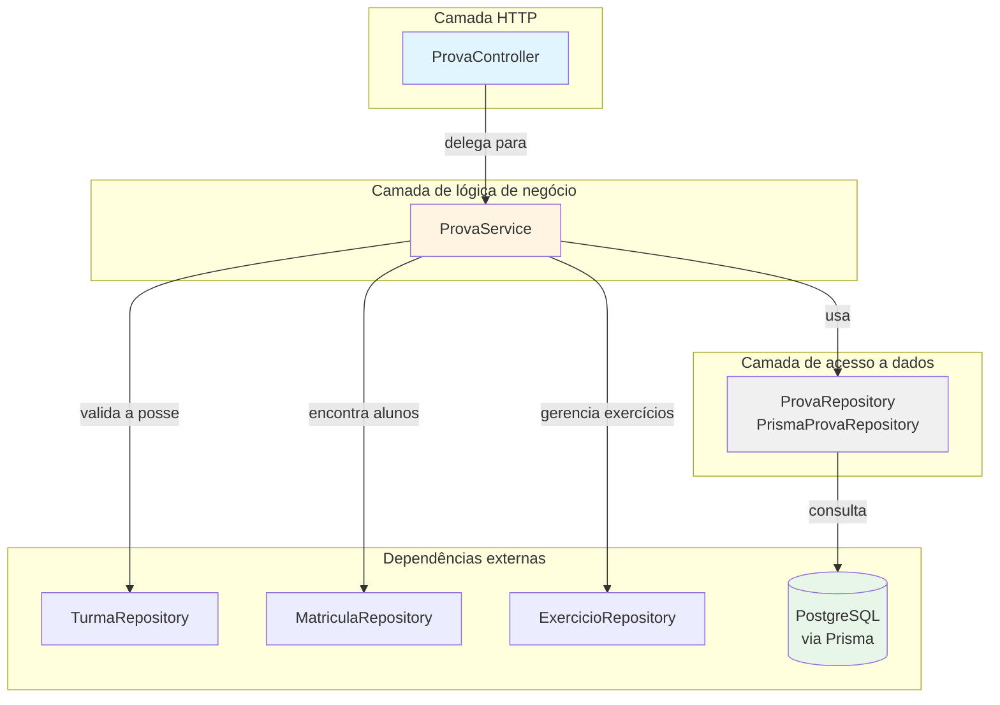
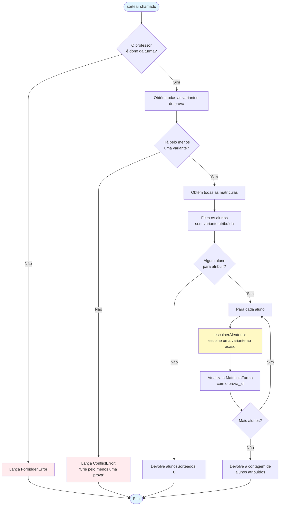
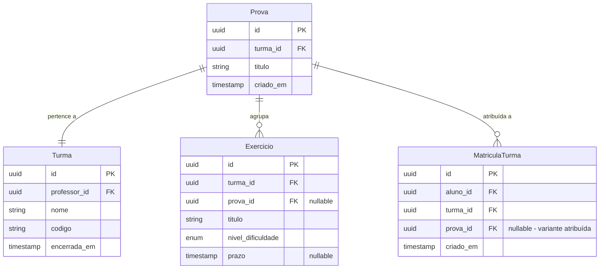
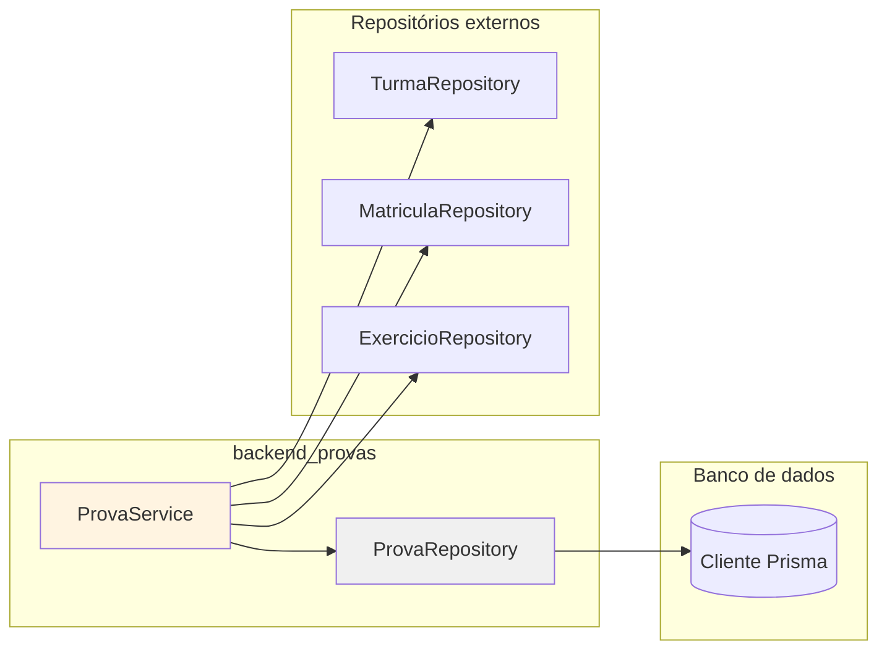
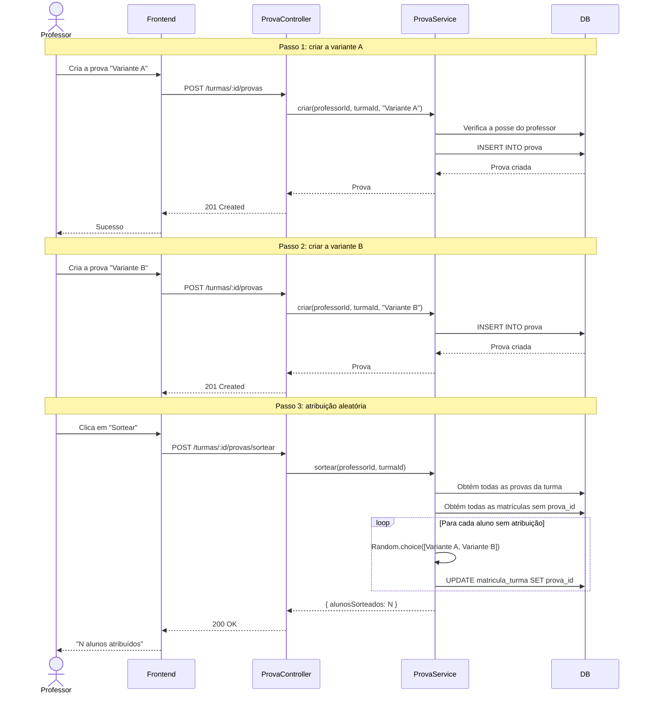
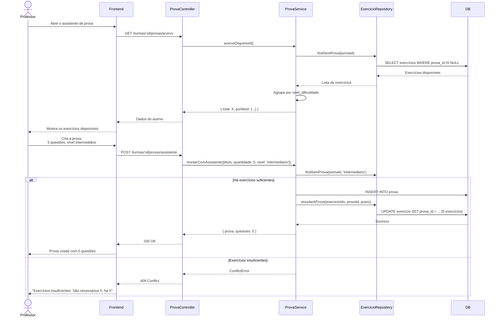

# Módulo Backend Provas

## Visão geral

O módulo `backend_provas` gerencia a criação e a distribuição de provas e a atribuição aleatória de variantes no sistema IDE Web. Ele permite que os professores criem várias variantes de prova (Prova) para uma turma e as atribuam aleatoriamente aos alunos, atendendo a cenários de avaliação acadêmica em que alunos diferentes recebem conjuntos de questões diferentes.

**Responsabilidades principais:**
- Criar e gerenciar variantes de prova (Prova) dentro de uma turma
- Atribuição aleatória de variantes de prova aos alunos matriculados
- Assistente de prova, para a seleção automática de exercícios
- Gestão do acervo de provas

**Documentação relacionada:**
- [Backend Turmas](backend_turmas.md) - gestão de turmas e matrícula
- [Backend Exercicios](backend_exercicios.md) - gestão de exercícios
- [Backend Auth](backend_auth.md) - autenticação e autorização

---

## Arquitetura

### Estrutura do módulo

O módulo segue o padrão de arquitetura MSC (Model-Service-Controller):



### Responsabilidades dos componentes

| Componente | Tipo | Responsabilidade |
|-----------|------|----------------|
| **ProvaController** | Controller | Tratamento das requisições HTTP, validação de entrada (Zod), formatação da resposta |
| **ProvaService** | Service | Lógica de negócio, verificações de autorização, algoritmo de atribuição aleatória |
| **PrismaProvaRepository** | Repository | Operações de banco de dados via ORM Prisma |

---

## Componentes principais

### ProvaController

**Localização:** `ide-web-backend/src/controllers/ProvaController.ts`

Controller HTTP que estende o `BaseController` e trata os endpoints relacionados a provas.

#### Endpoints

| Método | Rota | Descrição | Autenticação exigida |
|--------|-------|-------------|---------------|
| POST | `/api/v1/turmas/:turmaId/provas` | Cria uma nova variante de prova | Professor (dono) |
| GET | `/api/v1/turmas/:turmaId/provas` | Lista todas as provas de uma turma | Professor (dono) |
| POST | `/api/v1/turmas/:turmaId/provas/sortear` | Atribui variantes aos alunos aleatoriamente | Professor (dono) |
| GET | `/api/v1/turmas/:turmaId/provas/acervo` | Obtém o acervo de exercícios disponíveis | Professor (dono) |
| POST | `/api/v1/turmas/:turmaId/provas/assistente` | Cria uma prova com o assistente de exercícios | Professor (dono) |

#### Métodos principais

```typescript
// Cria uma nova variante de prova
criar(req: Request, res: Response): Promise<void>

// Lista todas as variantes de prova de uma turma
listarPorTurma(req: Request, res: Response): Promise<void>

// Atribui variantes de prova aos alunos aleatoriamente
sortear(req: Request, res: Response): Promise<void>

// Obtém o acervo de exercícios ainda não atribuídos a nenhuma prova
acervo(req: Request, res: Response): Promise<void>

// Cria uma prova usando o assistente de seleção de exercícios
montarComAssistente(req: Request, res: Response): Promise<void>
```

**Validação:** usa schemas Zod (`criarProvaBodySchema`, `assistenteProvaBodySchema`) para validar o corpo da requisição.

---

### ProvaService

**Localização:** `ide-web-backend/src/services/ProvaService.ts`

Contém a lógica de negócio central da gestão de provas, incluindo o algoritmo de atribuição aleatória.

#### Operações principais

##### 1. Criar prova (`criar`)

```typescript
async criar(professorId: string, turmaId: string, titulo: string): Promise<Prova>
```

- Valida que o professor é dono da turma
- Cria uma nova variante de prova
- Devolve a prova criada

##### 2. Atribuição aleatória (`sortear`)

```typescript
async sortear(professorId: string, turmaId: string): Promise<SortearResultado>
```

**Algoritmo:**
1. Valida a posse do professor
2. Obtém todas as variantes de prova da turma
3. Encontra os alunos sem variante atribuída (via `MatriculaTurma`)
4. Atribui aleatoriamente uma variante a cada aluno sem atribuição
5. **Idempotente:** executar de novo só atribui aos alunos novos, nunca reatribui

**Diagrama de fluxo:**



**Decisão de projeto principal:** a variante é guardada em `MatriculaTurma.prova_id`, e não em `Usuario.prova_id`, porque um aluno pode estar matriculado em várias turmas ao mesmo tempo e precisar de variantes diferentes em cada uma (Fase 8). Veja [Backend Turmas](backend_turmas.md#2-matrícula-do-aluno-matricular) para os detalhes.

##### 3. Acervo de exercícios (`acervoDisponivel`)

```typescript
async acervoDisponivel(professorId: string, turmaId: string): Promise<{
  total: number;
  porNivel: Record<NivelDificuldade, number>;
}>
```

Devolve a contagem de exercícios da turma que ainda não foram atribuídos a nenhuma variante de prova, agrupados por nível de dificuldade (iniciante/intermediario).

##### 4. Assistente de prova (`montarComAssistente`)

```typescript
async montarComAssistente(
  professorId: string,
  turmaId: string,
  input: { 
    titulo: string; 
    quantidade: number; 
    nivel?: NivelDificuldade; 
    prazo?: Date;
  }
): Promise<{ prova: Prova; questoes: number }>
```

Cria uma prova automaticamente, selecionando exercícios do acervo disponível:
- Valida que existem exercícios suficientes (falha com um erro claro em vez de criar uma prova parcial)
- Filtra opcionalmente por nível de dificuldade
- Vincula os exercícios selecionados à nova variante de prova
- Define opcionalmente um prazo para todos os exercícios selecionados

---

### ProvaRepository

**Localização:** `ide-web-backend/src/repositories/ProvaRepository.ts`

Camada de acesso a dados usando o ORM Prisma.

#### Interface

```typescript
interface ProvaRepository {
  findById(id: string): Promise<Prova | null>
  findByTurmaId(turmaId: string): Promise<Prova[]>
  create(input: CreateProvaInput): Promise<Prova>
}
```

#### Detalhes de implementação

- **`PrismaProvaRepository`**: implementação concreta que usa o modelo `prisma.prova`
- **Ordenação:** o `findByTurmaId` devolve as provas em ordem crescente de `criado_em`
- **Sem atualização nem exclusão:** o repositório só oferece operações de criação e leitura (as provas são imutáveis depois de criadas)

---

## Modelo de dados

### Schema do banco de dados



### Relacionamentos principais

1. **Prova → Turma**: cada prova pertence a exatamente uma turma
2. **Prova → Exercicio**: uma prova pode agrupar vários exercícios (questões)
3. **Prova → MatriculaTurma**: a variante atribuída é guardada por matrícula, não por aluno
4. **Atribuição de exercícios**: o `Exercicio.prova_id` é anulável — `null` significa visível para a turma inteira, e não nulo significa visível apenas para os alunos que receberam aquela variante

---

## Integração e dependências

### Grafo de dependências



**Dependências:**

| Repositório | Finalidade |
|------------|---------|
| **TurmaRepository** | Validar a posse da turma pelo professor |
| **MatriculaRepository** | Encontrar os alunos matriculados, atribuir variantes de prova |
| **ExercicioRepository** | Encontrar os exercícios disponíveis, vincular exercícios à prova |

Veja:
- [Backend Turmas](backend_turmas.md) para os detalhes de matrícula
- [Backend Exercicios](backend_exercicios.md) para as regras de visibilidade dos exercícios

---

## Fluxos principais

### 1. Criando e atribuindo variantes de prova



### 2. Fluxo do assistente de prova



---

## Tratamento de erros

O módulo usa as classes de erro personalizadas do [Backend Errors](backend_errors.md):

| Classe de erro | Status HTTP | Uso |
|-------------|-------------|-------|
| **UnauthorizedError** | 401 | Autenticação ausente |
| **ForbiddenError** | 403 | O professor não é dono da turma |
| **NotFoundError** | 404 | Turma não encontrada |
| **ConflictError** | 409 | Não existem variantes de prova para atribuir<br/>Exercícios insuficientes para o assistente de prova |
| **ValidationError** | 400 | Corpo da requisição inválido (validação do Zod) |

---

## Regras de negócio

### Atribuição de variantes de prova

1. **Idempotência**: executar o `sortear` várias vezes só atribui aos alunos que entraram depois da última execução
2. **Local de armazenamento**: a variante atribuída fica em `MatriculaTurma.prova_id`, e não em `Usuario.prova_id`
3. **Suporte a várias turmas**: o mesmo aluno pode ter variantes diferentes em turmas diferentes
4. **Seleção aleatória**: usa `Math.random()` para escolher a variante (aleatoriedade criptograficamente segura não é necessária neste caso)

### Visibilidade dos exercícios (integração com o backend_exercicios)

- **Exercicio.prova_id = null**: o exercício é visível a todos os alunos da turma
- **Exercicio.prova_id = UUID**: o exercício é visível apenas aos alunos que receberam aquela variante específica
- **Uma prova por exercício**: cada exercício pode pertencer a no máximo uma variante de prova (imposto pelo `findSemProva`)

Veja [Backend Exercicios - Controle de acesso](backend_exercicios.md#acessoexercicioservice) para as regras completas de visibilidade.

### Assistente de prova

1. **Tudo ou nada**: recusa criar a prova se não houver exercícios suficientes (sem provas parciais)
2. **Consumo de exercícios**: depois de atribuído a uma prova, o exercício sai do acervo disponível
3. **Propagação do prazo**: o prazo opcional se aplica de modo uniforme a todos os exercícios selecionados

---

## Considerações sobre testes

### Testes unitários

Áreas principais a testar:

1. **Algoritmo de atribuição aleatória**
   - Idempotência: executar de novo não reatribui
   - Alunos novos são atribuídos
   - Todos os alunos recebem uma variante (nenhum fica nulo)
   - A distribuição é aproximadamente uniforme com execuções suficientes

2. **Seleção de exercícios**
   - Respeita o filtro de nível de dificuldade
   - Não seleciona exercícios já atribuídos
   - Seleciona exatamente a quantidade pedida
   - Falha de forma limpa quando não há exercícios suficientes

3. **Autorização**
   - Só o dono da turma pode gerenciar as provas
   - Acesso entre turmas é negado

### Testes de integração

1. **Fluxos de várias etapas**
   - Criar a turma → criar as provas → atribuir as variantes → o aluno vê a variante correta
   - Visibilidade dos exercícios depois da atribuição da prova
   - Propagação do prazo para os exercícios

2. **Casos limite**
   - Um único aluno e uma única variante (atribuição determinística)
   - Mais variantes do que alunos
   - Executar a atribuição de novo depois de novas matrículas

---

## Decisões relacionadas

- **Fase 5**: implementação inicial do sorteador de provas - [docs/decisions/fase5-sorteador-provas.md](../../docs/decisions/fase5-sorteador-provas.md)
- **Fase 8**: a atribuição da variante saiu do Usuario e foi para a MatriculaTurma - [docs/decisions/fase8-conta-do-aluno-matricula-estudo-livre.md](../../docs/decisions/fase8-conta-do-aluno-matricula-estudo-livre.md)
- **Fase 10**: acréscimo do assistente de prova e do suporte a prazo - [docs/decisions/fase10-professor-prova-sessao.md](../../docs/decisions/fase10-professor-prova-sessao.md)

---

## Melhorias futuras

Possíveis melhorias ainda não implementadas:

1. **Atribuição manual de variante**: permitir que o professor substitua a atribuição aleatória para alunos específicos
2. **Estatísticas por variante**: acompanhar métricas de dificuldade e de desempenho por variante
3. **Distribuição de exercícios**: garantir que as variantes tenham um equilíbrio de dificuldade semelhante
4. **Exclusão lógica (soft delete)**: arquivar as provas em vez de excluí-las definitivamente
5. **Troca de variante**: permitir a reatribuição em caso de erros (hoje é imutável)

---

## Referência da API

### DTOs

**Corpo da requisição - criar prova** (`criarProvaBodySchema`)
```typescript
{
  titulo: string  // obrigatório
}
```

**Corpo da requisição - assistente de prova** (`assistenteProvaBodySchema`)
```typescript
{
  titulo: string                           // obrigatório
  quantidade: number                       // obrigatório, > 0
  nivel?: 'iniciante' | 'intermediario'   // filtro opcional
  prazo?: Date                            // prazo opcional
}
```

**Resposta - prova** (`toProvaResponseDto`)
```typescript
{
  id: string
  turma_id: string
  titulo: string
  criado_em: Date
}
```

**Resposta - atribuição aleatória**
```typescript
{
  alunosSorteados: number  // contagem de alunos atribuídos
}
```

**Resposta - acervo de exercícios**
```typescript
{
  total: number
  porNivel: {
    iniciante: number
    intermediario: number
  }
}
```

**Resposta - assistente de prova**
```typescript
{
  ...Prova,
  questoes: number  // contagem de exercícios vinculados
}
```

---

## Glossário

| Termo | Definição |
|------|------------|
| **Prova** | Variante de prova — um conjunto de exercícios que pode ser atribuído aos alunos |
| **Sortear** | Processo de atribuição aleatória que distribui as variantes de prova entre os alunos |
| **Acervo** | Catálogo dos exercícios ainda não atribuídos a nenhuma variante de prova |
| **Assistente** | Recurso de assistente de prova que seleciona exercícios automaticamente para uma nova prova |
| **Questão** | Questão/exercício que pertence a uma variante de prova |
| **Variante** | Variante de prova — versões diferentes de uma prova, com questões diferentes |
