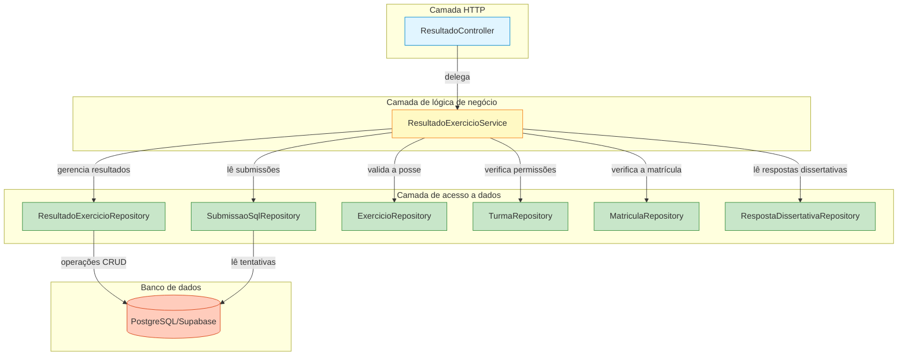
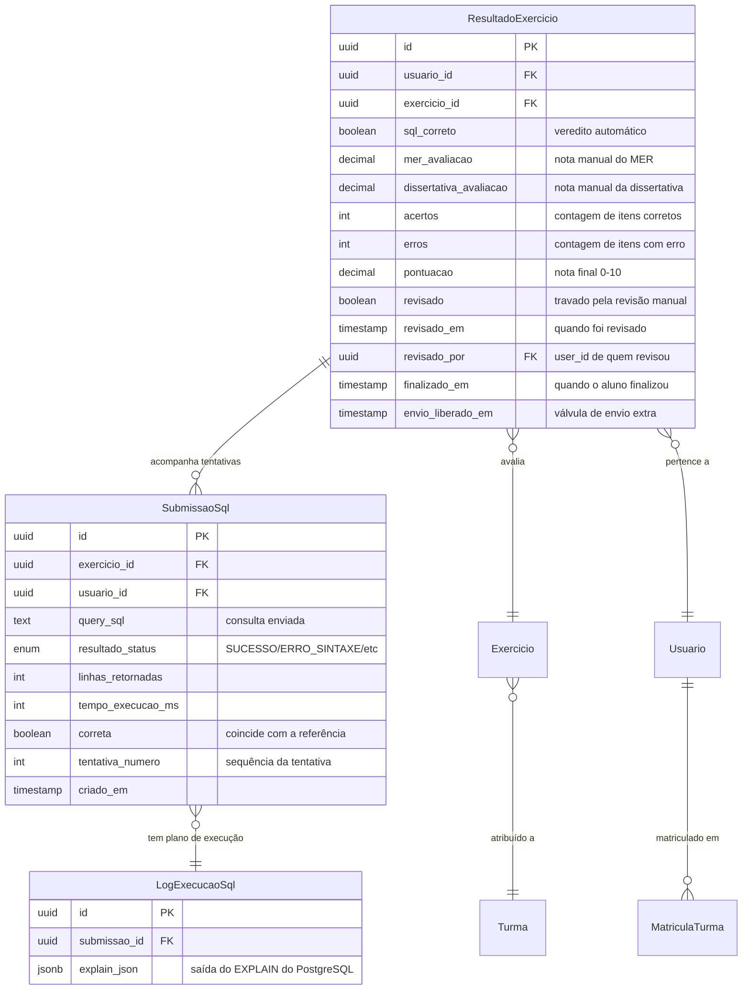
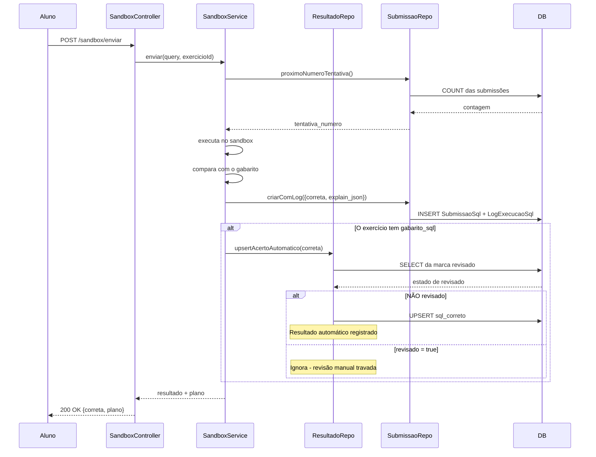
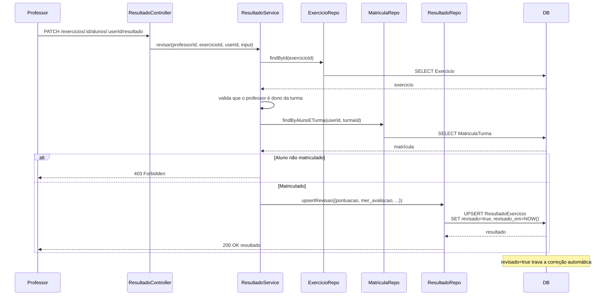
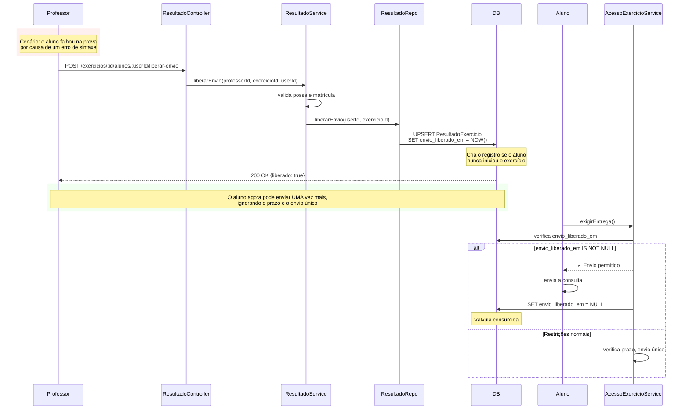
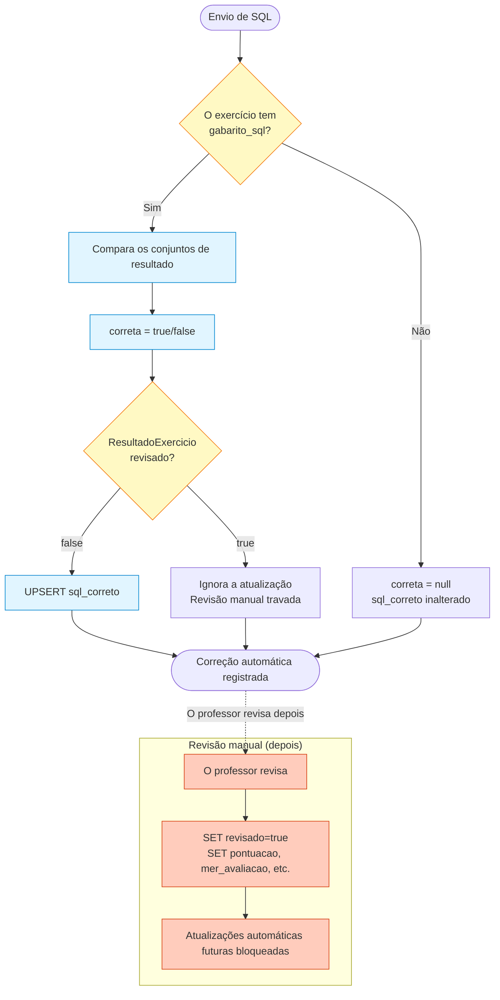
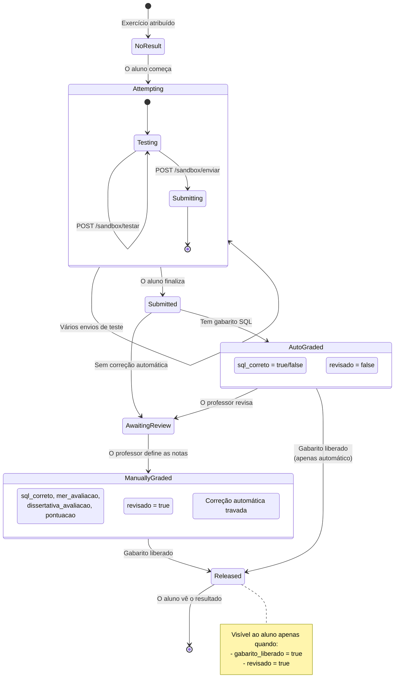
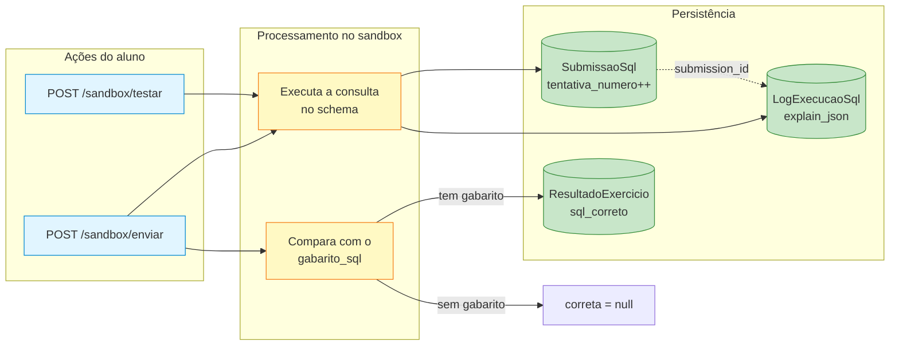

# Módulo Backend Resultado

## Visão geral

O módulo **backend_resultado** gerencia os resultados dos exercícios, a correção e a devolutiva no sistema IDE Web. Ele trata tanto da **correção automática** (consultas SQL comparadas com soluções de referência) quanto da **revisão manual** (modelagem conceitual/lógica de dados e questões dissertativas). O módulo implementa um fluxo de correção sofisticado, que dá suporte às restrições do modo prova, aos mecanismos de liberação de nota e a uma avaliação híbrida, automática e manual.

Este módulo é a ponte entre as entregas dos alunos ([backend_sandbox_sql](backend_sandbox_sql.md), [backend_modelagem](backend_modelagem.md)) e a visualização de desempenho ([backend_painel](backend_painel.md)), garantindo que todas as tentativas de exercício sejam avaliadas, guardadas e disponibilizadas a alunos e professores conforme as regras de visibilidade.

---

## Responsabilidades principais

### 1. **Gestão de resultados**
- Guardar e recuperar os resultados dos exercícios (`ResultadoExercicio`)
- Acompanhar as tentativas de envio e seus desfechos
- Manter o histórico de correção, com horários e informações de quem revisou
- Dar suporte à visibilidade do resultado com base na marca `gabarito_liberado`

### 2. **Correção automática**
- Receber os veredictos de correção do SQL vindos da execução no sandbox
- Registrar a correção automática no campo `sql_correto`
- Preservar os resultados automáticos, a menos que sejam sobrescritos por uma revisão manual
- Atualizar os resultados sem disparar reavaliações desnecessárias

### 3. **Revisão manual**
- Permitir que os professores deem nota aos diagramas de modelagem de dados (`mer_avaliacao`)
- Dar suporte à avaliação de questões dissertativas (`dissertativa_avaliacao`)
- Permitir uma pontuação completa com `acertos`, `erros` e `pontuacao` (0,0 a 10,0)
- Travar os resultados automáticos quando a revisão manual é feita (marca `revisado`)

### 4. **Suporte ao modo prova**
- Impor a restrição de envio único nas questões de prova
- Acompanhar a finalização do exercício (`finalizado_em`)
- Oferecer o mecanismo de liberação (`envio_liberado_em`)
- Permitir que os professores concedam tentativas extras de envio depois de erros

### 5. **Gestão do gabarito**
- Os professores podem liberar os gabaritos (`gabarito_liberado`)
- Os alunos só veem seus resultados corrigidos quando os gabaritos são liberados
- A liberação do gabarito é reversível (pode ser ocultado de novo)

---

## Arquitetura

### Estrutura dos componentes



### Responsabilidades das camadas

**ResultadoController** (camada HTTP)
- Expõe os endpoints REST das operações de resultado
- Valida os parâmetros da requisição e a autenticação
- Transforma as respostas do serviço em DTOs
- Trata os códigos de status HTTP e as respostas de erro

**ResultadoExercicioService** (camada de lógica de negócio)
- Aplica as regras de autorização (o professor é dono do exercício, o aluno está matriculado)
- Coordena vários repositórios
- Implementa a lógica de negócio da correção (precedência entre automática e manual)
- Gerencia o fluxo de liberação de nota

**ResultadoExercicioRepository** (camada de acesso a dados)
- Executa as operações CRUD na tabela `ResultadoExercicio`
- Implementa a lógica de upsert para a correção automática e manual
- Trata o mecanismo de válvula `envio_liberado_em`
- Aplica a proteção da marca `revisado`

**SubmissaoSqlRepository** (camada de acesso a dados)
- Acompanha todas as tentativas de envio de SQL
- Mantém a numeração das tentativas (`tentativa_numero`)
- Guarda os metadados de execução (planos EXPLAIN, tempo de execução)
- Oferece visões resumidas para relatórios

---

## Modelo de dados



### Campos principais

**sql_correto** - resultado da correção automática do SQL, definido pela comparação no sandbox. Congelado quando `revisado = true`.

**revisado** - marca que indica que houve revisão manual. Depois de definida, a correção automática deixa de atualizar o `sql_correto`.

**envio_liberado_em** - horário de válvula que permite UM envio extra, ignorando o prazo e as restrições de envio único. Consumido no uso.

**finalizado_em** - horário em que o aluno clicou em "Finalizar" (separado de "Baixar PDF" desde a Fase 8). Dispara a limpeza do sandbox.

**tentativa_numero** - contador sequencial de tentativas por par aluno-exercício, começando em 1.

---

## Interações entre componentes

### Fluxo da correção



### Fluxo da revisão manual



### Mecanismo de liberação



---

## Endpoints da API

### Operações do professor

#### Revisar o trabalho do aluno
```http
PATCH /api/v1/exercicios/:exercicioId/alunos/:usuarioId/resultado
Authorization: Bearer <token>
Content-Type: application/json

{
  "sqlCorreto": true,           // opcional, substitui o automático
  "merAvaliacao": 8.5,          // opcional, 0.0-10.0
  "dissertativaAvaliacao": 7.0, // opcional, 0.0-10.0
  "acertos": 12,                // opcional, contagem de itens
  "erros": 3,                   // opcional, contagem de itens
  "pontuacao": 8.0              // opcional, nota final 0.0-10.0
}
```

**Resposta:** `ResultadoResponseDto`
- Define `revisado = true`, travando a correção automática
- Registra o horário `revisado_em` e o `revisado_por` (id do professor)
- Cria o `ResultadoExercicio` se o aluno nunca enviou nada

**Autorização:** o professor precisa ser dono da turma; o aluno precisa estar matriculado.

---

#### Liberar o gabarito
```http
POST /api/v1/exercicios/:id/liberar-gabarito
Authorization: Bearer <token>
```

**Resposta:** `ExercicioProfessorResponseDto` com `gabarito_liberado = true`

Reversível com:
```http
POST /api/v1/exercicios/:id/ocultar-gabarito
```

---

#### Conceder um envio extra
```http
POST /api/v1/exercicios/:id/alunos/:usuarioId/liberar-envio
Authorization: Bearer <token>
```

**Resposta:** `{liberado: true}`

**Efeito:** define o `envio_liberado_em`, permitindo UM envio a mais, independentemente de:
- Prazo (exercicio.prazo)
- Restrição de envio único (prova_id)
- Estado de encerramento da turma

Veja o `AcessoExercicioService.exigirEntrega()` no [backend_exercicios](backend_exercicios.md) para a lógica de consumo.

---

#### Obter as respostas do aluno
```http
GET /api/v1/exercicios/:exercicioId/alunos/:usuarioId/respostas
Authorization: Bearer <token>
```

**Resposta:**
```json
{
  "ultimaSubmissaoSql": {
    "query": "SELECT * FROM ...",
    "correta": true,
    "criadoEm": "2026-09-15T10:30:00Z"
  },
  "dissertativa": {
    "texto": "A normalização consiste em...",
    "atualizadoEm": "2026-09-15T10:25:00Z"
  }
}
```

**Finalidade:** mostra o que o aluno entregou antes de o professor dar a nota (acrescentado na Fase 9, depois que o teste de usabilidade revelou a "correção no escuro").

**Nota:** as respostas de modelagem de dados são obtidas por um endpoint separado, no [backend_modelagem](backend_modelagem.md).

---

#### Obter o resultado do aluno
```http
GET /api/v1/exercicios/:exercicioId/alunos/:usuarioId/resultado
Authorization: Bearer <token>
```

**Resposta:** `ResultadoResponseDto | null`

Devolve o resultado completo, independentemente do estado de `gabarito_liberado`.

---

### Operações do aluno

#### Obter o meu resultado
```http
GET /api/v1/exercicios/:id/meu-resultado
Authorization: Bearer <token>
```

**Resposta:** `ResultadoResponseDto | null`

**Regras de visibilidade:**
- Devolve `null` se `gabarito_liberado = false`
- Devolve `null` se `revisado = false` (ainda não corrigido)
- Devolve o resultado apenas quando o gabarito está liberado **e** o trabalho foi revisado

**Justificativa:** os alunos só devem ver a devolutiva final, não resultados automáticos parciais.

---

## Lógica de negócio

### Precedência entre correção automática e manual



**Princípio principal:** a revisão manual sempre vence. Depois que `revisado = true`, a correção automática para de atualizar o `sql_correto`.

**Justificativa:** o professor pode discordar do veredito automático (por exemplo, a consulta está semanticamente correta, mas usa uma abordagem diferente da solução de referência).

---

### Restrições do modo prova

O módulo `backend_resultado` participa da aplicação do modo prova por meio da válvula `envio_liberado_em`, mas a verificação das restrições acontece no `AcessoExercicioService.exigirEntrega()` do [backend_exercicios](backend_exercicios.md):

**Ordem das verificações:**
1. Turma encerrada? → Bloqueia
2. Prazo vencido (exercicio.prazo)? → Bloqueia
3. Envio único consumido (prova_id + submissão existente)? → Bloqueia
4. **envio_liberado_em definido?** → Permite UM envio e depois limpa a válvula

**Caso de uso da liberação de nota:**
```
Aluno na prova → Comete um erro de sintaxe → Perde o seu único envio → A consulta nunca executou
O professor revisa → Vê o erro → Clica em "Liberar novo envio" → O aluno ganha uma segunda chance
O aluno reenvia → envio_liberado_em é limpo → Volta às restrições normais
```

Veja `docs/decisions/fase10-professor-prova-sessao.md` para a justificativa de projeto.

---

### Validação da matrícula

Todas as operações que envolvem resultados de alunos verificam a **matrícula**:

```typescript
// De ResultadoExercicioService.exigirAlunoMatriculado()
const matricula = await this.matriculaRepository.findByAlunoETurma(usuarioId, turmaId);
if (!matricula) {
  throw new ForbiddenError('Este aluno não está matriculado na turma do exercício');
}
```

**Por que isso importa:**
- Antes da Fase 9, o `revisar()` criava resultados para qualquer UUID sem verificar a matrícula
- O professor podia dar nota a alunos que não estavam na turma
- Corrigido exigindo um registro `MatriculaTurma` antes de permitir a revisão

Veja [backend_turmas](backend_turmas.md) para a gestão de matrículas.

---

## Pontos de integração

### Dependências

**[backend_exercicios](backend_exercicios.md)**
- Valida a posse do exercício
- Oferece a alternância de gabarito_liberado
- O AcessoExercicioService consome a válvula envio_liberado_em

**[backend_sandbox_sql](backend_sandbox_sql.md)**
- Executa as consultas SQL
- Compara os resultados com o gabarito_sql
- Chama o `upsertAcertoAutomatico()` com o veredito

**[backend_turmas](backend_turmas.md)**
- Valida a posse da turma pelo professor
- Fornece os registros de matrícula para a verificação
- Informa o estado de encerramento da turma (afeta a visibilidade do resultado)

**[backend_auth](backend_auth.md)**
- Fornece o contexto de autenticação `req.usuario`
- Aplica o acesso por papel (endpoints de professor versus de aluno)

**[backend_modelagem](backend_modelagem.md)**
- Fornece o diagrama MER para a revisão manual
- Separado do fluxo de correção de SQL/dissertativa

**[backend_painel](backend_painel.md)**
- Lê o ResultadoExercicio para as métricas dos painéis
- Agrega sql_correto e pontuacao para as visões de desempenho
- Usa a marca revisado para determinar o estado de conclusão

---

### Consumidores

**[backend_painel](backend_painel.md)**
```typescript
// De PainelRepository.findAtividadesPorExercicio()
const resultados = await prisma.resultadoExercicio.findMany({
  where: { exercicio_id: { in: exercicioIds } },
  select: { 
    usuario_id: true, 
    exercicio_id: true, 
    sql_correto: true,
    pontuacao: true,
    finalizado_em: true,
    revisado: true
  }
});
```

**[backend_pesquisa](backend_pesquisa.md)** (módulo de pesquisa do TCC)
```typescript
// De PesquisaService.acertos()
// Lê a SubmissaoSql para as contagens de tentativas e as métricas de acerto
const submissoes = await submissaoRepository.findResumoPorExercicios(exercicioIds);
```

**Frontend** ([frontend_exercicios](frontend_exercicios.md), [frontend_painel](frontend_painel.md))
- Mostra os resultados corrigidos aos alunos
- Mostra a interface de correção aos professores
- Renderiza as matrizes de desempenho e o acompanhamento de progresso

---

## Tratamento de erros

### Erros personalizados

**NotFoundError**
```typescript
throw new NotFoundError('Exercício');
// → 404 "Exercício não encontrado"
```

**ForbiddenError**
```typescript
throw new ForbiddenError('Você não é o professor deste exercício');
// → 403 com mensagem em português
```

**UnauthorizedError**
```typescript
throw new UnauthorizedError('Autenticação necessária');
// → 401
```

**ValidationError**
```typescript
throw new ValidationError('Dados de revisão inválidos', zodIssues);
// → 400 com os detalhes de validação do Zod
```

Todos os erros herdam de `AppError` e são tratados pelo middleware global de erros. Veja [backend_core](backend_core.md) para a arquitetura do tratamento de erros.

---

## Diagramas de fluxo de dados

### Ciclo de vida completo do resultado



### Fluxo de registro das submissões



---

## Considerações de desempenho

### Consultas ao banco de dados

**Buscas otimizadas**
```typescript
// Usa o índice único composto
where: { 
  usuario_id_exercicio_id: { 
    usuario_id: usuarioId, 
    exercicio_id: exercicioId 
  } 
}
```

**Leituras em lote** (do PainelRepository)
```typescript
// Uma única consulta para todos os exercícios da turma
findMany({ 
  where: { exercicio_id: { in: exercicioIds } } 
})
```

**Prevenção de N+1**
```typescript
// A camada de serviço coordena vários repositórios
await Promise.all([
  submissaoRepository.findUltimaTentativa(...),
  respostaDissertativaRepository.findByExercicioEUsuario(...)
]);
```

### Estratégia de upsert

**Por que UPSERT em vez de INSERT/UPDATE separados:**
- O aluno pode não ter iniciado o exercício quando o professor libera o envio
- A correção automática pode rodar antes de existir o registro da revisão manual
- Simplifica o código do cliente (não é preciso verificar a existência)

**Proteção contra condições de corrida:**
```typescript
// Correção da Fase 9: ler, verificar e gravar numa transação
const existente = await prisma.resultadoExercicio.findUnique({ where: chave });
if (existente?.revisado) {
  return; // Ignora a atualização automática se foi revisado manualmente
}
await prisma.resultadoExercicio.upsert({ ... });
```

---

## Considerações sobre testes

### Cobertura de testes unitários

**Camada de serviço**
- Aplicação da autorização (posse do professor, matrícula do aluno)
- Precedência da correção (automática versus manual)
- Lógica de consumo da válvula (envio_liberado_em)
- Regras de visibilidade do gabarito

**Camada de repositório**
- Comportamento do upsert com e sem registros existentes
- Proteção da marca revisado
- Sequenciamento do tentativa_numero
- Buscas por chave composta

### Cenários de testes de integração

**Caminho feliz**
1. O aluno envia → Correção automática → O professor revisa → Gabarito liberado → O aluno vê o resultado

**Recuperação no modo prova**
1. Aluno na prova → Erro de sintaxe → O professor libera o envio → O aluno reenvia com sucesso

**Substituição manual**
1. A correção automática marca errado → O professor revisa e vê que está certo → A nota manual trava a automática

**Correção concorrente**
1. Vários envios enquanto o professor revisa → Garantir que não haja condições de corrida na marca revisado

### Preparação dos dados de teste

Exige:
- Professor com uma Turma
- Aluno com uma MatriculaTurma
- Exercicio com gabarito_sql
- Schema de sandbox com dados de referência

Veja `ide-web-backend/src/__tests__/` para os padrões de teste.

---

## Configuração

### Variáveis de ambiente

Nenhuma específica deste módulo. Usa a conexão de banco compartilhada:
- `DATABASE_URL` - conexão principal com o Supabase (via Prisma)

Veja [Infrastructure_&_Build_Pipeline](Infrastructure_&_Build_Pipeline.md) para a configuração.

### Schema do banco de dados

Gerenciado por migrations do Prisma em `ide-web-backend/prisma/`:
- `schema.prisma` - definições dos modelos
- `migrations/` - arquivos de migration SQL

**Modelos relevantes:**
- `ResultadoExercicio` (tabela: `resultados_exercicio`)
- `SubmissaoSql` (tabela: `submissoes_sql`)
- `LogExecucaoSql` (tabela: `logs_execucao_sql`)

---

## Diretrizes de desenvolvimento

### Acrescentando novos campos de nota

**Exemplo: acrescentar o campo `tempo_total_gasto`**

1. **Atualize o schema do Prisma:**
```prisma
model ResultadoExercicio {
  // campos existentes...
  tempo_total_gasto Int? @map("tempo_total_gasto")
}
```

2. **Crie a migration:**
```bash
cd ide-web-backend
npx prisma migrate dev --name adiciona_tempo_total_gasto
```

3. **Atualize os DTOs:**
```typescript
// dtos/resultado.dto.ts
export interface RevisarResultadoBodyDto {
  // campos existentes...
  tempoTotalGasto?: number;
}

export const revisarResultadoBodySchema = z.object({
  // validações existentes...
  tempoTotalGasto: z.number().int().positive().optional(),
});
```

4. **Atualize o repositório:**
```typescript
// repositories/ResultadoExercicioRepository.ts
export interface RevisarResultadoInput {
  // campos existentes...
  tempo_total_gasto?: number;
}
```

5. **Atualize o serviço:**
```typescript
// services/ResultadoExercicioService.ts
await this.resultadoRepository.upsertRevisao(usuarioId, exercicioId, professorId, {
  ...(input.tempoTotalGasto !== undefined ? { tempo_total_gasto: input.tempoTotalGasto } : {}),
  // campos existentes...
});
```

### Seguindo a arquitetura MSC

**Sempre passe pelas camadas:**
```
Rota → Controller → Service → Repository → Banco de dados
```

**Nunca pule camadas:**
- ❌ Controller chamando o Repository diretamente
- ❌ Service acessando o cliente Prisma diretamente
- ✅ O Service coordena vários repositórios

**Veja também:** a skill `backend-dev-guidelines` do projeto.

---

## Histórico de migrações

### Fase 2 (2026-08-23)
- Implementação inicial
- Endpoints básicos de revisar/liberar-gabarito
- Acompanhamento de submissões SQL

### Fase 8 (2026-09-16)
- Separação entre "Baixar PDF" e "Finalizar exercício"
- O `finalizado_em` deixa de ser definido pela geração do PDF
- O download do PDF é repetível, e a finalização dispara a limpeza

### Fase 9 (2026-09-17)
- **D14:** a correção automática grava em `ResultadoExercicio.sql_correto` (antes só em `SubmissaoSql.correta`)
- **D14:** a revisão manual trava as atualizações automáticas pela marca `revisado`
- **D16:** validação de matrícula no `revisar()` - corrige a correção de alunos que não estavam na turma
- **D17:** endpoint `respostasDoAluno()` - corrige o problema de usabilidade da "correção no escuro"

### Fase 10 (2026-09-17)
- **D8:** válvula `envio_liberado_em` para a recuperação no modo prova
- **D10:** endpoint `liberarEnvio()` para os professores
- As notas passam de inteiros para decimais (0,0 a 10,0)

Veja `docs/decisions/fase9-dashboards-professor-aluno.md` e `fase10-professor-prova-sessao.md` para a justificativa de projeto completa.

---

## Melhorias futuras

### Planejadas (Fase 12+)

**Correção baseada em rubricas**
- Definir rubricas de pontuação por exercício
- Preencher acertos/erros automaticamente a partir de uma lista de verificação
- Devolutiva estruturada em vez de texto livre

**Revisão por pares**
- Os alunos revisam entregas anonimizadas de colegas
- O professor avalia o desempenho do aluno revisor
- Modo de aprendizagem colaborativa

**Recursos de nota**
- O aluno pede uma nova revisão com justificativa
- O professor vê a nota original e o recurso
- Trilha de auditoria das mudanças de nota

**Correção em lote**
- Dar nota a vários alunos de uma vez para o mesmo exercício
- Aplicar a mesma devolutiva a erros semelhantes
- Acompanhamento de progresso na interface

### Dívida técnica

**Extrair a lógica do gabarito**
- Hoje está no ResultadoExercicioService
- Deveria estar no ExercicioService (mais perto do domínio)
- Refatorar depois de validar a estabilidade

**Normalizar os campos de nota**
- Hoje: sql_correto (boolean) + mer_avaliacao (decimal) + dissertativa_avaliacao (decimal) + pontuacao (decimal)
- Futuro: componentes de correção estruturados, com pesos
- Exige um redesenho do schema

---

## Documentação relacionada

- [backend_exercicios](backend_exercicios.md) - gestão de exercícios e controle de acesso
- [backend_sandbox_sql](backend_sandbox_sql.md) - execução de SQL e comparação automática
- [backend_modelagem](backend_modelagem.md) - armazenamento de diagramas de modelagem de dados
- [backend_painel](backend_painel.md) - agregações dos painéis a partir dos resultados
- [backend_turmas](backend_turmas.md) - matrícula e posse das turmas
- [backend_auth](backend_auth.md) - autenticação e autorização
- [backend_core](backend_core.md) - tratamento de erros e controllers base

---

## Referências

**Registros de decisão**
- `docs/decisions/fase2-turmas-exercicios-tcle.md` - projeto inicial da correção
- `docs/decisions/fase8-conta-do-aluno-matricula-estudo-livre.md` - separação da finalização
- `docs/decisions/fase9-dashboards-professor-aluno.md` - melhorias da correção automática
- `docs/decisions/fase10-professor-prova-sessao.md` - modo prova e liberação de nota

**Base de código**
- `ide-web-backend/src/controllers/ResultadoController.ts` - endpoints HTTP
- `ide-web-backend/src/services/ResultadoExercicioService.ts` - lógica de negócio
- `ide-web-backend/src/repositories/ResultadoExercicioRepository.ts` - acesso a dados
- `ide-web-backend/src/repositories/SubmissaoSqlRepository.ts` - acompanhamento de submissões
- `ide-web-backend/prisma/schema.prisma` - modelos do banco de dados

**Diretrizes do projeto**
- `CLAUDE.md` - visão geral da arquitetura do projeto
- skill `/backend-dev-guidelines` - padrões de código do backend
- skill `/database-design` - padrões de projeto de schema
