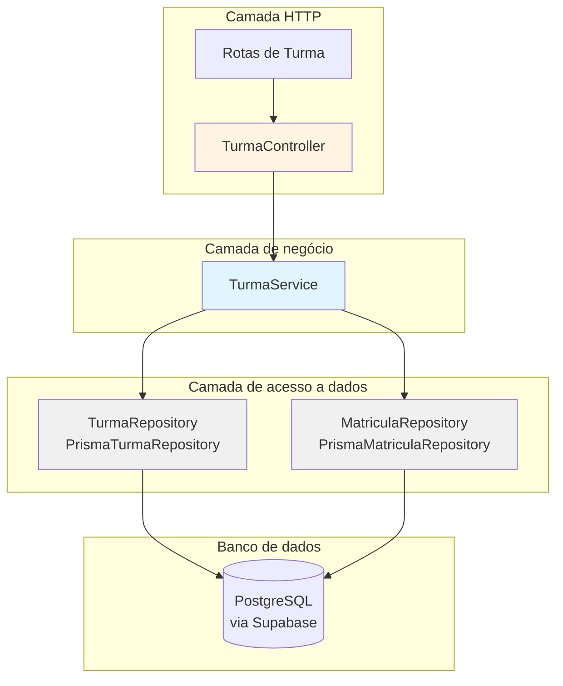
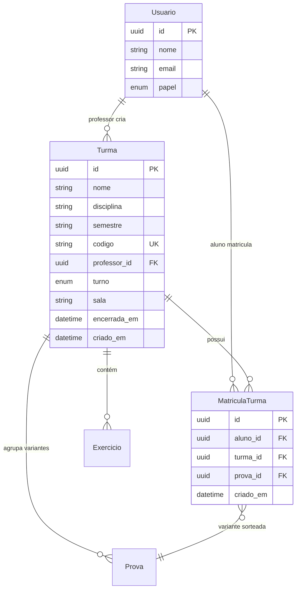

# Módulo Backend Turmas

## Visão geral

O módulo **backend_turmas** gerencia o ciclo de vida das turmas (grupos de aula) no sistema IDE Web. Ele cuida da criação de turmas com códigos únicos, da matrícula de alunos, do encerramento e da reabertura de turmas, e oferece visões diferentes das turmas conforme o papel do usuário (professor, aluno, pesquisador).

Este módulo implementa a unidade organizacional central do sistema: as turmas reúnem alunos e professores para a realização de exercícios e avaliações. O módulo passou por uma evolução significativa na Fase 8, quando o código da turma deixou de ser uma credencial de acesso e passou a ser um token de matrícula de uso único, permitindo que os alunos mantenham contas persistentes em várias turmas.

---

## Arquitetura

### Estrutura de camadas

O módulo segue o padrão MSC (Model-Service-Controller) definido em `backend-dev-guidelines`:

### Responsabilidades dos componentes

| Componente | Responsabilidade |
|-----------|----------------|
| **TurmaController** | Tratamento de requisição e resposta HTTP, validação de entrada por schemas Zod, verificações de autenticação |
| **TurmaService** | Lógica de negócio: geração de código, validação de posse, regras de matrícula, restrições de encerramento |
| **TurmaRepository** | Operações CRUD da entidade `Turma` via Prisma |
| **MatriculaRepository** | Operações CRUD da entidade `MatriculaTurma` via Prisma |

---

## Modelo de dados

### Relacionamentos entre entidades

### Restrições principais

- **Restrição de unicidade**: `MatriculaTurma(aluno_id, turma_id)` — um registro de matrícula por aluno por turma
- **Código da turma**: 6 caracteres de um alfabeto de 32 caracteres, globalmente único entre todas as turmas
- **Encerramento**: `encerrada_em IS NOT NULL` congela a turma (somente leitura, sem novas matrículas)
- **`turno` e `sala` opcionais**: alimentam apenas o filtro do painel do professor; uma turma sem eles continua válida

---

## Endpoints

Todas as rotas ficam sob `/api/v1`, são ligadas à mão em `turma.routes.ts` e exigem `requireAuth`. A posse ("você é o professor desta turma") é verificada no `TurmaService`, não na rota.

| Método e caminho | Papéis | Método do controller | Finalidade |
|---|---|---|---|
| `POST /turmas` | professor, pesquisador | `criar` | Cria uma turma; corpo validado pelo `criarTurmaBodySchema` (`nome`, `semestre` obrigatórios; `disciplina`, `turno`, `sala` opcionais). Responde `201` |
| `GET /turmas/minhas` | qualquer autenticado | `minhas` | Turmas visíveis a quem chama (veja abaixo) |
| `GET /turmas/:id/alunos` | professor, pesquisador | `listarAlunos` | Alunos matriculados, ordenados por nome |
| `POST /turmas/:codigo/matricular` | aluno | `matricular` | Matricula o aluno logado usando o código da turma. Responde `201` |
| `POST /turmas/:id/encerrar` | professor, pesquisador | `encerrar` | Congela a turma (idempotente) |
| `POST /turmas/:id/reabrir` | professor, pesquisador | `reabrir` | Desfaz um encerramento feito por engano |

O `GET /turmas/minhas` depende do papel:

| Papel | Resultado |
|---|---|
| `professor` | turmas que ele criou, da mais recente para a mais antiga |
| `pesquisador` | **todas** as turmas, porque o pesquisador precisa escolher em qual delas iniciar a pesquisa |
| `aluno` | turmas em que está matriculado, resolvidas por meio de `MatriculaTurma` |

O `matricular` falha com `NotFoundError('Turma')` para um código desconhecido, e com `ConflictError` quando a turma está encerrada ou o aluno já está matriculado.

---

## Funcionalidades principais

### 1. Criação de turma

**Endpoint**: `POST /api/v1/turmas`  
**Papéis**: `professor`, `pesquisador`

**Algoritmo de geração do código**:
- Usa `gerarCodigoTurma()` de `utils/codigoTurma.ts`
- 6 caracteres de `ABCDEFGHJKLMNPQRSTUVWXYZ23456789`: as letras `I` e `O` e os dígitos `0` e `1` ficam de fora porque são fáceis de confundir quando digitados a partir de um quadro ou de uma folha impressa
- No máximo 5 tentativas em caso de colisão (`TurmaService.gerarCodigoUnico`), consultando o `findByCodigo` a cada vez
- Lança um erro simples se todas as tentativas falharem, o que é extremamente improvável com 32^6 ≈ 1,07 bilhão de combinações
- O código é um token de matrícula e não mais uma credencial (Fase 8), então é gerado com `Math.random` e não com uma fonte criptográfica

### 2. Matrícula do aluno (Matricular)

**Endpoint**: `POST /api/v1/turmas/:codigo/matricular`  
**Papel**: `aluno` (autenticado)

**Principais mudanças (Fase 8)**:

Antes da Fase 8, o código da turma funcionava como uma credencial de sessão. Isso foi substituído por uma matrícula persistente:

| Aspecto | Antes da Fase 8 | Depois da Fase 8 |
|--------|---------------|--------------|
| Autenticação | Código da turma = credencial | O aluno tem conta própria com e-mail e senha |
| Matrícula | Sessão temporária | Persistente, via matricular |
| Várias turmas | Uma de cada vez | Várias matrículas simultâneas |
| Atribuição de prova | Usuario.prova_id | MatriculaTurma.prova_id |

---

## Pontos de integração

### Dependências a montante

- **BaseController**: fornece o `handleSuccess()` para uma formatação de resposta consistente
- **Classes de erro**: `NotFoundError`, `ConflictError`, `ForbiddenError`, `UnauthorizedError`, `ValidationError`
- **Middleware requireAuth**: preenche o `req.usuario` com o contexto do usuário autenticado
- **Cliente Prisma**: instância única de `lib/prisma.ts`, usando `@prisma/adapter-pg`

### Consumidores a jusante

| Módulo consumidor | Uso |
|----------------|-------|
| **backend_exercicios** | Exercícios criados no contexto de uma turma; o AcessoExercicioService verifica a matrícula |
| **backend_provas** | O sorteio de provas distribui variantes entre os alunos; grava em MatriculaTurma.prova_id |
| **backend_painel** | O painel agrega resultados de todos os alunos da turma |
| **backend_resultado** | A revisão por aluno exige o contexto da turma para validar a posse do professor |
| **backend_pesquisa** | O protocolo de pesquisa tem uma turma como alvo por vez |

---

## Módulos relacionados

- **backend_auth**: autenticação de usuários, gestão de sessão, acesso por papel
- **backend_exercicios**: os exercícios pertencem a turmas
- **backend_provas**: variantes de prova distribuídas entre os alunos de uma turma
- **backend_painel**: os painéis agregam dados por turma
- **backend_resultado**: resultados delimitados pelo contexto da turma
- **backend_pesquisa**: protocolos de pesquisa por turma
- **backend_core**: controller base, verificações de saúde
- **backend_errors**: classes de erro de domínio

---

## Histórico de decisões

| Decisão | Documento | Resumo |
|----------|----------|---------|
| **Backend de turmas inicial** | docs/decisions/fase2-turmas-exercicios-tcle.md | Operações CRUD originais, acesso baseado em código |
| **Refatoração da matrícula** | docs/decisions/fase8-conta-do-aluno-matricula-estudo-livre.md | Código passou de credencial a token de matrícula; suporte a várias turmas |
| **Filtros do painel** | docs/decisions/fase10-professor-prova-sessao.md | Acrescentados os campos opcionais turno/sala |
