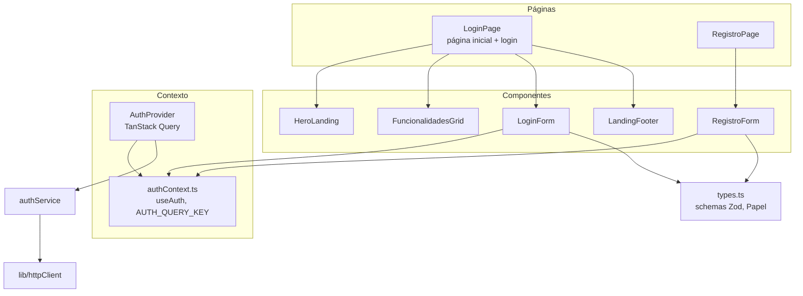
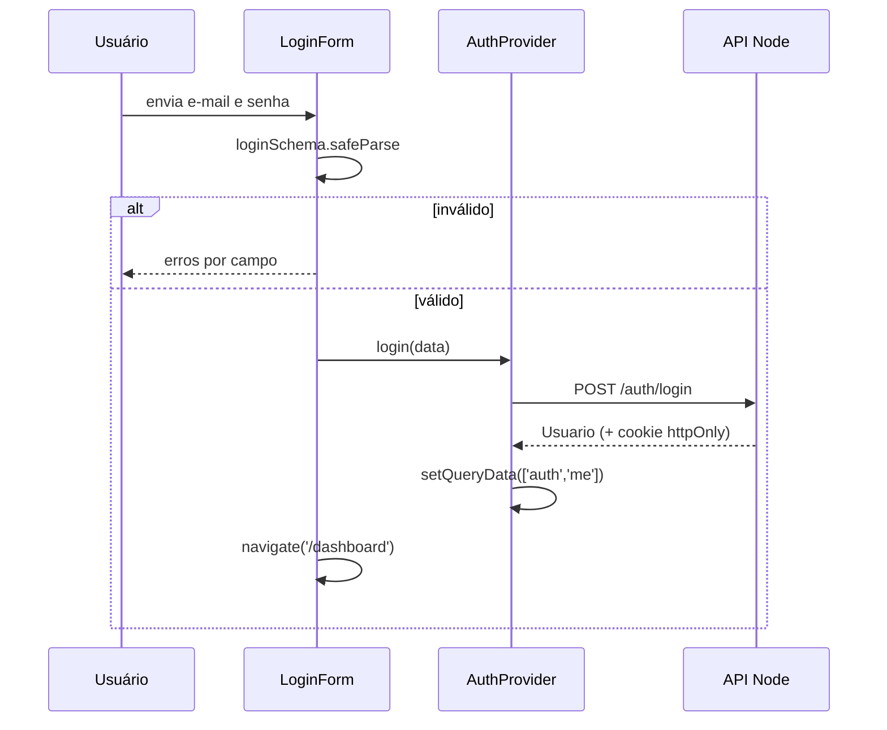

# Módulo Frontend Auth

## Visão geral

O módulo `frontend_auth` (`ide-web-front/src/features/auth/`) é dono de **quem é o usuário** no cliente: as telas de login e cadastro, a página inicial pública e o contexto React que expõe o usuário atual ao resto da aplicação. Ele não guarda token algum. A sessão vive num cookie `httpOnly` definido pelo backend, e este módulo apenas pergunta à API "quem sou eu?" e reage à resposta.

Desde a Fase 8, **todo papel tem conta própria** (e-mail e senha), alunos inclusive. A antiga "sessão leve pelo código da turma" não existe mais: o código da turma é usado *depois* do login, para se matricular.

**Documentação relacionada:**
- [Frontend Shared](frontend_shared.md) - `AuthGuard`, `TopNav` e `httpClient` leem deste módulo
- [Frontend Turmas](frontend_turmas.md) - o `turmasService.matricular` é chamado pelo formulário de cadastro
- [Backend Auth](backend_auth.md) - os endpoints `/auth/*` e a sessão no servidor

---

## Arquitetura



O `index.ts` exporta `AuthProvider`, `useAuth`, `LoginPage`, `RegistroPage` e os tipos `Papel` e `Usuario`. As outras features importam apenas dali.

---

## Tipos e validação (`types.ts`)

```typescript
export const PAPEIS = ['aluno', 'professor', 'pesquisador'] as const;
export const PAPEIS_REGISTRAVEIS = ['aluno', 'professor'] as const;

export interface Usuario {
  id: string;
  nome: string;
  email: string | null;
  papel: Papel;
}
```

| Schema | Regras |
|---|---|
| `loginSchema` | `email` sem espaços nas pontas e um e-mail válido; `senha` não vazia |
| `registroSchema` | `nome` não vazio; `email` válido; `senha` com pelo menos 8 caracteres; `papel` um entre `PAPEIS_REGISTRAVEIS` |

O `pesquisador` está deliberadamente **ausente do cadastro público**. É uma conta única do autor, criada por `ide-web-backend/scripts/seed-pesquisador.ts`, nunca por autocadastro. O backend aplica a mesma regra; o frontend simplesmente não oferece a opção.

---

## Contexto de autenticação

O `AuthProvider` envolve o TanStack Query e publica um `AuthContextValue`:

```typescript
interface AuthContextValue {
  usuario: Usuario | null;
  isLoading: boolean;
  login(input: LoginInput): Promise<Usuario>;
  registrar(input: RegistroInput): Promise<Usuario>;
  logout(): Promise<void>;
  isLoginPending: boolean;   isRegistroPending: boolean;
  loginError: Error | null;  registroError: Error | null;
}
```

- O usuário atual é a consulta `['auth','me']` (`AUTH_QUERY_KEY`), com `retry: false` e `staleTime: Infinity`. É buscado uma vez na inicialização e depois só muda por meio de mutações.
- O `fetchUsuarioAtual` transforma um `401` de `GET /auth/me` em `null`: "não estar logado" é um estado normal, não um erro. Qualquer outro erro é relançado.
- `login` e `registrar` gravam o usuário devolvido no cache com `setQueryData`. O `logout` grava `null`.
- O `useAuth()` lança erro quando usado fora do provider.

O `authService` é um invólucro fino: `POST /auth/registrar`, `POST /auth/login`, `POST /auth/logout`, `GET /auth/me`.



A expiração da sessão não é tratada aqui: o `httpClient` renova em segundo plano ao receber 401, e se a renovação falhar o próximo `/auth/me` devolve 401 e a guarda leva o usuário para `/login`.

---

## Componentes e páginas

| Componente | Comportamento |
|---|---|
| `LoginPage` | Página inicial: `HeroLanding`, `FuncionalidadesGrid`, `LoginForm`, links para `/registro` (professor) e `/registro?papel=aluno`, e depois o `LandingFooter` |
| `LoginForm` | Valida com o `loginSchema`, converte os problemas do Zod em mensagens por campo, mostra o erro da API de forma reativa por meio do `loginError`, redireciona para `/dashboard` |
| `RegistroPage` / `RegistroForm` | Escolha do papel (`Aluno` ou `Professor`), nome, e-mail, senha. Aceita `papelInicial` e `codigoInicial` (vindos da query string) |
| `HeroLanding`, `LandingFooter` | Apresentação estática |
| `FuncionalidadesGrid` | Lista estática de seis cartões de funcionalidades |

**Cadastro e código da turma.** Quando o papel é `aluno`, o formulário mostra um campo opcional de "código da turma". Depois que a conta é criada, o formulário chama o `turmasService.matricular(código)` em regime de **melhor esforço**: se o código estiver errado ou a turma encerrada, a conta já existe e o aluno simplesmente tenta de novo pelo painel, em vez de perder o cadastro.

> **Texto desatualizado conhecido.** O primeiro cartão do `FuncionalidadesGrid` ainda diz "Turmas por código: … alunos entram sem precisar de conta". Isso era verdade até a Fase 7. Desde a Fase 8 o aluno precisa de conta e usa o código apenas para se matricular. O cartão deveria ser reescrito.

---

## Notas para quem mantém

- Nunca guarde o usuário ou um token em `localStorage`. O cookie é `httpOnly` e o objeto do usuário é reconstruído a partir de `/auth/me`.
- Adicionar um papel ao cadastro público exige tanto o `PAPEIS_REGISTRAVEIS` aqui quanto o DTO no backend.
- Os erros de formulário seguem um único padrão: `safeParse` do Zod, mapear `issue.path[0]` para uma mensagem de campo, e manter os erros do servidor em `loginError` / `registroError`.
