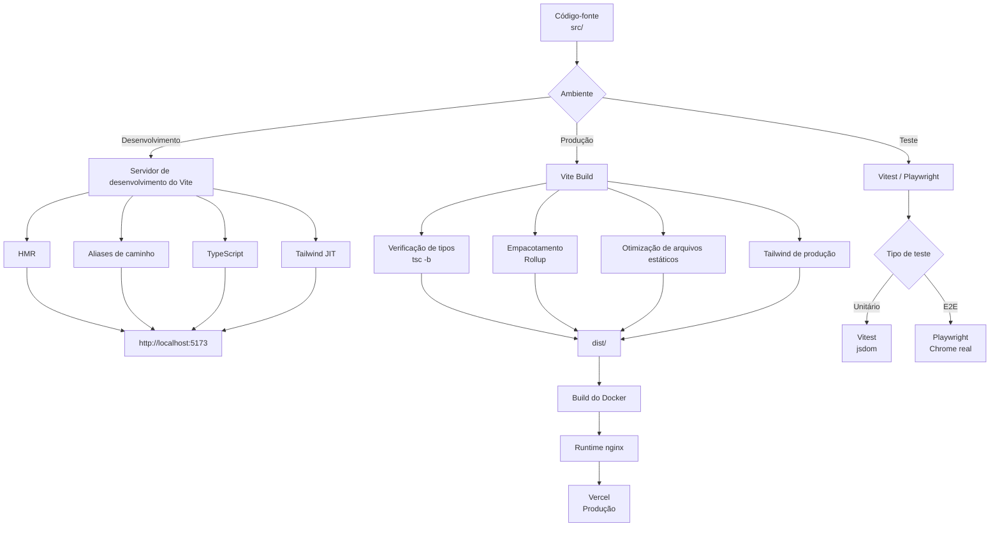
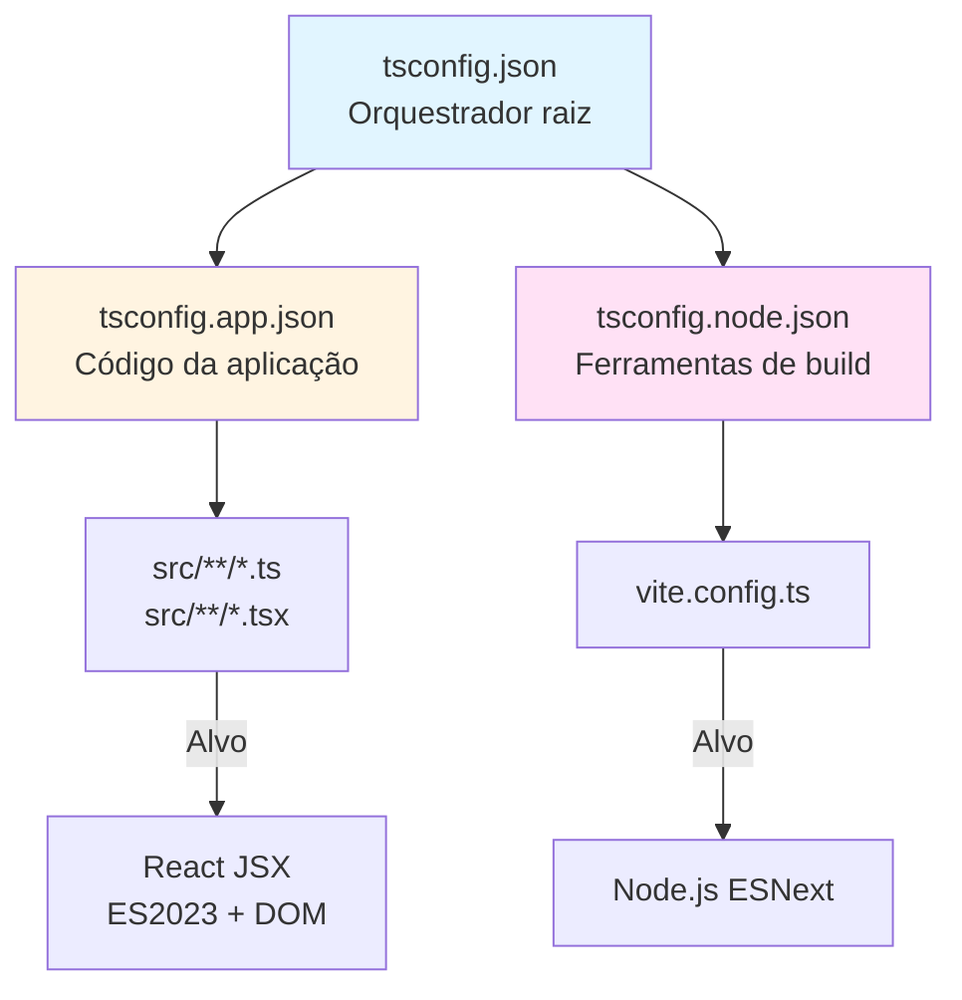
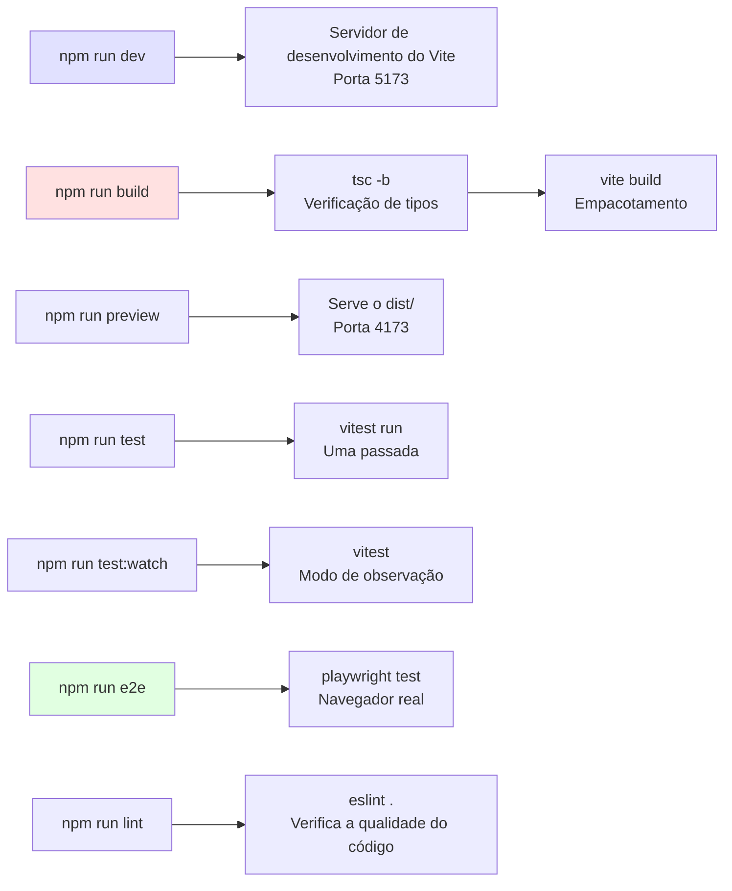
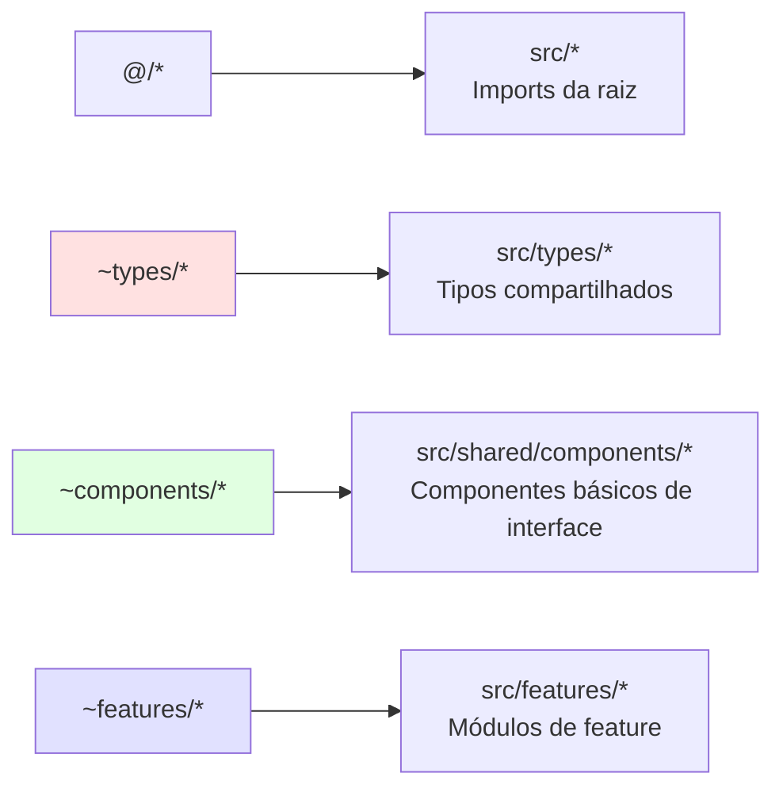
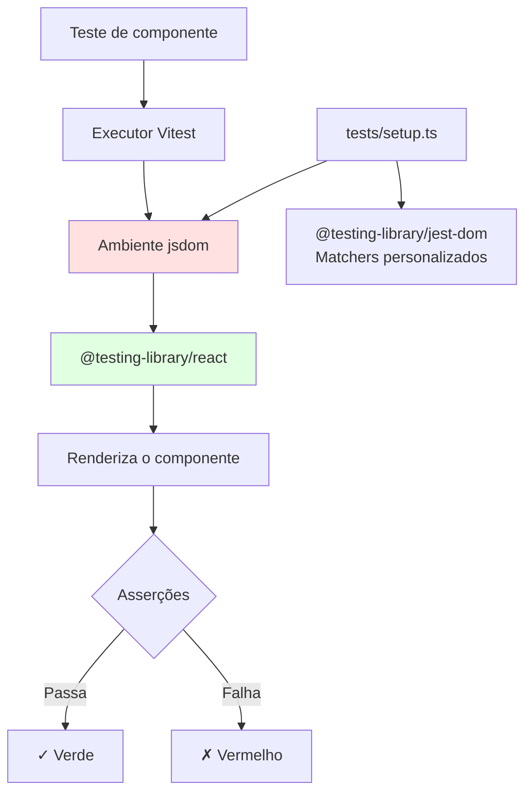
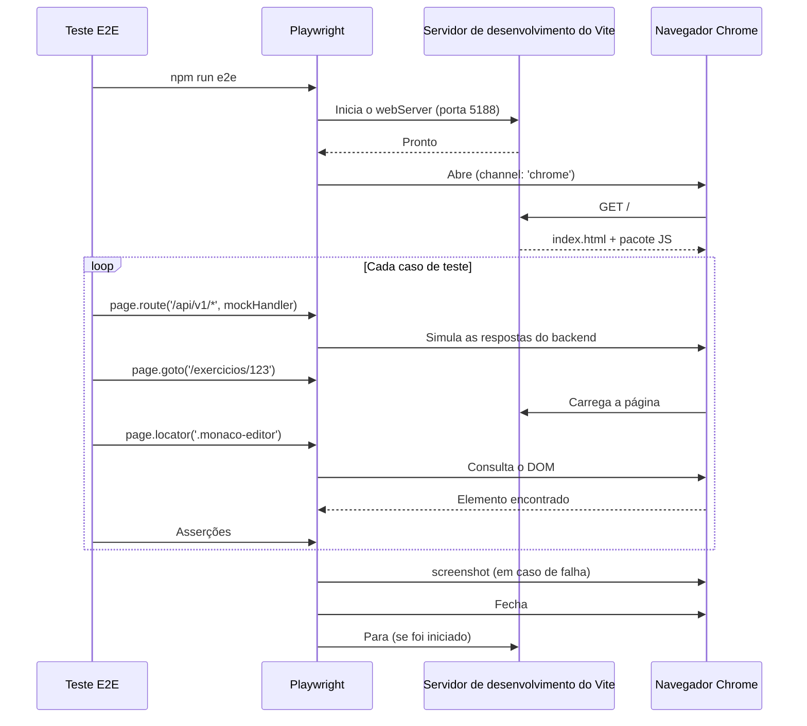
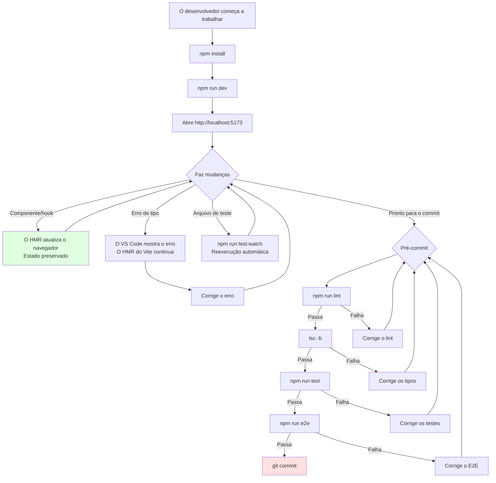
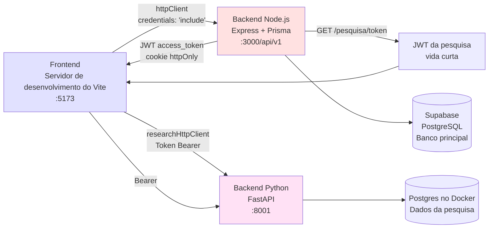

# Configuração de build do frontend

**Módulo**: `frontend_build_config`  
**Localização**: `ide-web-front/`  
**Finalidade**: cadeia de ferramentas de build, configuração do TypeScript e infraestrutura de testes da aplicação frontend em React

---

## Visão geral

O módulo de configuração de build do frontend orquestra todo o fluxo de desenvolvimento, build e testes do frontend da IDE Web. Ele usa o **Vite** como ferramenta de build, com **React** e **TypeScript**, configurado tanto para uma iteração rápida no desenvolvimento quanto para builds de produção otimizados. O módulo implementa uma estratégia de configuração dividida do TypeScript com referências de projeto, integra testes unitários com o Vitest e oferece testes ponta a ponta no navegador por meio do Playwright.

### Tecnologias principais

- **Ferramenta de build**: Vite 8.2.0 (nativo em ESM, HMR, empacotamento otimizado)
- **Sistema de tipos**: TypeScript 6.0.2 com modo estrito
- **Testes unitários**: Vitest 4.1.11 (executor de testes nativo do Vite)
- **Testes E2E**: Playwright 1.63.0 (navegador Chrome real)
- **Framework de CSS**: Tailwind CSS 4.3.3
- **Bibliotecas de interface**: React 19.2.8, React Flow (diagramas MER), Monaco Editor (edição de SQL)
- **Servidor de produção**: nginx (imagem Docker baseada em Alpine)

---

## Arquitetura

### Pipeline de build



### Estratégia de configuração do TypeScript

O frontend usa **referências de projeto do TypeScript** para separar as responsabilidades:



**Por que referências de projeto?**
- **Builds incrementais**: cada projeto compila de forma independente, com `.tsbuildinfo` em cache
- **Fronteiras estritas**: o código de ferramentas (configuração do Vite) usa os tipos do Node.js; o código da aplicação usa os tipos do DOM/navegador
- **Verificação de tipos em paralelo**: vários projetos podem ser verificados ao mesmo tempo

---

## Detalhamento dos componentes

### 1. Configuração de pacotes (`package.json`)

#### Dependências principais

| Pacote | Versão | Finalidade |
|---------|---------|---------|
| `react` | 19.2.8 | Framework de interface |
| `react-router-dom` | 7.18.2 | Roteamento no cliente |
| `@tanstack/react-query` | 5.101.4 | Gestão do estado do servidor, cache |
| `@monaco-editor/react` | 4.7.0 | Editor de código SQL (motor do VS Code) |
| `@xyflow/react` | 12.11.3 | Canvas dos diagramas MER (modelagem conceitual + lógica) |
| `html-to-image` | 1.11.13 | Captura os diagramas MER como PNG para a exportação em PDF |
| `zod` | 4.4.3 | Validação de schemas em tempo de execução (espelha os DTOs do backend) |

#### Dependências de desenvolvimento

| Pacote | Versão | Finalidade |
|---------|---------|---------|
| `vite` | 8.2.0 | Ferramenta de build e servidor de desenvolvimento |
| `@vitejs/plugin-react` | 6.1.0 | React Fast Refresh, transformação de JSX |
| `@tailwindcss/vite` | 4.3.3 | Integração com o Tailwind CSS |
| `typescript` | 6.0.2 | Sistema de tipos |
| `vitest` | 4.1.11 | Executor de testes unitários (nativo do Vite) |
| `@playwright/test` | 1.63.0 | Testes E2E no navegador |
| `@testing-library/react` | 16.3.2 | Utilitários de teste de componentes |
| `eslint` | 9.39.5 | Lint (com plugins de React/JSX/a11y) |

#### Scripts NPM



**Pontos-chave**:
- **`build`**: executa primeiro o compilador do TypeScript (`tsc -b`) para validar os tipos em todos os projetos referenciados, e depois empacota com o Vite
- **`test:watch`**: modo de desenvolvimento com HMR para os testes (usa o ambiente jsdom)
- **`e2e`**: executa o Playwright contra um Chrome real (veja a seção de estratégia de testes E2E abaixo)

### 2. Configuração do Vite (`vite.config.ts`)

**Origem da configuração**: `ide-web-front/vite.config.ts`

```typescript
import { fileURLToPath, URL } from 'node:url'
import { defineConfig } from 'vitest/config'
import react from '@vitejs/plugin-react'
import tailwindcss from '@tailwindcss/vite'

export default defineConfig({
  plugins: [react(), tailwindcss()],
  resolve: {
    alias: {
      '@': './src',
      '~types': './src/types',
      '~components': './src/shared/components',
      '~features': './src/features',
    },
  },
  test: {
    environment: 'jsdom',
    globals: true,
    setupFiles: './tests/setup.ts',
  },
})
```

#### Aliases de caminho

**Finalidade**: evitar imports relativos profundos (`../../../shared/components`) e impor as fronteiras arquiteturais.



**Regras de import** (do `CLAUDE.md`):
- Importe do `index.ts` da feature por padrão
- **Exceção**: importe o serviço/hook diretamente quando a feature exporta páginas pesadas (Monaco/React Flow), para evitar carregar código não usado nos testes

Exemplo:
```typescript
// ✅ Caso normal
import { ExercicioPage } from '~features/exercicio'

// ✅ Import leve (evita o pacote do Monaco no teste)
import { exercicioService } from '~features/exercicio/services/exercicioService'
```

#### Integração com o Vitest

- **Ambiente**: `jsdom` (simulação do DOM para os componentes React)
- **Globais**: `true` (não é preciso importar `describe`, `it`, `expect`)
- **Preparação**: `tests/setup.ts` (configura os matchers do `@testing-library/jest-dom`)

**Limitação**: o jsdom não consegue executar o React Flow nem o Monaco Editor → os testes E2E usam um navegador real (veja `playwright.config.ts`).

### 3. Configuração do TypeScript

#### `tsconfig.json` (orquestrador raiz)

**Origem da configuração**: `ide-web-front/tsconfig.json`

```json
{
  "files": [],
  "references": [
    { "path": "./tsconfig.app.json" },
    { "path": "./tsconfig.node.json" }
  ]
}
```

**Padrão de solução**: usa o recurso de **projetos compostos** do TypeScript. A configuração raiz não tem arquivos próprios; ela delega aos subprojetos por meio de `references`.

**Comando de build**: `tsc -b` (modo de build) respeita as referências e compila de forma incremental.

#### `tsconfig.app.json` (código da aplicação)

**Origem da configuração**: `ide-web-front/tsconfig.app.json`

**Alvo**: `ES2023` com as bibliotecas `DOM` (runtime do navegador)  
**Sistema de módulos**: `esnext` com resolução `bundler` (o Vite cuida do empacotamento final)  
**Rigor**:
```json
{
  "strict": true,
  "noImplicitAny": true,
  "noUncheckedIndexedAccess": true,  // ← O acesso a array devolve T | undefined
  "exactOptionalPropertyTypes": true  // ← {x?: string} !== {x?: string | undefined}
}
```

**Aliases de caminho**: espelhados do `vite.config.ts` (as duas configurações precisam permanecer sincronizadas).

**Saída**: `noEmit: true` (o Vite cuida da transpilação; o TypeScript só verifica os tipos).

**Cache de build**: `node_modules/.tmp/tsconfig.app.tsbuildinfo` (ignorado pelo git).

#### `tsconfig.node.json` (ferramentas de build)

**Origem da configuração**: `ide-web-front/tsconfig.node.json`

**Alvo**: `ES2023` com os tipos do Node.js (para o `vite.config.ts`)  
**Sistema de módulos**: `nodenext` (suporta CJS e ESM no Node.js 20+)  
**Inclui**: apenas o `vite.config.ts`  
**Cache de build**: `node_modules/.tmp/tsconfig.node.tsbuildinfo`

**Por que separado?** Impede que os tipos do DOM vazem para os scripts de build e vice-versa.

---

## Infraestrutura de testes

### Testes unitários (Vitest)



**Configuração** (do `vite.config.ts`):
- **Ambiente**: jsdom (simulação leve do DOM)
- **Globais**: `describe`, `it`, `expect` disponíveis sem imports
- **Arquivo de preparação**: `tests/setup.ts` (configura os matchers do Testing Library, como `toBeInTheDocument()`)

**Limitações**:
- **Não consegue testar o Monaco Editor** (exige APIs reais do navegador)
- **Não consegue testar o React Flow** (usa ResizeObserver e IntersectionObserver, que não existem no jsdom)
- → Esses recursos exigem testes E2E

### Testes E2E (Playwright)

**Origem da configuração**: `ide-web-front/playwright.config.ts`

```typescript
export default defineConfig({
  testDir: './tests/e2e',
  testMatch: '**/*.e2e.ts',
  timeout: 60_000,
  fullyParallel: false,  // Um worker (Monaco + React Flow = pesado)
  workers: 1,
  use: {
    baseURL: 'http://localhost:5188',
    channel: 'chrome',  // Usa o Chrome do sistema, não o Chromium empacotado
    viewport: { width: 1366, height: 768 },
    screenshot: 'only-on-failure',
    trace: 'retain-on-failure',
  },
  webServer: {
    command: 'npx vite --port 5188 --strictPort',
    url: 'http://localhost:5188',
    reuseExistingServer: true,
  },
})
```

#### Por que testar em navegador real?

Do `CLAUDE.md`:
> Teste de navegador real: `npm run e2e` (Playwright + Chrome do sistema, API simulada, `tests/e2e/*.e2e.ts`).

**Problema**: o jsdom não dá suporte a:
- **Monaco Editor**: usa Web Workers e gramáticas TextMate avançadas
- **React Flow**: exige `ResizeObserver`, `IntersectionObserver` e renderização SVG avançada

**Solução**: o Playwright abre um Chrome real e renderiza a aplicação React completa com o servidor de desenvolvimento do Vite.

#### Fluxo de execução dos testes



**Principais escolhas de configuração**:

| Configuração | Valor | Justificativa |
|---------|-------|-----------|
| `workers: 1` | Um único worker | Três instâncias de Monaco+React Flow travam o navegador |
| `fullyParallel: false` | Sequencial | Os testes compartilham o mesmo servidor Vite |
| `channel: 'chrome'` | Chrome do sistema | Estável, o navegador real do usuário |
| `screenshot: 'only-on-failure'` | Captura condicional | Depurar as falhas visualmente |
| `reuseExistingServer: true` | Reaproveita o servidor de desenvolvimento | Iteração local mais rápida |

**Simulação da API**: os testes usam `page.route()` para simular as respostas do backend (não é preciso um servidor de API real).

---

## Processo de build

### Build de desenvolvimento

```bash
npm run dev
```

**Fluxo**:
1. O Vite inicia o servidor de desenvolvimento na porta `5173` (padrão)
2. Carrega o `vite.config.ts` (contexto Node.js, via `tsconfig.node.json`)
3. Aplica os plugins: `@vitejs/plugin-react` (Fast Refresh), `@tailwindcss/vite` (compilador JIT)
4. Resolve os aliases de caminho (`@/*`, `~features/*` etc.)
5. Serve o `index.html` com a tag de script injetada
6. Observa o `src/` em busca de mudanças → o HMR atualiza sem recarregar por completo

**Hot Module Replacement**:
- **Componentes React**: preserva o estado entre as edições (Fast Refresh)
- **CSS**: injeta os estilos atualizados sem recarregar
- **Monaco/React Flow**: algumas mudanças exigem recarregar por completo (workers do editor, estado do canvas)

### Build de produção

```bash
npm run build
```

**Processo em duas fases**:

#### Fase 1: verificação de tipos
```bash
tsc -b
```
- Compila todos os projetos em `references` (app + node)
- Valida os tipos entre as fronteiras dos projetos
- Grava o `.tsbuildinfo` para as reconstruções incrementais
- **Não emite JS** (`noEmit: true`)

#### Fase 2: empacotamento
```bash
vite build
```

**Saída** (`dist/`):
```
dist/
├── index.html                 # Ponto de entrada, com links de arquivos com hash
├── assets/
│   ├── index-[hash].js       # Pacote principal (React, React Router etc.)
│   ├── chunk-[hash].js       # Fragmentos com divisão de código (por rota/feature)
│   ├── monaco-[hash].js      # Pacote do Monaco Editor (carregado sob demanda)
│   ├── reactflow-[hash].js   # Pacote do React Flow (carregado sob demanda)
│   └── index-[hash].css      # Tailwind compilado + estilos dos componentes
└── vite.svg                  # Favicon
```

**Otimizações**:
- **Divisão de código**: cada rota/feature em um fragmento separado
- **Tree shaking**: remove exports não usados (apenas módulos ES)
- **Minificação**: Terser para o JS, cssnano para o CSS
- **Hash nos arquivos**: invalidação de cache (por exemplo, `index-a1b2c3d4.js`)
- **Remoção do Tailwind**: remove as classes utilitárias não usadas (apenas em produção)

**Variáveis de ambiente** (em tempo de build):
- `VITE_API_URL`: URL base da API do backend (padrão: `http://localhost:3000/api/v1`)
- `VITE_RESEARCH_API_URL`: backend de pesquisa em Python (padrão: `http://localhost:8001`)

Definidas por argumentos de build do Docker (veja a seção de build do Docker abaixo).

### Build do Docker

**Origem da configuração**: `ide-web-front/Dockerfile`

```dockerfile
# Estágio 1: build
FROM node:20-alpine AS build
WORKDIR /app

COPY package.json package-lock.json ./
RUN npm ci

COPY . .

ARG VITE_API_URL=http://localhost:3000/api/v1
ARG VITE_RESEARCH_API_URL=http://localhost:8001
ENV VITE_API_URL=$VITE_API_URL
ENV VITE_RESEARCH_API_URL=$VITE_RESEARCH_API_URL
RUN npm run build

# Estágio 2: runtime
FROM nginx:alpine AS runtime
COPY --from=build /app/dist /usr/share/nginx/html
COPY nginx.conf /etc/nginx/conf.d/default.conf

EXPOSE 80
```

**Benefícios do build multi-estágio**:
- **Imagem final pequena**: runtime nginx (~40MB) contra build com node (~800MB)
- **Sem dependências de desenvolvimento**: o `node_modules/` fica no estágio de build
- **Segurança**: sem o runtime do Node.js na imagem de produção

#### Configuração do nginx

**Origem da configuração**: `ide-web-front/nginx.conf`

```nginx
server {
    listen 80;
    root /usr/share/nginx/html;
    index index.html;

    # Reserva da SPA: todas as rotas → index.html (roteamento no cliente)
    location / {
        try_files $uri $uri/ /index.html;
    }

    # Cache agressivo para os arquivos com hash
    location /assets/ {
        expires 1y;
        add_header Cache-Control "public, immutable";
    }
}
```

**Recursos principais**:
- **Roteamento da SPA**: `/exercicios/123` → serve o `index.html`, e o React Router trata a rota no cliente
- **Cabeçalhos de cache**: os arquivos com hash (`index-[hash].js`) ficam em cache por 1 ano (seguro, graças à invalidação pelo hash)
- **Sem cache**: o `index.html` é sempre buscado novo (sem hash, referencia os arquivos mais recentes)

---

## Fluxo de desenvolvimento

### Desenvolvimento local



### Integração com o backend

O frontend se conecta a dois backends:



**Fluxo de autenticação**:
1. O usuário faz login → `POST /api/v1/auth/login`
2. O backend define o cookie `httpOnly` (`access_token`)
3. Todas as requisições do `httpClient` incluem o cookie automaticamente (`credentials: 'include'`)
4. Para os endpoints de pesquisa, o frontend busca um JWT de vida curta: `GET /api/v1/pesquisa/token`
5. O `researchHttpClient` usa esse token como `Authorization: Bearer <token>`

Veja [frontend_auth](frontend_auth.md) e [backend_pesquisa](backend_pesquisa.md) para os detalhes.

---

## Lint e qualidade de código

### Configuração do ESLint

Das devDependencies do `package.json`:

```json
{
  "eslint": "^9.39.5",
  "eslint-plugin-jsx-a11y": "^6.10.2",      // Verificações de acessibilidade
  "eslint-plugin-react": "^7.37.5",         // Boas práticas de React
  "eslint-plugin-react-hooks": "^7.1.1",    // Regras dos hooks
  "eslint-plugin-react-refresh": "^0.5.4"   // Componentes seguros para o HMR
}
```

**Principais regras aplicadas**:
- **Acessibilidade**: `jsx-a11y` (por exemplo, texto `alt` nas imagens, rótulos ARIA)
- **Dependências dos hooks**: `react-hooks/exhaustive-deps` (evita closures desatualizadas)
- **Compatibilidade com o HMR**: `react-refresh/only-export-components` (evita exports que quebram o Fast Refresh)
- **TypeScript**: regras estritas do `@typescript-eslint` (pelo plugin `typescript-eslint`)

**Execução**:
```bash
npm run lint  # Verifica todos os arquivos de src/
```

---

## Gestão de dependências

### Dependências pesadas

**Problema**: o Monaco Editor e o React Flow são pacotes grandes (~3MB somados).

**Estratégia**:
1. **Carregamento sob demanda (lazy loading)**: importar dinamicamente quando necessário
   ```typescript
   const MonacoEditor = React.lazy(() => import('@monaco-editor/react'))
   ```
2. **Divisão de código**: o Vite divide automaticamente em fragmentos separados
3. **Imports isolados**: serviços/hooks importam diretamente (contornando o `index.ts` pesado)

**Exemplo** (do `CLAUDE.md`):
```typescript
// ❌ Puxa o Monaco para o pacote de teste
import { exercicioService } from '~features/exercicio'

// ✅ Import leve (apenas o código do serviço)
import { exercicioService } from '~features/exercicio/services/exercicioService'
```

### Validação de schemas com Zod

**Finalidade**: validação em tempo de execução das respostas da API (espelha os DTOs do backend).

**Padrão**:
```typescript
// Backend: src/dtos/exercicio.dto.ts
export const createExercicioSchema = z.object({
  titulo: z.string().min(3),
  nivel: z.enum(['iniciante', 'intermediario']),
  // ...
})

// Frontend: src/features/exercicio/types.ts
import { z } from 'zod'

export const exercicioProfessorSchema = z.object({
  id: z.string().uuid(),
  titulo: z.string(),
  nivel: z.enum(['iniciante', 'intermediario']),
  // ...
})

export type ExercicioProfessor = z.infer<typeof exercicioProfessorSchema>
```

**Uso**:
```typescript
const response = await httpClient.get('/exercicios/123')
const exercicio = exercicioProfessorSchema.parse(response.data)
```

**Benefícios**:
- **Segurança de tipos**: o `parse()` lança erro em dados inválidos → detecta a divergência do contrato da API
- **Fonte única da verdade**: o schema define a validação em tempo de execução e os tipos do TypeScript
- **Experiência do desenvolvedor**: os erros mostram o caminho exato do campo (por exemplo, `"nivel: Expected 'iniciante' | 'intermediario', received 'advanced'"`)

---

## Implantação em produção

### Implantação na Vercel

Do `CLAUDE.md`:
> Frontend: Vercel

**Comando de build** (configuração da Vercel):
```bash
npm run build
```

**Variáveis de ambiente** (definidas no painel da Vercel):
```env
VITE_API_URL=https://ide-web-backend.onrender.com/api/v1
VITE_RESEARCH_API_URL=https://pesquisa.example.com
```

**Diretório de saída**: `dist/`

**Preset de framework**: Vite (detectado automaticamente pelo `vite.config.ts`)

**Fluxo de implantação**:
1. Push na branch `main`
2. A Vercel detecta a mudança (integração com o GitHub)
3. Executa `npm install`
4. Executa `npm run build`, com as variáveis de ambiente injetadas
5. Envia o `dist/` para a CDN
6. Atualiza o DNS para a nova implantação
7. A implantação anterior é mantida como alvo de reversão

**Cache**:
- `index.html`: sem cache (sempre atualizado)
- `assets/*`: cache de 1 ano pela configuração do nginx (nomes de arquivo com hash)
- CDN de borda: serve os arquivos estáticos a partir do local mais próximo

---

## Solução de problemas

### Problemas comuns

#### 1. O Monaco Editor não carrega nos testes

**Sintoma**: `TypeError: Cannot read property 'editor' of undefined`

**Causa**: o jsdom não dá suporte aos Web Workers do Monaco.

**Solução**: simule (mock) o Monaco nos testes unitários e use os testes E2E para os recursos do editor.

```typescript
// tests/setup.ts
vi.mock('@monaco-editor/react', () => ({
  default: () => <div data-testid="monaco-mock" />,
}))
```

#### 2. Erros de tipo depois de atualizar dependências

**Sintoma**: o `tsc -b` falha com erros de resolução de módulos.

**Solução**: reconstrua as referências de projeto do TypeScript:
```bash
rm -rf node_modules/.tmp/*.tsbuildinfo
npm run build
```

#### 3. Classes do Tailwind não removidas

**Sintoma**: o pacote de produção inclui classes do Tailwind não usadas.

**Causa**: nomes de classe dinâmicos (por exemplo, `className={'text-' + color}`) não são detectados.

**Solução**: use a lista de segurança (safelist) na configuração do Tailwind, ou evite montar classes dinamicamente:
```typescript
// ❌ Não é seguro para a remoção
<div className={`text-${color}`} />

// ✅ Seguro para a remoção
<div className={color === 'red' ? 'text-red-500' : 'text-blue-500'} />
```

#### 4. Os testes E2E estouram o tempo

**Sintoma**: o Playwright trava em "Starting webServer".

**Causa**: a porta 5188 já está em uso.

**Solução**:
```bash
lsof -ti:5188 | xargs kill -9
npm run e2e
```

---

## Módulos relacionados

- **[infrastructure](infrastructure.md)**: orquestração do Docker Compose, runtime nginx
- **[backend_build_config](backend_build_config.md)**: configuração do TypeScript do backend (espelha algumas configurações)
- **[frontend_auth](frontend_auth.md)**: `AuthGuard`, `httpClient`, fluxo de autenticação
- **[frontend_exercicios](frontend_exercicios.md)**: integração com o Monaco Editor, IDE do exercício
- **[frontend_modelagem](frontend_modelagem.md)**: integração com o React Flow, editor de diagramas MER
- **[frontend_shared](frontend_shared.md)**: componentes compartilhados (`Button`, `Modal`, `PageStub`)

---

## Principais decisões e compensações

### 1. Vite em vez de Webpack

**Justificativa**:
- **Velocidade do servidor de desenvolvimento**: nativo em ESM (sem empacotamento no desenvolvimento), HMR instantâneo
- **Velocidade do build**: baseado em Rollup, mais rápido que o Webpack em apps React
- **Experiência do desenvolvedor**: zero configuração para TypeScript, CSS e arquivos estáticos

**Contrapartida**: ecossistema menos maduro que o do Webpack (alguns plugins não existem).

### 2. Referências de projeto em vez de monorepo

**Justificativa**:
- **Configuração mais simples**: sem a complexidade do Lerna/Turborepo
- **Suporte da IDE**: o VS Code respeita as referências do `tsconfig.json` nativamente
- **Builds incrementais**: o `tsc -b` só recompila os projetos alterados

**Contrapartida**: não escala para 10+ pacotes (este app tem 2: app + node).

### 3. Playwright em vez de Cypress

**Justificativa**:
- **Navegador real**: usa o Chrome do sistema (não o Electron nem um Chromium personalizado)
- **Vários navegadores**: pode testar Firefox e Safari (o Cypress é só Chrome)
- **Desempenho**: execução em paralelo, vídeo/trace em caso de falha

**Contrapartida**: menos "mágica" (exige esperas explícitas), curva de aprendizado mais íngreme.

### 4. Um único worker nos testes E2E

**Justificativa** (do `playwright.config.ts`):
> Um worker só: os testes dividem o mesmo Vite, e três páginas pesadas (React Flow + Monaco) subindo juntas travavam o carregamento do exercício.

**Contrapartida**: execução sequencial (mais lenta), mas estável (sem condições de corrida).

---

## Melhorias futuras

### Possíveis melhorias

1. **Module Federation**: compartilhar React/React Router entre micro-frontends
2. **Service Worker**: suporte offline para o ambiente do aluno (exercícios em cache)
3. **Web Workers**: transferir a validação do Zod para uma thread em segundo plano
4. **Análise do pacote**: `rollup-plugin-visualizer` para acompanhar o tamanho do pacote ao longo do tempo
5. **Vitest UI**: `vitest --ui` para depuração interativa dos testes
6. **Visualizador de trace do Playwright**: `npx playwright show-trace trace.zip` para depuração visual

### Monitoramento de desempenho

Acrescente o acompanhamento do tamanho do build de produção:
```json
{
  "scripts": {
    "build": "tsc -b && vite build && npm run analyze",
    "analyze": "vite-bundle-visualizer"
  }
}
```

---

## Resumo

O módulo **frontend_build_config** oferece um pipeline de build moderno e com segurança de tipos para o frontend da IDE Web. Ele aproveita a velocidade do Vite, o rigor do TypeScript e os testes em navegador real do Playwright para entregar uma experiência sólida ao desenvolvedor. A configuração equilibra a iteração rápida (HMR, verificação de tipos instantânea) com as otimizações de produção (divisão de código, tree shaking, cache agressivo), mantendo fronteiras arquiteturais claras por meio de referências de projeto e aliases de caminho.

**Principais conquistas**:
- ✅ **HMR abaixo de um segundo**: as mudanças aparecem instantaneamente no navegador
- ✅ **Imports com segurança de tipos**: todos os aliases são resolvidos pelo TypeScript e pelo Vite
- ✅ **Confiança nos E2E**: os testes com Chrome real detectam problemas do Monaco/React Flow
- ✅ **Pacotes pequenos**: imagem nginx de 40MB (contra 800MB da imagem node)
- ✅ **Pronto para a Vercel**: implantação sem configuração, com CDN de borda
