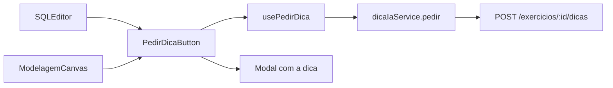
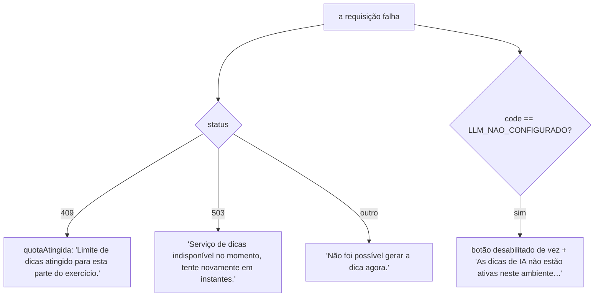
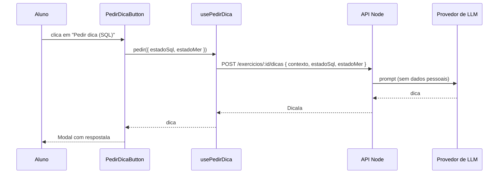

# Módulo Frontend Dica IA

## Visão geral

O módulo `frontend_dica_ia` (`ide-web-front/src/features/dica-ia/`) acrescenta o botão **"Pedir dica"** aos editores do exercício. O aluno clica quando quiser, o backend pede a um LLM uma dica pedagógica (nunca a resposta pronta), e o texto aparece num modal.

O módulo é deliberadamente pequeno: um botão, um hook, um serviço, três tipos. Ele não sabe nada de prompts, cotas ou do provedor de LLM; isso fica no [Backend Dica IA](backend_dica_ia.md). A tarefa dele é enviar o estado ao vivo dos editores e traduzir os códigos de erro do backend em mensagens claras.

**Documentação relacionada:**
- [Backend Dica IA](backend_dica_ia.md) - limite de 5 dicas por contexto, prompt sem dados pessoais
- [Frontend Exercicios](frontend_exercicios.md) - o `SQLEditor` renderiza o botão de SQL
- [Frontend Modelagem](frontend_modelagem.md) - o canvas de modelagem renderiza o botão de MER
- [Frontend Shared](frontend_shared.md) - `Button` e `Modal`

---

## Arquitetura



O `index.ts` exporta apenas o `PedirDicaButton` e o tipo `EstadoDica`.

---

## Tipos

```typescript
export const CONTEXTOS_DICA = ['sql', 'mer'] as const;

export interface DicaIa { id: string; contexto: ContextoDica; respostaIa: string; criadoEm: string }

// Estado ao vivo dos editores. Desde a Fase 6, os dois vão juntos quando o exercício
// tem as duas partes, para a IA apontar incoerência entre o modelo e a consulta.
export interface EstadoDica { estadoMer?: unknown; estadoSql?: string }

export interface PedirDicaInput extends EstadoDica { contexto: ContextoDica }
```

O `estadoMer` é o documento de modelagem inteiro. O backend o transforma num resumo do modelo conceitual mais o modelo lógico como SQL gerado, antes de montar o prompt para o LLM.

## Hook: `usePedirDica(exercicioId, contexto)`

Envolve uma mutação do TanStack Query e devolve:

| Campo | Significado |
|---|---|
| `pedir(estado)` | dispara a requisição |
| `isPending` | requisição em andamento |
| `dica` / `fecharDica()` | a dica recebida, e uma forma de limpá-la |
| `quotaAtingida` | vira `true` assim que o backend responde **409** |
| `erro` | o `HttpError`, quando há um |

O `quotaAtingida` permanece depois do primeiro 409, de modo que o botão continua desabilitado sem que outro clique seja necessário para descobrir que o limite foi atingido.

## Componente: `PedirDicaButton`

```typescript
interface PedirDicaButtonProps {
  exercicioId: string;
  contexto: ContextoDica;      // 'sql' | 'mer'
  estado: EstadoDica;
  semConteudo: boolean;        // quem renderiza sabe se a parte está vazia
}
```

Os rótulos são "Pedir dica (SQL)" e "Pedir dica (MER)". O botão fica desabilitado quando há uma requisição pendente, a cota foi atingida, a parte está vazia (`semConteudo`) ou a IA não está configurada.

### Como os erros aparecem



A diferença entre `LLM_NAO_CONFIGURADO` e um 503 comum é intencional. A falta de chave de API no ambiente não se resolve tentando de novo, então o botão é desabilitado com um `title` explicativo. Um 503 passageiro do provedor vale a pena tentar de novo, então o botão continua utilizável.

Enquanto espera, a área do botão mostra "Processando dica, aguarde..." numa região `aria-live="polite"`, e os erros usam `role="alert"`.

A dica em si é renderizada dentro do `Modal` com o título "Dica".

## Fluxo de dados


