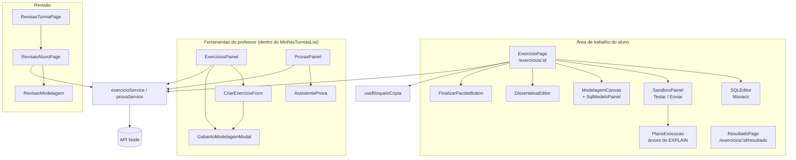
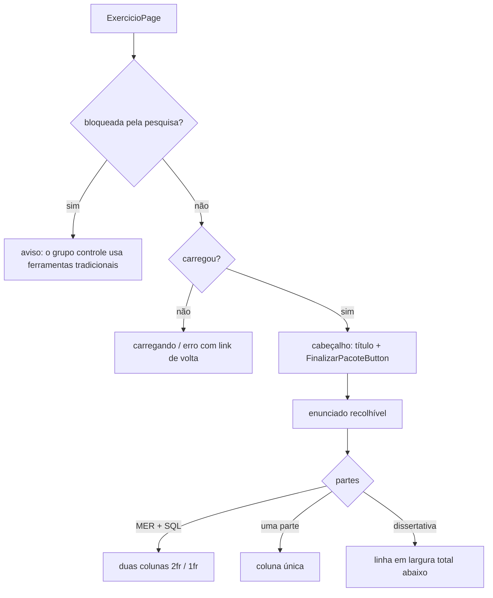
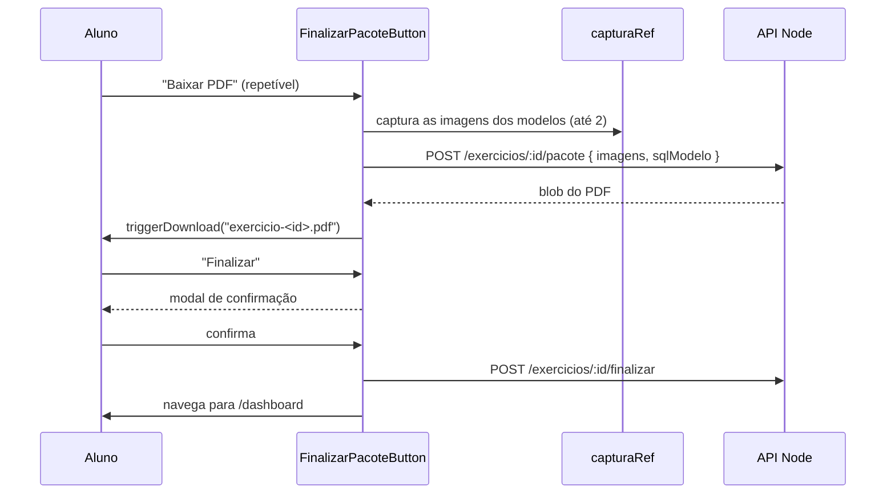

# Módulo Frontend Exercicios

## Visão geral

O módulo `frontend_exercicios` (`ide-web-front/src/features/exercicio/`, sem a subárvore `modelagem/`, documentada em [Frontend Modelagem](frontend_modelagem.md)) é a **área de trabalho do exercício**. Ele tem dois públicos:

- **O aluno** resolve um exercício na `ExercicioPage`: um editor de SQL com sandbox, um canvas de modelagem e uma caixa de dissertativa, lado a lado. Ele pode testar, enviar, baixar um PDF e finalizar o exercício.
- **O professor** cria exercícios, define os gabaritos, monta e sorteia provas, libera ou oculta o gabarito e revisa as respostas dos alunos.

Um exercício combina **até três partes opcionais**: SQL (`temSql`), modelagem (`temMer`) e dissertativa (`temDissertativa`). A página se adapta às partes que existirem.

**Documentação relacionada:**
- [Backend Exercicios](backend_exercicios.md) - CRUD e o ponto único de controle de acesso `AcessoExercicioService`
- [Backend Sandbox SQL](backend_sandbox_sql.md) - o que "Testar" e "Enviar resposta" executam
- [Backend Resultado](backend_resultado.md) - endpoints de revisão e de nota
- [Backend Provas](backend_provas.md) - variantes de prova e o sorteio
- [Backend Pacote](backend_pacote.md) - o PDF e a finalização
- [Frontend Modelagem](frontend_modelagem.md) - o canvas embutido na página
- [Frontend Dica IA](frontend_dica_ia.md) - o botão de dica no editor de SQL

---

## Arquitetura



O `index.ts` exporta `ExercicioPage`, `ResultadoPage`, `ExerciciosPainel`, `ExerciciosAlunoList`, `ProvasPainel`, `RevisaoTurmaPage`, `RevisaoAlunoPage`, `exercicioService` e `provaService`.

> A `ExercicioPage` carrega o Monaco, que é pesado. As outras features que só precisam de um serviço importam o arquivo concreto (`~features/exercicio/services/exercicioService`) em vez do barrel, para que o Monaco não seja puxado e os testes em jsdom não quebrem.

---

## Tipos e validação (`types.ts`)

```typescript
interface ExercicioAluno {
  id; turmaId; provaId: string | null; titulo; enunciado;
  nivelDificuldade: 'iniciante' | 'intermediario';
  prazo: string | null;
  publico: boolean;            // qualquer aluno logado resolve, sem matrícula
  gabaritoLiberado: boolean;
  temSql; temMer; temDissertativa: boolean;
  modoMer: ModoModelagem;      // nível da modelagem, sempre escolhido pelo professor
  sqlSetup: string | null;     // script de dados de exemplo (não é resposta)
}
interface ExercicioProfessor extends ExercicioAluno {
  merGabarito: unknown; sqlGabarito: string | null; gabaritoDissertativo: string | null;
}
```

O DTO do aluno nunca carrega um gabarito; os três gabaritos existem apenas no `ExercicioProfessor`.

| Schema | Regras |
|---|---|
| `criarExercicioSchema` | `turmaId` uuid; `titulo` e `enunciado` obrigatórios; `nivelDificuldade`; opcionais `prazo`, `publico`, `provaId`, `sqlGabarito`, `sqlSetup`, `gabaritoDissertativo`, `merGabarito` (validado pelo `documentoModelagemSchema`), `modoMer`. A ordem é atribuída pelo backend |
| `atualizarExercicioSchema` | apenas `merGabarito` e `modoMer` |
| `criarProvaSchema` | `turmaId` uuid, `titulo` obrigatório |
| `revisarResultadoSchema` | `sqlCorreto` booleano; `merAvaliacao`, `dissertativaAvaliacao` e `pontuacao`, cada um convertido em número entre **0 e `NOTA_MAXIMA` = 10** |

Tipos do resultado do sandbox: `SandboxResultado { status: 'sucesso' | 'erro_sintaxe' | 'erro_execucao', rows?, message? }` e `SandboxEnvioResultado`, que acrescenta `correta: boolean | null`, `submissaoId`, `tentativaNumero` e o `plano` do EXPLAIN.

## Serviços

`exercicioService` (tudo pelo `httpClient`, exceto o PDF):

| Área | Métodos |
|---|---|
| Exercício | `buscarPorId`, `listarPorTurma`, `criar`, `atualizar`, `listarPublicos` |
| Gabarito | `liberarGabarito`, `ocultarGabarito` |
| Sandbox | `testarSql` (`POST /exercicios/:id/sandbox/testar`), `enviarSql` (`/sandbox/enviar`) |
| Modelagem | `getDiagrama`, `salvarDiagrama` (`PUT /exercicios/:id/diagrama`), `diagramaDoAluno` (o professor lê o modelo de um aluno) |
| Resultado | `meuResultado`, `resultadoDoAluno`, `revisarResultado` (`PATCH .../alunos/:usuarioId/resultado`), `respostasDoAluno` |
| Encerramento | `baixarPacote` (`postForBlob` cru), `finalizar` |

`provaService`: `criar`, `listarPorTurma`, `acervo`, `montarComAssistente` e `sortear`, mapeados para `/turmas/:turmaId/provas...` e `/turmas/:turmaId/sortear-provas`.

---

## Área de trabalho do aluno: `ExercicioPage`

A página busca o exercício (`['exercicios', id]`) e dispõe apenas as partes que existem:



**Estado elevado para a página.** `sql`, o `documento` de modelagem e a `selecao` atual vivem aqui, para que os dois editores conversem entre si:

- `sqlDoModelo = gerarSql(documento.logico)` alimenta o `SqlModeloPainel` e o PDF.
- **Destaque nos dois sentidos (MER ↔ SQL).** Colocar o cursor num identificador da consulta o resolve contra as tabelas e aliases do modelo lógico e o seleciona no canvas. Selecionar no canvas destaca todas as ocorrências na consulta por meio de decorações do Monaco. Só funciona quando o exercício tem as duas partes **e** um modelo lógico (`sincronizar`); um exercício puramente conceitual não tem modelo lógico, então nem o painel de SQL nem a sincronização existem.
- O botão de dica recebe o estado ao vivo dos editores, incluindo o documento de modelagem quando as duas partes existem.

**Modo prova.** Quando o exercício pertence a uma prova (`provaId != null`), o `useBloqueioCopia(true)` bloqueia `copy`, `cut`, `paste` e `contextmenu` no documento, e o `SandboxPainel` muda de comportamento. Isso é **dissuasão, não controle**: detém o aluno desatento, não quem tem um celular ou um segundo monitor, e o texto do TCC não deve afirmar que a plataforma impede a consulta externa.

**Bloqueio da pesquisa.** O `useBloqueioPesquisa()` substitui a página inteira por uma explicação para os alunos do grupo controle enquanto uma pesquisa está ativa (veja [Frontend Pesquisa](frontend_pesquisa.md)). O bloqueio é apenas no frontend.

O cabeçalho reserva `pr-14` para o botão de tema flutuante e se empilha em telas estreitas, porque um cabeçalho de uma linha só espremia o título até virar "S..." em 390 px.

### `SQLEditor`

Monaco, empacotado localmente (`loader.config({ monaco })`), de modo que o editor funciona 100% self-hosted, sem CDN. Expõe `onCursorChange(offset)` e aceita `destaques` (intervalos a destacar, estilizados com a classe `mer-sync-destaque`). Sua barra de ferramentas renderiza o `PedirDicaButton` com `contexto="sql"`; "sem conteúdo" é decidido depois de mascarar strings e comentários, então uma consulta que só tem comentários conta como vazia. O editor fica dentro de um contêiner `.nokey`, senão no Chrome o React Flow ao lado engole a tecla Espaço (o atalho de pan dele).

### `SandboxPainel`

| Ação | Comportamento |
|---|---|
| **Testar** | Executa a consulta no schema de sandbox do aluno e mostra as linhas. Oculto no modo prova |
| **Enviar resposta** | Envia a consulta. Mostra um veredito, as linhas e o plano de execução |
| Confirmação na prova | No modo prova, um modal avisa que há **um único envio** e que um erro de digitação não pode ser corrigido depois; botões "Enviar definitivamente" e "Revisar mais" |

O veredito distingue três casos: `correta === true` ("Resposta correta."), `false` ("Resposta incorreta.") e `null`, que significa que o exercício não tem gabarito SQL, então mostra **"Resposta enviada. Este exercício será corrigido pelo professor."** Antes dessa correção, o aluno lia "rodou sem erro" como "acertei". O `ResultadoSandbox` é exportado porque o estudo livre renderiza os resultados do mesmo jeito.

### `PlanoExecucao` e `utils/planoExecucao.ts`

O `extrairPlano` converte o `EXPLAIN (FORMAT JSON)` do PostgreSQL numa árvore simples (`NoPlano`: tipo, tabela, alias, índice, linhas estimadas, custo total, filhos). O `TRADUCOES` mapeia nomes de nós como `Seq Scan`, `Index Scan`, `Hash Join`, `Nested Loop`, `Sort` e `HashAggregate` para um português claro. O componente o mostra dentro de um `<details>` "Ver como o PostgreSQL executa esta consulta", como uma visão didática opcional do nível interno da arquitetura ANSI/SPARC.

### `DissertativaEditor`

Um `textarea` simples. **Ainda não tem persistência**: o endpoint de escrita da `RespostaDissertativa` não existe, então o texto vive apenas no estado da página.

### `FinalizarPacoteButton`: duas ações separadas



**Baixar PDF** não tem efeito colateral e pode ser repetido. **Finalizar** grava a data de conclusão e derruba o schema do sandbox, então pede confirmação, avisando com mais ênfase quando o aluno ainda não baixou o PDF ("Finalizar sem baixar o PDF?", com um atalho "Baixar antes").

### `ResultadoPage`

`/exercicios/:id/resultado` mostra o resultado do próprio aluno: SQL correto ou não, nota da modelagem, nota da dissertativa, acertos, erros e a pontuação final, cada linha só quando tem valor. Antes de o professor liberar o gabarito, ela diz isso em vez de mostrar resultado.

---

## Ferramentas do professor

Estes painéis são renderizados dentro do cartão de cada turma pelo `MinhasTurmasList` (veja [Frontend Turmas](frontend_turmas.md)).

**`ExerciciosPainel`** lista os exercícios da turma com o estado do gabarito e as ações: "Editar/Adicionar modelagem" (abre o `GabaritoModelagemModal`), "Revisar" (vai para a `RevisaoTurmaPage`) e **Liberar gabarito / Ocultar gabarito**. Liberar mostra um modal de confirmação porque expõe as respostas à turma inteira; a ação inversa existe para que liberar por engano seja recuperável.

**`CriarExercicioForm`** monta um exercício com título, enunciado, nível, um **prazo** opcional (`prazo`; sem data, a atividade nunca vence), uma caixa **público**, uma **prova** opcional (`provaId`) e as partes opcionais: gabarito SQL, script de dados de exemplo (`sqlSetup`), gabarito da dissertativa e o gabarito da modelagem, desenhado no `GabaritoModelagemModal` com os mesmos editores que o aluno usa. O nível da modelagem (`modoMer`) é sempre escolhido aqui.

**`ProvasPainel`** cria provas (`criarProvaSchema`) e dispara o sorteio (`sortear`), que atribui uma variante a cada aluno matriculado e é idempotente. O **`AssistenteProva`** monta uma prova a partir dos exercícios que a turma já tem sem prova: mostra quantos estão disponíveis (no total e por nível) **antes** de o professor confirmar, porque um exercício pertence a uma única prova. Avisa quando o pedido excede o estoque, invalida a consulta do estoque após o sucesso para que o aviso não reapareça contra a contagem antiga, e aceita um nível e um prazo opcionais.

**`ExerciciosAlunoList`** é uma lista simples dos exercícios de uma turma com um link "ver resultado". É exportada, mas nenhuma tela a renderiza mais, já que o painel do aluno a substituiu.

## Telas de revisão

| Tela | Rota | Finalidade |
|---|---|---|
| `RevisaoTurmaPage` | `/admin/turmas/:turmaId/exercicios/:exercicioId/revisar` | Lista os alunos da turma para um exercício, com um link "Revisar" em cada |
| `RevisaoAlunoPage` | `.../revisar/:usuarioId` | Um aluno num exercício: última consulta SQL, texto da dissertativa, o modelo do aluno (`RevisaoModelagem`) e o formulário de nota |

A `RevisaoAlunoPage` mostra só SQL e dissertativa; a modelagem tem seu próprio componente. O caminho principal de revisão desde a Fase 10 é a tela por aluno em [Frontend Painel](frontend_painel.md), que reaproveita o `exercicioService.revisarResultado` e o `revisarResultadoSchema`.

---

## Notas para quem mantém

- As notas vão de 0,0 a 10,0 em todo lugar (`NOTA_MAXIMA`). Altere num único ponto.
- O autosave da modelagem, o desfazer/refazer e o assistente de conversão estão em [Frontend Modelagem](frontend_modelagem.md), não nesta página.
- O gabarito nunca deve chegar ao DTO do aluno. Novos campos com respostas pertencem ao `ExercicioProfessor`.
