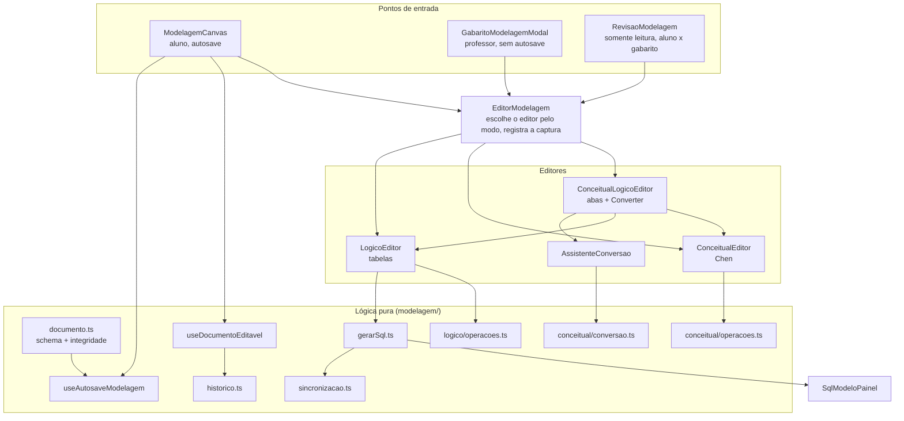
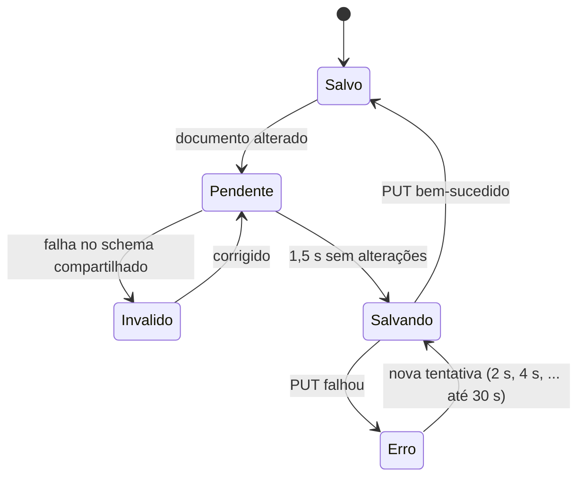

# Módulo Frontend Modelagem

## Visão geral

O módulo de modelagem é o **editor de diagramas** da IDE Web. Os alunos desenham um **modelo conceitual** (notação de Chen), o convertem com um assistente num **modelo lógico** (tabelas relacionais) e ajustam as tabelas. Os professores usam os mesmos editores para desenhar o gabarito e para revisar o que um aluno entregou.

Ele vive dentro da feature de exercício, em duas pastas:

| Caminho | Conteúdo |
|---|---|
| `src/features/exercicio/modelagem/` | Lógica pura, sem componentes React: o formato e a validação do documento, as operações de cada modelo, a conversão, a geração de SQL, o histórico de desfazer, o autosave, a sincronização MER ↔ SQL, a captura de imagens |
| `src/features/exercicio/components/modelagem/` | Os componentes React: editores, nós, arestas, painéis de propriedades, barra de ferramentas, paleta, telas de revisão e de gabarito |

A regra de projeto é que **tudo o que decide algo é uma função pura** (`operacoes.ts`, `conversao.ts`, `gerarSql.ts`, `sincronizacao.ts`), testada sem navegador, e os componentes apenas desenham e despacham.

**Documentação relacionada:**
- [Backend Modelagem](backend_modelagem.md) - valida o mesmo documento com um schema Zod espelhado e gera o mesmo SQL
- [Frontend Exercicios](frontend_exercicios.md) - a página que embute o canvas e o editor de SQL
- [Frontend Dica IA](frontend_dica_ia.md) - o botão de dica de MER fica na barra de ferramentas do canvas
- [Backend Pacote](backend_pacote.md) - recebe as imagens capturadas para o PDF

---

## Arquitetura



---

## O documento (`documento.ts`)

Tudo o que o aluno desenha é um único **documento JSON, versão 2**, guardado em `DiagramaMer.conteudo_json` (aluno) ou `Exercicio.mer_gabarito` (professor). Ele é validado pelo `documentoModelagemSchema`, um **espelho de `ide-web-backend/src/dtos/modelagem.schema.ts`**: os dois devem permanecer iguais. Os campos opcionais são `null`, nunca ausentes, para que o JSON tenha sempre o mesmo formato.

```typescript
interface DocumentoModelagem {
  versao: 2;
  conceitual: ModeloConceitual | null;
  logico: ModeloLogico | null;
  conversao: Conversao | null;   // { assinaturaConceitual, convertidoEm, escolhas }
}
```

**Modos** (`modos.ts`), escolhidos por exercício **sempre pelo professor**: `conceitual`, `logico`, `conceitual_logico`. O `modoDoExercicio` recai em `conceitual_logico` para qualquer valor desconhecido, porque o banco já teve um modo "aluno escolhe" que depois foi removido.

### Modelo lógico

| Peça | Campos |
|---|---|
| `Tabela` | `id`, `posicao`, `nome`, `colunas` (no máximo 60) |
| `Coluna` | `nome`, `tipo` (INTEGER, BIGINT, SMALLINT, NUMERIC, REAL, VARCHAR, CHAR, TEXT, DATE, TIME, TIMESTAMP, BOOLEAN), `tamanho`, `escala`, `pk`, `notNull`, `unique`, `autoIncremento`, `padrao`, `check`, `fk: { tabelaId, colunaId } \| null` |
| `Nota` | anotação de texto livre com uma posição |

### Modelo conceitual

Os elementos são uma união discriminada por `tipo`:

| `tipo` | Significado |
|---|---|
| `entidade` | entidade |
| `relacionamento` | relacionamento (losango); `associativa: true` o transforma em uma **entidade associativa**, que pode participar de outros relacionamentos |
| `atributo` | atributo com `paiId` (entidade, relacionamento ou outro atributo), `chave` (identificador), `cardinalidade` (`(1,1)`, `(0,1)`, `(0,n)`, `(1,n)`) e um `tipoSugerido` opcional. Um atributo com filhos é **composto**; `(0,n)` ou `(1,n)` o torna **multivalorado** |
| `especializacao` | triângulo de especialização: `paiId` (a entidade genérica), `total`, `disjunta` |
| `nota` | anotação |

Ligações (`ligacoes`): `participacao` (relacionamento ↔ entidade, com `min` 0 ou 1, `max` `'1'` ou `'n'` e um `papel`) e `filho_especializacao` (especialização → entidade especializada). `visaoAtributos` é `circulos` ou `lista`.

### Integridade além do formato

`problemasDoLogico` e `problemasDoConceitual` apontam o que o formato sozinho não garante: ids repetidos, uma chave estrangeira que aponta para uma coluna inexistente, um atributo sem pai válido, uma especialização sem entidade genérica, uma participação sem entidade ou relacionamento, e **ciclos de atributos**. O `documentoModelagemSchema` os executa no `superRefine`, de modo que um documento bem formado, mas inconsistente, é rejeitado.

O `LIMITES` impõe tetos de tamanho (63 caracteres por identificador, o limite do PostgreSQL; 400 elementos conceituais; 150 tabelas; 60 colunas por tabela; 10 MB) apenas para recusar cargas abusivas.

O `parseDocumento` **nunca quebra a tela**: conteúdo nulo, anterior à Fase 7 ou malformado carrega como um documento vazio, com um `console.warn`. O `erroDeValidacao` devolve o primeiro problema numa forma pronta para o usuário.

---

## Desfazer/refazer e autosave

O **`historico.ts`** é um reducer genérico com `passado`, `presente` e `futuro`, limitado a 100 passos. Os estados são guardados inteiros (o modelo é pequeno e imutável, então as cópias compartilham estrutura). Mudanças com a **mesma `chave`** se fundem num único passo, de modo que arrastar um nó ou digitar num campo é um único desfazer. O `encerrarGesto` fecha uma sequência dessas.

O **`useDocumentoEditavel`** o envolve para o documento: `aplicarLogico`, `aplicarConceitual` e `aplicarConversao`, que substitui o modelo lógico inteiro e registra a assinatura do conceitual como **um único** passo do histórico. Um único histórico cobre os dois modelos.

O **`useAutosaveModelagem(documento, salvar)`** é o que permite ao aluno fechar o notebook sem perder o trabalho:



- Ele espera o aluno parar (`ATRASO_AUTOSAVE_MS` = 1500), **valida com o mesmo schema do backend** (nunca envia o que seria recusado), nunca dispara dois PUTs em paralelo e tenta de novo com esperas crescentes (`esperaDaTentativa`).
- Com alterações não salvas, registra o `beforeunload`, e quando o componente é desmontado (por exemplo, "Voltar à turma") envia um último salvamento sem esperar.
- O `IndicadorSalvamento` mostra o estado: "Salvo às HH:MM", "Alterações não salvas…", "Salvando…", "Não salvo — tentando de novo", ou a mensagem de validação.

---

## O editor conceitual

O `ConceitualEditor` (React Flow, `@xyflow/react`) desenha a notação de Chen:

| Elemento | Forma |
|---|---|
| Entidade | retângulo (`EntidadeNode`) |
| Relacionamento | losango desenhado em **SVG com `stroke`**; nunca `clip-path` num elemento com borda, que só recorta a caixa original e não desenha um novo contorno |
| Entidade associativa | losango dentro de um retângulo |
| Atributo | círculo (`AtributoNode`); contorno duplo = multivalorado, filhos = composto; alças invisíveis apenas para que a `LinhaEdge` tenha pontas |
| Especialização | triângulo rotulado `(t\|p, d\|s)`, ligado à entidade genérica e às especializadas |
| Participação | rótulo `(mín,máx)` na `ParticipacaoEdge`, com curvatura crescente para que um **autorrelacionamento** separe suas duas linhas |

A visão dos atributos pode ser alternada na barra de ferramentas entre **círculos** e uma **lista** (`visaoAtributos`). O `PainelPropriedadesConceitual` (um painel sobreposto) edita o elemento selecionado.

Comportamento compartilhado pelos dois editores (o `estilos.ts` centraliza formas, contornos, alças e traços das linhas para que os dois níveis pareçam uma única ferramenta):

| Recurso | Detalhe |
|---|---|
| Paleta | clicar ou arrastar para adicionar (`Paleta`); atributos e especializações precisam de um pai e devem ser soltos em cima de outro elemento |
| Atalhos | `Delete`/`Backspace` removem, `Ctrl+Z` desfaz, `Ctrl+Shift+Z` ou `Ctrl+Y` refazem, `Ctrl+D` duplica, `Esc` limpa a seleção. Só valem com o foco **dentro do editor** e nunca dentro de um campo de texto, para não brigar com o `Ctrl+Z` do próprio Monaco |
| Canvas | grade de 16 px com encaixe, minimapa, `fitView` até o usuário interagir |
| Somente leitura | arrastar e conectar ficam desligados, as alças ficam invisíveis |
| Tela cheia | a `TelaCheia` expande o canvas; `Esc` volta. O tamanho normal continua sendo o padrão |

As operações puras ficam em `conceitual/operacoes.ts` (`adicionarEntidade`, `adicionarAtributo`, `criarParticipacao`, `definirAssociativa`, `removerElemento`, `duplicarEntidade`, ...). As operações que podem ser recusadas devolvem `{ ok: true, conceitual } | { ok: false, erro }`.

## O editor lógico

O `LogicoEditor` mostra caixas `TabelaNode` e linhas `FkEdge`. Os nós são **derivados do documento**, com o tamanho medido (`measured`) guardado à parte. Uma chave estrangeira é criada **arrastando de uma tabela para outra** (`ligarTabelas`): acrescenta uma coluna para cada parte da chave primária referenciada, com o nome `<tabela>_<pk>` e o mesmo tipo, e recusa quando a tabela referenciada não tem chave primária. Um autorrelacionamento ganha uma coluna opcional, porque a raiz não tem pai. As pontas das linhas ficam nas bordas das tabelas: nas laterais quando duas tabelas estão lado a lado, em cima e embaixo quando estão empilhadas (`geometria.ts`), de modo que uma linha nunca atravessa uma tabela. O `PainelPropriedadesLogico` edita colunas e restrições.

---

## Conversão conceitual → lógico (`conceitual/conversao.ts`)

O `converter(conceitual, escolhas)` é uma **função pura que nunca lança erro**: o que não pode ser convertido vira um aviso (`avisos`). Devolve `{ logico, avisos, pendencias, origem }`.

**Convenção de cardinalidade (Heuser).** O `(mín,máx)` de uma participação diz quantas ocorrências *daquela entidade* se associam a uma ocorrência da outra ponta. Logo, a participação de X é total (obrigatória) quando o `mín` da **outra** ponta é 1.

| Construção | Resultado |
|---|---|
| Entidade | uma tabela, reaproveitando o id do elemento |
| 1:N | chave estrangeira no lado N |
| N:N e n-ário | tabela própria com uma chave para cada participante |
| Entidade associativa | tabela própria, criada antes dos outros relacionamentos para que eles possam referenciá-la |
| Atributo composto | achatado em colunas `pai_filho` |
| Atributo multivalorado | tabela `<dono>_<atributo>` com a chave do dono mais o valor |
| 1:1 e especialização | **perguntados ao aluno** |

**As duas decisões em aberto** são o que o `identificarPendencias` devolve como `PendenciaConversao` (com as opções e uma explicação simples de cada uma):

| Caso | Opções |
|---|---|
| 1:1 | `fk_lado_total` (FK no lado obrigatório, o padrão), `fundir` (fundir numa tabela só, apenas quando as duas participações são totais), `tabela_propria` |
| Especialização | `tabela_por_entidade` (padrão), `tabela_unica` (com uma coluna `tipo` e colunas opcionais), `so_especializadas` (apenas quando a especialização é total) |

Uma escolha inválida recai no padrão e acrescenta um aviso.

**A ordem das passagens** importa: entidades → especializações (definem a chave primária das filhas) → associativas (viram tabelas referenciáveis) → fusões → demais relacionamentos → multivalorados (precisam da chave final do dono) → notas.

O `MapaOrigem` (`tabelaPorElemento`, `colunaPorAtributo`) registra onde cada elemento conceitual foi parar, e é usado na sincronização.

**`assinaturaConceitual`** é um hash do modelo conceitual **sem posições nem notas**. Só muda quando muda algo que afeta a conversão.

### `AssistenteConversao` e `ConceitualLogicoEditor`

O assistente é um modal que mostra um grupo de botões de opção para cada decisão pendente (com a explicação de cada opção), uma **prévia ao vivo** ("N tabelas") calculada com o `converter` e os avisos, antes de gravar qualquer coisa. Se já existe um modelo lógico, ele avisa que será substituído.

O `ConceitualLogicoEditor` dá ao aluno duas abas, **1. Conceitual** e **2. Lógico**. A segunda só abre depois de converter ou quando já existem tabelas ("Converta o modelo conceitual primeiro"), e um aluno que já tem tabelas abre na aba lógica, senão a primeira tela seria um modelo conceitual vazio e o trabalho pareceria ter sumido. O botão diz "Converter para lógico →" e depois "Converter de novo →".

> **Depois de converter, os dois modelos são independentes.** Se o modelo conceitual mudar, a barra de abas mostra "⚠ O modelo conceitual mudou depois da última conversão", comparando a assinatura guardada com a atual. "Converter de novo" refaz tudo.

---

## Geração de SQL (`gerarSql.ts`)

O `gerarSql(logico)` devolve `{ sql, avisos, tabelas }`, uma **função pura espelhada no backend** (com os mesmos casos de teste). O SQL é apenas **exibido** e enviado à IA; nunca é executado.

- As tabelas são ordenadas por dependência; uma referência a uma tabela ainda não criada (um ciclo) vira um `ALTER TABLE ... ADD CONSTRAINT` no final.
- As colunas de chave estrangeira são agrupadas, e a restrição recebe o nome `fk_<tabela>_<coluna>`, cortado nos 63 caracteres do PostgreSQL.
- Avisos: uma chave estrangeira cujos tipos diferem da coluna referenciada, e uma chave que não referencia uma chave primária inteira nem uma coluna `UNIQUE`.
- O `identificadores.ts` normaliza os nomes como o PostgreSQL os enxerga (minúsculas, sem acentos, `_` no lugar de espaços, um `_` inicial antes de dígito) e coloca aspas nas palavras reservadas.
- Cada tabela gerada registra `linhaInicio` e `linhaFim`, que o painel usa para destacar um bloco.

O `SqlModeloPainel` ("SQL do modelo — gerado automaticamente, não é executado") o mostra ao vivo, com um botão de copiar, uma contagem de avisos e o bloco destacado da tabela selecionada. Ele fica oculto no modo puramente conceitual, que não tem modelo lógico.

## Sincronização MER ↔ SQL (`sincronizacao.ts`)

Uma seleção num lado é destacada no outro, sempre expressa em **nomes normalizados**, os mesmos do SQL gerado.

- O `identificadorNaPosicao` encontra o identificador sob o cursor do SQL. O `mascararStringsEComentarios` antes troca strings e comentários por espaços **mantendo o tamanho**, de modo que os offsets continuam válidos e um nome dentro de uma string nunca é tomado por uma tabela.
- O `extrairAliases` lê `FROM cliente c` e `JOIN pedido AS p`.
- O `resolverSelecao` transforma o identificador numa seleção que existe no modelo: uma tabela, uma coluna, uma coluna exclusiva de uma tabela, ou uma coluna ambígua compartilhada por várias.
- O `ocorrenciasNoSql` devolve os intervalos a decorar quando uma tabela ou coluna é selecionada no canvas, incluindo seus aliases.

---

## Captura para o PDF (`captura.ts`)

O `EditorModelagem` registra uma função `capturar()` no `capturaRef` recebido da página do exercício. O `FinalizarPacoteButton` a chama, e ela usa o `html-to-image` para produzir PNGs (`ImagemModelo { rotulo, pngBase64 }`). No modo `conceitual_logico`, ela **força cada aba em sequência** (`abaForcada`), espera 250 ms para o React Flow remontar e desenhar suas linhas, captura e, por fim, restaura a aba. Isso produz até duas imagens, "Modelo conceitual" e "Modelo lógico".

---

## Telas do professor

| Componente | Comportamento |
|---|---|
| `GabaritoModelagemModal` | O professor escolhe o nível e desenha o gabarito no **mesmo editor** do aluno. Não há autosave: só vale quando ele clica em "Usar gabarito" |
| `RevisaoModelagem` | Visualizador somente leitura com duas abas, "Modelo do aluno" e "Gabarito". Na leitura, o nível vem do **que o documento tem**, já que um gabarito pode trazer os dois modelos num exercício de um nível só. Diz explicitamente quando o aluno não entregou nada, para que um canvas em branco nunca seja ambíguo, e avisa quando o carregamento falhou, para que o professor não dê nota sem ver o modelo. Nada aqui grava no diagrama do aluno |

---

## Notas para quem mantém

- Mantenha `documento.ts`, `gerarSql.ts` e `identificadores.ts` **idênticos aos equivalentes do backend**, com os mesmos casos de teste.
- Acrescente um novo comportamento primeiro como função pura e só depois ligue-o ao componente.
- Os testes de navegador ponta a ponta rodam com `npm run e2e` (Playwright e o Chrome do sistema, com API simulada, `tests/e2e/*.e2e.ts`).
- O Monaco fica dentro de `.nokey`, senão o React Flow engole a tecla Espaço no Chrome.
