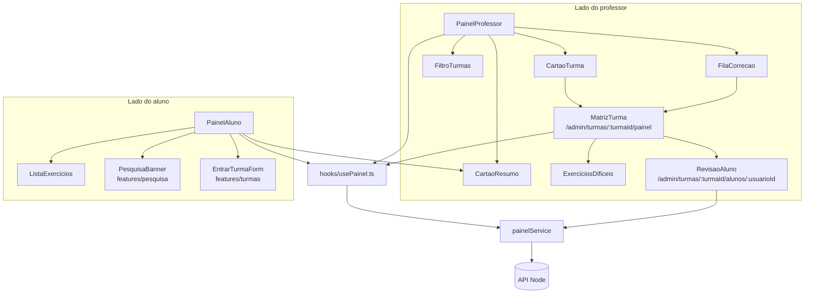
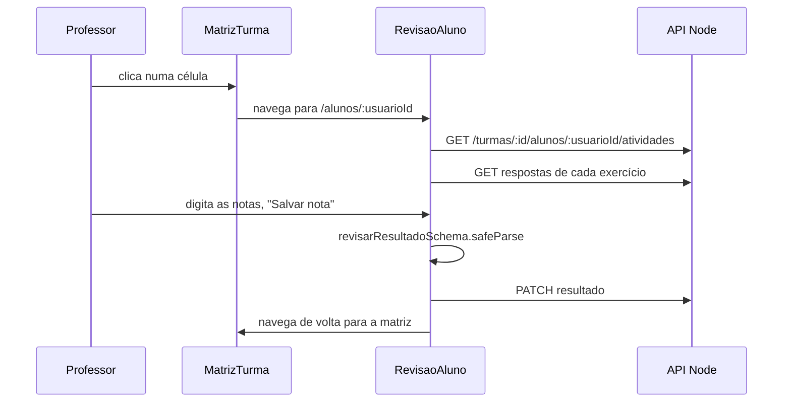

# Módulo Frontend Painel

## Visão geral

O módulo `frontend_painel` (`ide-web-front/src/features/painel/`) desenha os dois **painéis** e a tela de **revisão por aluno** do professor. É o cliente do [Backend Painel](backend_painel.md): o backend deriva um estado para cada célula `aluno × exercício`, e este módulo transforma esses dados em cartões, uma matriz, uma tabela de dificuldade e um formulário de notas.

A rota `/dashboard` é apenas um **roteador por papel**: o aluno vê o `PainelAluno`, o professor ou pesquisador vê o `PainelProfessor`. Cada papel chega então à sua própria área por cartões de atalho.

**Documentação relacionada:**
- [Backend Painel](backend_painel.md) - os quatro endpoints e a regra de estado da célula
- [Backend Resultado](backend_resultado.md) - o endpoint de nota usado pelo formulário de revisão
- [Frontend Turmas](frontend_turmas.md) - o `EntrarTurmaForm` fica embutido no painel do aluno
- [Frontend Exercicios](frontend_exercicios.md) - o `exercicioService` e o schema de notas
- [Frontend Pesquisa](frontend_pesquisa.md) - o banner da pesquisa mostrado primeiro no painel do aluno

---

## Arquitetura

O `index.ts` exporta `PainelProfessor`, `PainelAluno`, `MatrizTurma`, `RevisaoAluno`, `painelService`, todos os tipos e os auxiliares de filtro.

---

## Camada de dados

O `painelService` mapeia um método para cada endpoint.

| Método | Requisição |
|---|---|
| `doProfessor()` | `GET /painel/professor` |
| `doAluno()` | `GET /painel/aluno` |
| `daTurma(turmaId)` | `GET /turmas/:turmaId/painel` |
| `atividadesDoAluno(turmaId, usuarioId)` | `GET /turmas/:turmaId/alunos/:usuarioId/atividades` |
| `liberarEnvio(exercicioId, usuarioId)` | `POST /exercicios/:id/alunos/:usuarioId/liberar-envio` |

O `hooks/usePainel.ts` envolve os três primeiros no TanStack Query com `staleTime` de 30 s, porque os dados do painel envelhecem devagar e refazer a busca a cada foco da janela seria um desperdício. As chaves são `PAINEL_PROFESSOR_QUERY_KEY = ['painel','professor']`, `PAINEL_ALUNO_QUERY_KEY = ['painel','aluno']` e `['painel','turma', turmaId]`. O `usePainelTurma` só fica `enabled` quando a rota tem um `turmaId`.

O `types.ts` espelha o contrato do backend: `PainelProfessor`, `PainelAluno`, `PainelTurma`, `CelulaMatriz`, `DificuldadeExercicio`, `AtividadeDoAluno` e a união `EstadoCelula` com seus rótulos em português:

| Estado | Rótulo (`ROTULO_ESTADO`) |
|---|---|
| `nao_iniciou` | Não iniciou |
| `em_andamento` | Em andamento |
| `entregue` | Entregue |
| `correto` | Correto |
| `aguardando_revisao` | Aguardando revisão |

---

## Painel do professor: `PainelProfessor`

Disposição, de cima para baixo:

1. **Estado vazio.** Sem turmas, oferece "Criar minha primeira turma", um link para `/admin/turmas`.
2. **Resumo.** Quatro cartões `CartaoResumo`: turmas ativas, alunos matriculados, exercícios publicados e "Aguardando sua correção", que fica destacado (`destaque`).
3. **"Esperando correção"** (`FilaCorrecao`): uma linha por turma que tem `aguardandoRevisao > 0`, com um link "Corrigir" para a matriz da turma. Só aparece o trabalho que um humano precisa fazer (modelagem e dissertativa). A correção automática de SQL e os exercícios públicos nunca entram na fila.
4. **"Minhas turmas"**: um filtro (`FiltroTurmas`) e um `CartaoTurma` por turma, com uma barra de progresso (`role="progressbar"` com `aria-valuenow` e o rótulo "Entregas em <turma>"), um selo de "encerrada" e um link para a matriz. Um link "Gerenciar turmas" leva a `/admin/turmas`: a lista é onde se *age* (criar, encerrar), o painel é onde se *vê*.

**Filtragem.** O `filtroTurmas.ts` define `FiltroTurmasValor { turmaId, turno, sala }` e o `aplicarFiltro`. Um campo vazio não restringe nada e os três filtros se combinam. O `FiltroTurmas` monta suas opções **a partir das turmas que existem**, então nunca oferece uma sala que ninguém usa, e esconde por completo o seletor de turno ou de sala quando nenhuma turma tem esse dado.

## Matriz da turma: `MatrizTurma`

`/admin/turmas/:turmaId/painel` mostra uma `<table>` de verdade, com os alunos nas linhas e os exercícios nas colunas.

| Detalhe | Por quê |
|---|---|
| Cada estado tem **símbolo e rótulo de texto**, não só cor | Só a cor exclui quem tem daltonismo. Símbolos: `–` não iniciou, `◐` em andamento, `✉` entregue, `✓` correto, `⚑` aguardando revisão |
| Cada célula é um link para a tela de revisão do aluno | Um clique da visão geral à correção |
| A célula mostra a nota final quando há uma (formato `8,5`) | Nota visível sem abrir o aluno |
| `⚠` marca uma última submissão que não executou | Numa prova isso queimou o envio único; o professor decide se libera outro |
| Uma célula ausente mostra `·` com "Não faz parte da prova deste aluno" | O exercício pertence a outra variante de prova, então o aluno nunca o viu |
| `<caption class="sr-only">`, `scope` nos cabeçalhos, uma frase `sr-only` por célula | Suporte a leitor de tela: "<aluno> em <exercício>: <estado>, nota X" |

Abaixo da grade, o **`ExerciciosDificeis`** ("Onde a turma trava") ordena os exercícios do mais difícil para o mais fácil pela taxa de acerto. Um exercício que ninguém tentou vai para o fim, porque "sem dados" não é o mesmo que "0% de acerto". Os números são calculados apenas entre os alunos que tentaram, e médias de contagens inteiras evitam um enganoso `1.0`.

## Revisão por aluno: `RevisaoAluno`

`/admin/turmas/:turmaId/alunos/:usuarioId` é **uma tela com todas as atividades de um aluno**, para que o professor corrija a pessoa, e não uma questão isolada. Ela substituiu o fluxo por exercício como caminho principal (as antigas `RevisaoTurmaPage` e `RevisaoAlunoPage` continuam acessíveis em `/admin/turmas/:turmaId/exercicios/...`).

Para cada atividade, um `CartaoAtividade` mostra:

- o título, o estado, a contagem de tentativas e a de dicas
- um alerta **"Liberar novo envio"** quando a última submissão não executou: numa prova ela consumiu o envio único, e o botão chama o `painelService.liberarEnvio`
- a última consulta SQL do aluno com uma marca "correta / incorreta pelo gabarito", e o texto da dissertativa, ambos carregados pelo `exercicioService.respostasDoAluno`
- um link para o modelo do aluno quando o exercício tem parte de modelagem
- um formulário limitado às partes que o exercício de fato tem: uma caixa "SQL correto", `Modelagem`, `Dissertativa` e `Nota final`, cada uma de **0,0 a 10,0** (`NOTA_MAXIMA`)

A validação usa o `revisarResultadoSchema`, importado por caminho concreto de `~features/exercicio/...` para não puxar a página pesada do exercício (Monaco). Salvar chama o `exercicioService.revisarResultado`, invalida a consulta do aluno e volta para a matriz da turma.

---

## Painel do aluno: `PainelAluno`

Seções, em ordem:

1. **`PesquisaBanner`** é o **primeiro elemento** e seu comportamento não é tocado. É o gatilho que leva um participante ao termo de consentimento, então reorganizar a tela não pode perturbar esse caminho. É importado por caminho concreto, o que também deixa a remoção dele depois da coleta de dados numa única linha.
2. Cartões de **resumo**: turmas, "Falta fazer" (destacado), entregues, acertos automáticos.
3. **"O que falta fazer"**: os exercícios pendentes de todas as turmas numa lista só, com o nome da turma.
4. **Turmas agrupadas por disciplina**, cada uma com seu semestre, um selo "Encerrada" e, quando encerrada, a nota de que o aluno continua vendo tudo o que entregou, mas não pode mais enviar.
5. **"O que você já entregou"**: o histórico.
6. **"Seu progresso"**: para cada exercício resolvido, a tentativa em que foi resolvido pela primeira vez.
7. Um atalho para **"Estudar sozinho"** (`/estudar`) e o formulário **"Entrar em uma turma"**.

> **Sem comparação social.** O painel do aluno mostra o aluno apenas contra si mesmo: sem média da turma, sem ranking, sem nome de colegas. O backend nem sequer envia esses dados.

A `ListaExercicios` renderiza cada exercício como um link para `/exercicios/:id`, com o nível (Iniciante ou Intermediário) e uma etiqueta de estado, mais um link "Ver resultado" para `/exercicios/:id/resultado` assim que o professor libera o gabarito.

---

## Notas para quem mantém

- Depois de uma mutação que altera dados do painel (matricular, dar nota, liberar um envio), invalide a chave `['painel', ...]` correspondente, como fazem o `EntrarTurmaForm` e o `RevisaoAluno`.
- Um novo estado de célula precisa de um rótulo em `ROTULO_ESTADO`, um símbolo e um estilo na `MatrizTurma`, e do `ESTADOS_CELULA` do backend.
- Mantenha concretos os imports de outras features quando eles arrastariam o Monaco (`~features/exercicio/...`, `~features/pesquisa/components/...`).
