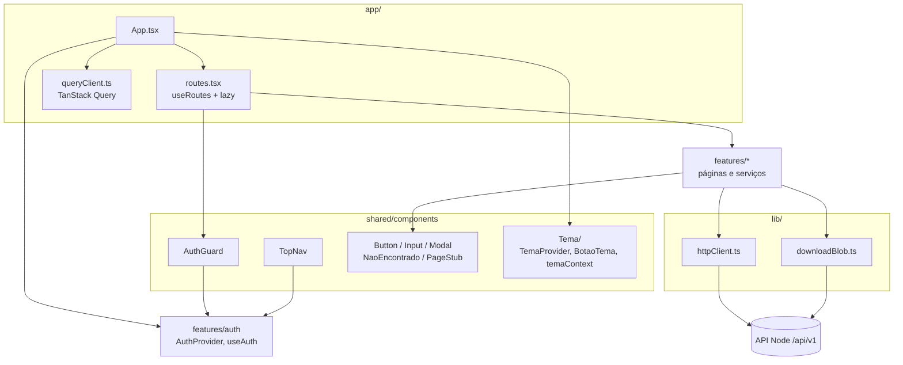
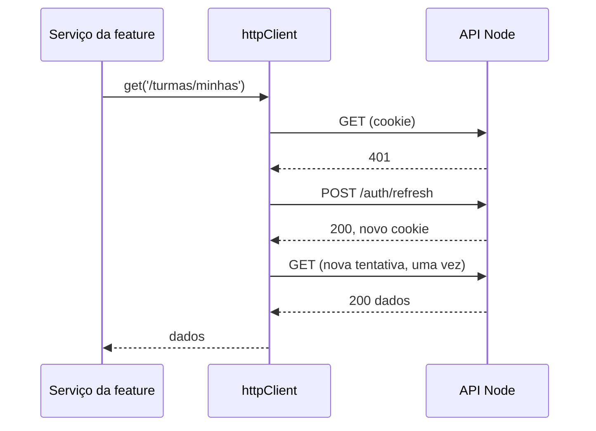
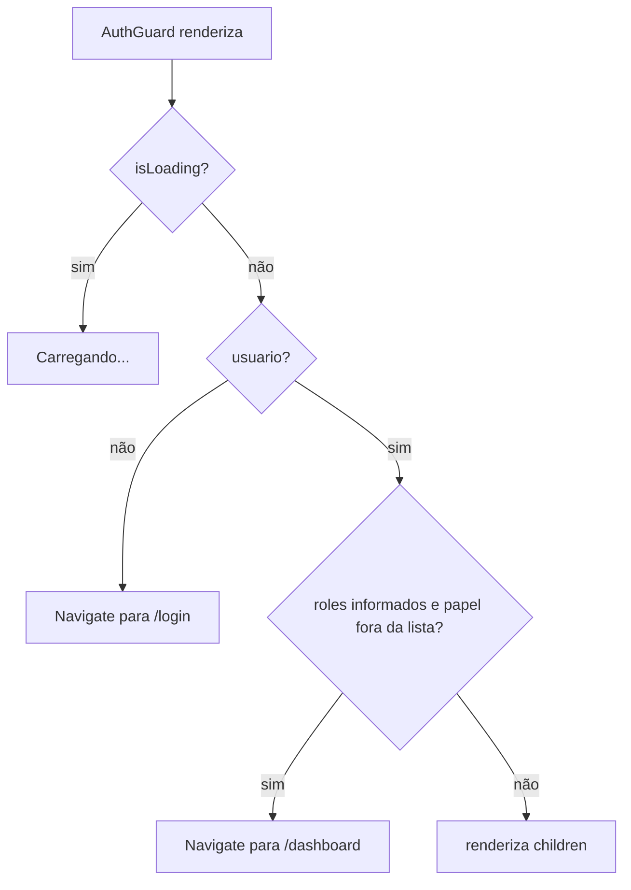

# Módulo Frontend Shared

## Visão geral

O módulo `frontend_shared` é a **base do frontend em React** (`ide-web-front/`). Ele guarda tudo o que não pertence a uma única feature: o cliente HTTP que conversa com a API Node, a tabela de rotas e a guarda por papel, o sistema de temas e um pequeno conjunto de componentes de interface acessíveis (`Button`, `Input`, `Modal`, `TopNav`, `NaoEncontrado`, `PageStub`).

As pastas de feature (`features/<domínio>/`) dependem deste módulo, e este módulo só depende de features onde precisa: por exemplo, a guarda lê o usuário logado de `features/auth`.

**Localizações**

| Caminho | Conteúdo |
|---|---|
| `src/lib/` | `httpClient.ts`, `downloadBlob.ts` |
| `src/shared/components/` | `AuthGuard`, `Button`, `Input`, `Modal`, `NaoEncontrado`, `PageStub`, `Tema/`, `TopNav` |
| `src/shared/hooks/` | `useDebouncedValue` |
| `src/app/` | `App.tsx`, `routes.tsx`, `queryClient.ts` |
| `src/types/` | `PaginatedResult`, `Nullable` |
| `src/vite-env.d.ts` | `import.meta.env` tipado (`VITE_API_URL`, `VITE_RESEARCH_API_URL`) |

**Documentação relacionada:**
- [Frontend Auth](frontend_auth.md) - fornece o `useAuth` e o tipo `Papel` usados pela guarda e pela navegação
- [Frontend Application](Frontend_Application.md) - os módulos de feature que consomem estes componentes
- [Backend Auth](backend_auth.md) - o endpoint `/auth/refresh` que o `httpClient` chama ao receber 401

---

## Arquitetura



O `App.tsx` aninha os providers nesta ordem: `QueryClientProvider` → `BrowserRouter` → `AuthProvider` → `TemaProvider`, e então renderiza o `BotaoTema` flutuante e o `AppRoutes`.

---

## Cliente HTTP (`lib/httpClient.ts`)

O `httpClient` envolve o `fetch` em toda chamada ao backend Node. A URL base é `VITE_API_URL`, com padrão `http://localhost:3000/api/v1`, e toda requisição envia `credentials: 'include'` para o cookie `httpOnly` acompanhar.

```typescript
export class HttpError extends Error {
  readonly status: number;
  readonly code: string;
}

export const httpClient = {
  get:    <T>(path: string) => Promise<T>,
  post:   <T>(path: string, body?: unknown) => Promise<T>,
  put:    <T>(path: string, body: unknown) => Promise<T>,
  patch:  <T>(path: string, body: unknown) => Promise<T>,
  delete: <T>(path: string) => Promise<T>,
};
```

**Envelope de resposta.** A API responde `{ data?, error?: { code, message } }`. No sucesso, o cliente devolve `body.data`; na falha, lança um `HttpError` com o status, o `code` do erro e a mensagem (em português) que o backend escreveu para o usuário. Um `204` devolve `undefined`.

**Renovação silenciosa da sessão.** Desde a sessão no servidor (Fase 10), o token de acesso dura 15 minutos, então um 401 precisa disparar uma renovação:



- `renovacaoEmCurso` é uma única promessa compartilhada: se várias requisições recebem 401 juntas, todas esperam a mesma renovação em vez de disparar várias.
- `ROTAS_SEM_RENOVACAO` (`/auth/login`, `/auth/registrar`, `/auth/refresh`, `/auth/logout`) nunca dispara renovação. Um 401 ali é uma resposta legítima (senha errada, logout já feito), e renovar criaria um laço.
- A requisição é refeita **uma única vez**.

**`lib/downloadBlob.ts`** existe porque o `httpClient` sempre espera o envelope JSON. O `postForBlob(path, body)` faz um `fetch` cru para respostas binárias, como o pacote em PDF do exercício, e ainda converte falhas em `HttpError`. O `triggerDownload(blob, filename)` cria uma URL de objeto temporária, clica num `<a download>` e revoga a URL.

> O serviço de pesquisa **não** é acessado por este cliente. A `features/pesquisa` tem o seu próprio `researchHttpClient` (veja [Frontend Pesquisa](frontend_pesquisa.md)).

---

## Rotas e controle de acesso

O `app/routes.tsx` declara toda a tabela de rotas com `useRoutes`. Toda página é carregada com `React.lazy` dentro de um único limite de `Suspense`, importando do `index.ts` de cada feature para que as pesadas (o editor Monaco na `ExercicioPage`) só sejam baixadas quando visitadas.

O `AuthGuard` cobre a autenticação **e** o papel:



| Rota | Guarda | Página |
|---|---|---|
| `/`, `/login`, `/registro`, `/politica-de-privacidade` | nenhuma | redirecionamento, login, cadastro, política de privacidade |
| `/dashboard` | qualquer usuário logado | roteador por papel com os painéis |
| `/estudar` | `aluno` | estudo livre |
| `/exercicios/:id`, `/exercicios/:id/resultado` | qualquer usuário logado | IDE do exercício e resultado |
| `/tcle`, `/pesquisa/sessao`, `/pesquisa/sus`, `/pesquisa/rtlx` | `aluno` | fluxo da pesquisa |
| `/admin/turmas` | `professor`, `pesquisador` | gestão de turmas |
| `/admin/pesquisa` | `pesquisador` | painel de controle da pesquisa |
| `/admin/turmas/:turmaId/painel` | `professor`, `pesquisador` | matriz aluno × exercício |
| `/admin/turmas/:turmaId/alunos/:usuarioId` | `professor`, `pesquisador` | revisão por aluno |
| `/admin/turmas/:turmaId/exercicios/:exercicioId/revisar[/:usuarioId]` | `professor`, `pesquisador` | revisão por exercício |
| `*` | nenhuma | `NaoEncontrado` |

A rota coringa importa: sem ela, uma URL desconhecida renderizava uma tela em branco. A guarda do frontend é uma conveniência de navegação. **A autorização de verdade é sempre aplicada pelo backend.**

A `TopNav` mostra um link para cada tela de nível raiz que o papel atual pode abrir (`aluno`: Painel, Estudar sozinho; `professor`: Painel, Turmas; `pesquisador`: Painel, Turmas, Pesquisa), a inicial e o nome do usuário, e um botão de sair. Ela reserva um espaço à direita (`pr-14`) para o botão de tema fixo.

---

## Sistema de temas (`shared/components/Tema/`)

| Peça | Função |
|---|---|
| `temaContext.ts` | `Tema = 'claro' \| 'escuro'`, o `TemaContext` e o hook `useTema()`, que lança erro fora de um provider |
| `TemaProvider.tsx` | Escolhe o tema inicial a partir de `localStorage['tema']`, com `prefers-color-scheme` como reserva. Alterna a classe `dark` no `<html>` e persiste a escolha |
| `BotaoTema.tsx` | Botão de alternância flutuante, montado uma única vez no `App.tsx` |

A chave de armazenamento é a mesma usada por um script inline no `index.html`, que define a classe antes da primeira pintura e evita o flash do tema errado.

---

## Componentes de interface

| Componente | Observações |
|---|---|
| `Button` | Variantes `primary`, `danger`, `ghost`. Com `isLoading` fica desabilitado, define `aria-busy` e mostra `loadingLabel` (padrão "Carregando…"). O `loadingLabel` existe para os casos em que um texto genérico não diz o que está acontecendo |
| `Input` | Campo de texto com `label` **obrigatório** (ligado por `useId`), `aria-invalid` e `aria-describedby` ligados a uma `errorMessage` renderizada com `role="alert"`. Para `type="password"`, acrescenta um botão de mostrar/ocultar |
| `Modal` | `role="dialog"`, `aria-modal`, `aria-labelledby`. Tamanhos `md` e `xl` (95vw). Fecha com o fundo, o botão ✕ e a tecla Esc. Passe `fecharComEsc={false}` quando o conteúdo usa o Esc (o editor de modelagem), para não perder trabalho |
| `NaoEncontrado` | Página 404. O botão vai para `/dashboard` quando logado e para `/login` caso contrário |
| `PageStub` | Marcador (`title`, `description`, filhos opcionais) para rotas cujo domínio ainda não existia no backend; resquício da Fase 1 |
| `useDebouncedValue(value, delayMs = 400)` | Hook de debounce, usado para atrasar trabalho dependente enquanto se digita |

O estilo usa classes utilitárias do Tailwind com tokens semânticos (`primary`, `danger`, `neutral`, `surface`), para que os temas claro e escuro compartilhem a mesma marcação.

## Padrões de busca de dados

O `queryClient.ts` cria o cliente do TanStack Query com `staleTime` de 60 segundos e `retry: 1`. Cada feature declara suas próprias chaves de consulta (por exemplo `features/turmas/hooks/queryKeys.ts`).

## Tipos compartilhados

```typescript
interface PaginatedResult<TItem> { items: TItem[]; total: number; page: number; pageSize: number }
type Nullable<TValue> = TValue | null
```

## Diretrizes para quem contribui

- Importe de outra feature **apenas pelo `index.ts` dela**. A exceção é um serviço ou hook leve quando a feature também exporta uma página pesada: importe o arquivo concreto (`~features/exercicio/services/exercicioService`) para que a página pesada (Monaco) não seja puxada de graça. Isso já quebrou testes em jsdom.
- Mantenha os componentes de interface livres de lógica de domínio: um componente compartilhado não deve saber o que é um exercício.
- Não use o `httpClient` para respostas binárias nem para o serviço de pesquisa.
