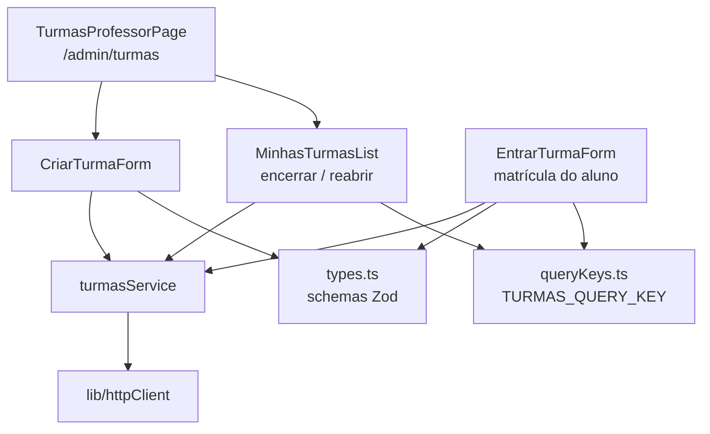
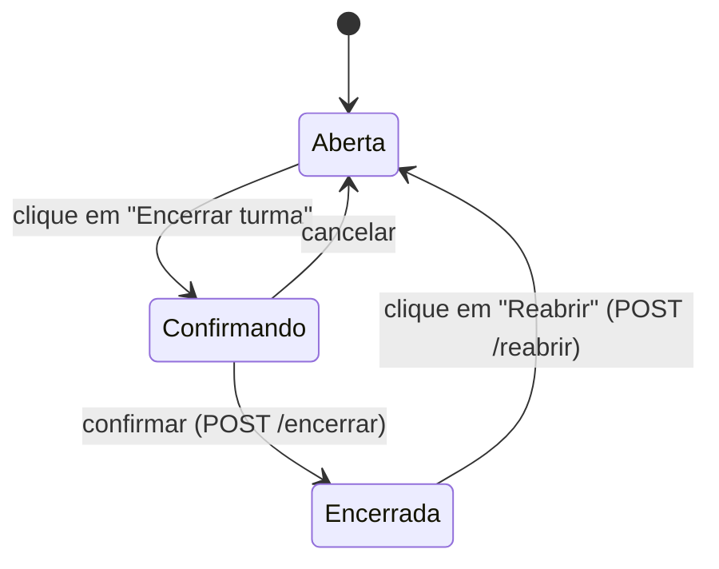

# Módulo Frontend Turmas

## Visão geral

O módulo `frontend_turmas` (`ide-web-front/src/features/turmas/`) é o lado cliente da gestão de turmas. Um **professor** cria turmas, compartilha o código da turma e a encerra ou reabre. Um **aluno** se matricula digitando esse código uma única vez.

As telas são pequenas; o valor do módulo está no contrato que ele mantém com o backend: o código da turma é um *token de matrícula*, não uma credencial, e uma turma encerrada fica congelada em modo somente leitura.

**Documentação relacionada:**
- [Backend Turmas](backend_turmas.md) - os endpoints que este módulo chama
- [Frontend Auth](frontend_auth.md) - o formulário de cadastro matricula por meio do `turmasService`
- [Frontend Painel](frontend_painel.md) - o painel do aluno é recarregado após uma matrícula
- [Frontend Shared](frontend_shared.md) - `Button`, `Input`, `Modal`

---

## Arquitetura



O `index.ts` exporta `TurmasProfessorPage`, `EntrarTurmaForm`, `turmasService` e o tipo `Turma`.

---

## Tipos e validação (`types.ts`)

```typescript
export const TURNOS = ['manha', 'tarde', 'noite'] as const;

export interface Turma {
  id: string; nome: string; disciplina: string; semestre: string;
  turno: Turno | null; sala: string | null;
  professorId: string; codigo: string;
  encerradaEm: string | null; criadoEm: string;
}
export interface Aluno { id: string; nome: string; email: string | null; matricula: string | null }
```

| Schema | Regras |
|---|---|
| `criarTurmaSchema` | `nome` e `semestre` obrigatórios; `disciplina` opcional; `turno` e `sala` opcionais e servem só ao filtro do painel (Fase 10) |
| `matricularSchema` | `codigo` sem espaços nas pontas, obrigatório, **convertido para maiúsculas** para que "abc123" funcione |

O `ROTULO_TURNO` mapeia os valores do enum para os rótulos `Manhã`, `Tarde` e `Noite`.

## Serviço (`turmasService`)

| Método | Requisição |
|---|---|
| `criar(input)` | `POST /turmas` |
| `minhas()` | `GET /turmas/minhas` |
| `listarAlunos(turmaId)` | `GET /turmas/:id/alunos` |
| `matricular(codigo)` | `POST /turmas/:codigo/matricular` |
| `encerrar(turmaId)` / `reabrir(turmaId)` | `POST /turmas/:id/encerrar` e `/reabrir` |

`TURMAS_QUERY_KEY = ['turmas', 'minhas']` é a chave de cache compartilhada. As mutações a invalidam para que as listas se atualizem sozinhas.

---

## Componentes

**`TurmasProfessorPage`** empilha duas seções, "Nova turma" (`CriarTurmaForm`) e "Minhas turmas" (`MinhasTurmasList`), com um link de volta ao painel.

**`CriarTurmaForm`** valida com o `criarTurmaSchema` e cria a turma. O backend gera o código.

**`MinhasTurmasList`** lista as turmas com o código de cada uma e, dentro do cartão de cada turma, embute o `ProvasPainel` e o `ExerciciosPainel` do [Frontend Exercicios](frontend_exercicios.md), de modo que o professor gerencia provas e exercícios exatamente onde a turma está. Também conduz o fluxo de encerramento:



Encerrar sempre pede confirmação num `Modal` que explica o efeito: os alunos continuam vendo a turma e o que entregaram, param de enviar, e o código deixa de matricular gente nova. Uma turma encerrada mostra essa mesma explicação na própria linha e oferece **Reabrir**, porque encerrar por engano é reversível.

**`EntrarTurmaForm`** valida o código com o `matricularSchema`, chama o `turmasService.matricular` e, em caso de sucesso, invalida tanto o `TURMAS_QUERY_KEY` quanto a consulta do painel do aluno (`PAINEL_ALUNO_QUERY_KEY`), para que a nova turma apareça imediatamente. O aluno permanece na turma até o professor encerrá-la, e pode estar em várias turmas ao mesmo tempo.

---

## Regras de comportamento que vale conhecer

- O código é usado **uma única vez**, depois do login. Nada aqui o guarda nem o trata como senha.
- O frontend nunca decide se uma turma aceita envios. Ele mostra o estado (`encerradaEm`), e o backend o faz valer.
- O `pesquisador` vê todas as turmas em `/admin/turmas`, porque precisa escolher a turma em que vai iniciar a pesquisa.
