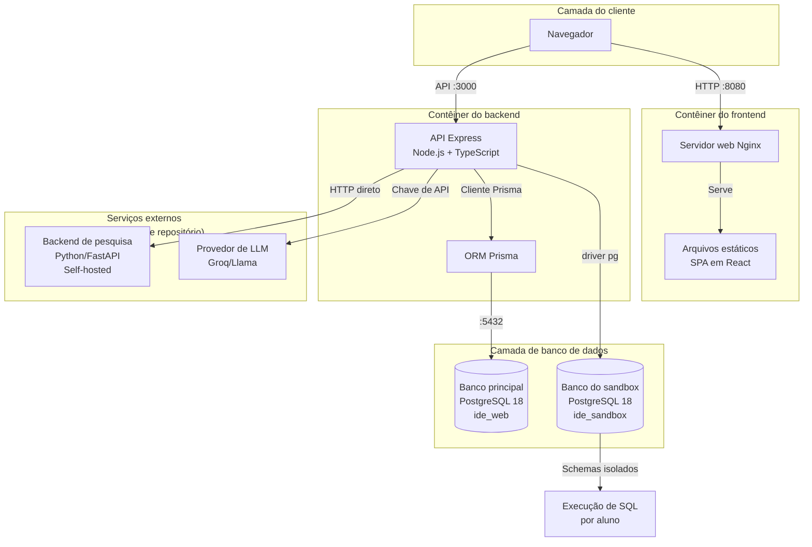
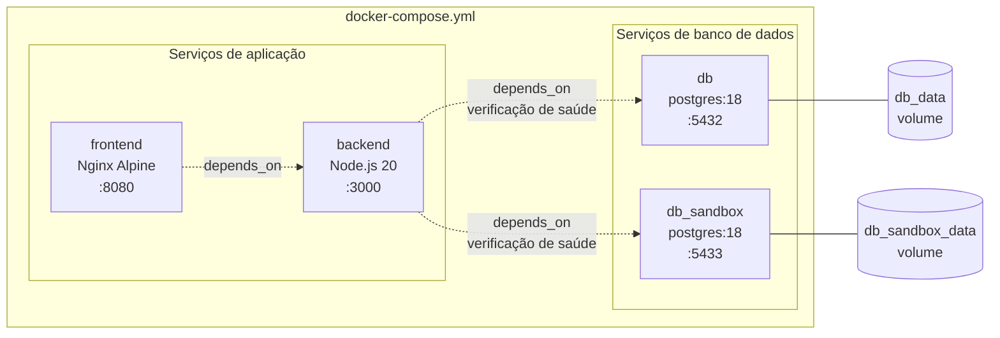
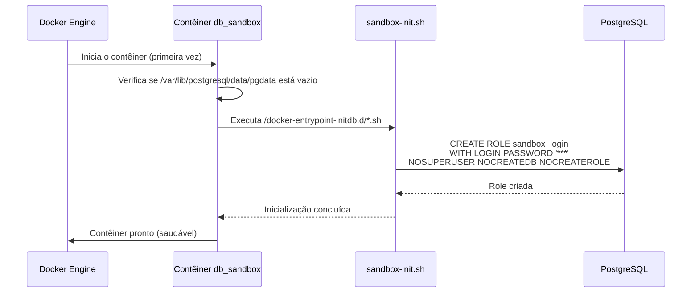
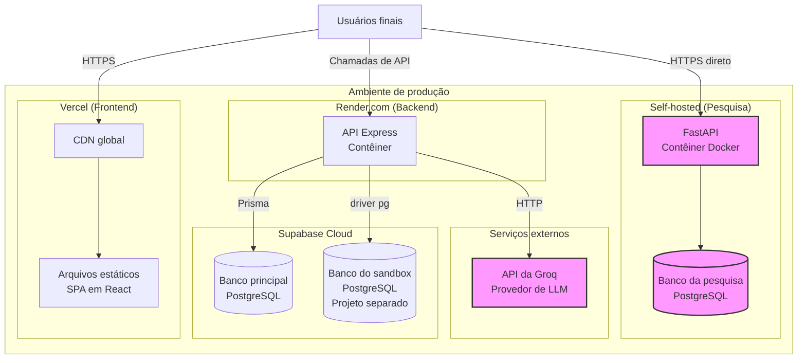
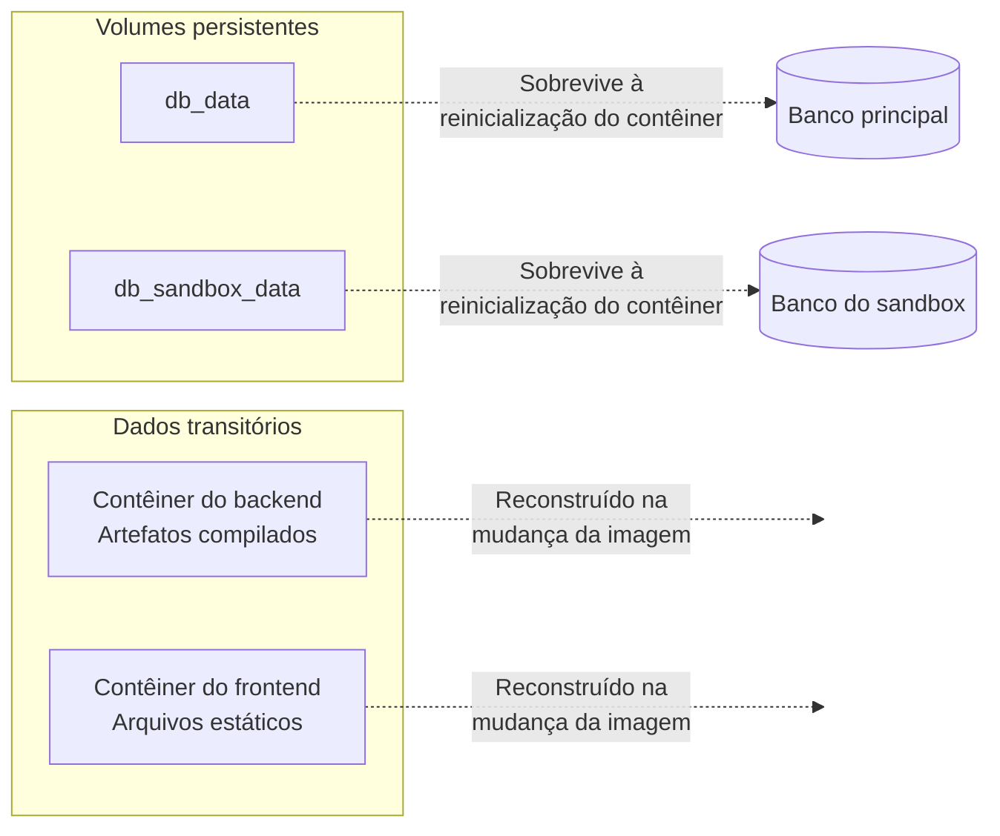

# Infraestrutura e pipeline de build

O módulo de infraestrutura oferece o ambiente completo de desenvolvimento e implantação em contêineres da IDE Web, incluindo a orquestração com Docker, builds multi-estágio, o provisionamento dos bancos de dados e a configuração do servidor web.

---

## Visão geral da arquitetura

O projeto IDE Web usa uma arquitetura de microsserviços em contêineres, com responsabilidades separadas para os dados da aplicação, a execução do sandbox SQL, a entrega do frontend e os serviços do backend.



### Principais decisões de arquitetura

1. **Separação de bancos de dados**: os dados principais da aplicação (usuários, exercícios, submissões) ficam isolados da execução do sandbox SQL dos alunos, para evitar escalonamento de privilégios e disputa por recursos.

2. **Builds multi-estágio**: tanto o backend quanto o frontend usam builds multi-estágio do Docker para reduzir o tamanho das imagens de produção e separar as dependências de build das de execução.

3. **Verificações de saúde**: os contêineres de banco de dados implementam verificações de saúde para garantir que os serviços dependentes esperem o banco ficar pronto antes de iniciar.

4. **Backend de pesquisa externo**: o backend de pesquisa em Python/FastAPI, para a coleta de dados do TCC, é hospedado por conta própria, à parte, e não está incluído neste repositório (veja [backend_pesquisa](backend_pesquisa.md) para os detalhes).

---

## Arquitetura de contêineres



### Definições dos serviços

#### db (banco principal)
- **Imagem**: `postgres:18`
- **Banco**: `ide_web`
- **Usuário**: `ide_app`
- **Porta**: `5432:5432`
- **Volume**: `db_data:/var/lib/postgresql/data`
- **Finalidade**: guarda todos os dados da aplicação por meio do ORM Prisma

**Verificação de saúde**:
```bash
pg_isready -U ide_app -d ide_web
# Intervalo: 5s, Timeout: 5s, Tentativas: 10
```

#### db_sandbox (banco do sandbox SQL)
- **Imagem**: `postgres:18`
- **Banco**: `ide_sandbox`
- **Usuário**: `ide_sandbox_admin`
- **Porta**: `5433:5432`
- **Volume**: `db_sandbox_data:/var/lib/postgresql/data`
- **Script de inicialização**: `sandbox-init.sh` (cria a role `sandbox_login`)
- **Finalidade**: ambiente de execução isolado para os exercícios de SQL dos alunos

**Configuração especial**:
- `PGDATA=/var/lib/postgresql/data/pgdata` - evita falsas falhas de inicialização em ambientes Podman rootless, em que os volumes podem conter `lost+found`
- Script de inicialização montado como somente leitura, com a marca `:z` do SELinux

**Verificação de saúde**:
```bash
pg_isready -U ide_sandbox_admin -d ide_sandbox
# Intervalo: 5s, Timeout: 5s, Tentativas: 10
```

#### backend (servidor da API)
- **Contexto de build**: `./ide-web-backend`
- **Runtime**: Node.js 20 Alpine
- **Porta**: `3000:3000`
- **Dependências**: espera os dois bancos ficarem saudáveis
- **Finalidade**: API REST que atende toda a lógica da aplicação

Veja [backend_build_config](backend_build_config.md) para os detalhes da configuração do TypeScript.

#### frontend (servidor web)
- **Contexto de build**: `./ide-web-front`
- **Runtime**: Nginx Alpine
- **Porta**: `8080:80`
- **Dependências**: espera o serviço de backend
- **Finalidade**: serve a SPA em React e os arquivos estáticos

Veja [frontend_build_config](frontend_build_config.md) para a configuração do Vite e os detalhes do build.

---

## Pipeline de build

```mermaid
graph TB
    subgraph "Build do backend (ide-web-backend/Dockerfile)"
        B1[Estágio: build<br/>node:20-alpine]
        B2[npm ci<br/>Instala todas as dependências]
        B3[prisma generate<br/>Gera o cliente]
        B4[tsc<br/>Compila o TypeScript]
        B5[Estágio: runtime<br/>node:20-alpine]
        B6[npm ci --omit=dev<br/>Só dependências de produção]
        B7[Copia dist/<br/>do estágio de build]
        
        B1 --> B2 --> B3 --> B4 --> B5 --> B6 --> B7
    end
    
    subgraph "Build do frontend (ide-web-front/Dockerfile)"
        F1[Estágio: build<br/>node:20-alpine]
        F2[npm ci<br/>Instala todas as dependências]
        F3[vite build<br/>Compila o app React]
        F4[Estágio: runtime<br/>nginx:alpine]
        F5[Copia dist/<br/>do estágio de build]
        F6[Copia o nginx.conf]
        
        F1 --> F2 --> F3 --> F4 --> F5 --> F6
    end
```



### Processo de build do backend

**Estágio de build** (`node:20-alpine`):
1. Copia o `package.json` e o `package-lock.json`
2. Executa `npm ci` (instalação limpa a partir do lockfile)
3. Copia o schema do Prisma e executa `npx prisma generate`
4. Copia a configuração do TypeScript e o código-fonte
5. Executa `npm run build` → `tsc -p tsconfig.json`

**Estágio de runtime** (`node:20-alpine`):
1. Define `NODE_ENV=production`
2. Instala apenas as dependências de produção por meio de `npm ci --omit=dev`
3. Copia o diretório `dist/` compilado do estágio de build
4. Expõe a porta 3000
5. Inicia com `node dist/server.js`

**Dependências principais**:
- `@prisma/client` + `@prisma/adapter-pg` - ORM de banco de dados com adaptador PostgreSQL
- `express` - framework web
- `jsonwebtoken` + `bcryptjs` - autenticação
- `pdfkit` - geração de PDF para os pacotes dos exercícios
- `pg` - driver PostgreSQL direto, para a execução no sandbox
- `zod` - validação de schemas

### Processo de build do frontend

**Estágio de build** (`node:20-alpine`):
1. Copia o `package.json` e o `package-lock.json`
2. Executa `npm ci` (instalação limpa a partir do lockfile)
3. Copia todos os arquivos-fonte
4. Injeta as variáveis de ambiente de tempo de build:
   - `VITE_API_URL` (padrão: `http://localhost:3000/api/v1`)
   - `VITE_RESEARCH_API_URL` (padrão: `http://localhost:8001`)
5. Executa `npm run build` → `tsc -b && vite build`

**Estágio de runtime** (`nginx:alpine`):
1. Copia os arquivos estáticos compilados de `dist/` para `/usr/share/nginx/html`
2. Copia o `nginx.conf` personalizado para `/etc/nginx/conf.d/default.conf`
3. Expõe a porta 80

**Dependências principais**:
- `react` + `react-dom` - framework de interface
- `vite` - ferramenta de build e servidor de desenvolvimento
- `@monaco-editor/react` - componente do editor de SQL
- `@xyflow/react` - editor de diagramas entidade-relacionamento
- `@tanstack/react-query` - gestão do estado do servidor
- `tailwindcss` - framework CSS utilitário

---

## Inicialização dos bancos de dados

### Instalação do banco do sandbox

O banco do sandbox exige uma inicialização especial para dar suporte à execução segura de SQL por aluno. Isso é feito pelo `ide-web-backend/scripts/sandbox-init.sh`, que executa uma única vez, na primeira inicialização do contêiner.



**Finalidade do sandbox-init.sh**:
- Cria a role `sandbox_login`, usada pela conexão de execução
- Essa role NÃO tem privilégios por padrão (nem mesmo acesso a schemas)
- Cada requisição faz um `SET ROLE exec_<usuario_id>` para assumir a identidade do aluno
- As roles de execução por aluno (`exec_<usuario_id>`) são criadas sob demanda pelo `SandboxProvisioningRepository`
- A role de provisionamento (o `POSTGRES_USER` deste contêiner) precisa do privilégio `CREATEROLE` em produção

**Por que separar as roles de provisionamento e de execução?**
- A role de provisionamento (`ide_sandbox_admin`) cria schemas e concede permissões
- A role de execução (`sandbox_login`) apenas se autentica e assume as identidades dos alunos por meio do `SET ROLE`
- Essa separação aplica o princípio do menor privilégio na execução em tempo de operação

Veja [backend_sandbox_sql](backend_sandbox_sql.md) para a arquitetura de segurança detalhada do sandbox.

---

## Configuração do Nginx

O contêiner do frontend usa uma configuração personalizada do Nginx, otimizada para o roteamento de aplicações de página única:

```nginx
server {
    listen 80;
    server_name _;
    root /usr/share/nginx/html;
    index index.html;

    location / {
        # Roteamento da SPA: todas as rotas recaem no index.html
        try_files $uri $uri/ /index.html;
    }

    location /assets/ {
        # Cache de longo prazo para arquivos com versão
        expires 1y;
        add_header Cache-Control "public, immutable";
    }
}
```

**Recursos principais**:
1. **Roteamento de reserva**: todas as requisições que não são de arquivos estáticos devolvem o `index.html`, permitindo o roteamento no cliente pelo React Router
2. **Cache dos arquivos estáticos**: os arquivos gerados com hash de conteúdo podem ser guardados em cache por 1 ano, como imutáveis
3. **Nome de servidor curinga**: aceita requisições para qualquer nome de host (útil para o desenvolvimento e a flexibilidade da implantação)

---

## Configuração de ambiente

### Variáveis de ambiente obrigatórias

Tanto o desenvolvimento quanto a produção exigem estas variáveis (veja o `.env.example` na raiz do repositório):

**Credenciais dos bancos de dados**:
```bash
DB_PASSWORD=<main_db_password>
SANDBOX_DB_PASSWORD=<sandbox_provisioning_password>
SANDBOX_EXEC_DB_PASSWORD=<sandbox_login_password>
```

**Segredos JWT**:
```bash
JWT_SECRET=<access_and_refresh_token_secret>
RESEARCH_JWT_SECRET=<research_backend_token_secret>
```

**Configuração da API**:
```bash
VITE_API_URL=<backend_api_base_url>          # Argumento de build do frontend
VITE_RESEARCH_API_URL=<research_api_url>     # Argumento de build do frontend
LLM_API_KEY=<groq_api_key>                   # Opcional: para as dicas de IA
```

### Desenvolvimento versus produção

| Aspecto | Desenvolvimento (docker-compose.yml) | Produção |
|--------|----------------------------------|------------|
| Frontend | Nginx em :8080 | CDN da Vercel |
| Backend | Express em :3000 | Render.com |
| Banco principal | PostgreSQL local :5432 | Supabase (projeto separado) |
| Banco do sandbox | PostgreSQL local :5433 | Supabase (projeto separado) |
| Backend de pesquisa | Externo (fora do compose) | Docker self-hosted + PostgreSQL |
| CORS | `http://localhost:8080` | Domínio da Vercel |
| SSL/TLS | Nenhum (HTTP) | Gerenciado pelos provedores de hospedagem |

**Inicialização do desenvolvimento local**:
```bash
# 1. Defina as variáveis de ambiente no .env
# 2. Inicie todos os serviços
docker compose up -d

# 3. Espere as verificações de saúde passarem
docker compose ps

# 4. Acesse a aplicação
# Frontend: http://localhost:8080
# Backend: http://localhost:3000
```

**Implantação em produção**:
- O frontend é compilado com as URLs de API de produção e implantado na Vercel
- O backend é implantado no Render, com o DATABASE_URL apontando para o Supabase
- O banco do sandbox usa um segundo projeto Supabase, com a criação manual da role `sandbox_login`
- O backend de pesquisa é implantado separadamente (veja a documentação específica da pesquisa)

---

## Arquitetura de implantação



### Características da implantação

**Frontend (Vercel)**:
- Builds automáticos a partir do repositório Git
- Distribuição por CDN global
- Compilado com os `VITE_API_URL` e `VITE_RESEARCH_API_URL` de produção
- Serve o HTML, JS e CSS estáticos gerados pelo Vite

**Backend (Render.com)**:
- Implantação em contêiner usando o `ide-web-backend/Dockerfile`
- Escalonamento automático conforme o tráfego
- Variáveis de ambiente injetadas em tempo de execução
- Conecta aos dois projetos Supabase

**Banco principal (Supabase)**:
- PostgreSQL gerenciado, com backups automáticos
- Usado por meio do ORM Prisma
- Migrações de schema gerenciadas pela CLI do Prisma
- Veja [backend_auth](backend_auth.md), [backend_exercicios](backend_exercicios.md) etc. para os detalhes do schema

**Banco do sandbox (Supabase - projeto separado)**:
- Isolado para evitar interferência no banco principal
- Exige a criação manual da role `sandbox_login` (equivalente ao `sandbox-init.sh`)
- Criação dinâmica de schemas por par aluno-exercício
- Uso direto do driver `pg` (fora do Prisma)

**Backend de pesquisa (self-hosted)**:
- **Não incluído neste repositório** (apenas para a coleta de dados do TCC)
- Python/FastAPI + Docker Compose
- Instância de PostgreSQL separada
- Hospedado por conta própria para atender aos requisitos de pesquisa com seres humanos (dados do TCLE)
- Veja `docs/decisions/fase4-pesquisa-python-sessao-aluno-login.md` para a justificativa

---

## Referência dos scripts de build

### Scripts do backend (`ide-web-backend/package.json`)

```json
{
  "scripts": {
    "dev": "tsx watch src/server.ts",        // Servidor de desenvolvimento com hot-reload
    "build": "tsc -p tsconfig.json",         // Compila o TypeScript para dist/
    "start": "node dist/server.js",          // Servidor de produção
    "test": "vitest run",                    // Executa os testes unitários
    "lint": "eslint .",                      // Verifica o código TypeScript
    "typecheck": "tsc -p tsconfig.json --noEmit && tsc -p tsconfig.tests.json --noEmit"
  }
}
```

### Scripts do frontend (`ide-web-front/package.json`)

```json
{
  "scripts": {
    "dev": "vite",                           // Servidor de desenvolvimento com HMR
    "build": "tsc -b && vite build",         // Verificação de tipos + build de produção
    "lint": "eslint .",                      // Verifica o código React/TypeScript
    "preview": "vite preview",               // Pré-visualiza o build de produção localmente
    "test": "vitest run",                    // Executa os testes unitários
    "test:watch": "vitest",                  // Executa os testes em modo de observação
    "e2e": "playwright test"                 // Executa os testes ponta a ponta
  }
}
```

---

## Persistência de dados

O sistema usa volumes nomeados do Docker para o armazenamento persistente de dados:



**Ciclo de vida dos volumes**:
- Os volumes persistem entre `docker compose down` e reinicializações de contêineres
- Para zerar os bancos: `docker compose down -v` (destrói todos os dados)
- Para preservar os dados e reconstruir os serviços: `docker compose up --build`

**Notas importantes**:
1. **Inicialização do volume do sandbox**: se o volume `db_sandbox_data` já existia antes das mudanças da Fase 12, ele precisa ser recriado para executar o `sandbox-init.sh` e criar a role `sandbox_login`:
   ```bash
   docker compose down -v db_sandbox
   docker compose up -d db_sandbox
   ```

2. **Persistência em produção**: em produção, o Supabase gerencia os backups e a persistência; os volumes do Docker servem apenas ao desenvolvimento local.

---

## Infraestrutura de testes

### Testes do backend
- **Framework**: Vitest
- **Ambiente**: Node.js (sem necessidade de simulação de navegador)
- **Configuração**: o `tsconfig.tests.json` inclui os arquivos de teste
- **Execução**: `npm test` ou `docker compose exec backend npm test`

### Testes do frontend

**Testes unitários**:
- **Framework**: Vitest + jsdom
- **Testes de interface**: React Testing Library
- **Configuração**: o `vite.config.ts` prepara o ambiente jsdom
- **Execução**: `npm test` ou `npm run test:watch`

**Testes ponta a ponta**:
- **Framework**: Playwright
- **Navegador**: Chrome (instalação do sistema)
- **Configuração**: `playwright.config.ts`
- **Execução**: `npm run e2e`
- **Escopo**: respostas de API simuladas, sem exigir backend real

Veja [frontend_build_config](frontend_build_config.md) para a configuração detalhada dos testes.

---

## Considerações de segurança

1. **Gestão de credenciais**:
   - Nunca versione arquivos `.env`
   - Use segredos diferentes no desenvolvimento e na produção
   - Troque o `JWT_SECRET` e o `RESEARCH_JWT_SECRET` de forma independente

2. **Isolamento dos bancos de dados**:
   - O banco do sandbox é fisicamente separado, para evitar contaminação cruzada
   - Cada aluno recebe um schema isolado: `sandbox_<exercicio_id>_<usuario_id>`
   - A role de execução (`sandbox_login`) tem privilégios mínimos

3. **Segurança dos contêineres**:
   - Os builds multi-estágio excluem as dependências de desenvolvimento das imagens de produção
   - Montagens somente leitura para os scripts de inicialização (marca `:ro`)
   - Usuário sem privilégios de root nas imagens Alpine (comportamento padrão da imagem do Node.js)

4. **Isolamento de rede**:
   - Os serviços se comunicam pela rede interna do Docker
   - Apenas o frontend e o backend expõem portas no host
   - As portas dos bancos são expostas apenas por conveniência no desenvolvimento

---

## Solução de problemas

### Problemas de conexão com o banco de dados

**Sintoma**: o backend não inicia, com "connection refused"

**Soluções**:
1. Verifique o estado de saúde: `docker compose ps`
2. Espere as verificações de saúde: os bancos levam de 5 a 10 segundos para ficar prontos
3. Confira as variáveis de ambiente: `docker compose config` mostra os valores resolvidos
4. Veja os logs: `docker compose logs db` ou `docker compose logs db_sandbox`

### Falhas na inicialização do sandbox

**Sintoma**: a role `sandbox_login` não existe

**Soluções**:
1. Garanta que o script de inicialização esteja montado corretamente:
   ```bash
   docker compose exec db_sandbox ls -la /docker-entrypoint-initdb.d/
   ```
2. Recrie o volume para disparar a reinicialização:
   ```bash
   docker compose down -v db_sandbox
   docker compose up -d db_sandbox
   ```
3. Crie a role manualmente, se necessário:
   ```sql
   CREATE ROLE sandbox_login WITH LOGIN PASSWORD '***' 
   NOSUPERUSER NOCREATEDB NOCREATEROLE;
   ```

### Falhas de build

**Sintoma**: o `npm ci` falha ou há erros de compilação do TypeScript

**Soluções**:
1. Limpe o cache de build: `docker compose build --no-cache backend`
2. Verifique a compatibilidade da versão do Node.js: exige Node 20+
3. Confira a divergência do package-lock.json: rode `npm install` localmente e versione as mudanças
4. Revise os logs de build: `docker compose build backend 2>&1 | tee build.log`

### O frontend não alcança o backend

**Sintoma**: as chamadas de API falham com erros de CORS ou de rede

**Soluções**:
1. Verifique se o `VITE_API_URL` está correto no `.env`
2. Confira se a configuração de CORS do backend corresponde à origem do frontend
3. Garanta que o backend esteja saudável: `curl http://localhost:3000/api/v1/health`
4. Reconstrua o frontend depois de mudanças de ambiente: `docker compose up --build frontend`

---

## Módulos relacionados

- **[backend_build_config](backend_build_config.md)** - configuração do TypeScript e do build do backend
- **[frontend_build_config](frontend_build_config.md)** - configuração de Vite, TypeScript e Playwright do frontend
- **[backend_core](backend_core.md)** - verificações de saúde e serviços básicos de infraestrutura
- **[backend_sandbox_sql](backend_sandbox_sql.md)** - execução do sandbox SQL e modelo de segurança
- **[backend_auth](backend_auth.md)** - fluxo de autenticação que exige os dois bancos

---

## Referências

- **Registros de decisão**:
  - [fase1-setup-tecnico.md](../../docs/decisions/fase1-setup-tecnico.md) - escolhas iniciais de infraestrutura
  - [fase2-sandbox-sql-diagrama-mer.md](../../docs/decisions/fase2-sandbox-sql-diagrama-mer.md) - arquitetura do banco do sandbox
  - [fase4-pesquisa-python-sessao-aluno-login.md](../../docs/decisions/fase4-pesquisa-python-sessao-aluno-login.md) - separação do backend de pesquisa
  - [fase12-sql-studio-bd2.md](../../docs/decisions/fase12-sql-studio-bd2.md) - arquitetura das roles de execução

- **Arquivos de configuração**:
  - `docker-compose.yml` - orquestração dos serviços
  - `ide-web-backend/Dockerfile` - definição do contêiner do backend
  - `ide-web-front/Dockerfile` - definição do contêiner do frontend
  - `ide-web-front/nginx.conf` - configuração do servidor web
  - `ide-web-backend/scripts/sandbox-init.sh` - inicialização do banco de dados

- **Documentação externa**:
  - [Referência do Docker Compose](https://docs.docker.com/compose/)
  - [Notas de versão do PostgreSQL 18](https://www.postgresql.org/docs/18/release-18.html)
  - [Guia de configuração do Nginx](https://nginx.org/en/docs/)
  - [Documentação de build do Vite](https://vitejs.dev/guide/build.html)
