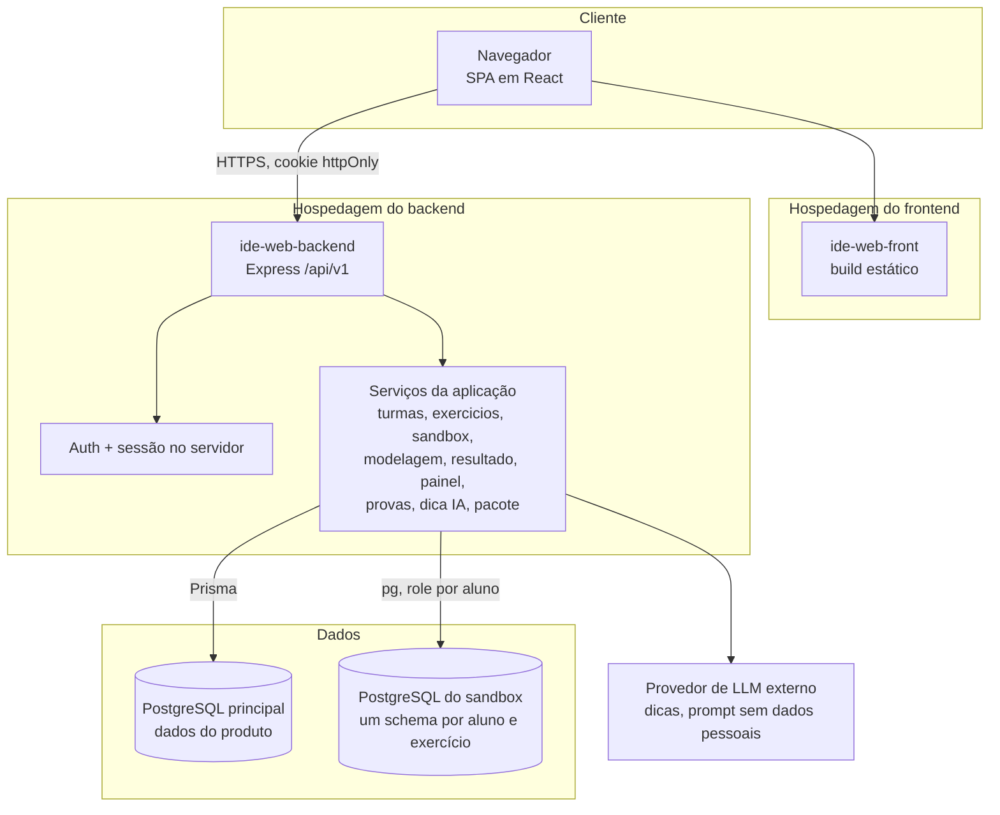
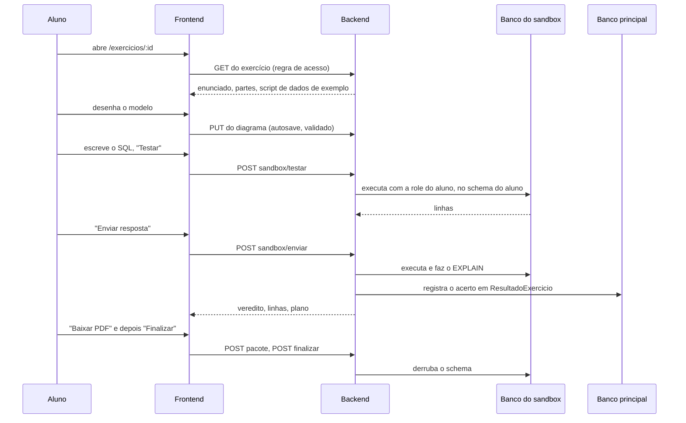

# IDE Web: Visão geral do repositório

A IDE Web é uma plataforma de ensino de **bancos de dados**, desenvolvida como TCC (trabalho de conclusão de curso) no IFPI. O professor cria turmas e exercícios; os alunos resolvem no navegador: **modelam** os dados (conceitual e lógico), **escrevem SQL** num sandbox isolado e só deles, e recebem correção automática, a explicação do plano de execução e dicas pedagógicas de IA. O professor conta com painéis, um modo prova e uma tela de revisão por aluno.

O repositório é um monorepo com duas aplicações e um ambiente Docker Compose. Toda a API fica sob o prefixo `/api/v1`.

| Parte | Stack | Onde |
|---|---|---|
| Backend | Node.js, Express, TypeScript, Prisma com `@prisma/adapter-pg` | `ide-web-backend/` |
| Frontend | React, TypeScript, Vite, TanStack Query, Tailwind | `ide-web-front/` |
| Banco principal | PostgreSQL (Supabase em produção) | schema em `ide-web-backend/prisma/schema.prisma` |
| Banco do sandbox SQL | Um PostgreSQL **separado**, com DDL dinâmico via `pg`, fora do Prisma | schemas `sandbox_<exercicio>_<usuario>` |
| Ambiente local | Docker Compose: banco principal, banco do sandbox, backend e frontend atrás do nginx | `docker-compose.yml` |

---

## Arquitetura do sistema

O `ide-web-backend` segue a **arquitetura em camadas MSC**: `routes → controllers → services → repositories`. O `ide-web-front` é organizado **por funcionalidade** (feature-based). Ambos estão documentados módulo a módulo abaixo.

---

## Mapa da documentação

### Infraestrutura e plataforma

| Documento | Cobre |
|---|---|
| [Infrastructure & Build Pipeline](Infrastructure_&_Build_Pipeline.md) | Docker Compose, builds multi-estágio, provisionamento dos bancos, configuração de build |
| [infrastructure](infrastructure.md), [backend_build_config](backend_build_config.md), [frontend_build_config](frontend_build_config.md) | As três partes do documento acima |
| [Backend Platform](Backend_Platform.md) | Padrão arquitetural, classes de erro e verificações de saúde |
| [backend_core](backend_core.md), [backend_errors](backend_errors.md) | Controller base e erros de domínio tipados |

### Serviços de aplicação do backend

Visão geral em [Backend Application Services](Backend_Application_Services.md).

| Módulo | Responsabilidade |
|---|---|
| [backend_auth](backend_auth.md) | Cadastro, login, sessões com estado |
| [backend_turmas](backend_turmas.md) | Turmas, matrícula, encerramento |
| [backend_exercicios](backend_exercicios.md) | Exercícios e o ponto único de acesso do aluno |
| [backend_modelagem](backend_modelagem.md) | Documentos de modelagem e geração de SQL |
| [backend_sandbox_sql](backend_sandbox_sql.md) | Execução isolada de SQL e correção automática |
| [backend_provas](backend_provas.md) | Variantes de prova e o sorteio |
| [backend_resultado](backend_resultado.md) | Resultados, revisão e liberação de nota |
| [backend_painel](backend_painel.md) | Painéis |
| [backend_dica_ia](backend_dica_ia.md) | Dicas de IA |
| [backend_pacote](backend_pacote.md) | Pacote em PDF e finalização |

### Aplicação frontend

Visão geral em [Frontend Application](Frontend_Application.md).

| Módulo | Responsabilidade |
|---|---|
| [frontend_shared](frontend_shared.md) | Cliente HTTP, rotas, guarda de acesso, tema, componentes de interface |
| [frontend_auth](frontend_auth.md) | Página inicial, login, cadastro |
| [frontend_turmas](frontend_turmas.md) | Gestão de turmas e matrícula |
| [frontend_exercicios](frontend_exercicios.md) | Área de trabalho do exercício, ferramentas de prova, revisão |
| [frontend_modelagem](frontend_modelagem.md) | Editores conceitual e lógico, conversão |
| [frontend_painel](frontend_painel.md) | Painéis e revisão por aluno |
| [frontend_dica_ia](frontend_dica_ia.md) | Botão de dica |

---

## O exercício de um aluno, de ponta a ponta

## Quem pode fazer o quê

| Papel | Conta | Áreas principais |
|---|---|---|
| `aluno` | e-mail e senha próprios | painel, exercícios, estudo livre (`/estudar`), matrícula pelo código da turma |
| `professor` | e-mail e senha próprios | turmas, exercícios e gabaritos, provas, matriz, revisão por aluno |
| `pesquisador` | conta única criada por script, sem autocadastro | tudo o que o professor faz, mais as ferramentas de pesquisa |

O código da turma é um **token de matrícula**, não uma credencial: o aluno entra na conta primeiro e usa o código uma única vez, permanecendo na turma até o professor encerrá-la.

## Principais decisões de projeto

- **Sessão no servidor.** O cookie carrega o id de uma sessão; ela termina após 6 horas, ou 1 hora de inatividade, ou no logout, que de fato a revoga. O frontend renova o token de acesso curto em segundo plano.
- **Um único ponto de acesso aos exercícios.** O `AcessoExercicioService` decide as permissões de leitura, entrega e teste: exercícios públicos, matrícula, turmas encerradas, prazos e envio único de questão de prova. Veja [Backend Application Services](Backend_Application_Services.md).
- **Isolamento do sandbox por aluno.** Cada aluno executa SQL sob uma role própria, no schema próprio, num banco separado dos dados do produto. Só o schema do estudo livre permite `CREATE`.
- **Lógica pura, espelhada nos dois lados.** O schema do documento de modelagem, o gerador de SQL e a normalização de identificadores existem na mesma forma no frontend e no backend, com os mesmos casos de teste.
- **Dois níveis de modelagem.** Conceitual (Chen) e lógico, com uma conversão assistida que pergunta ao aluno apenas o que o modelo não decide sozinho (relacionamentos 1:1 e especializações).
- **Notas de 0,0 a 10,0.** O SQL é corrigido automaticamente comparando conjuntos de resultado, ignorando a ordem; modelagem e dissertativa são corrigidas pelo professor.
- **Dissuasão, não controle.** O bloqueio de cópia durante a prova detém o aluno desatento, não quem usa outro dispositivo, e o texto do projeto não afirma o contrário.
- **O aluno vê só a si mesmo.** O painel do aluno não tem média da turma, ranking nem nome de colegas.
- **Dicas de IA sem dados pessoais.** O prompt leva o resumo do modelo, o SQL gerado e a consulta, sem qualquer identificação do participante.

## Convenções

- Backend: erros de domínio em português (chegam ao usuário), Zod na borda, verificação de posse no serviço, leituras em lote para agregados.
- Frontend: importar outra feature apenas pelo `index.ts` dela (com uma exceção documentada para páginas pesadas), estado de servidor no TanStack Query, tabelas reais e rótulos de texto para acessibilidade.
- A API responde `{ data?, error?: { code, message } }`.

## Código exclusivo da pesquisa

Parte do repositório existe apenas para o período de coleta de dados do TCC e é removida pelo autor depois, antes de o projeto servir como a ferramenta real do IFPI: o fluxo de pesquisa (consentimento, sorteio de grupos, questionários de usabilidade e carga de trabalho), suas telas e seus endpoints no Node. Ele é mantido fácil de remover e não faz parte do produto descrito acima.
